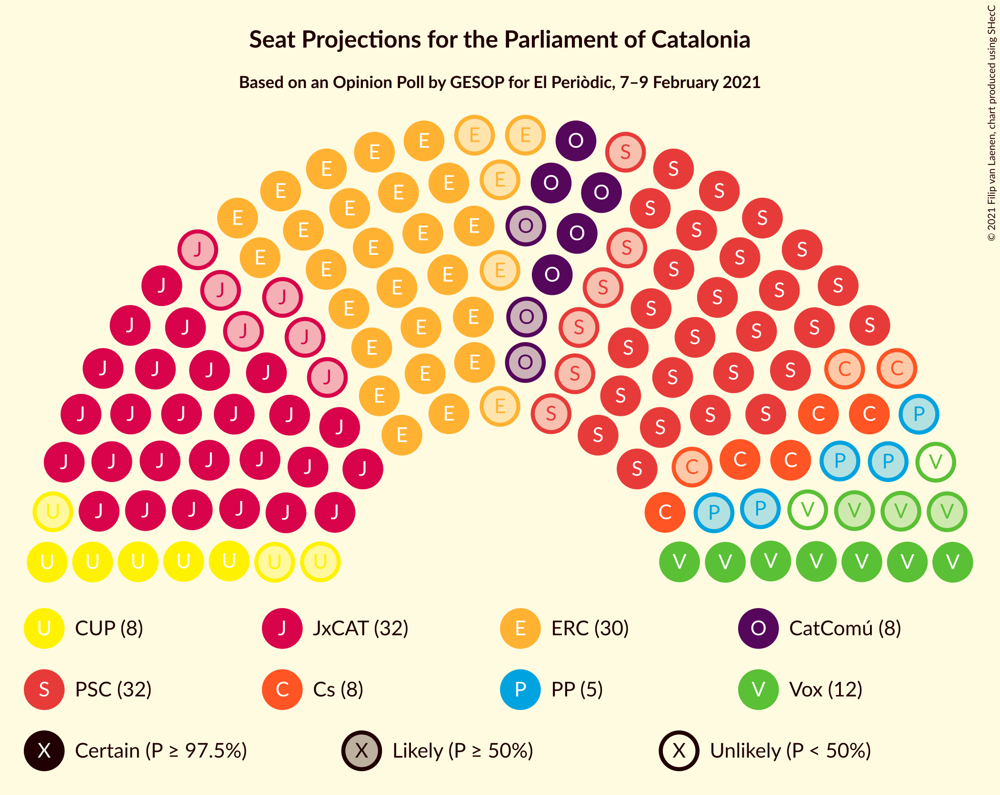

# Opinion Poll by GESOP for El Periòdic, 7–9 February 2021

<a href="#voting-intentions">Voting Intentions</a> | <a href="#seats">Seats</a> | <a href="#coalitions">Coalitions</a> | <a href="#technical-information">Technical Information</a>

## Voting Intentions

### Confidence Intervals

| Party | Last Result | Poll Result | 80% Confidence Interval | 90% Confidence Interval | 95% Confidence Interval | 99% Confidence Interval |
|:-----:|:-----------:|:-----------:|:-----------------------:|:-----------------------:|:-----------------------:|:-----------------------:|
| Partit dels Socialistes de Catalunya (PSC-PSOE) | 13.9% | 23.0% | 20.5–25.8% |19.8–26.6% |19.2–27.3% |18.1–28.6% |
| Esquerra Republicana–Catalunya Sí | 21.4% | 20.1% | 17.8–22.8% |17.1–23.6% |16.6–24.2% |15.5–25.6% |
| Junts per Catalunya | 21.7% | 19.9% | 17.6–22.6% |16.9–23.3% |16.4–24.0% |15.3–25.3% |
| Vox | 0.0% | 7.8% | 6.4–9.8% |6.0–10.3% |5.6–10.8% |5.0–11.8% |
| Catalunya en Comú–Podem | 7.5% | 6.9% | 5.5–8.7% |5.1–9.2% |4.8–9.7% |4.3–10.7% |
| Ciutadans–Partido de la Ciudadanía | 25.4% | 6.4% | 5.1–8.2% |4.7–8.7% |4.4–9.2% |3.9–10.1% |
| Candidatura d’Unitat Popular | 4.5% | 6.4% | 5.1–8.2% |4.7–8.7% |4.4–9.2% |3.9–10.1% |
| Partit Popular | 4.2% | 4.5% | 3.4–6.1% |3.2–6.5% |2.9–6.9% |2.5–7.8% |
| Partit Demòcrata Europeu Català | 0.0% | 2.1% | 1.5–3.3% |1.3–3.7% |1.1–4.0% |0.9–4.7% |

*Note:* The poll result column reflects the actual value used in the calculations. Published results may vary slightly, and in addition be rounded to fewer digits.

## Seats

### Confidence Intervals

| Party | Last Result | Median | 80% Confidence Interval | 90% Confidence Interval | 95% Confidence Interval | 99% Confidence Interval |
|:-----:|:-----------:|:------:|:-----------------------:|:-----------------------:|:-----------------------:|:-----------------------:|
| <a href="#partit-dels-socialistes-de-catalunya-(psc-psoe)">Partit dels Socialistes de Catalunya (PSC-PSOE)</a> | 17 | 32 | 28–36 |27–38 |26–38 |25–40 |
| <a href="#esquerra-republicana–catalunya-sí">Esquerra Republicana–Catalunya Sí</a> | 32 | 30 | 27–34 |26–35 |25–37 |23–39 |
| <a href="#junts-per-catalunya">Junts per Catalunya</a> | 34 | 32 | 29–37 |27–38 |26–39 |24–41 |
| <a href="#vox">Vox</a> | 0 | 10 | 8–13 |7–14 |7–14 |6–15 |
| <a href="#catalunya-en-comú–podem">Catalunya en Comú–Podem</a> | 8 | 8 | 5–10 |5–11 |5–11 |4–13 |
| <a href="#ciutadans–partido-de-la-ciudadanía">Ciutadans–Partido de la Ciudadanía</a> | 36 | 8 | 5–11 |5–12 |5–12 |3–13 |
| <a href="#candidatura-d’unitat-popular">Candidatura d’Unitat Popular</a> | 4 | 8 | 7–11 |6–11 |5–12 |4–14 |
| <a href="#partit-popular">Partit Popular</a> | 4 | 5 | 3–7 |2–8 |0–9 |0–10 |
| <a href="#partit-demòcrata-europeu-català">Partit Demòcrata Europeu Català</a> | 0 | 0 | 0–1 |0–4 |0–5 |0–6 |

### Partit dels Socialistes de Catalunya (PSC-PSOE)

*For a full overview of the results for this party, see the [Partit dels Socialistes de Catalunya (PSC-PSOE)](party-partitdelssocialistesdecatalunyapsc-psoe.html) page.*

| Number of Seats | Probability | Accumulated | Special Marks |
|:---------------:|:-----------:|:-----------:|:-------------:|
| 17 | 0% | 100% | Last Result |
| 18 | 0% | 100% |  |
| 19 | 0% | 100% |  |
| 20 | 0% | 100% |  |
| 21 | 0% | 100% |  |
| 22 | 0% | 100% |  |
| 23 | 0% | 100% |  |
| 24 | 0.2% | 99.9% |  |
| 25 | 1.0% | 99.7% |  |
| 26 | 2% | 98.7% |  |
| 27 | 5% | 96% |  |
| 28 | 4% | 92% |  |
| 29 | 9% | 88% |  |
| 30 | 8% | 78% |  |
| 31 | 16% | 70% |  |
| 32 | 14% | 53% | Median |
| 33 | 7% | 40% |  |
| 34 | 8% | 33% |  |
| 35 | 5% | 25% |  |
| 36 | 10% | 20% |  |
| 37 | 5% | 10% |  |
| 38 | 3% | 5% |  |
| 39 | 0.8% | 2% |  |
| 40 | 0.5% | 0.8% |  |
| 41 | 0.1% | 0.3% |  |
| 42 | 0.1% | 0.1% |  |
| 43 | 0% | 0.1% |  |
| 44 | 0% | 0% |  |

### Esquerra Republicana–Catalunya Sí

*For a full overview of the results for this party, see the [Esquerra Republicana–Catalunya Sí](party-esquerrarepublicana–catalunyasí.html) page.*

| Number of Seats | Probability | Accumulated | Special Marks |
|:---------------:|:-----------:|:-----------:|:-------------:|
| 21 | 0.1% | 100% |  |
| 22 | 0.3% | 99.9% |  |
| 23 | 0.6% | 99.6% |  |
| 24 | 1.2% | 98.9% |  |
| 25 | 3% | 98% |  |
| 26 | 5% | 95% |  |
| 27 | 6% | 90% |  |
| 28 | 13% | 84% |  |
| 29 | 11% | 71% |  |
| 30 | 16% | 60% | Median |
| 31 | 12% | 44% |  |
| 32 | 10% | 32% | Last Result |
| 33 | 8% | 23% |  |
| 34 | 5% | 15% |  |
| 35 | 5% | 10% |  |
| 36 | 2% | 5% |  |
| 37 | 1.2% | 3% |  |
| 38 | 0.5% | 1.4% |  |
| 39 | 0.5% | 0.8% |  |
| 40 | 0.1% | 0.3% |  |
| 41 | 0.1% | 0.2% |  |
| 42 | 0% | 0.1% |  |
| 43 | 0% | 0% |  |

### Junts per Catalunya

*For a full overview of the results for this party, see the [Junts per Catalunya](party-juntspercatalunya.html) page.*

| Number of Seats | Probability | Accumulated | Special Marks |
|:---------------:|:-----------:|:-----------:|:-------------:|
| 23 | 0.3% | 100% |  |
| 24 | 0.5% | 99.7% |  |
| 25 | 1.3% | 99.2% |  |
| 26 | 1.2% | 98% |  |
| 27 | 3% | 97% |  |
| 28 | 1.5% | 94% |  |
| 29 | 11% | 92% |  |
| 30 | 7% | 81% |  |
| 31 | 14% | 74% |  |
| 32 | 11% | 60% | Median |
| 33 | 7% | 49% |  |
| 34 | 9% | 42% | Last Result |
| 35 | 12% | 33% |  |
| 36 | 7% | 21% |  |
| 37 | 8% | 14% |  |
| 38 | 2% | 5% |  |
| 39 | 2% | 3% |  |
| 40 | 0.5% | 1.2% |  |
| 41 | 0.3% | 0.7% |  |
| 42 | 0.3% | 0.4% |  |
| 43 | 0.1% | 0.1% |  |
| 44 | 0% | 0% |  |

### Vox

*For a full overview of the results for this party, see the [Vox](party-vox.html) page.*

| Number of Seats | Probability | Accumulated | Special Marks |
|:---------------:|:-----------:|:-----------:|:-------------:|
| 0 | 0% | 100% | Last Result |
| 1 | 0% | 100% |  |
| 2 | 0% | 100% |  |
| 3 | 0% | 100% |  |
| 4 | 0% | 100% |  |
| 5 | 0.3% | 100% |  |
| 6 | 0.8% | 99.6% |  |
| 7 | 9% | 98.8% |  |
| 8 | 6% | 90% |  |
| 9 | 17% | 84% |  |
| 10 | 23% | 68% | Median |
| 11 | 9% | 45% |  |
| 12 | 21% | 36% |  |
| 13 | 5% | 15% |  |
| 14 | 8% | 10% |  |
| 15 | 2% | 2% |  |
| 16 | 0.2% | 0.4% |  |
| 17 | 0.1% | 0.2% |  |
| 18 | 0% | 0.1% |  |
| 19 | 0% | 0% |  |

### Catalunya en Comú–Podem

*For a full overview of the results for this party, see the [Catalunya en Comú–Podem](party-catalunyaencomú–podem.html) page.*

| Number of Seats | Probability | Accumulated | Special Marks |
|:---------------:|:-----------:|:-----------:|:-------------:|
| 3 | 0.1% | 100% |  |
| 4 | 2% | 99.9% |  |
| 5 | 9% | 98% |  |
| 6 | 4% | 89% |  |
| 7 | 22% | 85% |  |
| 8 | 34% | 63% | Last Result, Median |
| 9 | 14% | 30% |  |
| 10 | 7% | 15% |  |
| 11 | 6% | 8% |  |
| 12 | 0.6% | 2% |  |
| 13 | 0.8% | 1.2% |  |
| 14 | 0.2% | 0.3% |  |
| 15 | 0.1% | 0.1% |  |
| 16 | 0% | 0% |  |

### Ciutadans–Partido de la Ciudadanía

*For a full overview of the results for this party, see the [Ciutadans–Partido de la Ciudadanía](party-ciutadans–partidodelaciudadanía.html) page.*

| Number of Seats | Probability | Accumulated | Special Marks |
|:---------------:|:-----------:|:-----------:|:-------------:|
| 3 | 0.9% | 100% |  |
| 4 | 0.4% | 99.1% |  |
| 5 | 10% | 98.7% |  |
| 6 | 17% | 89% |  |
| 7 | 17% | 71% |  |
| 8 | 31% | 55% | Median |
| 9 | 8% | 24% |  |
| 10 | 5% | 15% |  |
| 11 | 4% | 11% |  |
| 12 | 5% | 6% |  |
| 13 | 0.9% | 1.1% |  |
| 14 | 0.2% | 0.2% |  |
| 15 | 0% | 0% |  |
| 16 | 0% | 0% |  |
| 17 | 0% | 0% |  |
| 18 | 0% | 0% |  |
| 19 | 0% | 0% |  |
| 20 | 0% | 0% |  |
| 21 | 0% | 0% |  |
| 22 | 0% | 0% |  |
| 23 | 0% | 0% |  |
| 24 | 0% | 0% |  |
| 25 | 0% | 0% |  |
| 26 | 0% | 0% |  |
| 27 | 0% | 0% |  |
| 28 | 0% | 0% |  |
| 29 | 0% | 0% |  |
| 30 | 0% | 0% |  |
| 31 | 0% | 0% |  |
| 32 | 0% | 0% |  |
| 33 | 0% | 0% |  |
| 34 | 0% | 0% |  |
| 35 | 0% | 0% |  |
| 36 | 0% | 0% | Last Result |

### Candidatura d’Unitat Popular

*For a full overview of the results for this party, see the [Candidatura d’Unitat Popular](party-candidaturad’unitatpopular.html) page.*

| Number of Seats | Probability | Accumulated | Special Marks |
|:---------------:|:-----------:|:-----------:|:-------------:|
| 2 | 0% | 100% |  |
| 3 | 0.3% | 99.9% |  |
| 4 | 2% | 99.7% | Last Result |
| 5 | 1.4% | 98% |  |
| 6 | 2% | 97% |  |
| 7 | 15% | 94% |  |
| 8 | 38% | 79% | Median |
| 9 | 20% | 41% |  |
| 10 | 9% | 21% |  |
| 11 | 9% | 12% |  |
| 12 | 1.4% | 4% |  |
| 13 | 1.3% | 2% |  |
| 14 | 0.6% | 1.1% |  |
| 15 | 0.4% | 0.5% |  |
| 16 | 0% | 0.1% |  |
| 17 | 0% | 0% |  |

### Partit Popular

*For a full overview of the results for this party, see the [Partit Popular](party-partitpopular.html) page.*

| Number of Seats | Probability | Accumulated | Special Marks |
|:---------------:|:-----------:|:-----------:|:-------------:|
| 0 | 3% | 100% |  |
| 1 | 0% | 97% |  |
| 2 | 3% | 97% |  |
| 3 | 29% | 94% |  |
| 4 | 9% | 65% | Last Result |
| 5 | 20% | 56% | Median |
| 6 | 14% | 37% |  |
| 7 | 16% | 22% |  |
| 8 | 2% | 7% |  |
| 9 | 3% | 4% |  |
| 10 | 0.8% | 1.2% |  |
| 11 | 0.2% | 0.4% |  |
| 12 | 0.1% | 0.1% |  |
| 13 | 0% | 0% |  |

### Partit Demòcrata Europeu Català

*For a full overview of the results for this party, see the [Partit Demòcrata Europeu Català](party-partitdemòcrataeuropeucatalà.html) page.*

| Number of Seats | Probability | Accumulated | Special Marks |
|:---------------:|:-----------:|:-----------:|:-------------:|
| 0 | 73% | 100% | Last Result, Median |
| 1 | 17% | 27% |  |
| 2 | 1.3% | 9% |  |
| 3 | 2% | 8% |  |
| 4 | 2% | 6% |  |
| 5 | 2% | 4% |  |
| 6 | 1.2% | 1.4% |  |
| 7 | 0.2% | 0.2% |  |
| 8 | 0.1% | 0.1% |  |
| 9 | 0% | 0% |  |

## Coalitions

### Confidence Intervals

| Coalition | Last Result | Median | Majority? | 80% Confidence Interval | 90% Confidence Interval | 95% Confidence Interval | 99% Confidence Interval |
|:---------:|:-----------:|:------:|:---------:|:-----------------------:|:-----------------------:|:-----------------------:|:-----------------------:|
| Esquerra Republicana–Catalunya Sí – Junts per Catalunya – Candidatura d’Unitat Popular | 70 | 72 | 84% | 66–76 | 65–78 | 64–79 | 62–81 |
| Esquerra Republicana–Catalunya Sí – Junts per Catalunya – Candidatura d’Unitat Popular – Partit Demòcrata Europeu Català | 70 | 72 | 87% | 67–77 | 66–78 | 64–79 | 62–81 |
| Esquerra Republicana–Catalunya Sí – Junts per Catalunya – Catalunya en Comú–Podem | 74 | 71 | 80% | 66–76 | 64–77 | 63–78 | 61–81 |
| Partit dels Socialistes de Catalunya (PSC-PSOE) – Esquerra Republicana–Catalunya Sí – Catalunya en Comú–Podem | 57 | 70 | 78% | 66–75 | 64–76 | 63–77 | 60–80 |
| Esquerra Republicana–Catalunya Sí – Junts per Catalunya | 66 | 63 | 13% | 58–68 | 57–69 | 56–71 | 53–72 |
| Esquerra Republicana–Catalunya Sí – Junts per Catalunya – Partit Demòcrata Europeu Català | 66 | 63 | 16% | 58–68 | 57–69 | 56–71 | 53–73 |
| Partit dels Socialistes de Catalunya (PSC-PSOE) – Vox – Ciutadans–Partido de la Ciudadanía – Partit Popular | 57 | 55 | 0.1% | 50–60 | 49–62 | 48–63 | 45–65 |
| Partit dels Socialistes de Catalunya (PSC-PSOE) – Catalunya en Comú–Podem – Ciutadans–Partido de la Ciudadanía – Partit Popular | 65 | 52 | 0% | 48–57 | 46–59 | 46–60 | 44–62 |
| Partit dels Socialistes de Catalunya (PSC-PSOE) – Ciutadans–Partido de la Ciudadanía – Partit Popular | 57 | 44 | 0% | 40–49 | 39–51 | 37–52 | 36–54 |
| Esquerra Republicana–Catalunya Sí – Catalunya en Comú–Podem | 40 | 38 | 0% | 34–42 | 33–44 | 32–46 | 30–49 |

### Esquerra Republicana–Catalunya Sí – Junts per Catalunya – Candidatura d’Unitat Popular

| Number of Seats | Probability | Accumulated | Special Marks |
|:---------------:|:-----------:|:-----------:|:-------------:|
| 59 | 0.1% | 100% |  |
| 60 | 0.1% | 99.9% |  |
| 61 | 0.3% | 99.8% |  |
| 62 | 0.8% | 99.6% |  |
| 63 | 0.9% | 98.8% |  |
| 64 | 1.4% | 98% |  |
| 65 | 3% | 96% |  |
| 66 | 4% | 94% |  |
| 67 | 6% | 90% |  |
| 68 | 5% | 84% | Majority |
| 69 | 9% | 78% |  |
| 70 | 10% | 69% | Last Result, Median |
| 71 | 9% | 59% |  |
| 72 | 11% | 50% |  |
| 73 | 9% | 40% |  |
| 74 | 9% | 31% |  |
| 75 | 6% | 22% |  |
| 76 | 8% | 16% |  |
| 77 | 3% | 8% |  |
| 78 | 1.2% | 5% |  |
| 79 | 3% | 4% |  |
| 80 | 0.4% | 1.2% |  |
| 81 | 0.4% | 0.7% |  |
| 82 | 0.2% | 0.3% |  |
| 83 | 0% | 0.1% |  |
| 84 | 0% | 0.1% |  |
| 85 | 0% | 0% |  |

### Esquerra Republicana–Catalunya Sí – Junts per Catalunya – Candidatura d’Unitat Popular – Partit Demòcrata Europeu Català

| Number of Seats | Probability | Accumulated | Special Marks |
|:---------------:|:-----------:|:-----------:|:-------------:|
| 60 | 0.1% | 100% |  |
| 61 | 0.1% | 99.9% |  |
| 62 | 0.6% | 99.8% |  |
| 63 | 0.4% | 99.2% |  |
| 64 | 1.4% | 98.8% |  |
| 65 | 1.5% | 97% |  |
| 66 | 4% | 96% |  |
| 67 | 6% | 92% |  |
| 68 | 5% | 87% | Majority |
| 69 | 6% | 82% |  |
| 70 | 11% | 76% | Last Result, Median |
| 71 | 9% | 65% |  |
| 72 | 12% | 56% |  |
| 73 | 8% | 44% |  |
| 74 | 10% | 36% |  |
| 75 | 7% | 26% |  |
| 76 | 9% | 19% |  |
| 77 | 4% | 10% |  |
| 78 | 1.5% | 6% |  |
| 79 | 2% | 5% |  |
| 80 | 1.2% | 2% |  |
| 81 | 0.5% | 1.0% |  |
| 82 | 0.3% | 0.5% |  |
| 83 | 0.1% | 0.2% |  |
| 84 | 0.1% | 0.1% |  |
| 85 | 0% | 0% |  |

### Esquerra Republicana–Catalunya Sí – Junts per Catalunya – Catalunya en Comú–Podem

| Number of Seats | Probability | Accumulated | Special Marks |
|:---------------:|:-----------:|:-----------:|:-------------:|
| 58 | 0% | 100% |  |
| 59 | 0.1% | 99.9% |  |
| 60 | 0.3% | 99.8% |  |
| 61 | 0.5% | 99.5% |  |
| 62 | 0.8% | 99.0% |  |
| 63 | 0.8% | 98% |  |
| 64 | 3% | 97% |  |
| 65 | 3% | 94% |  |
| 66 | 6% | 91% |  |
| 67 | 5% | 85% |  |
| 68 | 7% | 80% | Majority |
| 69 | 9% | 73% |  |
| 70 | 8% | 63% | Median |
| 71 | 9% | 55% |  |
| 72 | 11% | 46% |  |
| 73 | 9% | 35% |  |
| 74 | 8% | 26% | Last Result |
| 75 | 6% | 18% |  |
| 76 | 6% | 12% |  |
| 77 | 3% | 6% |  |
| 78 | 2% | 4% |  |
| 79 | 0.9% | 2% |  |
| 80 | 0.4% | 1.0% |  |
| 81 | 0.4% | 0.6% |  |
| 82 | 0.1% | 0.2% |  |
| 83 | 0.1% | 0.1% |  |
| 84 | 0% | 0% |  |

### Partit dels Socialistes de Catalunya (PSC-PSOE) – Esquerra Republicana–Catalunya Sí – Catalunya en Comú–Podem

| Number of Seats | Probability | Accumulated | Special Marks |
|:---------------:|:-----------:|:-----------:|:-------------:|
| 57 | 0% | 100% | Last Result |
| 58 | 0% | 100% |  |
| 59 | 0.1% | 99.9% |  |
| 60 | 0.3% | 99.8% |  |
| 61 | 0.3% | 99.5% |  |
| 62 | 0.8% | 99.2% |  |
| 63 | 2% | 98% |  |
| 64 | 2% | 97% |  |
| 65 | 2% | 95% |  |
| 66 | 6% | 92% |  |
| 67 | 8% | 87% |  |
| 68 | 9% | 78% | Majority |
| 69 | 13% | 69% |  |
| 70 | 8% | 56% | Median |
| 71 | 12% | 48% |  |
| 72 | 8% | 36% |  |
| 73 | 10% | 28% |  |
| 74 | 4% | 18% |  |
| 75 | 5% | 14% |  |
| 76 | 5% | 9% |  |
| 77 | 2% | 4% |  |
| 78 | 0.9% | 2% |  |
| 79 | 0.4% | 1.2% |  |
| 80 | 0.4% | 0.8% |  |
| 81 | 0.3% | 0.4% |  |
| 82 | 0% | 0.1% |  |
| 83 | 0% | 0.1% |  |
| 84 | 0% | 0% |  |

### Esquerra Republicana–Catalunya Sí – Junts per Catalunya

| Number of Seats | Probability | Accumulated | Special Marks |
|:---------------:|:-----------:|:-----------:|:-------------:|
| 50 | 0% | 100% |  |
| 51 | 0.1% | 99.9% |  |
| 52 | 0.2% | 99.9% |  |
| 53 | 0.4% | 99.6% |  |
| 54 | 1.0% | 99.3% |  |
| 55 | 0.6% | 98% |  |
| 56 | 2% | 98% |  |
| 57 | 4% | 95% |  |
| 58 | 5% | 92% |  |
| 59 | 7% | 87% |  |
| 60 | 7% | 80% |  |
| 61 | 8% | 73% |  |
| 62 | 9% | 65% | Median |
| 63 | 11% | 56% |  |
| 64 | 11% | 45% |  |
| 65 | 6% | 34% |  |
| 66 | 10% | 28% | Last Result |
| 67 | 5% | 18% |  |
| 68 | 8% | 13% | Majority |
| 69 | 2% | 5% |  |
| 70 | 0.8% | 3% |  |
| 71 | 2% | 3% |  |
| 72 | 0.5% | 0.8% |  |
| 73 | 0.2% | 0.4% |  |
| 74 | 0.2% | 0.2% |  |
| 75 | 0% | 0.1% |  |
| 76 | 0% | 0% |  |

### Esquerra Republicana–Catalunya Sí – Junts per Catalunya – Partit Demòcrata Europeu Català

| Number of Seats | Probability | Accumulated | Special Marks |
|:---------------:|:-----------:|:-----------:|:-------------:|
| 51 | 0% | 100% |  |
| 52 | 0.2% | 99.9% |  |
| 53 | 0.3% | 99.8% |  |
| 54 | 0.5% | 99.5% |  |
| 55 | 0.7% | 99.0% |  |
| 56 | 1.3% | 98% |  |
| 57 | 3% | 97% |  |
| 58 | 5% | 94% |  |
| 59 | 4% | 89% |  |
| 60 | 9% | 85% |  |
| 61 | 6% | 77% |  |
| 62 | 9% | 71% | Median |
| 63 | 12% | 62% |  |
| 64 | 11% | 50% |  |
| 65 | 6% | 39% |  |
| 66 | 12% | 33% | Last Result |
| 67 | 5% | 21% |  |
| 68 | 9% | 16% | Majority |
| 69 | 3% | 7% |  |
| 70 | 2% | 5% |  |
| 71 | 1.3% | 3% |  |
| 72 | 1.2% | 2% |  |
| 73 | 0.2% | 0.6% |  |
| 74 | 0.2% | 0.4% |  |
| 75 | 0.1% | 0.1% |  |
| 76 | 0% | 0.1% |  |
| 77 | 0% | 0% |  |

### Partit dels Socialistes de Catalunya (PSC-PSOE) – Vox – Ciutadans–Partido de la Ciudadanía – Partit Popular

| Number of Seats | Probability | Accumulated | Special Marks |
|:---------------:|:-----------:|:-----------:|:-------------:|
| 43 | 0.1% | 100% |  |
| 44 | 0.1% | 99.9% |  |
| 45 | 0.3% | 99.8% |  |
| 46 | 0.6% | 99.5% |  |
| 47 | 0.9% | 98.9% |  |
| 48 | 2% | 98% |  |
| 49 | 2% | 96% |  |
| 50 | 5% | 94% |  |
| 51 | 5% | 89% |  |
| 52 | 10% | 84% |  |
| 53 | 8% | 74% |  |
| 54 | 12% | 66% |  |
| 55 | 9% | 54% | Median |
| 56 | 11% | 45% |  |
| 57 | 7% | 34% | Last Result |
| 58 | 9% | 27% |  |
| 59 | 4% | 18% |  |
| 60 | 5% | 14% |  |
| 61 | 4% | 9% |  |
| 62 | 2% | 5% |  |
| 63 | 2% | 3% |  |
| 64 | 0.4% | 1.1% |  |
| 65 | 0.3% | 0.8% |  |
| 66 | 0.3% | 0.5% |  |
| 67 | 0.1% | 0.1% |  |
| 68 | 0% | 0.1% | Majority |
| 69 | 0% | 0% |  |

### Partit dels Socialistes de Catalunya (PSC-PSOE) – Catalunya en Comú–Podem – Ciutadans–Partido de la Ciudadanía – Partit Popular

| Number of Seats | Probability | Accumulated | Special Marks |
|:---------------:|:-----------:|:-----------:|:-------------:|
| 41 | 0.1% | 100% |  |
| 42 | 0.1% | 99.9% |  |
| 43 | 0.2% | 99.8% |  |
| 44 | 0.6% | 99.6% |  |
| 45 | 0.9% | 99.0% |  |
| 46 | 3% | 98% |  |
| 47 | 2% | 95% |  |
| 48 | 5% | 92% |  |
| 49 | 5% | 88% |  |
| 50 | 12% | 82% |  |
| 51 | 13% | 70% |  |
| 52 | 10% | 57% |  |
| 53 | 8% | 47% | Median |
| 54 | 9% | 39% |  |
| 55 | 10% | 31% |  |
| 56 | 7% | 20% |  |
| 57 | 5% | 13% |  |
| 58 | 2% | 8% |  |
| 59 | 3% | 6% |  |
| 60 | 1.1% | 3% |  |
| 61 | 1.4% | 2% |  |
| 62 | 0.5% | 0.8% |  |
| 63 | 0.2% | 0.4% |  |
| 64 | 0.1% | 0.2% |  |
| 65 | 0% | 0.1% | Last Result |
| 66 | 0% | 0% |  |

### Partit dels Socialistes de Catalunya (PSC-PSOE) – Ciutadans–Partido de la Ciudadanía – Partit Popular

| Number of Seats | Probability | Accumulated | Special Marks |
|:---------------:|:-----------:|:-----------:|:-------------:|
| 33 | 0.1% | 100% |  |
| 34 | 0.1% | 99.9% |  |
| 35 | 0.3% | 99.8% |  |
| 36 | 0.9% | 99.6% |  |
| 37 | 1.2% | 98.7% |  |
| 38 | 2% | 97% |  |
| 39 | 4% | 96% |  |
| 40 | 4% | 92% |  |
| 41 | 4% | 88% |  |
| 42 | 13% | 85% |  |
| 43 | 15% | 72% |  |
| 44 | 8% | 57% |  |
| 45 | 11% | 49% | Median |
| 46 | 8% | 38% |  |
| 47 | 7% | 30% |  |
| 48 | 8% | 23% |  |
| 49 | 5% | 15% |  |
| 50 | 4% | 10% |  |
| 51 | 3% | 6% |  |
| 52 | 1.4% | 3% |  |
| 53 | 1.0% | 2% |  |
| 54 | 0.2% | 0.7% |  |
| 55 | 0.2% | 0.4% |  |
| 56 | 0.2% | 0.2% |  |
| 57 | 0% | 0.1% | Last Result |
| 58 | 0% | 0% |  |

### Esquerra Republicana–Catalunya Sí – Catalunya en Comú–Podem

| Number of Seats | Probability | Accumulated | Special Marks |
|:---------------:|:-----------:|:-----------:|:-------------:|
| 28 | 0.1% | 100% |  |
| 29 | 0.3% | 99.9% |  |
| 30 | 0.4% | 99.6% |  |
| 31 | 1.2% | 99.2% |  |
| 32 | 1.4% | 98% |  |
| 33 | 2% | 97% |  |
| 34 | 5% | 94% |  |
| 35 | 7% | 89% |  |
| 36 | 13% | 82% |  |
| 37 | 13% | 69% |  |
| 38 | 13% | 56% | Median |
| 39 | 12% | 43% |  |
| 40 | 9% | 31% | Last Result |
| 41 | 6% | 22% |  |
| 42 | 6% | 16% |  |
| 43 | 3% | 10% |  |
| 44 | 3% | 7% |  |
| 45 | 1.3% | 4% |  |
| 46 | 1.3% | 3% |  |
| 47 | 0.4% | 1.2% |  |
| 48 | 0.2% | 0.8% |  |
| 49 | 0.4% | 0.6% |  |
| 50 | 0.1% | 0.1% |  |
| 51 | 0% | 0.1% |  |
| 52 | 0% | 0% |  |

## Technical Information

### Opinion Poll

+ **Polling firm:** GESOP
+ **Commissioner(s):** El Periòdic
+ **Fieldwork period:** 7–9 February 2021

### Calculations

+ **Sample size:** 422
+ **Simulations done:** 1,048,576
+ **Error estimate:** 1.63%

