# Opinion Poll by Feedback for The National, 3–10 February 2021

<a href="#voting-intentions">Voting Intentions</a> | <a href="#seats">Seats</a> | <a href="#coalitions">Coalitions</a> | <a href="#technical-information">Technical Information</a>

## Voting Intentions

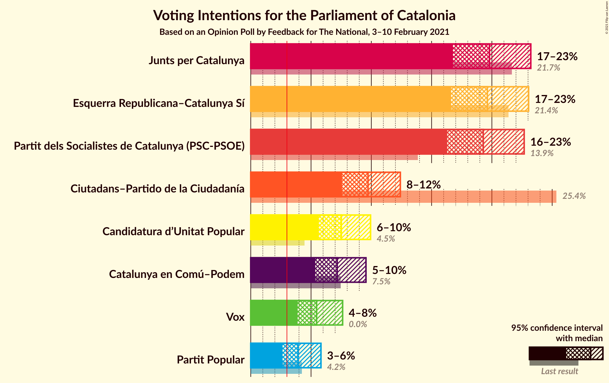

### Confidence Intervals

| Party | Last Result | Poll Result | 80% Confidence Interval | 90% Confidence Interval | 95% Confidence Interval | 99% Confidence Interval |
|:-----:|:-----------:|:-----------:|:-----------------------:|:-----------------------:|:-----------------------:|:-----------------------:|
| Junts per Catalunya | 21.7% | 19.8% | 17.8–22.0% |17.2–22.7% |16.8–23.2% |15.9–24.3% |
| Esquerra Republicana–Catalunya Sí | 21.4% | 19.6% | 17.6–21.9% |17.1–22.5% |16.6–23.0% |15.7–24.1% |
| Partit dels Socialistes de Catalunya (PSC-PSOE) | 13.9% | 19.3% | 17.3–21.5% |16.8–22.1% |16.3–22.7% |15.4–23.8% |
| Ciutadans–Partido de la Ciudadanía | 25.4% | 9.7% | 8.3–11.5% |7.9–12.0% |7.6–12.4% |7.0–13.3% |
| Candidatura d’Unitat Popular | 4.5% | 7.5% | 6.3–9.1% |5.9–9.5% |5.6–9.9% |5.1–10.7% |
| Catalunya en Comú–Podem | 7.5% | 7.2% | 6.0–8.7% |5.6–9.2% |5.3–9.6% |4.8–10.3% |
| Vox | 0.0% | 5.5% | 4.4–6.9% |4.1–7.3% |3.9–7.6% |3.4–8.3% |
| Partit Popular | 4.2% | 3.9% | 3.1–5.2% |2.8–5.5% |2.6–5.8% |2.3–6.5% |

*Note:* The poll result column reflects the actual value used in the calculations. Published results may vary slightly, and in addition be rounded to fewer digits.

## Seats

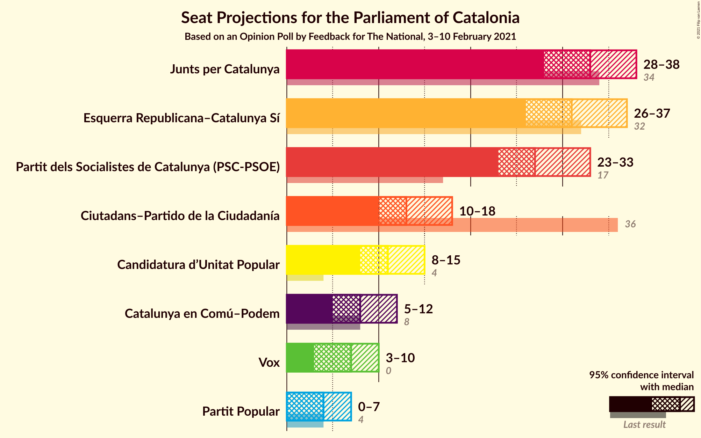

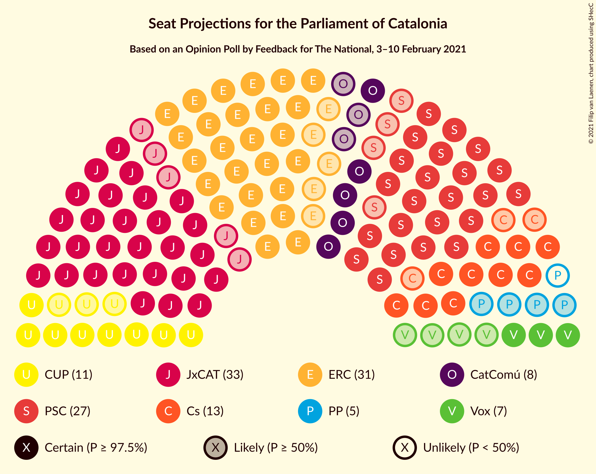

### Confidence Intervals

| Party | Last Result | Median | 80% Confidence Interval | 90% Confidence Interval | 95% Confidence Interval | 99% Confidence Interval |
|:-----:|:-----------:|:------:|:-----------------------:|:-----------------------:|:-----------------------:|:-----------------------:|
| <a href="#junts-per-catalunya">Junts per Catalunya</a> | 34 | 33 | 30–37 |29–37 |28–38 |26–40 |
| <a href="#esquerra-republicana–catalunya-sí">Esquerra Republicana–Catalunya Sí</a> | 32 | 31 | 28–34 |26–36 |26–37 |24–38 |
| <a href="#partit-dels-socialistes-de-catalunya-(psc-psoe)">Partit dels Socialistes de Catalunya (PSC-PSOE)</a> | 17 | 27 | 24–31 |24–32 |23–33 |22–34 |
| <a href="#ciutadans–partido-de-la-ciudadanía">Ciutadans–Partido de la Ciudadanía</a> | 36 | 13 | 12–17 |10–17 |10–18 |8–19 |
| <a href="#candidatura-d’unitat-popular">Candidatura d’Unitat Popular</a> | 4 | 11 | 8–14 |8–14 |8–15 |7–16 |
| <a href="#catalunya-en-comú–podem">Catalunya en Comú–Podem</a> | 8 | 8 | 7–11 |5–11 |5–12 |5–14 |
| <a href="#vox">Vox</a> | 0 | 7 | 5–9 |5–10 |3–10 |3–12 |
| <a href="#partit-popular">Partit Popular</a> | 4 | 4 | 2–7 |2–7 |0–7 |0–9 |

### Junts per Catalunya

*For a full overview of the results for this party, see the [Junts per Catalunya](party-juntspercatalunya.html) page.*

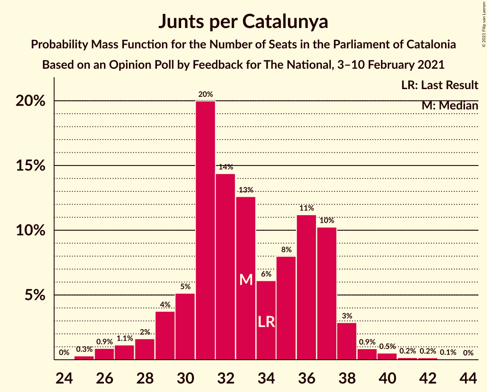

| Number of Seats | Probability | Accumulated | Special Marks |
|:---------------:|:-----------:|:-----------:|:-------------:|
| 24 | 0% | 100% |  |
| 25 | 0.3% | 99.9% |  |
| 26 | 0.9% | 99.6% |  |
| 27 | 1.1% | 98.8% |  |
| 28 | 2% | 98% |  |
| 29 | 4% | 96% |  |
| 30 | 5% | 92% |  |
| 31 | 20% | 87% |  |
| 32 | 14% | 67% |  |
| 33 | 13% | 53% | Median |
| 34 | 6% | 40% | Last Result |
| 35 | 8% | 34% |  |
| 36 | 11% | 26% |  |
| 37 | 10% | 15% |  |
| 38 | 3% | 5% |  |
| 39 | 0.9% | 2% |  |
| 40 | 0.5% | 0.9% |  |
| 41 | 0.2% | 0.4% |  |
| 42 | 0.2% | 0.2% |  |
| 43 | 0.1% | 0.1% |  |
| 44 | 0% | 0% |  |

### Esquerra Republicana–Catalunya Sí

*For a full overview of the results for this party, see the [Esquerra Republicana–Catalunya Sí](party-esquerrarepublicana–catalunyasí.html) page.*

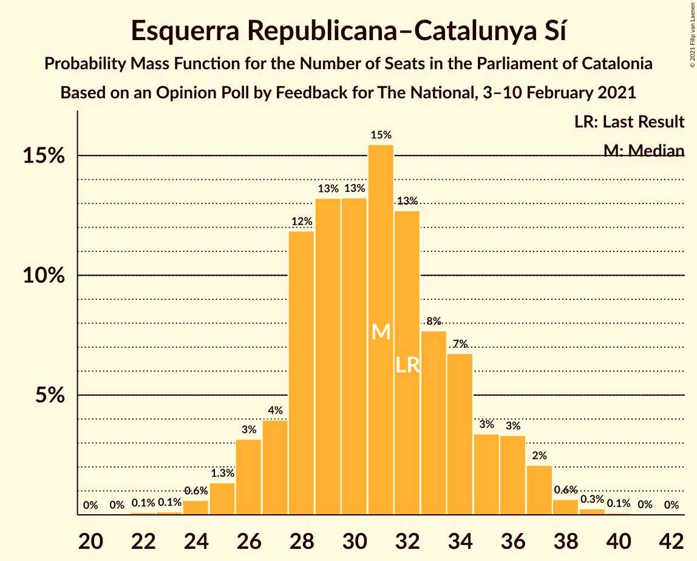

| Number of Seats | Probability | Accumulated | Special Marks |
|:---------------:|:-----------:|:-----------:|:-------------:|
| 22 | 0.1% | 100% |  |
| 23 | 0.1% | 99.9% |  |
| 24 | 0.6% | 99.8% |  |
| 25 | 1.3% | 99.2% |  |
| 26 | 3% | 98% |  |
| 27 | 4% | 95% |  |
| 28 | 12% | 91% |  |
| 29 | 13% | 79% |  |
| 30 | 13% | 66% |  |
| 31 | 15% | 52% | Median |
| 32 | 13% | 37% | Last Result |
| 33 | 8% | 24% |  |
| 34 | 7% | 17% |  |
| 35 | 3% | 10% |  |
| 36 | 3% | 6% |  |
| 37 | 2% | 3% |  |
| 38 | 0.6% | 1.0% |  |
| 39 | 0.3% | 0.4% |  |
| 40 | 0.1% | 0.1% |  |
| 41 | 0% | 0% |  |

### Partit dels Socialistes de Catalunya (PSC-PSOE)

*For a full overview of the results for this party, see the [Partit dels Socialistes de Catalunya (PSC-PSOE)](party-partitdelssocialistesdecatalunyapsc-psoe.html) page.*

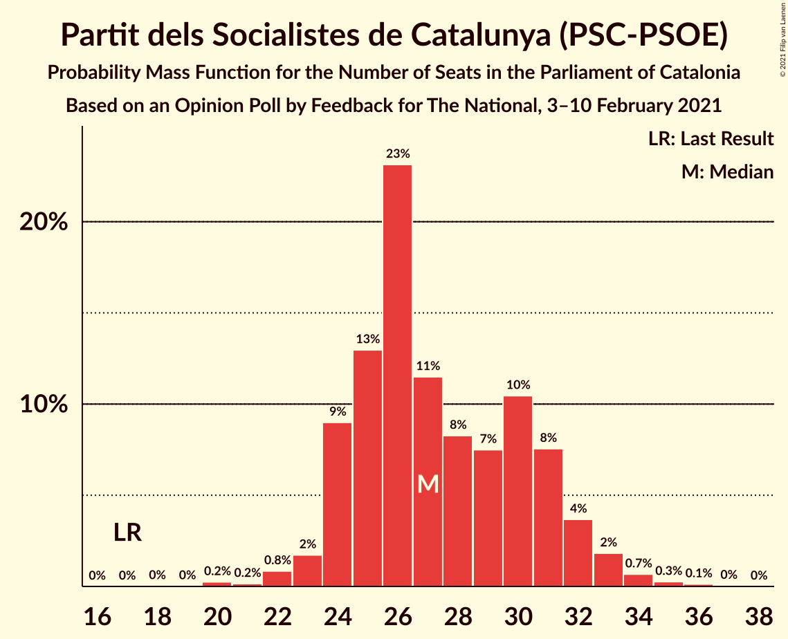

| Number of Seats | Probability | Accumulated | Special Marks |
|:---------------:|:-----------:|:-----------:|:-------------:|
| 17 | 0% | 100% | Last Result |
| 18 | 0% | 100% |  |
| 19 | 0% | 100% |  |
| 20 | 0.2% | 99.9% |  |
| 21 | 0.2% | 99.7% |  |
| 22 | 0.8% | 99.5% |  |
| 23 | 2% | 98.7% |  |
| 24 | 9% | 97% |  |
| 25 | 13% | 88% |  |
| 26 | 23% | 75% |  |
| 27 | 11% | 52% | Median |
| 28 | 8% | 40% |  |
| 29 | 7% | 32% |  |
| 30 | 10% | 25% |  |
| 31 | 8% | 14% |  |
| 32 | 4% | 7% |  |
| 33 | 2% | 3% |  |
| 34 | 0.7% | 1.1% |  |
| 35 | 0.3% | 0.4% |  |
| 36 | 0.1% | 0.2% |  |
| 37 | 0% | 0.1% |  |
| 38 | 0% | 0% |  |

### Ciutadans–Partido de la Ciudadanía

*For a full overview of the results for this party, see the [Ciutadans–Partido de la Ciudadanía](party-ciutadans–partidodelaciudadanía.html) page.*

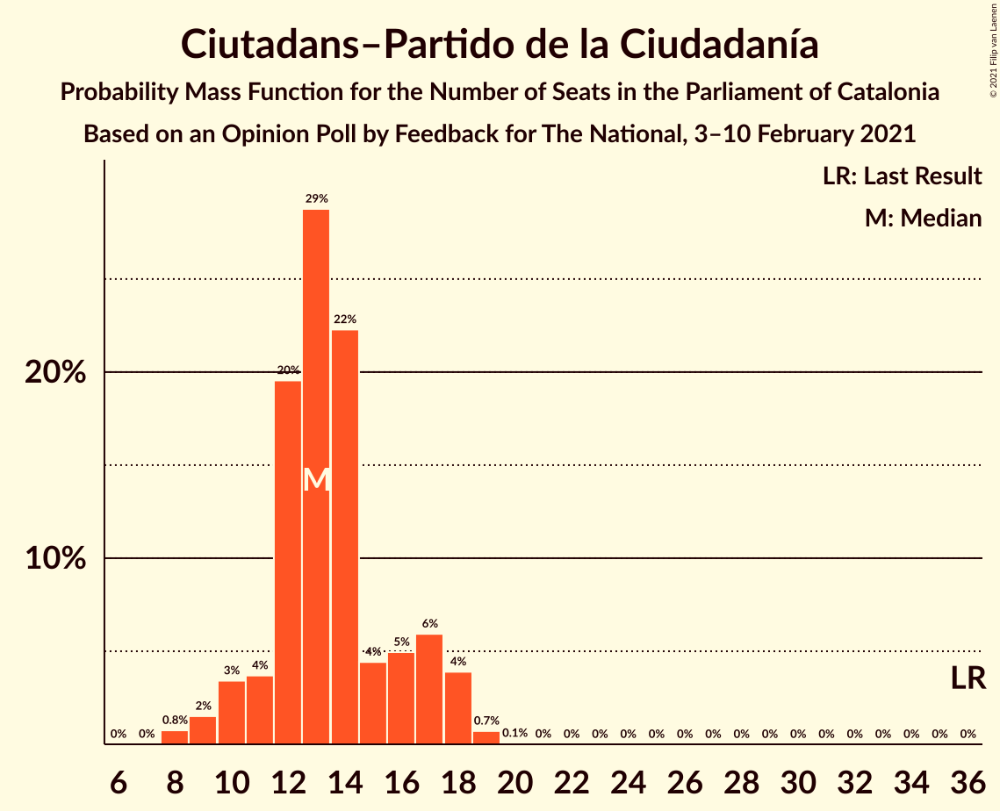

| Number of Seats | Probability | Accumulated | Special Marks |
|:---------------:|:-----------:|:-----------:|:-------------:|
| 8 | 0.8% | 100% |  |
| 9 | 2% | 99.2% |  |
| 10 | 3% | 98% |  |
| 11 | 4% | 94% |  |
| 12 | 20% | 91% |  |
| 13 | 29% | 71% | Median |
| 14 | 22% | 42% |  |
| 15 | 4% | 20% |  |
| 16 | 5% | 16% |  |
| 17 | 6% | 11% |  |
| 18 | 4% | 5% |  |
| 19 | 0.7% | 0.8% |  |
| 20 | 0.1% | 0.1% |  |
| 21 | 0% | 0% |  |
| 22 | 0% | 0% |  |
| 23 | 0% | 0% |  |
| 24 | 0% | 0% |  |
| 25 | 0% | 0% |  |
| 26 | 0% | 0% |  |
| 27 | 0% | 0% |  |
| 28 | 0% | 0% |  |
| 29 | 0% | 0% |  |
| 30 | 0% | 0% |  |
| 31 | 0% | 0% |  |
| 32 | 0% | 0% |  |
| 33 | 0% | 0% |  |
| 34 | 0% | 0% |  |
| 35 | 0% | 0% |  |
| 36 | 0% | 0% | Last Result |

### Candidatura d’Unitat Popular

*For a full overview of the results for this party, see the [Candidatura d’Unitat Popular](party-candidaturad’unitatpopular.html) page.*

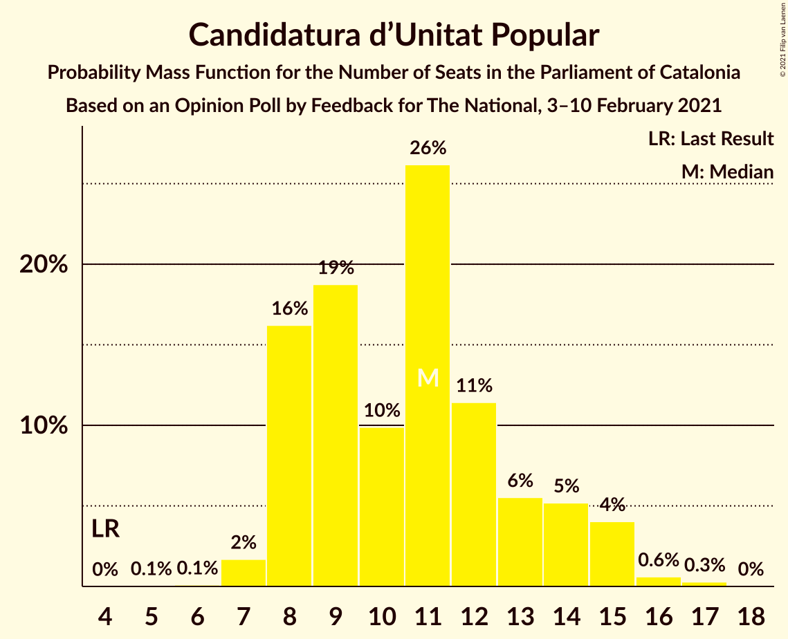

| Number of Seats | Probability | Accumulated | Special Marks |
|:---------------:|:-----------:|:-----------:|:-------------:|
| 4 | 0% | 100% | Last Result |
| 5 | 0.1% | 100% |  |
| 6 | 0.1% | 99.9% |  |
| 7 | 2% | 99.8% |  |
| 8 | 16% | 98% |  |
| 9 | 19% | 82% |  |
| 10 | 10% | 63% |  |
| 11 | 26% | 53% | Median |
| 12 | 11% | 27% |  |
| 13 | 6% | 16% |  |
| 14 | 5% | 10% |  |
| 15 | 4% | 5% |  |
| 16 | 0.6% | 0.9% |  |
| 17 | 0.3% | 0.3% |  |
| 18 | 0% | 0% |  |

### Catalunya en Comú–Podem

*For a full overview of the results for this party, see the [Catalunya en Comú–Podem](party-catalunyaencomú–podem.html) page.*

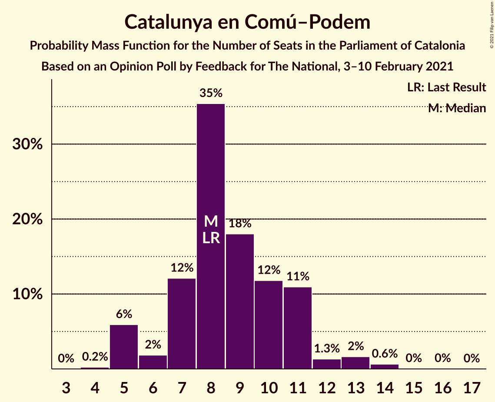

| Number of Seats | Probability | Accumulated | Special Marks |
|:---------------:|:-----------:|:-----------:|:-------------:|
| 4 | 0.2% | 100% |  |
| 5 | 6% | 99.8% |  |
| 6 | 2% | 94% |  |
| 7 | 12% | 92% |  |
| 8 | 35% | 80% | Last Result, Median |
| 9 | 18% | 44% |  |
| 10 | 12% | 26% |  |
| 11 | 11% | 15% |  |
| 12 | 1.3% | 4% |  |
| 13 | 2% | 2% |  |
| 14 | 0.6% | 0.7% |  |
| 15 | 0% | 0.1% |  |
| 16 | 0% | 0.1% |  |
| 17 | 0% | 0% |  |

### Vox

*For a full overview of the results for this party, see the [Vox](party-vox.html) page.*

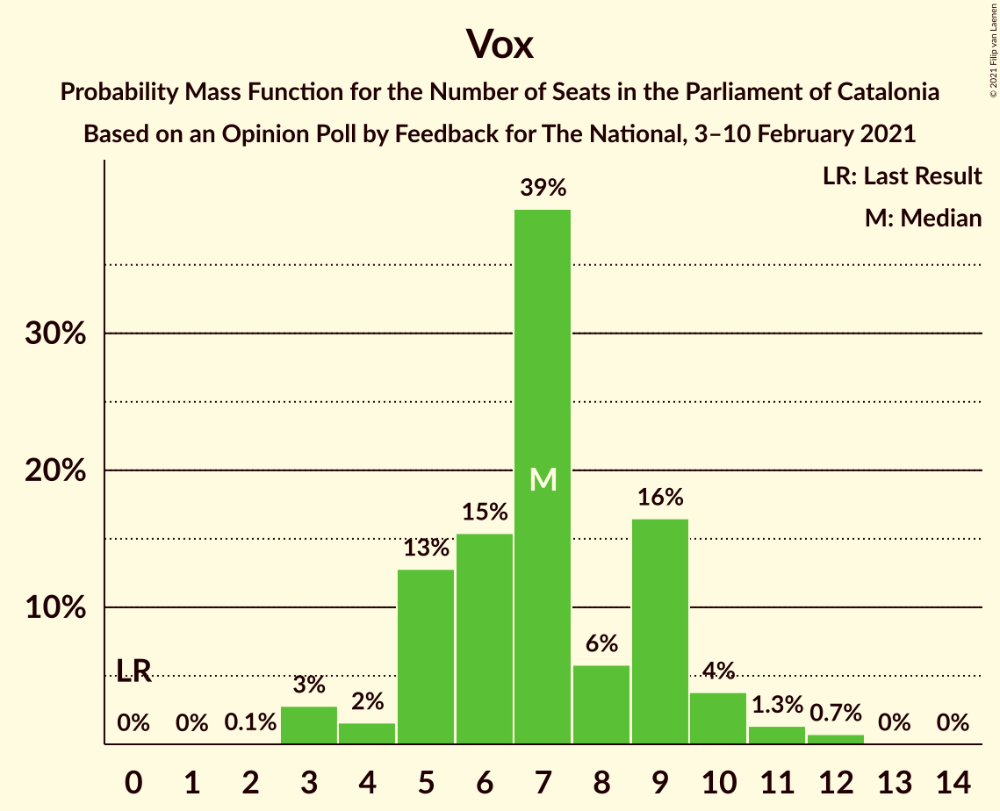

| Number of Seats | Probability | Accumulated | Special Marks |
|:---------------:|:-----------:|:-----------:|:-------------:|
| 0 | 0% | 100% | Last Result |
| 1 | 0% | 100% |  |
| 2 | 0.1% | 100% |  |
| 3 | 3% | 99.9% |  |
| 4 | 2% | 97% |  |
| 5 | 13% | 96% |  |
| 6 | 15% | 83% |  |
| 7 | 39% | 67% | Median |
| 8 | 6% | 28% |  |
| 9 | 16% | 22% |  |
| 10 | 4% | 6% |  |
| 11 | 1.3% | 2% |  |
| 12 | 0.7% | 0.8% |  |
| 13 | 0% | 0.1% |  |
| 14 | 0% | 0% |  |

### Partit Popular

*For a full overview of the results for this party, see the [Partit Popular](party-partitpopular.html) page.*

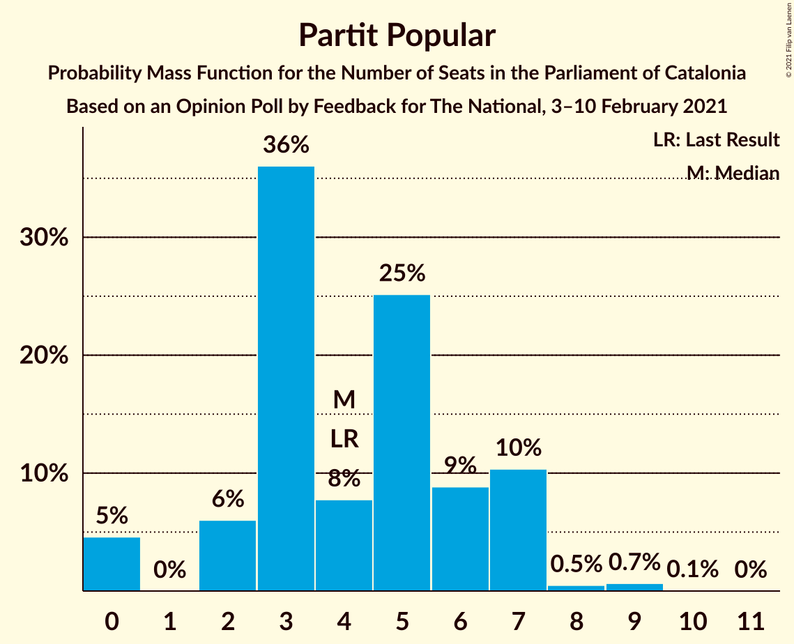

| Number of Seats | Probability | Accumulated | Special Marks |
|:---------------:|:-----------:|:-----------:|:-------------:|
| 0 | 5% | 100% |  |
| 1 | 0% | 95% |  |
| 2 | 6% | 95% |  |
| 3 | 36% | 89% |  |
| 4 | 8% | 53% | Last Result, Median |
| 5 | 25% | 46% |  |
| 6 | 9% | 20% |  |
| 7 | 10% | 12% |  |
| 8 | 0.5% | 1.2% |  |
| 9 | 0.7% | 0.7% |  |
| 10 | 0.1% | 0.1% |  |
| 11 | 0% | 0% |  |

## Coalitions

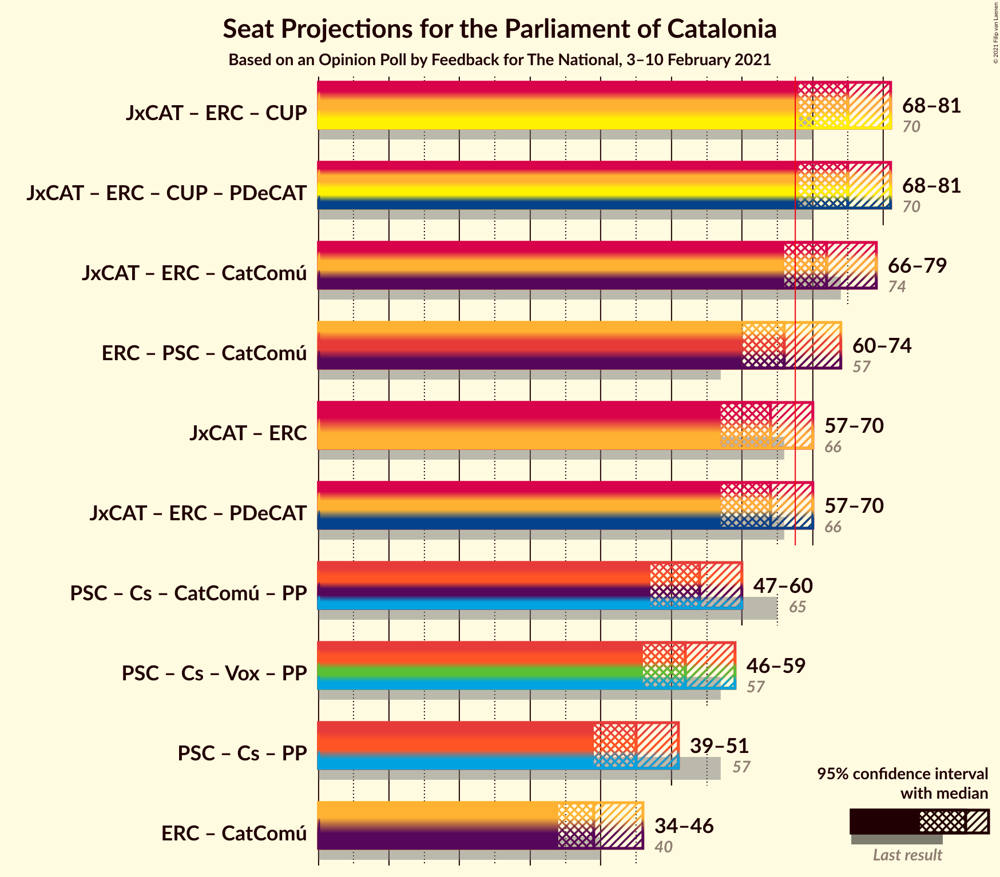

### Confidence Intervals

| Coalition | Last Result | Median | Majority? | 80% Confidence Interval | 90% Confidence Interval | 95% Confidence Interval | 99% Confidence Interval |
|:---------:|:-----------:|:------:|:---------:|:-----------------------:|:-----------------------:|:-----------------------:|:-----------------------:|
| Junts per Catalunya – Esquerra Republicana–Catalunya Sí – Candidatura d’Unitat Popular | 70 | 75 | 98% | 70–79 | 69–80 | 68–81 | 66–82 |
| Junts per Catalunya – Esquerra Republicana–Catalunya Sí – Catalunya en Comú–Podem | 74 | 72 | 92% | 68–76 | 67–78 | 66–79 | 64–81 |
| Esquerra Republicana–Catalunya Sí – Partit dels Socialistes de Catalunya (PSC-PSOE) – Catalunya en Comú–Podem | 57 | 66 | 38% | 62–72 | 61–73 | 60–74 | 58–76 |
| Junts per Catalunya – Esquerra Republicana–Catalunya Sí | 66 | 64 | 13% | 60–68 | 58–69 | 57–70 | 55–72 |
| Partit dels Socialistes de Catalunya (PSC-PSOE) – Ciutadans–Partido de la Ciudadanía – Catalunya en Comú–Podem – Partit Popular | 65 | 54 | 0% | 49–58 | 48–59 | 47–60 | 46–62 |
| Partit dels Socialistes de Catalunya (PSC-PSOE) – Ciutadans–Partido de la Ciudadanía – Vox – Partit Popular | 57 | 52 | 0% | 48–57 | 47–57 | 46–59 | 44–61 |
| Partit dels Socialistes de Catalunya (PSC-PSOE) – Ciutadans–Partido de la Ciudadanía – Partit Popular | 57 | 45 | 0% | 41–49 | 40–50 | 39–51 | 38–53 |
| Esquerra Republicana–Catalunya Sí – Catalunya en Comú–Podem | 40 | 39 | 0% | 36–43 | 35–44 | 34–46 | 32–48 |

### Junts per Catalunya – Esquerra Republicana–Catalunya Sí – Candidatura d’Unitat Popular

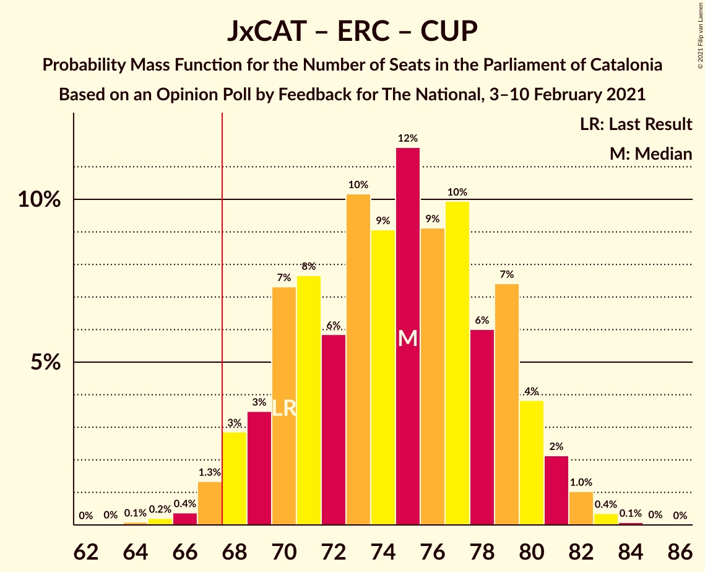

| Number of Seats | Probability | Accumulated | Special Marks |
|:---------------:|:-----------:|:-----------:|:-------------:|
| 64 | 0.1% | 100% |  |
| 65 | 0.2% | 99.9% |  |
| 66 | 0.4% | 99.7% |  |
| 67 | 1.3% | 99.3% |  |
| 68 | 3% | 98% | Majority |
| 69 | 3% | 95% |  |
| 70 | 7% | 92% | Last Result |
| 71 | 8% | 84% |  |
| 72 | 6% | 77% |  |
| 73 | 10% | 71% |  |
| 74 | 9% | 61% |  |
| 75 | 12% | 52% | Median |
| 76 | 9% | 40% |  |
| 77 | 10% | 31% |  |
| 78 | 6% | 21% |  |
| 79 | 7% | 15% |  |
| 80 | 4% | 7% |  |
| 81 | 2% | 4% |  |
| 82 | 1.0% | 2% |  |
| 83 | 0.4% | 0.5% |  |
| 84 | 0.1% | 0.1% |  |
| 85 | 0% | 0% |  |

### Junts per Catalunya – Esquerra Republicana–Catalunya Sí – Catalunya en Comú–Podem

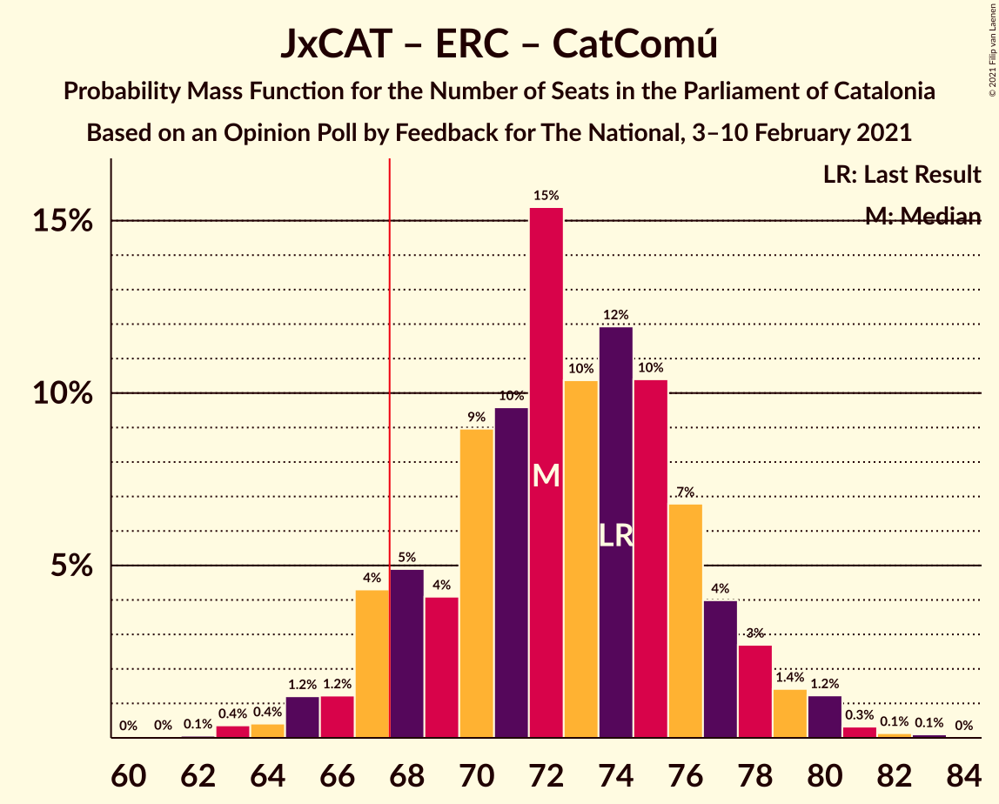

| Number of Seats | Probability | Accumulated | Special Marks |
|:---------------:|:-----------:|:-----------:|:-------------:|
| 62 | 0.1% | 100% |  |
| 63 | 0.4% | 99.9% |  |
| 64 | 0.4% | 99.5% |  |
| 65 | 1.2% | 99.1% |  |
| 66 | 1.2% | 98% |  |
| 67 | 4% | 97% |  |
| 68 | 5% | 92% | Majority |
| 69 | 4% | 87% |  |
| 70 | 9% | 83% |  |
| 71 | 10% | 74% |  |
| 72 | 15% | 65% | Median |
| 73 | 10% | 49% |  |
| 74 | 12% | 39% | Last Result |
| 75 | 10% | 27% |  |
| 76 | 7% | 17% |  |
| 77 | 4% | 10% |  |
| 78 | 3% | 6% |  |
| 79 | 1.4% | 3% |  |
| 80 | 1.2% | 2% |  |
| 81 | 0.3% | 0.6% |  |
| 82 | 0.1% | 0.3% |  |
| 83 | 0.1% | 0.1% |  |
| 84 | 0% | 0% |  |

### Esquerra Republicana–Catalunya Sí – Partit dels Socialistes de Catalunya (PSC-PSOE) – Catalunya en Comú–Podem

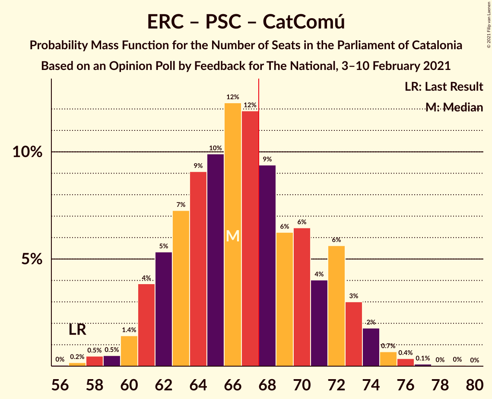

| Number of Seats | Probability | Accumulated | Special Marks |
|:---------------:|:-----------:|:-----------:|:-------------:|
| 56 | 0% | 100% |  |
| 57 | 0.2% | 99.9% | Last Result |
| 58 | 0.5% | 99.8% |  |
| 59 | 0.5% | 99.3% |  |
| 60 | 1.4% | 98.8% |  |
| 61 | 4% | 97% |  |
| 62 | 5% | 94% |  |
| 63 | 7% | 88% |  |
| 64 | 9% | 81% |  |
| 65 | 10% | 72% |  |
| 66 | 12% | 62% | Median |
| 67 | 12% | 50% |  |
| 68 | 9% | 38% | Majority |
| 69 | 6% | 28% |  |
| 70 | 6% | 22% |  |
| 71 | 4% | 16% |  |
| 72 | 6% | 12% |  |
| 73 | 3% | 6% |  |
| 74 | 2% | 3% |  |
| 75 | 0.7% | 1.2% |  |
| 76 | 0.4% | 0.5% |  |
| 77 | 0.1% | 0.2% |  |
| 78 | 0% | 0.1% |  |
| 79 | 0% | 0.1% |  |
| 80 | 0% | 0% |  |

### Junts per Catalunya – Esquerra Republicana–Catalunya Sí

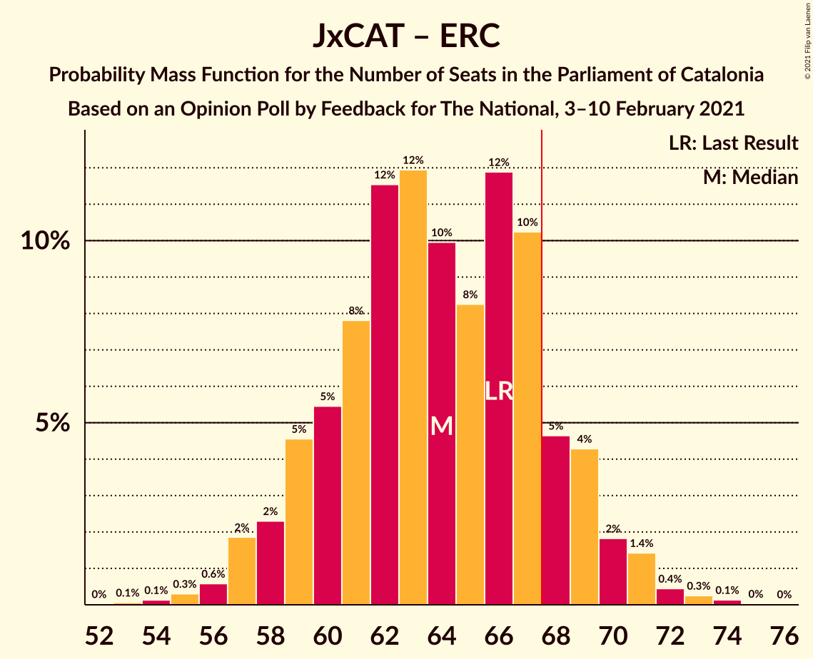

| Number of Seats | Probability | Accumulated | Special Marks |
|:---------------:|:-----------:|:-----------:|:-------------:|
| 53 | 0.1% | 100% |  |
| 54 | 0.1% | 99.9% |  |
| 55 | 0.3% | 99.8% |  |
| 56 | 0.6% | 99.5% |  |
| 57 | 2% | 98.9% |  |
| 58 | 2% | 97% |  |
| 59 | 5% | 95% |  |
| 60 | 5% | 90% |  |
| 61 | 8% | 85% |  |
| 62 | 12% | 77% |  |
| 63 | 12% | 65% |  |
| 64 | 10% | 53% | Median |
| 65 | 8% | 43% |  |
| 66 | 12% | 35% | Last Result |
| 67 | 10% | 23% |  |
| 68 | 5% | 13% | Majority |
| 69 | 4% | 8% |  |
| 70 | 2% | 4% |  |
| 71 | 1.4% | 2% |  |
| 72 | 0.4% | 0.9% |  |
| 73 | 0.3% | 0.4% |  |
| 74 | 0.1% | 0.2% |  |
| 75 | 0% | 0.1% |  |
| 76 | 0% | 0% |  |

### Partit dels Socialistes de Catalunya (PSC-PSOE) – Ciutadans–Partido de la Ciudadanía – Catalunya en Comú–Podem – Partit Popular

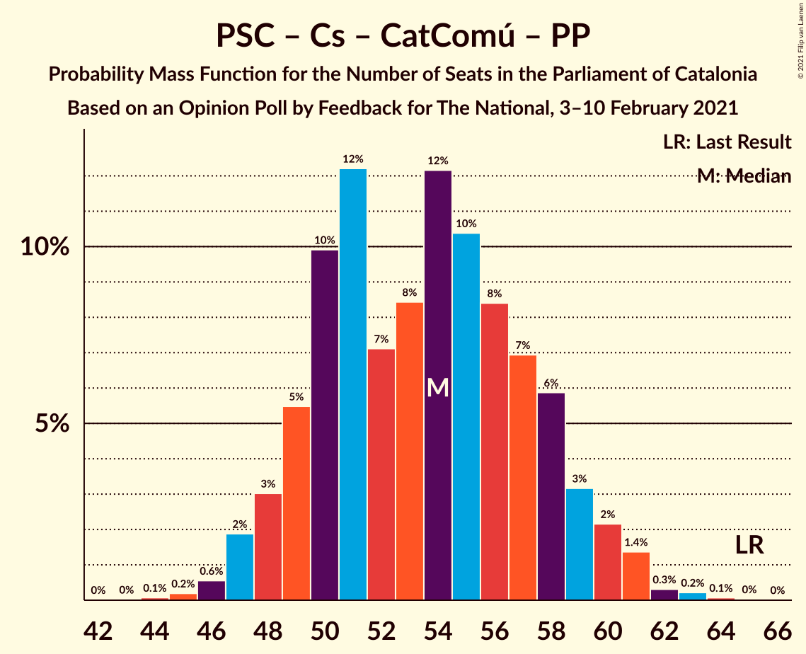

| Number of Seats | Probability | Accumulated | Special Marks |
|:---------------:|:-----------:|:-----------:|:-------------:|
| 44 | 0.1% | 100% |  |
| 45 | 0.2% | 99.9% |  |
| 46 | 0.6% | 99.7% |  |
| 47 | 2% | 99.1% |  |
| 48 | 3% | 97% |  |
| 49 | 5% | 94% |  |
| 50 | 10% | 89% |  |
| 51 | 12% | 79% |  |
| 52 | 7% | 67% | Median |
| 53 | 8% | 60% |  |
| 54 | 12% | 51% |  |
| 55 | 10% | 39% |  |
| 56 | 8% | 29% |  |
| 57 | 7% | 20% |  |
| 58 | 6% | 13% |  |
| 59 | 3% | 7% |  |
| 60 | 2% | 4% |  |
| 61 | 1.4% | 2% |  |
| 62 | 0.3% | 0.6% |  |
| 63 | 0.2% | 0.3% |  |
| 64 | 0.1% | 0.1% |  |
| 65 | 0% | 0% | Last Result |

### Partit dels Socialistes de Catalunya (PSC-PSOE) – Ciutadans–Partido de la Ciudadanía – Vox – Partit Popular

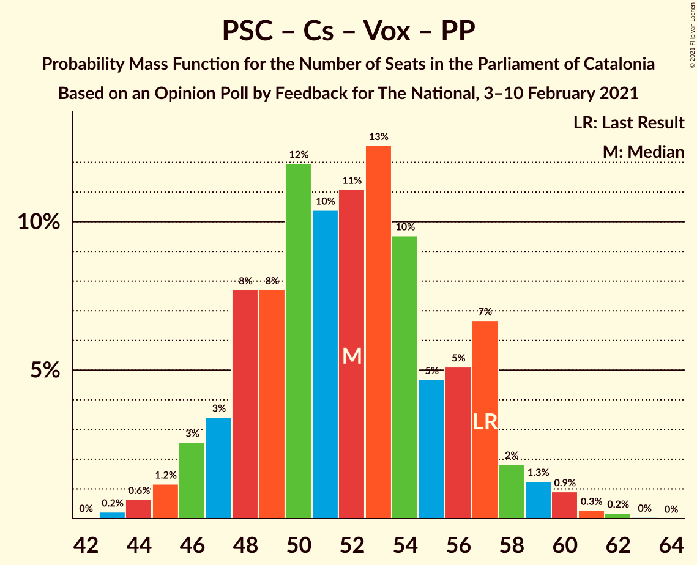

| Number of Seats | Probability | Accumulated | Special Marks |
|:---------------:|:-----------:|:-----------:|:-------------:|
| 42 | 0% | 100% |  |
| 43 | 0.2% | 99.9% |  |
| 44 | 0.6% | 99.7% |  |
| 45 | 1.2% | 99.1% |  |
| 46 | 3% | 98% |  |
| 47 | 3% | 95% |  |
| 48 | 8% | 92% |  |
| 49 | 8% | 84% |  |
| 50 | 12% | 77% |  |
| 51 | 10% | 65% | Median |
| 52 | 11% | 54% |  |
| 53 | 13% | 43% |  |
| 54 | 10% | 30% |  |
| 55 | 5% | 21% |  |
| 56 | 5% | 16% |  |
| 57 | 7% | 11% | Last Result |
| 58 | 2% | 5% |  |
| 59 | 1.3% | 3% |  |
| 60 | 0.9% | 1.4% |  |
| 61 | 0.3% | 0.5% |  |
| 62 | 0.2% | 0.2% |  |
| 63 | 0% | 0.1% |  |
| 64 | 0% | 0% |  |

### Partit dels Socialistes de Catalunya (PSC-PSOE) – Ciutadans–Partido de la Ciudadanía – Partit Popular

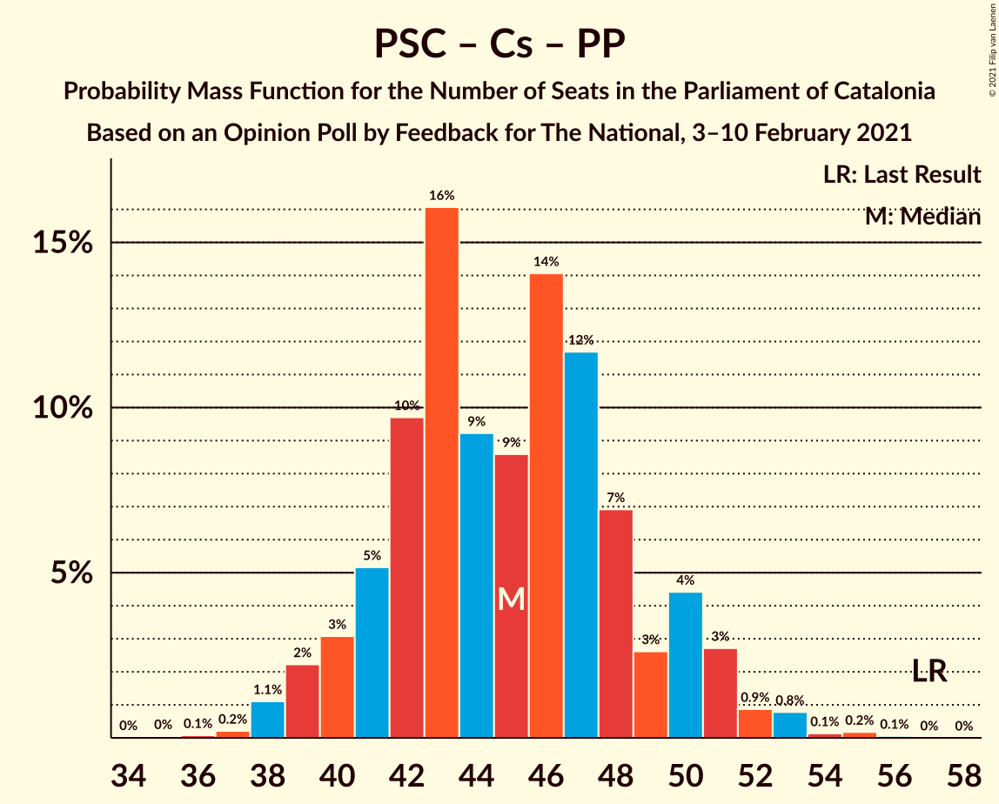

| Number of Seats | Probability | Accumulated | Special Marks |
|:---------------:|:-----------:|:-----------:|:-------------:|
| 35 | 0% | 100% |  |
| 36 | 0.1% | 99.9% |  |
| 37 | 0.2% | 99.9% |  |
| 38 | 1.1% | 99.6% |  |
| 39 | 2% | 98.5% |  |
| 40 | 3% | 96% |  |
| 41 | 5% | 93% |  |
| 42 | 10% | 88% |  |
| 43 | 16% | 78% |  |
| 44 | 9% | 62% | Median |
| 45 | 9% | 53% |  |
| 46 | 14% | 44% |  |
| 47 | 12% | 30% |  |
| 48 | 7% | 19% |  |
| 49 | 3% | 12% |  |
| 50 | 4% | 9% |  |
| 51 | 3% | 5% |  |
| 52 | 0.9% | 2% |  |
| 53 | 0.8% | 1.2% |  |
| 54 | 0.1% | 0.4% |  |
| 55 | 0.2% | 0.2% |  |
| 56 | 0.1% | 0.1% |  |
| 57 | 0% | 0% | Last Result |

### Esquerra Republicana–Catalunya Sí – Catalunya en Comú–Podem

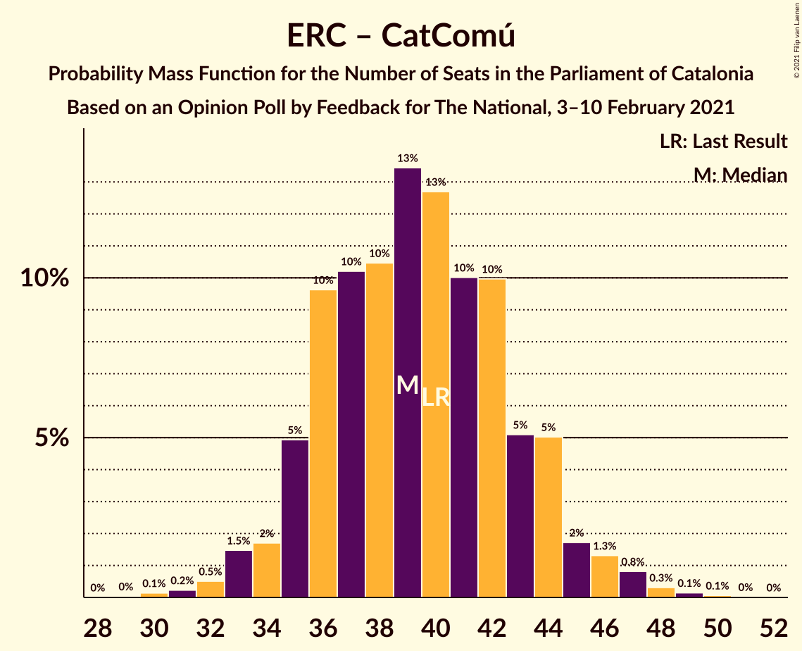

| Number of Seats | Probability | Accumulated | Special Marks |
|:---------------:|:-----------:|:-----------:|:-------------:|
| 30 | 0.1% | 100% |  |
| 31 | 0.2% | 99.8% |  |
| 32 | 0.5% | 99.6% |  |
| 33 | 1.5% | 99.1% |  |
| 34 | 2% | 98% |  |
| 35 | 5% | 96% |  |
| 36 | 10% | 91% |  |
| 37 | 10% | 81% |  |
| 38 | 10% | 71% |  |
| 39 | 13% | 61% | Median |
| 40 | 13% | 47% | Last Result |
| 41 | 10% | 35% |  |
| 42 | 10% | 24% |  |
| 43 | 5% | 15% |  |
| 44 | 5% | 9% |  |
| 45 | 2% | 4% |  |
| 46 | 1.3% | 3% |  |
| 47 | 0.8% | 1.4% |  |
| 48 | 0.3% | 0.5% |  |
| 49 | 0.1% | 0.2% |  |
| 50 | 0.1% | 0.1% |  |
| 51 | 0% | 0% |  |

## Technical Information

### Opinion Poll

+ **Polling firm:** Feedback
+ **Commissioner(s):** The National
+ **Fieldwork period:** 3–10 February 2021

### Calculations

+ **Sample size:** 586
+ **Simulations done:** 1,048,576
+ **Error estimate:** 1.20%

