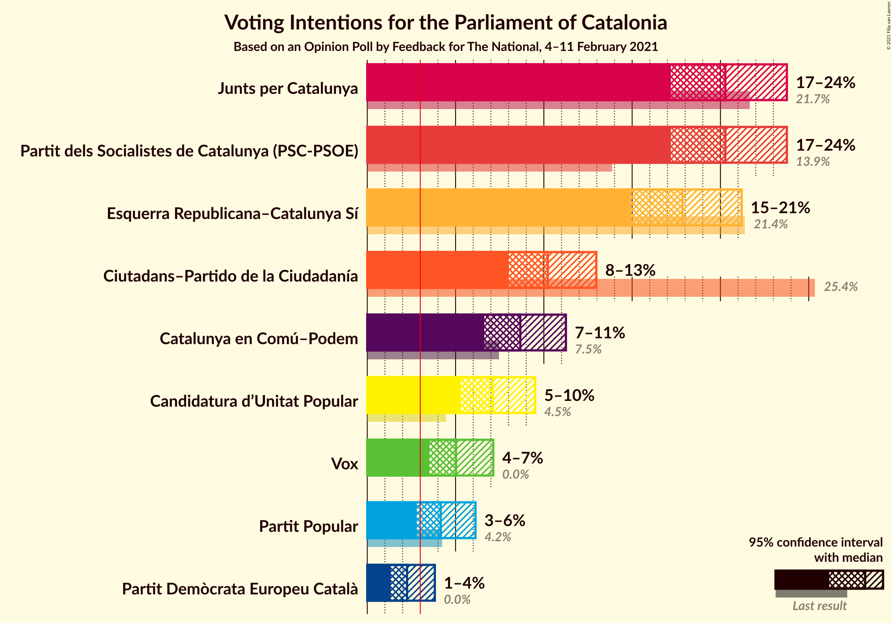
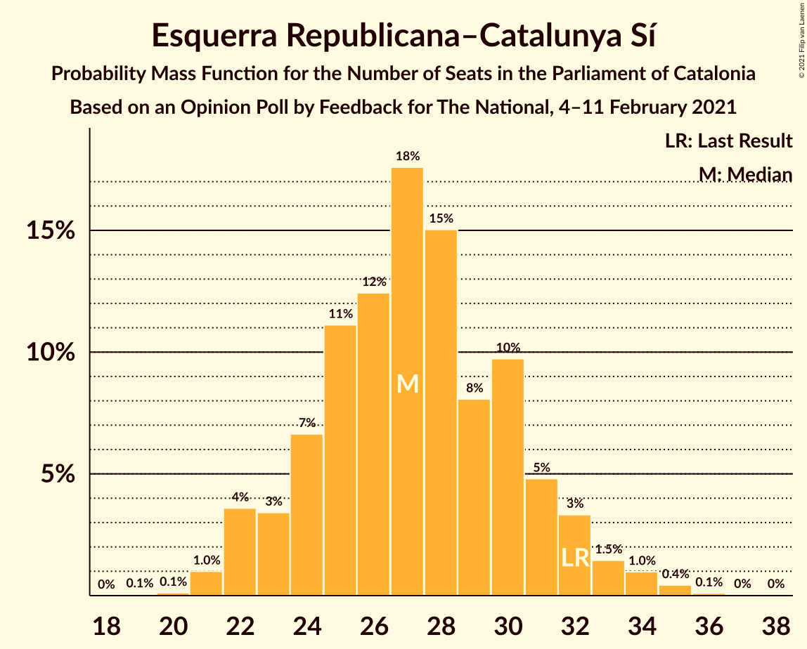
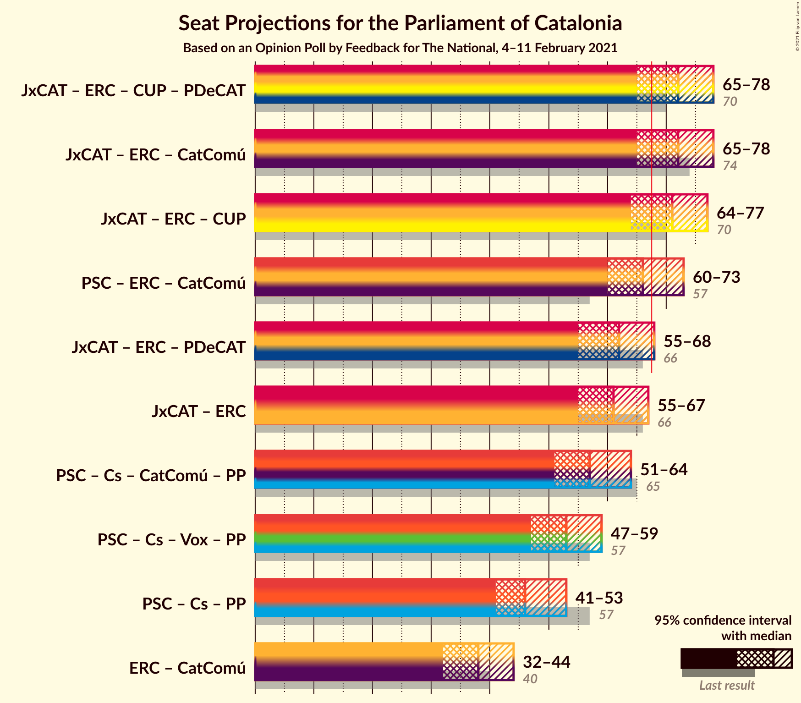

# Opinion Poll by Feedback for The National, 4–11 February 2021

<a href="#voting-intentions">Voting Intentions</a> | <a href="#seats">Seats</a> | <a href="#coalitions">Coalitions</a> | <a href="#technical-information">Technical Information</a>

## Voting Intentions

### Confidence Intervals

| Party | Last Result | Poll Result | 80% Confidence Interval | 90% Confidence Interval | 95% Confidence Interval | 99% Confidence Interval |
|:-----:|:-----------:|:-----------:|:-----------------------:|:-----------------------:|:-----------------------:|:-----------------------:|
| Partit dels Socialistes de Catalunya (PSC-PSOE) | 13.9% | 20.3% | 18.2–22.6% |17.7–23.2% |17.2–23.8% |16.3–24.9% |
| Junts per Catalunya | 21.7% | 20.3% | 18.2–22.6% |17.7–23.2% |17.2–23.8% |16.3–24.9% |
| Esquerra Republicana–Catalunya Sí | 21.4% | 17.9% | 15.9–20.0% |15.4–20.7% |14.9–21.2% |14.1–22.3% |
| Ciutadans–Partido de la Ciudadanía | 25.4% | 10.2% | 8.8–12.0% |8.4–12.5% |8.0–13.0% |7.4–13.9% |
| Catalunya en Comú–Podem | 7.5% | 8.7% | 7.3–10.3% |7.0–10.8% |6.6–11.2% |6.0–12.1% |
| Candidatura d’Unitat Popular | 4.5% | 7.1% | 5.9–8.7% |5.6–9.1% |5.3–9.5% |4.8–10.3% |
| Vox | 0.0% | 5.0% | 4.0–6.4% |3.7–6.8% |3.5–7.1% |3.1–7.8% |
| Partit Popular | 4.2% | 4.2% | 3.3–5.4% |3.0–5.8% |2.8–6.1% |2.4–6.8% |
| Partit Demòcrata Europeu Català | 0.0% | 2.3% | 1.6–3.3% |1.5–3.6% |1.3–3.8% |1.1–4.4% |

*Note:* The poll result column reflects the actual value used in the calculations. Published results may vary slightly, and in addition be rounded to fewer digits.

## Seats

### Confidence Intervals

| Party | Last Result | Median | 80% Confidence Interval | 90% Confidence Interval | 95% Confidence Interval | 99% Confidence Interval |
|:-----:|:-----------:|:------:|:-----------------------:|:-----------------------:|:-----------------------:|:-----------------------:|
| <a href="#partit-dels-socialistes-de-catalunya-(psc-psoe)">Partit dels Socialistes de Catalunya (PSC-PSOE)</a> | 17 | 28 | 25–32 |25–33 |24–34 |23–35 |
| <a href="#junts-per-catalunya">Junts per Catalunya</a> | 34 | 35 | 30–38 |28–39 |27–39 |26–41 |
| <a href="#esquerra-republicana–catalunya-sí">Esquerra Republicana–Catalunya Sí</a> | 32 | 27 | 24–31 |23–32 |22–33 |21–35 |
| <a href="#ciutadans–partido-de-la-ciudadanía">Ciutadans–Partido de la Ciudadanía</a> | 36 | 14 | 12–17 |12–18 |11–18 |9–19 |
| <a href="#catalunya-en-comú–podem">Catalunya en Comú–Podem</a> | 8 | 11 | 8–13 |8–14 |8–14 |7–16 |
| <a href="#candidatura-d’unitat-popular">Candidatura d’Unitat Popular</a> | 4 | 9 | 8–11 |8–13 |7–14 |6–15 |
| <a href="#vox">Vox</a> | 0 | 7 | 4–9 |3–9 |3–10 |2–11 |
| <a href="#partit-popular">Partit Popular</a> | 4 | 4 | 2–7 |2–7 |0–8 |0–9 |
| <a href="#partit-demòcrata-europeu-català">Partit Demòcrata Europeu Català</a> | 0 | 0 | 0–1 |0–4 |0–5 |0–6 |

### Partit dels Socialistes de Catalunya (PSC-PSOE)

*For a full overview of the results for this party, see the [Partit dels Socialistes de Catalunya (PSC-PSOE)](party-partitdelssocialistesdecatalunyapsc-psoe.html) page.*

| Number of Seats | Probability | Accumulated | Special Marks |
|:---------------:|:-----------:|:-----------:|:-------------:|
| 17 | 0% | 100% | Last Result |
| 18 | 0% | 100% |  |
| 19 | 0% | 100% |  |
| 20 | 0% | 100% |  |
| 21 | 0.1% | 100% |  |
| 22 | 0.2% | 99.9% |  |
| 23 | 0.8% | 99.7% |  |
| 24 | 3% | 99.0% |  |
| 25 | 8% | 96% |  |
| 26 | 17% | 88% |  |
| 27 | 10% | 71% |  |
| 28 | 16% | 61% | Median |
| 29 | 17% | 45% |  |
| 30 | 7% | 29% |  |
| 31 | 11% | 21% |  |
| 32 | 4% | 11% |  |
| 33 | 3% | 7% |  |
| 34 | 2% | 3% |  |
| 35 | 0.7% | 1.1% |  |
| 36 | 0.3% | 0.5% |  |
| 37 | 0.1% | 0.1% |  |
| 38 | 0% | 0% |  |

### Junts per Catalunya

*For a full overview of the results for this party, see the [Junts per Catalunya](party-juntspercatalunya.html) page.*

| Number of Seats | Probability | Accumulated | Special Marks |
|:---------------:|:-----------:|:-----------:|:-------------:|
| 24 | 0.1% | 100% |  |
| 25 | 0.2% | 99.9% |  |
| 26 | 0.6% | 99.7% |  |
| 27 | 3% | 99.1% |  |
| 28 | 2% | 97% |  |
| 29 | 4% | 95% |  |
| 30 | 7% | 91% |  |
| 31 | 12% | 83% |  |
| 32 | 6% | 72% |  |
| 33 | 7% | 65% |  |
| 34 | 5% | 58% | Last Result |
| 35 | 16% | 53% | Median |
| 36 | 15% | 37% |  |
| 37 | 10% | 22% |  |
| 38 | 6% | 13% |  |
| 39 | 4% | 6% |  |
| 40 | 1.2% | 2% |  |
| 41 | 0.6% | 0.8% |  |
| 42 | 0.1% | 0.2% |  |
| 43 | 0.1% | 0.1% |  |
| 44 | 0% | 0% |  |

### Esquerra Republicana–Catalunya Sí

*For a full overview of the results for this party, see the [Esquerra Republicana–Catalunya Sí](party-esquerrarepublicana–catalunyasí.html) page.*

| Number of Seats | Probability | Accumulated | Special Marks |
|:---------------:|:-----------:|:-----------:|:-------------:|
| 19 | 0.1% | 100% |  |
| 20 | 0.1% | 99.9% |  |
| 21 | 1.0% | 99.8% |  |
| 22 | 4% | 98.8% |  |
| 23 | 3% | 95% |  |
| 24 | 7% | 92% |  |
| 25 | 11% | 85% |  |
| 26 | 12% | 74% |  |
| 27 | 18% | 62% | Median |
| 28 | 15% | 44% |  |
| 29 | 8% | 29% |  |
| 30 | 10% | 21% |  |
| 31 | 5% | 11% |  |
| 32 | 3% | 6% | Last Result |
| 33 | 1.5% | 3% |  |
| 34 | 1.0% | 2% |  |
| 35 | 0.4% | 0.6% |  |
| 36 | 0.1% | 0.2% |  |
| 37 | 0% | 0.1% |  |
| 38 | 0% | 0% |  |

### Ciutadans–Partido de la Ciudadanía

*For a full overview of the results for this party, see the [Ciutadans–Partido de la Ciudadanía](party-ciutadans–partidodelaciudadanía.html) page.*

| Number of Seats | Probability | Accumulated | Special Marks |
|:---------------:|:-----------:|:-----------:|:-------------:|
| 8 | 0.2% | 100% |  |
| 9 | 0.9% | 99.8% |  |
| 10 | 1.2% | 98.9% |  |
| 11 | 2% | 98% |  |
| 12 | 16% | 95% |  |
| 13 | 26% | 79% |  |
| 14 | 29% | 53% | Median |
| 15 | 5% | 25% |  |
| 16 | 8% | 20% |  |
| 17 | 5% | 11% |  |
| 18 | 4% | 6% |  |
| 19 | 1.1% | 1.3% |  |
| 20 | 0.1% | 0.2% |  |
| 21 | 0.1% | 0.1% |  |
| 22 | 0% | 0% |  |
| 23 | 0% | 0% |  |
| 24 | 0% | 0% |  |
| 25 | 0% | 0% |  |
| 26 | 0% | 0% |  |
| 27 | 0% | 0% |  |
| 28 | 0% | 0% |  |
| 29 | 0% | 0% |  |
| 30 | 0% | 0% |  |
| 31 | 0% | 0% |  |
| 32 | 0% | 0% |  |
| 33 | 0% | 0% |  |
| 34 | 0% | 0% |  |
| 35 | 0% | 0% |  |
| 36 | 0% | 0% | Last Result |

### Catalunya en Comú–Podem

*For a full overview of the results for this party, see the [Catalunya en Comú–Podem](party-catalunyaencomú–podem.html) page.*

| Number of Seats | Probability | Accumulated | Special Marks |
|:---------------:|:-----------:|:-----------:|:-------------:|
| 5 | 0.1% | 100% |  |
| 6 | 0.3% | 99.9% |  |
| 7 | 2% | 99.6% |  |
| 8 | 13% | 98% | Last Result |
| 9 | 18% | 85% |  |
| 10 | 8% | 66% |  |
| 11 | 29% | 58% | Median |
| 12 | 6% | 29% |  |
| 13 | 15% | 24% |  |
| 14 | 7% | 9% |  |
| 15 | 0.9% | 2% |  |
| 16 | 1.0% | 1.2% |  |
| 17 | 0.2% | 0.3% |  |
| 18 | 0% | 0% |  |

### Candidatura d’Unitat Popular

*For a full overview of the results for this party, see the [Candidatura d’Unitat Popular](party-candidaturad’unitatpopular.html) page.*

| Number of Seats | Probability | Accumulated | Special Marks |
|:---------------:|:-----------:|:-----------:|:-------------:|
| 4 | 0.1% | 100% | Last Result |
| 5 | 0.2% | 99.9% |  |
| 6 | 0.3% | 99.7% |  |
| 7 | 4% | 99.4% |  |
| 8 | 27% | 96% |  |
| 9 | 27% | 69% | Median |
| 10 | 8% | 42% |  |
| 11 | 25% | 34% |  |
| 12 | 2% | 9% |  |
| 13 | 3% | 6% |  |
| 14 | 2% | 3% |  |
| 15 | 1.3% | 1.4% |  |
| 16 | 0.1% | 0.2% |  |
| 17 | 0.1% | 0.1% |  |
| 18 | 0% | 0% |  |

### Vox

*For a full overview of the results for this party, see the [Vox](party-vox.html) page.*

| Number of Seats | Probability | Accumulated | Special Marks |
|:---------------:|:-----------:|:-----------:|:-------------:|
| 0 | 0.2% | 100% | Last Result |
| 1 | 0% | 99.8% |  |
| 2 | 0.4% | 99.8% |  |
| 3 | 6% | 99.4% |  |
| 4 | 5% | 93% |  |
| 5 | 18% | 89% |  |
| 6 | 20% | 70% |  |
| 7 | 35% | 50% | Median |
| 8 | 4% | 15% |  |
| 9 | 7% | 10% |  |
| 10 | 2% | 3% |  |
| 11 | 0.7% | 0.9% |  |
| 12 | 0.2% | 0.2% |  |
| 13 | 0% | 0% |  |

### Partit Popular

*For a full overview of the results for this party, see the [Partit Popular](party-partitpopular.html) page.*

| Number of Seats | Probability | Accumulated | Special Marks |
|:---------------:|:-----------:|:-----------:|:-------------:|
| 0 | 5% | 100% |  |
| 1 | 0% | 95% |  |
| 2 | 7% | 95% |  |
| 3 | 27% | 89% |  |
| 4 | 14% | 62% | Last Result, Median |
| 5 | 20% | 47% |  |
| 6 | 11% | 28% |  |
| 7 | 14% | 17% |  |
| 8 | 1.4% | 3% |  |
| 9 | 1.4% | 2% |  |
| 10 | 0.1% | 0.2% |  |
| 11 | 0% | 0% |  |

### Partit Demòcrata Europeu Català

*For a full overview of the results for this party, see the [Partit Demòcrata Europeu Català](party-partitdemòcrataeuropeucatalà.html) page.*

| Number of Seats | Probability | Accumulated | Special Marks |
|:---------------:|:-----------:|:-----------:|:-------------:|
| 0 | 64% | 100% | Last Result, Median |
| 1 | 26% | 36% |  |
| 2 | 0.6% | 10% |  |
| 3 | 3% | 9% |  |
| 4 | 2% | 6% |  |
| 5 | 3% | 4% |  |
| 6 | 0.6% | 0.7% |  |
| 7 | 0% | 0.1% |  |
| 8 | 0% | 0% |  |

## Coalitions

### Confidence Intervals

| Coalition | Last Result | Median | Majority? | 80% Confidence Interval | 90% Confidence Interval | 95% Confidence Interval | 99% Confidence Interval |
|:---------:|:-----------:|:------:|:---------:|:-----------------------:|:-----------------------:|:-----------------------:|:-----------------------:|
| Junts per Catalunya – Esquerra Republicana–Catalunya Sí – Candidatura d’Unitat Popular – Partit Demòcrata Europeu Català | 70 | 72 | 87% | 67–75 | 66–77 | 65–78 | 63–80 |
| Junts per Catalunya – Esquerra Republicana–Catalunya Sí – Catalunya en Comú–Podem | 74 | 72 | 90% | 68–76 | 66–77 | 65–78 | 63–81 |
| Junts per Catalunya – Esquerra Republicana–Catalunya Sí – Candidatura d’Unitat Popular | 70 | 71 | 84% | 66–75 | 65–76 | 64–77 | 62–79 |
| Partit dels Socialistes de Catalunya (PSC-PSOE) – Esquerra Republicana–Catalunya Sí – Catalunya en Comú–Podem | 57 | 66 | 36% | 62–71 | 61–72 | 60–73 | 57–75 |
| Junts per Catalunya – Esquerra Republicana–Catalunya Sí – Partit Demòcrata Europeu Català | 66 | 62 | 4% | 57–66 | 56–67 | 55–68 | 53–71 |
| Junts per Catalunya – Esquerra Republicana–Catalunya Sí | 66 | 61 | 2% | 57–65 | 56–67 | 55–67 | 52–70 |
| Partit dels Socialistes de Catalunya (PSC-PSOE) – Ciutadans–Partido de la Ciudadanía – Catalunya en Comú–Podem – Partit Popular | 65 | 57 | 0.1% | 53–62 | 52–63 | 51–64 | 49–66 |
| Partit dels Socialistes de Catalunya (PSC-PSOE) – Ciutadans–Partido de la Ciudadanía – Vox – Partit Popular | 57 | 53 | 0% | 49–57 | 48–58 | 47–59 | 45–62 |
| Partit dels Socialistes de Catalunya (PSC-PSOE) – Ciutadans–Partido de la Ciudadanía – Partit Popular | 57 | 46 | 0% | 43–51 | 42–52 | 41–53 | 39–55 |
| Esquerra Republicana–Catalunya Sí – Catalunya en Comú–Podem | 40 | 38 | 0% | 34–42 | 33–43 | 32–44 | 30–46 |

### Junts per Catalunya – Esquerra Republicana–Catalunya Sí – Candidatura d’Unitat Popular – Partit Demòcrata Europeu Català

| Number of Seats | Probability | Accumulated | Special Marks |
|:---------------:|:-----------:|:-----------:|:-------------:|
| 60 | 0% | 100% |  |
| 61 | 0.1% | 99.9% |  |
| 62 | 0.3% | 99.9% |  |
| 63 | 0.3% | 99.6% |  |
| 64 | 0.9% | 99.3% |  |
| 65 | 2% | 98% |  |
| 66 | 5% | 96% |  |
| 67 | 4% | 91% |  |
| 68 | 11% | 87% | Majority |
| 69 | 12% | 76% |  |
| 70 | 6% | 64% | Last Result |
| 71 | 5% | 59% | Median |
| 72 | 10% | 53% |  |
| 73 | 11% | 44% |  |
| 74 | 12% | 33% |  |
| 75 | 10% | 20% |  |
| 76 | 5% | 10% |  |
| 77 | 3% | 5% |  |
| 78 | 1.2% | 3% |  |
| 79 | 1.0% | 2% |  |
| 80 | 0.3% | 0.6% |  |
| 81 | 0.2% | 0.3% |  |
| 82 | 0.1% | 0.1% |  |
| 83 | 0% | 0% |  |

### Junts per Catalunya – Esquerra Republicana–Catalunya Sí – Catalunya en Comú–Podem

| Number of Seats | Probability | Accumulated | Special Marks |
|:---------------:|:-----------:|:-----------:|:-------------:|
| 61 | 0.1% | 100% |  |
| 62 | 0.3% | 99.9% |  |
| 63 | 0.6% | 99.6% |  |
| 64 | 0.9% | 98.9% |  |
| 65 | 2% | 98% |  |
| 66 | 2% | 96% |  |
| 67 | 4% | 94% |  |
| 68 | 7% | 90% | Majority |
| 69 | 9% | 84% |  |
| 70 | 8% | 74% |  |
| 71 | 14% | 66% |  |
| 72 | 10% | 52% |  |
| 73 | 6% | 43% | Median |
| 74 | 12% | 36% | Last Result |
| 75 | 10% | 25% |  |
| 76 | 6% | 15% |  |
| 77 | 4% | 9% |  |
| 78 | 3% | 5% |  |
| 79 | 1.0% | 2% |  |
| 80 | 0.5% | 1.0% |  |
| 81 | 0.4% | 0.5% |  |
| 82 | 0.1% | 0.1% |  |
| 83 | 0% | 0.1% |  |
| 84 | 0% | 0% |  |

### Junts per Catalunya – Esquerra Republicana–Catalunya Sí – Candidatura d’Unitat Popular

| Number of Seats | Probability | Accumulated | Special Marks |
|:---------------:|:-----------:|:-----------:|:-------------:|
| 60 | 0.1% | 100% |  |
| 61 | 0.2% | 99.9% |  |
| 62 | 0.4% | 99.7% |  |
| 63 | 0.6% | 99.3% |  |
| 64 | 1.4% | 98.8% |  |
| 65 | 4% | 97% |  |
| 66 | 6% | 94% |  |
| 67 | 4% | 88% |  |
| 68 | 15% | 84% | Majority |
| 69 | 10% | 69% |  |
| 70 | 5% | 59% | Last Result |
| 71 | 8% | 54% | Median |
| 72 | 13% | 46% |  |
| 73 | 10% | 33% |  |
| 74 | 7% | 23% |  |
| 75 | 8% | 16% |  |
| 76 | 4% | 8% |  |
| 77 | 2% | 4% |  |
| 78 | 1.0% | 2% |  |
| 79 | 0.6% | 0.9% |  |
| 80 | 0.2% | 0.3% |  |
| 81 | 0.1% | 0.1% |  |
| 82 | 0% | 0% |  |

### Partit dels Socialistes de Catalunya (PSC-PSOE) – Esquerra Republicana–Catalunya Sí – Catalunya en Comú–Podem

| Number of Seats | Probability | Accumulated | Special Marks |
|:---------------:|:-----------:|:-----------:|:-------------:|
| 55 | 0% | 100% |  |
| 56 | 0.2% | 99.9% |  |
| 57 | 0.3% | 99.7% | Last Result |
| 58 | 0.3% | 99.4% |  |
| 59 | 1.2% | 99.1% |  |
| 60 | 2% | 98% |  |
| 61 | 3% | 96% |  |
| 62 | 7% | 93% |  |
| 63 | 10% | 86% |  |
| 64 | 9% | 77% |  |
| 65 | 9% | 68% |  |
| 66 | 10% | 59% | Median |
| 67 | 13% | 49% |  |
| 68 | 12% | 36% | Majority |
| 69 | 8% | 25% |  |
| 70 | 6% | 16% |  |
| 71 | 4% | 11% |  |
| 72 | 3% | 7% |  |
| 73 | 2% | 4% |  |
| 74 | 1.0% | 2% |  |
| 75 | 0.4% | 0.9% |  |
| 76 | 0.2% | 0.5% |  |
| 77 | 0.1% | 0.3% |  |
| 78 | 0.2% | 0.2% |  |
| 79 | 0% | 0% |  |

### Junts per Catalunya – Esquerra Republicana–Catalunya Sí – Partit Demòcrata Europeu Català

| Number of Seats | Probability | Accumulated | Special Marks |
|:---------------:|:-----------:|:-----------:|:-------------:|
| 51 | 0.1% | 100% |  |
| 52 | 0.3% | 99.9% |  |
| 53 | 0.3% | 99.6% |  |
| 54 | 1.0% | 99.3% |  |
| 55 | 1.2% | 98% |  |
| 56 | 3% | 97% |  |
| 57 | 6% | 94% |  |
| 58 | 9% | 88% |  |
| 59 | 6% | 79% |  |
| 60 | 12% | 74% |  |
| 61 | 8% | 62% |  |
| 62 | 8% | 53% | Median |
| 63 | 9% | 45% |  |
| 64 | 13% | 37% |  |
| 65 | 5% | 23% |  |
| 66 | 11% | 18% | Last Result |
| 67 | 3% | 7% |  |
| 68 | 2% | 4% | Majority |
| 69 | 0.6% | 2% |  |
| 70 | 0.7% | 1.2% |  |
| 71 | 0.3% | 0.5% |  |
| 72 | 0.2% | 0.2% |  |
| 73 | 0% | 0% |  |

### Junts per Catalunya – Esquerra Republicana–Catalunya Sí

| Number of Seats | Probability | Accumulated | Special Marks |
|:---------------:|:-----------:|:-----------:|:-------------:|
| 50 | 0.1% | 100% |  |
| 51 | 0.1% | 99.9% |  |
| 52 | 0.3% | 99.8% |  |
| 53 | 0.7% | 99.5% |  |
| 54 | 1.1% | 98.8% |  |
| 55 | 2% | 98% |  |
| 56 | 5% | 96% |  |
| 57 | 8% | 91% |  |
| 58 | 9% | 84% |  |
| 59 | 6% | 75% |  |
| 60 | 12% | 68% |  |
| 61 | 10% | 56% |  |
| 62 | 7% | 47% | Median |
| 63 | 12% | 40% |  |
| 64 | 10% | 28% |  |
| 65 | 9% | 18% |  |
| 66 | 4% | 9% | Last Result |
| 67 | 3% | 6% |  |
| 68 | 1.3% | 2% | Majority |
| 69 | 0.4% | 1.1% |  |
| 70 | 0.4% | 0.7% |  |
| 71 | 0.2% | 0.3% |  |
| 72 | 0% | 0% |  |

### Partit dels Socialistes de Catalunya (PSC-PSOE) – Ciutadans–Partido de la Ciudadanía – Catalunya en Comú–Podem – Partit Popular

| Number of Seats | Probability | Accumulated | Special Marks |
|:---------------:|:-----------:|:-----------:|:-------------:|
| 47 | 0% | 100% |  |
| 48 | 0.2% | 99.9% |  |
| 49 | 0.7% | 99.8% |  |
| 50 | 0.6% | 99.1% |  |
| 51 | 2% | 98% |  |
| 52 | 3% | 97% |  |
| 53 | 7% | 94% |  |
| 54 | 12% | 87% |  |
| 55 | 10% | 75% |  |
| 56 | 8% | 65% |  |
| 57 | 13% | 57% | Median |
| 58 | 6% | 44% |  |
| 59 | 9% | 38% |  |
| 60 | 11% | 29% |  |
| 61 | 4% | 18% |  |
| 62 | 7% | 14% |  |
| 63 | 3% | 7% |  |
| 64 | 2% | 3% |  |
| 65 | 0.7% | 2% | Last Result |
| 66 | 0.6% | 0.9% |  |
| 67 | 0.2% | 0.3% |  |
| 68 | 0.1% | 0.1% | Majority |
| 69 | 0% | 0.1% |  |
| 70 | 0% | 0% |  |

### Partit dels Socialistes de Catalunya (PSC-PSOE) – Ciutadans–Partido de la Ciudadanía – Vox – Partit Popular

| Number of Seats | Probability | Accumulated | Special Marks |
|:---------------:|:-----------:|:-----------:|:-------------:|
| 43 | 0.2% | 100% |  |
| 44 | 0.2% | 99.8% |  |
| 45 | 0.4% | 99.7% |  |
| 46 | 0.8% | 99.2% |  |
| 47 | 2% | 98% |  |
| 48 | 4% | 96% |  |
| 49 | 11% | 92% |  |
| 50 | 9% | 81% |  |
| 51 | 9% | 73% |  |
| 52 | 11% | 64% |  |
| 53 | 11% | 52% | Median |
| 54 | 8% | 42% |  |
| 55 | 8% | 34% |  |
| 56 | 12% | 26% |  |
| 57 | 5% | 14% | Last Result |
| 58 | 5% | 9% |  |
| 59 | 2% | 4% |  |
| 60 | 1.2% | 2% |  |
| 61 | 0.6% | 1.2% |  |
| 62 | 0.4% | 0.6% |  |
| 63 | 0.1% | 0.2% |  |
| 64 | 0.1% | 0.1% |  |
| 65 | 0% | 0% |  |

### Partit dels Socialistes de Catalunya (PSC-PSOE) – Ciutadans–Partido de la Ciudadanía – Partit Popular

| Number of Seats | Probability | Accumulated | Special Marks |
|:---------------:|:-----------:|:-----------:|:-------------:|
| 37 | 0.1% | 100% |  |
| 38 | 0.1% | 99.9% |  |
| 39 | 0.4% | 99.8% |  |
| 40 | 1.1% | 99.4% |  |
| 41 | 2% | 98% |  |
| 42 | 4% | 96% |  |
| 43 | 8% | 92% |  |
| 44 | 14% | 84% |  |
| 45 | 11% | 70% |  |
| 46 | 13% | 59% | Median |
| 47 | 6% | 46% |  |
| 48 | 8% | 40% |  |
| 49 | 13% | 31% |  |
| 50 | 8% | 19% |  |
| 51 | 5% | 11% |  |
| 52 | 2% | 6% |  |
| 53 | 2% | 4% |  |
| 54 | 1.4% | 2% |  |
| 55 | 0.5% | 0.8% |  |
| 56 | 0.2% | 0.4% |  |
| 57 | 0.1% | 0.2% | Last Result |
| 58 | 0% | 0.1% |  |
| 59 | 0% | 0% |  |

### Esquerra Republicana–Catalunya Sí – Catalunya en Comú–Podem

| Number of Seats | Probability | Accumulated | Special Marks |
|:---------------:|:-----------:|:-----------:|:-------------:|
| 29 | 0.2% | 100% |  |
| 30 | 0.6% | 99.8% |  |
| 31 | 0.9% | 99.2% |  |
| 32 | 3% | 98% |  |
| 33 | 2% | 95% |  |
| 34 | 7% | 93% |  |
| 35 | 9% | 86% |  |
| 36 | 11% | 78% |  |
| 37 | 12% | 67% |  |
| 38 | 11% | 55% | Median |
| 39 | 12% | 44% |  |
| 40 | 9% | 32% | Last Result |
| 41 | 10% | 23% |  |
| 42 | 5% | 12% |  |
| 43 | 4% | 7% |  |
| 44 | 1.1% | 3% |  |
| 45 | 0.8% | 2% |  |
| 46 | 0.5% | 1.0% |  |
| 47 | 0.3% | 0.5% |  |
| 48 | 0.1% | 0.2% |  |
| 49 | 0.1% | 0.1% |  |
| 50 | 0% | 0% |  |

## Technical Information

### Opinion Poll

+ **Polling firm:** Feedback
+ **Commissioner(s):** The National
+ **Fieldwork period:** 4–11 February 2021

### Calculations

+ **Sample size:** 577
+ **Simulations done:** 1,048,576
+ **Error estimate:** 2.64%

