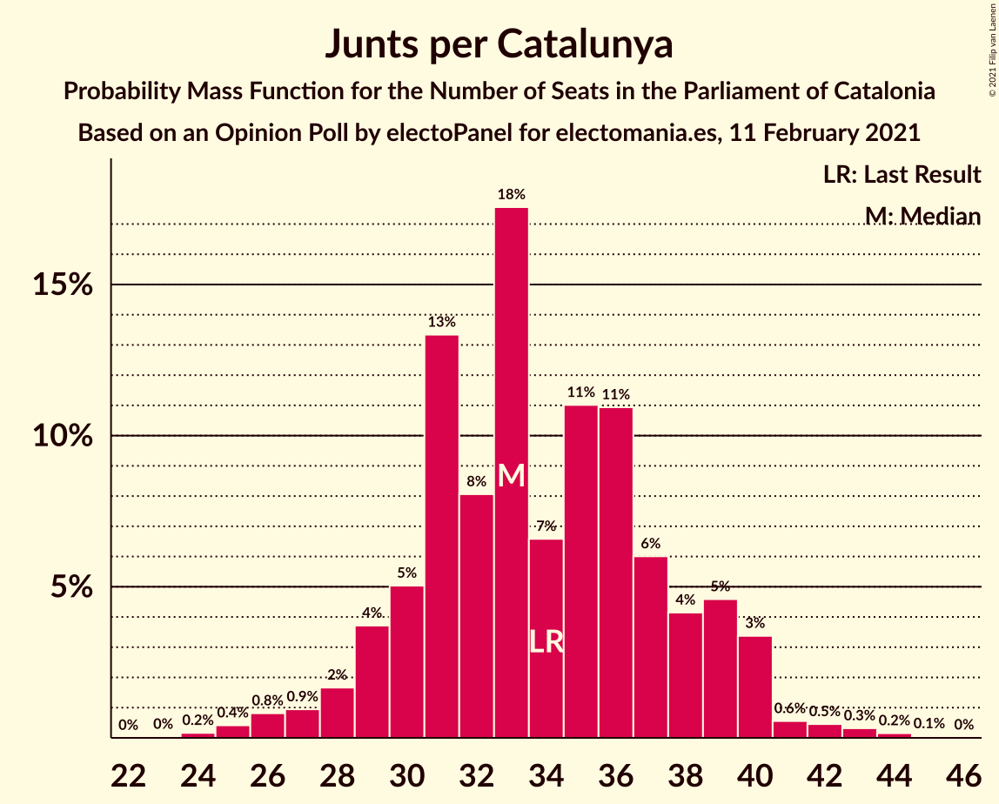
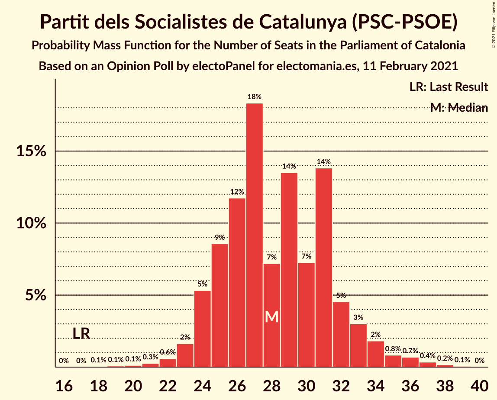
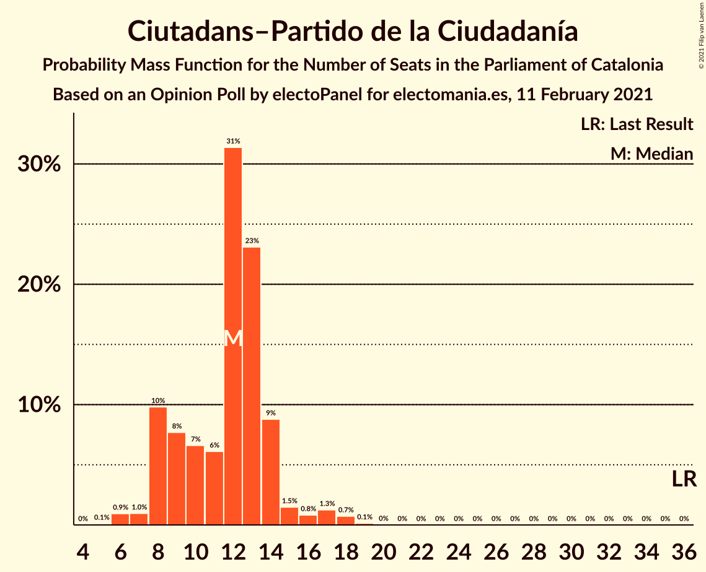
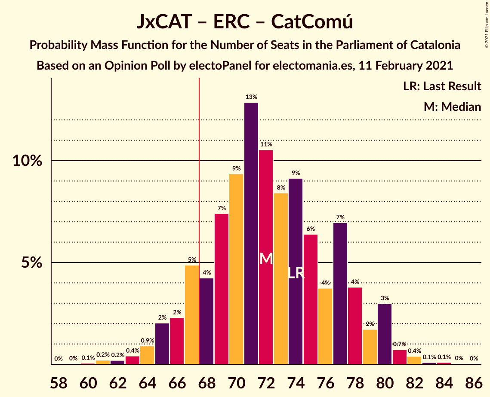
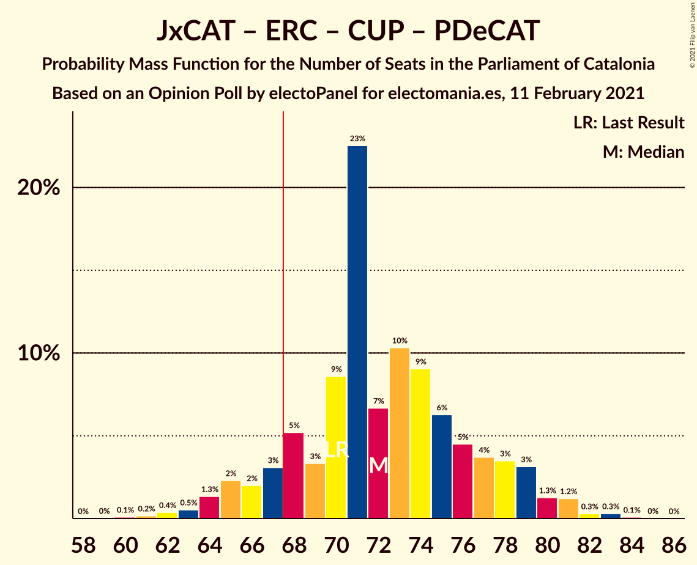

# Opinion Poll by electoPanel for electomania.es, 11 February 2021

<a href="#voting-intentions">Voting Intentions</a> | <a href="#seats">Seats</a> | <a href="#coalitions">Coalitions</a> | <a href="#technical-information">Technical Information</a>

## Voting Intentions

### Confidence Intervals

| Party | Last Result | Poll Result | 80% Confidence Interval | 90% Confidence Interval | 95% Confidence Interval | 99% Confidence Interval |
|:-----:|:-----------:|:-----------:|:-----------------------:|:-----------------------:|:-----------------------:|:-----------------------:|
| Junts per Catalunya | 21.7% | 21.0% | 18.6–23.8% |17.9–24.6% |17.3–25.3% |16.2–26.6% |
| Partit dels Socialistes de Catalunya (PSC-PSOE) | 13.9% | 20.8% | 18.3–23.5% |17.6–24.3% |17.1–25.0% |16.0–26.4% |
| Esquerra Republicana–Catalunya Sí | 21.4% | 20.2% | 17.8–23.0% |17.2–23.8% |16.6–24.5% |15.5–25.8% |
| Ciutadans–Partido de la Ciudadanía | 25.4% | 8.8% | 7.2–10.8% |6.7–11.4% |6.4–11.9% |5.7–13.0% |
| Catalunya en Comú–Podem | 7.5% | 7.0% | 5.6–8.9% |5.2–9.4% |4.9–9.9% |4.3–10.9% |
| Vox | 0.0% | 7.0% | 5.6–8.9% |5.2–9.4% |4.9–9.9% |4.3–10.9% |
| Candidatura d’Unitat Popular | 4.5% | 5.8% | 4.5–7.5% |4.1–8.0% |3.9–8.5% |3.3–9.4% |
| Partit Popular | 4.2% | 5.0% | 3.9–6.7% |3.5–7.2% |3.3–7.6% |2.8–8.5% |
| Partit Demòcrata Europeu Català | 0.0% | 1.5% | 1.0–2.6% |0.8–2.9% |0.7–3.2% |0.5–3.9% |

*Note:* The poll result column reflects the actual value used in the calculations. Published results may vary slightly, and in addition be rounded to fewer digits.

## Seats

### Confidence Intervals

| Party | Last Result | Median | 80% Confidence Interval | 90% Confidence Interval | 95% Confidence Interval | 99% Confidence Interval |
|:-----:|:-----------:|:------:|:-----------------------:|:-----------------------:|:-----------------------:|:-----------------------:|
| <a href="#junts-per-catalunya">Junts per Catalunya</a> | 34 | 33 | 30–39 |29–39 |27–40 |25–43 |
| <a href="#partit-dels-socialistes-de-catalunya-(psc-psoe)">Partit dels Socialistes de Catalunya (PSC-PSOE)</a> | 17 | 29 | 24–32 |24–33 |24–34 |21–36 |
| <a href="#esquerra-republicana–catalunya-sí">Esquerra Republicana–Catalunya Sí</a> | 32 | 30 | 27–35 |26–36 |24–37 |22–39 |
| <a href="#ciutadans–partido-de-la-ciudadanía">Ciutadans–Partido de la Ciudadanía</a> | 36 | 12 | 8–14 |8–15 |8–17 |6–18 |
| <a href="#catalunya-en-comú–podem">Catalunya en Comú–Podem</a> | 8 | 8 | 5–11 |5–11 |5–12 |4–14 |
| <a href="#vox">Vox</a> | 0 | 9 | 7–13 |6–13 |5–14 |5–15 |
| <a href="#candidatura-d’unitat-popular">Candidatura d’Unitat Popular</a> | 4 | 8 | 5–11 |4–11 |4–11 |3–13 |
| <a href="#partit-popular">Partit Popular</a> | 4 | 6 | 3–8 |3–9 |3–10 |0–11 |
| <a href="#partit-demòcrata-europeu-català">Partit Demòcrata Europeu Català</a> | 0 | 0 | 0–1 |0–1 |0–1 |0–5 |

### Junts per Catalunya

*For a full overview of the results for this party, see the [Junts per Catalunya](party-juntspercatalunya.html) page.*

| Number of Seats | Probability | Accumulated | Special Marks |
|:---------------:|:-----------:|:-----------:|:-------------:|
| 23 | 0.1% | 100% |  |
| 24 | 0.1% | 99.9% |  |
| 25 | 0.7% | 99.9% |  |
| 26 | 0.8% | 99.1% |  |
| 27 | 1.0% | 98% |  |
| 28 | 2% | 97% |  |
| 29 | 4% | 96% |  |
| 30 | 3% | 92% |  |
| 31 | 15% | 88% |  |
| 32 | 16% | 74% |  |
| 33 | 10% | 58% | Median |
| 34 | 6% | 48% | Last Result |
| 35 | 4% | 42% |  |
| 36 | 17% | 38% |  |
| 37 | 7% | 22% |  |
| 38 | 5% | 15% |  |
| 39 | 6% | 10% |  |
| 40 | 2% | 4% |  |
| 41 | 0.4% | 2% |  |
| 42 | 0.6% | 1.2% |  |
| 43 | 0.3% | 0.6% |  |
| 44 | 0.2% | 0.3% |  |
| 45 | 0.1% | 0.1% |  |
| 46 | 0% | 0% |  |

### Partit dels Socialistes de Catalunya (PSC-PSOE)

*For a full overview of the results for this party, see the [Partit dels Socialistes de Catalunya (PSC-PSOE)](party-partitdelssocialistesdecatalunyapsc-psoe.html) page.*

| Number of Seats | Probability | Accumulated | Special Marks |
|:---------------:|:-----------:|:-----------:|:-------------:|
| 17 | 0% | 100% | Last Result |
| 18 | 0% | 100% |  |
| 19 | 0.1% | 99.9% |  |
| 20 | 0.2% | 99.9% |  |
| 21 | 0.3% | 99.7% |  |
| 22 | 0.7% | 99.3% |  |
| 23 | 0.7% | 98.6% |  |
| 24 | 13% | 98% |  |
| 25 | 9% | 85% |  |
| 26 | 8% | 76% |  |
| 27 | 8% | 69% |  |
| 28 | 10% | 61% |  |
| 29 | 7% | 51% | Median |
| 30 | 12% | 43% |  |
| 31 | 16% | 31% |  |
| 32 | 7% | 15% |  |
| 33 | 5% | 9% |  |
| 34 | 2% | 4% |  |
| 35 | 0.9% | 2% |  |
| 36 | 0.8% | 1.2% |  |
| 37 | 0.2% | 0.4% |  |
| 38 | 0.1% | 0.2% |  |
| 39 | 0.1% | 0.1% |  |
| 40 | 0% | 0% |  |

### Esquerra Republicana–Catalunya Sí

*For a full overview of the results for this party, see the [Esquerra Republicana–Catalunya Sí](party-esquerrarepublicana–catalunyasí.html) page.*

| Number of Seats | Probability | Accumulated | Special Marks |
|:---------------:|:-----------:|:-----------:|:-------------:|
| 21 | 0.1% | 100% |  |
| 22 | 0.5% | 99.9% |  |
| 23 | 0.6% | 99.4% |  |
| 24 | 2% | 98.8% |  |
| 25 | 2% | 97% |  |
| 26 | 5% | 95% |  |
| 27 | 7% | 90% |  |
| 28 | 15% | 84% |  |
| 29 | 9% | 68% |  |
| 30 | 10% | 59% | Median |
| 31 | 15% | 49% |  |
| 32 | 4% | 33% | Last Result |
| 33 | 9% | 29% |  |
| 34 | 10% | 21% |  |
| 35 | 5% | 11% |  |
| 36 | 3% | 6% |  |
| 37 | 2% | 4% |  |
| 38 | 0.5% | 1.3% |  |
| 39 | 0.3% | 0.8% |  |
| 40 | 0.2% | 0.5% |  |
| 41 | 0.1% | 0.3% |  |
| 42 | 0.1% | 0.1% |  |
| 43 | 0% | 0% |  |

### Ciutadans–Partido de la Ciudadanía

*For a full overview of the results for this party, see the [Ciutadans–Partido de la Ciudadanía](party-ciutadans–partidodelaciudadanía.html) page.*

| Number of Seats | Probability | Accumulated | Special Marks |
|:---------------:|:-----------:|:-----------:|:-------------:|
| 5 | 0.1% | 100% |  |
| 6 | 1.0% | 99.9% |  |
| 7 | 0.7% | 98.9% |  |
| 8 | 15% | 98% |  |
| 9 | 7% | 83% |  |
| 10 | 13% | 76% |  |
| 11 | 7% | 63% |  |
| 12 | 26% | 57% | Median |
| 13 | 13% | 30% |  |
| 14 | 10% | 17% |  |
| 15 | 3% | 7% |  |
| 16 | 0.5% | 4% |  |
| 17 | 2% | 3% |  |
| 18 | 1.3% | 1.4% |  |
| 19 | 0.1% | 0.2% |  |
| 20 | 0.1% | 0.1% |  |
| 21 | 0% | 0% |  |
| 22 | 0% | 0% |  |
| 23 | 0% | 0% |  |
| 24 | 0% | 0% |  |
| 25 | 0% | 0% |  |
| 26 | 0% | 0% |  |
| 27 | 0% | 0% |  |
| 28 | 0% | 0% |  |
| 29 | 0% | 0% |  |
| 30 | 0% | 0% |  |
| 31 | 0% | 0% |  |
| 32 | 0% | 0% |  |
| 33 | 0% | 0% |  |
| 34 | 0% | 0% |  |
| 35 | 0% | 0% |  |
| 36 | 0% | 0% | Last Result |

### Catalunya en Comú–Podem

*For a full overview of the results for this party, see the [Catalunya en Comú–Podem](party-catalunyaencomú–podem.html) page.*

| Number of Seats | Probability | Accumulated | Special Marks |
|:---------------:|:-----------:|:-----------:|:-------------:|
| 3 | 0.1% | 100% |  |
| 4 | 2% | 99.9% |  |
| 5 | 12% | 98% |  |
| 6 | 8% | 86% |  |
| 7 | 17% | 77% |  |
| 8 | 31% | 61% | Last Result, Median |
| 9 | 12% | 29% |  |
| 10 | 7% | 18% |  |
| 11 | 7% | 11% |  |
| 12 | 2% | 4% |  |
| 13 | 0.8% | 2% |  |
| 14 | 0.5% | 0.7% |  |
| 15 | 0% | 0.2% |  |
| 16 | 0.1% | 0.1% |  |
| 17 | 0% | 0% |  |

### Vox

*For a full overview of the results for this party, see the [Vox](party-vox.html) page.*

| Number of Seats | Probability | Accumulated | Special Marks |
|:---------------:|:-----------:|:-----------:|:-------------:|
| 0 | 0% | 100% | Last Result |
| 1 | 0% | 100% |  |
| 2 | 0% | 100% |  |
| 3 | 0.2% | 100% |  |
| 4 | 0.1% | 99.8% |  |
| 5 | 3% | 99.6% |  |
| 6 | 3% | 97% |  |
| 7 | 28% | 94% |  |
| 8 | 5% | 66% |  |
| 9 | 24% | 61% | Median |
| 10 | 11% | 37% |  |
| 11 | 8% | 27% |  |
| 12 | 9% | 19% |  |
| 13 | 5% | 10% |  |
| 14 | 4% | 5% |  |
| 15 | 0.5% | 0.6% |  |
| 16 | 0.1% | 0.1% |  |
| 17 | 0% | 0% |  |

### Candidatura d’Unitat Popular

*For a full overview of the results for this party, see the [Candidatura d’Unitat Popular](party-candidaturad’unitatpopular.html) page.*

| Number of Seats | Probability | Accumulated | Special Marks |
|:---------------:|:-----------:|:-----------:|:-------------:|
| 0 | 0.2% | 100% |  |
| 1 | 0% | 99.8% |  |
| 2 | 0.2% | 99.8% |  |
| 3 | 1.1% | 99.5% |  |
| 4 | 8% | 98% | Last Result |
| 5 | 3% | 90% |  |
| 6 | 5% | 87% |  |
| 7 | 20% | 82% |  |
| 8 | 29% | 62% | Median |
| 9 | 20% | 33% |  |
| 10 | 1.5% | 13% |  |
| 11 | 10% | 11% |  |
| 12 | 1.3% | 2% |  |
| 13 | 0.2% | 0.6% |  |
| 14 | 0.1% | 0.4% |  |
| 15 | 0.3% | 0.3% |  |
| 16 | 0% | 0% |  |

### Partit Popular

*For a full overview of the results for this party, see the [Partit Popular](party-partitpopular.html) page.*

| Number of Seats | Probability | Accumulated | Special Marks |
|:---------------:|:-----------:|:-----------:|:-------------:|
| 0 | 0.8% | 100% |  |
| 1 | 0% | 99.2% |  |
| 2 | 0.9% | 99.2% |  |
| 3 | 13% | 98% |  |
| 4 | 6% | 85% | Last Result |
| 5 | 22% | 79% |  |
| 6 | 17% | 57% | Median |
| 7 | 25% | 40% |  |
| 8 | 5% | 15% |  |
| 9 | 6% | 10% |  |
| 10 | 3% | 3% |  |
| 11 | 0.3% | 0.7% |  |
| 12 | 0.4% | 0.4% |  |
| 13 | 0% | 0% |  |

### Partit Demòcrata Europeu Català

*For a full overview of the results for this party, see the [Partit Demòcrata Europeu Català](party-partitdemòcrataeuropeucatalà.html) page.*

| Number of Seats | Probability | Accumulated | Special Marks |
|:---------------:|:-----------:|:-----------:|:-------------:|
| 0 | 90% | 100% | Last Result, Median |
| 1 | 9% | 10% |  |
| 2 | 0.1% | 2% |  |
| 3 | 0.3% | 1.4% |  |
| 4 | 0.2% | 1.1% |  |
| 5 | 0.8% | 0.9% |  |
| 6 | 0.1% | 0.1% |  |
| 7 | 0% | 0% |  |

## Coalitions

### Confidence Intervals

| Coalition | Last Result | Median | Majority? | 80% Confidence Interval | 90% Confidence Interval | 95% Confidence Interval | 99% Confidence Interval |
|:---------:|:-----------:|:------:|:---------:|:-----------------------:|:-----------------------:|:-----------------------:|:-----------------------:|
| Junts per Catalunya – Esquerra Republicana–Catalunya Sí – Catalunya en Comú–Podem | 74 | 72 | 86% | 67–77 | 65–78 | 65–80 | 63–82 |
| Junts per Catalunya – Esquerra Republicana–Catalunya Sí – Candidatura d’Unitat Popular | 70 | 72 | 87% | 66–78 | 64–79 | 64–79 | 62–81 |
| Junts per Catalunya – Esquerra Republicana–Catalunya Sí – Candidatura d’Unitat Popular – Partit Demòcrata Europeu Català | 70 | 72 | 88% | 66–78 | 65–79 | 64–79 | 62–81 |
| Partit dels Socialistes de Catalunya (PSC-PSOE) – Esquerra Republicana–Catalunya Sí – Catalunya en Comú–Podem | 57 | 67 | 44% | 62–72 | 61–73 | 59–75 | 57–77 |
| Junts per Catalunya – Esquerra Republicana–Catalunya Sí | 66 | 65 | 18% | 59–70 | 57–71 | 57–72 | 55–73 |
| Junts per Catalunya – Esquerra Republicana–Catalunya Sí – Partit Demòcrata Europeu Català | 66 | 65 | 20% | 59–70 | 57–71 | 57–72 | 55–73 |
| Partit dels Socialistes de Catalunya (PSC-PSOE) – Ciutadans–Partido de la Ciudadanía – Vox – Partit Popular | 57 | 55 | 0.1% | 50–61 | 48–62 | 48–63 | 46–64 |
| Partit dels Socialistes de Catalunya (PSC-PSOE) – Ciutadans–Partido de la Ciudadanía – Catalunya en Comú–Podem – Partit Popular | 65 | 54 | 0% | 48–59 | 47–60 | 46–62 | 44–64 |
| Partit dels Socialistes de Catalunya (PSC-PSOE) – Ciutadans–Partido de la Ciudadanía – Partit Popular | 57 | 46 | 0% | 41–51 | 39–52 | 38–53 | 37–55 |
| Esquerra Republicana–Catalunya Sí – Catalunya en Comú–Podem | 40 | 38 | 0% | 34–43 | 33–45 | 32–46 | 30–48 |

### Junts per Catalunya – Esquerra Republicana–Catalunya Sí – Catalunya en Comú–Podem

| Number of Seats | Probability | Accumulated | Special Marks |
|:---------------:|:-----------:|:-----------:|:-------------:|
| 60 | 0.1% | 100% |  |
| 61 | 0.1% | 99.9% |  |
| 62 | 0.2% | 99.7% |  |
| 63 | 0.3% | 99.5% |  |
| 64 | 0.5% | 99.2% |  |
| 65 | 4% | 98.7% |  |
| 66 | 2% | 94% |  |
| 67 | 6% | 92% |  |
| 68 | 6% | 86% | Majority |
| 69 | 6% | 79% |  |
| 70 | 9% | 74% |  |
| 71 | 5% | 64% | Median |
| 72 | 10% | 59% |  |
| 73 | 8% | 49% |  |
| 74 | 10% | 41% | Last Result |
| 75 | 12% | 31% |  |
| 76 | 5% | 19% |  |
| 77 | 5% | 14% |  |
| 78 | 6% | 10% |  |
| 79 | 1.4% | 4% |  |
| 80 | 1.4% | 3% |  |
| 81 | 0.6% | 1.2% |  |
| 82 | 0.2% | 0.6% |  |
| 83 | 0.1% | 0.4% |  |
| 84 | 0.2% | 0.2% |  |
| 85 | 0% | 0.1% |  |
| 86 | 0% | 0.1% |  |
| 87 | 0% | 0% |  |

### Junts per Catalunya – Esquerra Republicana–Catalunya Sí – Candidatura d’Unitat Popular

| Number of Seats | Probability | Accumulated | Special Marks |
|:---------------:|:-----------:|:-----------:|:-------------:|
| 59 | 0% | 100% |  |
| 60 | 0.1% | 99.9% |  |
| 61 | 0.2% | 99.9% |  |
| 62 | 0.8% | 99.7% |  |
| 63 | 0.3% | 98.8% |  |
| 64 | 4% | 98.6% |  |
| 65 | 2% | 95% |  |
| 66 | 3% | 92% |  |
| 67 | 2% | 89% |  |
| 68 | 7% | 87% | Majority |
| 69 | 5% | 81% |  |
| 70 | 8% | 76% | Last Result |
| 71 | 8% | 68% | Median |
| 72 | 12% | 60% |  |
| 73 | 11% | 48% |  |
| 74 | 15% | 37% |  |
| 75 | 3% | 23% |  |
| 76 | 6% | 20% |  |
| 77 | 3% | 14% |  |
| 78 | 2% | 11% |  |
| 79 | 8% | 10% |  |
| 80 | 0.4% | 2% |  |
| 81 | 1.0% | 1.4% |  |
| 82 | 0.2% | 0.4% |  |
| 83 | 0.1% | 0.2% |  |
| 84 | 0% | 0.1% |  |
| 85 | 0% | 0% |  |

### Junts per Catalunya – Esquerra Republicana–Catalunya Sí – Candidatura d’Unitat Popular – Partit Demòcrata Europeu Català

| Number of Seats | Probability | Accumulated | Special Marks |
|:---------------:|:-----------:|:-----------:|:-------------:|
| 60 | 0.1% | 100% |  |
| 61 | 0.2% | 99.9% |  |
| 62 | 0.7% | 99.7% |  |
| 63 | 0.4% | 99.1% |  |
| 64 | 3% | 98.6% |  |
| 65 | 3% | 95% |  |
| 66 | 3% | 93% |  |
| 67 | 2% | 90% |  |
| 68 | 6% | 88% | Majority |
| 69 | 5% | 82% |  |
| 70 | 7% | 77% | Last Result |
| 71 | 9% | 70% | Median |
| 72 | 11% | 61% |  |
| 73 | 10% | 50% |  |
| 74 | 16% | 40% |  |
| 75 | 3% | 24% |  |
| 76 | 5% | 21% |  |
| 77 | 4% | 15% |  |
| 78 | 2% | 12% |  |
| 79 | 8% | 10% |  |
| 80 | 0.4% | 2% |  |
| 81 | 1.1% | 2% |  |
| 82 | 0.2% | 0.4% |  |
| 83 | 0.1% | 0.2% |  |
| 84 | 0% | 0.1% |  |
| 85 | 0% | 0% |  |

### Partit dels Socialistes de Catalunya (PSC-PSOE) – Esquerra Republicana–Catalunya Sí – Catalunya en Comú–Podem

| Number of Seats | Probability | Accumulated | Special Marks |
|:---------------:|:-----------:|:-----------:|:-------------:|
| 55 | 0.2% | 100% |  |
| 56 | 0.1% | 99.8% |  |
| 57 | 0.7% | 99.7% | Last Result |
| 58 | 1.3% | 99.0% |  |
| 59 | 0.7% | 98% |  |
| 60 | 2% | 97% |  |
| 61 | 2% | 95% |  |
| 62 | 8% | 93% |  |
| 63 | 7% | 86% |  |
| 64 | 11% | 78% |  |
| 65 | 6% | 67% |  |
| 66 | 10% | 61% |  |
| 67 | 7% | 51% | Median |
| 68 | 8% | 44% | Majority |
| 69 | 12% | 36% |  |
| 70 | 4% | 24% |  |
| 71 | 6% | 20% |  |
| 72 | 8% | 14% |  |
| 73 | 3% | 6% |  |
| 74 | 0.7% | 3% |  |
| 75 | 1.2% | 3% |  |
| 76 | 0.5% | 1.4% |  |
| 77 | 0.7% | 1.0% |  |
| 78 | 0.1% | 0.3% |  |
| 79 | 0.1% | 0.2% |  |
| 80 | 0% | 0.1% |  |
| 81 | 0% | 0% |  |

### Junts per Catalunya – Esquerra Republicana–Catalunya Sí

| Number of Seats | Probability | Accumulated | Special Marks |
|:---------------:|:-----------:|:-----------:|:-------------:|
| 52 | 0.1% | 100% |  |
| 53 | 0.2% | 99.9% |  |
| 54 | 0.2% | 99.7% |  |
| 55 | 0.2% | 99.5% |  |
| 56 | 0.9% | 99.3% |  |
| 57 | 4% | 98% |  |
| 58 | 4% | 94% |  |
| 59 | 2% | 91% |  |
| 60 | 8% | 89% |  |
| 61 | 3% | 80% |  |
| 62 | 9% | 77% |  |
| 63 | 6% | 68% | Median |
| 64 | 10% | 61% |  |
| 65 | 14% | 51% |  |
| 66 | 6% | 37% | Last Result |
| 67 | 13% | 31% |  |
| 68 | 3% | 18% | Majority |
| 69 | 3% | 14% |  |
| 70 | 6% | 12% |  |
| 71 | 3% | 6% |  |
| 72 | 2% | 3% |  |
| 73 | 0.9% | 1.3% |  |
| 74 | 0.1% | 0.3% |  |
| 75 | 0.1% | 0.3% |  |
| 76 | 0.1% | 0.2% |  |
| 77 | 0% | 0.1% |  |
| 78 | 0% | 0.1% |  |
| 79 | 0% | 0% |  |

### Junts per Catalunya – Esquerra Republicana–Catalunya Sí – Partit Demòcrata Europeu Català

| Number of Seats | Probability | Accumulated | Special Marks |
|:---------------:|:-----------:|:-----------:|:-------------:|
| 52 | 0.1% | 100% |  |
| 53 | 0.1% | 99.9% |  |
| 54 | 0.2% | 99.8% |  |
| 55 | 0.2% | 99.6% |  |
| 56 | 0.6% | 99.4% |  |
| 57 | 4% | 98.8% |  |
| 58 | 3% | 95% |  |
| 59 | 3% | 92% |  |
| 60 | 8% | 89% |  |
| 61 | 3% | 81% |  |
| 62 | 8% | 78% |  |
| 63 | 7% | 70% | Median |
| 64 | 8% | 62% |  |
| 65 | 15% | 54% |  |
| 66 | 7% | 39% | Last Result |
| 67 | 12% | 32% |  |
| 68 | 5% | 20% | Majority |
| 69 | 3% | 15% |  |
| 70 | 6% | 12% |  |
| 71 | 3% | 6% |  |
| 72 | 2% | 3% |  |
| 73 | 1.0% | 1.4% |  |
| 74 | 0.1% | 0.5% |  |
| 75 | 0.1% | 0.4% |  |
| 76 | 0.2% | 0.3% |  |
| 77 | 0% | 0.1% |  |
| 78 | 0% | 0.1% |  |
| 79 | 0% | 0% |  |

### Partit dels Socialistes de Catalunya (PSC-PSOE) – Ciutadans–Partido de la Ciudadanía – Vox – Partit Popular

| Number of Seats | Probability | Accumulated | Special Marks |
|:---------------:|:-----------:|:-----------:|:-------------:|
| 43 | 0% | 100% |  |
| 44 | 0.1% | 99.9% |  |
| 45 | 0.2% | 99.8% |  |
| 46 | 1.0% | 99.6% |  |
| 47 | 0.6% | 98.6% |  |
| 48 | 5% | 98% |  |
| 49 | 2% | 93% |  |
| 50 | 8% | 91% |  |
| 51 | 6% | 83% |  |
| 52 | 3% | 77% |  |
| 53 | 11% | 74% |  |
| 54 | 11% | 62% |  |
| 55 | 9% | 51% |  |
| 56 | 13% | 43% | Median |
| 57 | 3% | 29% | Last Result |
| 58 | 5% | 27% |  |
| 59 | 6% | 22% |  |
| 60 | 3% | 15% |  |
| 61 | 5% | 12% |  |
| 62 | 3% | 7% |  |
| 63 | 2% | 3% |  |
| 64 | 0.4% | 0.8% |  |
| 65 | 0.2% | 0.4% |  |
| 66 | 0.1% | 0.2% |  |
| 67 | 0% | 0.1% |  |
| 68 | 0.1% | 0.1% | Majority |
| 69 | 0% | 0% |  |

### Partit dels Socialistes de Catalunya (PSC-PSOE) – Ciutadans–Partido de la Ciudadanía – Catalunya en Comú–Podem – Partit Popular

| Number of Seats | Probability | Accumulated | Special Marks |
|:---------------:|:-----------:|:-----------:|:-------------:|
| 42 | 0.1% | 100% |  |
| 43 | 0.1% | 99.9% |  |
| 44 | 0.3% | 99.8% |  |
| 45 | 1.0% | 99.5% |  |
| 46 | 2% | 98.5% |  |
| 47 | 5% | 97% |  |
| 48 | 3% | 92% |  |
| 49 | 8% | 89% |  |
| 50 | 3% | 81% |  |
| 51 | 7% | 78% |  |
| 52 | 15% | 71% |  |
| 53 | 4% | 55% |  |
| 54 | 9% | 51% |  |
| 55 | 9% | 42% | Median |
| 56 | 7% | 33% |  |
| 57 | 9% | 26% |  |
| 58 | 5% | 17% |  |
| 59 | 5% | 12% |  |
| 60 | 3% | 7% |  |
| 61 | 0.7% | 4% |  |
| 62 | 3% | 4% |  |
| 63 | 0.3% | 0.9% |  |
| 64 | 0.4% | 0.6% |  |
| 65 | 0.1% | 0.3% | Last Result |
| 66 | 0.1% | 0.1% |  |
| 67 | 0.1% | 0.1% |  |
| 68 | 0% | 0% | Majority |

### Partit dels Socialistes de Catalunya (PSC-PSOE) – Ciutadans–Partido de la Ciudadanía – Partit Popular

| Number of Seats | Probability | Accumulated | Special Marks |
|:---------------:|:-----------:|:-----------:|:-------------:|
| 35 | 0.1% | 100% |  |
| 36 | 0.3% | 99.9% |  |
| 37 | 1.2% | 99.5% |  |
| 38 | 0.9% | 98% |  |
| 39 | 5% | 97% |  |
| 40 | 3% | 93% |  |
| 41 | 3% | 90% |  |
| 42 | 9% | 87% |  |
| 43 | 10% | 78% |  |
| 44 | 10% | 69% |  |
| 45 | 7% | 58% |  |
| 46 | 7% | 51% |  |
| 47 | 9% | 45% | Median |
| 48 | 8% | 35% |  |
| 49 | 10% | 27% |  |
| 50 | 7% | 18% |  |
| 51 | 5% | 11% |  |
| 52 | 3% | 6% |  |
| 53 | 2% | 3% |  |
| 54 | 0.8% | 2% |  |
| 55 | 0.3% | 0.7% |  |
| 56 | 0.1% | 0.4% |  |
| 57 | 0.2% | 0.3% | Last Result |
| 58 | 0.1% | 0.1% |  |
| 59 | 0% | 0% |  |

### Esquerra Republicana–Catalunya Sí – Catalunya en Comú–Podem

| Number of Seats | Probability | Accumulated | Special Marks |
|:---------------:|:-----------:|:-----------:|:-------------:|
| 27 | 0.1% | 100% |  |
| 28 | 0.1% | 99.9% |  |
| 29 | 0.2% | 99.8% |  |
| 30 | 0.3% | 99.6% |  |
| 31 | 0.5% | 99.3% |  |
| 32 | 2% | 98.8% |  |
| 33 | 3% | 97% |  |
| 34 | 7% | 94% |  |
| 35 | 8% | 86% |  |
| 36 | 11% | 79% |  |
| 37 | 10% | 68% |  |
| 38 | 9% | 57% | Median |
| 39 | 16% | 48% |  |
| 40 | 8% | 32% | Last Result |
| 41 | 5% | 24% |  |
| 42 | 6% | 18% |  |
| 43 | 4% | 12% |  |
| 44 | 3% | 9% |  |
| 45 | 4% | 6% |  |
| 46 | 1.2% | 3% |  |
| 47 | 0.7% | 1.4% |  |
| 48 | 0.3% | 0.7% |  |
| 49 | 0.3% | 0.4% |  |
| 50 | 0.1% | 0.1% |  |
| 51 | 0% | 0% |  |

## Technical Information

### Opinion Poll

+ **Polling firm:** electoPanel
+ **Commissioner(s):** electomania.es
+ **Fieldwork period:** 11 February 2021

### Calculations

+ **Sample size:** 400
+ **Simulations done:** 262,144
+ **Error estimate:** 4.04%

