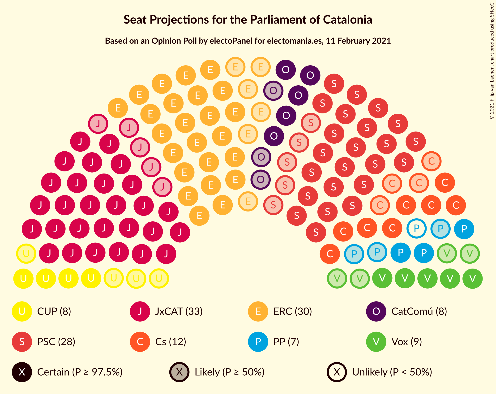
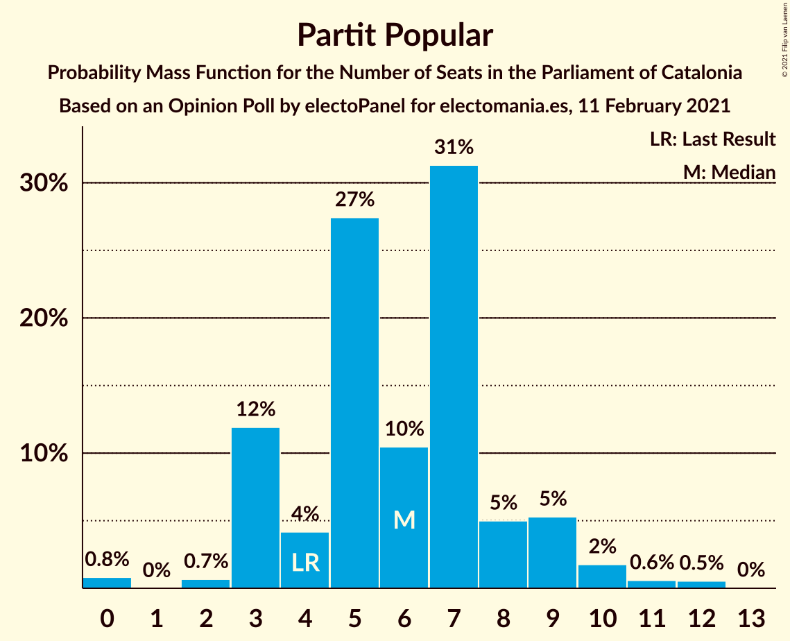
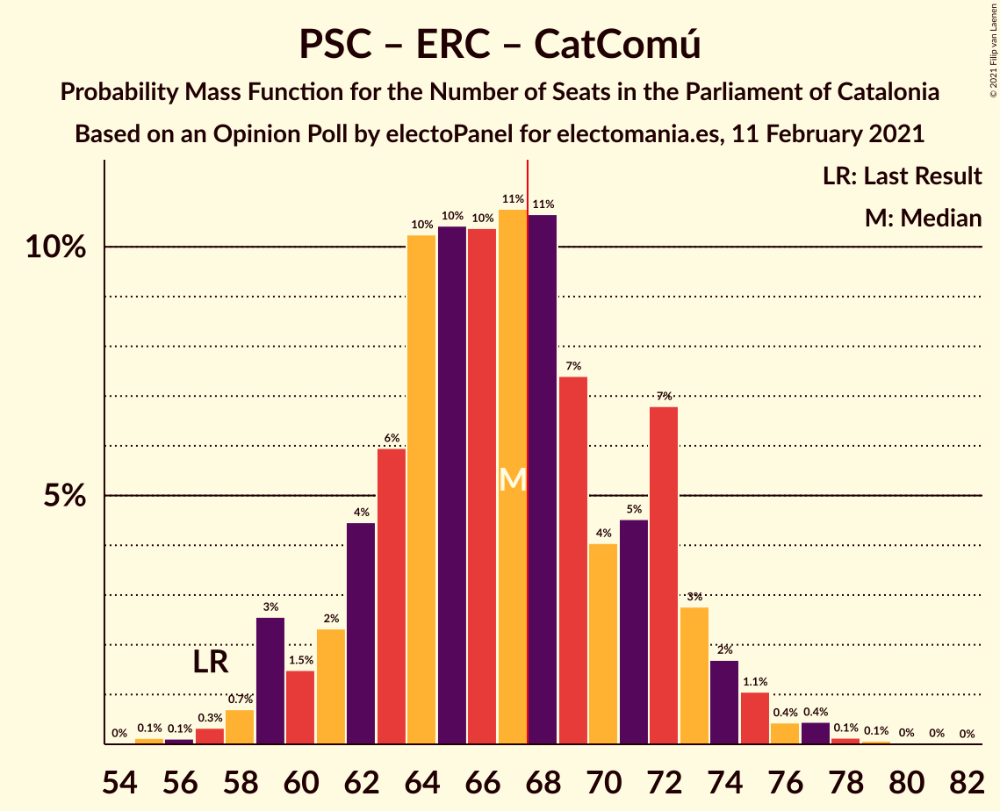
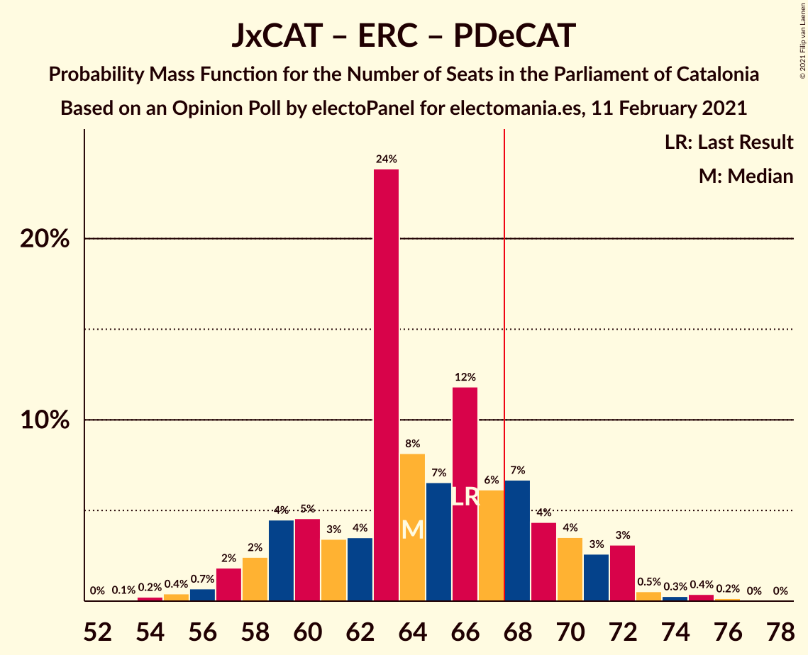

# Opinion Poll by electoPanel for electomania.es, 11 February 2021

<a href="#voting-intentions">Voting Intentions</a> | <a href="#seats">Seats</a> | <a href="#coalitions">Coalitions</a> | <a href="#technical-information">Technical Information</a>

## Voting Intentions

### Confidence Intervals

| Party | Last Result | Poll Result | 80% Confidence Interval | 90% Confidence Interval | 95% Confidence Interval | 99% Confidence Interval |
|:-----:|:-----------:|:-----------:|:-----------------------:|:-----------------------:|:-----------------------:|:-----------------------:|
| Junts per Catalunya | 21.7% | 21.0% | 18.6–23.8% |17.9–24.6% |17.3–25.3% |16.2–26.6% |
| Partit dels Socialistes de Catalunya (PSC-PSOE) | 13.9% | 20.8% | 18.3–23.5% |17.6–24.3% |17.1–25.0% |16.0–26.4% |
| Esquerra Republicana–Catalunya Sí | 21.4% | 20.2% | 17.8–23.0% |17.2–23.8% |16.6–24.5% |15.5–25.8% |
| Ciutadans–Partido de la Ciudadanía | 25.4% | 8.8% | 7.2–10.8% |6.7–11.4% |6.4–11.9% |5.7–13.0% |
| Catalunya en Comú–Podem | 7.5% | 7.0% | 5.6–8.9% |5.2–9.4% |4.9–9.9% |4.3–10.9% |
| Vox | 0.0% | 7.0% | 5.6–8.9% |5.2–9.4% |4.9–9.9% |4.3–10.9% |
| Candidatura d’Unitat Popular | 4.5% | 5.8% | 4.5–7.5% |4.1–8.0% |3.9–8.5% |3.3–9.4% |
| Partit Popular | 4.2% | 5.0% | 3.9–6.7% |3.5–7.2% |3.3–7.6% |2.8–8.5% |
| Partit Demòcrata Europeu Català | 0.0% | 1.5% | 1.0–2.6% |0.8–2.9% |0.7–3.2% |0.5–3.9% |

*Note:* The poll result column reflects the actual value used in the calculations. Published results may vary slightly, and in addition be rounded to fewer digits.

## Seats

### Confidence Intervals

| Party | Last Result | Median | 80% Confidence Interval | 90% Confidence Interval | 95% Confidence Interval | 99% Confidence Interval |
|:-----:|:-----------:|:------:|:-----------------------:|:-----------------------:|:-----------------------:|:-----------------------:|
| <a href="#junts-per-catalunya">Junts per Catalunya</a> | 34 | 33 | 30–38 |29–39 |28–40 |25–43 |
| <a href="#partit-dels-socialistes-de-catalunya-(psc-psoe)">Partit dels Socialistes de Catalunya (PSC-PSOE)</a> | 17 | 28 | 25–32 |24–33 |23–34 |21–37 |
| <a href="#esquerra-republicana–catalunya-sí">Esquerra Republicana–Catalunya Sí</a> | 32 | 30 | 27–35 |25–36 |24–37 |22–39 |
| <a href="#ciutadans–partido-de-la-ciudadanía">Ciutadans–Partido de la Ciudadanía</a> | 36 | 12 | 8–14 |8–14 |8–16 |6–18 |
| <a href="#catalunya-en-comú–podem">Catalunya en Comú–Podem</a> | 8 | 8 | 5–11 |5–11 |5–12 |4–14 |
| <a href="#vox">Vox</a> | 0 | 9 | 7–12 |6–12 |5–14 |5–15 |
| <a href="#candidatura-d’unitat-popular">Candidatura d’Unitat Popular</a> | 4 | 8 | 5–10 |4–11 |4–11 |3–13 |
| <a href="#partit-popular">Partit Popular</a> | 4 | 6 | 3–8 |3–9 |3–10 |0–12 |
| <a href="#partit-demòcrata-europeu-català">Partit Demòcrata Europeu Català</a> | 0 | 0 | 0 |0–1 |0–1 |0–5 |

### Junts per Catalunya

*For a full overview of the results for this party, see the [Junts per Catalunya](party-juntspercatalunya.html) page.*

| Number of Seats | Probability | Accumulated | Special Marks |
|:---------------:|:-----------:|:-----------:|:-------------:|
| 24 | 0.2% | 100% |  |
| 25 | 0.4% | 99.8% |  |
| 26 | 0.8% | 99.4% |  |
| 27 | 0.9% | 98.6% |  |
| 28 | 2% | 98% |  |
| 29 | 4% | 96% |  |
| 30 | 5% | 92% |  |
| 31 | 13% | 87% |  |
| 32 | 8% | 74% |  |
| 33 | 18% | 66% | Median |
| 34 | 7% | 48% | Last Result |
| 35 | 11% | 42% |  |
| 36 | 11% | 31% |  |
| 37 | 6% | 20% |  |
| 38 | 4% | 14% |  |
| 39 | 5% | 10% |  |
| 40 | 3% | 5% |  |
| 41 | 0.6% | 2% |  |
| 42 | 0.5% | 1.0% |  |
| 43 | 0.3% | 0.6% |  |
| 44 | 0.2% | 0.2% |  |
| 45 | 0.1% | 0.1% |  |
| 46 | 0% | 0% |  |

### Partit dels Socialistes de Catalunya (PSC-PSOE)

*For a full overview of the results for this party, see the [Partit dels Socialistes de Catalunya (PSC-PSOE)](party-partitdelssocialistesdecatalunyapsc-psoe.html) page.*

| Number of Seats | Probability | Accumulated | Special Marks |
|:---------------:|:-----------:|:-----------:|:-------------:|
| 17 | 0% | 100% | Last Result |
| 18 | 0.1% | 100% |  |
| 19 | 0.1% | 99.9% |  |
| 20 | 0.1% | 99.9% |  |
| 21 | 0.3% | 99.7% |  |
| 22 | 0.6% | 99.5% |  |
| 23 | 2% | 98.9% |  |
| 24 | 5% | 97% |  |
| 25 | 9% | 92% |  |
| 26 | 12% | 83% |  |
| 27 | 18% | 72% |  |
| 28 | 7% | 53% | Median |
| 29 | 14% | 46% |  |
| 30 | 7% | 33% |  |
| 31 | 14% | 25% |  |
| 32 | 5% | 12% |  |
| 33 | 3% | 7% |  |
| 34 | 2% | 4% |  |
| 35 | 0.8% | 2% |  |
| 36 | 0.7% | 1.3% |  |
| 37 | 0.4% | 0.6% |  |
| 38 | 0.2% | 0.3% |  |
| 39 | 0.1% | 0.1% |  |
| 40 | 0% | 0% |  |

### Esquerra Republicana–Catalunya Sí

*For a full overview of the results for this party, see the [Esquerra Republicana–Catalunya Sí](party-esquerrarepublicana–catalunyasí.html) page.*

| Number of Seats | Probability | Accumulated | Special Marks |
|:---------------:|:-----------:|:-----------:|:-------------:|
| 21 | 0.1% | 100% |  |
| 22 | 0.4% | 99.9% |  |
| 23 | 0.4% | 99.5% |  |
| 24 | 2% | 99.0% |  |
| 25 | 3% | 97% |  |
| 26 | 4% | 94% |  |
| 27 | 4% | 90% |  |
| 28 | 11% | 86% |  |
| 29 | 10% | 75% |  |
| 30 | 18% | 65% | Median |
| 31 | 13% | 47% |  |
| 32 | 8% | 34% | Last Result |
| 33 | 7% | 25% |  |
| 34 | 7% | 19% |  |
| 35 | 5% | 12% |  |
| 36 | 2% | 7% |  |
| 37 | 3% | 5% |  |
| 38 | 1.0% | 2% |  |
| 39 | 0.6% | 0.8% |  |
| 40 | 0.1% | 0.3% |  |
| 41 | 0.1% | 0.1% |  |
| 42 | 0.1% | 0.1% |  |
| 43 | 0% | 0% |  |

### Ciutadans–Partido de la Ciudadanía

*For a full overview of the results for this party, see the [Ciutadans–Partido de la Ciudadanía](party-ciutadans–partidodelaciudadanía.html) page.*

| Number of Seats | Probability | Accumulated | Special Marks |
|:---------------:|:-----------:|:-----------:|:-------------:|
| 5 | 0.1% | 100% |  |
| 6 | 0.9% | 99.9% |  |
| 7 | 1.0% | 98.9% |  |
| 8 | 10% | 98% |  |
| 9 | 8% | 88% |  |
| 10 | 7% | 80% |  |
| 11 | 6% | 74% |  |
| 12 | 31% | 68% | Median |
| 13 | 23% | 36% |  |
| 14 | 9% | 13% |  |
| 15 | 1.5% | 4% |  |
| 16 | 0.8% | 3% |  |
| 17 | 1.3% | 2% |  |
| 18 | 0.7% | 0.9% |  |
| 19 | 0.1% | 0.2% |  |
| 20 | 0% | 0% |  |
| 21 | 0% | 0% |  |
| 22 | 0% | 0% |  |
| 23 | 0% | 0% |  |
| 24 | 0% | 0% |  |
| 25 | 0% | 0% |  |
| 26 | 0% | 0% |  |
| 27 | 0% | 0% |  |
| 28 | 0% | 0% |  |
| 29 | 0% | 0% |  |
| 30 | 0% | 0% |  |
| 31 | 0% | 0% |  |
| 32 | 0% | 0% |  |
| 33 | 0% | 0% |  |
| 34 | 0% | 0% |  |
| 35 | 0% | 0% |  |
| 36 | 0% | 0% | Last Result |

### Catalunya en Comú–Podem

*For a full overview of the results for this party, see the [Catalunya en Comú–Podem](party-catalunyaencomú–podem.html) page.*

| Number of Seats | Probability | Accumulated | Special Marks |
|:---------------:|:-----------:|:-----------:|:-------------:|
| 3 | 0.1% | 100% |  |
| 4 | 2% | 99.9% |  |
| 5 | 8% | 98% |  |
| 6 | 12% | 90% |  |
| 7 | 16% | 78% |  |
| 8 | 32% | 62% | Last Result, Median |
| 9 | 14% | 30% |  |
| 10 | 5% | 15% |  |
| 11 | 7% | 10% |  |
| 12 | 2% | 3% |  |
| 13 | 1.2% | 2% |  |
| 14 | 0.5% | 0.7% |  |
| 15 | 0.1% | 0.2% |  |
| 16 | 0.1% | 0.1% |  |
| 17 | 0% | 0% |  |

### Vox

*For a full overview of the results for this party, see the [Vox](party-vox.html) page.*

| Number of Seats | Probability | Accumulated | Special Marks |
|:---------------:|:-----------:|:-----------:|:-------------:|
| 0 | 0% | 100% | Last Result |
| 1 | 0% | 100% |  |
| 2 | 0% | 100% |  |
| 3 | 0.2% | 100% |  |
| 4 | 0.2% | 99.8% |  |
| 5 | 4% | 99.6% |  |
| 6 | 3% | 96% |  |
| 7 | 21% | 93% |  |
| 8 | 7% | 72% |  |
| 9 | 28% | 65% | Median |
| 10 | 15% | 38% |  |
| 11 | 10% | 23% |  |
| 12 | 8% | 13% |  |
| 13 | 2% | 5% |  |
| 14 | 2% | 3% |  |
| 15 | 0.7% | 0.8% |  |
| 16 | 0.1% | 0.1% |  |
| 17 | 0% | 0% |  |

### Candidatura d’Unitat Popular

*For a full overview of the results for this party, see the [Candidatura d’Unitat Popular](party-candidaturad’unitatpopular.html) page.*

| Number of Seats | Probability | Accumulated | Special Marks |
|:---------------:|:-----------:|:-----------:|:-------------:|
| 0 | 0.1% | 100% |  |
| 1 | 0% | 99.9% |  |
| 2 | 0.3% | 99.9% |  |
| 3 | 1.3% | 99.5% |  |
| 4 | 7% | 98% | Last Result |
| 5 | 5% | 91% |  |
| 6 | 4% | 86% |  |
| 7 | 19% | 82% |  |
| 8 | 37% | 63% | Median |
| 9 | 16% | 26% |  |
| 10 | 3% | 10% |  |
| 11 | 6% | 7% |  |
| 12 | 0.6% | 1.1% |  |
| 13 | 0.2% | 0.5% |  |
| 14 | 0.1% | 0.3% |  |
| 15 | 0.2% | 0.2% |  |
| 16 | 0% | 0% |  |

### Partit Popular

*For a full overview of the results for this party, see the [Partit Popular](party-partitpopular.html) page.*

| Number of Seats | Probability | Accumulated | Special Marks |
|:---------------:|:-----------:|:-----------:|:-------------:|
| 0 | 0.8% | 100% |  |
| 1 | 0% | 99.2% |  |
| 2 | 0.7% | 99.2% |  |
| 3 | 12% | 98.5% |  |
| 4 | 4% | 87% | Last Result |
| 5 | 27% | 82% |  |
| 6 | 10% | 55% | Median |
| 7 | 31% | 45% |  |
| 8 | 5% | 13% |  |
| 9 | 5% | 8% |  |
| 10 | 2% | 3% |  |
| 11 | 0.6% | 1.2% |  |
| 12 | 0.5% | 0.6% |  |
| 13 | 0% | 0% |  |

### Partit Demòcrata Europeu Català

*For a full overview of the results for this party, see the [Partit Demòcrata Europeu Català](party-partitdemòcrataeuropeucatalà.html) page.*

| Number of Seats | Probability | Accumulated | Special Marks |
|:---------------:|:-----------:|:-----------:|:-------------:|
| 0 | 91% | 100% | Last Result, Median |
| 1 | 8% | 9% |  |
| 2 | 0% | 1.3% |  |
| 3 | 0.2% | 1.3% |  |
| 4 | 0.2% | 1.1% |  |
| 5 | 0.7% | 0.8% |  |
| 6 | 0.1% | 0.1% |  |
| 7 | 0% | 0% |  |

## Coalitions

### Confidence Intervals

| Coalition | Last Result | Median | Majority? | 80% Confidence Interval | 90% Confidence Interval | 95% Confidence Interval | 99% Confidence Interval |
|:---------:|:-----------:|:------:|:---------:|:-----------------------:|:-----------------------:|:-----------------------:|:-----------------------:|
| Junts per Catalunya – Esquerra Republicana–Catalunya Sí – Catalunya en Comú–Podem | 74 | 72 | 89% | 67–77 | 66–79 | 65–80 | 62–82 |
| Junts per Catalunya – Esquerra Republicana–Catalunya Sí – Candidatura d’Unitat Popular | 70 | 71 | 90% | 67–77 | 65–79 | 64–80 | 62–82 |
| Junts per Catalunya – Esquerra Republicana–Catalunya Sí – Candidatura d’Unitat Popular – Partit Demòcrata Europeu Català | 70 | 72 | 90% | 68–77 | 66–79 | 64–80 | 62–82 |
| Partit dels Socialistes de Catalunya (PSC-PSOE) – Esquerra Republicana–Catalunya Sí – Catalunya en Comú–Podem | 57 | 67 | 40% | 62–72 | 60–73 | 59–74 | 57–77 |
| Junts per Catalunya – Esquerra Republicana–Catalunya Sí | 66 | 64 | 20% | 59–70 | 58–71 | 57–72 | 55–75 |
| Junts per Catalunya – Esquerra Republicana–Catalunya Sí – Partit Demòcrata Europeu Català | 66 | 64 | 22% | 59–70 | 58–71 | 57–72 | 55–75 |
| Partit dels Socialistes de Catalunya (PSC-PSOE) – Ciutadans–Partido de la Ciudadanía – Vox – Partit Popular | 57 | 55 | 0.1% | 50–60 | 48–61 | 47–62 | 45–65 |
| Partit dels Socialistes de Catalunya (PSC-PSOE) – Ciutadans–Partido de la Ciudadanía – Catalunya en Comú–Podem – Partit Popular | 65 | 54 | 0% | 49–58 | 48–60 | 47–61 | 44–64 |
| Partit dels Socialistes de Catalunya (PSC-PSOE) – Ciutadans–Partido de la Ciudadanía – Partit Popular | 57 | 46 | 0% | 41–50 | 40–51 | 39–53 | 37–55 |
| Esquerra Republicana–Catalunya Sí – Catalunya en Comú–Podem | 40 | 38 | 0% | 34–43 | 33–44 | 32–46 | 30–48 |

### Junts per Catalunya – Esquerra Republicana–Catalunya Sí – Catalunya en Comú–Podem

| Number of Seats | Probability | Accumulated | Special Marks |
|:---------------:|:-----------:|:-----------:|:-------------:|
| 59 | 0% | 100% |  |
| 60 | 0.1% | 99.9% |  |
| 61 | 0.2% | 99.9% |  |
| 62 | 0.2% | 99.7% |  |
| 63 | 0.4% | 99.5% |  |
| 64 | 0.9% | 99.1% |  |
| 65 | 2% | 98% |  |
| 66 | 2% | 96% |  |
| 67 | 5% | 94% |  |
| 68 | 4% | 89% | Majority |
| 69 | 7% | 85% |  |
| 70 | 9% | 77% |  |
| 71 | 13% | 68% | Median |
| 72 | 11% | 55% |  |
| 73 | 8% | 45% |  |
| 74 | 9% | 36% | Last Result |
| 75 | 6% | 27% |  |
| 76 | 4% | 21% |  |
| 77 | 7% | 17% |  |
| 78 | 4% | 10% |  |
| 79 | 2% | 6% |  |
| 80 | 3% | 4% |  |
| 81 | 0.7% | 1.4% |  |
| 82 | 0.4% | 0.7% |  |
| 83 | 0.1% | 0.3% |  |
| 84 | 0.1% | 0.2% |  |
| 85 | 0% | 0.1% |  |
| 86 | 0% | 0% |  |

### Junts per Catalunya – Esquerra Republicana–Catalunya Sí – Candidatura d’Unitat Popular

| Number of Seats | Probability | Accumulated | Special Marks |
|:---------------:|:-----------:|:-----------:|:-------------:|
| 59 | 0% | 100% |  |
| 60 | 0.1% | 99.9% |  |
| 61 | 0.2% | 99.8% |  |
| 62 | 0.4% | 99.6% |  |
| 63 | 0.5% | 99.2% |  |
| 64 | 2% | 98.6% |  |
| 65 | 2% | 97% |  |
| 66 | 2% | 95% |  |
| 67 | 3% | 92% |  |
| 68 | 5% | 90% | Majority |
| 69 | 4% | 84% |  |
| 70 | 9% | 80% | Last Result |
| 71 | 22% | 71% | Median |
| 72 | 7% | 49% |  |
| 73 | 10% | 42% |  |
| 74 | 10% | 32% |  |
| 75 | 5% | 23% |  |
| 76 | 4% | 17% |  |
| 77 | 4% | 13% |  |
| 78 | 3% | 9% |  |
| 79 | 3% | 6% |  |
| 80 | 1.3% | 3% |  |
| 81 | 1.1% | 2% |  |
| 82 | 0.3% | 0.7% |  |
| 83 | 0.3% | 0.4% |  |
| 84 | 0.1% | 0.1% |  |
| 85 | 0% | 0% |  |

### Junts per Catalunya – Esquerra Republicana–Catalunya Sí – Candidatura d’Unitat Popular – Partit Demòcrata Europeu Català

| Number of Seats | Probability | Accumulated | Special Marks |
|:---------------:|:-----------:|:-----------:|:-------------:|
| 60 | 0.1% | 100% |  |
| 61 | 0.2% | 99.9% |  |
| 62 | 0.4% | 99.7% |  |
| 63 | 0.5% | 99.3% |  |
| 64 | 1.3% | 98.8% |  |
| 65 | 2% | 97% |  |
| 66 | 2% | 95% |  |
| 67 | 3% | 93% |  |
| 68 | 5% | 90% | Majority |
| 69 | 3% | 85% |  |
| 70 | 9% | 82% | Last Result |
| 71 | 23% | 73% | Median |
| 72 | 7% | 50% |  |
| 73 | 10% | 44% |  |
| 74 | 9% | 33% |  |
| 75 | 6% | 24% |  |
| 76 | 5% | 18% |  |
| 77 | 4% | 14% |  |
| 78 | 3% | 10% |  |
| 79 | 3% | 6% |  |
| 80 | 1.3% | 3% |  |
| 81 | 1.2% | 2% |  |
| 82 | 0.3% | 0.7% |  |
| 83 | 0.3% | 0.4% |  |
| 84 | 0.1% | 0.1% |  |
| 85 | 0% | 0% |  |

### Partit dels Socialistes de Catalunya (PSC-PSOE) – Esquerra Republicana–Catalunya Sí – Catalunya en Comú–Podem

| Number of Seats | Probability | Accumulated | Special Marks |
|:---------------:|:-----------:|:-----------:|:-------------:|
| 55 | 0.1% | 100% |  |
| 56 | 0.1% | 99.8% |  |
| 57 | 0.3% | 99.7% | Last Result |
| 58 | 0.7% | 99.4% |  |
| 59 | 3% | 98.7% |  |
| 60 | 1.5% | 96% |  |
| 61 | 2% | 95% |  |
| 62 | 4% | 92% |  |
| 63 | 6% | 88% |  |
| 64 | 10% | 82% |  |
| 65 | 10% | 72% |  |
| 66 | 10% | 61% | Median |
| 67 | 11% | 51% |  |
| 68 | 11% | 40% | Majority |
| 69 | 7% | 29% |  |
| 70 | 4% | 22% |  |
| 71 | 5% | 18% |  |
| 72 | 7% | 13% |  |
| 73 | 3% | 7% |  |
| 74 | 2% | 4% |  |
| 75 | 1.1% | 2% |  |
| 76 | 0.4% | 1.2% |  |
| 77 | 0.4% | 0.7% |  |
| 78 | 0.1% | 0.3% |  |
| 79 | 0.1% | 0.1% |  |
| 80 | 0% | 0.1% |  |
| 81 | 0% | 0% |  |

### Junts per Catalunya – Esquerra Republicana–Catalunya Sí

| Number of Seats | Probability | Accumulated | Special Marks |
|:---------------:|:-----------:|:-----------:|:-------------:|
| 52 | 0.1% | 100% |  |
| 53 | 0.1% | 99.9% |  |
| 54 | 0.3% | 99.8% |  |
| 55 | 0.5% | 99.5% |  |
| 56 | 0.8% | 99.0% |  |
| 57 | 2% | 98% |  |
| 58 | 3% | 96% |  |
| 59 | 5% | 94% |  |
| 60 | 5% | 89% |  |
| 61 | 4% | 84% |  |
| 62 | 4% | 81% |  |
| 63 | 24% | 77% | Median |
| 64 | 9% | 53% |  |
| 65 | 6% | 44% |  |
| 66 | 12% | 39% | Last Result |
| 67 | 6% | 26% |  |
| 68 | 6% | 20% | Majority |
| 69 | 4% | 15% |  |
| 70 | 3% | 10% |  |
| 71 | 3% | 7% |  |
| 72 | 3% | 4% |  |
| 73 | 0.5% | 1.3% |  |
| 74 | 0.2% | 0.8% |  |
| 75 | 0.4% | 0.6% |  |
| 76 | 0.1% | 0.2% |  |
| 77 | 0% | 0.1% |  |
| 78 | 0% | 0% |  |

### Junts per Catalunya – Esquerra Republicana–Catalunya Sí – Partit Demòcrata Europeu Català

| Number of Seats | Probability | Accumulated | Special Marks |
|:---------------:|:-----------:|:-----------:|:-------------:|
| 52 | 0% | 100% |  |
| 53 | 0.1% | 99.9% |  |
| 54 | 0.2% | 99.8% |  |
| 55 | 0.4% | 99.6% |  |
| 56 | 0.7% | 99.2% |  |
| 57 | 2% | 98% |  |
| 58 | 2% | 97% |  |
| 59 | 4% | 94% |  |
| 60 | 5% | 90% |  |
| 61 | 3% | 85% |  |
| 62 | 4% | 82% |  |
| 63 | 24% | 78% | Median |
| 64 | 8% | 54% |  |
| 65 | 7% | 46% |  |
| 66 | 12% | 40% | Last Result |
| 67 | 6% | 28% |  |
| 68 | 7% | 22% | Majority |
| 69 | 4% | 15% |  |
| 70 | 4% | 11% |  |
| 71 | 3% | 7% |  |
| 72 | 3% | 5% |  |
| 73 | 0.5% | 1.4% |  |
| 74 | 0.3% | 0.9% |  |
| 75 | 0.4% | 0.6% |  |
| 76 | 0.2% | 0.2% |  |
| 77 | 0% | 0.1% |  |
| 78 | 0% | 0% |  |

### Partit dels Socialistes de Catalunya (PSC-PSOE) – Ciutadans–Partido de la Ciudadanía – Vox – Partit Popular

| Number of Seats | Probability | Accumulated | Special Marks |
|:---------------:|:-----------:|:-----------:|:-------------:|
| 43 | 0% | 100% |  |
| 44 | 0.1% | 99.9% |  |
| 45 | 0.4% | 99.8% |  |
| 46 | 1.0% | 99.4% |  |
| 47 | 1.4% | 98% |  |
| 48 | 2% | 97% |  |
| 49 | 5% | 95% |  |
| 50 | 4% | 90% |  |
| 51 | 4% | 86% |  |
| 52 | 7% | 82% |  |
| 53 | 6% | 75% |  |
| 54 | 10% | 68% |  |
| 55 | 11% | 58% | Median |
| 56 | 14% | 47% |  |
| 57 | 11% | 33% | Last Result |
| 58 | 7% | 22% |  |
| 59 | 4% | 15% |  |
| 60 | 4% | 11% |  |
| 61 | 3% | 7% |  |
| 62 | 2% | 4% |  |
| 63 | 1.4% | 2% |  |
| 64 | 0.4% | 0.9% |  |
| 65 | 0.2% | 0.5% |  |
| 66 | 0.2% | 0.3% |  |
| 67 | 0.1% | 0.1% |  |
| 68 | 0% | 0.1% | Majority |
| 69 | 0% | 0% |  |

### Partit dels Socialistes de Catalunya (PSC-PSOE) – Ciutadans–Partido de la Ciudadanía – Catalunya en Comú–Podem – Partit Popular

| Number of Seats | Probability | Accumulated | Special Marks |
|:---------------:|:-----------:|:-----------:|:-------------:|
| 42 | 0% | 100% |  |
| 43 | 0.2% | 99.9% |  |
| 44 | 0.4% | 99.8% |  |
| 45 | 0.8% | 99.4% |  |
| 46 | 0.9% | 98.6% |  |
| 47 | 2% | 98% |  |
| 48 | 3% | 96% |  |
| 49 | 5% | 93% |  |
| 50 | 8% | 87% |  |
| 51 | 6% | 79% |  |
| 52 | 7% | 73% |  |
| 53 | 9% | 66% |  |
| 54 | 12% | 57% | Median |
| 55 | 18% | 45% |  |
| 56 | 7% | 27% |  |
| 57 | 6% | 20% |  |
| 58 | 5% | 14% |  |
| 59 | 4% | 10% |  |
| 60 | 3% | 6% |  |
| 61 | 0.9% | 3% |  |
| 62 | 1.4% | 2% |  |
| 63 | 0.4% | 1.0% |  |
| 64 | 0.3% | 0.6% |  |
| 65 | 0.1% | 0.2% | Last Result |
| 66 | 0.1% | 0.1% |  |
| 67 | 0.1% | 0.1% |  |
| 68 | 0% | 0% | Majority |

### Partit dels Socialistes de Catalunya (PSC-PSOE) – Ciutadans–Partido de la Ciudadanía – Partit Popular

| Number of Seats | Probability | Accumulated | Special Marks |
|:---------------:|:-----------:|:-----------:|:-------------:|
| 34 | 0% | 100% |  |
| 35 | 0.1% | 99.9% |  |
| 36 | 0.2% | 99.9% |  |
| 37 | 0.5% | 99.7% |  |
| 38 | 1.1% | 99.1% |  |
| 39 | 2% | 98% |  |
| 40 | 2% | 96% |  |
| 41 | 5% | 94% |  |
| 42 | 5% | 89% |  |
| 43 | 7% | 83% |  |
| 44 | 12% | 76% |  |
| 45 | 9% | 65% |  |
| 46 | 9% | 56% | Median |
| 47 | 18% | 47% |  |
| 48 | 8% | 29% |  |
| 49 | 6% | 21% |  |
| 50 | 7% | 15% |  |
| 51 | 3% | 8% |  |
| 52 | 2% | 5% |  |
| 53 | 1.2% | 3% |  |
| 54 | 0.9% | 2% |  |
| 55 | 0.4% | 0.8% |  |
| 56 | 0.2% | 0.4% |  |
| 57 | 0.1% | 0.2% | Last Result |
| 58 | 0.1% | 0.1% |  |
| 59 | 0% | 0% |  |

### Esquerra Republicana–Catalunya Sí – Catalunya en Comú–Podem

| Number of Seats | Probability | Accumulated | Special Marks |
|:---------------:|:-----------:|:-----------:|:-------------:|
| 28 | 0.1% | 100% |  |
| 29 | 0.3% | 99.9% |  |
| 30 | 0.5% | 99.6% |  |
| 31 | 0.7% | 99.0% |  |
| 32 | 3% | 98% |  |
| 33 | 2% | 95% |  |
| 34 | 3% | 93% |  |
| 35 | 6% | 90% |  |
| 36 | 13% | 83% |  |
| 37 | 12% | 70% |  |
| 38 | 13% | 58% | Median |
| 39 | 10% | 45% |  |
| 40 | 9% | 35% | Last Result |
| 41 | 5% | 26% |  |
| 42 | 8% | 22% |  |
| 43 | 6% | 13% |  |
| 44 | 3% | 7% |  |
| 45 | 2% | 5% |  |
| 46 | 1.4% | 3% |  |
| 47 | 0.5% | 1.3% |  |
| 48 | 0.3% | 0.8% |  |
| 49 | 0.3% | 0.5% |  |
| 50 | 0.1% | 0.1% |  |
| 51 | 0% | 0% |  |

## Technical Information

### Opinion Poll

+ **Polling firm:** electoPanel
+ **Commissioner(s):** electomania.es
+ **Fieldwork period:** 11 February 2021

### Calculations

+ **Sample size:** 400
+ **Simulations done:** 1,048,576
+ **Error estimate:** 2.27%

