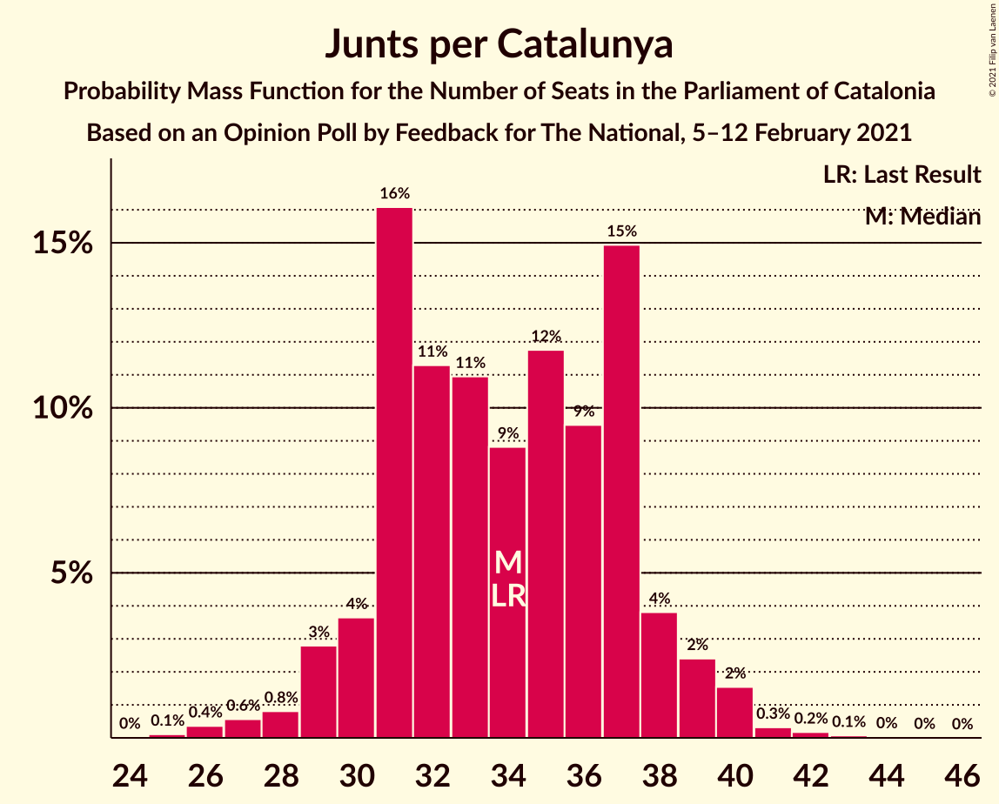
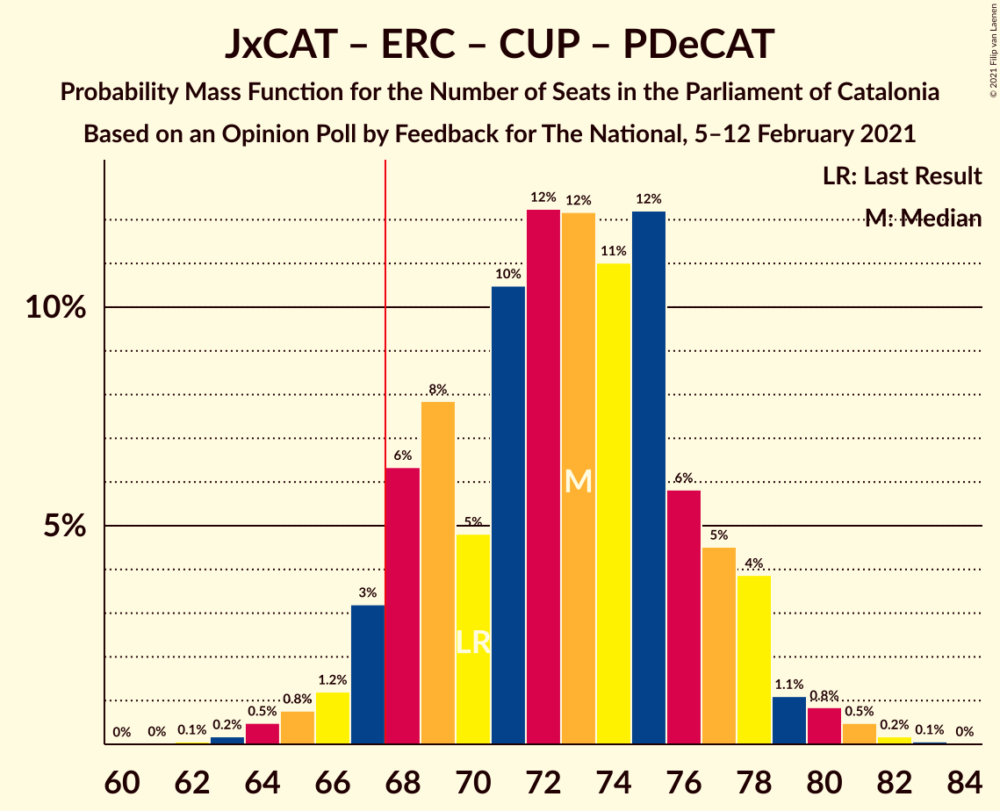

# Opinion Poll by Feedback for The National, 5–12 February 2021

<a href="#voting-intentions">Voting Intentions</a> | <a href="#seats">Seats</a> | <a href="#coalitions">Coalitions</a> | <a href="#technical-information">Technical Information</a>

## Voting Intentions

### Confidence Intervals

| Party | Last Result | Poll Result | 80% Confidence Interval | 90% Confidence Interval | 95% Confidence Interval | 99% Confidence Interval |
|:-----:|:-----------:|:-----------:|:-----------------------:|:-----------------------:|:-----------------------:|:-----------------------:|
| Junts per Catalunya | 21.7% | 20.5% | 18.5–22.8% |18.0–23.5% |17.5–24.0% |16.5–25.1% |
| Partit dels Socialistes de Catalunya (PSC-PSOE) | 13.9% | 19.7% | 17.7–21.9% |17.1–22.6% |16.7–23.1% |15.7–24.2% |
| Esquerra Republicana–Catalunya Sí | 21.4% | 18.8% | 16.9–21.0% |16.3–21.7% |15.9–22.2% |15.0–23.3% |
| Ciutadans–Partido de la Ciudadanía | 25.4% | 9.6% | 8.2–11.3% |7.8–11.8% |7.5–12.3% |6.8–13.1% |
| Catalunya en Comú–Podem | 7.5% | 7.9% | 6.6–9.5% |6.2–10.0% |6.0–10.4% |5.4–11.2% |
| Candidatura d’Unitat Popular | 4.5% | 6.3% | 5.2–7.8% |4.9–8.2% |4.6–8.6% |4.1–9.4% |
| Vox | 0.0% | 5.7% | 4.6–7.1% |4.3–7.5% |4.1–7.8% |3.6–8.6% |
| Partit Popular | 4.2% | 4.6% | 3.7–5.9% |3.4–6.3% |3.2–6.6% |2.8–7.3% |
| Partit Demòcrata Europeu Català | 0.0% | 2.6% | 1.9–3.6% |1.7–3.9% |1.6–4.2% |1.3–4.8% |

*Note:* The poll result column reflects the actual value used in the calculations. Published results may vary slightly, and in addition be rounded to fewer digits.

## Seats

### Confidence Intervals

| Party | Last Result | Median | 80% Confidence Interval | 90% Confidence Interval | 95% Confidence Interval | 99% Confidence Interval |
|:-----:|:-----------:|:------:|:-----------------------:|:-----------------------:|:-----------------------:|:-----------------------:|
| <a href="#junts-per-catalunya">Junts per Catalunya</a> | 34 | 34 | 31–37 |30–38 |29–39 |27–41 |
| <a href="#partit-dels-socialistes-de-catalunya-(psc-psoe)">Partit dels Socialistes de Catalunya (PSC-PSOE)</a> | 17 | 27 | 25–31 |24–32 |24–33 |22–34 |
| <a href="#esquerra-republicana–catalunya-sí">Esquerra Republicana–Catalunya Sí</a> | 32 | 28 | 25–32 |24–33 |24–35 |23–36 |
| <a href="#ciutadans–partido-de-la-ciudadanía">Ciutadans–Partido de la Ciudadanía</a> | 36 | 13 | 11–16 |11–16 |10–17 |8–18 |
| <a href="#catalunya-en-comú–podem">Catalunya en Comú–Podem</a> | 8 | 9 | 8–12 |7–12 |7–13 |5–14 |
| <a href="#candidatura-d’unitat-popular">Candidatura d’Unitat Popular</a> | 4 | 8 | 7–11 |7–11 |6–11 |4–13 |
| <a href="#vox">Vox</a> | 0 | 7 | 5–9 |5–10 |3–11 |3–12 |
| <a href="#partit-popular">Partit Popular</a> | 4 | 5 | 3–7 |3–8 |3–9 |0–10 |
| <a href="#partit-demòcrata-europeu-català">Partit Demòcrata Europeu Català</a> | 0 | 1 | 0–4 |0–5 |0–5 |0–6 |

### Junts per Catalunya

*For a full overview of the results for this party, see the [Junts per Catalunya](party-juntspercatalunya.html) page.*

| Number of Seats | Probability | Accumulated | Special Marks |
|:---------------:|:-----------:|:-----------:|:-------------:|
| 25 | 0.1% | 100% |  |
| 26 | 0.4% | 99.9% |  |
| 27 | 0.6% | 99.5% |  |
| 28 | 0.8% | 98.9% |  |
| 29 | 3% | 98% |  |
| 30 | 4% | 95% |  |
| 31 | 16% | 92% |  |
| 32 | 11% | 76% |  |
| 33 | 11% | 64% |  |
| 34 | 9% | 53% | Last Result, Median |
| 35 | 12% | 45% |  |
| 36 | 9% | 33% |  |
| 37 | 15% | 23% |  |
| 38 | 4% | 8% |  |
| 39 | 2% | 5% |  |
| 40 | 2% | 2% |  |
| 41 | 0.3% | 0.6% |  |
| 42 | 0.2% | 0.3% |  |
| 43 | 0.1% | 0.1% |  |
| 44 | 0% | 0.1% |  |
| 45 | 0% | 0% |  |

### Partit dels Socialistes de Catalunya (PSC-PSOE)

*For a full overview of the results for this party, see the [Partit dels Socialistes de Catalunya (PSC-PSOE)](party-partitdelssocialistesdecatalunyapsc-psoe.html) page.*

| Number of Seats | Probability | Accumulated | Special Marks |
|:---------------:|:-----------:|:-----------:|:-------------:|
| 17 | 0% | 100% | Last Result |
| 18 | 0% | 100% |  |
| 19 | 0% | 100% |  |
| 20 | 0.1% | 99.9% |  |
| 21 | 0.2% | 99.8% |  |
| 22 | 1.1% | 99.6% |  |
| 23 | 0.9% | 98.6% |  |
| 24 | 6% | 98% |  |
| 25 | 12% | 92% |  |
| 26 | 22% | 79% |  |
| 27 | 16% | 57% | Median |
| 28 | 9% | 41% |  |
| 29 | 7% | 31% |  |
| 30 | 8% | 25% |  |
| 31 | 11% | 17% |  |
| 32 | 3% | 6% |  |
| 33 | 0.8% | 3% |  |
| 34 | 2% | 2% |  |
| 35 | 0.2% | 0.3% |  |
| 36 | 0.1% | 0.1% |  |
| 37 | 0% | 0.1% |  |
| 38 | 0% | 0% |  |

### Esquerra Republicana–Catalunya Sí

*For a full overview of the results for this party, see the [Esquerra Republicana–Catalunya Sí](party-esquerrarepublicana–catalunyasí.html) page.*

| Number of Seats | Probability | Accumulated | Special Marks |
|:---------------:|:-----------:|:-----------:|:-------------:|
| 21 | 0.2% | 100% |  |
| 22 | 0.2% | 99.8% |  |
| 23 | 0.8% | 99.6% |  |
| 24 | 5% | 98.8% |  |
| 25 | 6% | 94% |  |
| 26 | 4% | 88% |  |
| 27 | 9% | 84% |  |
| 28 | 32% | 75% | Median |
| 29 | 5% | 43% |  |
| 30 | 5% | 37% |  |
| 31 | 14% | 33% |  |
| 32 | 12% | 18% | Last Result |
| 33 | 2% | 7% |  |
| 34 | 0.9% | 4% |  |
| 35 | 2% | 3% |  |
| 36 | 0.8% | 1.0% |  |
| 37 | 0.1% | 0.2% |  |
| 38 | 0.1% | 0.1% |  |
| 39 | 0% | 0.1% |  |
| 40 | 0% | 0% |  |

### Ciutadans–Partido de la Ciudadanía

*For a full overview of the results for this party, see the [Ciutadans–Partido de la Ciudadanía](party-ciutadans–partidodelaciudadanía.html) page.*

| Number of Seats | Probability | Accumulated | Special Marks |
|:---------------:|:-----------:|:-----------:|:-------------:|
| 8 | 1.0% | 100% |  |
| 9 | 0.9% | 99.0% |  |
| 10 | 3% | 98% |  |
| 11 | 9% | 95% |  |
| 12 | 20% | 87% |  |
| 13 | 41% | 67% | Median |
| 14 | 12% | 26% |  |
| 15 | 3% | 14% |  |
| 16 | 8% | 11% |  |
| 17 | 1.3% | 3% |  |
| 18 | 1.0% | 1.4% |  |
| 19 | 0.4% | 0.4% |  |
| 20 | 0% | 0% |  |
| 21 | 0% | 0% |  |
| 22 | 0% | 0% |  |
| 23 | 0% | 0% |  |
| 24 | 0% | 0% |  |
| 25 | 0% | 0% |  |
| 26 | 0% | 0% |  |
| 27 | 0% | 0% |  |
| 28 | 0% | 0% |  |
| 29 | 0% | 0% |  |
| 30 | 0% | 0% |  |
| 31 | 0% | 0% |  |
| 32 | 0% | 0% |  |
| 33 | 0% | 0% |  |
| 34 | 0% | 0% |  |
| 35 | 0% | 0% |  |
| 36 | 0% | 0% | Last Result |

### Catalunya en Comú–Podem

*For a full overview of the results for this party, see the [Catalunya en Comú–Podem](party-catalunyaencomú–podem.html) page.*

| Number of Seats | Probability | Accumulated | Special Marks |
|:---------------:|:-----------:|:-----------:|:-------------:|
| 5 | 0.8% | 100% |  |
| 6 | 1.4% | 99.2% |  |
| 7 | 5% | 98% |  |
| 8 | 26% | 93% | Last Result |
| 9 | 30% | 66% | Median |
| 10 | 9% | 36% |  |
| 11 | 15% | 27% |  |
| 12 | 6% | 11% |  |
| 13 | 3% | 5% |  |
| 14 | 2% | 2% |  |
| 15 | 0.2% | 0.3% |  |
| 16 | 0.1% | 0.2% |  |
| 17 | 0% | 0% |  |

### Candidatura d’Unitat Popular

*For a full overview of the results for this party, see the [Candidatura d’Unitat Popular](party-candidaturad’unitatpopular.html) page.*

| Number of Seats | Probability | Accumulated | Special Marks |
|:---------------:|:-----------:|:-----------:|:-------------:|
| 3 | 0.1% | 100% |  |
| 4 | 1.0% | 99.9% | Last Result |
| 5 | 1.0% | 98.9% |  |
| 6 | 1.4% | 98% |  |
| 7 | 13% | 96% |  |
| 8 | 34% | 83% | Median |
| 9 | 29% | 49% |  |
| 10 | 8% | 20% |  |
| 11 | 10% | 13% |  |
| 12 | 1.3% | 2% |  |
| 13 | 0.9% | 1.2% |  |
| 14 | 0.2% | 0.3% |  |
| 15 | 0.1% | 0.1% |  |
| 16 | 0% | 0% |  |

### Vox

*For a full overview of the results for this party, see the [Vox](party-vox.html) page.*

| Number of Seats | Probability | Accumulated | Special Marks |
|:---------------:|:-----------:|:-----------:|:-------------:|
| 0 | 0% | 100% | Last Result |
| 1 | 0% | 100% |  |
| 2 | 0% | 100% |  |
| 3 | 3% | 100% |  |
| 4 | 1.4% | 97% |  |
| 5 | 10% | 96% |  |
| 6 | 13% | 86% |  |
| 7 | 44% | 73% | Median |
| 8 | 13% | 29% |  |
| 9 | 8% | 16% |  |
| 10 | 5% | 8% |  |
| 11 | 2% | 3% |  |
| 12 | 0.7% | 0.8% |  |
| 13 | 0.1% | 0.1% |  |
| 14 | 0% | 0% |  |

### Partit Popular

*For a full overview of the results for this party, see the [Partit Popular](party-partitpopular.html) page.*

| Number of Seats | Probability | Accumulated | Special Marks |
|:---------------:|:-----------:|:-----------:|:-------------:|
| 0 | 0.6% | 100% |  |
| 1 | 0% | 99.4% |  |
| 2 | 2% | 99.4% |  |
| 3 | 16% | 98% |  |
| 4 | 7% | 82% | Last Result |
| 5 | 28% | 75% | Median |
| 6 | 13% | 46% |  |
| 7 | 26% | 34% |  |
| 8 | 5% | 7% |  |
| 9 | 2% | 3% |  |
| 10 | 0.5% | 0.6% |  |
| 11 | 0.2% | 0.2% |  |
| 12 | 0% | 0% |  |

### Partit Demòcrata Europeu Català

*For a full overview of the results for this party, see the [Partit Demòcrata Europeu Català](party-partitdemòcrataeuropeucatalà.html) page.*

| Number of Seats | Probability | Accumulated | Special Marks |
|:---------------:|:-----------:|:-----------:|:-------------:|
| 0 | 42% | 100% | Last Result |
| 1 | 41% | 58% | Median |
| 2 | 0.2% | 17% |  |
| 3 | 3% | 16% |  |
| 4 | 5% | 13% |  |
| 5 | 6% | 8% |  |
| 6 | 2% | 2% |  |
| 7 | 0.3% | 0.4% |  |
| 8 | 0.1% | 0.1% |  |
| 9 | 0% | 0% |  |

## Coalitions

### Confidence Intervals

| Coalition | Last Result | Median | Majority? | 80% Confidence Interval | 90% Confidence Interval | 95% Confidence Interval | 99% Confidence Interval |
|:---------:|:-----------:|:------:|:---------:|:-----------------------:|:-----------------------:|:-----------------------:|:-----------------------:|
| Junts per Catalunya – Esquerra Republicana–Catalunya Sí – Candidatura d’Unitat Popular – Partit Demòcrata Europeu Català | 70 | 73 | 94% | 68–77 | 67–78 | 66–79 | 64–81 |
| Junts per Catalunya – Esquerra Republicana–Catalunya Sí – Catalunya en Comú–Podem | 74 | 72 | 90% | 68–76 | 66–77 | 66–79 | 64–80 |
| Junts per Catalunya – Esquerra Republicana–Catalunya Sí – Candidatura d’Unitat Popular | 70 | 71 | 87% | 67–75 | 66–76 | 65–77 | 63–80 |
| Partit dels Socialistes de Catalunya (PSC-PSOE) – Esquerra Republicana–Catalunya Sí – Catalunya en Comú–Podem | 57 | 65 | 32% | 61–70 | 60–72 | 59–72 | 57–74 |
| Junts per Catalunya – Esquerra Republicana–Catalunya Sí – Partit Demòcrata Europeu Català | 66 | 64 | 13% | 60–68 | 59–69 | 58–70 | 56–73 |
| Junts per Catalunya – Esquerra Republicana–Catalunya Sí | 66 | 63 | 6% | 59–67 | 57–68 | 57–69 | 54–71 |
| Partit dels Socialistes de Catalunya (PSC-PSOE) – Ciutadans–Partido de la Ciudadanía – Catalunya en Comú–Podem – Partit Popular | 65 | 55 | 0% | 51–60 | 50–61 | 49–62 | 47–63 |
| Partit dels Socialistes de Catalunya (PSC-PSOE) – Ciutadans–Partido de la Ciudadanía – Vox – Partit Popular | 57 | 53 | 0% | 49–57 | 48–58 | 47–59 | 45–61 |
| Partit dels Socialistes de Catalunya (PSC-PSOE) – Ciutadans–Partido de la Ciudadanía – Partit Popular | 57 | 46 | 0% | 42–50 | 41–51 | 40–52 | 38–54 |
| Esquerra Republicana–Catalunya Sí – Catalunya en Comú–Podem | 40 | 38 | 0% | 35–43 | 33–43 | 32–44 | 31–46 |

### Junts per Catalunya – Esquerra Republicana–Catalunya Sí – Candidatura d’Unitat Popular – Partit Demòcrata Europeu Català

| Number of Seats | Probability | Accumulated | Special Marks |
|:---------------:|:-----------:|:-----------:|:-------------:|
| 62 | 0.1% | 100% |  |
| 63 | 0.2% | 99.9% |  |
| 64 | 0.5% | 99.7% |  |
| 65 | 0.8% | 99.2% |  |
| 66 | 1.2% | 98% |  |
| 67 | 3% | 97% |  |
| 68 | 6% | 94% | Majority |
| 69 | 8% | 88% |  |
| 70 | 5% | 80% | Last Result |
| 71 | 10% | 75% | Median |
| 72 | 12% | 65% |  |
| 73 | 12% | 52% |  |
| 74 | 11% | 40% |  |
| 75 | 12% | 29% |  |
| 76 | 6% | 17% |  |
| 77 | 5% | 11% |  |
| 78 | 4% | 7% |  |
| 79 | 1.1% | 3% |  |
| 80 | 0.8% | 2% |  |
| 81 | 0.5% | 0.8% |  |
| 82 | 0.2% | 0.3% |  |
| 83 | 0.1% | 0.1% |  |
| 84 | 0% | 0% |  |

### Junts per Catalunya – Esquerra Republicana–Catalunya Sí – Catalunya en Comú–Podem

| Number of Seats | Probability | Accumulated | Special Marks |
|:---------------:|:-----------:|:-----------:|:-------------:|
| 61 | 0% | 100% |  |
| 62 | 0.1% | 99.9% |  |
| 63 | 0.3% | 99.9% |  |
| 64 | 0.4% | 99.6% |  |
| 65 | 1.4% | 99.2% |  |
| 66 | 3% | 98% |  |
| 67 | 4% | 95% |  |
| 68 | 4% | 90% | Majority |
| 69 | 6% | 86% |  |
| 70 | 6% | 80% |  |
| 71 | 12% | 73% | Median |
| 72 | 12% | 61% |  |
| 73 | 14% | 49% |  |
| 74 | 12% | 35% | Last Result |
| 75 | 9% | 23% |  |
| 76 | 6% | 14% |  |
| 77 | 3% | 8% |  |
| 78 | 2% | 5% |  |
| 79 | 1.3% | 3% |  |
| 80 | 1.0% | 1.3% |  |
| 81 | 0.2% | 0.4% |  |
| 82 | 0.1% | 0.2% |  |
| 83 | 0% | 0% |  |

### Junts per Catalunya – Esquerra Republicana–Catalunya Sí – Candidatura d’Unitat Popular

| Number of Seats | Probability | Accumulated | Special Marks |
|:---------------:|:-----------:|:-----------:|:-------------:|
| 60 | 0% | 100% |  |
| 61 | 0.1% | 99.9% |  |
| 62 | 0.2% | 99.8% |  |
| 63 | 0.5% | 99.6% |  |
| 64 | 1.1% | 99.2% |  |
| 65 | 1.1% | 98% |  |
| 66 | 4% | 97% |  |
| 67 | 6% | 93% |  |
| 68 | 9% | 87% | Majority |
| 69 | 6% | 78% |  |
| 70 | 8% | 72% | Last Result, Median |
| 71 | 15% | 65% |  |
| 72 | 10% | 50% |  |
| 73 | 9% | 40% |  |
| 74 | 15% | 31% |  |
| 75 | 6% | 15% |  |
| 76 | 5% | 9% |  |
| 77 | 2% | 5% |  |
| 78 | 1.2% | 2% |  |
| 79 | 0.5% | 1.3% |  |
| 80 | 0.6% | 0.8% |  |
| 81 | 0.1% | 0.2% |  |
| 82 | 0.1% | 0.1% |  |
| 83 | 0% | 0% |  |

### Partit dels Socialistes de Catalunya (PSC-PSOE) – Esquerra Republicana–Catalunya Sí – Catalunya en Comú–Podem

| Number of Seats | Probability | Accumulated | Special Marks |
|:---------------:|:-----------:|:-----------:|:-------------:|
| 56 | 0.1% | 100% |  |
| 57 | 0.3% | 99.8% | Last Result |
| 58 | 0.6% | 99.5% |  |
| 59 | 2% | 98.8% |  |
| 60 | 3% | 97% |  |
| 61 | 5% | 95% |  |
| 62 | 4% | 90% |  |
| 63 | 13% | 86% |  |
| 64 | 12% | 73% | Median |
| 65 | 13% | 61% |  |
| 66 | 6% | 48% |  |
| 67 | 9% | 41% |  |
| 68 | 11% | 32% | Majority |
| 69 | 7% | 21% |  |
| 70 | 5% | 14% |  |
| 71 | 3% | 9% |  |
| 72 | 3% | 6% |  |
| 73 | 0.8% | 2% |  |
| 74 | 1.2% | 2% |  |
| 75 | 0.2% | 0.3% |  |
| 76 | 0.1% | 0.1% |  |
| 77 | 0% | 0.1% |  |
| 78 | 0% | 0% |  |

### Junts per Catalunya – Esquerra Republicana–Catalunya Sí – Partit Demòcrata Europeu Català

| Number of Seats | Probability | Accumulated | Special Marks |
|:---------------:|:-----------:|:-----------:|:-------------:|
| 53 | 0% | 100% |  |
| 54 | 0.1% | 99.9% |  |
| 55 | 0.2% | 99.8% |  |
| 56 | 0.7% | 99.6% |  |
| 57 | 1.0% | 98.9% |  |
| 58 | 3% | 98% |  |
| 59 | 5% | 95% |  |
| 60 | 7% | 90% |  |
| 61 | 6% | 84% |  |
| 62 | 8% | 77% |  |
| 63 | 9% | 69% | Median |
| 64 | 18% | 60% |  |
| 65 | 10% | 42% |  |
| 66 | 13% | 32% | Last Result |
| 67 | 7% | 20% |  |
| 68 | 4% | 13% | Majority |
| 69 | 5% | 8% |  |
| 70 | 2% | 4% |  |
| 71 | 1.3% | 2% |  |
| 72 | 0.4% | 0.9% |  |
| 73 | 0.4% | 0.5% |  |
| 74 | 0.1% | 0.1% |  |
| 75 | 0% | 0.1% |  |
| 76 | 0% | 0% |  |

### Junts per Catalunya – Esquerra Republicana–Catalunya Sí

| Number of Seats | Probability | Accumulated | Special Marks |
|:---------------:|:-----------:|:-----------:|:-------------:|
| 52 | 0.1% | 100% |  |
| 53 | 0.1% | 99.9% |  |
| 54 | 0.4% | 99.8% |  |
| 55 | 0.5% | 99.4% |  |
| 56 | 1.1% | 98.9% |  |
| 57 | 3% | 98% |  |
| 58 | 4% | 95% |  |
| 59 | 9% | 91% |  |
| 60 | 7% | 82% |  |
| 61 | 6% | 75% |  |
| 62 | 9% | 68% | Median |
| 63 | 17% | 60% |  |
| 64 | 12% | 43% |  |
| 65 | 14% | 31% |  |
| 66 | 6% | 17% | Last Result |
| 67 | 6% | 11% |  |
| 68 | 2% | 6% | Majority |
| 69 | 2% | 3% |  |
| 70 | 0.9% | 2% |  |
| 71 | 0.4% | 0.7% |  |
| 72 | 0.2% | 0.3% |  |
| 73 | 0.1% | 0.1% |  |
| 74 | 0% | 0% |  |

### Partit dels Socialistes de Catalunya (PSC-PSOE) – Ciutadans–Partido de la Ciudadanía – Catalunya en Comú–Podem – Partit Popular

| Number of Seats | Probability | Accumulated | Special Marks |
|:---------------:|:-----------:|:-----------:|:-------------:|
| 45 | 0.1% | 100% |  |
| 46 | 0.2% | 99.9% |  |
| 47 | 0.5% | 99.8% |  |
| 48 | 1.1% | 99.3% |  |
| 49 | 1.4% | 98% |  |
| 50 | 4% | 97% |  |
| 51 | 4% | 93% |  |
| 52 | 8% | 89% |  |
| 53 | 13% | 81% |  |
| 54 | 9% | 68% | Median |
| 55 | 12% | 60% |  |
| 56 | 11% | 47% |  |
| 57 | 12% | 36% |  |
| 58 | 4% | 24% |  |
| 59 | 8% | 19% |  |
| 60 | 5% | 11% |  |
| 61 | 3% | 6% |  |
| 62 | 1.4% | 3% |  |
| 63 | 0.7% | 1.2% |  |
| 64 | 0.2% | 0.4% |  |
| 65 | 0.1% | 0.2% | Last Result |
| 66 | 0.1% | 0.1% |  |
| 67 | 0% | 0% |  |

### Partit dels Socialistes de Catalunya (PSC-PSOE) – Ciutadans–Partido de la Ciudadanía – Vox – Partit Popular

| Number of Seats | Probability | Accumulated | Special Marks |
|:---------------:|:-----------:|:-----------:|:-------------:|
| 43 | 0.1% | 100% |  |
| 44 | 0.1% | 99.9% |  |
| 45 | 0.3% | 99.7% |  |
| 46 | 1.2% | 99.4% |  |
| 47 | 2% | 98% |  |
| 48 | 3% | 96% |  |
| 49 | 7% | 94% |  |
| 50 | 8% | 87% |  |
| 51 | 15% | 79% |  |
| 52 | 11% | 65% | Median |
| 53 | 10% | 54% |  |
| 54 | 10% | 43% |  |
| 55 | 11% | 33% |  |
| 56 | 8% | 23% |  |
| 57 | 4% | 14% | Last Result |
| 58 | 6% | 10% |  |
| 59 | 2% | 4% |  |
| 60 | 1.4% | 2% |  |
| 61 | 0.4% | 0.9% |  |
| 62 | 0.3% | 0.5% |  |
| 63 | 0.1% | 0.2% |  |
| 64 | 0% | 0.1% |  |
| 65 | 0% | 0% |  |

### Partit dels Socialistes de Catalunya (PSC-PSOE) – Ciutadans–Partido de la Ciudadanía – Partit Popular

| Number of Seats | Probability | Accumulated | Special Marks |
|:---------------:|:-----------:|:-----------:|:-------------:|
| 36 | 0.1% | 100% |  |
| 37 | 0.2% | 99.9% |  |
| 38 | 0.4% | 99.8% |  |
| 39 | 1.2% | 99.4% |  |
| 40 | 1.1% | 98% |  |
| 41 | 3% | 97% |  |
| 42 | 9% | 94% |  |
| 43 | 6% | 86% |  |
| 44 | 14% | 80% |  |
| 45 | 12% | 66% | Median |
| 46 | 15% | 54% |  |
| 47 | 9% | 39% |  |
| 48 | 8% | 30% |  |
| 49 | 9% | 22% |  |
| 50 | 4% | 13% |  |
| 51 | 5% | 10% |  |
| 52 | 3% | 4% |  |
| 53 | 0.3% | 1.4% |  |
| 54 | 0.7% | 1.1% |  |
| 55 | 0.2% | 0.3% |  |
| 56 | 0% | 0.1% |  |
| 57 | 0% | 0.1% | Last Result |
| 58 | 0% | 0% |  |

### Esquerra Republicana–Catalunya Sí – Catalunya en Comú–Podem

| Number of Seats | Probability | Accumulated | Special Marks |
|:---------------:|:-----------:|:-----------:|:-------------:|
| 29 | 0.1% | 100% |  |
| 30 | 0.2% | 99.9% |  |
| 31 | 0.9% | 99.7% |  |
| 32 | 2% | 98.9% |  |
| 33 | 3% | 97% |  |
| 34 | 2% | 94% |  |
| 35 | 8% | 92% |  |
| 36 | 11% | 84% |  |
| 37 | 22% | 73% | Median |
| 38 | 8% | 51% |  |
| 39 | 10% | 43% |  |
| 40 | 11% | 34% | Last Result |
| 41 | 7% | 23% |  |
| 42 | 5% | 15% |  |
| 43 | 7% | 11% |  |
| 44 | 2% | 4% |  |
| 45 | 1.0% | 2% |  |
| 46 | 0.3% | 0.7% |  |
| 47 | 0.2% | 0.4% |  |
| 48 | 0.1% | 0.2% |  |
| 49 | 0.1% | 0.1% |  |
| 50 | 0% | 0% |  |

## Technical Information

### Opinion Poll

+ **Polling firm:** Feedback
+ **Commissioner(s):** The National
+ **Fieldwork period:** 5–12 February 2021

### Calculations

+ **Sample size:** 584
+ **Simulations done:** 1,048,576
+ **Error estimate:** 1.71%

