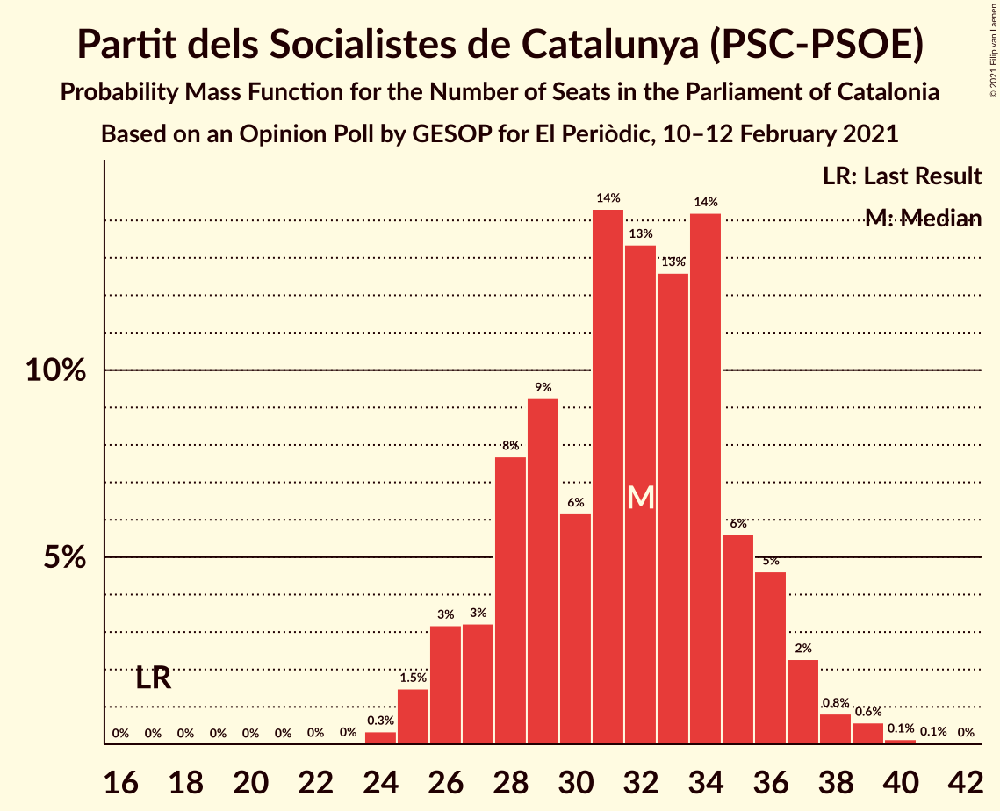
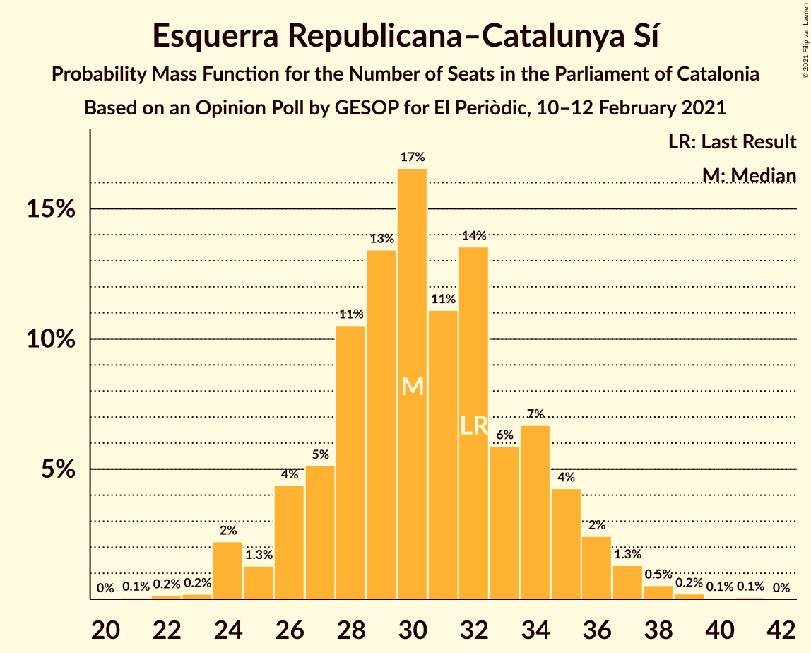
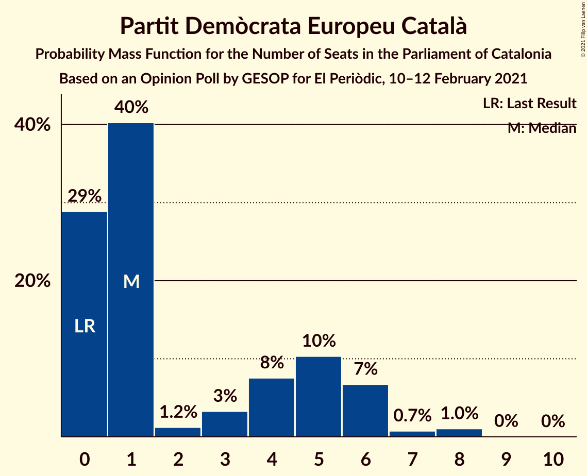
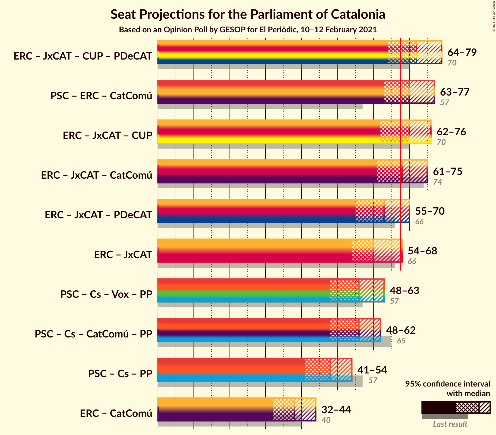
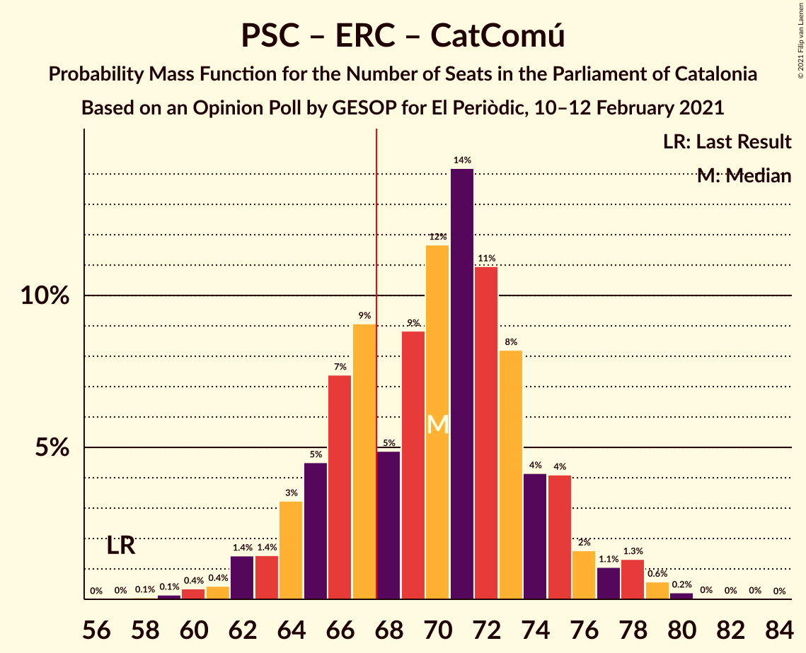
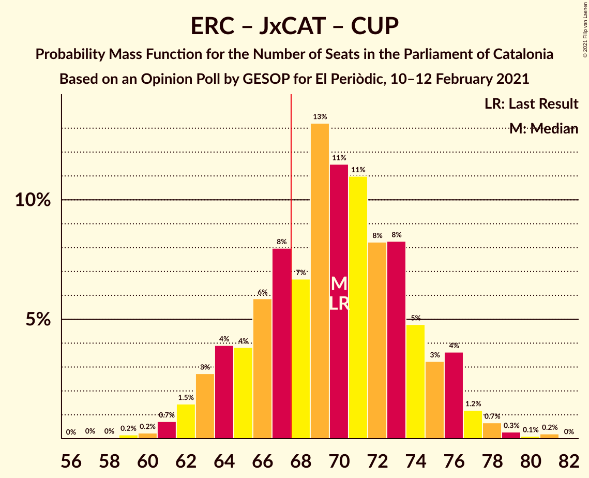
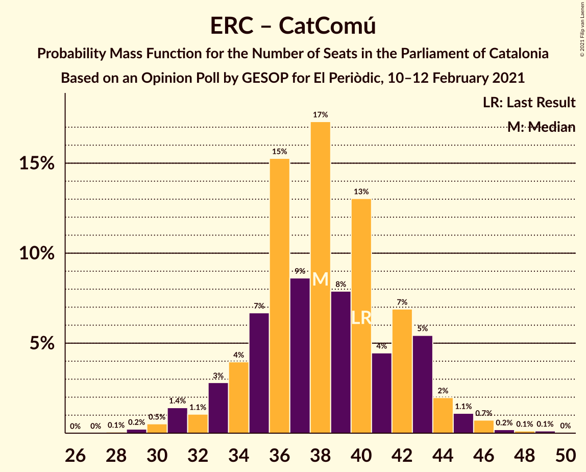

# Opinion Poll by GESOP for El Periòdic, 10–12 February 2021

<a href="#voting-intentions">Voting Intentions</a> | <a href="#seats">Seats</a> | <a href="#coalitions">Coalitions</a> | <a href="#technical-information">Technical Information</a>

## Voting Intentions

### Confidence Intervals

| Party | Last Result | Poll Result | 80% Confidence Interval | 90% Confidence Interval | 95% Confidence Interval | 99% Confidence Interval |
|:-----:|:-----------:|:-----------:|:-----------------------:|:-----------------------:|:-----------------------:|:-----------------------:|
| Partit dels Socialistes de Catalunya (PSC-PSOE) | 13.9% | 22.8% | 20.5–25.4% |19.9–26.1% |19.3–26.7% |18.3–28.0% |
| Esquerra Republicana–Catalunya Sí | 21.4% | 20.2% | 18.0–22.7% |17.4–23.4% |16.9–24.0% |15.9–25.2% |
| Junts per Catalunya | 21.7% | 18.8% | 16.7–21.2% |16.1–21.9% |15.6–22.5% |14.6–23.7% |
| Ciutadans–Partido de la Ciudadanía | 25.4% | 7.5% | 6.2–9.2% |5.8–9.7% |5.5–10.1% |4.9–11.0% |
| Catalunya en Comú–Podem | 7.5% | 6.9% | 5.6–8.6% |5.3–9.0% |5.0–9.4% |4.4–10.3% |
| Candidatura d’Unitat Popular | 4.5% | 6.9% | 5.6–8.6% |5.3–9.0% |5.0–9.4% |4.4–10.3% |
| Vox | 0.0% | 6.3% | 5.1–7.9% |4.7–8.4% |4.5–8.8% |3.9–9.6% |
| Partit Popular | 4.2% | 5.5% | 4.3–7.0% |4.0–7.4% |3.8–7.8% |3.3–8.6% |
| Partit Demòcrata Europeu Català | 0.0% | 3.0% | 2.2–4.3% |2.0–4.6% |1.8–5.0% |1.5–5.6% |

*Note:* The poll result column reflects the actual value used in the calculations. Published results may vary slightly, and in addition be rounded to fewer digits.

## Seats

### Confidence Intervals

| Party | Last Result | Median | 80% Confidence Interval | 90% Confidence Interval | 95% Confidence Interval | 99% Confidence Interval |
|:-----:|:-----------:|:------:|:-----------------------:|:-----------------------:|:-----------------------:|:-----------------------:|
| <a href="#partit-dels-socialistes-de-catalunya-(psc-psoe)">Partit dels Socialistes de Catalunya (PSC-PSOE)</a> | 17 | 32 | 28–35 |26–36 |26–37 |25–39 |
| <a href="#esquerra-republicana–catalunya-sí">Esquerra Republicana–Catalunya Sí</a> | 32 | 30 | 27–34 |26–35 |24–36 |24–38 |
| <a href="#junts-per-catalunya">Junts per Catalunya</a> | 34 | 30 | 26–34 |25–35 |24–36 |23–38 |
| <a href="#ciutadans–partido-de-la-ciudadanía">Ciutadans–Partido de la Ciudadanía</a> | 36 | 9 | 7–12 |6–13 |6–13 |5–14 |
| <a href="#catalunya-en-comú–podem">Catalunya en Comú–Podem</a> | 8 | 8 | 5–10 |5–11 |5–11 |4–13 |
| <a href="#candidatura-d’unitat-popular">Candidatura d’Unitat Popular</a> | 4 | 9 | 8–11 |7–11 |7–13 |4–15 |
| <a href="#vox">Vox</a> | 0 | 8 | 6–10 |5–11 |5–12 |3–13 |
| <a href="#partit-popular">Partit Popular</a> | 4 | 7 | 5–9 |4–9 |3–10 |3–12 |
| <a href="#partit-demòcrata-europeu-català">Partit Demòcrata Europeu Català</a> | 0 | 1 | 0–5 |0–6 |0–6 |0–8 |

### Partit dels Socialistes de Catalunya (PSC-PSOE)

*For a full overview of the results for this party, see the [Partit dels Socialistes de Catalunya (PSC-PSOE)](party-partitdelssocialistesdecatalunyapsc-psoe.html) page.*

| Number of Seats | Probability | Accumulated | Special Marks |
|:---------------:|:-----------:|:-----------:|:-------------:|
| 17 | 0% | 100% | Last Result |
| 18 | 0% | 100% |  |
| 19 | 0% | 100% |  |
| 20 | 0% | 100% |  |
| 21 | 0% | 100% |  |
| 22 | 0% | 100% |  |
| 23 | 0% | 100% |  |
| 24 | 0.3% | 99.9% |  |
| 25 | 1.5% | 99.6% |  |
| 26 | 3% | 98% |  |
| 27 | 3% | 95% |  |
| 28 | 8% | 92% |  |
| 29 | 9% | 84% |  |
| 30 | 6% | 75% |  |
| 31 | 14% | 69% |  |
| 32 | 13% | 54% | Median |
| 33 | 13% | 41% |  |
| 34 | 14% | 28% |  |
| 35 | 6% | 14% |  |
| 36 | 5% | 9% |  |
| 37 | 2% | 4% |  |
| 38 | 0.8% | 2% |  |
| 39 | 0.6% | 0.8% |  |
| 40 | 0.1% | 0.2% |  |
| 41 | 0.1% | 0.1% |  |
| 42 | 0% | 0% |  |

### Esquerra Republicana–Catalunya Sí

*For a full overview of the results for this party, see the [Esquerra Republicana–Catalunya Sí](party-esquerrarepublicana–catalunyasí.html) page.*

| Number of Seats | Probability | Accumulated | Special Marks |
|:---------------:|:-----------:|:-----------:|:-------------:|
| 21 | 0.1% | 100% |  |
| 22 | 0.2% | 99.9% |  |
| 23 | 0.2% | 99.8% |  |
| 24 | 2% | 99.6% |  |
| 25 | 1.3% | 97% |  |
| 26 | 4% | 96% |  |
| 27 | 5% | 92% |  |
| 28 | 11% | 87% |  |
| 29 | 13% | 76% |  |
| 30 | 17% | 63% | Median |
| 31 | 11% | 46% |  |
| 32 | 14% | 35% | Last Result |
| 33 | 6% | 21% |  |
| 34 | 7% | 16% |  |
| 35 | 4% | 9% |  |
| 36 | 2% | 5% |  |
| 37 | 1.3% | 2% |  |
| 38 | 0.5% | 0.9% |  |
| 39 | 0.2% | 0.4% |  |
| 40 | 0.1% | 0.1% |  |
| 41 | 0.1% | 0.1% |  |
| 42 | 0% | 0% |  |

### Junts per Catalunya

*For a full overview of the results for this party, see the [Junts per Catalunya](party-juntspercatalunya.html) page.*

| Number of Seats | Probability | Accumulated | Special Marks |
|:---------------:|:-----------:|:-----------:|:-------------:|
| 21 | 0.1% | 100% |  |
| 22 | 0.1% | 99.9% |  |
| 23 | 1.0% | 99.8% |  |
| 24 | 2% | 98.8% |  |
| 25 | 5% | 97% |  |
| 26 | 6% | 92% |  |
| 27 | 6% | 87% |  |
| 28 | 5% | 80% |  |
| 29 | 14% | 76% |  |
| 30 | 15% | 61% | Median |
| 31 | 20% | 47% |  |
| 32 | 6% | 26% |  |
| 33 | 9% | 20% |  |
| 34 | 2% | 11% | Last Result |
| 35 | 5% | 9% |  |
| 36 | 0.9% | 3% |  |
| 37 | 2% | 2% |  |
| 38 | 0.3% | 0.6% |  |
| 39 | 0.1% | 0.2% |  |
| 40 | 0.1% | 0.1% |  |
| 41 | 0% | 0.1% |  |
| 42 | 0% | 0% |  |

### Ciutadans–Partido de la Ciudadanía

*For a full overview of the results for this party, see the [Ciutadans–Partido de la Ciudadanía](party-ciutadans–partidodelaciudadanía.html) page.*

| Number of Seats | Probability | Accumulated | Special Marks |
|:---------------:|:-----------:|:-----------:|:-------------:|
| 5 | 1.0% | 100% |  |
| 6 | 8% | 99.0% |  |
| 7 | 6% | 91% |  |
| 8 | 29% | 85% |  |
| 9 | 16% | 56% | Median |
| 10 | 6% | 40% |  |
| 11 | 7% | 34% |  |
| 12 | 20% | 27% |  |
| 13 | 6% | 7% |  |
| 14 | 0.8% | 1.0% |  |
| 15 | 0.1% | 0.2% |  |
| 16 | 0.1% | 0.1% |  |
| 17 | 0% | 0.1% |  |
| 18 | 0% | 0% |  |
| 19 | 0% | 0% |  |
| 20 | 0% | 0% |  |
| 21 | 0% | 0% |  |
| 22 | 0% | 0% |  |
| 23 | 0% | 0% |  |
| 24 | 0% | 0% |  |
| 25 | 0% | 0% |  |
| 26 | 0% | 0% |  |
| 27 | 0% | 0% |  |
| 28 | 0% | 0% |  |
| 29 | 0% | 0% |  |
| 30 | 0% | 0% |  |
| 31 | 0% | 0% |  |
| 32 | 0% | 0% |  |
| 33 | 0% | 0% |  |
| 34 | 0% | 0% |  |
| 35 | 0% | 0% |  |
| 36 | 0% | 0% | Last Result |

### Catalunya en Comú–Podem

*For a full overview of the results for this party, see the [Catalunya en Comú–Podem](party-catalunyaencomú–podem.html) page.*

| Number of Seats | Probability | Accumulated | Special Marks |
|:---------------:|:-----------:|:-----------:|:-------------:|
| 3 | 0.1% | 100% |  |
| 4 | 2% | 99.9% |  |
| 5 | 9% | 98% |  |
| 6 | 4% | 89% |  |
| 7 | 27% | 85% |  |
| 8 | 35% | 58% | Last Result, Median |
| 9 | 10% | 23% |  |
| 10 | 6% | 13% |  |
| 11 | 5% | 7% |  |
| 12 | 0.8% | 2% |  |
| 13 | 0.8% | 1.0% |  |
| 14 | 0.2% | 0.2% |  |
| 15 | 0% | 0% |  |

### Candidatura d’Unitat Popular

*For a full overview of the results for this party, see the [Candidatura d’Unitat Popular](party-candidaturad’unitatpopular.html) page.*

| Number of Seats | Probability | Accumulated | Special Marks |
|:---------------:|:-----------:|:-----------:|:-------------:|
| 4 | 0.5% | 100% | Last Result |
| 5 | 0.3% | 99.4% |  |
| 6 | 0.8% | 99.1% |  |
| 7 | 7% | 98% |  |
| 8 | 31% | 91% |  |
| 9 | 30% | 60% | Median |
| 10 | 8% | 30% |  |
| 11 | 18% | 23% |  |
| 12 | 1.4% | 5% |  |
| 13 | 2% | 4% |  |
| 14 | 1.3% | 2% |  |
| 15 | 0.7% | 0.8% |  |
| 16 | 0.1% | 0.1% |  |
| 17 | 0% | 0% |  |

### Vox

*For a full overview of the results for this party, see the [Vox](party-vox.html) page.*

| Number of Seats | Probability | Accumulated | Special Marks |
|:---------------:|:-----------:|:-----------:|:-------------:|
| 0 | 0% | 100% | Last Result |
| 1 | 0% | 100% |  |
| 2 | 0% | 100% |  |
| 3 | 0.5% | 100% |  |
| 4 | 0.5% | 99.5% |  |
| 5 | 5% | 99.0% |  |
| 6 | 9% | 94% |  |
| 7 | 33% | 85% |  |
| 8 | 11% | 52% | Median |
| 9 | 28% | 41% |  |
| 10 | 7% | 14% |  |
| 11 | 3% | 7% |  |
| 12 | 3% | 3% |  |
| 13 | 0.4% | 0.7% |  |
| 14 | 0.3% | 0.3% |  |
| 15 | 0.1% | 0.1% |  |
| 16 | 0% | 0% |  |

### Partit Popular

*For a full overview of the results for this party, see the [Partit Popular](party-partitpopular.html) page.*

| Number of Seats | Probability | Accumulated | Special Marks |
|:---------------:|:-----------:|:-----------:|:-------------:|
| 0 | 0.1% | 100% |  |
| 1 | 0% | 99.9% |  |
| 2 | 0.2% | 99.9% |  |
| 3 | 4% | 99.7% |  |
| 4 | 4% | 96% | Last Result |
| 5 | 19% | 92% |  |
| 6 | 11% | 73% |  |
| 7 | 40% | 62% | Median |
| 8 | 10% | 23% |  |
| 9 | 8% | 13% |  |
| 10 | 3% | 5% |  |
| 11 | 1.2% | 2% |  |
| 12 | 0.6% | 0.7% |  |
| 13 | 0% | 0.1% |  |
| 14 | 0% | 0% |  |

### Partit Demòcrata Europeu Català

*For a full overview of the results for this party, see the [Partit Demòcrata Europeu Català](party-partitdemòcrataeuropeucatalà.html) page.*

| Number of Seats | Probability | Accumulated | Special Marks |
|:---------------:|:-----------:|:-----------:|:-------------:|
| 0 | 29% | 100% | Last Result |
| 1 | 40% | 71% | Median |
| 2 | 1.2% | 31% |  |
| 3 | 3% | 30% |  |
| 4 | 8% | 26% |  |
| 5 | 10% | 19% |  |
| 6 | 7% | 9% |  |
| 7 | 0.7% | 2% |  |
| 8 | 1.0% | 1.1% |  |
| 9 | 0% | 0.1% |  |
| 10 | 0% | 0% |  |

## Coalitions

### Confidence Intervals

| Coalition | Last Result | Median | Majority? | 80% Confidence Interval | 90% Confidence Interval | 95% Confidence Interval | 99% Confidence Interval |
|:---------:|:-----------:|:------:|:---------:|:-----------------------:|:-----------------------:|:-----------------------:|:-----------------------:|
| Esquerra Republicana–Catalunya Sí – Junts per Catalunya – Candidatura d’Unitat Popular – Partit Demòcrata Europeu Català | 70 | 72 | 88% | 67–76 | 66–77 | 64–79 | 63–81 |
| Partit dels Socialistes de Catalunya (PSC-PSOE) – Esquerra Republicana–Catalunya Sí – Catalunya en Comú–Podem | 57 | 70 | 72% | 65–74 | 64–75 | 63–77 | 60–79 |
| Esquerra Republicana–Catalunya Sí – Junts per Catalunya – Candidatura d’Unitat Popular | 70 | 70 | 73% | 65–74 | 63–76 | 62–76 | 60–79 |
| Esquerra Republicana–Catalunya Sí – Junts per Catalunya – Catalunya en Comú–Podem | 74 | 68 | 59% | 64–73 | 62–74 | 61–75 | 59–78 |
| Esquerra Republicana–Catalunya Sí – Junts per Catalunya – Partit Demòcrata Europeu Català | 66 | 63 | 10% | 58–68 | 57–69 | 55–70 | 53–72 |
| Esquerra Republicana–Catalunya Sí – Junts per Catalunya | 66 | 60 | 4% | 55–65 | 54–67 | 54–68 | 51–70 |
| Partit dels Socialistes de Catalunya (PSC-PSOE) – Ciutadans–Partido de la Ciudadanía – Vox – Partit Popular | 57 | 56 | 0% | 51–60 | 50–61 | 48–63 | 46–65 |
| Partit dels Socialistes de Catalunya (PSC-PSOE) – Ciutadans–Partido de la Ciudadanía – Catalunya en Comú–Podem – Partit Popular | 65 | 56 | 0% | 51–60 | 49–61 | 48–62 | 46–65 |
| Partit dels Socialistes de Catalunya (PSC-PSOE) – Ciutadans–Partido de la Ciudadanía – Partit Popular | 57 | 48 | 0% | 43–52 | 42–53 | 41–54 | 39–57 |
| Esquerra Republicana–Catalunya Sí – Catalunya en Comú–Podem | 40 | 38 | 0% | 34–42 | 33–43 | 32–44 | 30–46 |

### Esquerra Republicana–Catalunya Sí – Junts per Catalunya – Candidatura d’Unitat Popular – Partit Demòcrata Europeu Català

| Number of Seats | Probability | Accumulated | Special Marks |
|:---------------:|:-----------:|:-----------:|:-------------:|
| 60 | 0.1% | 100% |  |
| 61 | 0.1% | 99.9% |  |
| 62 | 0.3% | 99.8% |  |
| 63 | 0.7% | 99.5% |  |
| 64 | 2% | 98.8% |  |
| 65 | 1.2% | 97% |  |
| 66 | 4% | 96% |  |
| 67 | 5% | 92% |  |
| 68 | 7% | 88% | Majority |
| 69 | 11% | 81% |  |
| 70 | 8% | 70% | Last Result, Median |
| 71 | 11% | 62% |  |
| 72 | 13% | 51% |  |
| 73 | 9% | 38% |  |
| 74 | 10% | 30% |  |
| 75 | 4% | 20% |  |
| 76 | 7% | 15% |  |
| 77 | 3% | 8% |  |
| 78 | 1.1% | 5% |  |
| 79 | 2% | 4% |  |
| 80 | 0.4% | 2% |  |
| 81 | 0.7% | 1.1% |  |
| 82 | 0.2% | 0.4% |  |
| 83 | 0.1% | 0.1% |  |
| 84 | 0% | 0.1% |  |
| 85 | 0% | 0% |  |

### Partit dels Socialistes de Catalunya (PSC-PSOE) – Esquerra Republicana–Catalunya Sí – Catalunya en Comú–Podem

| Number of Seats | Probability | Accumulated | Special Marks |
|:---------------:|:-----------:|:-----------:|:-------------:|
| 57 | 0% | 100% | Last Result |
| 58 | 0.1% | 100% |  |
| 59 | 0.1% | 99.9% |  |
| 60 | 0.4% | 99.8% |  |
| 61 | 0.4% | 99.4% |  |
| 62 | 1.4% | 99.0% |  |
| 63 | 1.4% | 98% |  |
| 64 | 3% | 96% |  |
| 65 | 5% | 93% |  |
| 66 | 7% | 88% |  |
| 67 | 9% | 81% |  |
| 68 | 5% | 72% | Majority |
| 69 | 9% | 67% |  |
| 70 | 12% | 58% | Median |
| 71 | 14% | 46% |  |
| 72 | 11% | 32% |  |
| 73 | 8% | 21% |  |
| 74 | 4% | 13% |  |
| 75 | 4% | 9% |  |
| 76 | 2% | 5% |  |
| 77 | 1.1% | 3% |  |
| 78 | 1.3% | 2% |  |
| 79 | 0.6% | 0.9% |  |
| 80 | 0.2% | 0.3% |  |
| 81 | 0% | 0.1% |  |
| 82 | 0% | 0.1% |  |
| 83 | 0% | 0% |  |

### Esquerra Republicana–Catalunya Sí – Junts per Catalunya – Candidatura d’Unitat Popular

| Number of Seats | Probability | Accumulated | Special Marks |
|:---------------:|:-----------:|:-----------:|:-------------:|
| 57 | 0% | 100% |  |
| 58 | 0% | 99.9% |  |
| 59 | 0.2% | 99.9% |  |
| 60 | 0.2% | 99.7% |  |
| 61 | 0.7% | 99.5% |  |
| 62 | 1.5% | 98.8% |  |
| 63 | 3% | 97% |  |
| 64 | 4% | 95% |  |
| 65 | 4% | 91% |  |
| 66 | 6% | 87% |  |
| 67 | 8% | 81% |  |
| 68 | 7% | 73% | Majority |
| 69 | 13% | 66% | Median |
| 70 | 11% | 53% | Last Result |
| 71 | 11% | 42% |  |
| 72 | 8% | 31% |  |
| 73 | 8% | 22% |  |
| 74 | 5% | 14% |  |
| 75 | 3% | 9% |  |
| 76 | 4% | 6% |  |
| 77 | 1.2% | 2% |  |
| 78 | 0.7% | 1.3% |  |
| 79 | 0.3% | 0.6% |  |
| 80 | 0.1% | 0.4% |  |
| 81 | 0.2% | 0.3% |  |
| 82 | 0% | 0% |  |

### Esquerra Republicana–Catalunya Sí – Junts per Catalunya – Catalunya en Comú–Podem

| Number of Seats | Probability | Accumulated | Special Marks |
|:---------------:|:-----------:|:-----------:|:-------------:|
| 57 | 0.1% | 100% |  |
| 58 | 0.2% | 99.9% |  |
| 59 | 0.4% | 99.6% |  |
| 60 | 2% | 99.3% |  |
| 61 | 1.2% | 98% |  |
| 62 | 3% | 97% |  |
| 63 | 2% | 93% |  |
| 64 | 5% | 92% |  |
| 65 | 10% | 87% |  |
| 66 | 6% | 77% |  |
| 67 | 12% | 71% |  |
| 68 | 12% | 59% | Median, Majority |
| 69 | 9% | 47% |  |
| 70 | 10% | 38% |  |
| 71 | 10% | 28% |  |
| 72 | 6% | 18% |  |
| 73 | 4% | 12% |  |
| 74 | 3% | 8% | Last Result |
| 75 | 3% | 5% |  |
| 76 | 0.8% | 2% |  |
| 77 | 0.7% | 1.4% |  |
| 78 | 0.5% | 0.7% |  |
| 79 | 0.1% | 0.2% |  |
| 80 | 0.1% | 0.1% |  |
| 81 | 0% | 0.1% |  |
| 82 | 0% | 0% |  |

### Esquerra Republicana–Catalunya Sí – Junts per Catalunya – Partit Demòcrata Europeu Català

| Number of Seats | Probability | Accumulated | Special Marks |
|:---------------:|:-----------:|:-----------:|:-------------:|
| 51 | 0.1% | 100% |  |
| 52 | 0.1% | 99.9% |  |
| 53 | 0.4% | 99.8% |  |
| 54 | 0.4% | 99.4% |  |
| 55 | 2% | 99.0% |  |
| 56 | 1.3% | 97% |  |
| 57 | 3% | 96% |  |
| 58 | 6% | 93% |  |
| 59 | 7% | 87% |  |
| 60 | 14% | 80% |  |
| 61 | 9% | 66% | Median |
| 62 | 5% | 57% |  |
| 63 | 12% | 51% |  |
| 64 | 11% | 39% |  |
| 65 | 11% | 28% |  |
| 66 | 3% | 17% | Last Result |
| 67 | 3% | 14% |  |
| 68 | 4% | 10% | Majority |
| 69 | 3% | 6% |  |
| 70 | 1.2% | 3% |  |
| 71 | 0.8% | 2% |  |
| 72 | 0.5% | 0.8% |  |
| 73 | 0.2% | 0.3% |  |
| 74 | 0% | 0.1% |  |
| 75 | 0% | 0.1% |  |
| 76 | 0% | 0% |  |

### Esquerra Republicana–Catalunya Sí – Junts per Catalunya

| Number of Seats | Probability | Accumulated | Special Marks |
|:---------------:|:-----------:|:-----------:|:-------------:|
| 49 | 0.1% | 100% |  |
| 50 | 0.2% | 99.9% |  |
| 51 | 0.3% | 99.7% |  |
| 52 | 0.6% | 99.5% |  |
| 53 | 1.1% | 98.9% |  |
| 54 | 3% | 98% |  |
| 55 | 5% | 95% |  |
| 56 | 3% | 90% |  |
| 57 | 6% | 87% |  |
| 58 | 8% | 81% |  |
| 59 | 10% | 73% |  |
| 60 | 16% | 64% | Median |
| 61 | 7% | 47% |  |
| 62 | 9% | 40% |  |
| 63 | 11% | 31% |  |
| 64 | 8% | 20% |  |
| 65 | 4% | 12% |  |
| 66 | 3% | 9% | Last Result |
| 67 | 3% | 6% |  |
| 68 | 3% | 4% | Majority |
| 69 | 0.4% | 1.1% |  |
| 70 | 0.4% | 0.7% |  |
| 71 | 0.1% | 0.3% |  |
| 72 | 0.2% | 0.2% |  |
| 73 | 0% | 0% |  |

### Partit dels Socialistes de Catalunya (PSC-PSOE) – Ciutadans–Partido de la Ciudadanía – Vox – Partit Popular

| Number of Seats | Probability | Accumulated | Special Marks |
|:---------------:|:-----------:|:-----------:|:-------------:|
| 44 | 0% | 100% |  |
| 45 | 0.2% | 99.9% |  |
| 46 | 0.3% | 99.7% |  |
| 47 | 0.5% | 99.5% |  |
| 48 | 2% | 98.9% |  |
| 49 | 2% | 97% |  |
| 50 | 3% | 96% |  |
| 51 | 4% | 93% |  |
| 52 | 8% | 88% |  |
| 53 | 4% | 81% |  |
| 54 | 14% | 76% |  |
| 55 | 11% | 62% |  |
| 56 | 14% | 51% | Median |
| 57 | 8% | 38% | Last Result |
| 58 | 5% | 30% |  |
| 59 | 11% | 25% |  |
| 60 | 7% | 14% |  |
| 61 | 3% | 7% |  |
| 62 | 1.5% | 5% |  |
| 63 | 2% | 3% |  |
| 64 | 0.8% | 1.4% |  |
| 65 | 0.4% | 0.6% |  |
| 66 | 0.1% | 0.2% |  |
| 67 | 0% | 0.1% |  |
| 68 | 0% | 0% | Majority |

### Partit dels Socialistes de Catalunya (PSC-PSOE) – Ciutadans–Partido de la Ciudadanía – Catalunya en Comú–Podem – Partit Popular

| Number of Seats | Probability | Accumulated | Special Marks |
|:---------------:|:-----------:|:-----------:|:-------------:|
| 44 | 0.1% | 100% |  |
| 45 | 0.1% | 99.9% |  |
| 46 | 0.9% | 99.8% |  |
| 47 | 0.5% | 98.9% |  |
| 48 | 0.9% | 98% |  |
| 49 | 3% | 97% |  |
| 50 | 3% | 95% |  |
| 51 | 5% | 92% |  |
| 52 | 7% | 87% |  |
| 53 | 8% | 80% |  |
| 54 | 13% | 72% |  |
| 55 | 9% | 60% |  |
| 56 | 10% | 51% | Median |
| 57 | 14% | 40% |  |
| 58 | 6% | 26% |  |
| 59 | 5% | 19% |  |
| 60 | 8% | 14% |  |
| 61 | 2% | 6% |  |
| 62 | 2% | 5% |  |
| 63 | 1.0% | 2% |  |
| 64 | 0.7% | 1.3% |  |
| 65 | 0.5% | 0.6% | Last Result |
| 66 | 0.1% | 0.2% |  |
| 67 | 0% | 0.1% |  |
| 68 | 0% | 0% | Majority |

### Partit dels Socialistes de Catalunya (PSC-PSOE) – Ciutadans–Partido de la Ciudadanía – Partit Popular

| Number of Seats | Probability | Accumulated | Special Marks |
|:---------------:|:-----------:|:-----------:|:-------------:|
| 37 | 0.1% | 100% |  |
| 38 | 0.2% | 99.9% |  |
| 39 | 0.8% | 99.6% |  |
| 40 | 0.7% | 98.9% |  |
| 41 | 3% | 98% |  |
| 42 | 2% | 96% |  |
| 43 | 4% | 94% |  |
| 44 | 5% | 90% |  |
| 45 | 13% | 84% |  |
| 46 | 6% | 71% |  |
| 47 | 13% | 66% |  |
| 48 | 11% | 53% | Median |
| 49 | 10% | 42% |  |
| 50 | 13% | 32% |  |
| 51 | 6% | 19% |  |
| 52 | 5% | 13% |  |
| 53 | 4% | 8% |  |
| 54 | 1.3% | 4% |  |
| 55 | 1.3% | 2% |  |
| 56 | 0.7% | 1.2% |  |
| 57 | 0.3% | 0.5% | Last Result |
| 58 | 0.1% | 0.2% |  |
| 59 | 0% | 0.1% |  |
| 60 | 0% | 0% |  |

### Esquerra Republicana–Catalunya Sí – Catalunya en Comú–Podem

| Number of Seats | Probability | Accumulated | Special Marks |
|:---------------:|:-----------:|:-----------:|:-------------:|
| 28 | 0.1% | 100% |  |
| 29 | 0.2% | 99.9% |  |
| 30 | 0.5% | 99.7% |  |
| 31 | 1.4% | 99.2% |  |
| 32 | 1.1% | 98% |  |
| 33 | 3% | 97% |  |
| 34 | 4% | 94% |  |
| 35 | 7% | 90% |  |
| 36 | 15% | 83% |  |
| 37 | 9% | 68% |  |
| 38 | 17% | 59% | Median |
| 39 | 8% | 42% |  |
| 40 | 13% | 34% | Last Result |
| 41 | 4% | 21% |  |
| 42 | 7% | 17% |  |
| 43 | 5% | 10% |  |
| 44 | 2% | 4% |  |
| 45 | 1.1% | 2% |  |
| 46 | 0.7% | 1.2% |  |
| 47 | 0.2% | 0.5% |  |
| 48 | 0.1% | 0.3% |  |
| 49 | 0.1% | 0.2% |  |
| 50 | 0% | 0% |  |

## Technical Information

### Opinion Poll

+ **Polling firm:** GESOP
+ **Commissioner(s):** El Periòdic
+ **Fieldwork period:** 10–12 February 2021

### Calculations

+ **Sample size:** 495
+ **Simulations done:** 1,048,576
+ **Error estimate:** 1.62%

