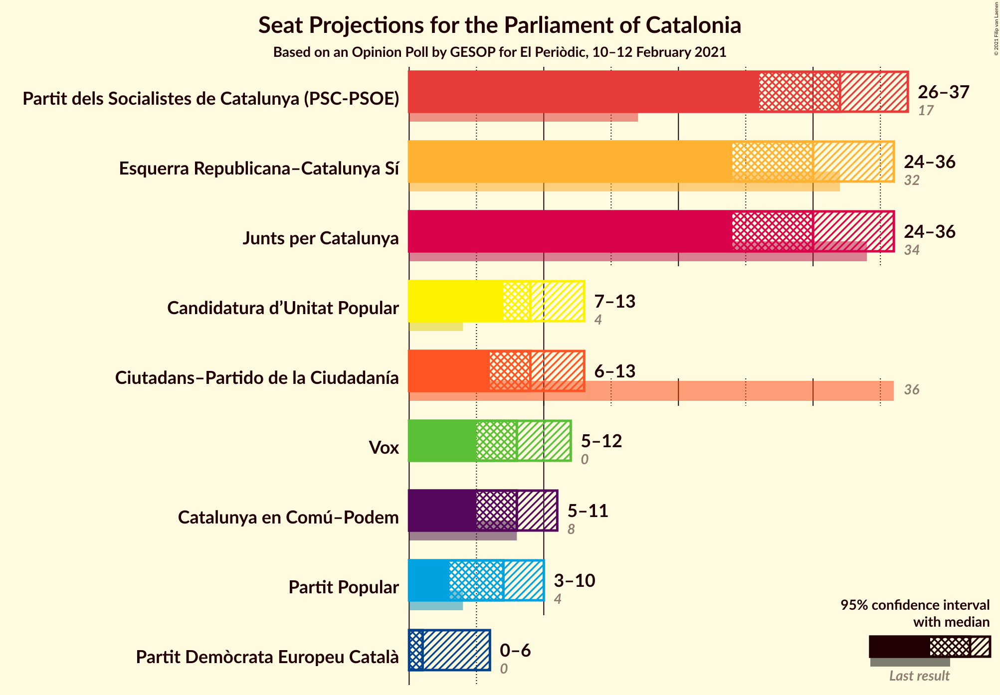
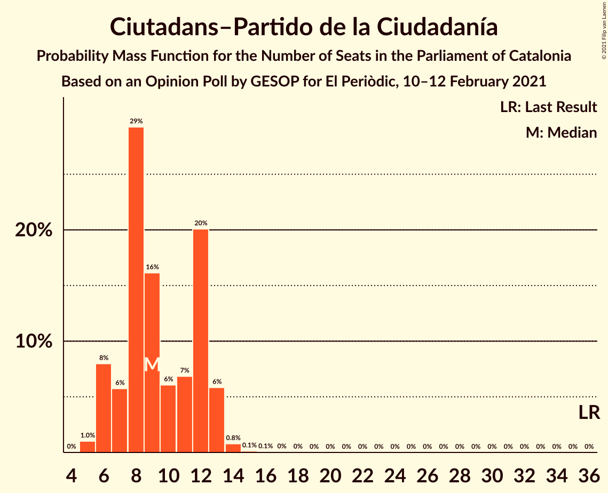
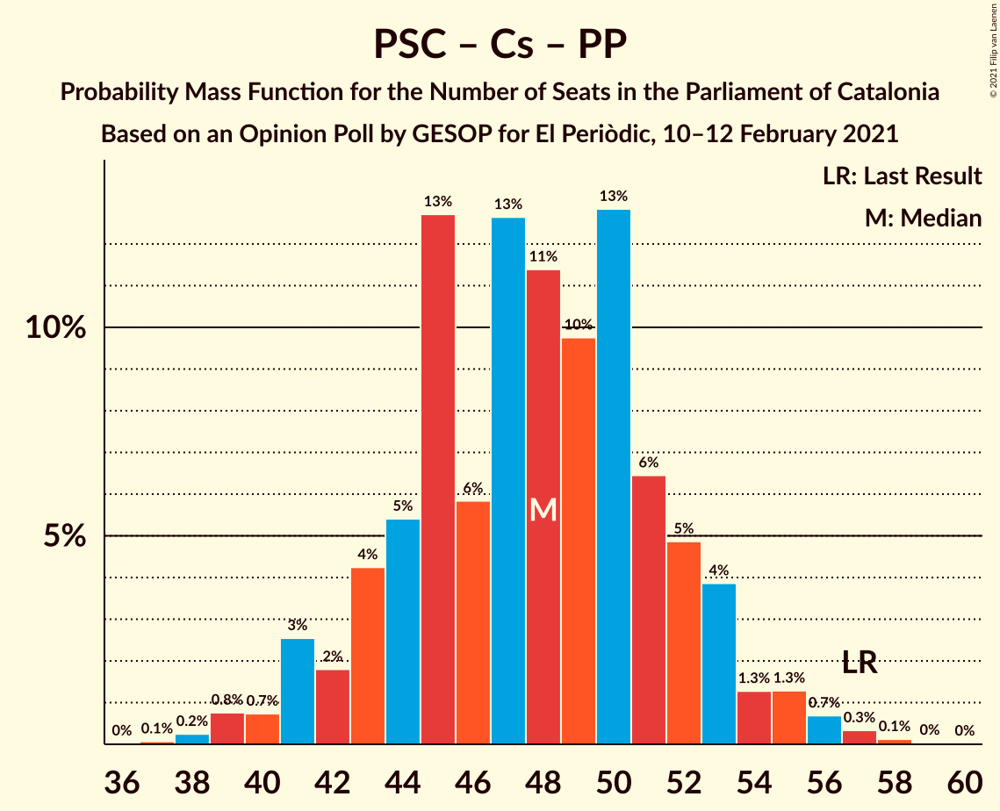

# Opinion Poll by GESOP for El Periòdic, 10–12 February 2021

<a href="#voting-intentions">Voting Intentions</a> | <a href="#seats">Seats</a> | <a href="#coalitions">Coalitions</a> | <a href="#technical-information">Technical Information</a>

## Voting Intentions

### Confidence Intervals

| Party | Last Result | Poll Result | 80% Confidence Interval | 90% Confidence Interval | 95% Confidence Interval | 99% Confidence Interval |
|:-----:|:-----------:|:-----------:|:-----------------------:|:-----------------------:|:-----------------------:|:-----------------------:|
| Partit dels Socialistes de Catalunya (PSC-PSOE) | 13.9% | 22.8% | 20.5–25.4% |19.9–26.1% |19.3–26.7% |18.3–28.0% |
| Esquerra Republicana–Catalunya Sí | 21.4% | 20.2% | 18.0–22.7% |17.4–23.4% |16.9–24.0% |15.9–25.2% |
| Junts per Catalunya | 21.7% | 18.8% | 16.7–21.2% |16.1–21.9% |15.6–22.5% |14.6–23.7% |
| Ciutadans–Partido de la Ciudadanía | 25.4% | 7.5% | 6.2–9.2% |5.8–9.7% |5.5–10.1% |4.9–11.0% |
| Catalunya en Comú–Podem | 7.5% | 6.9% | 5.6–8.6% |5.3–9.0% |5.0–9.4% |4.4–10.3% |
| Candidatura d’Unitat Popular | 4.5% | 6.9% | 5.6–8.6% |5.3–9.0% |5.0–9.4% |4.4–10.3% |
| Vox | 0.0% | 6.3% | 5.1–7.9% |4.7–8.4% |4.5–8.8% |3.9–9.6% |
| Partit Popular | 4.2% | 5.5% | 4.3–7.0% |4.0–7.4% |3.8–7.8% |3.3–8.6% |
| Partit Demòcrata Europeu Català | 0.0% | 3.0% | 2.2–4.3% |2.0–4.6% |1.8–5.0% |1.5–5.6% |

*Note:* The poll result column reflects the actual value used in the calculations. Published results may vary slightly, and in addition be rounded to fewer digits.

## Seats

### Confidence Intervals

| Party | Last Result | Median | 80% Confidence Interval | 90% Confidence Interval | 95% Confidence Interval | 99% Confidence Interval |
|:-----:|:-----------:|:------:|:-----------------------:|:-----------------------:|:-----------------------:|:-----------------------:|
| <a href="#partit-dels-socialistes-de-catalunya-(psc-psoe)">Partit dels Socialistes de Catalunya (PSC-PSOE)</a> | 17 | 33 | 30–35 |29–36 |27–36 |25–38 |
| <a href="#esquerra-republicana–catalunya-sí">Esquerra Republicana–Catalunya Sí</a> | 32 | 30 | 28–33 |26–35 |25–35 |24–38 |
| <a href="#junts-per-catalunya">Junts per Catalunya</a> | 34 | 30 | 26–33 |25–35 |25–35 |23–37 |
| <a href="#ciutadans–partido-de-la-ciudadanía">Ciutadans–Partido de la Ciudadanía</a> | 36 | 9 | 6–12 |6–13 |6–13 |5–14 |
| <a href="#catalunya-en-comú–podem">Catalunya en Comú–Podem</a> | 8 | 8 | 6–10 |5–10 |5–11 |4–13 |
| <a href="#candidatura-d’unitat-popular">Candidatura d’Unitat Popular</a> | 4 | 9 | 8–11 |7–11 |7–13 |5–15 |
| <a href="#vox">Vox</a> | 0 | 9 | 7–9 |6–10 |5–11 |3–13 |
| <a href="#partit-popular">Partit Popular</a> | 4 | 7 | 5–9 |4–9 |3–9 |3–11 |
| <a href="#partit-demòcrata-europeu-català">Partit Demòcrata Europeu Català</a> | 0 | 1 | 0–4 |0–5 |0–6 |0–7 |

### Partit dels Socialistes de Catalunya (PSC-PSOE)

*For a full overview of the results for this party, see the [Partit dels Socialistes de Catalunya (PSC-PSOE)](party-partitdelssocialistesdecatalunyapsc-psoe.html) page.*

| Number of Seats | Probability | Accumulated | Special Marks |
|:---------------:|:-----------:|:-----------:|:-------------:|
| 17 | 0% | 100% | Last Result |
| 18 | 0% | 100% |  |
| 19 | 0% | 100% |  |
| 20 | 0% | 100% |  |
| 21 | 0% | 100% |  |
| 22 | 0% | 100% |  |
| 23 | 0% | 100% |  |
| 24 | 0.3% | 99.9% |  |
| 25 | 0.6% | 99.7% |  |
| 26 | 0.8% | 99.1% |  |
| 27 | 2% | 98% |  |
| 28 | 0.8% | 96% |  |
| 29 | 4% | 96% |  |
| 30 | 3% | 91% |  |
| 31 | 11% | 89% |  |
| 32 | 16% | 77% |  |
| 33 | 20% | 62% | Median |
| 34 | 28% | 41% |  |
| 35 | 8% | 13% |  |
| 36 | 4% | 5% |  |
| 37 | 0.5% | 2% |  |
| 38 | 1.0% | 1.1% |  |
| 39 | 0.1% | 0.1% |  |
| 40 | 0% | 0% |  |

### Esquerra Republicana–Catalunya Sí

*For a full overview of the results for this party, see the [Esquerra Republicana–Catalunya Sí](party-esquerrarepublicana–catalunyasí.html) page.*

| Number of Seats | Probability | Accumulated | Special Marks |
|:---------------:|:-----------:|:-----------:|:-------------:|
| 21 | 0.1% | 100% |  |
| 22 | 0.1% | 99.9% |  |
| 23 | 0.2% | 99.8% |  |
| 24 | 2% | 99.7% |  |
| 25 | 0.8% | 98% |  |
| 26 | 3% | 97% |  |
| 27 | 3% | 94% |  |
| 28 | 6% | 91% |  |
| 29 | 23% | 85% |  |
| 30 | 19% | 62% | Median |
| 31 | 4% | 43% |  |
| 32 | 23% | 39% | Last Result |
| 33 | 8% | 16% |  |
| 34 | 3% | 8% |  |
| 35 | 3% | 5% |  |
| 36 | 2% | 2% |  |
| 37 | 0.2% | 0.8% |  |
| 38 | 0.2% | 0.6% |  |
| 39 | 0.3% | 0.4% |  |
| 40 | 0% | 0.1% |  |
| 41 | 0% | 0.1% |  |
| 42 | 0% | 0% |  |

### Junts per Catalunya

*For a full overview of the results for this party, see the [Junts per Catalunya](party-juntspercatalunya.html) page.*

| Number of Seats | Probability | Accumulated | Special Marks |
|:---------------:|:-----------:|:-----------:|:-------------:|
| 21 | 0.1% | 100% |  |
| 22 | 0% | 99.9% |  |
| 23 | 1.0% | 99.9% |  |
| 24 | 1.3% | 98.9% |  |
| 25 | 6% | 98% |  |
| 26 | 4% | 91% |  |
| 27 | 7% | 87% |  |
| 28 | 1.1% | 80% |  |
| 29 | 12% | 79% |  |
| 30 | 19% | 67% | Median |
| 31 | 26% | 48% |  |
| 32 | 4% | 21% |  |
| 33 | 9% | 17% |  |
| 34 | 0.5% | 9% | Last Result |
| 35 | 6% | 8% |  |
| 36 | 0.6% | 2% |  |
| 37 | 1.1% | 1.3% |  |
| 38 | 0.1% | 0.2% |  |
| 39 | 0.1% | 0.1% |  |
| 40 | 0% | 0.1% |  |
| 41 | 0.1% | 0.1% |  |
| 42 | 0% | 0% |  |

### Ciutadans–Partido de la Ciudadanía

*For a full overview of the results for this party, see the [Ciutadans–Partido de la Ciudadanía](party-ciutadans–partidodelaciudadanía.html) page.*

| Number of Seats | Probability | Accumulated | Special Marks |
|:---------------:|:-----------:|:-----------:|:-------------:|
| 5 | 0.7% | 100% |  |
| 6 | 12% | 99.3% |  |
| 7 | 1.4% | 87% |  |
| 8 | 32% | 86% |  |
| 9 | 25% | 54% | Median |
| 10 | 2% | 29% |  |
| 11 | 4% | 27% |  |
| 12 | 17% | 23% |  |
| 13 | 6% | 6% |  |
| 14 | 0.5% | 0.6% |  |
| 15 | 0% | 0.1% |  |
| 16 | 0% | 0.1% |  |
| 17 | 0% | 0.1% |  |
| 18 | 0% | 0% |  |
| 19 | 0% | 0% |  |
| 20 | 0% | 0% |  |
| 21 | 0% | 0% |  |
| 22 | 0% | 0% |  |
| 23 | 0% | 0% |  |
| 24 | 0% | 0% |  |
| 25 | 0% | 0% |  |
| 26 | 0% | 0% |  |
| 27 | 0% | 0% |  |
| 28 | 0% | 0% |  |
| 29 | 0% | 0% |  |
| 30 | 0% | 0% |  |
| 31 | 0% | 0% |  |
| 32 | 0% | 0% |  |
| 33 | 0% | 0% |  |
| 34 | 0% | 0% |  |
| 35 | 0% | 0% |  |
| 36 | 0% | 0% | Last Result |

### Catalunya en Comú–Podem

*For a full overview of the results for this party, see the [Catalunya en Comú–Podem](party-catalunyaencomú–podem.html) page.*

| Number of Seats | Probability | Accumulated | Special Marks |
|:---------------:|:-----------:|:-----------:|:-------------:|
| 4 | 1.1% | 100% |  |
| 5 | 7% | 98.9% |  |
| 6 | 3% | 92% |  |
| 7 | 33% | 89% |  |
| 8 | 39% | 56% | Last Result, Median |
| 9 | 4% | 17% |  |
| 10 | 8% | 12% |  |
| 11 | 3% | 5% |  |
| 12 | 0.4% | 1.2% |  |
| 13 | 0.6% | 0.7% |  |
| 14 | 0.1% | 0.1% |  |
| 15 | 0% | 0% |  |

### Candidatura d’Unitat Popular

*For a full overview of the results for this party, see the [Candidatura d’Unitat Popular](party-candidaturad’unitatpopular.html) page.*

| Number of Seats | Probability | Accumulated | Special Marks |
|:---------------:|:-----------:|:-----------:|:-------------:|
| 4 | 0.4% | 100% | Last Result |
| 5 | 0.1% | 99.6% |  |
| 6 | 1.1% | 99.4% |  |
| 7 | 6% | 98% |  |
| 8 | 33% | 93% |  |
| 9 | 34% | 59% | Median |
| 10 | 8% | 26% |  |
| 11 | 14% | 17% |  |
| 12 | 0.8% | 4% |  |
| 13 | 1.2% | 3% |  |
| 14 | 0.9% | 2% |  |
| 15 | 0.7% | 0.7% |  |
| 16 | 0% | 0% |  |

### Vox

*For a full overview of the results for this party, see the [Vox](party-vox.html) page.*

| Number of Seats | Probability | Accumulated | Special Marks |
|:---------------:|:-----------:|:-----------:|:-------------:|
| 0 | 0% | 100% | Last Result |
| 1 | 0% | 100% |  |
| 2 | 0% | 100% |  |
| 3 | 0.5% | 100% |  |
| 4 | 0.4% | 99.5% |  |
| 5 | 3% | 99.1% |  |
| 6 | 2% | 96% |  |
| 7 | 25% | 95% |  |
| 8 | 19% | 69% |  |
| 9 | 43% | 51% | Median |
| 10 | 4% | 7% |  |
| 11 | 1.5% | 3% |  |
| 12 | 1.3% | 2% |  |
| 13 | 0.3% | 0.6% |  |
| 14 | 0.2% | 0.3% |  |
| 15 | 0.1% | 0.1% |  |
| 16 | 0% | 0% |  |

### Partit Popular

*For a full overview of the results for this party, see the [Partit Popular](party-partitpopular.html) page.*

| Number of Seats | Probability | Accumulated | Special Marks |
|:---------------:|:-----------:|:-----------:|:-------------:|
| 0 | 0.1% | 100% |  |
| 1 | 0% | 99.9% |  |
| 2 | 0.1% | 99.9% |  |
| 3 | 3% | 99.8% |  |
| 4 | 4% | 97% | Last Result |
| 5 | 20% | 93% |  |
| 6 | 10% | 73% |  |
| 7 | 44% | 63% | Median |
| 8 | 8% | 19% |  |
| 9 | 8% | 10% |  |
| 10 | 1.0% | 2% |  |
| 11 | 0.6% | 0.9% |  |
| 12 | 0.3% | 0.3% |  |
| 13 | 0% | 0% |  |

### Partit Demòcrata Europeu Català

*For a full overview of the results for this party, see the [Partit Demòcrata Europeu Català](party-partitdemòcrataeuropeucatalà.html) page.*

| Number of Seats | Probability | Accumulated | Special Marks |
|:---------------:|:-----------:|:-----------:|:-------------:|
| 0 | 44% | 100% | Last Result |
| 1 | 39% | 56% | Median |
| 2 | 2% | 17% |  |
| 3 | 0.5% | 15% |  |
| 4 | 5% | 14% |  |
| 5 | 5% | 9% |  |
| 6 | 3% | 4% |  |
| 7 | 0.4% | 0.8% |  |
| 8 | 0.4% | 0.5% |  |
| 9 | 0.1% | 0.1% |  |
| 10 | 0% | 0% |  |

## Coalitions

### Confidence Intervals

| Coalition | Last Result | Median | Majority? | 80% Confidence Interval | 90% Confidence Interval | 95% Confidence Interval | 99% Confidence Interval |
|:---------:|:-----------:|:------:|:---------:|:-----------------------:|:-----------------------:|:-----------------------:|:-----------------------:|
| Esquerra Republicana–Catalunya Sí – Junts per Catalunya – Candidatura d’Unitat Popular – Partit Demòcrata Europeu Català | 70 | 70 | 87% | 67–76 | 66–76 | 66–77 | 63–80 |
| Partit dels Socialistes de Catalunya (PSC-PSOE) – Esquerra Republicana–Catalunya Sí – Catalunya en Comú–Podem | 57 | 71 | 87% | 66–74 | 65–75 | 64–76 | 61–78 |
| Esquerra Republicana–Catalunya Sí – Junts per Catalunya – Candidatura d’Unitat Popular | 70 | 70 | 78% | 65–74 | 64–76 | 62–76 | 60–77 |
| Esquerra Republicana–Catalunya Sí – Junts per Catalunya – Catalunya en Comú–Podem | 74 | 68 | 52% | 65–72 | 62–75 | 60–75 | 59–77 |
| Esquerra Republicana–Catalunya Sí – Junts per Catalunya – Partit Demòcrata Europeu Català | 66 | 61 | 7% | 58–65 | 57–68 | 56–68 | 53–71 |
| Esquerra Republicana–Catalunya Sí – Junts per Catalunya | 66 | 60 | 6% | 55–65 | 55–68 | 54–68 | 51–68 |
| Partit dels Socialistes de Catalunya (PSC-PSOE) – Ciutadans–Partido de la Ciudadanía – Catalunya en Comú–Podem – Partit Popular | 65 | 56 | 0% | 52–60 | 51–61 | 50–62 | 48–64 |
| Partit dels Socialistes de Catalunya (PSC-PSOE) – Ciutadans–Partido de la Ciudadanía – Vox – Partit Popular | 57 | 56 | 0% | 52–60 | 52–61 | 50–61 | 47–65 |
| Partit dels Socialistes de Catalunya (PSC-PSOE) – Ciutadans–Partido de la Ciudadanía – Partit Popular | 57 | 48 | 0% | 45–52 | 43–53 | 42–53 | 40–55 |
| Esquerra Republicana–Catalunya Sí – Catalunya en Comú–Podem | 40 | 38 | 0% | 36–41 | 34–42 | 31–43 | 30–46 |

### Esquerra Republicana–Catalunya Sí – Junts per Catalunya – Candidatura d’Unitat Popular – Partit Demòcrata Europeu Català

| Number of Seats | Probability | Accumulated | Special Marks |
|:---------------:|:-----------:|:-----------:|:-------------:|
| 60 | 0.1% | 100% |  |
| 61 | 0.1% | 99.9% |  |
| 62 | 0.2% | 99.8% |  |
| 63 | 0.1% | 99.5% |  |
| 64 | 0.5% | 99.4% |  |
| 65 | 1.1% | 98.9% |  |
| 66 | 7% | 98% |  |
| 67 | 3% | 90% |  |
| 68 | 8% | 87% | Majority |
| 69 | 21% | 79% |  |
| 70 | 8% | 58% | Last Result, Median |
| 71 | 19% | 50% |  |
| 72 | 3% | 30% |  |
| 73 | 9% | 27% |  |
| 74 | 5% | 18% |  |
| 75 | 1.2% | 13% |  |
| 76 | 9% | 11% |  |
| 77 | 1.1% | 3% |  |
| 78 | 0.4% | 1.5% |  |
| 79 | 0.4% | 1.1% |  |
| 80 | 0.2% | 0.7% |  |
| 81 | 0.3% | 0.5% |  |
| 82 | 0.1% | 0.2% |  |
| 83 | 0% | 0.1% |  |
| 84 | 0% | 0% |  |

### Partit dels Socialistes de Catalunya (PSC-PSOE) – Esquerra Republicana–Catalunya Sí – Catalunya en Comú–Podem

| Number of Seats | Probability | Accumulated | Special Marks |
|:---------------:|:-----------:|:-----------:|:-------------:|
| 57 | 0% | 100% | Last Result |
| 58 | 0% | 100% |  |
| 59 | 0.1% | 99.9% |  |
| 60 | 0.1% | 99.8% |  |
| 61 | 0.3% | 99.7% |  |
| 62 | 0.7% | 99.4% |  |
| 63 | 0.5% | 98.6% |  |
| 64 | 0.8% | 98% |  |
| 65 | 3% | 97% |  |
| 66 | 5% | 94% |  |
| 67 | 2% | 89% |  |
| 68 | 6% | 87% | Majority |
| 69 | 3% | 81% |  |
| 70 | 22% | 79% |  |
| 71 | 12% | 57% | Median |
| 72 | 15% | 45% |  |
| 73 | 17% | 30% |  |
| 74 | 6% | 13% |  |
| 75 | 4% | 6% |  |
| 76 | 0.6% | 3% |  |
| 77 | 0.3% | 2% |  |
| 78 | 2% | 2% |  |
| 79 | 0.1% | 0.3% |  |
| 80 | 0.2% | 0.2% |  |
| 81 | 0% | 0% |  |

### Esquerra Republicana–Catalunya Sí – Junts per Catalunya – Candidatura d’Unitat Popular

| Number of Seats | Probability | Accumulated | Special Marks |
|:---------------:|:-----------:|:-----------:|:-------------:|
| 58 | 0% | 100% |  |
| 59 | 0.2% | 99.9% |  |
| 60 | 0.3% | 99.7% |  |
| 61 | 0.8% | 99.5% |  |
| 62 | 2% | 98.7% |  |
| 63 | 2% | 97% |  |
| 64 | 4% | 95% |  |
| 65 | 5% | 91% |  |
| 66 | 5% | 87% |  |
| 67 | 4% | 82% |  |
| 68 | 8% | 78% | Majority |
| 69 | 20% | 70% | Median |
| 70 | 21% | 50% | Last Result |
| 71 | 4% | 29% |  |
| 72 | 9% | 25% |  |
| 73 | 5% | 17% |  |
| 74 | 3% | 12% |  |
| 75 | 0.6% | 9% |  |
| 76 | 8% | 8% |  |
| 77 | 0.2% | 0.6% |  |
| 78 | 0.2% | 0.4% |  |
| 79 | 0% | 0.2% |  |
| 80 | 0% | 0.1% |  |
| 81 | 0.1% | 0.1% |  |
| 82 | 0% | 0% |  |

### Esquerra Republicana–Catalunya Sí – Junts per Catalunya – Catalunya en Comú–Podem

| Number of Seats | Probability | Accumulated | Special Marks |
|:---------------:|:-----------:|:-----------:|:-------------:|
| 56 | 0% | 100% |  |
| 57 | 0.1% | 99.9% |  |
| 58 | 0.2% | 99.9% |  |
| 59 | 0.3% | 99.6% |  |
| 60 | 2% | 99.3% |  |
| 61 | 2% | 97% |  |
| 62 | 3% | 96% |  |
| 63 | 1.3% | 93% |  |
| 64 | 2% | 92% |  |
| 65 | 8% | 90% |  |
| 66 | 5% | 82% |  |
| 67 | 25% | 77% |  |
| 68 | 6% | 52% | Median, Majority |
| 69 | 8% | 46% |  |
| 70 | 17% | 38% |  |
| 71 | 8% | 20% |  |
| 72 | 3% | 12% |  |
| 73 | 0.9% | 9% |  |
| 74 | 1.4% | 8% | Last Result |
| 75 | 5% | 6% |  |
| 76 | 0.7% | 1.2% |  |
| 77 | 0.4% | 0.5% |  |
| 78 | 0.1% | 0.1% |  |
| 79 | 0% | 0.1% |  |
| 80 | 0% | 0% |  |

### Esquerra Republicana–Catalunya Sí – Junts per Catalunya – Partit Demòcrata Europeu Català

| Number of Seats | Probability | Accumulated | Special Marks |
|:---------------:|:-----------:|:-----------:|:-------------:|
| 51 | 0.1% | 100% |  |
| 52 | 0.1% | 99.9% |  |
| 53 | 0.3% | 99.8% |  |
| 54 | 0.3% | 99.4% |  |
| 55 | 0.7% | 99.1% |  |
| 56 | 0.9% | 98% |  |
| 57 | 5% | 97% |  |
| 58 | 7% | 92% |  |
| 59 | 3% | 85% |  |
| 60 | 32% | 82% |  |
| 61 | 4% | 50% | Median |
| 62 | 3% | 46% |  |
| 63 | 19% | 43% |  |
| 64 | 8% | 24% |  |
| 65 | 7% | 16% |  |
| 66 | 1.0% | 10% | Last Result |
| 67 | 2% | 9% |  |
| 68 | 5% | 7% | Majority |
| 69 | 0.8% | 2% |  |
| 70 | 0.3% | 1.0% |  |
| 71 | 0.2% | 0.7% |  |
| 72 | 0.3% | 0.4% |  |
| 73 | 0.1% | 0.1% |  |
| 74 | 0% | 0.1% |  |
| 75 | 0% | 0.1% |  |
| 76 | 0% | 0% |  |

### Esquerra Republicana–Catalunya Sí – Junts per Catalunya

| Number of Seats | Probability | Accumulated | Special Marks |
|:---------------:|:-----------:|:-----------:|:-------------:|
| 49 | 0% | 100% |  |
| 50 | 0.2% | 99.9% |  |
| 51 | 0.3% | 99.8% |  |
| 52 | 0.4% | 99.4% |  |
| 53 | 0.8% | 99.0% |  |
| 54 | 3% | 98% |  |
| 55 | 6% | 96% |  |
| 56 | 2% | 90% |  |
| 57 | 6% | 88% |  |
| 58 | 5% | 82% |  |
| 59 | 11% | 77% |  |
| 60 | 24% | 67% | Median |
| 61 | 4% | 43% |  |
| 62 | 15% | 39% |  |
| 63 | 10% | 25% |  |
| 64 | 4% | 14% |  |
| 65 | 3% | 10% |  |
| 66 | 0.4% | 7% | Last Result |
| 67 | 2% | 7% |  |
| 68 | 5% | 6% | Majority |
| 69 | 0.2% | 0.3% |  |
| 70 | 0.1% | 0.2% |  |
| 71 | 0% | 0.1% |  |
| 72 | 0% | 0% |  |

### Partit dels Socialistes de Catalunya (PSC-PSOE) – Ciutadans–Partido de la Ciudadanía – Catalunya en Comú–Podem – Partit Popular

| Number of Seats | Probability | Accumulated | Special Marks |
|:---------------:|:-----------:|:-----------:|:-------------:|
| 44 | 0% | 100% |  |
| 45 | 0.1% | 99.9% |  |
| 46 | 0.1% | 99.9% |  |
| 47 | 0.2% | 99.8% |  |
| 48 | 0.6% | 99.6% |  |
| 49 | 0.9% | 99.0% |  |
| 50 | 3% | 98% |  |
| 51 | 2% | 95% |  |
| 52 | 5% | 93% |  |
| 53 | 8% | 88% |  |
| 54 | 5% | 80% |  |
| 55 | 7% | 74% |  |
| 56 | 21% | 67% |  |
| 57 | 21% | 46% | Median |
| 58 | 5% | 25% |  |
| 59 | 4% | 20% |  |
| 60 | 10% | 15% |  |
| 61 | 1.1% | 5% |  |
| 62 | 3% | 4% |  |
| 63 | 0.5% | 1.1% |  |
| 64 | 0.2% | 0.6% |  |
| 65 | 0.1% | 0.3% | Last Result |
| 66 | 0.2% | 0.2% |  |
| 67 | 0% | 0% |  |

### Partit dels Socialistes de Catalunya (PSC-PSOE) – Ciutadans–Partido de la Ciudadanía – Vox – Partit Popular

| Number of Seats | Probability | Accumulated | Special Marks |
|:---------------:|:-----------:|:-----------:|:-------------:|
| 44 | 0% | 100% |  |
| 45 | 0.2% | 99.9% |  |
| 46 | 0.1% | 99.7% |  |
| 47 | 0.2% | 99.6% |  |
| 48 | 0.3% | 99.4% |  |
| 49 | 0.5% | 99.1% |  |
| 50 | 1.2% | 98.6% |  |
| 51 | 2% | 97% |  |
| 52 | 8% | 96% |  |
| 53 | 2% | 88% |  |
| 54 | 9% | 86% |  |
| 55 | 5% | 77% |  |
| 56 | 25% | 72% |  |
| 57 | 6% | 47% | Last Result |
| 58 | 4% | 41% | Median |
| 59 | 24% | 37% |  |
| 60 | 8% | 13% |  |
| 61 | 3% | 5% |  |
| 62 | 0.7% | 2% |  |
| 63 | 0.7% | 1.4% |  |
| 64 | 0.1% | 0.7% |  |
| 65 | 0.4% | 0.6% |  |
| 66 | 0.2% | 0.2% |  |
| 67 | 0% | 0% |  |

### Partit dels Socialistes de Catalunya (PSC-PSOE) – Ciutadans–Partido de la Ciudadanía – Partit Popular

| Number of Seats | Probability | Accumulated | Special Marks |
|:---------------:|:-----------:|:-----------:|:-------------:|
| 38 | 0.1% | 100% |  |
| 39 | 0.1% | 99.8% |  |
| 40 | 0.4% | 99.7% |  |
| 41 | 0.8% | 99.3% |  |
| 42 | 1.2% | 98% |  |
| 43 | 3% | 97% |  |
| 44 | 1.0% | 94% |  |
| 45 | 12% | 93% |  |
| 46 | 4% | 82% |  |
| 47 | 8% | 77% |  |
| 48 | 21% | 69% |  |
| 49 | 6% | 48% | Median |
| 50 | 24% | 42% |  |
| 51 | 5% | 18% |  |
| 52 | 6% | 13% |  |
| 53 | 5% | 6% |  |
| 54 | 0.9% | 2% |  |
| 55 | 0.4% | 0.8% |  |
| 56 | 0.2% | 0.5% |  |
| 57 | 0.1% | 0.2% | Last Result |
| 58 | 0% | 0.1% |  |
| 59 | 0% | 0.1% |  |
| 60 | 0% | 0% |  |

### Esquerra Republicana–Catalunya Sí – Catalunya en Comú–Podem

| Number of Seats | Probability | Accumulated | Special Marks |
|:---------------:|:-----------:|:-----------:|:-------------:|
| 28 | 0.1% | 100% |  |
| 29 | 0.2% | 99.9% |  |
| 30 | 0.7% | 99.7% |  |
| 31 | 2% | 98.9% |  |
| 32 | 1.2% | 97% |  |
| 33 | 0.6% | 96% |  |
| 34 | 1.4% | 95% |  |
| 35 | 3% | 94% |  |
| 36 | 22% | 91% |  |
| 37 | 9% | 69% |  |
| 38 | 17% | 60% | Median |
| 39 | 4% | 43% |  |
| 40 | 27% | 39% | Last Result |
| 41 | 2% | 12% |  |
| 42 | 6% | 10% |  |
| 43 | 2% | 4% |  |
| 44 | 0.7% | 2% |  |
| 45 | 0.4% | 1.3% |  |
| 46 | 0.4% | 0.8% |  |
| 47 | 0.2% | 0.4% |  |
| 48 | 0.1% | 0.2% |  |
| 49 | 0.1% | 0.1% |  |
| 50 | 0% | 0% |  |

## Technical Information

### Opinion Poll

+ **Polling firm:** GESOP
+ **Commissioner(s):** El Periòdic
+ **Fieldwork period:** 10–12 February 2021

### Calculations

+ **Sample size:** 495
+ **Simulations done:** 262,144
+ **Error estimate:** 2.09%

