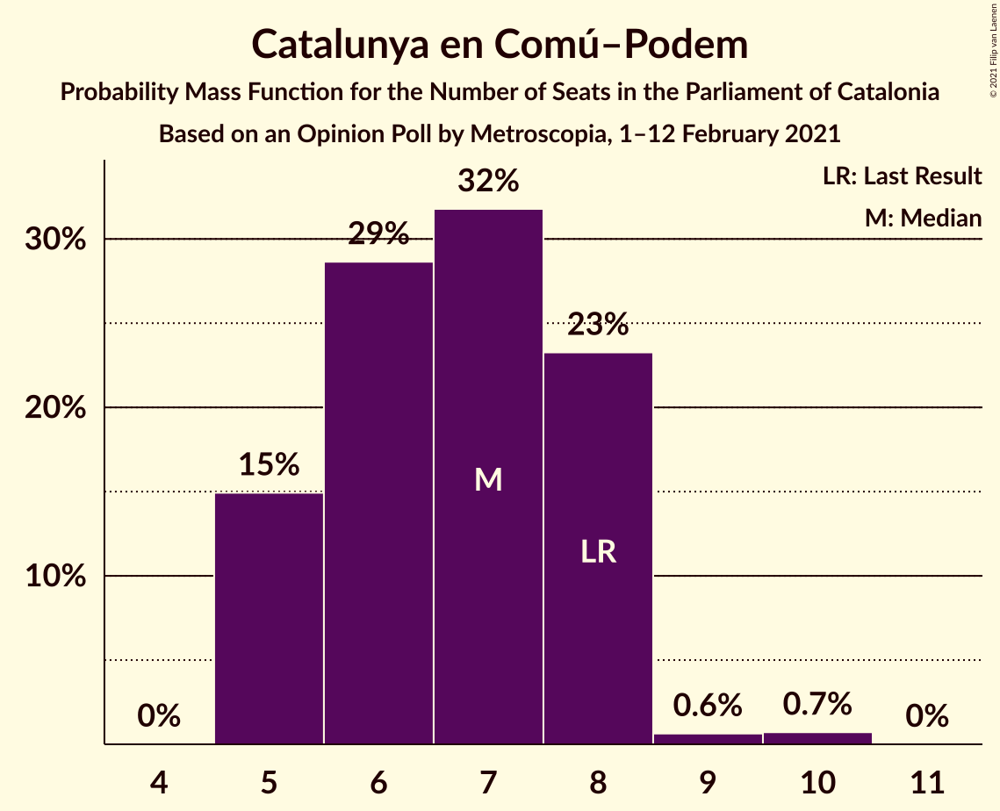
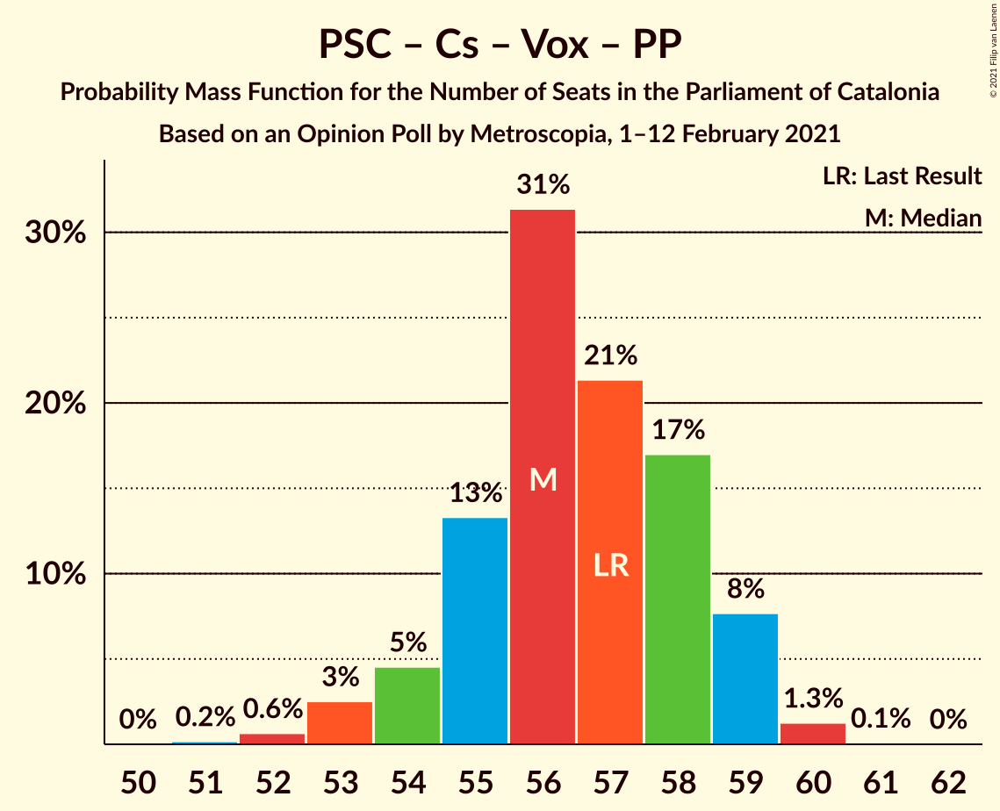

# Opinion Poll by Metroscopia, 1–12 February 2021

<a href="#voting-intentions">Voting Intentions</a> | <a href="#seats">Seats</a> | <a href="#coalitions">Coalitions</a> | <a href="#technical-information">Technical Information</a>

## Voting Intentions

### Confidence Intervals

| Party | Last Result | Poll Result | 80% Confidence Interval | 90% Confidence Interval | 95% Confidence Interval | 99% Confidence Interval |
|:-----:|:-----------:|:-----------:|:-----------------------:|:-----------------------:|:-----------------------:|:-----------------------:|
| Partit dels Socialistes de Catalunya (PSC-PSOE) | 13.9% | 23.2% | 22.1–24.3% |21.8–24.6% |21.6–24.9% |21.0–25.5% |
| Junts per Catalunya | 21.7% | 21.1% | 20.1–22.2% |19.8–22.5% |19.5–22.8% |19.0–23.3% |
| Esquerra Republicana–Catalunya Sí | 21.4% | 20.3% | 19.3–21.4% |19.0–21.7% |18.7–22.0% |18.3–22.5% |
| Ciutadans–Partido de la Ciudadanía | 25.4% | 9.0% | 8.3–9.8% |8.1–10.0% |7.9–10.2% |7.6–10.6% |
| Catalunya en Comú–Podem | 7.5% | 6.4% | 5.8–7.1% |5.6–7.3% |5.5–7.5% |5.2–7.8% |
| Candidatura d’Unitat Popular | 4.5% | 5.9% | 5.3–6.5% |5.1–6.7% |5.0–6.9% |4.7–7.2% |
| Vox | 0.0% | 5.4% | 4.8–6.0% |4.7–6.2% |4.6–6.4% |4.3–6.7% |
| Partit Popular | 4.2% | 5.3% | 4.8–5.9% |4.6–6.1% |4.5–6.3% |4.2–6.6% |
| Partit Demòcrata Europeu Català | 0.0% | 2.2% | 1.9–2.7% |1.8–2.8% |1.7–2.9% |1.6–3.1% |

*Note:* The poll result column reflects the actual value used in the calculations. Published results may vary slightly, and in addition be rounded to fewer digits.

## Seats

### Confidence Intervals

| Party | Last Result | Median | 80% Confidence Interval | 90% Confidence Interval | 95% Confidence Interval | 99% Confidence Interval |
|:-----:|:-----------:|:------:|:-----------------------:|:-----------------------:|:-----------------------:|:-----------------------:|
| <a href="#partit-dels-socialistes-de-catalunya-(psc-psoe)">Partit dels Socialistes de Catalunya (PSC-PSOE)</a> | 17 | 32 | 30–33 |30–34 |30–34 |29–35 |
| <a href="#junts-per-catalunya">Junts per Catalunya</a> | 34 | 34 | 32–35 |31–36 |31–37 |31–37 |
| <a href="#esquerra-republicana–catalunya-sí">Esquerra Republicana–Catalunya Sí</a> | 32 | 30 | 28–32 |28–33 |28–33 |27–34 |
| <a href="#ciutadans–partido-de-la-ciudadanía">Ciutadans–Partido de la Ciudadanía</a> | 36 | 12 | 11–13 |10–13 |9–13 |9–14 |
| <a href="#catalunya-en-comú–podem">Catalunya en Comú–Podem</a> | 8 | 7 | 5–8 |5–8 |5–8 |5–10 |
| <a href="#candidatura-d’unitat-popular">Candidatura d’Unitat Popular</a> | 4 | 8 | 7–8 |7–9 |7–9 |5–9 |
| <a href="#vox">Vox</a> | 0 | 7 | 5–7 |5–7 |5–8 |5–9 |
| <a href="#partit-popular">Partit Popular</a> | 4 | 7 | 5–7 |5–7 |5–7 |4–9 |
| <a href="#partit-demòcrata-europeu-català">Partit Demòcrata Europeu Català</a> | 0 | 0 | 0–1 |0–1 |0–1 |0–1 |

### Partit dels Socialistes de Catalunya (PSC-PSOE)

*For a full overview of the results for this party, see the [Partit dels Socialistes de Catalunya (PSC-PSOE)](party-partitdelssocialistesdecatalunyapsc-psoe.html) page.*

| Number of Seats | Probability | Accumulated | Special Marks |
|:---------------:|:-----------:|:-----------:|:-------------:|
| 17 | 0% | 100% | Last Result |
| 18 | 0% | 100% |  |
| 19 | 0% | 100% |  |
| 20 | 0% | 100% |  |
| 21 | 0% | 100% |  |
| 22 | 0% | 100% |  |
| 23 | 0% | 100% |  |
| 24 | 0% | 100% |  |
| 25 | 0% | 100% |  |
| 26 | 0% | 100% |  |
| 27 | 0.1% | 100% |  |
| 28 | 0.3% | 99.9% |  |
| 29 | 1.5% | 99.6% |  |
| 30 | 9% | 98% |  |
| 31 | 26% | 89% |  |
| 32 | 35% | 64% | Median |
| 33 | 22% | 29% |  |
| 34 | 6% | 8% |  |
| 35 | 2% | 2% |  |
| 36 | 0.1% | 0.1% |  |
| 37 | 0% | 0% |  |

### Junts per Catalunya

*For a full overview of the results for this party, see the [Junts per Catalunya](party-juntspercatalunya.html) page.*

| Number of Seats | Probability | Accumulated | Special Marks |
|:---------------:|:-----------:|:-----------:|:-------------:|
| 30 | 0.2% | 100% |  |
| 31 | 6% | 99.8% |  |
| 32 | 14% | 94% |  |
| 33 | 20% | 80% |  |
| 34 | 21% | 59% | Last Result, Median |
| 35 | 30% | 38% |  |
| 36 | 5% | 9% |  |
| 37 | 3% | 4% |  |
| 38 | 0.4% | 0.4% |  |
| 39 | 0% | 0% |  |

### Esquerra Republicana–Catalunya Sí

*For a full overview of the results for this party, see the [Esquerra Republicana–Catalunya Sí](party-esquerrarepublicana–catalunyasí.html) page.*

| Number of Seats | Probability | Accumulated | Special Marks |
|:---------------:|:-----------:|:-----------:|:-------------:|
| 27 | 0.5% | 100% |  |
| 28 | 13% | 99.5% |  |
| 29 | 29% | 87% |  |
| 30 | 18% | 58% | Median |
| 31 | 29% | 40% |  |
| 32 | 5% | 11% | Last Result |
| 33 | 4% | 7% |  |
| 34 | 2% | 2% |  |
| 35 | 0.5% | 0.5% |  |
| 36 | 0% | 0% |  |

### Ciutadans–Partido de la Ciudadanía

*For a full overview of the results for this party, see the [Ciutadans–Partido de la Ciudadanía](party-ciutadans–partidodelaciudadanía.html) page.*

| Number of Seats | Probability | Accumulated | Special Marks |
|:---------------:|:-----------:|:-----------:|:-------------:|
| 8 | 0.1% | 100% |  |
| 9 | 4% | 99.9% |  |
| 10 | 5% | 96% |  |
| 11 | 3% | 90% |  |
| 12 | 66% | 87% | Median |
| 13 | 20% | 21% |  |
| 14 | 0.7% | 0.7% |  |
| 15 | 0% | 0% |  |
| 16 | 0% | 0% |  |
| 17 | 0% | 0% |  |
| 18 | 0% | 0% |  |
| 19 | 0% | 0% |  |
| 20 | 0% | 0% |  |
| 21 | 0% | 0% |  |
| 22 | 0% | 0% |  |
| 23 | 0% | 0% |  |
| 24 | 0% | 0% |  |
| 25 | 0% | 0% |  |
| 26 | 0% | 0% |  |
| 27 | 0% | 0% |  |
| 28 | 0% | 0% |  |
| 29 | 0% | 0% |  |
| 30 | 0% | 0% |  |
| 31 | 0% | 0% |  |
| 32 | 0% | 0% |  |
| 33 | 0% | 0% |  |
| 34 | 0% | 0% |  |
| 35 | 0% | 0% |  |
| 36 | 0% | 0% | Last Result |

### Catalunya en Comú–Podem

*For a full overview of the results for this party, see the [Catalunya en Comú–Podem](party-catalunyaencomú–podem.html) page.*

| Number of Seats | Probability | Accumulated | Special Marks |
|:---------------:|:-----------:|:-----------:|:-------------:|
| 5 | 15% | 100% |  |
| 6 | 29% | 85% |  |
| 7 | 32% | 56% | Median |
| 8 | 23% | 25% | Last Result |
| 9 | 0.6% | 1.4% |  |
| 10 | 0.7% | 0.7% |  |
| 11 | 0% | 0% |  |

### Candidatura d’Unitat Popular

*For a full overview of the results for this party, see the [Candidatura d’Unitat Popular](party-candidaturad’unitatpopular.html) page.*

| Number of Seats | Probability | Accumulated | Special Marks |
|:---------------:|:-----------:|:-----------:|:-------------:|
| 4 | 0% | 100% | Last Result |
| 5 | 0.5% | 100% |  |
| 6 | 2% | 99.4% |  |
| 7 | 23% | 98% |  |
| 8 | 67% | 74% | Median |
| 9 | 7% | 7% |  |
| 10 | 0.2% | 0.2% |  |
| 11 | 0% | 0% |  |

### Vox

*For a full overview of the results for this party, see the [Vox](party-vox.html) page.*

| Number of Seats | Probability | Accumulated | Special Marks |
|:---------------:|:-----------:|:-----------:|:-------------:|
| 0 | 0% | 100% | Last Result |
| 1 | 0% | 100% |  |
| 2 | 0% | 100% |  |
| 3 | 0.1% | 100% |  |
| 4 | 0.2% | 99.9% |  |
| 5 | 21% | 99.6% |  |
| 6 | 19% | 79% |  |
| 7 | 58% | 60% | Median |
| 8 | 1.4% | 3% |  |
| 9 | 1.1% | 1.1% |  |
| 10 | 0% | 0% |  |

### Partit Popular

*For a full overview of the results for this party, see the [Partit Popular](party-partitpopular.html) page.*

| Number of Seats | Probability | Accumulated | Special Marks |
|:---------------:|:-----------:|:-----------:|:-------------:|
| 3 | 0.3% | 100% |  |
| 4 | 0.4% | 99.7% | Last Result |
| 5 | 31% | 99.3% |  |
| 6 | 14% | 68% |  |
| 7 | 53% | 54% | Median |
| 8 | 0.7% | 2% |  |
| 9 | 0.9% | 0.9% |  |
| 10 | 0% | 0% |  |

### Partit Demòcrata Europeu Català

*For a full overview of the results for this party, see the [Partit Demòcrata Europeu Català](party-partitdemòcrataeuropeucatalà.html) page.*

| Number of Seats | Probability | Accumulated | Special Marks |
|:---------------:|:-----------:|:-----------:|:-------------:|
| 0 | 85% | 100% | Last Result, Median |
| 1 | 15% | 15% |  |
| 2 | 0% | 0% |  |

## Coalitions

### Confidence Intervals

| Coalition | Last Result | Median | Majority? | 80% Confidence Interval | 90% Confidence Interval | 95% Confidence Interval | 99% Confidence Interval |
|:---------:|:-----------:|:------:|:---------:|:-----------------------:|:-----------------------:|:-----------------------:|:-----------------------:|
| Junts per Catalunya – Esquerra Republicana–Catalunya Sí – Candidatura d’Unitat Popular – Partit Demòcrata Europeu Català | 70 | 72 | 99.8% | 70–74 | 69–74 | 69–75 | 68–76 |
| Junts per Catalunya – Esquerra Republicana–Catalunya Sí – Candidatura d’Unitat Popular | 70 | 72 | 99.7% | 69–74 | 69–74 | 68–75 | 68–76 |
| Junts per Catalunya – Esquerra Republicana–Catalunya Sí – Catalunya en Comú–Podem | 74 | 71 | 98.8% | 68–73 | 68–73 | 68–74 | 67–75 |
| Partit dels Socialistes de Catalunya (PSC-PSOE) – Esquerra Republicana–Catalunya Sí – Catalunya en Comú–Podem | 57 | 68 | 81% | 66–71 | 66–72 | 66–72 | 65–74 |
| Junts per Catalunya – Esquerra Republicana–Catalunya Sí | 66 | 64 | 1.0% | 61–66 | 61–67 | 61–67 | 60–68 |
| Junts per Catalunya – Esquerra Republicana–Catalunya Sí – Partit Demòcrata Europeu Català | 66 | 64 | 1.3% | 62–66 | 61–67 | 61–67 | 60–68 |
| Partit dels Socialistes de Catalunya (PSC-PSOE) – Ciutadans–Partido de la Ciudadanía – Catalunya en Comú–Podem – Partit Popular | 65 | 57 | 0% | 55–59 | 54–59 | 54–60 | 53–61 |
| Partit dels Socialistes de Catalunya (PSC-PSOE) – Ciutadans–Partido de la Ciudadanía – Vox – Partit Popular | 57 | 56 | 0% | 55–58 | 54–59 | 53–59 | 52–60 |
| Partit dels Socialistes de Catalunya (PSC-PSOE) – Ciutadans–Partido de la Ciudadanía – Partit Popular | 57 | 50 | 0% | 48–52 | 48–52 | 47–53 | 46–54 |
| Esquerra Republicana–Catalunya Sí – Catalunya en Comú–Podem | 40 | 37 | 0% | 35–39 | 34–40 | 34–40 | 34–42 |

### Junts per Catalunya – Esquerra Republicana–Catalunya Sí – Candidatura d’Unitat Popular – Partit Demòcrata Europeu Català

| Number of Seats | Probability | Accumulated | Special Marks |
|:---------------:|:-----------:|:-----------:|:-------------:|
| 67 | 0.2% | 100% |  |
| 68 | 2% | 99.8% | Majority |
| 69 | 6% | 98% |  |
| 70 | 14% | 92% | Last Result |
| 71 | 22% | 77% |  |
| 72 | 20% | 56% | Median |
| 73 | 18% | 36% |  |
| 74 | 16% | 19% |  |
| 75 | 2% | 3% |  |
| 76 | 0.8% | 1.0% |  |
| 77 | 0.2% | 0.2% |  |
| 78 | 0.1% | 0.1% |  |
| 79 | 0% | 0% |  |

### Junts per Catalunya – Esquerra Republicana–Catalunya Sí – Candidatura d’Unitat Popular

| Number of Seats | Probability | Accumulated | Special Marks |
|:---------------:|:-----------:|:-----------:|:-------------:|
| 67 | 0.3% | 100% |  |
| 68 | 3% | 99.7% | Majority |
| 69 | 8% | 97% |  |
| 70 | 13% | 89% | Last Result |
| 71 | 25% | 76% |  |
| 72 | 16% | 50% | Median |
| 73 | 18% | 35% |  |
| 74 | 14% | 17% |  |
| 75 | 2% | 3% |  |
| 76 | 0.6% | 0.8% |  |
| 77 | 0.1% | 0.2% |  |
| 78 | 0% | 0.1% |  |
| 79 | 0% | 0% |  |

### Junts per Catalunya – Esquerra Republicana–Catalunya Sí – Catalunya en Comú–Podem

| Number of Seats | Probability | Accumulated | Special Marks |
|:---------------:|:-----------:|:-----------:|:-------------:|
| 66 | 0.1% | 100% |  |
| 67 | 1.2% | 99.9% |  |
| 68 | 9% | 98.8% | Majority |
| 69 | 18% | 90% |  |
| 70 | 22% | 72% |  |
| 71 | 21% | 51% | Median |
| 72 | 19% | 30% |  |
| 73 | 7% | 10% |  |
| 74 | 2% | 3% | Last Result |
| 75 | 0.7% | 0.9% |  |
| 76 | 0.1% | 0.2% |  |
| 77 | 0% | 0% |  |

### Partit dels Socialistes de Catalunya (PSC-PSOE) – Esquerra Republicana–Catalunya Sí – Catalunya en Comú–Podem

| Number of Seats | Probability | Accumulated | Special Marks |
|:---------------:|:-----------:|:-----------:|:-------------:|
| 57 | 0% | 100% | Last Result |
| 58 | 0% | 100% |  |
| 59 | 0% | 100% |  |
| 60 | 0% | 100% |  |
| 61 | 0% | 100% |  |
| 62 | 0% | 100% |  |
| 63 | 0% | 100% |  |
| 64 | 0.1% | 100% |  |
| 65 | 1.5% | 99.8% |  |
| 66 | 9% | 98% |  |
| 67 | 8% | 89% |  |
| 68 | 35% | 81% | Majority |
| 69 | 19% | 47% | Median |
| 70 | 17% | 28% |  |
| 71 | 6% | 11% |  |
| 72 | 4% | 5% |  |
| 73 | 1.0% | 1.5% |  |
| 74 | 0.4% | 0.5% |  |
| 75 | 0.1% | 0.1% |  |
| 76 | 0% | 0% |  |

### Junts per Catalunya – Esquerra Republicana–Catalunya Sí

| Number of Seats | Probability | Accumulated | Special Marks |
|:---------------:|:-----------:|:-----------:|:-------------:|
| 59 | 0.2% | 100% |  |
| 60 | 2% | 99.8% |  |
| 61 | 8% | 98% |  |
| 62 | 11% | 90% |  |
| 63 | 22% | 79% |  |
| 64 | 21% | 57% | Median |
| 65 | 15% | 36% |  |
| 66 | 17% | 22% | Last Result |
| 67 | 4% | 5% |  |
| 68 | 0.8% | 1.0% | Majority |
| 69 | 0.2% | 0.3% |  |
| 70 | 0.1% | 0.1% |  |
| 71 | 0% | 0% |  |

### Junts per Catalunya – Esquerra Republicana–Catalunya Sí – Partit Demòcrata Europeu Català

| Number of Seats | Probability | Accumulated | Special Marks |
|:---------------:|:-----------:|:-----------:|:-------------:|
| 59 | 0.1% | 100% |  |
| 60 | 1.1% | 99.9% |  |
| 61 | 6% | 98.8% |  |
| 62 | 12% | 93% |  |
| 63 | 18% | 81% |  |
| 64 | 25% | 63% | Median |
| 65 | 14% | 38% |  |
| 66 | 18% | 24% | Last Result |
| 67 | 4% | 5% |  |
| 68 | 1.0% | 1.3% | Majority |
| 69 | 0.2% | 0.3% |  |
| 70 | 0.1% | 0.1% |  |
| 71 | 0% | 0% |  |

### Partit dels Socialistes de Catalunya (PSC-PSOE) – Ciutadans–Partido de la Ciudadanía – Catalunya en Comú–Podem – Partit Popular

| Number of Seats | Probability | Accumulated | Special Marks |
|:---------------:|:-----------:|:-----------:|:-------------:|
| 51 | 0.1% | 100% |  |
| 52 | 0.3% | 99.9% |  |
| 53 | 1.3% | 99.6% |  |
| 54 | 7% | 98% |  |
| 55 | 11% | 92% |  |
| 56 | 28% | 80% |  |
| 57 | 19% | 53% |  |
| 58 | 19% | 34% | Median |
| 59 | 11% | 15% |  |
| 60 | 3% | 4% |  |
| 61 | 0.7% | 0.8% |  |
| 62 | 0.1% | 0.1% |  |
| 63 | 0% | 0% |  |
| 64 | 0% | 0% |  |
| 65 | 0% | 0% | Last Result |

### Partit dels Socialistes de Catalunya (PSC-PSOE) – Ciutadans–Partido de la Ciudadanía – Vox – Partit Popular

| Number of Seats | Probability | Accumulated | Special Marks |
|:---------------:|:-----------:|:-----------:|:-------------:|
| 51 | 0.2% | 100% |  |
| 52 | 0.6% | 99.8% |  |
| 53 | 3% | 99.1% |  |
| 54 | 5% | 97% |  |
| 55 | 13% | 92% |  |
| 56 | 31% | 79% |  |
| 57 | 21% | 47% | Last Result |
| 58 | 17% | 26% | Median |
| 59 | 8% | 9% |  |
| 60 | 1.3% | 1.4% |  |
| 61 | 0.1% | 0.1% |  |
| 62 | 0% | 0% |  |

### Partit dels Socialistes de Catalunya (PSC-PSOE) – Ciutadans–Partido de la Ciudadanía – Partit Popular

| Number of Seats | Probability | Accumulated | Special Marks |
|:---------------:|:-----------:|:-----------:|:-------------:|
| 44 | 0.1% | 100% |  |
| 45 | 0.4% | 99.9% |  |
| 46 | 1.0% | 99.6% |  |
| 47 | 2% | 98.6% |  |
| 48 | 9% | 96% |  |
| 49 | 18% | 87% |  |
| 50 | 29% | 68% |  |
| 51 | 24% | 39% | Median |
| 52 | 11% | 15% |  |
| 53 | 3% | 4% |  |
| 54 | 0.6% | 0.7% |  |
| 55 | 0% | 0.1% |  |
| 56 | 0% | 0% |  |
| 57 | 0% | 0% | Last Result |

### Esquerra Republicana–Catalunya Sí – Catalunya en Comú–Podem

| Number of Seats | Probability | Accumulated | Special Marks |
|:---------------:|:-----------:|:-----------:|:-------------:|
| 33 | 0.4% | 100% |  |
| 34 | 5% | 99.6% |  |
| 35 | 15% | 95% |  |
| 36 | 25% | 80% |  |
| 37 | 33% | 55% | Median |
| 38 | 8% | 22% |  |
| 39 | 8% | 14% |  |
| 40 | 3% | 5% | Last Result |
| 41 | 2% | 2% |  |
| 42 | 0.5% | 0.7% |  |
| 43 | 0.2% | 0.2% |  |
| 44 | 0% | 0% |  |

## Technical Information

### Opinion Poll

+ **Polling firm:** Metroscopia
+ **Commissioner(s):** —
+ **Fieldwork period:** 1–12 February 2021

### Calculations

+ **Sample size:** 2432
+ **Simulations done:** 1,048,576
+ **Error estimate:** 1.10%

