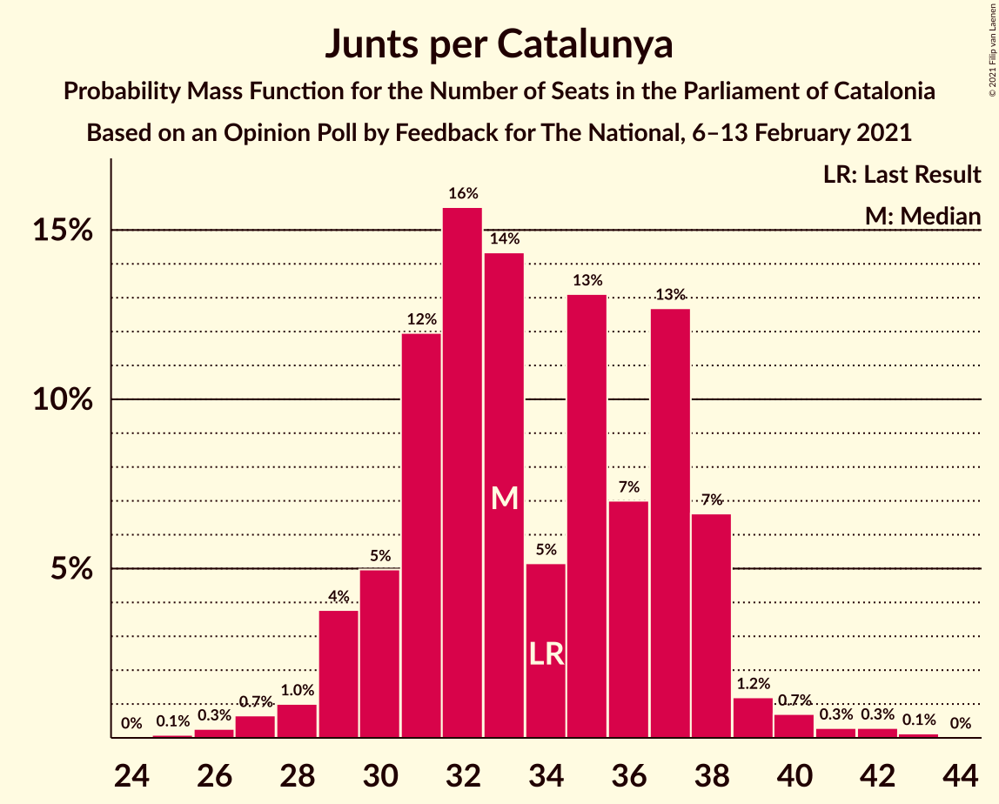
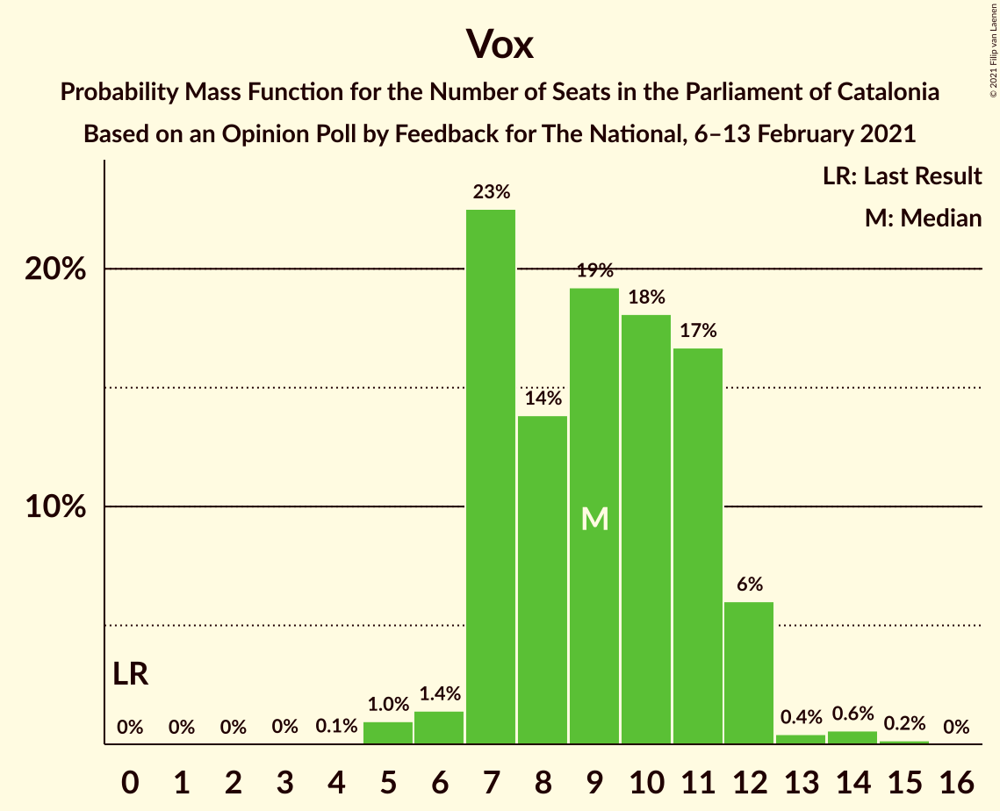
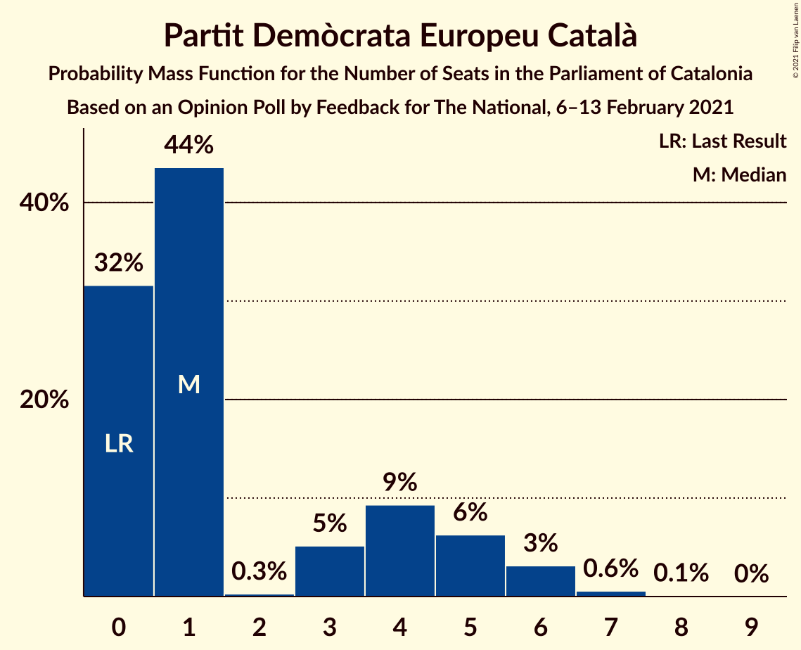
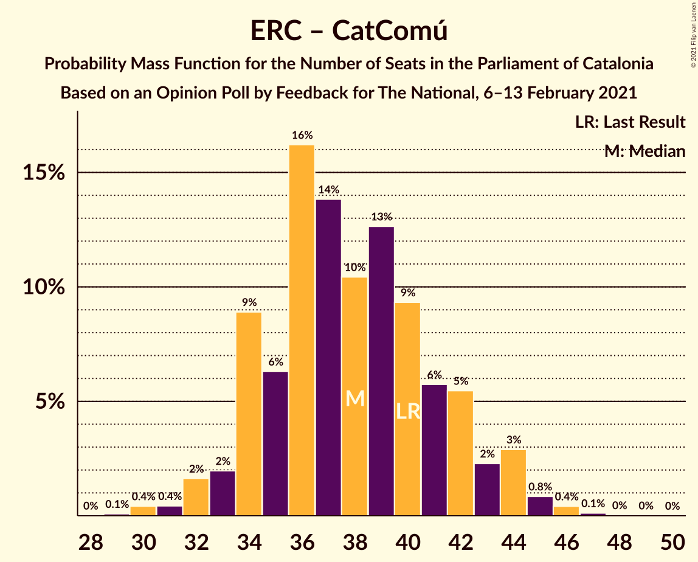

# Opinion Poll by Feedback for The National, 6–13 February 2021

<a href="#voting-intentions">Voting Intentions</a> | <a href="#seats">Seats</a> | <a href="#coalitions">Coalitions</a> | <a href="#technical-information">Technical Information</a>

## Voting Intentions

### Confidence Intervals

| Party | Last Result | Poll Result | 80% Confidence Interval | 90% Confidence Interval | 95% Confidence Interval | 99% Confidence Interval |
|:-----:|:-----------:|:-----------:|:-----------------------:|:-----------------------:|:-----------------------:|:-----------------------:|
| Junts per Catalunya | 21.7% | 20.6% | 18.6–22.8% |18.0–23.4% |17.5–23.9% |16.6–25.0% |
| Partit dels Socialistes de Catalunya (PSC-PSOE) | 13.9% | 19.9% | 18.0–22.1% |17.4–22.7% |16.9–23.3% |16.0–24.3% |
| Esquerra Republicana–Catalunya Sí | 21.4% | 18.6% | 16.7–20.7% |16.2–21.4% |15.7–21.9% |14.8–22.9% |
| Ciutadans–Partido de la Ciudadanía | 25.4% | 9.0% | 7.6–10.6% |7.3–11.1% |7.0–11.5% |6.4–12.3% |
| Catalunya en Comú–Podem | 7.5% | 7.8% | 6.6–9.4% |6.2–9.8% |6.0–10.2% |5.4–11.0% |
| Vox | 0.0% | 6.9% | 5.7–8.3% |5.4–8.8% |5.1–9.1% |4.6–9.9% |
| Candidatura d’Unitat Popular | 4.5% | 6.0% | 5.0–7.5% |4.7–7.9% |4.4–8.2% |3.9–8.9% |
| Partit Popular | 4.2% | 4.1% | 3.2–5.3% |3.0–5.7% |2.8–6.0% |2.4–6.6% |
| Partit Demòcrata Europeu Català | 0.0% | 2.8% | 2.1–3.8% |1.9–4.1% |1.7–4.4% |1.5–5.0% |

*Note:* The poll result column reflects the actual value used in the calculations. Published results may vary slightly, and in addition be rounded to fewer digits.

## Seats

### Confidence Intervals

| Party | Last Result | Median | 80% Confidence Interval | 90% Confidence Interval | 95% Confidence Interval | 99% Confidence Interval |
|:-----:|:-----------:|:------:|:-----------------------:|:-----------------------:|:-----------------------:|:-----------------------:|
| <a href="#junts-per-catalunya">Junts per Catalunya</a> | 34 | 33 | 30–37 |29–38 |29–39 |27–41 |
| <a href="#partit-dels-socialistes-de-catalunya-(psc-psoe)">Partit dels Socialistes de Catalunya (PSC-PSOE)</a> | 17 | 28 | 25–31 |24–32 |24–33 |22–35 |
| <a href="#esquerra-republicana–catalunya-sí">Esquerra Republicana–Catalunya Sí</a> | 32 | 28 | 26–32 |25–33 |24–34 |22–36 |
| <a href="#ciutadans–partido-de-la-ciudadanía">Ciutadans–Partido de la Ciudadanía</a> | 36 | 12 | 10–14 |9–14 |8–16 |8–18 |
| <a href="#catalunya-en-comú–podem">Catalunya en Comú–Podem</a> | 8 | 9 | 7–12 |7–13 |7–13 |5–14 |
| <a href="#vox">Vox</a> | 0 | 9 | 7–11 |7–12 |7–12 |5–14 |
| <a href="#candidatura-d’unitat-popular">Candidatura d’Unitat Popular</a> | 4 | 8 | 7–10 |6–11 |5–11 |4–12 |
| <a href="#partit-popular">Partit Popular</a> | 4 | 5 | 3–7 |2–7 |0–7 |0–9 |
| <a href="#partit-demòcrata-europeu-català">Partit Demòcrata Europeu Català</a> | 0 | 1 | 0–5 |0–5 |0–6 |0–7 |

### Junts per Catalunya

*For a full overview of the results for this party, see the [Junts per Catalunya](party-juntspercatalunya.html) page.*

| Number of Seats | Probability | Accumulated | Special Marks |
|:---------------:|:-----------:|:-----------:|:-------------:|
| 25 | 0.1% | 100% |  |
| 26 | 0.3% | 99.9% |  |
| 27 | 0.7% | 99.6% |  |
| 28 | 1.0% | 99.0% |  |
| 29 | 4% | 98% |  |
| 30 | 5% | 94% |  |
| 31 | 12% | 89% |  |
| 32 | 16% | 77% |  |
| 33 | 14% | 62% | Median |
| 34 | 5% | 47% | Last Result |
| 35 | 13% | 42% |  |
| 36 | 7% | 29% |  |
| 37 | 13% | 22% |  |
| 38 | 7% | 9% |  |
| 39 | 1.2% | 3% |  |
| 40 | 0.7% | 1.4% |  |
| 41 | 0.3% | 0.7% |  |
| 42 | 0.3% | 0.5% |  |
| 43 | 0.1% | 0.2% |  |
| 44 | 0% | 0% |  |

### Partit dels Socialistes de Catalunya (PSC-PSOE)

*For a full overview of the results for this party, see the [Partit dels Socialistes de Catalunya (PSC-PSOE)](party-partitdelssocialistesdecatalunyapsc-psoe.html) page.*

| Number of Seats | Probability | Accumulated | Special Marks |
|:---------------:|:-----------:|:-----------:|:-------------:|
| 17 | 0% | 100% | Last Result |
| 18 | 0% | 100% |  |
| 19 | 0% | 100% |  |
| 20 | 0% | 100% |  |
| 21 | 0.2% | 99.9% |  |
| 22 | 0.4% | 99.8% |  |
| 23 | 0.8% | 99.3% |  |
| 24 | 5% | 98.5% |  |
| 25 | 11% | 94% |  |
| 26 | 11% | 83% |  |
| 27 | 12% | 72% |  |
| 28 | 19% | 60% | Median |
| 29 | 17% | 41% |  |
| 30 | 10% | 24% |  |
| 31 | 7% | 14% |  |
| 32 | 4% | 7% |  |
| 33 | 1.3% | 3% |  |
| 34 | 1.1% | 2% |  |
| 35 | 0.3% | 0.5% |  |
| 36 | 0.1% | 0.2% |  |
| 37 | 0.1% | 0.1% |  |
| 38 | 0% | 0% |  |

### Esquerra Republicana–Catalunya Sí

*For a full overview of the results for this party, see the [Esquerra Republicana–Catalunya Sí](party-esquerrarepublicana–catalunyasí.html) page.*

| Number of Seats | Probability | Accumulated | Special Marks |
|:---------------:|:-----------:|:-----------:|:-------------:|
| 21 | 0.2% | 100% |  |
| 22 | 0.7% | 99.7% |  |
| 23 | 0.6% | 99.1% |  |
| 24 | 3% | 98% |  |
| 25 | 4% | 95% |  |
| 26 | 18% | 91% |  |
| 27 | 11% | 73% |  |
| 28 | 18% | 63% | Median |
| 29 | 12% | 45% |  |
| 30 | 10% | 33% |  |
| 31 | 13% | 23% |  |
| 32 | 4% | 11% | Last Result |
| 33 | 4% | 6% |  |
| 34 | 1.0% | 3% |  |
| 35 | 0.9% | 2% |  |
| 36 | 0.5% | 0.6% |  |
| 37 | 0.1% | 0.1% |  |
| 38 | 0% | 0.1% |  |
| 39 | 0% | 0% |  |

### Ciutadans–Partido de la Ciudadanía

*For a full overview of the results for this party, see the [Ciutadans–Partido de la Ciudadanía](party-ciutadans–partidodelaciudadanía.html) page.*

| Number of Seats | Probability | Accumulated | Special Marks |
|:---------------:|:-----------:|:-----------:|:-------------:|
| 6 | 0.1% | 100% |  |
| 7 | 0.1% | 99.9% |  |
| 8 | 3% | 99.8% |  |
| 9 | 5% | 97% |  |
| 10 | 5% | 92% |  |
| 11 | 9% | 87% |  |
| 12 | 35% | 78% | Median |
| 13 | 27% | 42% |  |
| 14 | 12% | 15% |  |
| 15 | 1.2% | 4% |  |
| 16 | 1.4% | 3% |  |
| 17 | 0.7% | 1.2% |  |
| 18 | 0.4% | 0.5% |  |
| 19 | 0.1% | 0.1% |  |
| 20 | 0% | 0% |  |
| 21 | 0% | 0% |  |
| 22 | 0% | 0% |  |
| 23 | 0% | 0% |  |
| 24 | 0% | 0% |  |
| 25 | 0% | 0% |  |
| 26 | 0% | 0% |  |
| 27 | 0% | 0% |  |
| 28 | 0% | 0% |  |
| 29 | 0% | 0% |  |
| 30 | 0% | 0% |  |
| 31 | 0% | 0% |  |
| 32 | 0% | 0% |  |
| 33 | 0% | 0% |  |
| 34 | 0% | 0% |  |
| 35 | 0% | 0% |  |
| 36 | 0% | 0% | Last Result |

### Catalunya en Comú–Podem

*For a full overview of the results for this party, see the [Catalunya en Comú–Podem](party-catalunyaencomú–podem.html) page.*

| Number of Seats | Probability | Accumulated | Special Marks |
|:---------------:|:-----------:|:-----------:|:-------------:|
| 5 | 0.8% | 100% |  |
| 6 | 1.0% | 99.1% |  |
| 7 | 8% | 98% |  |
| 8 | 28% | 90% | Last Result |
| 9 | 21% | 62% | Median |
| 10 | 10% | 40% |  |
| 11 | 19% | 30% |  |
| 12 | 5% | 11% |  |
| 13 | 5% | 7% |  |
| 14 | 2% | 2% |  |
| 15 | 0.1% | 0.3% |  |
| 16 | 0.1% | 0.1% |  |
| 17 | 0% | 0% |  |

### Vox

*For a full overview of the results for this party, see the [Vox](party-vox.html) page.*

| Number of Seats | Probability | Accumulated | Special Marks |
|:---------------:|:-----------:|:-----------:|:-------------:|
| 0 | 0% | 100% | Last Result |
| 1 | 0% | 100% |  |
| 2 | 0% | 100% |  |
| 3 | 0% | 100% |  |
| 4 | 0.1% | 100% |  |
| 5 | 1.0% | 99.9% |  |
| 6 | 1.4% | 98.9% |  |
| 7 | 23% | 98% |  |
| 8 | 14% | 75% |  |
| 9 | 19% | 61% | Median |
| 10 | 18% | 42% |  |
| 11 | 17% | 24% |  |
| 12 | 6% | 7% |  |
| 13 | 0.4% | 1.2% |  |
| 14 | 0.6% | 0.7% |  |
| 15 | 0.2% | 0.2% |  |
| 16 | 0% | 0% |  |

### Candidatura d’Unitat Popular

*For a full overview of the results for this party, see the [Candidatura d’Unitat Popular](party-candidaturad’unitatpopular.html) page.*

| Number of Seats | Probability | Accumulated | Special Marks |
|:---------------:|:-----------:|:-----------:|:-------------:|
| 3 | 0.3% | 100% |  |
| 4 | 2% | 99.7% | Last Result |
| 5 | 3% | 98% |  |
| 6 | 2% | 95% |  |
| 7 | 12% | 94% |  |
| 8 | 42% | 82% | Median |
| 9 | 29% | 39% |  |
| 10 | 4% | 10% |  |
| 11 | 6% | 7% |  |
| 12 | 0.4% | 0.8% |  |
| 13 | 0.2% | 0.3% |  |
| 14 | 0.1% | 0.1% |  |
| 15 | 0% | 0% |  |

### Partit Popular

*For a full overview of the results for this party, see the [Partit Popular](party-partitpopular.html) page.*

| Number of Seats | Probability | Accumulated | Special Marks |
|:---------------:|:-----------:|:-----------:|:-------------:|
| 0 | 3% | 100% |  |
| 1 | 0% | 97% |  |
| 2 | 5% | 97% |  |
| 3 | 29% | 92% |  |
| 4 | 7% | 63% | Last Result |
| 5 | 31% | 55% | Median |
| 6 | 11% | 24% |  |
| 7 | 12% | 13% |  |
| 8 | 0.8% | 1.4% |  |
| 9 | 0.5% | 0.6% |  |
| 10 | 0.1% | 0.1% |  |
| 11 | 0% | 0% |  |

### Partit Demòcrata Europeu Català

*For a full overview of the results for this party, see the [Partit Demòcrata Europeu Català](party-partitdemòcrataeuropeucatalà.html) page.*

| Number of Seats | Probability | Accumulated | Special Marks |
|:---------------:|:-----------:|:-----------:|:-------------:|
| 0 | 32% | 100% | Last Result |
| 1 | 44% | 68% | Median |
| 2 | 0.3% | 25% |  |
| 3 | 5% | 25% |  |
| 4 | 9% | 19% |  |
| 5 | 6% | 10% |  |
| 6 | 3% | 4% |  |
| 7 | 0.6% | 0.7% |  |
| 8 | 0.1% | 0.1% |  |
| 9 | 0% | 0% |  |

## Coalitions

### Confidence Intervals

| Coalition | Last Result | Median | Majority? | 80% Confidence Interval | 90% Confidence Interval | 95% Confidence Interval | 99% Confidence Interval |
|:---------:|:-----------:|:------:|:---------:|:-----------------------:|:-----------------------:|:-----------------------:|:-----------------------:|
| Junts per Catalunya – Esquerra Republicana–Catalunya Sí – Candidatura d’Unitat Popular – Partit Demòcrata Europeu Català | 70 | 72 | 94% | 68–76 | 67–77 | 66–78 | 64–80 |
| Junts per Catalunya – Esquerra Republicana–Catalunya Sí – Catalunya en Comú–Podem | 74 | 72 | 91% | 68–76 | 66–77 | 65–78 | 64–80 |
| Junts per Catalunya – Esquerra Republicana–Catalunya Sí – Candidatura d’Unitat Popular | 70 | 70 | 86% | 67–75 | 65–76 | 64–76 | 62–79 |
| Partit dels Socialistes de Catalunya (PSC-PSOE) – Esquerra Republicana–Catalunya Sí – Catalunya en Comú–Podem | 57 | 66 | 25% | 62–70 | 61–72 | 59–72 | 58–75 |
| Junts per Catalunya – Esquerra Republicana–Catalunya Sí – Partit Demòcrata Europeu Català | 66 | 64 | 15% | 60–68 | 59–69 | 58–70 | 56–72 |
| Junts per Catalunya – Esquerra Republicana–Catalunya Sí | 66 | 61 | 6% | 58–67 | 57–68 | 56–68 | 54–71 |
| Partit dels Socialistes de Catalunya (PSC-PSOE) – Ciutadans–Partido de la Ciudadanía – Catalunya en Comú–Podem – Partit Popular | 65 | 54 | 0% | 50–58 | 49–59 | 48–60 | 46–62 |
| Partit dels Socialistes de Catalunya (PSC-PSOE) – Ciutadans–Partido de la Ciudadanía – Vox – Partit Popular | 57 | 54 | 0% | 49–57 | 48–58 | 47–60 | 46–62 |
| Partit dels Socialistes de Catalunya (PSC-PSOE) – Ciutadans–Partido de la Ciudadanía – Partit Popular | 57 | 45 | 0% | 41–48 | 40–49 | 39–50 | 37–52 |
| Esquerra Republicana–Catalunya Sí – Catalunya en Comú–Podem | 40 | 38 | 0% | 34–42 | 34–43 | 32–44 | 30–46 |

### Junts per Catalunya – Esquerra Republicana–Catalunya Sí – Candidatura d’Unitat Popular – Partit Demòcrata Europeu Català

| Number of Seats | Probability | Accumulated | Special Marks |
|:---------------:|:-----------:|:-----------:|:-------------:|
| 61 | 0.1% | 100% |  |
| 62 | 0.1% | 99.9% |  |
| 63 | 0.2% | 99.8% |  |
| 64 | 0.6% | 99.6% |  |
| 65 | 0.9% | 99.0% |  |
| 66 | 2% | 98% |  |
| 67 | 1.5% | 96% |  |
| 68 | 5% | 94% | Majority |
| 69 | 13% | 90% |  |
| 70 | 15% | 77% | Last Result, Median |
| 71 | 7% | 61% |  |
| 72 | 14% | 54% |  |
| 73 | 12% | 40% |  |
| 74 | 6% | 28% |  |
| 75 | 6% | 22% |  |
| 76 | 7% | 16% |  |
| 77 | 5% | 10% |  |
| 78 | 2% | 5% |  |
| 79 | 1.0% | 2% |  |
| 80 | 1.0% | 1.4% |  |
| 81 | 0.3% | 0.4% |  |
| 82 | 0.1% | 0.2% |  |
| 83 | 0% | 0% |  |

### Junts per Catalunya – Esquerra Republicana–Catalunya Sí – Catalunya en Comú–Podem

| Number of Seats | Probability | Accumulated | Special Marks |
|:---------------:|:-----------:|:-----------:|:-------------:|
| 61 | 0% | 100% |  |
| 62 | 0.2% | 99.9% |  |
| 63 | 0.3% | 99.8% |  |
| 64 | 0.6% | 99.5% |  |
| 65 | 2% | 99.0% |  |
| 66 | 2% | 97% |  |
| 67 | 4% | 95% |  |
| 68 | 7% | 91% | Majority |
| 69 | 16% | 84% |  |
| 70 | 7% | 68% | Median |
| 71 | 7% | 61% |  |
| 72 | 17% | 54% |  |
| 73 | 8% | 37% |  |
| 74 | 11% | 29% | Last Result |
| 75 | 5% | 17% |  |
| 76 | 5% | 12% |  |
| 77 | 4% | 7% |  |
| 78 | 2% | 3% |  |
| 79 | 0.8% | 2% |  |
| 80 | 0.4% | 0.7% |  |
| 81 | 0.2% | 0.4% |  |
| 82 | 0.1% | 0.1% |  |
| 83 | 0% | 0.1% |  |
| 84 | 0% | 0% |  |

### Junts per Catalunya – Esquerra Republicana–Catalunya Sí – Candidatura d’Unitat Popular

| Number of Seats | Probability | Accumulated | Special Marks |
|:---------------:|:-----------:|:-----------:|:-------------:|
| 59 | 0% | 100% |  |
| 60 | 0.1% | 99.9% |  |
| 61 | 0.1% | 99.9% |  |
| 62 | 0.3% | 99.8% |  |
| 63 | 0.7% | 99.5% |  |
| 64 | 2% | 98.7% |  |
| 65 | 3% | 97% |  |
| 66 | 4% | 94% |  |
| 67 | 4% | 90% |  |
| 68 | 14% | 86% | Majority |
| 69 | 17% | 72% | Median |
| 70 | 10% | 55% | Last Result |
| 71 | 9% | 45% |  |
| 72 | 11% | 36% |  |
| 73 | 9% | 25% |  |
| 74 | 4% | 17% |  |
| 75 | 4% | 13% |  |
| 76 | 7% | 9% |  |
| 77 | 1.2% | 2% |  |
| 78 | 0.7% | 1.3% |  |
| 79 | 0.4% | 0.6% |  |
| 80 | 0.1% | 0.2% |  |
| 81 | 0.1% | 0.1% |  |
| 82 | 0% | 0% |  |

### Partit dels Socialistes de Catalunya (PSC-PSOE) – Esquerra Republicana–Catalunya Sí – Catalunya en Comú–Podem

| Number of Seats | Probability | Accumulated | Special Marks |
|:---------------:|:-----------:|:-----------:|:-------------:|
| 55 | 0% | 100% |  |
| 56 | 0.1% | 99.9% |  |
| 57 | 0.2% | 99.9% | Last Result |
| 58 | 0.7% | 99.7% |  |
| 59 | 1.5% | 99.0% |  |
| 60 | 1.5% | 97% |  |
| 61 | 3% | 96% |  |
| 62 | 11% | 94% |  |
| 63 | 6% | 83% |  |
| 64 | 12% | 77% |  |
| 65 | 12% | 65% | Median |
| 66 | 14% | 53% |  |
| 67 | 15% | 39% |  |
| 68 | 4% | 25% | Majority |
| 69 | 6% | 20% |  |
| 70 | 6% | 14% |  |
| 71 | 2% | 8% |  |
| 72 | 3% | 5% |  |
| 73 | 0.8% | 2% |  |
| 74 | 0.8% | 1.4% |  |
| 75 | 0.4% | 0.5% |  |
| 76 | 0.1% | 0.1% |  |
| 77 | 0% | 0.1% |  |
| 78 | 0% | 0% |  |

### Junts per Catalunya – Esquerra Republicana–Catalunya Sí – Partit Demòcrata Europeu Català

| Number of Seats | Probability | Accumulated | Special Marks |
|:---------------:|:-----------:|:-----------:|:-------------:|
| 53 | 0.1% | 100% |  |
| 54 | 0.1% | 99.9% |  |
| 55 | 0.1% | 99.8% |  |
| 56 | 0.4% | 99.7% |  |
| 57 | 1.2% | 99.3% |  |
| 58 | 2% | 98% |  |
| 59 | 4% | 96% |  |
| 60 | 8% | 93% |  |
| 61 | 12% | 85% |  |
| 62 | 13% | 72% | Median |
| 63 | 8% | 59% |  |
| 64 | 11% | 51% |  |
| 65 | 12% | 39% |  |
| 66 | 7% | 27% | Last Result |
| 67 | 5% | 20% |  |
| 68 | 8% | 15% | Majority |
| 69 | 2% | 7% |  |
| 70 | 2% | 4% |  |
| 71 | 1.4% | 2% |  |
| 72 | 0.5% | 0.9% |  |
| 73 | 0.2% | 0.4% |  |
| 74 | 0.1% | 0.2% |  |
| 75 | 0% | 0.1% |  |
| 76 | 0% | 0% |  |

### Junts per Catalunya – Esquerra Republicana–Catalunya Sí

| Number of Seats | Probability | Accumulated | Special Marks |
|:---------------:|:-----------:|:-----------:|:-------------:|
| 52 | 0.1% | 100% |  |
| 53 | 0.1% | 99.9% |  |
| 54 | 0.3% | 99.8% |  |
| 55 | 0.6% | 99.5% |  |
| 56 | 2% | 98.8% |  |
| 57 | 4% | 97% |  |
| 58 | 3% | 93% |  |
| 59 | 11% | 90% |  |
| 60 | 7% | 78% |  |
| 61 | 22% | 71% | Median |
| 62 | 7% | 49% |  |
| 63 | 8% | 43% |  |
| 64 | 10% | 35% |  |
| 65 | 8% | 25% |  |
| 66 | 7% | 17% | Last Result |
| 67 | 5% | 10% |  |
| 68 | 4% | 6% | Majority |
| 69 | 0.9% | 2% |  |
| 70 | 0.4% | 1.1% |  |
| 71 | 0.5% | 0.7% |  |
| 72 | 0.1% | 0.2% |  |
| 73 | 0.1% | 0.1% |  |
| 74 | 0% | 0% |  |

### Partit dels Socialistes de Catalunya (PSC-PSOE) – Ciutadans–Partido de la Ciudadanía – Catalunya en Comú–Podem – Partit Popular

| Number of Seats | Probability | Accumulated | Special Marks |
|:---------------:|:-----------:|:-----------:|:-------------:|
| 44 | 0.1% | 100% |  |
| 45 | 0.2% | 99.9% |  |
| 46 | 0.5% | 99.7% |  |
| 47 | 1.2% | 99.2% |  |
| 48 | 2% | 98% |  |
| 49 | 5% | 96% |  |
| 50 | 6% | 91% |  |
| 51 | 7% | 85% |  |
| 52 | 5% | 78% |  |
| 53 | 13% | 73% |  |
| 54 | 19% | 60% | Median |
| 55 | 15% | 41% |  |
| 56 | 5% | 26% |  |
| 57 | 5% | 21% |  |
| 58 | 7% | 16% |  |
| 59 | 5% | 9% |  |
| 60 | 2% | 4% |  |
| 61 | 1.1% | 2% |  |
| 62 | 0.4% | 0.6% |  |
| 63 | 0.2% | 0.3% |  |
| 64 | 0.1% | 0.1% |  |
| 65 | 0% | 0% | Last Result |

### Partit dels Socialistes de Catalunya (PSC-PSOE) – Ciutadans–Partido de la Ciudadanía – Vox – Partit Popular

| Number of Seats | Probability | Accumulated | Special Marks |
|:---------------:|:-----------:|:-----------:|:-------------:|
| 43 | 0% | 100% |  |
| 44 | 0.1% | 99.9% |  |
| 45 | 0.2% | 99.8% |  |
| 46 | 0.3% | 99.6% |  |
| 47 | 2% | 99.3% |  |
| 48 | 3% | 97% |  |
| 49 | 6% | 95% |  |
| 50 | 7% | 88% |  |
| 51 | 7% | 81% |  |
| 52 | 7% | 75% |  |
| 53 | 7% | 68% |  |
| 54 | 19% | 61% | Median |
| 55 | 14% | 42% |  |
| 56 | 12% | 28% |  |
| 57 | 10% | 16% | Last Result |
| 58 | 1.4% | 6% |  |
| 59 | 1.1% | 5% |  |
| 60 | 2% | 4% |  |
| 61 | 1.3% | 2% |  |
| 62 | 0.4% | 0.6% |  |
| 63 | 0.1% | 0.2% |  |
| 64 | 0.1% | 0.1% |  |
| 65 | 0% | 0% |  |

### Partit dels Socialistes de Catalunya (PSC-PSOE) – Ciutadans–Partido de la Ciudadanía – Partit Popular

| Number of Seats | Probability | Accumulated | Special Marks |
|:---------------:|:-----------:|:-----------:|:-------------:|
| 35 | 0.1% | 100% |  |
| 36 | 0.2% | 99.9% |  |
| 37 | 0.6% | 99.7% |  |
| 38 | 0.9% | 99.1% |  |
| 39 | 2% | 98% |  |
| 40 | 5% | 96% |  |
| 41 | 9% | 92% |  |
| 42 | 8% | 82% |  |
| 43 | 7% | 75% |  |
| 44 | 14% | 68% |  |
| 45 | 13% | 54% | Median |
| 46 | 14% | 41% |  |
| 47 | 16% | 26% |  |
| 48 | 2% | 11% |  |
| 49 | 4% | 9% |  |
| 50 | 2% | 4% |  |
| 51 | 2% | 2% |  |
| 52 | 0.6% | 1.0% |  |
| 53 | 0.2% | 0.4% |  |
| 54 | 0.1% | 0.1% |  |
| 55 | 0% | 0.1% |  |
| 56 | 0% | 0% |  |
| 57 | 0% | 0% | Last Result |

### Esquerra Republicana–Catalunya Sí – Catalunya en Comú–Podem

| Number of Seats | Probability | Accumulated | Special Marks |
|:---------------:|:-----------:|:-----------:|:-------------:|
| 29 | 0.1% | 100% |  |
| 30 | 0.4% | 99.9% |  |
| 31 | 0.4% | 99.5% |  |
| 32 | 2% | 99.0% |  |
| 33 | 2% | 97% |  |
| 34 | 9% | 95% |  |
| 35 | 6% | 87% |  |
| 36 | 16% | 80% |  |
| 37 | 14% | 64% | Median |
| 38 | 10% | 50% |  |
| 39 | 13% | 40% |  |
| 40 | 9% | 27% | Last Result |
| 41 | 6% | 18% |  |
| 42 | 5% | 12% |  |
| 43 | 2% | 7% |  |
| 44 | 3% | 4% |  |
| 45 | 0.8% | 1.4% |  |
| 46 | 0.4% | 0.6% |  |
| 47 | 0.1% | 0.2% |  |
| 48 | 0% | 0.1% |  |
| 49 | 0% | 0% |  |

## Technical Information

### Opinion Poll

+ **Polling firm:** Feedback
+ **Commissioner(s):** The National
+ **Fieldwork period:** 6–13 February 2021

### Calculations

+ **Sample size:** 613
+ **Simulations done:** 1,048,576
+ **Error estimate:** 2.07%

