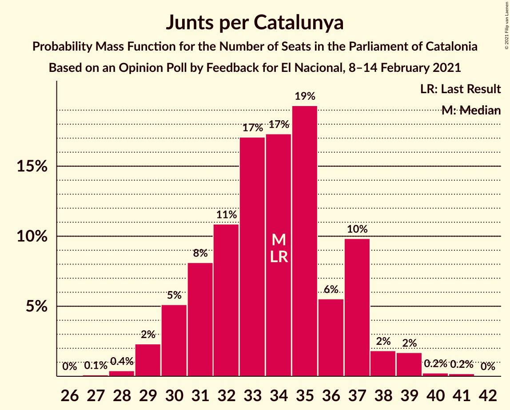
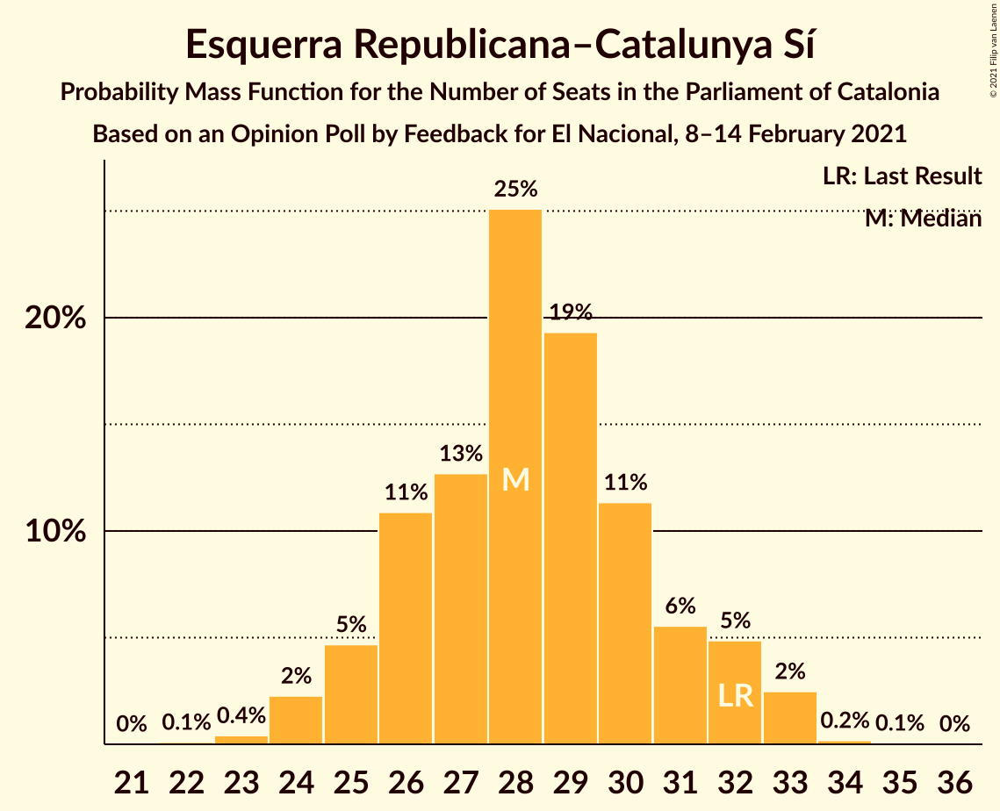
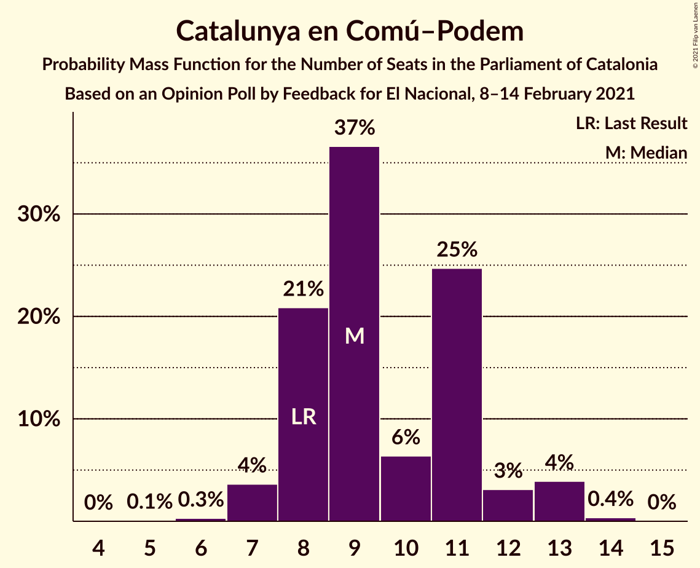
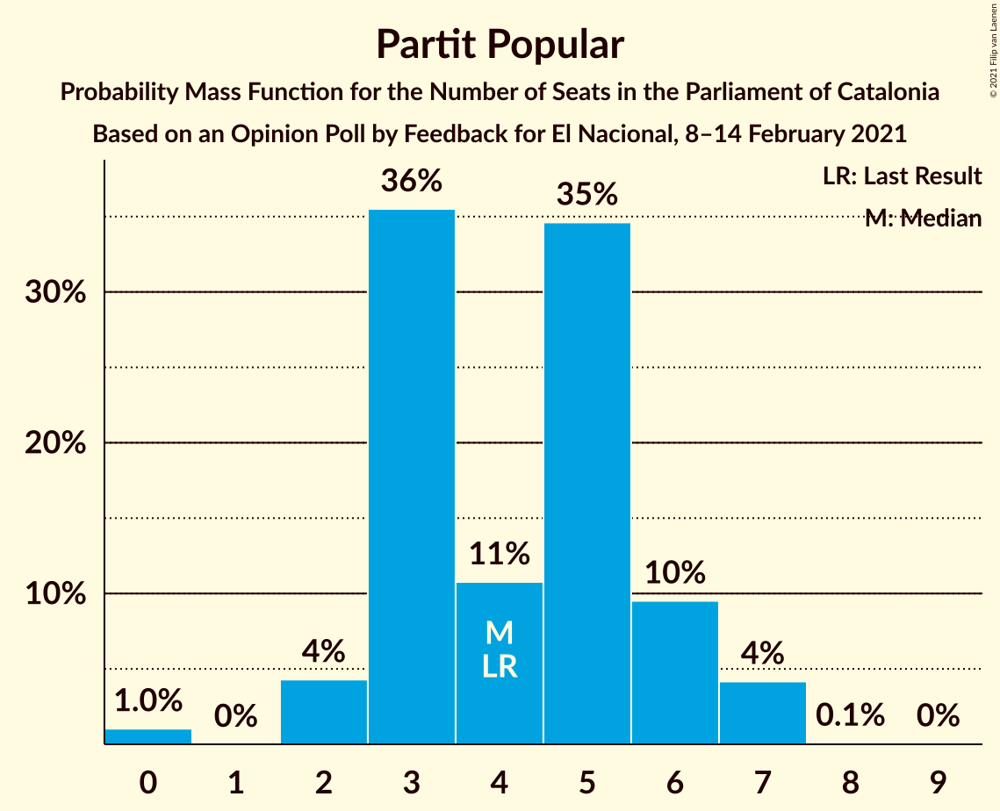
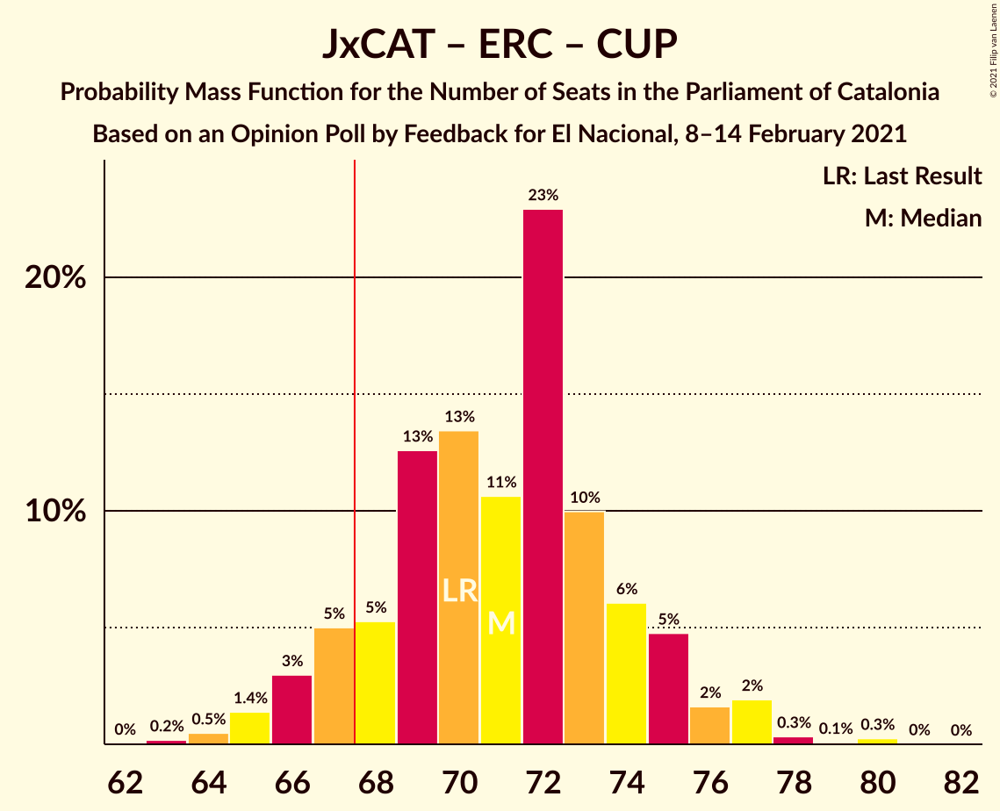
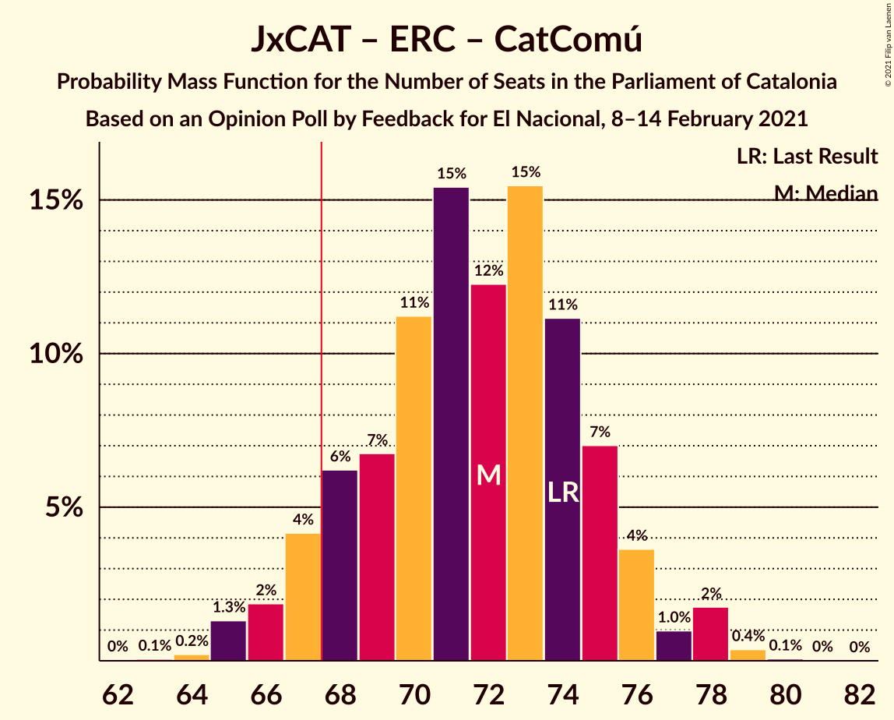

# Opinion Poll by Feedback for El Nacional, 8–14 February 2021

<a href="#voting-intentions">Voting Intentions</a> | <a href="#seats">Seats</a> | <a href="#coalitions">Coalitions</a> | <a href="#technical-information">Technical Information</a>

## Voting Intentions

### Confidence Intervals

| Party | Last Result | Poll Result | 80% Confidence Interval | 90% Confidence Interval | 95% Confidence Interval | 99% Confidence Interval |
|:-----:|:-----------:|:-----------:|:-----------------------:|:-----------------------:|:-----------------------:|:-----------------------:|
| Partit dels Socialistes de Catalunya (PSC-PSOE) | 13.9% | 21.4% | 19.8–23.2% |19.4–23.6% |19.0–24.1% |18.2–24.9% |
| Junts per Catalunya | 21.7% | 20.7% | 19.1–22.4% |18.7–22.9% |18.3–23.3% |17.6–24.2% |
| Esquerra Republicana–Catalunya Sí | 21.4% | 18.5% | 17.0–20.1% |16.6–20.6% |16.2–21.0% |15.5–21.8% |
| Catalunya en Comú–Podem | 7.5% | 8.0% | 7.0–9.3% |6.7–9.6% |6.5–9.9% |6.1–10.5% |
| Ciutadans–Partido de la Ciudadanía | 25.4% | 7.8% | 6.8–9.0% |6.6–9.4% |6.3–9.7% |5.9–10.3% |
| Vox | 0.0% | 6.9% | 6.0–8.1% |5.7–8.4% |5.5–8.7% |5.1–9.3% |
| Candidatura d’Unitat Popular | 4.5% | 6.7% | 5.8–7.9% |5.5–8.2% |5.3–8.5% |4.9–9.0% |
| Partit Popular | 4.2% | 4.0% | 3.3–4.9% |3.1–5.2% |3.0–5.4% |2.7–5.9% |
| Partit Demòcrata Europeu Català | 0.0% | 2.8% | 2.2–3.6% |2.1–3.8% |2.0–4.0% |1.7–4.5% |

*Note:* The poll result column reflects the actual value used in the calculations. Published results may vary slightly, and in addition be rounded to fewer digits.

## Seats

### Confidence Intervals

| Party | Last Result | Median | 80% Confidence Interval | 90% Confidence Interval | 95% Confidence Interval | 99% Confidence Interval |
|:-----:|:-----------:|:------:|:-----------------------:|:-----------------------:|:-----------------------:|:-----------------------:|
| <a href="#partit-dels-socialistes-de-catalunya-(psc-psoe)">Partit dels Socialistes de Catalunya (PSC-PSOE)</a> | 17 | 29 | 26–33 |26–33 |26–34 |25–36 |
| <a href="#junts-per-catalunya">Junts per Catalunya</a> | 34 | 34 | 31–37 |30–37 |29–38 |28–39 |
| <a href="#esquerra-republicana–catalunya-sí">Esquerra Republicana–Catalunya Sí</a> | 32 | 28 | 26–31 |25–32 |24–33 |23–33 |
| <a href="#catalunya-en-comú–podem">Catalunya en Comú–Podem</a> | 8 | 9 | 8–11 |8–12 |7–13 |7–13 |
| <a href="#ciutadans–partido-de-la-ciudadanía">Ciutadans–Partido de la Ciudadanía</a> | 36 | 11 | 8–12 |8–12 |8–13 |6–13 |
| <a href="#vox">Vox</a> | 0 | 9 | 7–11 |7–11 |7–12 |6–12 |
| <a href="#candidatura-d’unitat-popular">Candidatura d’Unitat Popular</a> | 4 | 9 | 8–11 |8–11 |7–11 |7–12 |
| <a href="#partit-popular">Partit Popular</a> | 4 | 4 | 3–6 |2–6 |2–7 |0–7 |
| <a href="#partit-demòcrata-europeu-català">Partit Demòcrata Europeu Català</a> | 0 | 1 | 0–4 |0–5 |0–5 |0–6 |

### Partit dels Socialistes de Catalunya (PSC-PSOE)

*For a full overview of the results for this party, see the [Partit dels Socialistes de Catalunya (PSC-PSOE)](party-partitdelssocialistesdecatalunyapsc-psoe.html) page.*

| Number of Seats | Probability | Accumulated | Special Marks |
|:---------------:|:-----------:|:-----------:|:-------------:|
| 17 | 0% | 100% | Last Result |
| 18 | 0% | 100% |  |
| 19 | 0% | 100% |  |
| 20 | 0% | 100% |  |
| 21 | 0% | 100% |  |
| 22 | 0% | 100% |  |
| 23 | 0% | 100% |  |
| 24 | 0.1% | 100% |  |
| 25 | 1.1% | 99.9% |  |
| 26 | 9% | 98.8% |  |
| 27 | 7% | 90% |  |
| 28 | 12% | 82% |  |
| 29 | 22% | 70% | Median |
| 30 | 11% | 48% |  |
| 31 | 18% | 37% |  |
| 32 | 9% | 19% |  |
| 33 | 6% | 10% |  |
| 34 | 3% | 4% |  |
| 35 | 0.9% | 1.4% |  |
| 36 | 0.5% | 0.5% |  |
| 37 | 0.1% | 0.1% |  |
| 38 | 0% | 0% |  |

### Junts per Catalunya

*For a full overview of the results for this party, see the [Junts per Catalunya](party-juntspercatalunya.html) page.*

| Number of Seats | Probability | Accumulated | Special Marks |
|:---------------:|:-----------:|:-----------:|:-------------:|
| 27 | 0.1% | 100% |  |
| 28 | 0.4% | 99.9% |  |
| 29 | 2% | 99.5% |  |
| 30 | 5% | 97% |  |
| 31 | 8% | 92% |  |
| 32 | 11% | 84% |  |
| 33 | 17% | 73% |  |
| 34 | 17% | 56% | Last Result, Median |
| 35 | 19% | 39% |  |
| 36 | 6% | 19% |  |
| 37 | 10% | 14% |  |
| 38 | 2% | 4% |  |
| 39 | 2% | 2% |  |
| 40 | 0.2% | 0.5% |  |
| 41 | 0.2% | 0.2% |  |
| 42 | 0% | 0% |  |

### Esquerra Republicana–Catalunya Sí

*For a full overview of the results for this party, see the [Esquerra Republicana–Catalunya Sí](party-esquerrarepublicana–catalunyasí.html) page.*

| Number of Seats | Probability | Accumulated | Special Marks |
|:---------------:|:-----------:|:-----------:|:-------------:|
| 22 | 0.1% | 100% |  |
| 23 | 0.4% | 99.9% |  |
| 24 | 2% | 99.5% |  |
| 25 | 5% | 97% |  |
| 26 | 11% | 93% |  |
| 27 | 13% | 82% |  |
| 28 | 25% | 69% | Median |
| 29 | 19% | 44% |  |
| 30 | 11% | 25% |  |
| 31 | 6% | 13% |  |
| 32 | 5% | 8% | Last Result |
| 33 | 2% | 3% |  |
| 34 | 0.2% | 0.3% |  |
| 35 | 0.1% | 0.1% |  |
| 36 | 0% | 0% |  |

### Catalunya en Comú–Podem

*For a full overview of the results for this party, see the [Catalunya en Comú–Podem](party-catalunyaencomú–podem.html) page.*

| Number of Seats | Probability | Accumulated | Special Marks |
|:---------------:|:-----------:|:-----------:|:-------------:|
| 5 | 0.1% | 100% |  |
| 6 | 0.3% | 99.9% |  |
| 7 | 4% | 99.6% |  |
| 8 | 21% | 96% | Last Result |
| 9 | 37% | 75% | Median |
| 10 | 6% | 39% |  |
| 11 | 25% | 32% |  |
| 12 | 3% | 7% |  |
| 13 | 4% | 4% |  |
| 14 | 0.4% | 0.4% |  |
| 15 | 0% | 0% |  |

### Ciutadans–Partido de la Ciudadanía

*For a full overview of the results for this party, see the [Ciutadans–Partido de la Ciudadanía](party-ciutadans–partidodelaciudadanía.html) page.*

| Number of Seats | Probability | Accumulated | Special Marks |
|:---------------:|:-----------:|:-----------:|:-------------:|
| 6 | 0.5% | 100% |  |
| 7 | 0.4% | 99.5% |  |
| 8 | 28% | 99.0% |  |
| 9 | 6% | 72% |  |
| 10 | 7% | 66% |  |
| 11 | 21% | 59% | Median |
| 12 | 33% | 37% |  |
| 13 | 4% | 4% |  |
| 14 | 0.4% | 0.4% |  |
| 15 | 0% | 0% |  |
| 16 | 0% | 0% |  |
| 17 | 0% | 0% |  |
| 18 | 0% | 0% |  |
| 19 | 0% | 0% |  |
| 20 | 0% | 0% |  |
| 21 | 0% | 0% |  |
| 22 | 0% | 0% |  |
| 23 | 0% | 0% |  |
| 24 | 0% | 0% |  |
| 25 | 0% | 0% |  |
| 26 | 0% | 0% |  |
| 27 | 0% | 0% |  |
| 28 | 0% | 0% |  |
| 29 | 0% | 0% |  |
| 30 | 0% | 0% |  |
| 31 | 0% | 0% |  |
| 32 | 0% | 0% |  |
| 33 | 0% | 0% |  |
| 34 | 0% | 0% |  |
| 35 | 0% | 0% |  |
| 36 | 0% | 0% | Last Result |

### Vox

*For a full overview of the results for this party, see the [Vox](party-vox.html) page.*

| Number of Seats | Probability | Accumulated | Special Marks |
|:---------------:|:-----------:|:-----------:|:-------------:|
| 0 | 0% | 100% | Last Result |
| 1 | 0% | 100% |  |
| 2 | 0% | 100% |  |
| 3 | 0% | 100% |  |
| 4 | 0% | 100% |  |
| 5 | 0.1% | 100% |  |
| 6 | 1.1% | 99.9% |  |
| 7 | 14% | 98.8% |  |
| 8 | 27% | 85% |  |
| 9 | 25% | 58% | Median |
| 10 | 17% | 32% |  |
| 11 | 12% | 16% |  |
| 12 | 3% | 4% |  |
| 13 | 0.2% | 0.4% |  |
| 14 | 0.2% | 0.2% |  |
| 15 | 0% | 0% |  |

### Candidatura d’Unitat Popular

*For a full overview of the results for this party, see the [Candidatura d’Unitat Popular](party-candidaturad’unitatpopular.html) page.*

| Number of Seats | Probability | Accumulated | Special Marks |
|:---------------:|:-----------:|:-----------:|:-------------:|
| 4 | 0% | 100% | Last Result |
| 5 | 0% | 100% |  |
| 6 | 0.3% | 100% |  |
| 7 | 4% | 99.7% |  |
| 8 | 36% | 96% |  |
| 9 | 41% | 60% | Median |
| 10 | 7% | 20% |  |
| 11 | 12% | 13% |  |
| 12 | 0.3% | 0.8% |  |
| 13 | 0.3% | 0.5% |  |
| 14 | 0.1% | 0.2% |  |
| 15 | 0.1% | 0.1% |  |
| 16 | 0% | 0% |  |

### Partit Popular

*For a full overview of the results for this party, see the [Partit Popular](party-partitpopular.html) page.*

| Number of Seats | Probability | Accumulated | Special Marks |
|:---------------:|:-----------:|:-----------:|:-------------:|
| 0 | 1.0% | 100% |  |
| 1 | 0% | 99.0% |  |
| 2 | 4% | 99.0% |  |
| 3 | 36% | 95% |  |
| 4 | 11% | 59% | Last Result, Median |
| 5 | 35% | 48% |  |
| 6 | 10% | 14% |  |
| 7 | 4% | 4% |  |
| 8 | 0.1% | 0.1% |  |
| 9 | 0% | 0% |  |

### Partit Demòcrata Europeu Català

*For a full overview of the results for this party, see the [Partit Demòcrata Europeu Català](party-partitdemòcrataeuropeucatalà.html) page.*

| Number of Seats | Probability | Accumulated | Special Marks |
|:---------------:|:-----------:|:-----------:|:-------------:|
| 0 | 31% | 100% | Last Result |
| 1 | 47% | 69% | Median |
| 2 | 2% | 22% |  |
| 3 | 4% | 20% |  |
| 4 | 11% | 16% |  |
| 5 | 4% | 5% |  |
| 6 | 1.1% | 1.1% |  |
| 7 | 0.1% | 0.1% |  |
| 8 | 0% | 0% |  |

## Coalitions

### Confidence Intervals

| Coalition | Last Result | Median | Majority? | 80% Confidence Interval | 90% Confidence Interval | 95% Confidence Interval | 99% Confidence Interval |
|:---------:|:-----------:|:------:|:---------:|:-----------------------:|:-----------------------:|:-----------------------:|:-----------------------:|
| Junts per Catalunya – Esquerra Republicana–Catalunya Sí – Candidatura d’Unitat Popular – Partit Demòcrata Europeu Català | 70 | 73 | 95% | 69–76 | 67–77 | 67–77 | 65–79 |
| Junts per Catalunya – Esquerra Republicana–Catalunya Sí – Candidatura d’Unitat Popular | 70 | 71 | 90% | 67–74 | 66–75 | 66–77 | 64–78 |
| Junts per Catalunya – Esquerra Republicana–Catalunya Sí – Catalunya en Comú–Podem | 74 | 72 | 92% | 68–75 | 67–76 | 66–77 | 65–78 |
| Partit dels Socialistes de Catalunya (PSC-PSOE) – Esquerra Republicana–Catalunya Sí – Catalunya en Comú–Podem | 57 | 68 | 51% | 64–71 | 63–72 | 62–73 | 60–75 |
| Junts per Catalunya – Esquerra Republicana–Catalunya Sí – Partit Demòcrata Europeu Català | 66 | 63 | 7% | 60–67 | 59–68 | 58–69 | 56–70 |
| Junts per Catalunya – Esquerra Republicana–Catalunya Sí | 66 | 62 | 3% | 59–65 | 58–67 | 57–68 | 55–69 |
| Partit dels Socialistes de Catalunya (PSC-PSOE) – Catalunya en Comú–Podem – Ciutadans–Partido de la Ciudadanía – Partit Popular | 65 | 54 | 0% | 50–57 | 49–58 | 48–59 | 47–60 |
| Partit dels Socialistes de Catalunya (PSC-PSOE) – Ciutadans–Partido de la Ciudadanía – Vox – Partit Popular | 57 | 53 | 0% | 50–57 | 49–58 | 48–59 | 46–60 |
| Partit dels Socialistes de Catalunya (PSC-PSOE) – Ciutadans–Partido de la Ciudadanía – Partit Popular | 57 | 44 | 0% | 41–47 | 40–48 | 40–49 | 38–51 |
| Esquerra Republicana–Catalunya Sí – Catalunya en Comú–Podem | 40 | 38 | 0% | 35–41 | 34–42 | 33–43 | 32–44 |

### Junts per Catalunya – Esquerra Republicana–Catalunya Sí – Candidatura d’Unitat Popular – Partit Demòcrata Europeu Català

| Number of Seats | Probability | Accumulated | Special Marks |
|:---------------:|:-----------:|:-----------:|:-------------:|
| 64 | 0.1% | 100% |  |
| 65 | 0.4% | 99.9% |  |
| 66 | 1.0% | 99.5% |  |
| 67 | 4% | 98% |  |
| 68 | 3% | 95% | Majority |
| 69 | 5% | 92% |  |
| 70 | 12% | 87% | Last Result |
| 71 | 9% | 75% |  |
| 72 | 15% | 66% | Median |
| 73 | 22% | 51% |  |
| 74 | 7% | 29% |  |
| 75 | 9% | 22% |  |
| 76 | 6% | 12% |  |
| 77 | 4% | 6% |  |
| 78 | 2% | 2% |  |
| 79 | 0.5% | 0.9% |  |
| 80 | 0.3% | 0.4% |  |
| 81 | 0.1% | 0.1% |  |
| 82 | 0% | 0% |  |

### Junts per Catalunya – Esquerra Republicana–Catalunya Sí – Candidatura d’Unitat Popular

| Number of Seats | Probability | Accumulated | Special Marks |
|:---------------:|:-----------:|:-----------:|:-------------:|
| 62 | 0% | 100% |  |
| 63 | 0.2% | 99.9% |  |
| 64 | 0.5% | 99.7% |  |
| 65 | 1.4% | 99.3% |  |
| 66 | 3% | 98% |  |
| 67 | 5% | 95% |  |
| 68 | 5% | 90% | Majority |
| 69 | 13% | 85% |  |
| 70 | 13% | 72% | Last Result |
| 71 | 11% | 59% | Median |
| 72 | 23% | 48% |  |
| 73 | 10% | 25% |  |
| 74 | 6% | 15% |  |
| 75 | 5% | 9% |  |
| 76 | 2% | 4% |  |
| 77 | 2% | 3% |  |
| 78 | 0.3% | 0.7% |  |
| 79 | 0.1% | 0.4% |  |
| 80 | 0.3% | 0.3% |  |
| 81 | 0% | 0% |  |

### Junts per Catalunya – Esquerra Republicana–Catalunya Sí – Catalunya en Comú–Podem

| Number of Seats | Probability | Accumulated | Special Marks |
|:---------------:|:-----------:|:-----------:|:-------------:|
| 63 | 0.1% | 100% |  |
| 64 | 0.2% | 99.9% |  |
| 65 | 1.3% | 99.7% |  |
| 66 | 2% | 98% |  |
| 67 | 4% | 97% |  |
| 68 | 6% | 92% | Majority |
| 69 | 7% | 86% |  |
| 70 | 11% | 79% |  |
| 71 | 15% | 68% | Median |
| 72 | 12% | 53% |  |
| 73 | 15% | 40% |  |
| 74 | 11% | 25% | Last Result |
| 75 | 7% | 14% |  |
| 76 | 4% | 7% |  |
| 77 | 1.0% | 3% |  |
| 78 | 2% | 2% |  |
| 79 | 0.4% | 0.5% |  |
| 80 | 0.1% | 0.1% |  |
| 81 | 0% | 0% |  |

### Partit dels Socialistes de Catalunya (PSC-PSOE) – Esquerra Republicana–Catalunya Sí – Catalunya en Comú–Podem

| Number of Seats | Probability | Accumulated | Special Marks |
|:---------------:|:-----------:|:-----------:|:-------------:|
| 57 | 0% | 100% | Last Result |
| 58 | 0% | 100% |  |
| 59 | 0.2% | 100% |  |
| 60 | 0.4% | 99.8% |  |
| 61 | 1.3% | 99.4% |  |
| 62 | 2% | 98% |  |
| 63 | 3% | 96% |  |
| 64 | 6% | 93% |  |
| 65 | 12% | 87% |  |
| 66 | 11% | 75% | Median |
| 67 | 12% | 63% |  |
| 68 | 14% | 51% | Majority |
| 69 | 15% | 37% |  |
| 70 | 8% | 22% |  |
| 71 | 8% | 14% |  |
| 72 | 4% | 6% |  |
| 73 | 1.2% | 3% |  |
| 74 | 0.8% | 1.4% |  |
| 75 | 0.3% | 0.6% |  |
| 76 | 0.2% | 0.3% |  |
| 77 | 0.1% | 0.1% |  |
| 78 | 0% | 0% |  |

### Junts per Catalunya – Esquerra Republicana–Catalunya Sí – Partit Demòcrata Europeu Català

| Number of Seats | Probability | Accumulated | Special Marks |
|:---------------:|:-----------:|:-----------:|:-------------:|
| 55 | 0.1% | 100% |  |
| 56 | 0.5% | 99.9% |  |
| 57 | 0.5% | 99.4% |  |
| 58 | 3% | 98.9% |  |
| 59 | 4% | 96% |  |
| 60 | 4% | 92% |  |
| 61 | 13% | 88% |  |
| 62 | 13% | 75% |  |
| 63 | 12% | 62% | Median |
| 64 | 13% | 50% |  |
| 65 | 14% | 37% |  |
| 66 | 9% | 23% | Last Result |
| 67 | 7% | 14% |  |
| 68 | 3% | 7% | Majority |
| 69 | 3% | 4% |  |
| 70 | 0.5% | 0.8% |  |
| 71 | 0.1% | 0.2% |  |
| 72 | 0.1% | 0.1% |  |
| 73 | 0% | 0% |  |

### Junts per Catalunya – Esquerra Republicana–Catalunya Sí

| Number of Seats | Probability | Accumulated | Special Marks |
|:---------------:|:-----------:|:-----------:|:-------------:|
| 53 | 0% | 100% |  |
| 54 | 0.2% | 99.9% |  |
| 55 | 0.3% | 99.8% |  |
| 56 | 1.4% | 99.5% |  |
| 57 | 3% | 98% |  |
| 58 | 5% | 95% |  |
| 59 | 5% | 91% |  |
| 60 | 12% | 85% |  |
| 61 | 14% | 73% |  |
| 62 | 16% | 59% | Median |
| 63 | 11% | 44% |  |
| 64 | 16% | 32% |  |
| 65 | 7% | 16% |  |
| 66 | 3% | 9% | Last Result |
| 67 | 3% | 6% |  |
| 68 | 0.9% | 3% | Majority |
| 69 | 2% | 2% |  |
| 70 | 0.2% | 0.2% |  |
| 71 | 0% | 0.1% |  |
| 72 | 0% | 0% |  |

### Partit dels Socialistes de Catalunya (PSC-PSOE) – Catalunya en Comú–Podem – Ciutadans–Partido de la Ciudadanía – Partit Popular

| Number of Seats | Probability | Accumulated | Special Marks |
|:---------------:|:-----------:|:-----------:|:-------------:|
| 45 | 0.1% | 100% |  |
| 46 | 0.2% | 99.9% |  |
| 47 | 0.5% | 99.7% |  |
| 48 | 2% | 99.2% |  |
| 49 | 3% | 97% |  |
| 50 | 5% | 95% |  |
| 51 | 8% | 90% |  |
| 52 | 12% | 82% |  |
| 53 | 19% | 70% | Median |
| 54 | 17% | 51% |  |
| 55 | 13% | 34% |  |
| 56 | 5% | 21% |  |
| 57 | 7% | 16% |  |
| 58 | 4% | 9% |  |
| 59 | 3% | 4% |  |
| 60 | 1.0% | 1.5% |  |
| 61 | 0.4% | 0.5% |  |
| 62 | 0.1% | 0.1% |  |
| 63 | 0% | 0% |  |
| 64 | 0% | 0% |  |
| 65 | 0% | 0% | Last Result |

### Partit dels Socialistes de Catalunya (PSC-PSOE) – Ciutadans–Partido de la Ciudadanía – Vox – Partit Popular

| Number of Seats | Probability | Accumulated | Special Marks |
|:---------------:|:-----------:|:-----------:|:-------------:|
| 45 | 0.1% | 100% |  |
| 46 | 0.4% | 99.8% |  |
| 47 | 0.8% | 99.5% |  |
| 48 | 2% | 98.7% |  |
| 49 | 4% | 97% |  |
| 50 | 4% | 93% |  |
| 51 | 16% | 89% |  |
| 52 | 11% | 72% |  |
| 53 | 22% | 62% | Median |
| 54 | 16% | 40% |  |
| 55 | 9% | 24% |  |
| 56 | 5% | 15% |  |
| 57 | 5% | 10% | Last Result |
| 58 | 3% | 6% |  |
| 59 | 1.2% | 3% |  |
| 60 | 0.9% | 1.3% |  |
| 61 | 0.4% | 0.4% |  |
| 62 | 0.1% | 0.1% |  |
| 63 | 0% | 0% |  |

### Partit dels Socialistes de Catalunya (PSC-PSOE) – Ciutadans–Partido de la Ciudadanía – Partit Popular

| Number of Seats | Probability | Accumulated | Special Marks |
|:---------------:|:-----------:|:-----------:|:-------------:|
| 36 | 0.1% | 100% |  |
| 37 | 0.2% | 99.9% |  |
| 38 | 0.4% | 99.7% |  |
| 39 | 1.4% | 99.3% |  |
| 40 | 3% | 98% |  |
| 41 | 9% | 95% |  |
| 42 | 7% | 86% |  |
| 43 | 21% | 79% |  |
| 44 | 17% | 59% | Median |
| 45 | 12% | 41% |  |
| 46 | 14% | 29% |  |
| 47 | 7% | 15% |  |
| 48 | 3% | 8% |  |
| 49 | 2% | 5% |  |
| 50 | 1.4% | 2% |  |
| 51 | 0.7% | 0.8% |  |
| 52 | 0.1% | 0.1% |  |
| 53 | 0% | 0% |  |
| 54 | 0% | 0% |  |
| 55 | 0% | 0% |  |
| 56 | 0% | 0% |  |
| 57 | 0% | 0% | Last Result |

### Esquerra Republicana–Catalunya Sí – Catalunya en Comú–Podem

| Number of Seats | Probability | Accumulated | Special Marks |
|:---------------:|:-----------:|:-----------:|:-------------:|
| 30 | 0% | 100% |  |
| 31 | 0.2% | 99.9% |  |
| 32 | 0.7% | 99.7% |  |
| 33 | 2% | 99.0% |  |
| 34 | 4% | 97% |  |
| 35 | 9% | 93% |  |
| 36 | 9% | 85% |  |
| 37 | 22% | 76% | Median |
| 38 | 20% | 54% |  |
| 39 | 11% | 34% |  |
| 40 | 9% | 23% | Last Result |
| 41 | 8% | 14% |  |
| 42 | 3% | 6% |  |
| 43 | 2% | 3% |  |
| 44 | 1.0% | 1.2% |  |
| 45 | 0.1% | 0.1% |  |
| 46 | 0% | 0.1% |  |
| 47 | 0% | 0% |  |

## Technical Information

### Opinion Poll

+ **Polling firm:** Feedback
+ **Commissioner(s):** El Nacional
+ **Fieldwork period:** 8–14 February 2021

### Calculations

+ **Sample size:** 995
+ **Simulations done:** 1,048,576
+ **Error estimate:** 1.71%

