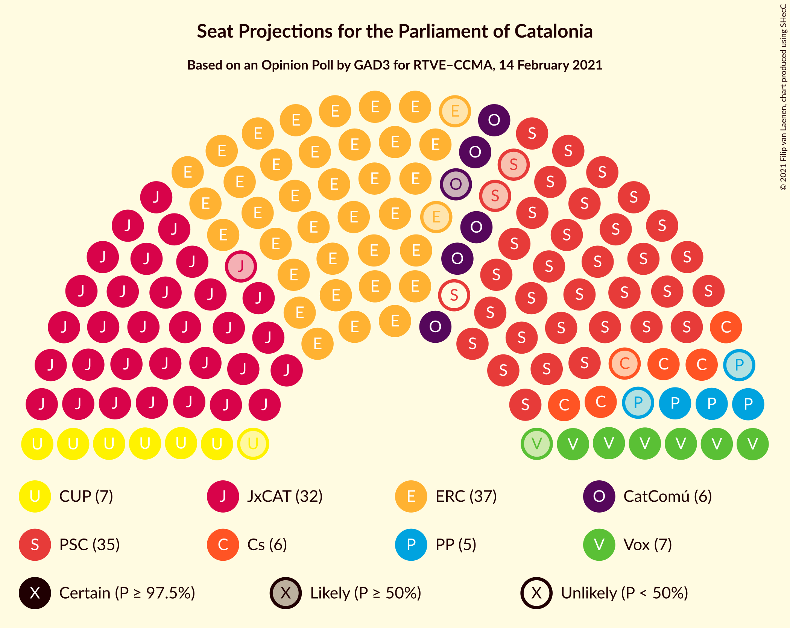
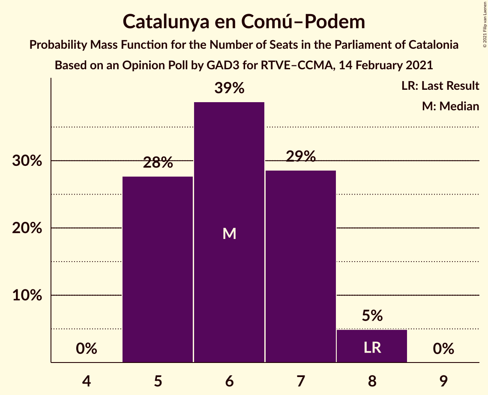
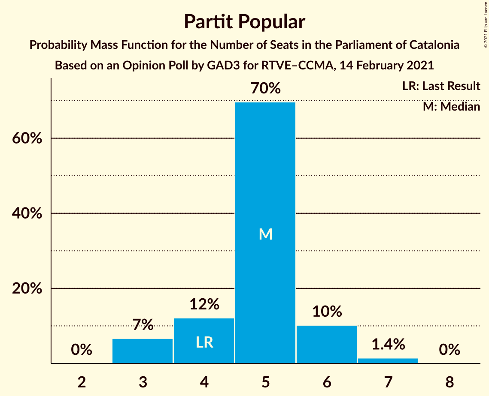
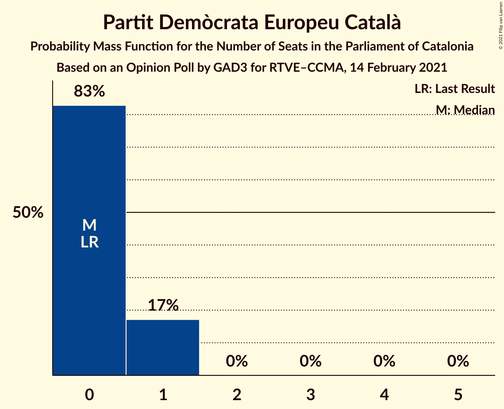
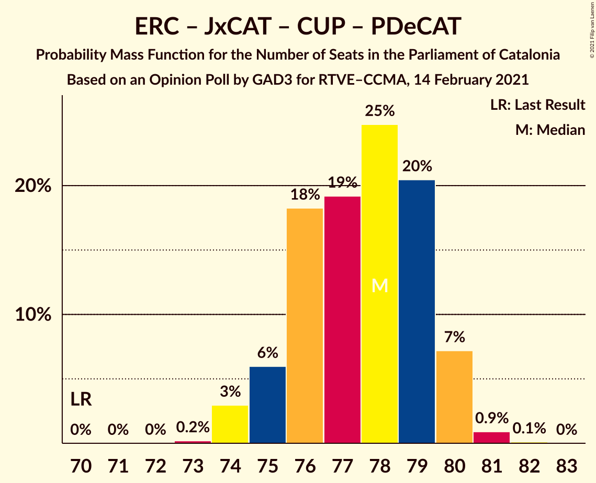
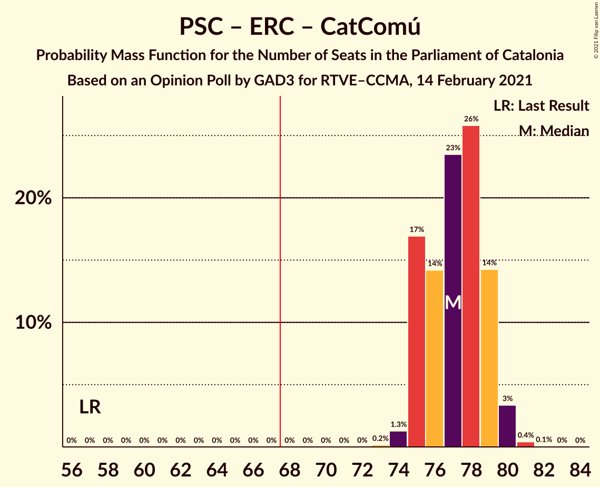
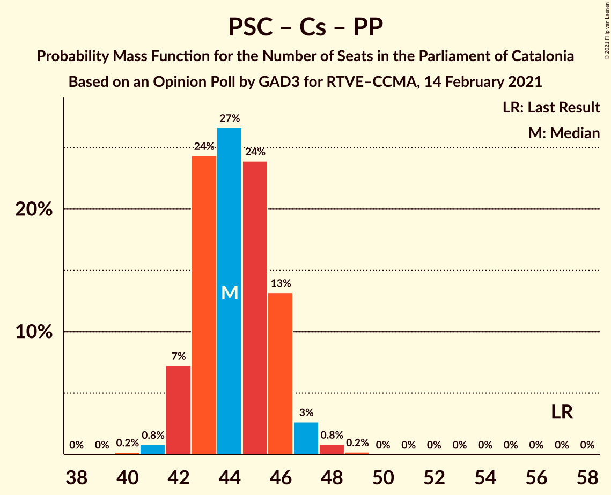

# Opinion Poll by GAD3 for RTVE–CCMA, 14 February 2021

<a href="#voting-intentions">Voting Intentions</a> | <a href="#seats">Seats</a> | <a href="#coalitions">Coalitions</a> | <a href="#technical-information">Technical Information</a>

## Voting Intentions

### Confidence Intervals

| Party | Last Result | Poll Result | 80% Confidence Interval | 90% Confidence Interval | 95% Confidence Interval | 99% Confidence Interval |
|:-----:|:-----------:|:-----------:|:-----------------------:|:-----------------------:|:-----------------------:|:-----------------------:|
| Partit dels Socialistes de Catalunya (PSC-PSOE) | 13.9% | 24.5% | 23.7–25.4% |23.4–25.6% |23.2–25.8% |22.8–26.2% |
| Esquerra Republicana–Catalunya Sí | 21.4% | 24.3% | 23.5–25.2% |23.2–25.4% |23.0–25.6% |22.6–26.0% |
| Junts per Catalunya | 21.7% | 20.5% | 19.7–21.3% |19.5–21.5% |19.3–21.7% |18.9–22.1% |
| Catalunya en Comú–Podem | 7.5% | 6.0% | 5.5–6.5% |5.4–6.6% |5.3–6.8% |5.1–7.0% |
| Vox | 0.0% | 5.9% | 5.5–6.4% |5.3–6.5% |5.2–6.7% |5.0–6.9% |
| Candidatura d’Unitat Popular | 4.5% | 5.4% | 5.0–5.9% |4.9–6.0% |4.8–6.1% |4.6–6.4% |
| Ciutadans–Partido de la Ciudadanía | 25.4% | 5.3% | 4.9–5.8% |4.8–5.9% |4.6–6.0% |4.5–6.2% |
| Partit Popular | 4.2% | 4.6% | 4.2–5.1% |4.1–5.2% |4.0–5.3% |3.8–5.5% |
| Partit Demòcrata Europeu Català | 0.0% | 2.5% | 2.2–2.8% |2.1–2.9% |2.1–3.0% |1.9–3.2% |

*Note:* The poll result column reflects the actual value used in the calculations. Published results may vary slightly, and in addition be rounded to fewer digits.

## Seats

### Confidence Intervals

| Party | Last Result | Median | 80% Confidence Interval | 90% Confidence Interval | 95% Confidence Interval | 99% Confidence Interval |
|:-----:|:-----------:|:------:|:-----------------------:|:-----------------------:|:-----------------------:|:-----------------------:|
| <a href="#partit-dels-socialistes-de-catalunya-(psc-psoe)">Partit dels Socialistes de Catalunya (PSC-PSOE)</a> | 17 | 33 | 32–35 |32–35 |32–35 |31–37 |
| <a href="#esquerra-republicana–catalunya-sí">Esquerra Republicana–Catalunya Sí</a> | 32 | 37 | 36–39 |35–39 |35–40 |35–41 |
| <a href="#junts-per-catalunya">Junts per Catalunya</a> | 34 | 33 | 31–35 |31–35 |31–35 |31–36 |
| <a href="#catalunya-en-comú–podem">Catalunya en Comú–Podem</a> | 8 | 6 | 5–7 |5–7 |5–8 |5–8 |
| <a href="#vox">Vox</a> | 0 | 7 | 7–8 |7–8 |6–9 |6–9 |
| <a href="#candidatura-d’unitat-popular">Candidatura d’Unitat Popular</a> | 4 | 7 | 7–8 |7–8 |6–8 |5–8 |
| <a href="#ciutadans–partido-de-la-ciudadanía">Ciutadans–Partido de la Ciudadanía</a> | 36 | 6 | 5–6 |5–7 |5–7 |5–7 |
| <a href="#partit-popular">Partit Popular</a> | 4 | 5 | 4–6 |3–6 |3–7 |3–7 |
| <a href="#partit-demòcrata-europeu-català">Partit Demòcrata Europeu Català</a> | 0 | 0 | 0–1 |0–1 |0–1 |0–1 |

### Partit dels Socialistes de Catalunya (PSC-PSOE)

*For a full overview of the results for this party, see the [Partit dels Socialistes de Catalunya (PSC-PSOE)](party-partitdelssocialistesdecatalunyapsc-psoe.html) page.*

| Number of Seats | Probability | Accumulated | Special Marks |
|:---------------:|:-----------:|:-----------:|:-------------:|
| 17 | 0% | 100% | Last Result |
| 18 | 0% | 100% |  |
| 19 | 0% | 100% |  |
| 20 | 0% | 100% |  |
| 21 | 0% | 100% |  |
| 22 | 0% | 100% |  |
| 23 | 0% | 100% |  |
| 24 | 0% | 100% |  |
| 25 | 0% | 100% |  |
| 26 | 0% | 100% |  |
| 27 | 0% | 100% |  |
| 28 | 0% | 100% |  |
| 29 | 0% | 100% |  |
| 30 | 0% | 100% |  |
| 31 | 1.3% | 100% |  |
| 32 | 43% | 98.6% |  |
| 33 | 18% | 56% | Median |
| 34 | 21% | 38% |  |
| 35 | 16% | 18% |  |
| 36 | 0.9% | 2% |  |
| 37 | 1.0% | 1.0% |  |
| 38 | 0% | 0% |  |

### Esquerra Republicana–Catalunya Sí

*For a full overview of the results for this party, see the [Esquerra Republicana–Catalunya Sí](party-esquerrarepublicana–catalunyasí.html) page.*

| Number of Seats | Probability | Accumulated | Special Marks |
|:---------------:|:-----------:|:-----------:|:-------------:|
| 32 | 0% | 100% | Last Result |
| 33 | 0% | 100% |  |
| 34 | 0% | 100% |  |
| 35 | 7% | 100% |  |
| 36 | 9% | 93% |  |
| 37 | 57% | 85% | Median |
| 38 | 11% | 28% |  |
| 39 | 13% | 16% |  |
| 40 | 2% | 3% |  |
| 41 | 0.7% | 0.7% |  |
| 42 | 0% | 0% |  |

### Junts per Catalunya

*For a full overview of the results for this party, see the [Junts per Catalunya](party-juntspercatalunya.html) page.*

| Number of Seats | Probability | Accumulated | Special Marks |
|:---------------:|:-----------:|:-----------:|:-------------:|
| 30 | 0.1% | 100% |  |
| 31 | 17% | 99.9% |  |
| 32 | 25% | 83% |  |
| 33 | 16% | 58% | Median |
| 34 | 7% | 42% | Last Result |
| 35 | 33% | 34% |  |
| 36 | 1.0% | 1.0% |  |
| 37 | 0% | 0% |  |

### Catalunya en Comú–Podem

*For a full overview of the results for this party, see the [Catalunya en Comú–Podem](party-catalunyaencomú–podem.html) page.*

| Number of Seats | Probability | Accumulated | Special Marks |
|:---------------:|:-----------:|:-----------:|:-------------:|
| 5 | 29% | 100% |  |
| 6 | 43% | 71% | Median |
| 7 | 24% | 28% |  |
| 8 | 3% | 3% | Last Result |
| 9 | 0% | 0% |  |

### Vox

*For a full overview of the results for this party, see the [Vox](party-vox.html) page.*

| Number of Seats | Probability | Accumulated | Special Marks |
|:---------------:|:-----------:|:-----------:|:-------------:|
| 0 | 0% | 100% | Last Result |
| 1 | 0% | 100% |  |
| 2 | 0% | 100% |  |
| 3 | 0% | 100% |  |
| 4 | 0% | 100% |  |
| 5 | 0.1% | 100% |  |
| 6 | 3% | 99.9% |  |
| 7 | 85% | 96% | Median |
| 8 | 7% | 11% |  |
| 9 | 4% | 4% |  |
| 10 | 0% | 0% |  |

### Candidatura d’Unitat Popular

*For a full overview of the results for this party, see the [Candidatura d’Unitat Popular](party-candidaturad’unitatpopular.html) page.*

| Number of Seats | Probability | Accumulated | Special Marks |
|:---------------:|:-----------:|:-----------:|:-------------:|
| 4 | 0.1% | 100% | Last Result |
| 5 | 1.4% | 99.9% |  |
| 6 | 2% | 98.5% |  |
| 7 | 58% | 96% | Median |
| 8 | 38% | 38% |  |
| 9 | 0% | 0% |  |

### Ciutadans–Partido de la Ciudadanía

*For a full overview of the results for this party, see the [Ciutadans–Partido de la Ciudadanía](party-ciutadans–partidodelaciudadanía.html) page.*

| Number of Seats | Probability | Accumulated | Special Marks |
|:---------------:|:-----------:|:-----------:|:-------------:|
| 5 | 27% | 100% |  |
| 6 | 68% | 73% | Median |
| 7 | 5% | 5% |  |
| 8 | 0.3% | 0.3% |  |
| 9 | 0% | 0% |  |
| 10 | 0% | 0% |  |
| 11 | 0% | 0% |  |
| 12 | 0% | 0% |  |
| 13 | 0% | 0% |  |
| 14 | 0% | 0% |  |
| 15 | 0% | 0% |  |
| 16 | 0% | 0% |  |
| 17 | 0% | 0% |  |
| 18 | 0% | 0% |  |
| 19 | 0% | 0% |  |
| 20 | 0% | 0% |  |
| 21 | 0% | 0% |  |
| 22 | 0% | 0% |  |
| 23 | 0% | 0% |  |
| 24 | 0% | 0% |  |
| 25 | 0% | 0% |  |
| 26 | 0% | 0% |  |
| 27 | 0% | 0% |  |
| 28 | 0% | 0% |  |
| 29 | 0% | 0% |  |
| 30 | 0% | 0% |  |
| 31 | 0% | 0% |  |
| 32 | 0% | 0% |  |
| 33 | 0% | 0% |  |
| 34 | 0% | 0% |  |
| 35 | 0% | 0% |  |
| 36 | 0% | 0% | Last Result |

### Partit Popular

*For a full overview of the results for this party, see the [Partit Popular](party-partitpopular.html) page.*

| Number of Seats | Probability | Accumulated | Special Marks |
|:---------------:|:-----------:|:-----------:|:-------------:|
| 3 | 8% | 100% |  |
| 4 | 4% | 92% | Last Result |
| 5 | 74% | 88% | Median |
| 6 | 11% | 15% |  |
| 7 | 3% | 3% |  |
| 8 | 0% | 0% |  |

### Partit Demòcrata Europeu Català

*For a full overview of the results for this party, see the [Partit Demòcrata Europeu Català](party-partitdemòcrataeuropeucatalà.html) page.*

| Number of Seats | Probability | Accumulated | Special Marks |
|:---------------:|:-----------:|:-----------:|:-------------:|
| 0 | 81% | 100% | Last Result, Median |
| 1 | 19% | 19% |  |
| 2 | 0% | 0% |  |

## Coalitions

### Confidence Intervals

| Coalition | Last Result | Median | Majority? | 80% Confidence Interval | 90% Confidence Interval | 95% Confidence Interval | 99% Confidence Interval |
|:---------:|:-----------:|:------:|:---------:|:-----------------------:|:-----------------------:|:-----------------------:|:-----------------------:|
| Esquerra Republicana–Catalunya Sí – Junts per Catalunya – Candidatura d’Unitat Popular – Partit Demòcrata Europeu Català | 70 | 78 | 100% | 76–79 | 75–79 | 74–80 | 74–81 |
| Partit dels Socialistes de Catalunya (PSC-PSOE) – Esquerra Republicana–Catalunya Sí – Catalunya en Comú–Podem | 57 | 76 | 100% | 75–78 | 75–79 | 75–79 | 74–80 |
| Esquerra Republicana–Catalunya Sí – Junts per Catalunya – Candidatura d’Unitat Popular | 70 | 78 | 100% | 76–79 | 75–79 | 74–79 | 74–80 |
| Esquerra Republicana–Catalunya Sí – Junts per Catalunya – Catalunya en Comú–Podem | 74 | 77 | 100% | 74–78 | 73–78 | 73–79 | 73–80 |
| Esquerra Republicana–Catalunya Sí – Junts per Catalunya | 66 | 71 | 96% | 68–72 | 68–72 | 67–72 | 67–73 |
| Esquerra Republicana–Catalunya Sí – Junts per Catalunya – Partit Demòcrata Europeu Català | 66 | 71 | 96% | 69–72 | 68–72 | 67–72 | 67–73 |
| Partit dels Socialistes de Catalunya (PSC-PSOE) – Vox – Ciutadans–Partido de la Ciudadanía – Partit Popular | 57 | 51 | 0% | 49–53 | 49–54 | 49–54 | 48–55 |
| Partit dels Socialistes de Catalunya (PSC-PSOE) – Catalunya en Comú–Podem – Ciutadans–Partido de la Ciudadanía – Partit Popular | 65 | 50 | 0% | 49–52 | 49–52 | 48–53 | 47–54 |
| Partit dels Socialistes de Catalunya (PSC-PSOE) – Ciutadans–Partido de la Ciudadanía – Partit Popular | 57 | 44 | 0% | 42–46 | 42–46 | 42–47 | 41–48 |
| Esquerra Republicana–Catalunya Sí – Catalunya en Comú–Podem | 40 | 43 | 0% | 42–44 | 42–46 | 42–46 | 41–47 |

### Esquerra Republicana–Catalunya Sí – Junts per Catalunya – Candidatura d’Unitat Popular – Partit Demòcrata Europeu Català

| Number of Seats | Probability | Accumulated | Special Marks |
|:---------------:|:-----------:|:-----------:|:-------------:|
| 70 | 0% | 100% | Last Result |
| 71 | 0% | 100% |  |
| 72 | 0% | 100% |  |
| 73 | 0.1% | 100% |  |
| 74 | 4% | 99.9% |  |
| 75 | 2% | 96% |  |
| 76 | 8% | 94% |  |
| 77 | 19% | 86% | Median |
| 78 | 19% | 67% |  |
| 79 | 45% | 48% |  |
| 80 | 2% | 3% |  |
| 81 | 0.3% | 0.6% |  |
| 82 | 0.2% | 0.2% |  |
| 83 | 0% | 0% |  |

### Partit dels Socialistes de Catalunya (PSC-PSOE) – Esquerra Republicana–Catalunya Sí – Catalunya en Comú–Podem

| Number of Seats | Probability | Accumulated | Special Marks |
|:---------------:|:-----------:|:-----------:|:-------------:|
| 57 | 0% | 100% | Last Result |
| 58 | 0% | 100% |  |
| 59 | 0% | 100% |  |
| 60 | 0% | 100% |  |
| 61 | 0% | 100% |  |
| 62 | 0% | 100% |  |
| 63 | 0% | 100% |  |
| 64 | 0% | 100% |  |
| 65 | 0% | 100% |  |
| 66 | 0% | 100% |  |
| 67 | 0% | 100% |  |
| 68 | 0% | 100% | Majority |
| 69 | 0% | 100% |  |
| 70 | 0% | 100% |  |
| 71 | 0% | 100% |  |
| 72 | 0% | 100% |  |
| 73 | 0% | 100% |  |
| 74 | 0.8% | 100% |  |
| 75 | 34% | 99.1% |  |
| 76 | 20% | 65% | Median |
| 77 | 21% | 45% |  |
| 78 | 17% | 24% |  |
| 79 | 5% | 7% |  |
| 80 | 2% | 2% |  |
| 81 | 0% | 0.1% |  |
| 82 | 0% | 0% |  |

### Esquerra Republicana–Catalunya Sí – Junts per Catalunya – Candidatura d’Unitat Popular

| Number of Seats | Probability | Accumulated | Special Marks |
|:---------------:|:-----------:|:-----------:|:-------------:|
| 70 | 0% | 100% | Last Result |
| 71 | 0% | 100% |  |
| 72 | 0% | 100% |  |
| 73 | 0.2% | 100% |  |
| 74 | 4% | 99.8% |  |
| 75 | 3% | 96% |  |
| 76 | 20% | 93% |  |
| 77 | 9% | 73% | Median |
| 78 | 16% | 64% |  |
| 79 | 46% | 48% |  |
| 80 | 2% | 2% |  |
| 81 | 0.3% | 0.3% |  |
| 82 | 0% | 0% |  |

### Esquerra Republicana–Catalunya Sí – Junts per Catalunya – Catalunya en Comú–Podem

| Number of Seats | Probability | Accumulated | Special Marks |
|:---------------:|:-----------:|:-----------:|:-------------:|
| 72 | 0.4% | 100% |  |
| 73 | 9% | 99.6% |  |
| 74 | 5% | 90% | Last Result |
| 75 | 13% | 86% |  |
| 76 | 20% | 72% | Median |
| 77 | 10% | 52% |  |
| 78 | 39% | 42% |  |
| 79 | 2% | 3% |  |
| 80 | 0.9% | 0.9% |  |
| 81 | 0% | 0% |  |

### Esquerra Republicana–Catalunya Sí – Junts per Catalunya

| Number of Seats | Probability | Accumulated | Special Marks |
|:---------------:|:-----------:|:-----------:|:-------------:|
| 66 | 0.1% | 100% | Last Result |
| 67 | 4% | 99.9% |  |
| 68 | 13% | 96% | Majority |
| 69 | 11% | 84% |  |
| 70 | 14% | 73% | Median |
| 71 | 29% | 59% |  |
| 72 | 28% | 30% |  |
| 73 | 2% | 2% |  |
| 74 | 0.1% | 0.1% |  |
| 75 | 0% | 0% |  |

### Esquerra Republicana–Catalunya Sí – Junts per Catalunya – Partit Demòcrata Europeu Català

| Number of Seats | Probability | Accumulated | Special Marks |
|:---------------:|:-----------:|:-----------:|:-------------:|
| 66 | 0.1% | 100% | Last Result |
| 67 | 3% | 99.9% |  |
| 68 | 3% | 96% | Majority |
| 69 | 14% | 93% |  |
| 70 | 18% | 79% | Median |
| 71 | 30% | 61% |  |
| 72 | 29% | 31% |  |
| 73 | 2% | 2% |  |
| 74 | 0.4% | 0.4% |  |
| 75 | 0% | 0% |  |

### Partit dels Socialistes de Catalunya (PSC-PSOE) – Vox – Ciutadans–Partido de la Ciudadanía – Partit Popular

| Number of Seats | Probability | Accumulated | Special Marks |
|:---------------:|:-----------:|:-----------:|:-------------:|
| 47 | 0.3% | 100% |  |
| 48 | 0.4% | 99.7% |  |
| 49 | 11% | 99.3% |  |
| 50 | 34% | 88% |  |
| 51 | 19% | 54% | Median |
| 52 | 17% | 35% |  |
| 53 | 13% | 19% |  |
| 54 | 5% | 5% |  |
| 55 | 0.3% | 0.7% |  |
| 56 | 0.4% | 0.4% |  |
| 57 | 0% | 0% | Last Result |

### Partit dels Socialistes de Catalunya (PSC-PSOE) – Catalunya en Comú–Podem – Ciutadans–Partido de la Ciudadanía – Partit Popular

| Number of Seats | Probability | Accumulated | Special Marks |
|:---------------:|:-----------:|:-----------:|:-------------:|
| 46 | 0.3% | 100% |  |
| 47 | 0.3% | 99.7% |  |
| 48 | 2% | 99.4% |  |
| 49 | 45% | 97% |  |
| 50 | 26% | 52% | Median |
| 51 | 15% | 26% |  |
| 52 | 6% | 11% |  |
| 53 | 3% | 5% |  |
| 54 | 2% | 2% |  |
| 55 | 0% | 0% |  |
| 56 | 0% | 0% |  |
| 57 | 0% | 0% |  |
| 58 | 0% | 0% |  |
| 59 | 0% | 0% |  |
| 60 | 0% | 0% |  |
| 61 | 0% | 0% |  |
| 62 | 0% | 0% |  |
| 63 | 0% | 0% |  |
| 64 | 0% | 0% |  |
| 65 | 0% | 0% | Last Result |

### Partit dels Socialistes de Catalunya (PSC-PSOE) – Ciutadans–Partido de la Ciudadanía – Partit Popular

| Number of Seats | Probability | Accumulated | Special Marks |
|:---------------:|:-----------:|:-----------:|:-------------:|
| 40 | 0.3% | 100% |  |
| 41 | 0.4% | 99.7% |  |
| 42 | 11% | 99.4% |  |
| 43 | 33% | 88% |  |
| 44 | 26% | 55% | Median |
| 45 | 15% | 30% |  |
| 46 | 12% | 14% |  |
| 47 | 2% | 3% |  |
| 48 | 0.2% | 0.5% |  |
| 49 | 0.4% | 0.4% |  |
| 50 | 0% | 0% |  |
| 51 | 0% | 0% |  |
| 52 | 0% | 0% |  |
| 53 | 0% | 0% |  |
| 54 | 0% | 0% |  |
| 55 | 0% | 0% |  |
| 56 | 0% | 0% |  |
| 57 | 0% | 0% | Last Result |

### Esquerra Republicana–Catalunya Sí – Catalunya en Comú–Podem

| Number of Seats | Probability | Accumulated | Special Marks |
|:---------------:|:-----------:|:-----------:|:-------------:|
| 40 | 0.2% | 100% | Last Result |
| 41 | 0.6% | 99.8% |  |
| 42 | 20% | 99.2% |  |
| 43 | 48% | 80% | Median |
| 44 | 24% | 32% |  |
| 45 | 2% | 8% |  |
| 46 | 5% | 7% |  |
| 47 | 1.4% | 2% |  |
| 48 | 0.5% | 0.5% |  |
| 49 | 0% | 0% |  |

## Technical Information

### Opinion Poll

+ **Polling firm:** GAD3
+ **Commissioner(s):** RTVE–CCMA
+ **Fieldwork period:** 14 February 2021

### Calculations

+ **Sample size:** 4250
+ **Simulations done:** 131,072
+ **Error estimate:** 1.25%

