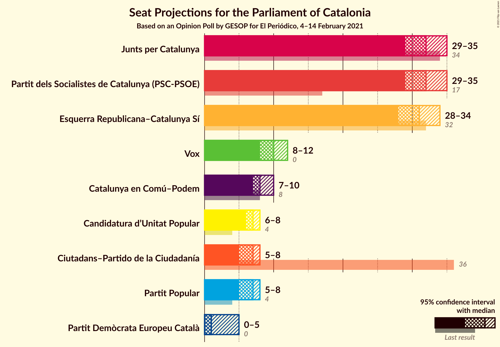
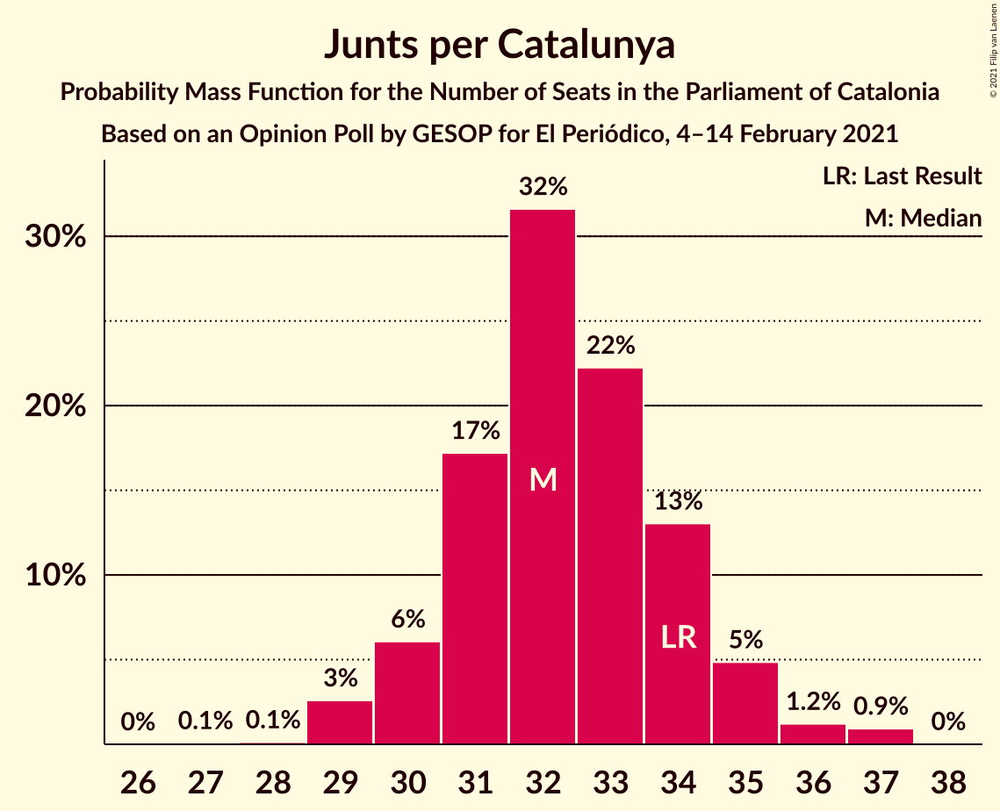
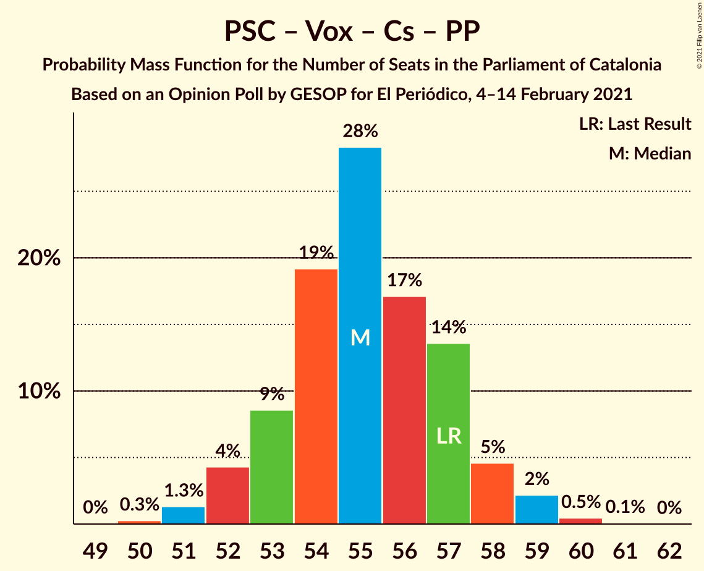
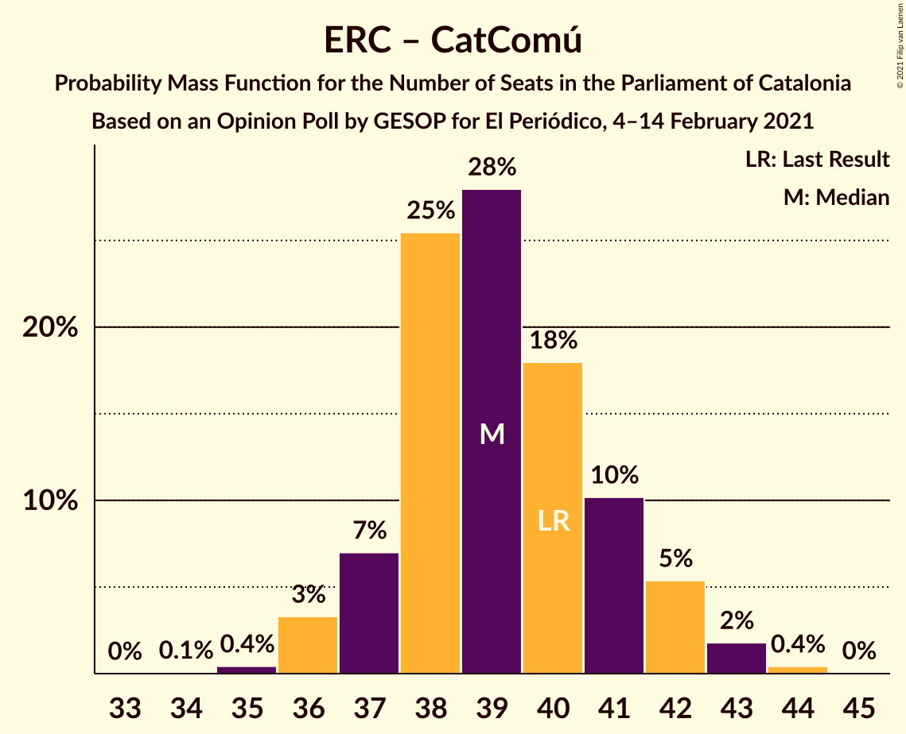

# Opinion Poll by GESOP for El Periódico, 4–14 February 2021

<a href="#voting-intentions">Voting Intentions</a> | <a href="#seats">Seats</a> | <a href="#coalitions">Coalitions</a> | <a href="#technical-information">Technical Information</a>

## Voting Intentions

### Confidence Intervals

| Party | Last Result | Poll Result | 80% Confidence Interval | 90% Confidence Interval | 95% Confidence Interval | 99% Confidence Interval |
|:-----:|:-----------:|:-----------:|:-----------------------:|:-----------------------:|:-----------------------:|:-----------------------:|
| Partit dels Socialistes de Catalunya (PSC-PSOE) | 13.9% | 22.7% | 21.6–23.9% |21.3–24.2% |21.0–24.5% |20.5–25.0% |
| Esquerra Republicana–Catalunya Sí | 21.4% | 20.4% | 19.4–21.5% |19.1–21.9% |18.8–22.1% |18.3–22.7% |
| Junts per Catalunya | 21.7% | 20.0% | 18.9–21.1% |18.6–21.4% |18.4–21.7% |17.9–22.2% |
| Vox | 0.0% | 7.5% | 6.8–8.2% |6.6–8.5% |6.5–8.7% |6.2–9.0% |
| Catalunya en Comú–Podem | 7.5% | 7.3% | 6.7–8.1% |6.5–8.3% |6.3–8.5% |6.0–8.8% |
| Ciutadans–Partido de la Ciudadanía | 25.4% | 6.0% | 5.4–6.7% |5.2–6.9% |5.1–7.1% |4.8–7.4% |
| Candidatura d’Unitat Popular | 4.5% | 5.5% | 5.0–6.2% |4.8–6.4% |4.6–6.5% |4.4–6.9% |
| Partit Popular | 4.2% | 5.5% | 5.0–6.2% |4.8–6.4% |4.6–6.5% |4.4–6.9% |
| Partit Demòcrata Europeu Català | 0.0% | 2.9% | 2.5–3.4% |2.4–3.6% |2.3–3.7% |2.1–3.9% |

*Note:* The poll result column reflects the actual value used in the calculations. Published results may vary slightly, and in addition be rounded to fewer digits.

## Seats

### Confidence Intervals

| Party | Last Result | Median | 80% Confidence Interval | 90% Confidence Interval | 95% Confidence Interval | 99% Confidence Interval |
|:-----:|:-----------:|:------:|:-----------------------:|:-----------------------:|:-----------------------:|:-----------------------:|
| <a href="#partit-dels-socialistes-de-catalunya-(psc-psoe)">Partit dels Socialistes de Catalunya (PSC-PSOE)</a> | 17 | 32 | 31–34 |30–34 |29–34 |27–34 |
| <a href="#esquerra-republicana–catalunya-sí">Esquerra Republicana–Catalunya Sí</a> | 32 | 31 | 28–33 |28–34 |28–34 |28–35 |
| <a href="#junts-per-catalunya">Junts per Catalunya</a> | 34 | 32 | 31–33 |30–35 |29–35 |29–36 |
| <a href="#vox">Vox</a> | 0 | 10 | 8–12 |8–12 |8–12 |7–12 |
| <a href="#catalunya-en-comú–podem">Catalunya en Comú–Podem</a> | 8 | 8 | 7–9 |7–9 |7–10 |7–11 |
| <a href="#ciutadans–partido-de-la-ciudadanía">Ciutadans–Partido de la Ciudadanía</a> | 36 | 7 | 6–8 |6–8 |5–8 |5–8 |
| <a href="#candidatura-d’unitat-popular">Candidatura d’Unitat Popular</a> | 4 | 7 | 6–8 |6–8 |6–8 |5–9 |
| <a href="#partit-popular">Partit Popular</a> | 4 | 7 | 6–7 |5–7 |5–8 |5–9 |
| <a href="#partit-demòcrata-europeu-català">Partit Demòcrata Europeu Català</a> | 0 | 1 | 0–1 |0–5 |0–5 |0–5 |

### Partit dels Socialistes de Catalunya (PSC-PSOE)

*For a full overview of the results for this party, see the [Partit dels Socialistes de Catalunya (PSC-PSOE)](party-partitdelssocialistesdecatalunyapsc-psoe.html) page.*

| Number of Seats | Probability | Accumulated | Special Marks |
|:---------------:|:-----------:|:-----------:|:-------------:|
| 17 | 0% | 100% | Last Result |
| 18 | 0% | 100% |  |
| 19 | 0% | 100% |  |
| 20 | 0% | 100% |  |
| 21 | 0% | 100% |  |
| 22 | 0% | 100% |  |
| 23 | 0% | 100% |  |
| 24 | 0% | 100% |  |
| 25 | 0% | 100% |  |
| 26 | 0% | 100% |  |
| 27 | 0.5% | 100% |  |
| 28 | 0.9% | 99.5% |  |
| 29 | 2% | 98.6% |  |
| 30 | 2% | 97% |  |
| 31 | 5% | 94% |  |
| 32 | 40% | 89% | Median |
| 33 | 29% | 49% |  |
| 34 | 20% | 20% |  |
| 35 | 0.3% | 0.3% |  |
| 36 | 0% | 0% |  |

### Esquerra Republicana–Catalunya Sí

*For a full overview of the results for this party, see the [Esquerra Republicana–Catalunya Sí](party-esquerrarepublicana–catalunyasí.html) page.*

| Number of Seats | Probability | Accumulated | Special Marks |
|:---------------:|:-----------:|:-----------:|:-------------:|
| 27 | 0.3% | 100% |  |
| 28 | 11% | 99.7% |  |
| 29 | 7% | 89% |  |
| 30 | 29% | 82% |  |
| 31 | 21% | 52% | Median |
| 32 | 21% | 31% | Last Result |
| 33 | 5% | 11% |  |
| 34 | 5% | 6% |  |
| 35 | 0.5% | 0.6% |  |
| 36 | 0.1% | 0.1% |  |
| 37 | 0% | 0% |  |

### Junts per Catalunya

*For a full overview of the results for this party, see the [Junts per Catalunya](party-juntspercatalunya.html) page.*

| Number of Seats | Probability | Accumulated | Special Marks |
|:---------------:|:-----------:|:-----------:|:-------------:|
| 28 | 0.2% | 100% |  |
| 29 | 4% | 99.7% |  |
| 30 | 5% | 96% |  |
| 31 | 18% | 91% |  |
| 32 | 37% | 72% | Median |
| 33 | 27% | 35% |  |
| 34 | 2% | 8% | Last Result |
| 35 | 5% | 6% |  |
| 36 | 0.9% | 1.2% |  |
| 37 | 0.3% | 0.3% |  |
| 38 | 0% | 0% |  |

### Vox

*For a full overview of the results for this party, see the [Vox](party-vox.html) page.*

| Number of Seats | Probability | Accumulated | Special Marks |
|:---------------:|:-----------:|:-----------:|:-------------:|
| 0 | 0% | 100% | Last Result |
| 1 | 0% | 100% |  |
| 2 | 0% | 100% |  |
| 3 | 0% | 100% |  |
| 4 | 0% | 100% |  |
| 5 | 0% | 100% |  |
| 6 | 0% | 100% |  |
| 7 | 0.9% | 100% |  |
| 8 | 13% | 99.1% |  |
| 9 | 36% | 86% |  |
| 10 | 32% | 51% | Median |
| 11 | 9% | 19% |  |
| 12 | 10% | 10% |  |
| 13 | 0.1% | 0.2% |  |
| 14 | 0.1% | 0.1% |  |
| 15 | 0% | 0% |  |

### Catalunya en Comú–Podem

*For a full overview of the results for this party, see the [Catalunya en Comú–Podem](party-catalunyaencomú–podem.html) page.*

| Number of Seats | Probability | Accumulated | Special Marks |
|:---------------:|:-----------:|:-----------:|:-------------:|
| 5 | 0.1% | 100% |  |
| 6 | 0.3% | 99.9% |  |
| 7 | 19% | 99.6% |  |
| 8 | 55% | 81% | Last Result, Median |
| 9 | 23% | 26% |  |
| 10 | 1.2% | 3% |  |
| 11 | 1.4% | 1.4% |  |
| 12 | 0% | 0% |  |

### Ciutadans–Partido de la Ciudadanía

*For a full overview of the results for this party, see the [Ciutadans–Partido de la Ciudadanía](party-ciutadans–partidodelaciudadanía.html) page.*

| Number of Seats | Probability | Accumulated | Special Marks |
|:---------------:|:-----------:|:-----------:|:-------------:|
| 5 | 4% | 100% |  |
| 6 | 43% | 96% |  |
| 7 | 9% | 53% | Median |
| 8 | 43% | 44% |  |
| 9 | 0.3% | 0.4% |  |
| 10 | 0.1% | 0.1% |  |
| 11 | 0% | 0% |  |
| 12 | 0% | 0% |  |
| 13 | 0% | 0% |  |
| 14 | 0% | 0% |  |
| 15 | 0% | 0% |  |
| 16 | 0% | 0% |  |
| 17 | 0% | 0% |  |
| 18 | 0% | 0% |  |
| 19 | 0% | 0% |  |
| 20 | 0% | 0% |  |
| 21 | 0% | 0% |  |
| 22 | 0% | 0% |  |
| 23 | 0% | 0% |  |
| 24 | 0% | 0% |  |
| 25 | 0% | 0% |  |
| 26 | 0% | 0% |  |
| 27 | 0% | 0% |  |
| 28 | 0% | 0% |  |
| 29 | 0% | 0% |  |
| 30 | 0% | 0% |  |
| 31 | 0% | 0% |  |
| 32 | 0% | 0% |  |
| 33 | 0% | 0% |  |
| 34 | 0% | 0% |  |
| 35 | 0% | 0% |  |
| 36 | 0% | 0% | Last Result |

### Candidatura d’Unitat Popular

*For a full overview of the results for this party, see the [Candidatura d’Unitat Popular](party-candidaturad’unitatpopular.html) page.*

| Number of Seats | Probability | Accumulated | Special Marks |
|:---------------:|:-----------:|:-----------:|:-------------:|
| 4 | 0.2% | 100% | Last Result |
| 5 | 1.1% | 99.8% |  |
| 6 | 10% | 98.7% |  |
| 7 | 41% | 89% | Median |
| 8 | 47% | 48% |  |
| 9 | 0.7% | 0.7% |  |
| 10 | 0% | 0% |  |

### Partit Popular

*For a full overview of the results for this party, see the [Partit Popular](party-partitpopular.html) page.*

| Number of Seats | Probability | Accumulated | Special Marks |
|:---------------:|:-----------:|:-----------:|:-------------:|
| 4 | 0% | 100% | Last Result |
| 5 | 5% | 99.9% |  |
| 6 | 27% | 95% |  |
| 7 | 64% | 68% | Median |
| 8 | 3% | 4% |  |
| 9 | 2% | 2% |  |
| 10 | 0% | 0% |  |

### Partit Demòcrata Europeu Català

*For a full overview of the results for this party, see the [Partit Demòcrata Europeu Català](party-partitdemòcrataeuropeucatalà.html) page.*

| Number of Seats | Probability | Accumulated | Special Marks |
|:---------------:|:-----------:|:-----------:|:-------------:|
| 0 | 34% | 100% | Last Result |
| 1 | 57% | 66% | Median |
| 2 | 0.1% | 9% |  |
| 3 | 0.2% | 9% |  |
| 4 | 4% | 9% |  |
| 5 | 5% | 5% |  |
| 6 | 0.1% | 0.1% |  |
| 7 | 0% | 0% |  |

## Coalitions

### Confidence Intervals

| Coalition | Last Result | Median | Majority? | 80% Confidence Interval | 90% Confidence Interval | 95% Confidence Interval | 99% Confidence Interval |
|:---------:|:-----------:|:------:|:---------:|:-----------------------:|:-----------------------:|:-----------------------:|:-----------------------:|
| Esquerra Republicana–Catalunya Sí – Junts per Catalunya – Catalunya en Comú–Podem | 74 | 71 | 98% | 68–73 | 68–74 | 68–75 | 66–76 |
| Esquerra Republicana–Catalunya Sí – Junts per Catalunya – Candidatura d’Unitat Popular – Partit Demòcrata Europeu Català | 70 | 71 | 99.5% | 69–73 | 69–74 | 69–74 | 67–75 |
| Partit dels Socialistes de Catalunya (PSC-PSOE) – Esquerra Republicana–Catalunya Sí – Catalunya en Comú–Podem | 57 | 71 | 98% | 70–74 | 69–74 | 68–74 | 67–75 |
| Esquerra Republicana–Catalunya Sí – Junts per Catalunya – Candidatura d’Unitat Popular | 70 | 70 | 97% | 68–72 | 68–73 | 67–74 | 66–74 |
| Esquerra Republicana–Catalunya Sí – Junts per Catalunya – Partit Demòcrata Europeu Català | 66 | 64 | 3% | 61–66 | 61–67 | 61–68 | 60–68 |
| Esquerra Republicana–Catalunya Sí – Junts per Catalunya | 66 | 63 | 0.3% | 60–65 | 60–66 | 59–66 | 58–67 |
| Partit dels Socialistes de Catalunya (PSC-PSOE) – Vox – Ciutadans–Partido de la Ciudadanía – Partit Popular | 57 | 56 | 0% | 54–58 | 53–58 | 52–58 | 51–59 |
| Partit dels Socialistes de Catalunya (PSC-PSOE) – Catalunya en Comú–Podem – Ciutadans–Partido de la Ciudadanía – Partit Popular | 65 | 54 | 0% | 52–57 | 51–57 | 50–57 | 50–58 |
| Partit dels Socialistes de Catalunya (PSC-PSOE) – Ciutadans–Partido de la Ciudadanía – Partit Popular | 57 | 46 | 0% | 44–49 | 43–49 | 42–49 | 41–49 |
| Esquerra Republicana–Catalunya Sí – Catalunya en Comú–Podem | 40 | 39 | 0% | 36–41 | 36–42 | 36–42 | 36–43 |

### Esquerra Republicana–Catalunya Sí – Junts per Catalunya – Catalunya en Comú–Podem

| Number of Seats | Probability | Accumulated | Special Marks |
|:---------------:|:-----------:|:-----------:|:-------------:|
| 66 | 0.5% | 100% |  |
| 67 | 2% | 99.5% |  |
| 68 | 10% | 98% | Majority |
| 69 | 14% | 87% |  |
| 70 | 12% | 74% |  |
| 71 | 19% | 62% | Median |
| 72 | 28% | 43% |  |
| 73 | 5% | 15% |  |
| 74 | 7% | 10% | Last Result |
| 75 | 2% | 3% |  |
| 76 | 0.4% | 0.5% |  |
| 77 | 0.1% | 0.2% |  |
| 78 | 0% | 0.1% |  |
| 79 | 0% | 0% |  |

### Esquerra Republicana–Catalunya Sí – Junts per Catalunya – Candidatura d’Unitat Popular – Partit Demòcrata Europeu Català

| Number of Seats | Probability | Accumulated | Special Marks |
|:---------------:|:-----------:|:-----------:|:-------------:|
| 66 | 0% | 100% |  |
| 67 | 0.4% | 99.9% |  |
| 68 | 0.8% | 99.5% | Majority |
| 69 | 14% | 98.7% |  |
| 70 | 18% | 84% | Last Result |
| 71 | 29% | 66% | Median |
| 72 | 19% | 37% |  |
| 73 | 10% | 18% |  |
| 74 | 6% | 8% |  |
| 75 | 2% | 2% |  |
| 76 | 0.3% | 0.5% |  |
| 77 | 0.1% | 0.1% |  |
| 78 | 0% | 0% |  |

### Partit dels Socialistes de Catalunya (PSC-PSOE) – Esquerra Republicana–Catalunya Sí – Catalunya en Comú–Podem

| Number of Seats | Probability | Accumulated | Special Marks |
|:---------------:|:-----------:|:-----------:|:-------------:|
| 57 | 0% | 100% | Last Result |
| 58 | 0% | 100% |  |
| 59 | 0% | 100% |  |
| 60 | 0% | 100% |  |
| 61 | 0% | 100% |  |
| 62 | 0% | 100% |  |
| 63 | 0% | 100% |  |
| 64 | 0% | 100% |  |
| 65 | 0.1% | 100% |  |
| 66 | 0.3% | 99.8% |  |
| 67 | 1.1% | 99.6% |  |
| 68 | 1.5% | 98% | Majority |
| 69 | 4% | 97% |  |
| 70 | 32% | 93% |  |
| 71 | 13% | 62% | Median |
| 72 | 31% | 49% |  |
| 73 | 7% | 18% |  |
| 74 | 10% | 11% |  |
| 75 | 0.8% | 1.0% |  |
| 76 | 0.1% | 0.2% |  |
| 77 | 0% | 0% |  |

### Esquerra Republicana–Catalunya Sí – Junts per Catalunya – Candidatura d’Unitat Popular

| Number of Seats | Probability | Accumulated | Special Marks |
|:---------------:|:-----------:|:-----------:|:-------------:|
| 65 | 0.2% | 100% |  |
| 66 | 2% | 99.7% |  |
| 67 | 1.1% | 98% |  |
| 68 | 13% | 97% | Majority |
| 69 | 18% | 83% |  |
| 70 | 34% | 66% | Last Result, Median |
| 71 | 3% | 31% |  |
| 72 | 20% | 28% |  |
| 73 | 5% | 9% |  |
| 74 | 3% | 4% |  |
| 75 | 0.4% | 0.5% |  |
| 76 | 0.1% | 0.1% |  |
| 77 | 0% | 0% |  |

### Esquerra Republicana–Catalunya Sí – Junts per Catalunya – Partit Demòcrata Europeu Català

| Number of Seats | Probability | Accumulated | Special Marks |
|:---------------:|:-----------:|:-----------:|:-------------:|
| 58 | 0% | 100% |  |
| 59 | 0.2% | 99.9% |  |
| 60 | 0.7% | 99.7% |  |
| 61 | 12% | 99.0% |  |
| 62 | 10% | 87% |  |
| 63 | 14% | 76% |  |
| 64 | 33% | 63% | Median |
| 65 | 14% | 29% |  |
| 66 | 10% | 16% | Last Result |
| 67 | 2% | 5% |  |
| 68 | 3% | 3% | Majority |
| 69 | 0.3% | 0.4% |  |
| 70 | 0.1% | 0.1% |  |
| 71 | 0% | 0% |  |

### Esquerra Republicana–Catalunya Sí – Junts per Catalunya

| Number of Seats | Probability | Accumulated | Special Marks |
|:---------------:|:-----------:|:-----------:|:-------------:|
| 57 | 0.1% | 100% |  |
| 58 | 0.5% | 99.9% |  |
| 59 | 2% | 99.5% |  |
| 60 | 10% | 97% |  |
| 61 | 13% | 87% |  |
| 62 | 14% | 75% |  |
| 63 | 22% | 61% | Median |
| 64 | 26% | 39% |  |
| 65 | 6% | 13% |  |
| 66 | 7% | 8% | Last Result |
| 67 | 0.6% | 1.0% |  |
| 68 | 0.2% | 0.3% | Majority |
| 69 | 0.1% | 0.1% |  |
| 70 | 0% | 0% |  |

### Partit dels Socialistes de Catalunya (PSC-PSOE) – Vox – Ciutadans–Partido de la Ciudadanía – Partit Popular

| Number of Seats | Probability | Accumulated | Special Marks |
|:---------------:|:-----------:|:-----------:|:-------------:|
| 49 | 0% | 100% |  |
| 50 | 0.2% | 99.9% |  |
| 51 | 1.2% | 99.7% |  |
| 52 | 2% | 98.5% |  |
| 53 | 6% | 97% |  |
| 54 | 9% | 90% |  |
| 55 | 22% | 81% |  |
| 56 | 27% | 59% | Median |
| 57 | 15% | 32% | Last Result |
| 58 | 16% | 17% |  |
| 59 | 0.6% | 0.9% |  |
| 60 | 0.2% | 0.3% |  |
| 61 | 0% | 0% |  |

### Partit dels Socialistes de Catalunya (PSC-PSOE) – Catalunya en Comú–Podem – Ciutadans–Partido de la Ciudadanía – Partit Popular

| Number of Seats | Probability | Accumulated | Special Marks |
|:---------------:|:-----------:|:-----------:|:-------------:|
| 48 | 0% | 100% |  |
| 49 | 0.2% | 99.9% |  |
| 50 | 3% | 99.7% |  |
| 51 | 3% | 97% |  |
| 52 | 12% | 94% |  |
| 53 | 11% | 82% |  |
| 54 | 33% | 72% | Median |
| 55 | 18% | 39% |  |
| 56 | 6% | 21% |  |
| 57 | 14% | 15% |  |
| 58 | 0.4% | 0.5% |  |
| 59 | 0.1% | 0.1% |  |
| 60 | 0% | 0% |  |
| 61 | 0% | 0% |  |
| 62 | 0% | 0% |  |
| 63 | 0% | 0% |  |
| 64 | 0% | 0% |  |
| 65 | 0% | 0% | Last Result |

### Partit dels Socialistes de Catalunya (PSC-PSOE) – Ciutadans–Partido de la Ciudadanía – Partit Popular

| Number of Seats | Probability | Accumulated | Special Marks |
|:---------------:|:-----------:|:-----------:|:-------------:|
| 40 | 0.1% | 100% |  |
| 41 | 0.6% | 99.8% |  |
| 42 | 3% | 99.2% |  |
| 43 | 2% | 96% |  |
| 44 | 13% | 94% |  |
| 45 | 21% | 81% |  |
| 46 | 16% | 60% | Median |
| 47 | 24% | 44% |  |
| 48 | 7% | 21% |  |
| 49 | 14% | 14% |  |
| 50 | 0.1% | 0.1% |  |
| 51 | 0% | 0.1% |  |
| 52 | 0% | 0% |  |
| 53 | 0% | 0% |  |
| 54 | 0% | 0% |  |
| 55 | 0% | 0% |  |
| 56 | 0% | 0% |  |
| 57 | 0% | 0% | Last Result |

### Esquerra Republicana–Catalunya Sí – Catalunya en Comú–Podem

| Number of Seats | Probability | Accumulated | Special Marks |
|:---------------:|:-----------:|:-----------:|:-------------:|
| 34 | 0.1% | 100% |  |
| 35 | 0.2% | 99.9% |  |
| 36 | 11% | 99.7% |  |
| 37 | 10% | 89% |  |
| 38 | 26% | 78% |  |
| 39 | 18% | 52% | Median |
| 40 | 17% | 34% | Last Result |
| 41 | 10% | 18% |  |
| 42 | 7% | 8% |  |
| 43 | 1.5% | 2% |  |
| 44 | 0.1% | 0.1% |  |
| 45 | 0% | 0% |  |

## Technical Information

### Opinion Poll

+ **Polling firm:** GESOP
+ **Commissioner(s):** El Periódico
+ **Fieldwork period:** 4–14 February 2021

### Calculations

+ **Sample size:** 2282
+ **Simulations done:** 131,072
+ **Error estimate:** 0.99%

