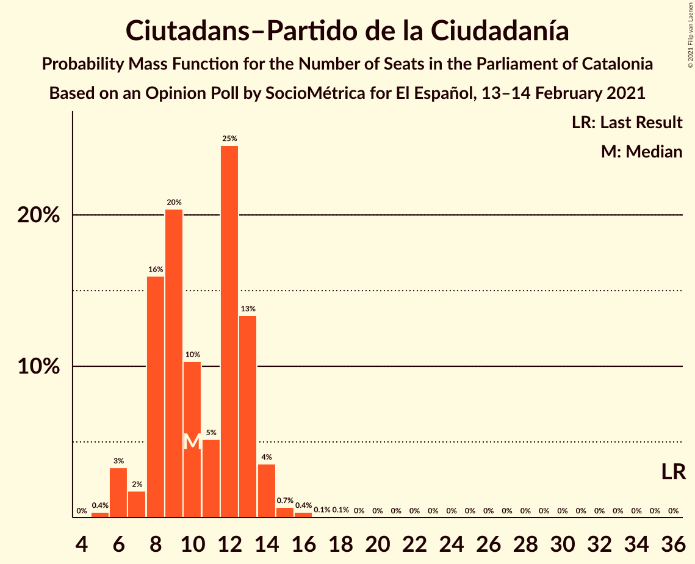
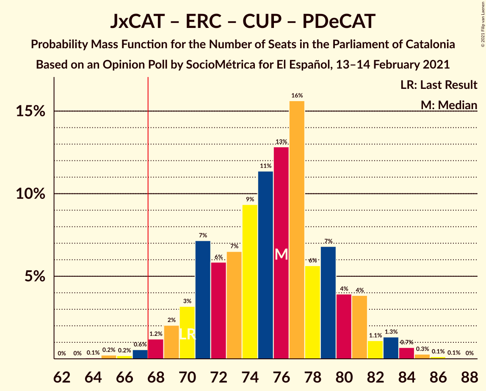

# Opinion Poll by SocioMétrica for El Español, 13–14 February 2021

<a href="#voting-intentions">Voting Intentions</a> | <a href="#seats">Seats</a> | <a href="#coalitions">Coalitions</a> | <a href="#technical-information">Technical Information</a>

## Voting Intentions

### Confidence Intervals

| Party | Last Result | Poll Result | 80% Confidence Interval | 90% Confidence Interval | 95% Confidence Interval | 99% Confidence Interval |
|:-----:|:-----------:|:-----------:|:-----------------------:|:-----------------------:|:-----------------------:|:-----------------------:|
| Junts per Catalunya | 21.7% | 23.2% | 20.9–25.8% |20.3–26.5% |19.7–27.1% |18.7–28.4% |
| Partit dels Socialistes de Catalunya (PSC-PSOE) | 13.9% | 20.2% | 18.0–22.6% |17.4–23.4% |16.9–23.9% |15.9–25.2% |
| Esquerra Republicana–Catalunya Sí | 21.4% | 18.6% | 16.5–21.0% |15.9–21.7% |15.4–22.3% |14.5–23.4% |
| Ciutadans–Partido de la Ciudadanía | 25.4% | 8.0% | 6.6–9.8% |6.2–10.3% |5.9–10.7% |5.3–11.6% |
| Vox | 0.0% | 7.4% | 6.1–9.1% |5.7–9.6% |5.4–10.0% |4.8–10.9% |
| Catalunya en Comú–Podem | 7.5% | 7.2% | 5.9–8.9% |5.5–9.4% |5.2–9.8% |4.7–10.7% |
| Candidatura d’Unitat Popular | 4.5% | 6.6% | 5.4–8.2% |5.0–8.7% |4.7–9.1% |4.2–10.0% |
| Partit Popular | 4.2% | 3.6% | 2.7–4.9% |2.5–5.3% |2.3–5.6% |1.9–6.3% |
| Partit Demòcrata Europeu Català | 0.0% | 2.6% | 1.9–3.8% |1.7–4.1% |1.5–4.4% |1.2–5.0% |

*Note:* The poll result column reflects the actual value used in the calculations. Published results may vary slightly, and in addition be rounded to fewer digits.

## Seats

### Confidence Intervals

| Party | Last Result | Median | 80% Confidence Interval | 90% Confidence Interval | 95% Confidence Interval | 99% Confidence Interval |
|:-----:|:-----------:|:------:|:-----------------------:|:-----------------------:|:-----------------------:|:-----------------------:|
| <a href="#junts-per-catalunya">Junts per Catalunya</a> | 34 | 37 | 33–41 |32–43 |31–44 |30–45 |
| <a href="#partit-dels-socialistes-de-catalunya-(psc-psoe)">Partit dels Socialistes de Catalunya (PSC-PSOE)</a> | 17 | 27 | 25–31 |24–32 |24–34 |22–36 |
| <a href="#esquerra-republicana–catalunya-sí">Esquerra Republicana–Catalunya Sí</a> | 32 | 28 | 25–31 |24–33 |22–34 |21–36 |
| <a href="#ciutadans–partido-de-la-ciudadanía">Ciutadans–Partido de la Ciudadanía</a> | 36 | 10 | 8–13 |7–13 |6–14 |6–16 |
| <a href="#vox">Vox</a> | 0 | 10 | 7–12 |7–13 |7–14 |5–15 |
| <a href="#catalunya-en-comú–podem">Catalunya en Comú–Podem</a> | 8 | 8 | 6–11 |5–11 |5–12 |4–14 |
| <a href="#candidatura-d’unitat-popular">Candidatura d’Unitat Popular</a> | 4 | 8 | 7–11 |7–11 |6–12 |4–15 |
| <a href="#partit-popular">Partit Popular</a> | 4 | 3 | 0–6 |0–7 |0–7 |0–7 |
| <a href="#partit-demòcrata-europeu-català">Partit Demòcrata Europeu Català</a> | 0 | 0 | 0–5 |0–5 |0–6 |0–7 |

### Junts per Catalunya

*For a full overview of the results for this party, see the [Junts per Catalunya](party-juntspercatalunya.html) page.*

| Number of Seats | Probability | Accumulated | Special Marks |
|:---------------:|:-----------:|:-----------:|:-------------:|
| 28 | 0% | 100% |  |
| 29 | 0.4% | 99.9% |  |
| 30 | 0.7% | 99.5% |  |
| 31 | 2% | 98.9% |  |
| 32 | 3% | 97% |  |
| 33 | 7% | 94% |  |
| 34 | 3% | 87% | Last Result |
| 35 | 9% | 84% |  |
| 36 | 9% | 76% |  |
| 37 | 21% | 67% | Median |
| 38 | 12% | 46% |  |
| 39 | 15% | 34% |  |
| 40 | 5% | 19% |  |
| 41 | 5% | 14% |  |
| 42 | 3% | 9% |  |
| 43 | 3% | 6% |  |
| 44 | 1.4% | 3% |  |
| 45 | 1.3% | 2% |  |
| 46 | 0.3% | 0.5% |  |
| 47 | 0.1% | 0.1% |  |
| 48 | 0.1% | 0.1% |  |
| 49 | 0% | 0% |  |

### Partit dels Socialistes de Catalunya (PSC-PSOE)

*For a full overview of the results for this party, see the [Partit dels Socialistes de Catalunya (PSC-PSOE)](party-partitdelssocialistesdecatalunyapsc-psoe.html) page.*

| Number of Seats | Probability | Accumulated | Special Marks |
|:---------------:|:-----------:|:-----------:|:-------------:|
| 17 | 0% | 100% | Last Result |
| 18 | 0% | 100% |  |
| 19 | 0.1% | 100% |  |
| 20 | 0.1% | 99.9% |  |
| 21 | 0.1% | 99.7% |  |
| 22 | 0.7% | 99.6% |  |
| 23 | 1.2% | 98.8% |  |
| 24 | 5% | 98% |  |
| 25 | 8% | 93% |  |
| 26 | 27% | 85% |  |
| 27 | 12% | 58% | Median |
| 28 | 8% | 46% |  |
| 29 | 12% | 38% |  |
| 30 | 12% | 26% |  |
| 31 | 6% | 15% |  |
| 32 | 5% | 8% |  |
| 33 | 1.0% | 4% |  |
| 34 | 1.2% | 3% |  |
| 35 | 0.7% | 1.4% |  |
| 36 | 0.6% | 0.7% |  |
| 37 | 0.1% | 0.1% |  |
| 38 | 0% | 0% |  |

### Esquerra Republicana–Catalunya Sí

*For a full overview of the results for this party, see the [Esquerra Republicana–Catalunya Sí](party-esquerrarepublicana–catalunyasí.html) page.*

| Number of Seats | Probability | Accumulated | Special Marks |
|:---------------:|:-----------:|:-----------:|:-------------:|
| 19 | 0% | 100% |  |
| 20 | 0.2% | 99.9% |  |
| 21 | 0.3% | 99.7% |  |
| 22 | 2% | 99.4% |  |
| 23 | 1.4% | 97% |  |
| 24 | 5% | 96% |  |
| 25 | 7% | 90% |  |
| 26 | 15% | 83% |  |
| 27 | 8% | 69% |  |
| 28 | 14% | 60% | Median |
| 29 | 14% | 46% |  |
| 30 | 9% | 32% |  |
| 31 | 13% | 23% |  |
| 32 | 4% | 10% | Last Result |
| 33 | 2% | 5% |  |
| 34 | 1.2% | 3% |  |
| 35 | 1.5% | 2% |  |
| 36 | 0.3% | 0.5% |  |
| 37 | 0.2% | 0.2% |  |
| 38 | 0% | 0.1% |  |
| 39 | 0% | 0% |  |

### Ciutadans–Partido de la Ciudadanía

*For a full overview of the results for this party, see the [Ciutadans–Partido de la Ciudadanía](party-ciutadans–partidodelaciudadanía.html) page.*

| Number of Seats | Probability | Accumulated | Special Marks |
|:---------------:|:-----------:|:-----------:|:-------------:|
| 5 | 0.4% | 100% |  |
| 6 | 3% | 99.6% |  |
| 7 | 2% | 96% |  |
| 8 | 16% | 95% |  |
| 9 | 20% | 79% |  |
| 10 | 10% | 58% | Median |
| 11 | 5% | 48% |  |
| 12 | 25% | 43% |  |
| 13 | 13% | 18% |  |
| 14 | 4% | 5% |  |
| 15 | 0.7% | 1.2% |  |
| 16 | 0.4% | 0.5% |  |
| 17 | 0.1% | 0.2% |  |
| 18 | 0.1% | 0.1% |  |
| 19 | 0% | 0% |  |
| 20 | 0% | 0% |  |
| 21 | 0% | 0% |  |
| 22 | 0% | 0% |  |
| 23 | 0% | 0% |  |
| 24 | 0% | 0% |  |
| 25 | 0% | 0% |  |
| 26 | 0% | 0% |  |
| 27 | 0% | 0% |  |
| 28 | 0% | 0% |  |
| 29 | 0% | 0% |  |
| 30 | 0% | 0% |  |
| 31 | 0% | 0% |  |
| 32 | 0% | 0% |  |
| 33 | 0% | 0% |  |
| 34 | 0% | 0% |  |
| 35 | 0% | 0% |  |
| 36 | 0% | 0% | Last Result |

### Vox

*For a full overview of the results for this party, see the [Vox](party-vox.html) page.*

| Number of Seats | Probability | Accumulated | Special Marks |
|:---------------:|:-----------:|:-----------:|:-------------:|
| 0 | 0% | 100% | Last Result |
| 1 | 0% | 100% |  |
| 2 | 0% | 100% |  |
| 3 | 0% | 100% |  |
| 4 | 0% | 100% |  |
| 5 | 0.8% | 100% |  |
| 6 | 1.1% | 99.1% |  |
| 7 | 13% | 98% |  |
| 8 | 13% | 85% |  |
| 9 | 13% | 72% |  |
| 10 | 15% | 59% | Median |
| 11 | 23% | 44% |  |
| 12 | 16% | 21% |  |
| 13 | 3% | 6% |  |
| 14 | 2% | 3% |  |
| 15 | 0.9% | 1.1% |  |
| 16 | 0.1% | 0.1% |  |
| 17 | 0% | 0.1% |  |
| 18 | 0% | 0% |  |

### Catalunya en Comú–Podem

*For a full overview of the results for this party, see the [Catalunya en Comú–Podem](party-catalunyaencomú–podem.html) page.*

| Number of Seats | Probability | Accumulated | Special Marks |
|:---------------:|:-----------:|:-----------:|:-------------:|
| 4 | 0.7% | 100% |  |
| 5 | 7% | 99.3% |  |
| 6 | 5% | 92% |  |
| 7 | 19% | 87% |  |
| 8 | 26% | 68% | Last Result, Median |
| 9 | 26% | 42% |  |
| 10 | 3% | 16% |  |
| 11 | 10% | 13% |  |
| 12 | 2% | 4% |  |
| 13 | 1.1% | 2% |  |
| 14 | 0.5% | 0.6% |  |
| 15 | 0.1% | 0.1% |  |
| 16 | 0% | 0.1% |  |
| 17 | 0% | 0% |  |

### Candidatura d’Unitat Popular

*For a full overview of the results for this party, see the [Candidatura d’Unitat Popular](party-candidaturad’unitatpopular.html) page.*

| Number of Seats | Probability | Accumulated | Special Marks |
|:---------------:|:-----------:|:-----------:|:-------------:|
| 3 | 0.1% | 100% |  |
| 4 | 1.0% | 99.9% | Last Result |
| 5 | 0.7% | 98.8% |  |
| 6 | 1.5% | 98% |  |
| 7 | 8% | 97% |  |
| 8 | 40% | 89% | Median |
| 9 | 27% | 49% |  |
| 10 | 5% | 21% |  |
| 11 | 11% | 16% |  |
| 12 | 3% | 5% |  |
| 13 | 0.8% | 2% |  |
| 14 | 0.5% | 1.0% |  |
| 15 | 0.5% | 0.5% |  |
| 16 | 0% | 0.1% |  |
| 17 | 0% | 0% |  |

### Partit Popular

*For a full overview of the results for this party, see the [Partit Popular](party-partitpopular.html) page.*

| Number of Seats | Probability | Accumulated | Special Marks |
|:---------------:|:-----------:|:-----------:|:-------------:|
| 0 | 16% | 100% |  |
| 1 | 0% | 84% |  |
| 2 | 7% | 84% |  |
| 3 | 39% | 77% | Median |
| 4 | 10% | 37% | Last Result |
| 5 | 16% | 27% |  |
| 6 | 6% | 11% |  |
| 7 | 5% | 5% |  |
| 8 | 0.3% | 0.4% |  |
| 9 | 0.1% | 0.1% |  |
| 10 | 0% | 0% |  |

### Partit Demòcrata Europeu Català

*For a full overview of the results for this party, see the [Partit Demòcrata Europeu Català](party-partitdemòcrataeuropeucatalà.html) page.*

| Number of Seats | Probability | Accumulated | Special Marks |
|:---------------:|:-----------:|:-----------:|:-------------:|
| 0 | 54% | 100% | Last Result, Median |
| 1 | 27% | 46% |  |
| 2 | 0.2% | 19% |  |
| 3 | 3% | 19% |  |
| 4 | 4% | 16% |  |
| 5 | 8% | 12% |  |
| 6 | 3% | 4% |  |
| 7 | 0.4% | 0.5% |  |
| 8 | 0.1% | 0.1% |  |
| 9 | 0% | 0% |  |

## Coalitions

### Confidence Intervals

| Coalition | Last Result | Median | Majority? | 80% Confidence Interval | 90% Confidence Interval | 95% Confidence Interval | 99% Confidence Interval |
|:---------:|:-----------:|:------:|:---------:|:-----------------------:|:-----------------------:|:-----------------------:|:-----------------------:|
| Junts per Catalunya – Esquerra Republicana–Catalunya Sí – Candidatura d’Unitat Popular – Partit Demòcrata Europeu Català | 70 | 76 | 98.9% | 71–80 | 70–81 | 69–83 | 66–85 |
| Junts per Catalunya – Esquerra Republicana–Catalunya Sí – Candidatura d’Unitat Popular | 70 | 74 | 97% | 70–79 | 69–80 | 67–81 | 65–84 |
| Junts per Catalunya – Esquerra Republicana–Catalunya Sí – Catalunya en Comú–Podem | 74 | 74 | 96% | 69–79 | 68–80 | 67–81 | 65–83 |
| Junts per Catalunya – Esquerra Republicana–Catalunya Sí – Partit Demòcrata Europeu Català | 66 | 67 | 46% | 62–71 | 61–72 | 60–74 | 57–76 |
| Junts per Catalunya – Esquerra Republicana–Catalunya Sí | 66 | 65 | 34% | 61–70 | 60–71 | 59–72 | 56–75 |
| Partit dels Socialistes de Catalunya (PSC-PSOE) – Esquerra Republicana–Catalunya Sí – Catalunya en Comú–Podem | 57 | 64 | 16% | 60–68 | 58–70 | 57–71 | 55–73 |
| Partit dels Socialistes de Catalunya (PSC-PSOE) – Ciutadans–Partido de la Ciudadanía – Vox – Partit Popular | 57 | 51 | 0% | 47–56 | 46–57 | 45–58 | 42–60 |
| Partit dels Socialistes de Catalunya (PSC-PSOE) – Ciutadans–Partido de la Ciudadanía – Catalunya en Comú–Podem – Partit Popular | 65 | 49 | 0% | 45–54 | 44–55 | 43–56 | 41–59 |
| Partit dels Socialistes de Catalunya (PSC-PSOE) – Ciutadans–Partido de la Ciudadanía – Partit Popular | 57 | 41 | 0% | 37–46 | 36–47 | 35–48 | 33–50 |
| Esquerra Republicana–Catalunya Sí – Catalunya en Comú–Podem | 40 | 37 | 0% | 32–40 | 31–42 | 30–43 | 29–45 |

### Junts per Catalunya – Esquerra Republicana–Catalunya Sí – Candidatura d’Unitat Popular – Partit Demòcrata Europeu Català

| Number of Seats | Probability | Accumulated | Special Marks |
|:---------------:|:-----------:|:-----------:|:-------------:|
| 64 | 0.1% | 100% |  |
| 65 | 0.2% | 99.9% |  |
| 66 | 0.2% | 99.7% |  |
| 67 | 0.6% | 99.5% |  |
| 68 | 1.2% | 98.9% | Majority |
| 69 | 2% | 98% |  |
| 70 | 3% | 96% | Last Result |
| 71 | 7% | 93% |  |
| 72 | 6% | 85% |  |
| 73 | 7% | 80% | Median |
| 74 | 9% | 73% |  |
| 75 | 11% | 64% |  |
| 76 | 13% | 52% |  |
| 77 | 16% | 39% |  |
| 78 | 6% | 24% |  |
| 79 | 7% | 18% |  |
| 80 | 4% | 11% |  |
| 81 | 4% | 7% |  |
| 82 | 1.1% | 4% |  |
| 83 | 1.3% | 3% |  |
| 84 | 0.7% | 1.2% |  |
| 85 | 0.3% | 0.5% |  |
| 86 | 0.1% | 0.2% |  |
| 87 | 0.1% | 0.1% |  |
| 88 | 0% | 0% |  |

### Junts per Catalunya – Esquerra Republicana–Catalunya Sí – Candidatura d’Unitat Popular

| Number of Seats | Probability | Accumulated | Special Marks |
|:---------------:|:-----------:|:-----------:|:-------------:|
| 62 | 0% | 100% |  |
| 63 | 0.1% | 99.9% |  |
| 64 | 0.2% | 99.9% |  |
| 65 | 0.3% | 99.7% |  |
| 66 | 0.9% | 99.3% |  |
| 67 | 1.2% | 98% |  |
| 68 | 2% | 97% | Majority |
| 69 | 4% | 95% |  |
| 70 | 5% | 92% | Last Result |
| 71 | 10% | 87% |  |
| 72 | 8% | 76% |  |
| 73 | 7% | 68% | Median |
| 74 | 13% | 61% |  |
| 75 | 9% | 48% |  |
| 76 | 15% | 39% |  |
| 77 | 8% | 25% |  |
| 78 | 4% | 16% |  |
| 79 | 4% | 12% |  |
| 80 | 4% | 8% |  |
| 81 | 2% | 4% |  |
| 82 | 0.9% | 2% |  |
| 83 | 0.5% | 1.1% |  |
| 84 | 0.3% | 0.6% |  |
| 85 | 0.2% | 0.3% |  |
| 86 | 0.1% | 0.1% |  |
| 87 | 0% | 0% |  |

### Junts per Catalunya – Esquerra Republicana–Catalunya Sí – Catalunya en Comú–Podem

| Number of Seats | Probability | Accumulated | Special Marks |
|:---------------:|:-----------:|:-----------:|:-------------:|
| 62 | 0% | 100% |  |
| 63 | 0.1% | 99.9% |  |
| 64 | 0.3% | 99.8% |  |
| 65 | 0.9% | 99.6% |  |
| 66 | 0.9% | 98.7% |  |
| 67 | 2% | 98% |  |
| 68 | 3% | 96% | Majority |
| 69 | 4% | 93% |  |
| 70 | 6% | 89% |  |
| 71 | 9% | 84% |  |
| 72 | 12% | 74% |  |
| 73 | 11% | 62% | Median |
| 74 | 10% | 51% | Last Result |
| 75 | 10% | 41% |  |
| 76 | 7% | 31% |  |
| 77 | 11% | 24% |  |
| 78 | 3% | 13% |  |
| 79 | 5% | 10% |  |
| 80 | 2% | 5% |  |
| 81 | 2% | 3% |  |
| 82 | 0.5% | 1.2% |  |
| 83 | 0.2% | 0.6% |  |
| 84 | 0.3% | 0.4% |  |
| 85 | 0.1% | 0.1% |  |
| 86 | 0% | 0.1% |  |
| 87 | 0% | 0% |  |

### Junts per Catalunya – Esquerra Republicana–Catalunya Sí – Partit Demòcrata Europeu Català

| Number of Seats | Probability | Accumulated | Special Marks |
|:---------------:|:-----------:|:-----------:|:-------------:|
| 55 | 0% | 100% |  |
| 56 | 0.2% | 99.9% |  |
| 57 | 0.4% | 99.8% |  |
| 58 | 0.3% | 99.3% |  |
| 59 | 1.0% | 99.0% |  |
| 60 | 2% | 98% |  |
| 61 | 2% | 96% |  |
| 62 | 4% | 94% |  |
| 63 | 9% | 90% |  |
| 64 | 9% | 81% |  |
| 65 | 10% | 72% | Median |
| 66 | 8% | 62% | Last Result |
| 67 | 8% | 54% |  |
| 68 | 15% | 46% | Majority |
| 69 | 12% | 31% |  |
| 70 | 6% | 19% |  |
| 71 | 4% | 13% |  |
| 72 | 5% | 9% |  |
| 73 | 1.4% | 4% |  |
| 74 | 1.2% | 3% |  |
| 75 | 1.0% | 2% |  |
| 76 | 0.3% | 0.6% |  |
| 77 | 0.1% | 0.2% |  |
| 78 | 0.1% | 0.1% |  |
| 79 | 0% | 0% |  |

### Junts per Catalunya – Esquerra Republicana–Catalunya Sí

| Number of Seats | Probability | Accumulated | Special Marks |
|:---------------:|:-----------:|:-----------:|:-------------:|
| 54 | 0% | 100% |  |
| 55 | 0.2% | 99.9% |  |
| 56 | 0.3% | 99.7% |  |
| 57 | 0.7% | 99.4% |  |
| 58 | 1.0% | 98.8% |  |
| 59 | 2% | 98% |  |
| 60 | 3% | 96% |  |
| 61 | 4% | 93% |  |
| 62 | 6% | 89% |  |
| 63 | 12% | 82% |  |
| 64 | 10% | 71% |  |
| 65 | 15% | 61% | Median |
| 66 | 6% | 46% | Last Result |
| 67 | 7% | 41% |  |
| 68 | 17% | 34% | Majority |
| 69 | 5% | 17% |  |
| 70 | 3% | 11% |  |
| 71 | 3% | 8% |  |
| 72 | 3% | 5% |  |
| 73 | 0.9% | 2% |  |
| 74 | 0.4% | 1.1% |  |
| 75 | 0.5% | 0.7% |  |
| 76 | 0.1% | 0.2% |  |
| 77 | 0.1% | 0.1% |  |
| 78 | 0% | 0.1% |  |
| 79 | 0% | 0% |  |

### Partit dels Socialistes de Catalunya (PSC-PSOE) – Esquerra Republicana–Catalunya Sí – Catalunya en Comú–Podem

| Number of Seats | Probability | Accumulated | Special Marks |
|:---------------:|:-----------:|:-----------:|:-------------:|
| 53 | 0.1% | 100% |  |
| 54 | 0.1% | 99.9% |  |
| 55 | 0.4% | 99.8% |  |
| 56 | 1.0% | 99.3% |  |
| 57 | 2% | 98% | Last Result |
| 58 | 2% | 97% |  |
| 59 | 4% | 94% |  |
| 60 | 5% | 90% |  |
| 61 | 7% | 85% |  |
| 62 | 7% | 78% |  |
| 63 | 9% | 71% | Median |
| 64 | 21% | 61% |  |
| 65 | 9% | 41% |  |
| 66 | 5% | 32% |  |
| 67 | 11% | 27% |  |
| 68 | 7% | 16% | Majority |
| 69 | 3% | 9% |  |
| 70 | 3% | 6% |  |
| 71 | 1.2% | 3% |  |
| 72 | 0.7% | 2% |  |
| 73 | 0.5% | 1.0% |  |
| 74 | 0.2% | 0.5% |  |
| 75 | 0.1% | 0.3% |  |
| 76 | 0.1% | 0.1% |  |
| 77 | 0% | 0% |  |

### Partit dels Socialistes de Catalunya (PSC-PSOE) – Ciutadans–Partido de la Ciudadanía – Vox – Partit Popular

| Number of Seats | Probability | Accumulated | Special Marks |
|:---------------:|:-----------:|:-----------:|:-------------:|
| 39 | 0% | 100% |  |
| 40 | 0% | 99.9% |  |
| 41 | 0.1% | 99.9% |  |
| 42 | 0.5% | 99.8% |  |
| 43 | 0.6% | 99.3% |  |
| 44 | 1.1% | 98.7% |  |
| 45 | 2% | 98% |  |
| 46 | 3% | 95% |  |
| 47 | 6% | 92% |  |
| 48 | 5% | 86% |  |
| 49 | 12% | 81% |  |
| 50 | 8% | 69% | Median |
| 51 | 12% | 60% |  |
| 52 | 14% | 48% |  |
| 53 | 7% | 34% |  |
| 54 | 9% | 27% |  |
| 55 | 7% | 18% |  |
| 56 | 5% | 11% |  |
| 57 | 2% | 6% | Last Result |
| 58 | 3% | 4% |  |
| 59 | 0.6% | 2% |  |
| 60 | 0.6% | 1.0% |  |
| 61 | 0.3% | 0.4% |  |
| 62 | 0.1% | 0.2% |  |
| 63 | 0.1% | 0.1% |  |
| 64 | 0% | 0% |  |

### Partit dels Socialistes de Catalunya (PSC-PSOE) – Ciutadans–Partido de la Ciudadanía – Catalunya en Comú–Podem – Partit Popular

| Number of Seats | Probability | Accumulated | Special Marks |
|:---------------:|:-----------:|:-----------:|:-------------:|
| 38 | 0% | 100% |  |
| 39 | 0.1% | 99.9% |  |
| 40 | 0.3% | 99.8% |  |
| 41 | 0.3% | 99.6% |  |
| 42 | 0.7% | 99.3% |  |
| 43 | 1.3% | 98.6% |  |
| 44 | 4% | 97% |  |
| 45 | 4% | 93% |  |
| 46 | 4% | 89% |  |
| 47 | 12% | 85% |  |
| 48 | 16% | 73% | Median |
| 49 | 8% | 57% |  |
| 50 | 11% | 49% |  |
| 51 | 9% | 39% |  |
| 52 | 8% | 30% |  |
| 53 | 7% | 22% |  |
| 54 | 5% | 15% |  |
| 55 | 5% | 9% |  |
| 56 | 2% | 4% |  |
| 57 | 0.8% | 2% |  |
| 58 | 1.1% | 2% |  |
| 59 | 0.3% | 0.6% |  |
| 60 | 0.1% | 0.3% |  |
| 61 | 0.1% | 0.1% |  |
| 62 | 0% | 0% |  |
| 63 | 0% | 0% |  |
| 64 | 0% | 0% |  |
| 65 | 0% | 0% | Last Result |

### Partit dels Socialistes de Catalunya (PSC-PSOE) – Ciutadans–Partido de la Ciudadanía – Partit Popular

| Number of Seats | Probability | Accumulated | Special Marks |
|:---------------:|:-----------:|:-----------:|:-------------:|
| 31 | 0.1% | 100% |  |
| 32 | 0.2% | 99.8% |  |
| 33 | 0.3% | 99.7% |  |
| 34 | 0.8% | 99.4% |  |
| 35 | 2% | 98.6% |  |
| 36 | 2% | 97% |  |
| 37 | 5% | 94% |  |
| 38 | 11% | 89% |  |
| 39 | 7% | 78% |  |
| 40 | 10% | 71% | Median |
| 41 | 16% | 61% |  |
| 42 | 8% | 45% |  |
| 43 | 10% | 37% |  |
| 44 | 6% | 27% |  |
| 45 | 8% | 20% |  |
| 46 | 7% | 13% |  |
| 47 | 3% | 6% |  |
| 48 | 0.9% | 3% |  |
| 49 | 1.4% | 2% |  |
| 50 | 0.4% | 0.8% |  |
| 51 | 0.3% | 0.4% |  |
| 52 | 0.1% | 0.1% |  |
| 53 | 0.1% | 0.1% |  |
| 54 | 0% | 0% |  |
| 55 | 0% | 0% |  |
| 56 | 0% | 0% |  |
| 57 | 0% | 0% | Last Result |

### Esquerra Republicana–Catalunya Sí – Catalunya en Comú–Podem

| Number of Seats | Probability | Accumulated | Special Marks |
|:---------------:|:-----------:|:-----------:|:-------------:|
| 27 | 0.1% | 100% |  |
| 28 | 0.2% | 99.9% |  |
| 29 | 1.4% | 99.6% |  |
| 30 | 2% | 98% |  |
| 31 | 3% | 97% |  |
| 32 | 4% | 94% |  |
| 33 | 9% | 90% |  |
| 34 | 7% | 81% |  |
| 35 | 12% | 74% |  |
| 36 | 10% | 61% | Median |
| 37 | 14% | 52% |  |
| 38 | 15% | 38% |  |
| 39 | 9% | 23% |  |
| 40 | 5% | 14% | Last Result |
| 41 | 4% | 9% |  |
| 42 | 3% | 5% |  |
| 43 | 1.5% | 3% |  |
| 44 | 0.5% | 1.1% |  |
| 45 | 0.4% | 0.6% |  |
| 46 | 0.1% | 0.2% |  |
| 47 | 0.1% | 0.1% |  |
| 48 | 0% | 0% |  |

## Technical Information

### Opinion Poll

+ **Polling firm:** SocioMétrica
+ **Commissioner(s):** El Español
+ **Fieldwork period:** 13–14 February 2021

### Calculations

+ **Sample size:** 500
+ **Simulations done:** 1,048,576
+ **Error estimate:** 1.83%

