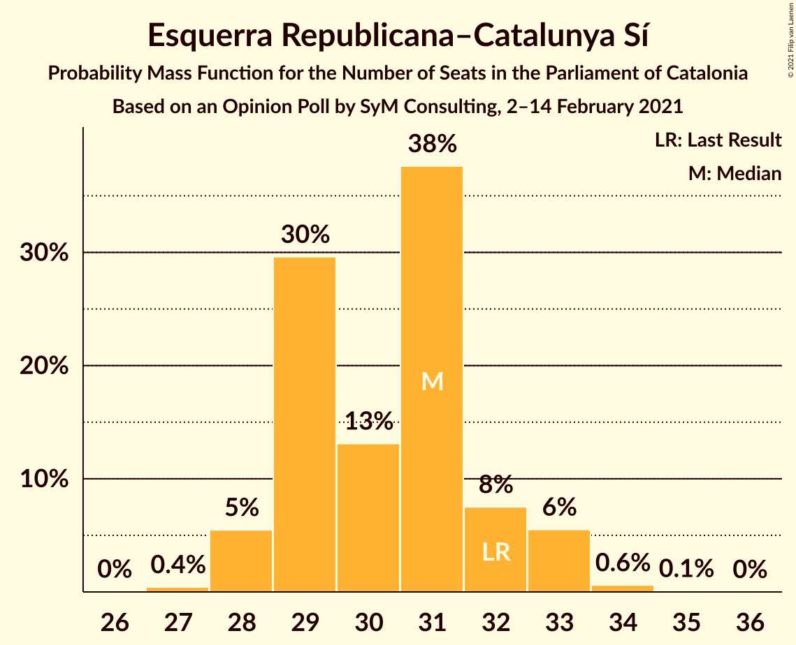
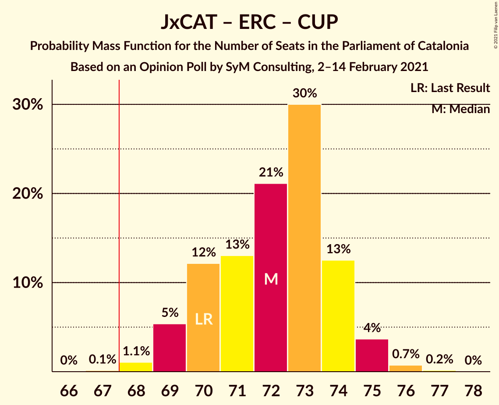

# Opinion Poll by SyM Consulting, 2–14 February 2021

<a href="#voting-intentions">Voting Intentions</a> | <a href="#seats">Seats</a> | <a href="#coalitions">Coalitions</a> | <a href="#technical-information">Technical Information</a>

## Voting Intentions

### Confidence Intervals

| Party | Last Result | Poll Result | 80% Confidence Interval | 90% Confidence Interval | 95% Confidence Interval | 99% Confidence Interval |
|:-----:|:-----------:|:-----------:|:-----------------------:|:-----------------------:|:-----------------------:|:-----------------------:|
| Junts per Catalunya | 21.7% | 22.1% | 21.2–23.1% |20.9–23.4% |20.7–23.6% |20.2–24.1% |
| Esquerra Republicana–Catalunya Sí | 21.4% | 20.6% | 19.7–21.6% |19.4–21.8% |19.2–22.1% |18.8–22.5% |
| Partit dels Socialistes de Catalunya (PSC-PSOE) | 13.9% | 17.8% | 16.9–18.7% |16.7–19.0% |16.5–19.2% |16.1–19.6% |
| Ciutadans–Partido de la Ciudadanía | 25.4% | 12.0% | 11.3–12.8% |11.1–13.0% |10.9–13.2% |10.5–13.6% |
| Vox | 0.0% | 9.4% | 8.8–10.1% |8.6–10.3% |8.4–10.5% |8.1–10.8% |
| Catalunya en Comú–Podem | 7.5% | 7.0% | 6.4–7.6% |6.3–7.8% |6.2–8.0% |5.9–8.3% |
| Candidatura d’Unitat Popular | 4.5% | 5.3% | 4.8–5.9% |4.7–6.0% |4.6–6.2% |4.3–6.4% |
| Partit Popular | 4.2% | 3.8% | 3.4–4.3% |3.3–4.4% |3.2–4.6% |3.0–4.8% |

*Note:* The poll result column reflects the actual value used in the calculations. Published results may vary slightly, and in addition be rounded to fewer digits.

## Seats

### Confidence Intervals

| Party | Last Result | Median | 80% Confidence Interval | 90% Confidence Interval | 95% Confidence Interval | 99% Confidence Interval |
|:-----:|:-----------:|:------:|:-----------------------:|:-----------------------:|:-----------------------:|:-----------------------:|
| <a href="#junts-per-catalunya">Junts per Catalunya</a> | 34 | 35 | 33–37 |32–37 |32–37 |32–38 |
| <a href="#esquerra-republicana–catalunya-sí">Esquerra Republicana–Catalunya Sí</a> | 32 | 31 | 29–32 |28–33 |28–33 |28–34 |
| <a href="#partit-dels-socialistes-de-catalunya-(psc-psoe)">Partit dels Socialistes de Catalunya (PSC-PSOE)</a> | 17 | 24 | 23–25 |23–25 |23–25 |21–26 |
| <a href="#ciutadans–partido-de-la-ciudadanía">Ciutadans–Partido de la Ciudadanía</a> | 36 | 15 | 14–18 |14–18 |14–18 |14–18 |
| <a href="#vox">Vox</a> | 0 | 12 | 12–13 |11–14 |10–14 |10–15 |
| <a href="#catalunya-en-comú–podem">Catalunya en Comú–Podem</a> | 8 | 8 | 7–8 |7–9 |6–9 |6–9 |
| <a href="#candidatura-d’unitat-popular">Candidatura d’Unitat Popular</a> | 4 | 7 | 6–8 |6–8 |5–8 |4–8 |
| <a href="#partit-popular">Partit Popular</a> | 4 | 3 | 3–4 |3–5 |2–5 |2–5 |

### Junts per Catalunya

*For a full overview of the results for this party, see the [Junts per Catalunya](party-juntspercatalunya.html) page.*

| Number of Seats | Probability | Accumulated | Special Marks |
|:---------------:|:-----------:|:-----------:|:-------------:|
| 31 | 0.4% | 100% |  |
| 32 | 10% | 99.6% |  |
| 33 | 10% | 90% |  |
| 34 | 22% | 80% | Last Result |
| 35 | 22% | 58% | Median |
| 36 | 16% | 36% |  |
| 37 | 19% | 20% |  |
| 38 | 1.0% | 1.1% |  |
| 39 | 0.1% | 0.1% |  |
| 40 | 0% | 0% |  |

### Esquerra Republicana–Catalunya Sí

*For a full overview of the results for this party, see the [Esquerra Republicana–Catalunya Sí](party-esquerrarepublicana–catalunyasí.html) page.*

| Number of Seats | Probability | Accumulated | Special Marks |
|:---------------:|:-----------:|:-----------:|:-------------:|
| 27 | 0.4% | 100% |  |
| 28 | 5% | 99.5% |  |
| 29 | 30% | 94% |  |
| 30 | 13% | 64% |  |
| 31 | 38% | 51% | Median |
| 32 | 8% | 14% | Last Result |
| 33 | 6% | 6% |  |
| 34 | 0.6% | 0.7% |  |
| 35 | 0.1% | 0.1% |  |
| 36 | 0% | 0% |  |

### Partit dels Socialistes de Catalunya (PSC-PSOE)

*For a full overview of the results for this party, see the [Partit dels Socialistes de Catalunya (PSC-PSOE)](party-partitdelssocialistesdecatalunyapsc-psoe.html) page.*

| Number of Seats | Probability | Accumulated | Special Marks |
|:---------------:|:-----------:|:-----------:|:-------------:|
| 17 | 0% | 100% | Last Result |
| 18 | 0% | 100% |  |
| 19 | 0% | 100% |  |
| 20 | 0.2% | 100% |  |
| 21 | 0.3% | 99.8% |  |
| 22 | 2% | 99.4% |  |
| 23 | 13% | 98% |  |
| 24 | 49% | 84% | Median |
| 25 | 33% | 35% |  |
| 26 | 2% | 2% |  |
| 27 | 0.1% | 0.1% |  |
| 28 | 0% | 0% |  |

### Ciutadans–Partido de la Ciudadanía

*For a full overview of the results for this party, see the [Ciutadans–Partido de la Ciudadanía](party-ciutadans–partidodelaciudadanía.html) page.*

| Number of Seats | Probability | Accumulated | Special Marks |
|:---------------:|:-----------:|:-----------:|:-------------:|
| 13 | 0.5% | 100% |  |
| 14 | 26% | 99.5% |  |
| 15 | 32% | 74% | Median |
| 16 | 21% | 42% |  |
| 17 | 10% | 21% |  |
| 18 | 11% | 11% |  |
| 19 | 0.2% | 0.2% |  |
| 20 | 0% | 0% |  |
| 21 | 0% | 0% |  |
| 22 | 0% | 0% |  |
| 23 | 0% | 0% |  |
| 24 | 0% | 0% |  |
| 25 | 0% | 0% |  |
| 26 | 0% | 0% |  |
| 27 | 0% | 0% |  |
| 28 | 0% | 0% |  |
| 29 | 0% | 0% |  |
| 30 | 0% | 0% |  |
| 31 | 0% | 0% |  |
| 32 | 0% | 0% |  |
| 33 | 0% | 0% |  |
| 34 | 0% | 0% |  |
| 35 | 0% | 0% |  |
| 36 | 0% | 0% | Last Result |

### Vox

*For a full overview of the results for this party, see the [Vox](party-vox.html) page.*

| Number of Seats | Probability | Accumulated | Special Marks |
|:---------------:|:-----------:|:-----------:|:-------------:|
| 0 | 0% | 100% | Last Result |
| 1 | 0% | 100% |  |
| 2 | 0% | 100% |  |
| 3 | 0% | 100% |  |
| 4 | 0% | 100% |  |
| 5 | 0% | 100% |  |
| 6 | 0% | 100% |  |
| 7 | 0% | 100% |  |
| 8 | 0% | 100% |  |
| 9 | 0% | 100% |  |
| 10 | 3% | 100% |  |
| 11 | 3% | 97% |  |
| 12 | 61% | 94% | Median |
| 13 | 24% | 33% |  |
| 14 | 9% | 9% |  |
| 15 | 0.7% | 0.7% |  |
| 16 | 0% | 0% |  |

### Catalunya en Comú–Podem

*For a full overview of the results for this party, see the [Catalunya en Comú–Podem](party-catalunyaencomú–podem.html) page.*

| Number of Seats | Probability | Accumulated | Special Marks |
|:---------------:|:-----------:|:-----------:|:-------------:|
| 5 | 0.3% | 100% |  |
| 6 | 3% | 99.7% |  |
| 7 | 32% | 96% |  |
| 8 | 59% | 65% | Last Result, Median |
| 9 | 5% | 6% |  |
| 10 | 0.1% | 0.1% |  |
| 11 | 0% | 0% |  |

### Candidatura d’Unitat Popular

*For a full overview of the results for this party, see the [Candidatura d’Unitat Popular](party-candidaturad’unitatpopular.html) page.*

| Number of Seats | Probability | Accumulated | Special Marks |
|:---------------:|:-----------:|:-----------:|:-------------:|
| 4 | 2% | 100% | Last Result |
| 5 | 2% | 98% |  |
| 6 | 17% | 96% |  |
| 7 | 57% | 79% | Median |
| 8 | 22% | 22% |  |
| 9 | 0% | 0% |  |

### Partit Popular

*For a full overview of the results for this party, see the [Partit Popular](party-partitpopular.html) page.*

| Number of Seats | Probability | Accumulated | Special Marks |
|:---------------:|:-----------:|:-----------:|:-------------:|
| 0 | 0.1% | 100% |  |
| 1 | 0% | 99.9% |  |
| 2 | 3% | 99.9% |  |
| 3 | 83% | 97% | Median |
| 4 | 5% | 14% | Last Result |
| 5 | 9% | 9% |  |
| 6 | 0.1% | 0.1% |  |
| 7 | 0% | 0% |  |

## Coalitions

### Confidence Intervals

| Coalition | Last Result | Median | Majority? | 80% Confidence Interval | 90% Confidence Interval | 95% Confidence Interval | 99% Confidence Interval |
|:---------:|:-----------:|:------:|:---------:|:-----------------------:|:-----------------------:|:-----------------------:|:-----------------------:|
| Junts per Catalunya – Esquerra Republicana–Catalunya Sí – Catalunya en Comú–Podem | 74 | 73 | 99.9% | 71–75 | 70–75 | 69–76 | 68–77 |
| Junts per Catalunya – Esquerra Republicana–Catalunya Sí – Candidatura d’Unitat Popular | 70 | 72 | 99.8% | 70–74 | 69–74 | 69–75 | 68–76 |
| Junts per Catalunya – Esquerra Republicana–Catalunya Sí | 66 | 65 | 6% | 63–67 | 62–68 | 62–68 | 61–69 |
| Esquerra Republicana–Catalunya Sí – Partit dels Socialistes de Catalunya (PSC-PSOE) – Catalunya en Comú–Podem | 57 | 62 | 0% | 60–64 | 60–65 | 60–65 | 58–66 |
| Partit dels Socialistes de Catalunya (PSC-PSOE) – Ciutadans–Partido de la Ciudadanía – Vox – Partit Popular | 57 | 55 | 0% | 53–57 | 53–58 | 52–59 | 52–59 |
| Partit dels Socialistes de Catalunya (PSC-PSOE) – Ciutadans–Partido de la Ciudadanía – Catalunya en Comú–Podem – Partit Popular | 65 | 50 | 0% | 49–53 | 48–53 | 48–54 | 47–55 |
| Partit dels Socialistes de Catalunya (PSC-PSOE) – Ciutadans–Partido de la Ciudadanía – Partit Popular | 57 | 43 | 0% | 41–45 | 41–45 | 40–46 | 40–47 |
| Esquerra Republicana–Catalunya Sí – Catalunya en Comú–Podem | 40 | 38 | 0% | 36–40 | 36–40 | 36–41 | 35–42 |

### Junts per Catalunya – Esquerra Republicana–Catalunya Sí – Catalunya en Comú–Podem

| Number of Seats | Probability | Accumulated | Special Marks |
|:---------------:|:-----------:|:-----------:|:-------------:|
| 67 | 0.1% | 100% |  |
| 68 | 0.6% | 99.9% | Majority |
| 69 | 2% | 99.4% |  |
| 70 | 6% | 97% |  |
| 71 | 13% | 92% |  |
| 72 | 16% | 79% |  |
| 73 | 27% | 63% |  |
| 74 | 24% | 35% | Last Result, Median |
| 75 | 7% | 11% |  |
| 76 | 3% | 5% |  |
| 77 | 1.3% | 1.4% |  |
| 78 | 0.1% | 0.1% |  |
| 79 | 0% | 0% |  |

### Junts per Catalunya – Esquerra Republicana–Catalunya Sí – Candidatura d’Unitat Popular

| Number of Seats | Probability | Accumulated | Special Marks |
|:---------------:|:-----------:|:-----------:|:-------------:|
| 67 | 0.1% | 100% |  |
| 68 | 1.1% | 99.8% | Majority |
| 69 | 5% | 98.8% |  |
| 70 | 12% | 93% | Last Result |
| 71 | 13% | 81% |  |
| 72 | 21% | 68% |  |
| 73 | 30% | 47% | Median |
| 74 | 13% | 17% |  |
| 75 | 4% | 5% |  |
| 76 | 0.7% | 0.9% |  |
| 77 | 0.2% | 0.2% |  |
| 78 | 0% | 0% |  |

### Junts per Catalunya – Esquerra Republicana–Catalunya Sí

| Number of Seats | Probability | Accumulated | Special Marks |
|:---------------:|:-----------:|:-----------:|:-------------:|
| 60 | 0.2% | 100% |  |
| 61 | 1.1% | 99.8% |  |
| 62 | 5% | 98.7% |  |
| 63 | 11% | 94% |  |
| 64 | 13% | 83% |  |
| 65 | 25% | 70% |  |
| 66 | 27% | 45% | Last Result, Median |
| 67 | 12% | 18% |  |
| 68 | 4% | 6% | Majority |
| 69 | 2% | 2% |  |
| 70 | 0.2% | 0.3% |  |
| 71 | 0% | 0% |  |

### Esquerra Republicana–Catalunya Sí – Partit dels Socialistes de Catalunya (PSC-PSOE) – Catalunya en Comú–Podem

| Number of Seats | Probability | Accumulated | Special Marks |
|:---------------:|:-----------:|:-----------:|:-------------:|
| 57 | 0% | 100% | Last Result |
| 58 | 0.5% | 99.9% |  |
| 59 | 1.3% | 99.4% |  |
| 60 | 11% | 98% |  |
| 61 | 24% | 87% |  |
| 62 | 18% | 63% |  |
| 63 | 29% | 45% | Median |
| 64 | 10% | 16% |  |
| 65 | 5% | 6% |  |
| 66 | 0.8% | 1.0% |  |
| 67 | 0.1% | 0.1% |  |
| 68 | 0% | 0% | Majority |

### Partit dels Socialistes de Catalunya (PSC-PSOE) – Ciutadans–Partido de la Ciudadanía – Vox – Partit Popular

| Number of Seats | Probability | Accumulated | Special Marks |
|:---------------:|:-----------:|:-----------:|:-------------:|
| 50 | 0.1% | 100% |  |
| 51 | 0.3% | 99.9% |  |
| 52 | 3% | 99.6% |  |
| 53 | 8% | 97% |  |
| 54 | 27% | 89% | Median |
| 55 | 23% | 63% |  |
| 56 | 19% | 40% |  |
| 57 | 12% | 21% | Last Result |
| 58 | 7% | 9% |  |
| 59 | 2% | 3% |  |
| 60 | 0.4% | 0.4% |  |
| 61 | 0% | 0% |  |

### Partit dels Socialistes de Catalunya (PSC-PSOE) – Ciutadans–Partido de la Ciudadanía – Catalunya en Comú–Podem – Partit Popular

| Number of Seats | Probability | Accumulated | Special Marks |
|:---------------:|:-----------:|:-----------:|:-------------:|
| 45 | 0% | 100% |  |
| 46 | 0.3% | 99.9% |  |
| 47 | 0.7% | 99.7% |  |
| 48 | 7% | 99.0% |  |
| 49 | 19% | 92% |  |
| 50 | 27% | 73% | Median |
| 51 | 17% | 46% |  |
| 52 | 17% | 29% |  |
| 53 | 9% | 12% |  |
| 54 | 3% | 3% |  |
| 55 | 0.5% | 0.5% |  |
| 56 | 0% | 0% |  |
| 57 | 0% | 0% |  |
| 58 | 0% | 0% |  |
| 59 | 0% | 0% |  |
| 60 | 0% | 0% |  |
| 61 | 0% | 0% |  |
| 62 | 0% | 0% |  |
| 63 | 0% | 0% |  |
| 64 | 0% | 0% |  |
| 65 | 0% | 0% | Last Result |

### Partit dels Socialistes de Catalunya (PSC-PSOE) – Ciutadans–Partido de la Ciudadanía – Partit Popular

| Number of Seats | Probability | Accumulated | Special Marks |
|:---------------:|:-----------:|:-----------:|:-------------:|
| 38 | 0.1% | 100% |  |
| 39 | 0.3% | 99.9% |  |
| 40 | 3% | 99.5% |  |
| 41 | 19% | 97% |  |
| 42 | 19% | 78% | Median |
| 43 | 23% | 58% |  |
| 44 | 20% | 35% |  |
| 45 | 10% | 15% |  |
| 46 | 4% | 5% |  |
| 47 | 0.8% | 0.9% |  |
| 48 | 0.1% | 0.1% |  |
| 49 | 0% | 0% |  |
| 50 | 0% | 0% |  |
| 51 | 0% | 0% |  |
| 52 | 0% | 0% |  |
| 53 | 0% | 0% |  |
| 54 | 0% | 0% |  |
| 55 | 0% | 0% |  |
| 56 | 0% | 0% |  |
| 57 | 0% | 0% | Last Result |

### Esquerra Republicana–Catalunya Sí – Catalunya en Comú–Podem

| Number of Seats | Probability | Accumulated | Special Marks |
|:---------------:|:-----------:|:-----------:|:-------------:|
| 34 | 0.2% | 100% |  |
| 35 | 2% | 99.8% |  |
| 36 | 15% | 98% |  |
| 37 | 23% | 83% |  |
| 38 | 22% | 60% |  |
| 39 | 25% | 38% | Median |
| 40 | 8% | 13% | Last Result |
| 41 | 3% | 4% |  |
| 42 | 1.0% | 1.1% |  |
| 43 | 0.1% | 0.1% |  |
| 44 | 0% | 0% |  |

## Technical Information

### Opinion Poll

+ **Polling firm:** SyM Consulting
+ **Commissioner(s):** —
+ **Fieldwork period:** 2–14 February 2021

### Calculations

+ **Sample size:** 3094
+ **Simulations done:** 1,048,576
+ **Error estimate:** 1.43%

