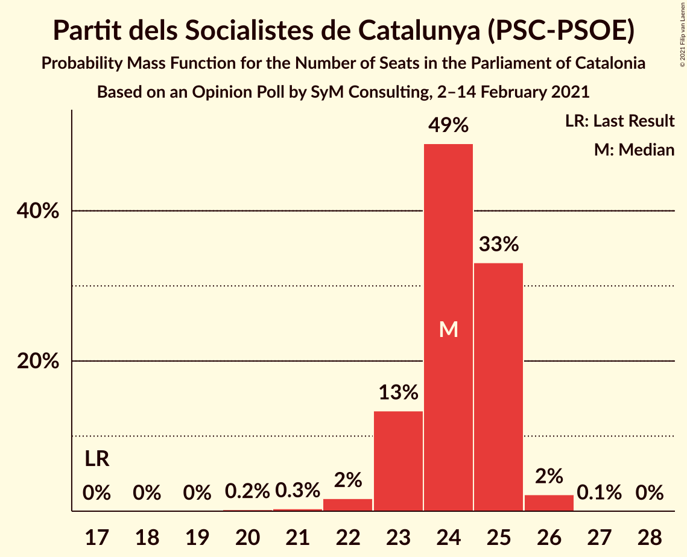
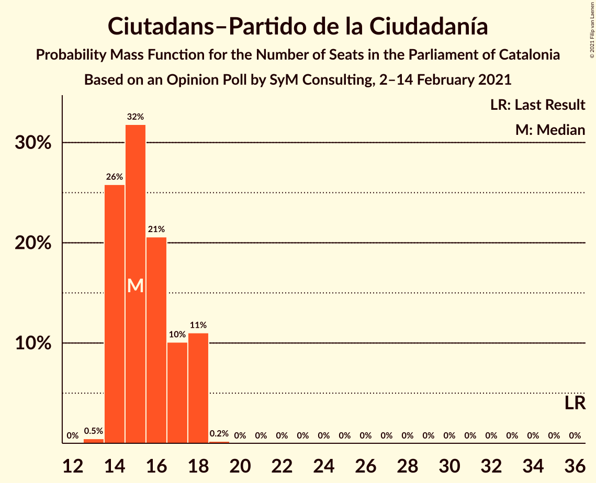
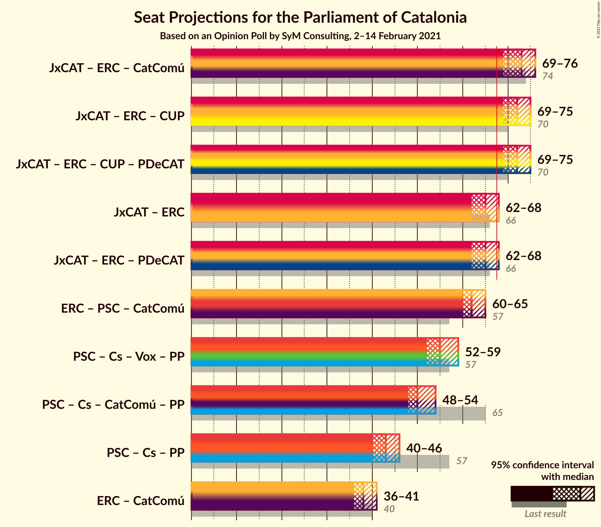

# Opinion Poll by SyM Consulting, 2–14 February 2021

<a href="#voting-intentions">Voting Intentions</a> | <a href="#seats">Seats</a> | <a href="#coalitions">Coalitions</a> | <a href="#technical-information">Technical Information</a>

## Voting Intentions

### Confidence Intervals

| Party | Last Result | Poll Result | 80% Confidence Interval | 90% Confidence Interval | 95% Confidence Interval | 99% Confidence Interval |
|:-----:|:-----------:|:-----------:|:-----------------------:|:-----------------------:|:-----------------------:|:-----------------------:|
| Junts per Catalunya | 21.7% | 22.1% | 21.2–23.1% |20.9–23.4% |20.7–23.6% |20.2–24.1% |
| Esquerra Republicana–Catalunya Sí | 21.4% | 20.6% | 19.7–21.6% |19.4–21.8% |19.2–22.1% |18.8–22.5% |
| Partit dels Socialistes de Catalunya (PSC-PSOE) | 13.9% | 17.8% | 16.9–18.7% |16.7–19.0% |16.5–19.2% |16.1–19.6% |
| Ciutadans–Partido de la Ciudadanía | 25.4% | 12.0% | 11.3–12.8% |11.1–13.0% |10.9–13.2% |10.5–13.6% |
| Vox | 0.0% | 9.4% | 8.8–10.1% |8.6–10.3% |8.4–10.5% |8.1–10.8% |
| Catalunya en Comú–Podem | 7.5% | 7.0% | 6.4–7.6% |6.3–7.8% |6.2–8.0% |5.9–8.3% |
| Candidatura d’Unitat Popular | 4.5% | 5.3% | 4.8–5.9% |4.7–6.0% |4.6–6.2% |4.3–6.4% |
| Partit Popular | 4.2% | 3.8% | 3.4–4.3% |3.3–4.4% |3.2–4.6% |3.0–4.8% |

*Note:* The poll result column reflects the actual value used in the calculations. Published results may vary slightly, and in addition be rounded to fewer digits.

## Seats

### Confidence Intervals

| Party | Last Result | Median | 80% Confidence Interval | 90% Confidence Interval | 95% Confidence Interval | 99% Confidence Interval |
|:-----:|:-----------:|:------:|:-----------------------:|:-----------------------:|:-----------------------:|:-----------------------:|
| <a href="#junts-per-catalunya">Junts per Catalunya</a> | 34 | 35 | 33–37 |32–37 |32–37 |32–38 |
| <a href="#esquerra-republicana–catalunya-sí">Esquerra Republicana–Catalunya Sí</a> | 32 | 29 | 29–31 |29–31 |28–32 |27–33 |
| <a href="#partit-dels-socialistes-de-catalunya-(psc-psoe)">Partit dels Socialistes de Catalunya (PSC-PSOE)</a> | 17 | 24 | 23–25 |23–25 |23–25 |21–26 |
| <a href="#ciutadans–partido-de-la-ciudadanía">Ciutadans–Partido de la Ciudadanía</a> | 36 | 15 | 14–18 |14–18 |14–18 |14–18 |
| <a href="#vox">Vox</a> | 0 | 12 | 12–13 |12–14 |12–14 |10–15 |
| <a href="#catalunya-en-comú–podem">Catalunya en Comú–Podem</a> | 8 | 8 | 7–8 |7–8 |7–9 |6–9 |
| <a href="#candidatura-d’unitat-popular">Candidatura d’Unitat Popular</a> | 4 | 7 | 6–8 |6–8 |6–8 |4–8 |
| <a href="#partit-popular">Partit Popular</a> | 4 | 3 | 3–4 |3–5 |2–5 |2–5 |

### Junts per Catalunya

*For a full overview of the results for this party, see the [Junts per Catalunya](party-juntspercatalunya.html) page.*

| Number of Seats | Probability | Accumulated | Special Marks |
|:---------------:|:-----------:|:-----------:|:-------------:|
| 31 | 0.2% | 100% |  |
| 32 | 5% | 99.8% |  |
| 33 | 9% | 95% |  |
| 34 | 18% | 86% | Last Result |
| 35 | 18% | 68% | Median |
| 36 | 19% | 49% |  |
| 37 | 30% | 31% |  |
| 38 | 1.2% | 1.2% |  |
| 39 | 0% | 0% |  |

### Esquerra Republicana–Catalunya Sí

*For a full overview of the results for this party, see the [Esquerra Republicana–Catalunya Sí](party-esquerrarepublicana–catalunyasí.html) page.*

| Number of Seats | Probability | Accumulated | Special Marks |
|:---------------:|:-----------:|:-----------:|:-------------:|
| 27 | 0.5% | 100% |  |
| 28 | 4% | 99.5% |  |
| 29 | 46% | 96% | Median |
| 30 | 8% | 49% |  |
| 31 | 36% | 41% |  |
| 32 | 3% | 4% | Last Result |
| 33 | 1.4% | 2% |  |
| 34 | 0.2% | 0.3% |  |
| 35 | 0% | 0% |  |

### Partit dels Socialistes de Catalunya (PSC-PSOE)

*For a full overview of the results for this party, see the [Partit dels Socialistes de Catalunya (PSC-PSOE)](party-partitdelssocialistesdecatalunyapsc-psoe.html) page.*

| Number of Seats | Probability | Accumulated | Special Marks |
|:---------------:|:-----------:|:-----------:|:-------------:|
| 17 | 0% | 100% | Last Result |
| 18 | 0% | 100% |  |
| 19 | 0% | 100% |  |
| 20 | 0.2% | 100% |  |
| 21 | 0.3% | 99.8% |  |
| 22 | 1.3% | 99.5% |  |
| 23 | 16% | 98% |  |
| 24 | 58% | 82% | Median |
| 25 | 22% | 23% |  |
| 26 | 1.3% | 1.3% |  |
| 27 | 0% | 0% |  |

### Ciutadans–Partido de la Ciudadanía

*For a full overview of the results for this party, see the [Ciutadans–Partido de la Ciudadanía](party-ciutadans–partidodelaciudadanía.html) page.*

| Number of Seats | Probability | Accumulated | Special Marks |
|:---------------:|:-----------:|:-----------:|:-------------:|
| 13 | 0.3% | 100% |  |
| 14 | 10% | 99.7% |  |
| 15 | 54% | 89% | Median |
| 16 | 8% | 35% |  |
| 17 | 5% | 27% |  |
| 18 | 22% | 22% |  |
| 19 | 0.1% | 0.1% |  |
| 20 | 0% | 0% |  |
| 21 | 0% | 0% |  |
| 22 | 0% | 0% |  |
| 23 | 0% | 0% |  |
| 24 | 0% | 0% |  |
| 25 | 0% | 0% |  |
| 26 | 0% | 0% |  |
| 27 | 0% | 0% |  |
| 28 | 0% | 0% |  |
| 29 | 0% | 0% |  |
| 30 | 0% | 0% |  |
| 31 | 0% | 0% |  |
| 32 | 0% | 0% |  |
| 33 | 0% | 0% |  |
| 34 | 0% | 0% |  |
| 35 | 0% | 0% |  |
| 36 | 0% | 0% | Last Result |

### Vox

*For a full overview of the results for this party, see the [Vox](party-vox.html) page.*

| Number of Seats | Probability | Accumulated | Special Marks |
|:---------------:|:-----------:|:-----------:|:-------------:|
| 0 | 0% | 100% | Last Result |
| 1 | 0% | 100% |  |
| 2 | 0% | 100% |  |
| 3 | 0% | 100% |  |
| 4 | 0% | 100% |  |
| 5 | 0% | 100% |  |
| 6 | 0% | 100% |  |
| 7 | 0% | 100% |  |
| 8 | 0% | 100% |  |
| 9 | 0% | 100% |  |
| 10 | 1.0% | 100% |  |
| 11 | 1.1% | 99.0% |  |
| 12 | 75% | 98% | Median |
| 13 | 18% | 23% |  |
| 14 | 4% | 5% |  |
| 15 | 0.5% | 0.5% |  |
| 16 | 0% | 0% |  |

### Catalunya en Comú–Podem

*For a full overview of the results for this party, see the [Catalunya en Comú–Podem](party-catalunyaencomú–podem.html) page.*

| Number of Seats | Probability | Accumulated | Special Marks |
|:---------------:|:-----------:|:-----------:|:-------------:|
| 5 | 0.2% | 100% |  |
| 6 | 2% | 99.8% |  |
| 7 | 35% | 98% |  |
| 8 | 59% | 63% | Last Result, Median |
| 9 | 4% | 4% |  |
| 10 | 0% | 0% |  |

### Candidatura d’Unitat Popular

*For a full overview of the results for this party, see the [Candidatura d’Unitat Popular](party-candidaturad’unitatpopular.html) page.*

| Number of Seats | Probability | Accumulated | Special Marks |
|:---------------:|:-----------:|:-----------:|:-------------:|
| 4 | 1.4% | 100% | Last Result |
| 5 | 1.0% | 98.5% |  |
| 6 | 20% | 98% |  |
| 7 | 58% | 77% | Median |
| 8 | 19% | 19% |  |
| 9 | 0.1% | 0.1% |  |
| 10 | 0% | 0% |  |

### Partit Popular

*For a full overview of the results for this party, see the [Partit Popular](party-partitpopular.html) page.*

| Number of Seats | Probability | Accumulated | Special Marks |
|:---------------:|:-----------:|:-----------:|:-------------:|
| 0 | 0.1% | 100% |  |
| 1 | 0% | 99.9% |  |
| 2 | 3% | 99.9% |  |
| 3 | 83% | 97% | Median |
| 4 | 6% | 14% | Last Result |
| 5 | 8% | 8% |  |
| 6 | 0.1% | 0.1% |  |
| 7 | 0% | 0% |  |

## Coalitions

### Confidence Intervals

| Coalition | Last Result | Median | Majority? | 80% Confidence Interval | 90% Confidence Interval | 95% Confidence Interval | 99% Confidence Interval |
|:---------:|:-----------:|:------:|:---------:|:-----------------------:|:-----------------------:|:-----------------------:|:-----------------------:|
| Junts per Catalunya – Esquerra Republicana–Catalunya Sí – Candidatura d’Unitat Popular | 70 | 73 | 99.9% | 70–74 | 69–74 | 69–75 | 68–76 |
| Junts per Catalunya – Esquerra Republicana–Catalunya Sí – Catalunya en Comú–Podem | 74 | 73 | 100% | 70–75 | 70–75 | 69–75 | 68–77 |
| Junts per Catalunya – Esquerra Republicana–Catalunya Sí | 66 | 66 | 8% | 63–67 | 63–68 | 62–68 | 61–69 |
| Esquerra Republicana–Catalunya Sí – Partit dels Socialistes de Catalunya (PSC-PSOE) – Catalunya en Comú–Podem | 57 | 61 | 0% | 60–63 | 60–63 | 60–64 | 59–65 |
| Partit dels Socialistes de Catalunya (PSC-PSOE) – Ciutadans–Partido de la Ciudadanía – Vox – Partit Popular | 57 | 55 | 0% | 54–58 | 53–58 | 53–59 | 51–60 |
| Partit dels Socialistes de Catalunya (PSC-PSOE) – Ciutadans–Partido de la Ciudadanía – Catalunya en Comú–Podem – Partit Popular | 65 | 50 | 0% | 49–53 | 48–53 | 48–54 | 47–55 |
| Partit dels Socialistes de Catalunya (PSC-PSOE) – Ciutadans–Partido de la Ciudadanía – Partit Popular | 57 | 43 | 0% | 41–45 | 41–46 | 41–46 | 40–47 |
| Esquerra Republicana–Catalunya Sí – Catalunya en Comú–Podem | 40 | 37 | 0% | 36–39 | 36–39 | 36–40 | 35–41 |

### Junts per Catalunya – Esquerra Republicana–Catalunya Sí – Candidatura d’Unitat Popular

| Number of Seats | Probability | Accumulated | Special Marks |
|:---------------:|:-----------:|:-----------:|:-------------:|
| 67 | 0.1% | 100% |  |
| 68 | 1.2% | 99.9% | Majority |
| 69 | 6% | 98.7% |  |
| 70 | 13% | 92% | Last Result |
| 71 | 10% | 79% | Median |
| 72 | 16% | 68% |  |
| 73 | 36% | 53% |  |
| 74 | 12% | 16% |  |
| 75 | 3% | 4% |  |
| 76 | 1.3% | 2% |  |
| 77 | 0.2% | 0.2% |  |
| 78 | 0% | 0% |  |

### Junts per Catalunya – Esquerra Republicana–Catalunya Sí – Catalunya en Comú–Podem

| Number of Seats | Probability | Accumulated | Special Marks |
|:---------------:|:-----------:|:-----------:|:-------------:|
| 68 | 1.2% | 100% | Majority |
| 69 | 1.4% | 98.8% |  |
| 70 | 8% | 97% |  |
| 71 | 12% | 90% |  |
| 72 | 10% | 77% | Median |
| 73 | 28% | 68% |  |
| 74 | 28% | 40% | Last Result |
| 75 | 10% | 12% |  |
| 76 | 1.0% | 2% |  |
| 77 | 0.7% | 0.8% |  |
| 78 | 0.1% | 0.1% |  |
| 79 | 0% | 0% |  |

### Junts per Catalunya – Esquerra Republicana–Catalunya Sí

| Number of Seats | Probability | Accumulated | Special Marks |
|:---------------:|:-----------:|:-----------:|:-------------:|
| 60 | 0.2% | 100% |  |
| 61 | 1.2% | 99.8% |  |
| 62 | 3% | 98.6% |  |
| 63 | 16% | 96% |  |
| 64 | 7% | 79% | Median |
| 65 | 22% | 72% |  |
| 66 | 35% | 50% | Last Result |
| 67 | 7% | 15% |  |
| 68 | 7% | 8% | Majority |
| 69 | 0.5% | 0.9% |  |
| 70 | 0.3% | 0.3% |  |
| 71 | 0% | 0% |  |

### Esquerra Republicana–Catalunya Sí – Partit dels Socialistes de Catalunya (PSC-PSOE) – Catalunya en Comú–Podem

| Number of Seats | Probability | Accumulated | Special Marks |
|:---------------:|:-----------:|:-----------:|:-------------:|
| 57 | 0% | 100% | Last Result |
| 58 | 0.1% | 100% |  |
| 59 | 0.6% | 99.9% |  |
| 60 | 18% | 99.3% |  |
| 61 | 37% | 81% | Median |
| 62 | 14% | 44% |  |
| 63 | 26% | 30% |  |
| 64 | 3% | 4% |  |
| 65 | 1.0% | 1.4% |  |
| 66 | 0.4% | 0.5% |  |
| 67 | 0.1% | 0.1% |  |
| 68 | 0% | 0% | Majority |

### Partit dels Socialistes de Catalunya (PSC-PSOE) – Ciutadans–Partido de la Ciudadanía – Vox – Partit Popular

| Number of Seats | Probability | Accumulated | Special Marks |
|:---------------:|:-----------:|:-----------:|:-------------:|
| 51 | 0.7% | 100% |  |
| 52 | 1.2% | 99.3% |  |
| 53 | 6% | 98% |  |
| 54 | 36% | 92% | Median |
| 55 | 18% | 56% |  |
| 56 | 17% | 38% |  |
| 57 | 7% | 21% | Last Result |
| 58 | 12% | 14% |  |
| 59 | 2% | 3% |  |
| 60 | 0.8% | 0.8% |  |
| 61 | 0% | 0% |  |

### Partit dels Socialistes de Catalunya (PSC-PSOE) – Ciutadans–Partido de la Ciudadanía – Catalunya en Comú–Podem – Partit Popular

| Number of Seats | Probability | Accumulated | Special Marks |
|:---------------:|:-----------:|:-----------:|:-------------:|
| 46 | 0.2% | 100% |  |
| 47 | 1.0% | 99.8% |  |
| 48 | 5% | 98.7% |  |
| 49 | 12% | 93% |  |
| 50 | 41% | 81% | Median |
| 51 | 11% | 41% |  |
| 52 | 16% | 29% |  |
| 53 | 9% | 14% |  |
| 54 | 4% | 4% |  |
| 55 | 0.7% | 0.7% |  |
| 56 | 0% | 0% |  |
| 57 | 0% | 0% |  |
| 58 | 0% | 0% |  |
| 59 | 0% | 0% |  |
| 60 | 0% | 0% |  |
| 61 | 0% | 0% |  |
| 62 | 0% | 0% |  |
| 63 | 0% | 0% |  |
| 64 | 0% | 0% |  |
| 65 | 0% | 0% | Last Result |

### Partit dels Socialistes de Catalunya (PSC-PSOE) – Ciutadans–Partido de la Ciudadanía – Partit Popular

| Number of Seats | Probability | Accumulated | Special Marks |
|:---------------:|:-----------:|:-----------:|:-------------:|
| 38 | 0% | 100% |  |
| 39 | 0.3% | 99.9% |  |
| 40 | 2% | 99.6% |  |
| 41 | 11% | 98% |  |
| 42 | 33% | 87% | Median |
| 43 | 22% | 54% |  |
| 44 | 13% | 32% |  |
| 45 | 15% | 20% |  |
| 46 | 4% | 5% |  |
| 47 | 0.4% | 0.9% |  |
| 48 | 0.5% | 0.5% |  |
| 49 | 0% | 0% |  |
| 50 | 0% | 0% |  |
| 51 | 0% | 0% |  |
| 52 | 0% | 0% |  |
| 53 | 0% | 0% |  |
| 54 | 0% | 0% |  |
| 55 | 0% | 0% |  |
| 56 | 0% | 0% |  |
| 57 | 0% | 0% | Last Result |

### Esquerra Republicana–Catalunya Sí – Catalunya en Comú–Podem

| Number of Seats | Probability | Accumulated | Special Marks |
|:---------------:|:-----------:|:-----------:|:-------------:|
| 34 | 0.1% | 100% |  |
| 35 | 2% | 99.9% |  |
| 36 | 14% | 98% |  |
| 37 | 35% | 85% | Median |
| 38 | 30% | 50% |  |
| 39 | 16% | 19% |  |
| 40 | 2% | 4% | Last Result |
| 41 | 0.8% | 1.1% |  |
| 42 | 0.2% | 0.2% |  |
| 43 | 0% | 0% |  |

## Technical Information

### Opinion Poll

+ **Polling firm:** SyM Consulting
+ **Commissioner(s):** —
+ **Fieldwork period:** 2–14 February 2021

### Calculations

+ **Sample size:** 3094
+ **Simulations done:** 131,072
+ **Error estimate:** 1.07%

