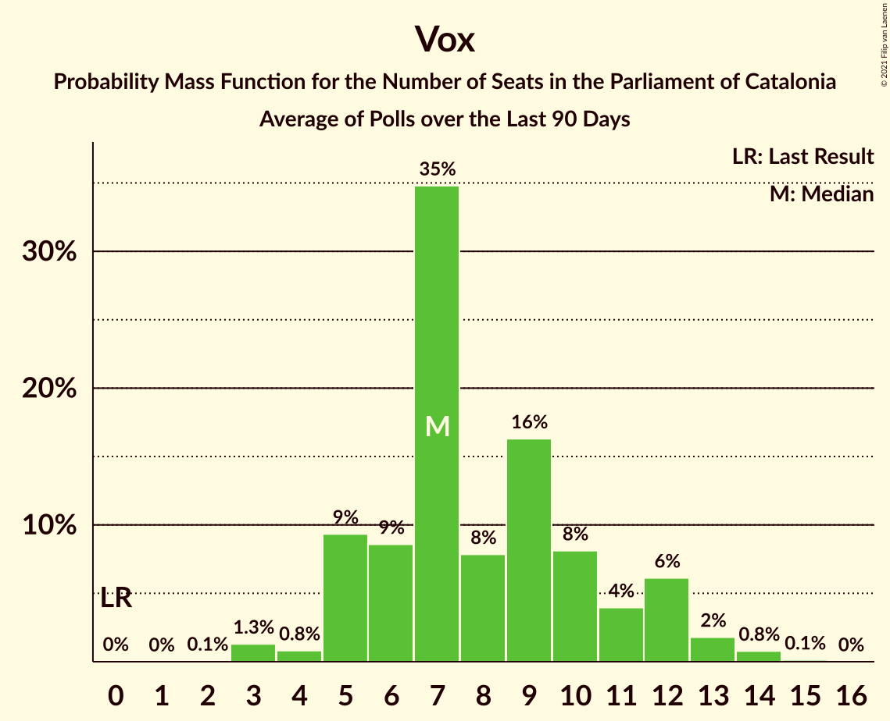

# Poll Average

<a href="#voting-intentions">Voting Intentions</a> | <a href="#seats">Seats</a> | <a href="#coalitions">Coalitions</a> | <a href="#technical-information">Technical Information</a>

## Summary

The table below lists the polls on which the average is based. They are the most recent polls (less than 90 days old) registered and analyzed so far.

| Period     | Polling firm/Commissioner(s) | Cs | JxCAT | ERC | PSC | CatComú | CUP | PP | Vox |
|:----------:|:----------------------------:|:--:|:--:|:--:|:--:|:--:|:--:|:--:|:--:|
| 21 December 2017 | General Election | 25.4%   36 | 21.7%   34 | 21.4%   32 | 13.9%   17 | 7.5%   8 | 4.5%   4 | 4.2%   4 | 0.0%   0 |
| N/A | Poll Average | 7–13%   8–18 | 14–22%   21–35 | 19–30%   28–45 | 16–23%   20–31 | 7–12%   7–14 | 4–9%   4–11 | 5–10%   5–14 | 3–8%   3–10 |
| [10 February–9 March 2020](2020-03-09-GESOP.html) | GESOP   CEO | N/A   N/A | N/A   N/A | N/A   N/A | N/A   N/A | N/A   N/A | N/A   N/A | N/A   N/A | N/A   N/A |
| [21–26 February 2020](2020-02-26-GAD3.html) | GAD3   ABC | 7–11%   8–14 | 13–18%   20–29 | 25–31%   37–48 | 18–24%   24–32 | 6–10%   7–13 | 4–7%   3–8 | 6–9%   7–12 | 3–6%   2–7 |
| [2 February 2020](2020-02-02-SocioMétrica.html) | SocioMétrica   El Español | 9–14%   10–18 | 15–22%   24–35 | 20–27%   28–40 | 16–23%   21–31 | 8–13%   8–16 | 4–9%   4–11 | 4–9%   4–11 | 3–7%   2–9 |
| [27–31 January 2020](2020-01-31-NCReport.html) | NC Report   La Razón | 8–13%   9–14 | 17–23%   26–36 | 18–24%   30–37 | 15–20%   19–26 | 6–10%   7–13 | 4–8%   4–9 | 7–11%   9–15 | 5–8%   5–10 |
| [27–29 January 2020](2020-01-29-electoPanel.html) | electoPanel   electomania.es | 6–9%   7–12 | 18–22%   29–35 | 19–23%   28–34 | 17–21%   24–28 | 7–10%   8–13 | 7–9%   8–13 | 7–10%   8–14 | 5–8%   6–9 |
| 21 December 2017 | General Election | 25.4%   36 | 21.7%   34 | 21.4%   32 | 13.9%   17 | 7.5%   8 | 4.5%   4 | 4.2%   4 | 0.0%   0 |

Only polls for which at least the sample size has been published are included in the table above.

**Legend:**
+ **Top half of each row:** Voting intentions (95% confidence interval)
+ **Bottom half of each row:** Seat projections for the Parliament of Catalonia (95% confidence interval)
+ **Cs:** Ciutadans–Partido de la Ciudadanía
+ **JxCAT:** Junts pel Catalunya
+ **ERC:** Esquerra Republicana–Catalunya Sí
+ **PSC:** Partit dels Socialistes de Catalunya (PSC-PSOE)
+ **CatComú:** Catalunya en Comú–Podem
+ **CUP:** Candidatura d’Unitat Popular
+ **PP:** Partit Popular
+ **Vox:** Vox
+ **N/A (single party):** Party not included the published results
+ **N/A (entire row):** Calculation for this opinion poll not started yet

## Voting Intentions

### Confidence Intervals

| Party | Last Result | Median | 80% Confidence Interval | 90% Confidence Interval | 95% Confidence Interval | 99% Confidence Interval |
|:-----:|:-----------:|:------:|:-----------------------:|:-----------------------:|:-----------------------:|:-----------------------:|
| <a href="#ciutadans–partido-de-la-ciudadanía">Ciutadans–Partido de la Ciudadanía</a> | 25.4% | 9.5% | 7.2–11.9% |6.9–12.5% | 6.6–13.1% | 6.1–14.2% |
| <a href="#junts-pel-catalunya">Junts pel Catalunya</a> | 21.7% | 18.9% | 15.1–21.1% |14.4–21.6% | 13.8–22.1% | 12.9–23.1% |
| <a href="#esquerra-republicana–catalunya-sí">Esquerra Republicana–Catalunya Sí</a> | 21.4% | 22.2% | 19.8–28.6% |19.3–29.5% | 18.8–30.2% | 17.9–31.5% |
| <a href="#partit-dels-socialistes-de-catalunya-(psc-psoe)">Partit dels Socialistes de Catalunya (PSC-PSOE)</a> | 13.9% | 19.3% | 16.8–21.7% |16.1–22.4% | 15.6–23.0% | 14.6–24.1% |
| <a href="#catalunya-en-comú–podem">Catalunya en Comú–Podem</a> | 7.5% | 8.8% | 7.4–10.6% |7.0–11.3% | 6.7–11.9% | 6.1–13.1% |
| <a href="#candidatura-d’unitat-popular">Candidatura d’Unitat Popular</a> | 4.5% | 6.2% | 4.6–8.1% |4.3–8.5% | 4.0–8.8% | 3.5–9.4% |
| <a href="#partit-popular">Partit Popular</a> | 4.2% | 7.9% | 5.9–9.5% |5.4–10.0% | 5.0–10.5% | 4.3–11.3% |
| <a href="#vox">Vox</a> | 0.0% | 5.6% | 4.0–7.0% |3.7–7.3% | 3.4–7.7% | 3.0–8.4% |

### Ciutadans–Partido de la Ciudadanía

*For a full overview of the results for this party, see the [Ciutadans–Partido de la Ciudadanía](party-ciutadans–partidodelaciudadanía.html) page.*

| Voting Intentions | Probability | Accumulated | Special Marks |
|:-----------------:|:-----------:|:-----------:|:-------------:|
| 4.5–5.5% | 0% | 100% |  |
| 5.5–6.5% | 2% | 100% |  |
| 6.5–7.5% | 14% | 98% |  |
| 7.5–8.5% | 18% | 84% |  |
| 8.5–9.5% | 18% | 66% | Median |
| 9.5–10.5% | 19% | 48% |  |
| 10.5–11.5% | 16% | 29% |  |
| 11.5–12.5% | 9% | 13% |  |
| 12.5–13.5% | 4% | 5% |  |
| 13.5–14.5% | 1.1% | 1.4% |  |
| 14.5–15.5% | 0.2% | 0.3% |  |
| 15.5–16.5% | 0% | 0.1% |  |
| 16.5–17.5% | 0% | 0% |  |
| 17.5–18.5% | 0% | 0% |  |
| 18.5–19.5% | 0% | 0% |  |
| 19.5–20.5% | 0% | 0% |  |
| 20.5–21.5% | 0% | 0% |  |
| 21.5–22.5% | 0% | 0% |  |
| 22.5–23.5% | 0% | 0% |  |
| 23.5–24.5% | 0% | 0% |  |
| 24.5–25.5% | 0% | 0% | Last Result |

### Junts pel Catalunya

*For a full overview of the results for this party, see the [Junts pel Catalunya](party-juntspelcatalunya.html) page.*

| Voting Intentions | Probability | Accumulated | Special Marks |
|:-----------------:|:-----------:|:-----------:|:-------------:|
| 10.5–11.5% | 0% | 100% |  |
| 11.5–12.5% | 0.2% | 100% |  |
| 12.5–13.5% | 1.4% | 99.8% |  |
| 13.5–14.5% | 5% | 98% |  |
| 14.5–15.5% | 8% | 94% |  |
| 15.5–16.5% | 9% | 86% |  |
| 16.5–17.5% | 9% | 77% |  |
| 17.5–18.5% | 12% | 68% |  |
| 18.5–19.5% | 18% | 56% | Median |
| 19.5–20.5% | 20% | 37% |  |
| 20.5–21.5% | 12% | 18% |  |
| 21.5–22.5% | 4% | 6% | Last Result |
| 22.5–23.5% | 1.0% | 1.2% |  |
| 23.5–24.5% | 0.2% | 0.2% |  |
| 24.5–25.5% | 0% | 0% |  |

### Esquerra Republicana–Catalunya Sí

*For a full overview of the results for this party, see the [Esquerra Republicana–Catalunya Sí](party-esquerrarepublicana–catalunyasí.html) page.*

| Voting Intentions | Probability | Accumulated | Special Marks |
|:-----------------:|:-----------:|:-----------:|:-------------:|
| 15.5–16.5% | 0% | 100% |  |
| 16.5–17.5% | 0.2% | 100% |  |
| 17.5–18.5% | 1.4% | 99.8% |  |
| 18.5–19.5% | 6% | 98% |  |
| 19.5–20.5% | 14% | 92% |  |
| 20.5–21.5% | 18% | 78% | Last Result |
| 21.5–22.5% | 14% | 60% | Median |
| 22.5–23.5% | 9% | 45% |  |
| 23.5–24.5% | 6% | 36% |  |
| 24.5–25.5% | 4% | 31% |  |
| 25.5–26.5% | 4% | 26% |  |
| 26.5–27.5% | 6% | 22% |  |
| 27.5–28.5% | 6% | 16% |  |
| 28.5–29.5% | 5% | 10% |  |
| 29.5–30.5% | 3% | 5% |  |
| 30.5–31.5% | 1.3% | 2% |  |
| 31.5–32.5% | 0.4% | 0.5% |  |
| 32.5–33.5% | 0.1% | 0.1% |  |
| 33.5–34.5% | 0% | 0% |  |

### Partit dels Socialistes de Catalunya (PSC-PSOE)

*For a full overview of the results for this party, see the [Partit dels Socialistes de Catalunya (PSC-PSOE)](party-partitdelssocialistesdecatalunyapsc-psoe.html) page.*

| Voting Intentions | Probability | Accumulated | Special Marks |
|:-----------------:|:-----------:|:-----------:|:-------------:|
| 12.5–13.5% | 0% | 100% |  |
| 13.5–14.5% | 0.4% | 100% | Last Result |
| 14.5–15.5% | 2% | 99.6% |  |
| 15.5–16.5% | 5% | 98% |  |
| 16.5–17.5% | 10% | 92% |  |
| 17.5–18.5% | 16% | 82% |  |
| 18.5–19.5% | 21% | 67% | Median |
| 19.5–20.5% | 20% | 45% |  |
| 20.5–21.5% | 14% | 25% |  |
| 21.5–22.5% | 7% | 11% |  |
| 22.5–23.5% | 3% | 4% |  |
| 23.5–24.5% | 0.9% | 1.1% |  |
| 24.5–25.5% | 0.2% | 0.2% |  |
| 25.5–26.5% | 0% | 0% |  |

### Catalunya en Comú–Podem

*For a full overview of the results for this party, see the [Catalunya en Comú–Podem](party-catalunyaencomú–podem.html) page.*

| Voting Intentions | Probability | Accumulated | Special Marks |
|:-----------------:|:-----------:|:-----------:|:-------------:|
| 4.5–5.5% | 0.1% | 100% |  |
| 5.5–6.5% | 2% | 99.9% |  |
| 6.5–7.5% | 11% | 98% | Last Result |
| 7.5–8.5% | 29% | 87% |  |
| 8.5–9.5% | 32% | 58% | Median |
| 9.5–10.5% | 16% | 26% |  |
| 10.5–11.5% | 7% | 11% |  |
| 11.5–12.5% | 3% | 4% |  |
| 12.5–13.5% | 0.9% | 1.1% |  |
| 13.5–14.5% | 0.2% | 0.2% |  |
| 14.5–15.5% | 0% | 0% |  |

### Candidatura d’Unitat Popular

*For a full overview of the results for this party, see the [Candidatura d’Unitat Popular](party-candidaturad’unitatpopular.html) page.*

| Voting Intentions | Probability | Accumulated | Special Marks |
|:-----------------:|:-----------:|:-----------:|:-------------:|
| 1.5–2.5% | 0% | 100% |  |
| 2.5–3.5% | 0.6% | 100% |  |
| 3.5–4.5% | 9% | 99.4% | Last Result |
| 4.5–5.5% | 23% | 91% |  |
| 5.5–6.5% | 25% | 68% | Median |
| 6.5–7.5% | 21% | 43% |  |
| 7.5–8.5% | 17% | 22% |  |
| 8.5–9.5% | 4% | 5% |  |
| 9.5–10.5% | 0.3% | 0.4% |  |
| 10.5–11.5% | 0% | 0% |  |

### Partit Popular

*For a full overview of the results for this party, see the [Partit Popular](party-partitpopular.html) page.*

| Voting Intentions | Probability | Accumulated | Special Marks |
|:-----------------:|:-----------:|:-----------:|:-------------:|
| 2.5–3.5% | 0% | 100% |  |
| 3.5–4.5% | 0.9% | 100% | Last Result |
| 4.5–5.5% | 5% | 99.1% |  |
| 5.5–6.5% | 13% | 94% |  |
| 6.5–7.5% | 21% | 80% |  |
| 7.5–8.5% | 28% | 59% | Median |
| 8.5–9.5% | 21% | 31% |  |
| 9.5–10.5% | 8% | 10% |  |
| 10.5–11.5% | 2% | 2% |  |
| 11.5–12.5% | 0.3% | 0.3% |  |
| 12.5–13.5% | 0% | 0% |  |

### Vox

*For a full overview of the results for this party, see the [Vox](party-vox.html) page.*

| Voting Intentions | Probability | Accumulated | Special Marks |
|:-----------------:|:-----------:|:-----------:|:-------------:|
| 0.0–0.5% | 0% | 100% | Last Result |
| 0.5–1.5% | 0% | 100% |  |
| 1.5–2.5% | 0.1% | 100% |  |
| 2.5–3.5% | 4% | 99.9% |  |
| 3.5–4.5% | 19% | 96% |  |
| 4.5–5.5% | 26% | 77% |  |
| 5.5–6.5% | 32% | 51% | Median |
| 6.5–7.5% | 16% | 19% |  |
| 7.5–8.5% | 3% | 3% |  |
| 8.5–9.5% | 0.3% | 0.3% |  |
| 9.5–10.5% | 0% | 0% |  |

## Seats

### Confidence Intervals

| Party | Last Result | Median | 80% Confidence Interval | 90% Confidence Interval | 95% Confidence Interval | 99% Confidence Interval |
|:-----:|:-----------:|:------:|:-----------------------:|:-----------------------:|:-----------------------:|:-----------------------:|
| <a href="#ciutadans–partido-de-la-ciudadanía">Ciutadans–Partido de la Ciudadanía</a> | 36 | 12 | 8–15 |8–16 | 8–18 | 7–19 |
| <a href="#junts-pel-catalunya">Junts pel Catalunya</a> | 34 | 29 | 23–33 |23–34 | 21–35 | 20–36 |
| <a href="#esquerra-republicana–catalunya-sí">Esquerra Republicana–Catalunya Sí</a> | 32 | 34 | 30–43 |29–45 | 28–45 | 27–48 |
| <a href="#partit-dels-socialistes-de-catalunya-(psc-psoe)">Partit dels Socialistes de Catalunya (PSC-PSOE)</a> | 17 | 25 | 22–30 |21–30 | 20–31 | 18–33 |
| <a href="#catalunya-en-comú–podem">Catalunya en Comú–Podem</a> | 8 | 10 | 8–13 |8–14 | 7–14 | 6–17 |
| <a href="#candidatura-d’unitat-popular">Candidatura d’Unitat Popular</a> | 4 | 8 | 4–11 |4–11 | 4–11 | 3–13 |
| <a href="#partit-popular">Partit Popular</a> | 4 | 10 | 7–12 |6–13 | 5–14 | 4–15 |
| <a href="#vox">Vox</a> | 0 | 7 | 3–8 |3–9 | 3–10 | 2–11 |

### Ciutadans–Partido de la Ciudadanía

*For a full overview of the results for this party, see the [Ciutadans–Partido de la Ciudadanía](party-ciutadans–partidodelaciudadanía.html) page.*

| Number of Seats | Probability | Accumulated | Special Marks |
|:---------------:|:-----------:|:-----------:|:-------------:|
| 6 | 0.2% | 100% |  |
| 7 | 1.2% | 99.7% |  |
| 8 | 12% | 98.5% |  |
| 9 | 9% | 86% |  |
| 10 | 7% | 77% |  |
| 11 | 7% | 70% |  |
| 12 | 25% | 63% | Median |
| 13 | 20% | 39% |  |
| 14 | 8% | 19% |  |
| 15 | 4% | 11% |  |
| 16 | 2% | 7% |  |
| 17 | 1.5% | 4% |  |
| 18 | 2% | 3% |  |
| 19 | 0.5% | 0.6% |  |
| 20 | 0.1% | 0.1% |  |
| 21 | 0% | 0% |  |
| 22 | 0% | 0% |  |
| 23 | 0% | 0% |  |
| 24 | 0% | 0% |  |
| 25 | 0% | 0% |  |
| 26 | 0% | 0% |  |
| 27 | 0% | 0% |  |
| 28 | 0% | 0% |  |
| 29 | 0% | 0% |  |
| 30 | 0% | 0% |  |
| 31 | 0% | 0% |  |
| 32 | 0% | 0% |  |
| 33 | 0% | 0% |  |
| 34 | 0% | 0% |  |
| 35 | 0% | 0% |  |
| 36 | 0% | 0% | Last Result |

### Junts pel Catalunya

*For a full overview of the results for this party, see the [Junts pel Catalunya](party-juntspelcatalunya.html) page.*

| Number of Seats | Probability | Accumulated | Special Marks |
|:---------------:|:-----------:|:-----------:|:-------------:|
| 18 | 0.2% | 100% |  |
| 19 | 0.2% | 99.8% |  |
| 20 | 2% | 99.6% |  |
| 21 | 1.2% | 98% |  |
| 22 | 1.4% | 97% |  |
| 23 | 8% | 95% |  |
| 24 | 5% | 87% |  |
| 25 | 6% | 82% |  |
| 26 | 6% | 76% |  |
| 27 | 4% | 70% |  |
| 28 | 6% | 66% |  |
| 29 | 9% | 59% | Median |
| 30 | 9% | 50% |  |
| 31 | 16% | 40% |  |
| 32 | 13% | 24% |  |
| 33 | 6% | 11% |  |
| 34 | 3% | 5% | Last Result |
| 35 | 1.0% | 3% |  |
| 36 | 1.1% | 2% |  |
| 37 | 0.4% | 0.5% |  |
| 38 | 0.1% | 0.1% |  |
| 39 | 0% | 0% |  |

### Esquerra Republicana–Catalunya Sí

*For a full overview of the results for this party, see the [Esquerra Republicana–Catalunya Sí](party-esquerrarepublicana–catalunyasí.html) page.*

| Number of Seats | Probability | Accumulated | Special Marks |
|:---------------:|:-----------:|:-----------:|:-------------:|
| 25 | 0.1% | 100% |  |
| 26 | 0.2% | 99.9% |  |
| 27 | 0.6% | 99.8% |  |
| 28 | 3% | 99.2% |  |
| 29 | 5% | 96% |  |
| 30 | 7% | 91% |  |
| 31 | 10% | 85% |  |
| 32 | 14% | 75% | Last Result |
| 33 | 7% | 60% |  |
| 34 | 10% | 54% | Median |
| 35 | 8% | 44% |  |
| 36 | 5% | 35% |  |
| 37 | 3% | 30% |  |
| 38 | 2% | 27% |  |
| 39 | 2% | 25% |  |
| 40 | 3% | 23% |  |
| 41 | 4% | 20% |  |
| 42 | 4% | 16% |  |
| 43 | 5% | 13% |  |
| 44 | 3% | 8% |  |
| 45 | 4% | 6% |  |
| 46 | 0.9% | 2% |  |
| 47 | 0.6% | 1.4% |  |
| 48 | 0.4% | 0.8% |  |
| 49 | 0.2% | 0.4% |  |
| 50 | 0.1% | 0.2% |  |
| 51 | 0% | 0% |  |

### Partit dels Socialistes de Catalunya (PSC-PSOE)

*For a full overview of the results for this party, see the [Partit dels Socialistes de Catalunya (PSC-PSOE)](party-partitdelssocialistesdecatalunyapsc-psoe.html) page.*

| Number of Seats | Probability | Accumulated | Special Marks |
|:---------------:|:-----------:|:-----------:|:-------------:|
| 17 | 0.2% | 100% | Last Result |
| 18 | 0.3% | 99.7% |  |
| 19 | 0.9% | 99.4% |  |
| 20 | 2% | 98.5% |  |
| 21 | 4% | 97% |  |
| 22 | 5% | 93% |  |
| 23 | 6% | 88% |  |
| 24 | 13% | 82% |  |
| 25 | 22% | 69% | Median |
| 26 | 18% | 47% |  |
| 27 | 8% | 30% |  |
| 28 | 8% | 21% |  |
| 29 | 3% | 13% |  |
| 30 | 6% | 10% |  |
| 31 | 3% | 4% |  |
| 32 | 0.6% | 1.3% |  |
| 33 | 0.4% | 0.6% |  |
| 34 | 0.2% | 0.3% |  |
| 35 | 0% | 0% |  |

### Catalunya en Comú–Podem

*For a full overview of the results for this party, see the [Catalunya en Comú–Podem](party-catalunyaencomú–podem.html) page.*

| Number of Seats | Probability | Accumulated | Special Marks |
|:---------------:|:-----------:|:-----------:|:-------------:|
| 5 | 0.2% | 100% |  |
| 6 | 0.8% | 99.8% |  |
| 7 | 2% | 99.0% |  |
| 8 | 17% | 97% | Last Result |
| 9 | 17% | 79% |  |
| 10 | 18% | 62% | Median |
| 11 | 25% | 45% |  |
| 12 | 6% | 19% |  |
| 13 | 7% | 14% |  |
| 14 | 4% | 7% |  |
| 15 | 0.9% | 2% |  |
| 16 | 0.9% | 1.4% |  |
| 17 | 0.4% | 0.5% |  |
| 18 | 0.1% | 0.1% |  |
| 19 | 0% | 0% |  |

### Candidatura d’Unitat Popular

*For a full overview of the results for this party, see the [Candidatura d’Unitat Popular](party-candidaturad’unitatpopular.html) page.*

| Number of Seats | Probability | Accumulated | Special Marks |
|:---------------:|:-----------:|:-----------:|:-------------:|
| 0 | 0.1% | 100% |  |
| 1 | 0% | 99.9% |  |
| 2 | 0.2% | 99.9% |  |
| 3 | 0.6% | 99.7% |  |
| 4 | 10% | 99.1% | Last Result |
| 5 | 5% | 89% |  |
| 6 | 8% | 84% |  |
| 7 | 21% | 75% |  |
| 8 | 22% | 54% | Median |
| 9 | 15% | 32% |  |
| 10 | 5% | 17% |  |
| 11 | 11% | 12% |  |
| 12 | 0.8% | 2% |  |
| 13 | 1.0% | 1.1% |  |
| 14 | 0.1% | 0.1% |  |
| 15 | 0% | 0% |  |

### Partit Popular

*For a full overview of the results for this party, see the [Partit Popular](party-partitpopular.html) page.*

| Number of Seats | Probability | Accumulated | Special Marks |
|:---------------:|:-----------:|:-----------:|:-------------:|
| 3 | 0.3% | 100% |  |
| 4 | 0.4% | 99.7% | Last Result |
| 5 | 2% | 99.3% |  |
| 6 | 3% | 97% |  |
| 7 | 14% | 94% |  |
| 8 | 4% | 80% |  |
| 9 | 18% | 76% |  |
| 10 | 17% | 57% | Median |
| 11 | 16% | 41% |  |
| 12 | 17% | 25% |  |
| 13 | 4% | 8% |  |
| 14 | 2% | 4% |  |
| 15 | 1.2% | 1.4% |  |
| 16 | 0.1% | 0.2% |  |
| 17 | 0% | 0% |  |

### Vox

*For a full overview of the results for this party, see the [Vox](party-vox.html) page.*

| Number of Seats | Probability | Accumulated | Special Marks |
|:---------------:|:-----------:|:-----------:|:-------------:|
| 0 | 0.4% | 100% | Last Result |
| 1 | 0% | 99.6% |  |
| 2 | 1.4% | 99.6% |  |
| 3 | 12% | 98% |  |
| 4 | 6% | 86% |  |
| 5 | 16% | 80% |  |
| 6 | 11% | 64% |  |
| 7 | 32% | 53% | Median |
| 8 | 11% | 21% |  |
| 9 | 7% | 10% |  |
| 10 | 2% | 3% |  |
| 11 | 0.4% | 0.6% |  |
| 12 | 0.2% | 0.2% |  |
| 13 | 0% | 0% |  |

## Coalitions

### Confidence Intervals

| Coalition | Last Result | Median | Majority? | 80% Confidence Interval | 90% Confidence Interval | 95% Confidence Interval | 99% Confidence Interval |
|:---------:|:-----------:|:------:|:---------:|:-----------------------:|:-----------------------:|:-----------------------:|:-----------------------:|
| Esquerra Republicana–Catalunya Sí – Partit dels Socialistes de Catalunya (PSC-PSOE) – Catalunya en Comú–Podem | 57 | 69 | 62% | 65–80 | 64–82 | 63–84 | 61–86 |
| Junts pel Catalunya – Esquerra Republicana–Catalunya Sí – Catalunya en Comú–Podem | 74 | 74 | 99.0% | 71–78 | 69–79 | 69–80 | 67–83 |
| Junts pel Catalunya – Esquerra Republicana–Catalunya Sí – Candidatura d’Unitat Popular | 70 | 72 | 91% | 68–75 | 66–76 | 65–78 | 63–79 |
| Junts pel Catalunya – Esquerra Republicana–Catalunya Sí | 66 | 64 | 11% | 60–68 | 58–69 | 58–70 | 55–73 |
| Ciutadans–Partido de la Ciudadanía – Partit dels Socialistes de Catalunya (PSC-PSOE) – Catalunya en Comú–Podem – Partit Popular | 65 | 57 | 0.2% | 54–61 | 53–63 | 52–64 | 51–66 |
| Ciutadans–Partido de la Ciudadanía – Partit dels Socialistes de Catalunya (PSC-PSOE) – Partit Popular – Vox | 57 | 53 | 0% | 50–57 | 48–58 | 48–59 | 46–60 |
| Esquerra Republicana–Catalunya Sí – Catalunya en Comú–Podem | 40 | 44 | 0% | 40–53 | 39–55 | 38–56 | 37–57 |
| Ciutadans–Partido de la Ciudadanía – Partit dels Socialistes de Catalunya (PSC-PSOE) – Partit Popular | 57 | 47 | 0% | 44–51 | 43–52 | 42–53 | 40–55 |

### Esquerra Republicana–Catalunya Sí – Partit dels Socialistes de Catalunya (PSC-PSOE) – Catalunya en Comú–Podem

| Number of Seats | Probability | Accumulated | Special Marks |
|:---------------:|:-----------:|:-----------:|:-------------:|
| 57 | 0% | 100% | Last Result |
| 58 | 0% | 100% |  |
| 59 | 0.1% | 99.9% |  |
| 60 | 0.3% | 99.8% |  |
| 61 | 0.7% | 99.5% |  |
| 62 | 0.7% | 98.8% |  |
| 63 | 2% | 98% |  |
| 64 | 5% | 96% |  |
| 65 | 8% | 91% |  |
| 66 | 12% | 83% |  |
| 67 | 9% | 71% |  |
| 68 | 10% | 62% | Majority |
| 69 | 8% | 52% | Median |
| 70 | 3% | 45% |  |
| 71 | 5% | 42% |  |
| 72 | 4% | 37% |  |
| 73 | 2% | 33% |  |
| 74 | 2% | 31% |  |
| 75 | 2% | 29% |  |
| 76 | 3% | 27% |  |
| 77 | 3% | 24% |  |
| 78 | 3% | 21% |  |
| 79 | 4% | 18% |  |
| 80 | 4% | 14% |  |
| 81 | 3% | 10% |  |
| 82 | 4% | 7% |  |
| 83 | 1.0% | 4% |  |
| 84 | 2% | 3% |  |
| 85 | 0.5% | 1.0% |  |
| 86 | 0.3% | 0.5% |  |
| 87 | 0.1% | 0.2% |  |
| 88 | 0.1% | 0.1% |  |
| 89 | 0% | 0% |  |

### Junts pel Catalunya – Esquerra Republicana–Catalunya Sí – Catalunya en Comú–Podem

| Number of Seats | Probability | Accumulated | Special Marks |
|:---------------:|:-----------:|:-----------:|:-------------:|
| 64 | 0% | 100% |  |
| 65 | 0.1% | 99.9% |  |
| 66 | 0.2% | 99.9% |  |
| 67 | 0.7% | 99.7% |  |
| 68 | 1.3% | 99.0% | Majority |
| 69 | 3% | 98% |  |
| 70 | 4% | 94% |  |
| 71 | 11% | 90% |  |
| 72 | 11% | 79% |  |
| 73 | 13% | 68% | Median |
| 74 | 13% | 55% | Last Result |
| 75 | 12% | 41% |  |
| 76 | 8% | 29% |  |
| 77 | 7% | 21% |  |
| 78 | 6% | 14% |  |
| 79 | 4% | 8% |  |
| 80 | 2% | 4% |  |
| 81 | 1.3% | 2% |  |
| 82 | 0.5% | 1.1% |  |
| 83 | 0.2% | 0.5% |  |
| 84 | 0.2% | 0.3% |  |
| 85 | 0.1% | 0.1% |  |
| 86 | 0% | 0% |  |

### Junts pel Catalunya – Esquerra Republicana–Catalunya Sí – Candidatura d’Unitat Popular

| Number of Seats | Probability | Accumulated | Special Marks |
|:---------------:|:-----------:|:-----------:|:-------------:|
| 60 | 0.1% | 100% |  |
| 61 | 0% | 99.9% |  |
| 62 | 0.1% | 99.9% |  |
| 63 | 0.3% | 99.7% |  |
| 64 | 0.6% | 99.4% |  |
| 65 | 2% | 98.8% |  |
| 66 | 3% | 97% |  |
| 67 | 3% | 94% |  |
| 68 | 5% | 91% | Majority |
| 69 | 10% | 86% |  |
| 70 | 9% | 77% | Last Result |
| 71 | 16% | 68% | Median |
| 72 | 16% | 52% |  |
| 73 | 15% | 35% |  |
| 74 | 10% | 21% |  |
| 75 | 5% | 11% |  |
| 76 | 2% | 6% |  |
| 77 | 2% | 4% |  |
| 78 | 2% | 3% |  |
| 79 | 0.8% | 1.0% |  |
| 80 | 0.1% | 0.2% |  |
| 81 | 0% | 0.1% |  |
| 82 | 0% | 0% |  |

### Junts pel Catalunya – Esquerra Republicana–Catalunya Sí

| Number of Seats | Probability | Accumulated | Special Marks |
|:---------------:|:-----------:|:-----------:|:-------------:|
| 53 | 0.1% | 100% |  |
| 54 | 0.1% | 99.9% |  |
| 55 | 0.3% | 99.7% |  |
| 56 | 0.4% | 99.4% |  |
| 57 | 1.3% | 99.1% |  |
| 58 | 3% | 98% |  |
| 59 | 4% | 95% |  |
| 60 | 5% | 91% |  |
| 61 | 9% | 86% |  |
| 62 | 11% | 77% |  |
| 63 | 14% | 66% | Median |
| 64 | 12% | 53% |  |
| 65 | 11% | 41% |  |
| 66 | 11% | 29% | Last Result |
| 67 | 6% | 18% |  |
| 68 | 4% | 11% | Majority |
| 69 | 3% | 7% |  |
| 70 | 2% | 4% |  |
| 71 | 0.9% | 2% |  |
| 72 | 0.6% | 1.3% |  |
| 73 | 0.3% | 0.6% |  |
| 74 | 0.1% | 0.3% |  |
| 75 | 0.2% | 0.2% |  |
| 76 | 0% | 0% |  |

### Ciutadans–Partido de la Ciudadanía – Partit dels Socialistes de Catalunya (PSC-PSOE) – Catalunya en Comú–Podem – Partit Popular

| Number of Seats | Probability | Accumulated | Special Marks |
|:---------------:|:-----------:|:-----------:|:-------------:|
| 48 | 0.1% | 100% |  |
| 49 | 0.1% | 99.9% |  |
| 50 | 0.3% | 99.8% |  |
| 51 | 0.8% | 99.6% |  |
| 52 | 2% | 98.7% |  |
| 53 | 4% | 97% |  |
| 54 | 10% | 92% |  |
| 55 | 10% | 82% |  |
| 56 | 13% | 72% |  |
| 57 | 13% | 59% | Median |
| 58 | 12% | 47% |  |
| 59 | 12% | 35% |  |
| 60 | 8% | 23% |  |
| 61 | 5% | 14% |  |
| 62 | 4% | 9% |  |
| 63 | 2% | 5% |  |
| 64 | 2% | 4% |  |
| 65 | 1.0% | 2% | Last Result |
| 66 | 0.5% | 0.9% |  |
| 67 | 0.2% | 0.4% |  |
| 68 | 0.1% | 0.2% | Majority |
| 69 | 0.1% | 0.1% |  |
| 70 | 0% | 0% |  |

### Ciutadans–Partido de la Ciudadanía – Partit dels Socialistes de Catalunya (PSC-PSOE) – Partit Popular – Vox

| Number of Seats | Probability | Accumulated | Special Marks |
|:---------------:|:-----------:|:-----------:|:-------------:|
| 43 | 0% | 100% |  |
| 44 | 0.1% | 99.9% |  |
| 45 | 0.2% | 99.8% |  |
| 46 | 0.6% | 99.6% |  |
| 47 | 1.4% | 99.0% |  |
| 48 | 4% | 98% |  |
| 49 | 3% | 94% |  |
| 50 | 6% | 91% |  |
| 51 | 9% | 85% |  |
| 52 | 14% | 76% |  |
| 53 | 17% | 62% |  |
| 54 | 12% | 45% | Median |
| 55 | 12% | 33% |  |
| 56 | 8% | 20% |  |
| 57 | 5% | 13% | Last Result |
| 58 | 3% | 7% |  |
| 59 | 3% | 4% |  |
| 60 | 1.0% | 2% |  |
| 61 | 0.3% | 0.5% |  |
| 62 | 0.2% | 0.2% |  |
| 63 | 0.1% | 0.1% |  |
| 64 | 0% | 0% |  |

### Esquerra Republicana–Catalunya Sí – Catalunya en Comú–Podem

| Number of Seats | Probability | Accumulated | Special Marks |
|:---------------:|:-----------:|:-----------:|:-------------:|
| 34 | 0% | 100% |  |
| 35 | 0.1% | 99.9% |  |
| 36 | 0.3% | 99.9% |  |
| 37 | 0.5% | 99.6% |  |
| 38 | 3% | 99.0% |  |
| 39 | 4% | 96% |  |
| 40 | 9% | 92% | Last Result |
| 41 | 9% | 84% |  |
| 42 | 6% | 74% |  |
| 43 | 12% | 68% |  |
| 44 | 8% | 56% | Median |
| 45 | 7% | 48% |  |
| 46 | 5% | 41% |  |
| 47 | 4% | 36% |  |
| 48 | 3% | 32% |  |
| 49 | 5% | 29% |  |
| 50 | 4% | 24% |  |
| 51 | 6% | 19% |  |
| 52 | 4% | 14% |  |
| 53 | 3% | 10% |  |
| 54 | 2% | 7% |  |
| 55 | 2% | 5% |  |
| 56 | 2% | 3% |  |
| 57 | 0.6% | 1.1% |  |
| 58 | 0.2% | 0.5% |  |
| 59 | 0.2% | 0.3% |  |
| 60 | 0% | 0.1% |  |
| 61 | 0% | 0% |  |

### Ciutadans–Partido de la Ciudadanía – Partit dels Socialistes de Catalunya (PSC-PSOE) – Partit Popular

| Number of Seats | Probability | Accumulated | Special Marks |
|:---------------:|:-----------:|:-----------:|:-------------:|
| 38 | 0.1% | 100% |  |
| 39 | 0.1% | 99.9% |  |
| 40 | 0.5% | 99.8% |  |
| 41 | 0.8% | 99.3% |  |
| 42 | 2% | 98% |  |
| 43 | 5% | 97% |  |
| 44 | 8% | 92% |  |
| 45 | 15% | 84% |  |
| 46 | 13% | 69% |  |
| 47 | 11% | 56% | Median |
| 48 | 16% | 45% |  |
| 49 | 9% | 29% |  |
| 50 | 8% | 21% |  |
| 51 | 6% | 13% |  |
| 52 | 4% | 7% |  |
| 53 | 1.4% | 3% |  |
| 54 | 0.8% | 1.4% |  |
| 55 | 0.3% | 0.6% |  |
| 56 | 0.2% | 0.3% |  |
| 57 | 0.1% | 0.1% | Last Result |
| 58 | 0% | 0% |  |

## Technical Information

+ **Number of polls included in this average:** 5
+ **Lowest number of simulations done in a poll included in this average:** 0
+ **Total number of simulations done in the polls included in this average:** 1,441,792
+ **Error estimate:** 1.68%
