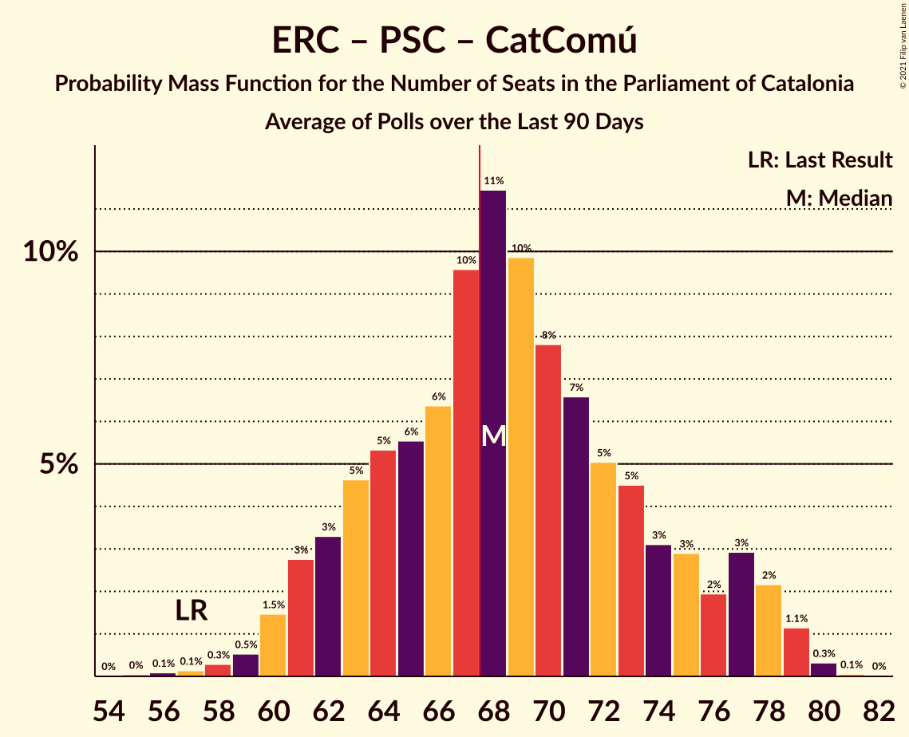

# Poll Average

<a href="#voting-intentions">Voting Intentions</a> | <a href="#seats">Seats</a> | <a href="#coalitions">Coalitions</a> | <a href="#technical-information">Technical Information</a>

## Summary

The table below lists the polls on which the average is based. They are the most recent polls (less than 90 days old) registered and analyzed so far.

| Period     | Polling firm/Commissioner(s) | Cs | JxCAT | ERC | PSC | CatComú | CUP | PP | Vox |
|:----------:|:----------------------------:|:--:|:--:|:--:|:--:|:--:|:--:|:--:|:--:|
| 21 December 2017 | General Election | 25.4%   36 | 21.7%   34 | 21.4%   32 | 13.9%   17 | 7.5%   8 | 4.5%   4 | 4.2%   4 | 0.0%   0 |
| N/A | Poll Average | 8–14%   10–19 | 15–23%   23–37 | 19–30%   28–42 | 16–22%   22–28 | 6–10%   7–12 | 5–8%   7–10 | 5–10%   6–13 | 3–6%   0–5 |
| [29 June–2 July 2020](2020-07-02-Feedback.html) | Feedback   El Nacional | 8–12%   N/A | 15–21%   N/A | 24–31%   N/A | 17–23%   N/A | 5–9%   N/A | 5–8%   N/A | 4–8%   N/A | 4–7%   N/A |
| [1 April–15 May 2020](2020-05-15-electoPanel.html) | electoPanel   electomania.es | 8–12%   10–14 | 19–24%   30–37 | 19–24%   27–35 | 17–22%   23–29 | 7–11%   8–12 | 5–8%   7–11 | 7–11%   9–14 | 3–5%   0–5 |
| [29 April–8 May 2020](2020-05-08-GESOP.html) | GESOP   El Periódico | 11–15%   14–20 | 15–19%   23–31 | 23–28%   35–42 | 16–20%   20–27 | 6–9%   7–11 | 5–7%   6–10 | 5–8%   6–10 | 3–5%   0–6 |
| 21 December 2017 | General Election | 25.4%   36 | 21.7%   34 | 21.4%   32 | 13.9%   17 | 7.5%   8 | 4.5%   4 | 4.2%   4 | 0.0%   0 |

Only polls for which at least the sample size has been published are included in the table above.

**Legend:**
+ **Top half of each row:** Voting intentions (95% confidence interval)
+ **Bottom half of each row:** Seat projections for the Parliament of Catalonia (95% confidence interval)
+ **Cs:** Ciutadans–Partido de la Ciudadanía
+ **JxCAT:** Junts pel Catalunya
+ **ERC:** Esquerra Republicana–Catalunya Sí
+ **PSC:** Partit dels Socialistes de Catalunya (PSC-PSOE)
+ **CatComú:** Catalunya en Comú–Podem
+ **CUP:** Candidatura d’Unitat Popular
+ **PP:** Partit Popular
+ **Vox:** Vox
+ **N/A (single party):** Party not included the published results
+ **N/A (entire row):** Calculation for this opinion poll not started yet

## Voting Intentions

### Confidence Intervals

| Party | Last Result | Median | 80% Confidence Interval | 90% Confidence Interval | 95% Confidence Interval | 99% Confidence Interval |
|:-----:|:-----------:|:------:|:-----------------------:|:-----------------------:|:-----------------------:|:-----------------------:|
| <a href="#ciutadans–partido-de-la-ciudadanía">Ciutadans–Partido de la Ciudadanía</a> | 25.4% | 10.3% | 8.6–13.4% |8.3–13.9% | 7.9–14.3% | 7.4–14.9% |
| <a href="#junts-pel-catalunya">Junts pel Catalunya</a> | 21.7% | 18.1% | 16.0–21.9% |15.6–22.6% | 15.2–23.1% | 14.6–24.1% |
| <a href="#esquerra-republicana–catalunya-sí">Esquerra Republicana–Catalunya Sí</a> | 21.4% | 25.1% | 20.5–28.3% |19.8–29.1% | 19.3–29.7% | 18.4–30.9% |
| <a href="#partit-dels-socialistes-de-catalunya-(psc-psoe)">Partit dels Socialistes de Catalunya (PSC-PSOE)</a> | 13.9% | 19.1% | 17.3–21.1% |16.9–21.7% | 16.5–22.2% | 15.9–23.1% |
| <a href="#catalunya-en-comú–podem">Catalunya en Comú–Podem</a> | 7.5% | 7.8% | 6.2–9.3% |5.8–9.7% | 5.5–10.1% | 5.0–10.8% |
| <a href="#candidatura-d’unitat-popular">Candidatura d’Unitat Popular</a> | 4.5% | 6.3% | 5.4–7.4% |5.2–7.7% | 5.0–8.0% | 4.5–8.6% |
| <a href="#partit-popular">Partit Popular</a> | 4.2% | 6.7% | 5.3–9.2% |5.0–9.7% | 4.7–10.1% | 4.2–10.8% |
| <a href="#vox">Vox</a> | 0.0% | 4.0% | 3.1–5.6% |2.9–6.1% | 2.8–6.4% | 2.4–7.1% |

### Ciutadans–Partido de la Ciudadanía

*For a full overview of the results for this party, see the [Ciutadans–Partido de la Ciudadanía](party-ciutadans–partidodelaciudadanía.html) page.*

| Voting Intentions | Probability | Accumulated | Special Marks |
|:-----------------:|:-----------:|:-----------:|:-------------:|
| 5.5–6.5% | 0% | 100% |  |
| 6.5–7.5% | 0.8% | 100% |  |
| 7.5–8.5% | 8% | 99.1% |  |
| 8.5–9.5% | 23% | 91% |  |
| 9.5–10.5% | 23% | 68% | Median |
| 10.5–11.5% | 11% | 45% |  |
| 11.5–12.5% | 11% | 34% |  |
| 12.5–13.5% | 15% | 23% |  |
| 13.5–14.5% | 7% | 8% |  |
| 14.5–15.5% | 1.2% | 1.3% |  |
| 15.5–16.5% | 0.1% | 0.1% |  |
| 16.5–17.5% | 0% | 0% |  |
| 17.5–18.5% | 0% | 0% |  |
| 18.5–19.5% | 0% | 0% |  |
| 19.5–20.5% | 0% | 0% |  |
| 20.5–21.5% | 0% | 0% |  |
| 21.5–22.5% | 0% | 0% |  |
| 22.5–23.5% | 0% | 0% |  |
| 23.5–24.5% | 0% | 0% |  |
| 24.5–25.5% | 0% | 0% | Last Result |

### Junts pel Catalunya

*For a full overview of the results for this party, see the [Junts pel Catalunya](party-juntspelcatalunya.html) page.*

| Voting Intentions | Probability | Accumulated | Special Marks |
|:-----------------:|:-----------:|:-----------:|:-------------:|
| 12.5–13.5% | 0% | 100% |  |
| 13.5–14.5% | 0.4% | 100% |  |
| 14.5–15.5% | 4% | 99.5% |  |
| 15.5–16.5% | 15% | 95% |  |
| 16.5–17.5% | 21% | 81% |  |
| 17.5–18.5% | 16% | 60% | Median |
| 18.5–19.5% | 10% | 44% |  |
| 19.5–20.5% | 9% | 34% |  |
| 20.5–21.5% | 11% | 24% |  |
| 21.5–22.5% | 8% | 14% | Last Result |
| 22.5–23.5% | 4% | 5% |  |
| 23.5–24.5% | 1.1% | 1.4% |  |
| 24.5–25.5% | 0.2% | 0.2% |  |
| 25.5–26.5% | 0% | 0% |  |

### Esquerra Republicana–Catalunya Sí

*For a full overview of the results for this party, see the [Esquerra Republicana–Catalunya Sí](party-esquerrarepublicana–catalunyasí.html) page.*

| Voting Intentions | Probability | Accumulated | Special Marks |
|:-----------------:|:-----------:|:-----------:|:-------------:|
| 16.5–17.5% | 0.1% | 100% |  |
| 17.5–18.5% | 0.6% | 99.9% |  |
| 18.5–19.5% | 3% | 99.4% |  |
| 19.5–20.5% | 7% | 96% |  |
| 20.5–21.5% | 10% | 89% | Last Result |
| 21.5–22.5% | 8% | 79% |  |
| 22.5–23.5% | 6% | 71% |  |
| 23.5–24.5% | 9% | 65% |  |
| 24.5–25.5% | 14% | 57% | Median |
| 25.5–26.5% | 15% | 43% |  |
| 26.5–27.5% | 12% | 28% |  |
| 27.5–28.5% | 8% | 16% |  |
| 28.5–29.5% | 5% | 8% |  |
| 29.5–30.5% | 2% | 3% |  |
| 30.5–31.5% | 0.7% | 0.9% |  |
| 31.5–32.5% | 0.2% | 0.2% |  |
| 32.5–33.5% | 0% | 0% |  |

### Partit dels Socialistes de Catalunya (PSC-PSOE)

*For a full overview of the results for this party, see the [Partit dels Socialistes de Catalunya (PSC-PSOE)](party-partitdelssocialistesdecatalunyapsc-psoe.html) page.*

| Voting Intentions | Probability | Accumulated | Special Marks |
|:-----------------:|:-----------:|:-----------:|:-------------:|
| 13.5–14.5% | 0% | 100% | Last Result |
| 14.5–15.5% | 0.2% | 100% |  |
| 15.5–16.5% | 2% | 99.8% |  |
| 16.5–17.5% | 11% | 97% |  |
| 17.5–18.5% | 23% | 86% |  |
| 18.5–19.5% | 26% | 64% | Median |
| 19.5–20.5% | 20% | 38% |  |
| 20.5–21.5% | 12% | 18% |  |
| 21.5–22.5% | 4% | 6% |  |
| 22.5–23.5% | 1.1% | 1.3% |  |
| 23.5–24.5% | 0.2% | 0.2% |  |
| 24.5–25.5% | 0% | 0% |  |

### Catalunya en Comú–Podem

*For a full overview of the results for this party, see the [Catalunya en Comú–Podem](party-catalunyaencomú–podem.html) page.*

| Voting Intentions | Probability | Accumulated | Special Marks |
|:-----------------:|:-----------:|:-----------:|:-------------:|
| 2.5–3.5% | 0% | 100% |  |
| 3.5–4.5% | 0.1% | 100% |  |
| 4.5–5.5% | 3% | 99.9% |  |
| 5.5–6.5% | 13% | 97% |  |
| 6.5–7.5% | 27% | 84% | Last Result |
| 7.5–8.5% | 32% | 57% | Median |
| 8.5–9.5% | 18% | 25% |  |
| 9.5–10.5% | 6% | 7% |  |
| 10.5–11.5% | 0.9% | 1.0% |  |
| 11.5–12.5% | 0.1% | 0.1% |  |
| 12.5–13.5% | 0% | 0% |  |

### Candidatura d’Unitat Popular

*For a full overview of the results for this party, see the [Candidatura d’Unitat Popular](party-candidaturad’unitatpopular.html) page.*

| Voting Intentions | Probability | Accumulated | Special Marks |
|:-----------------:|:-----------:|:-----------:|:-------------:|
| 2.5–3.5% | 0% | 100% |  |
| 3.5–4.5% | 0.6% | 100% | Last Result |
| 4.5–5.5% | 13% | 99.4% |  |
| 5.5–6.5% | 47% | 86% | Median |
| 6.5–7.5% | 32% | 39% |  |
| 7.5–8.5% | 7% | 7% |  |
| 8.5–9.5% | 0.6% | 0.6% |  |
| 9.5–10.5% | 0% | 0% |  |

### Partit Popular

*For a full overview of the results for this party, see the [Partit Popular](party-partitpopular.html) page.*

| Voting Intentions | Probability | Accumulated | Special Marks |
|:-----------------:|:-----------:|:-----------:|:-------------:|
| 2.5–3.5% | 0% | 100% |  |
| 3.5–4.5% | 2% | 100% | Last Result |
| 4.5–5.5% | 13% | 98% |  |
| 5.5–6.5% | 32% | 85% |  |
| 6.5–7.5% | 20% | 53% | Median |
| 7.5–8.5% | 13% | 33% |  |
| 8.5–9.5% | 13% | 20% |  |
| 9.5–10.5% | 5% | 6% |  |
| 10.5–11.5% | 0.9% | 1.0% |  |
| 11.5–12.5% | 0.1% | 0.1% |  |
| 12.5–13.5% | 0% | 0% |  |

### Vox

*For a full overview of the results for this party, see the [Vox](party-vox.html) page.*

| Voting Intentions | Probability | Accumulated | Special Marks |
|:-----------------:|:-----------:|:-----------:|:-------------:|
| 0.0–0.5% | 0% | 100% | Last Result |
| 0.5–1.5% | 0% | 100% |  |
| 1.5–2.5% | 1.0% | 100% |  |
| 2.5–3.5% | 25% | 99.0% |  |
| 3.5–4.5% | 42% | 74% | Median |
| 4.5–5.5% | 20% | 31% |  |
| 5.5–6.5% | 10% | 11% |  |
| 6.5–7.5% | 2% | 2% |  |
| 7.5–8.5% | 0.1% | 0.1% |  |
| 8.5–9.5% | 0% | 0% |  |

## Seats

### Confidence Intervals

| Party | Last Result | Median | 80% Confidence Interval | 90% Confidence Interval | 95% Confidence Interval | 99% Confidence Interval |
|:-----:|:-----------:|:------:|:-----------------------:|:-----------------------:|:-----------------------:|:-----------------------:|
| <a href="#ciutadans–partido-de-la-ciudadanía">Ciutadans–Partido de la Ciudadanía</a> | 36 | 14 | 12–19 |11–19 | 10–19 | 9–20 |
| <a href="#junts-pel-catalunya">Junts pel Catalunya</a> | 34 | 31 | 24–35 |24–37 | 23–37 | 23–38 |
| <a href="#esquerra-republicana–catalunya-sí">Esquerra Republicana–Catalunya Sí</a> | 32 | 35 | 29–40 |29–41 | 28–42 | 27–43 |
| <a href="#partit-dels-socialistes-de-catalunya-(psc-psoe)">Partit dels Socialistes de Catalunya (PSC-PSOE)</a> | 17 | 25 | 23–27 |23–28 | 22–28 | 20–30 |
| <a href="#catalunya-en-comú–podem">Catalunya en Comú–Podem</a> | 8 | 9 | 8–11 |8–11 | 7–12 | 6–13 |
| <a href="#candidatura-d’unitat-popular">Candidatura d’Unitat Popular</a> | 4 | 8 | 7–9 |7–10 | 7–10 | 6–11 |
| <a href="#partit-popular">Partit Popular</a> | 4 | 10 | 7–12 |7–13 | 6–13 | 6–15 |
| <a href="#vox">Vox</a> | 0 | 3 | 2–5 |0–5 | 0–5 | 0–6 |

### Ciutadans–Partido de la Ciudadanía

*For a full overview of the results for this party, see the [Ciutadans–Partido de la Ciudadanía](party-ciutadans–partidodelaciudadanía.html) page.*

| Number of Seats | Probability | Accumulated | Special Marks |
|:---------------:|:-----------:|:-----------:|:-------------:|
| 8 | 0.2% | 100% |  |
| 9 | 0.9% | 99.8% |  |
| 10 | 1.5% | 98.9% |  |
| 11 | 6% | 97% |  |
| 12 | 14% | 92% |  |
| 13 | 21% | 78% |  |
| 14 | 8% | 57% | Median |
| 15 | 1.2% | 49% |  |
| 16 | 4% | 48% |  |
| 17 | 8% | 44% |  |
| 18 | 22% | 36% |  |
| 19 | 12% | 14% |  |
| 20 | 1.5% | 2% |  |
| 21 | 0.2% | 0.2% |  |
| 22 | 0% | 0.1% |  |
| 23 | 0% | 0% |  |
| 24 | 0% | 0% |  |
| 25 | 0% | 0% |  |
| 26 | 0% | 0% |  |
| 27 | 0% | 0% |  |
| 28 | 0% | 0% |  |
| 29 | 0% | 0% |  |
| 30 | 0% | 0% |  |
| 31 | 0% | 0% |  |
| 32 | 0% | 0% |  |
| 33 | 0% | 0% |  |
| 34 | 0% | 0% |  |
| 35 | 0% | 0% |  |
| 36 | 0% | 0% | Last Result |

### Junts pel Catalunya

*For a full overview of the results for this party, see the [Junts pel Catalunya](party-juntspelcatalunya.html) page.*

| Number of Seats | Probability | Accumulated | Special Marks |
|:---------------:|:-----------:|:-----------:|:-------------:|
| 22 | 0% | 100% |  |
| 23 | 4% | 99.9% |  |
| 24 | 7% | 96% |  |
| 25 | 7% | 89% |  |
| 26 | 10% | 83% |  |
| 27 | 4% | 73% |  |
| 28 | 6% | 69% |  |
| 29 | 8% | 63% |  |
| 30 | 4% | 55% |  |
| 31 | 16% | 51% | Median |
| 32 | 6% | 36% |  |
| 33 | 10% | 29% |  |
| 34 | 5% | 20% | Last Result |
| 35 | 6% | 15% |  |
| 36 | 3% | 8% |  |
| 37 | 5% | 5% |  |
| 38 | 0.7% | 0.7% |  |
| 39 | 0.1% | 0.1% |  |
| 40 | 0% | 0% |  |

### Esquerra Republicana–Catalunya Sí

*For a full overview of the results for this party, see the [Esquerra Republicana–Catalunya Sí](party-esquerrarepublicana–catalunyasí.html) page.*

| Number of Seats | Probability | Accumulated | Special Marks |
|:---------------:|:-----------:|:-----------:|:-------------:|
| 25 | 0% | 100% |  |
| 26 | 0.4% | 99.9% |  |
| 27 | 1.0% | 99.6% |  |
| 28 | 3% | 98.5% |  |
| 29 | 7% | 96% |  |
| 30 | 8% | 89% |  |
| 31 | 16% | 81% |  |
| 32 | 7% | 65% | Last Result |
| 33 | 4% | 58% |  |
| 34 | 3% | 54% |  |
| 35 | 7% | 51% | Median |
| 36 | 4% | 44% |  |
| 37 | 9% | 40% |  |
| 38 | 6% | 32% |  |
| 39 | 7% | 26% |  |
| 40 | 9% | 19% |  |
| 41 | 7% | 10% |  |
| 42 | 2% | 3% |  |
| 43 | 0.8% | 1.1% |  |
| 44 | 0.2% | 0.2% |  |
| 45 | 0% | 0% |  |

### Partit dels Socialistes de Catalunya (PSC-PSOE)

*For a full overview of the results for this party, see the [Partit dels Socialistes de Catalunya (PSC-PSOE)](party-partitdelssocialistesdecatalunyapsc-psoe.html) page.*

| Number of Seats | Probability | Accumulated | Special Marks |
|:---------------:|:-----------:|:-----------:|:-------------:|
| 17 | 0% | 100% | Last Result |
| 18 | 0% | 100% |  |
| 19 | 0.2% | 100% |  |
| 20 | 1.5% | 99.8% |  |
| 21 | 0.7% | 98% |  |
| 22 | 2% | 98% |  |
| 23 | 11% | 95% |  |
| 24 | 23% | 84% |  |
| 25 | 24% | 61% | Median |
| 26 | 23% | 37% |  |
| 27 | 6% | 14% |  |
| 28 | 6% | 8% |  |
| 29 | 2% | 2% |  |
| 30 | 0.6% | 0.8% |  |
| 31 | 0.2% | 0.3% |  |
| 32 | 0% | 0.1% |  |
| 33 | 0% | 0% |  |

### Catalunya en Comú–Podem

*For a full overview of the results for this party, see the [Catalunya en Comú–Podem](party-catalunyaencomú–podem.html) page.*

| Number of Seats | Probability | Accumulated | Special Marks |
|:---------------:|:-----------:|:-----------:|:-------------:|
| 5 | 0.1% | 100% |  |
| 6 | 0.5% | 99.9% |  |
| 7 | 4% | 99.4% |  |
| 8 | 31% | 96% | Last Result |
| 9 | 18% | 64% | Median |
| 10 | 14% | 46% |  |
| 11 | 29% | 32% |  |
| 12 | 2% | 4% |  |
| 13 | 0.8% | 1.2% |  |
| 14 | 0.4% | 0.4% |  |
| 15 | 0% | 0% |  |

### Candidatura d’Unitat Popular

*For a full overview of the results for this party, see the [Candidatura d’Unitat Popular](party-candidaturad’unitatpopular.html) page.*

| Number of Seats | Probability | Accumulated | Special Marks |
|:---------------:|:-----------:|:-----------:|:-------------:|
| 4 | 0.3% | 100% | Last Result |
| 5 | 0.2% | 99.7% |  |
| 6 | 2% | 99.6% |  |
| 7 | 12% | 98% |  |
| 8 | 62% | 86% | Median |
| 9 | 19% | 24% |  |
| 10 | 3% | 5% |  |
| 11 | 2% | 2% |  |
| 12 | 0% | 0.1% |  |
| 13 | 0% | 0% |  |

### Partit Popular

*For a full overview of the results for this party, see the [Partit Popular](party-partitpopular.html) page.*

| Number of Seats | Probability | Accumulated | Special Marks |
|:---------------:|:-----------:|:-----------:|:-------------:|
| 4 | 0% | 100% | Last Result |
| 5 | 0.2% | 100% |  |
| 6 | 2% | 99.8% |  |
| 7 | 22% | 97% |  |
| 8 | 5% | 75% |  |
| 9 | 18% | 71% |  |
| 10 | 19% | 52% | Median |
| 11 | 6% | 33% |  |
| 12 | 20% | 27% |  |
| 13 | 5% | 7% |  |
| 14 | 1.4% | 2% |  |
| 15 | 0.7% | 0.8% |  |
| 16 | 0% | 0% |  |

### Vox

*For a full overview of the results for this party, see the [Vox](party-vox.html) page.*

| Number of Seats | Probability | Accumulated | Special Marks |
|:---------------:|:-----------:|:-----------:|:-------------:|
| 0 | 6% | 100% | Last Result |
| 1 | 0% | 94% |  |
| 2 | 15% | 94% |  |
| 3 | 58% | 78% | Median |
| 4 | 4% | 21% |  |
| 5 | 14% | 16% |  |
| 6 | 2% | 2% |  |
| 7 | 0.3% | 0.3% |  |
| 8 | 0% | 0% |  |

## Coalitions

### Confidence Intervals

| Coalition | Last Result | Median | Majority? | 80% Confidence Interval | 90% Confidence Interval | 95% Confidence Interval | 99% Confidence Interval |
|:---------:|:-----------:|:------:|:---------:|:-----------------------:|:-----------------------:|:-----------------------:|:-----------------------:|
| Junts pel Catalunya – Esquerra Republicana–Catalunya Sí – Catalunya en Comú–Podem | 74 | 74 | 99.8% | 72–77 | 71–77 | 70–78 | 68–80 |
| Junts pel Catalunya – Esquerra Republicana–Catalunya Sí – Candidatura d’Unitat Popular | 70 | 73 | 99.1% | 70–75 | 70–77 | 69–77 | 67–79 |
| Esquerra Republicana–Catalunya Sí – Partit dels Socialistes de Catalunya (PSC-PSOE) – Catalunya en Comú–Podem | 57 | 68 | 64% | 65–74 | 64–75 | 63–76 | 62–78 |
| Junts pel Catalunya – Esquerra Republicana–Catalunya Sí | 66 | 64 | 10% | 62–67 | 62–68 | 60–69 | 59–70 |
| Ciutadans–Partido de la Ciudadanía – Partit dels Socialistes de Catalunya (PSC-PSOE) – Catalunya en Comú–Podem – Partit Popular | 65 | 60 | 0% | 56–62 | 55–62 | 55–64 | 53–65 |
| Ciutadans–Partido de la Ciudadanía – Partit dels Socialistes de Catalunya (PSC-PSOE) – Partit Popular – Vox | 57 | 53 | 0% | 50–55 | 49–56 | 49–57 | 47–59 |
| Ciutadans–Partido de la Ciudadanía – Partit dels Socialistes de Catalunya (PSC-PSOE) – Partit Popular | 57 | 50 | 0% | 47–52 | 46–53 | 46–53 | 45–55 |
| Esquerra Republicana–Catalunya Sí – Catalunya en Comú–Podem | 40 | 43 | 0% | 39–49 | 39–50 | 38–51 | 36–53 |

### Junts pel Catalunya – Esquerra Republicana–Catalunya Sí – Catalunya en Comú–Podem

| Number of Seats | Probability | Accumulated | Special Marks |
|:---------------:|:-----------:|:-----------:|:-------------:|
| 66 | 0% | 100% |  |
| 67 | 0.1% | 99.9% |  |
| 68 | 0.6% | 99.8% | Majority |
| 69 | 1.1% | 99.3% |  |
| 70 | 2% | 98% |  |
| 71 | 3% | 96% |  |
| 72 | 16% | 94% |  |
| 73 | 23% | 77% |  |
| 74 | 16% | 55% | Last Result |
| 75 | 16% | 39% | Median |
| 76 | 12% | 23% |  |
| 77 | 6% | 11% |  |
| 78 | 3% | 5% |  |
| 79 | 1.4% | 2% |  |
| 80 | 0.4% | 0.5% |  |
| 81 | 0.1% | 0.1% |  |
| 82 | 0% | 0% |  |

### Junts pel Catalunya – Esquerra Republicana–Catalunya Sí – Candidatura d’Unitat Popular

| Number of Seats | Probability | Accumulated | Special Marks |
|:---------------:|:-----------:|:-----------:|:-------------:|
| 65 | 0.1% | 100% |  |
| 66 | 0.3% | 99.9% |  |
| 67 | 0.5% | 99.6% |  |
| 68 | 1.1% | 99.1% | Majority |
| 69 | 2% | 98% |  |
| 70 | 12% | 96% | Last Result |
| 71 | 10% | 83% |  |
| 72 | 19% | 73% |  |
| 73 | 22% | 54% |  |
| 74 | 14% | 32% | Median |
| 75 | 9% | 19% |  |
| 76 | 5% | 10% |  |
| 77 | 3% | 5% |  |
| 78 | 1.4% | 2% |  |
| 79 | 0.3% | 0.6% |  |
| 80 | 0.2% | 0.2% |  |
| 81 | 0% | 0% |  |

### Esquerra Republicana–Catalunya Sí – Partit dels Socialistes de Catalunya (PSC-PSOE) – Catalunya en Comú–Podem

| Number of Seats | Probability | Accumulated | Special Marks |
|:---------------:|:-----------:|:-----------:|:-------------:|
| 57 | 0% | 100% | Last Result |
| 58 | 0% | 100% |  |
| 59 | 0% | 100% |  |
| 60 | 0.1% | 100% |  |
| 61 | 0.2% | 99.8% |  |
| 62 | 1.4% | 99.6% |  |
| 63 | 2% | 98% |  |
| 64 | 4% | 97% |  |
| 65 | 9% | 93% |  |
| 66 | 9% | 84% |  |
| 67 | 11% | 75% |  |
| 68 | 18% | 64% | Majority |
| 69 | 6% | 46% | Median |
| 70 | 5% | 40% |  |
| 71 | 7% | 35% |  |
| 72 | 5% | 28% |  |
| 73 | 10% | 23% |  |
| 74 | 5% | 13% |  |
| 75 | 3% | 7% |  |
| 76 | 3% | 4% |  |
| 77 | 0.7% | 1.3% |  |
| 78 | 0.5% | 0.5% |  |
| 79 | 0.1% | 0.1% |  |
| 80 | 0% | 0% |  |

### Junts pel Catalunya – Esquerra Republicana–Catalunya Sí

| Number of Seats | Probability | Accumulated | Special Marks |
|:---------------:|:-----------:|:-----------:|:-------------:|
| 57 | 0% | 100% |  |
| 58 | 0.3% | 99.9% |  |
| 59 | 0.6% | 99.7% |  |
| 60 | 2% | 99.1% |  |
| 61 | 2% | 97% |  |
| 62 | 15% | 96% |  |
| 63 | 7% | 81% |  |
| 64 | 24% | 73% |  |
| 65 | 21% | 49% |  |
| 66 | 11% | 28% | Last Result, Median |
| 67 | 8% | 17% |  |
| 68 | 5% | 10% | Majority |
| 69 | 3% | 5% |  |
| 70 | 1.1% | 2% |  |
| 71 | 0.4% | 0.5% |  |
| 72 | 0% | 0.1% |  |
| 73 | 0% | 0% |  |

### Ciutadans–Partido de la Ciudadanía – Partit dels Socialistes de Catalunya (PSC-PSOE) – Catalunya en Comú–Podem – Partit Popular

| Number of Seats | Probability | Accumulated | Special Marks |
|:---------------:|:-----------:|:-----------:|:-------------:|
| 52 | 0.2% | 100% |  |
| 53 | 0.4% | 99.8% |  |
| 54 | 1.0% | 99.4% |  |
| 55 | 4% | 98% |  |
| 56 | 6% | 95% |  |
| 57 | 9% | 89% |  |
| 58 | 13% | 80% | Median |
| 59 | 14% | 66% |  |
| 60 | 31% | 52% |  |
| 61 | 8% | 21% |  |
| 62 | 8% | 13% |  |
| 63 | 2% | 5% |  |
| 64 | 2% | 3% |  |
| 65 | 0.5% | 0.9% | Last Result |
| 66 | 0.2% | 0.3% |  |
| 67 | 0.1% | 0.1% |  |
| 68 | 0% | 0% | Majority |

### Ciutadans–Partido de la Ciudadanía – Partit dels Socialistes de Catalunya (PSC-PSOE) – Partit Popular – Vox

| Number of Seats | Probability | Accumulated | Special Marks |
|:---------------:|:-----------:|:-----------:|:-------------:|
| 46 | 0.2% | 100% |  |
| 47 | 0.5% | 99.8% |  |
| 48 | 2% | 99.3% |  |
| 49 | 4% | 98% |  |
| 50 | 4% | 94% |  |
| 51 | 18% | 89% |  |
| 52 | 14% | 71% | Median |
| 53 | 13% | 58% |  |
| 54 | 22% | 44% |  |
| 55 | 16% | 22% |  |
| 56 | 3% | 6% |  |
| 57 | 2% | 3% | Last Result |
| 58 | 0.6% | 1.3% |  |
| 59 | 0.5% | 0.7% |  |
| 60 | 0.1% | 0.1% |  |
| 61 | 0% | 0% |  |

### Ciutadans–Partido de la Ciudadanía – Partit dels Socialistes de Catalunya (PSC-PSOE) – Partit Popular

| Number of Seats | Probability | Accumulated | Special Marks |
|:---------------:|:-----------:|:-----------:|:-------------:|
| 43 | 0.1% | 100% |  |
| 44 | 0.2% | 99.9% |  |
| 45 | 1.4% | 99.7% |  |
| 46 | 4% | 98% |  |
| 47 | 5% | 94% |  |
| 48 | 13% | 90% |  |
| 49 | 20% | 76% | Median |
| 50 | 19% | 56% |  |
| 51 | 18% | 37% |  |
| 52 | 13% | 19% |  |
| 53 | 4% | 6% |  |
| 54 | 1.3% | 2% |  |
| 55 | 0.4% | 0.9% |  |
| 56 | 0.3% | 0.4% |  |
| 57 | 0.1% | 0.1% | Last Result |
| 58 | 0% | 0% |  |

### Esquerra Republicana–Catalunya Sí – Catalunya en Comú–Podem

| Number of Seats | Probability | Accumulated | Special Marks |
|:---------------:|:-----------:|:-----------:|:-------------:|
| 35 | 0.3% | 100% |  |
| 36 | 0.5% | 99.7% |  |
| 37 | 1.5% | 99.2% |  |
| 38 | 2% | 98% |  |
| 39 | 8% | 96% |  |
| 40 | 4% | 87% | Last Result |
| 41 | 8% | 84% |  |
| 42 | 16% | 76% |  |
| 43 | 11% | 60% |  |
| 44 | 5% | 49% | Median |
| 45 | 7% | 44% |  |
| 46 | 8% | 37% |  |
| 47 | 6% | 29% |  |
| 48 | 9% | 23% |  |
| 49 | 7% | 14% |  |
| 50 | 4% | 8% |  |
| 51 | 2% | 3% |  |
| 52 | 1.2% | 2% |  |
| 53 | 0.4% | 0.6% |  |
| 54 | 0.2% | 0.2% |  |
| 55 | 0% | 0% |  |

## Technical Information

+ **Number of polls included in this average:** 3
+ **Lowest number of simulations done in a poll included in this average:** 0
+ **Total number of simulations done in the polls included in this average:** 262,144
+ **Error estimate:** 2.21%
