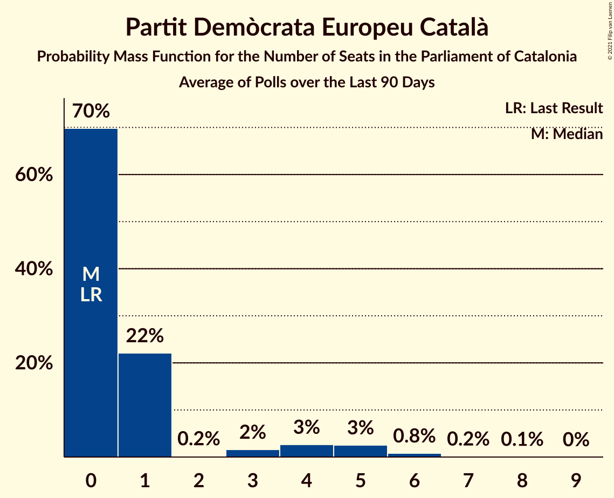

# Poll Average

<a href="#voting-intentions">Voting Intentions</a> | <a href="#seats">Seats</a> | <a href="#coalitions">Coalitions</a> | <a href="#technical-information">Technical Information</a>

## Summary

The table below lists the polls on which the average is based. They are the most recent polls (less than 90 days old) registered and analyzed so far.

| Period     | Polling firm/Commissioner(s) | Cs | JxCAT | ERC | PSC | CatComú | CUP | PP | Vox | PDeCAT |
|:----------:|:----------------------------:|:--:|:--:|:--:|:--:|:--:|:--:|:--:|:--:|:--:|
| 21 December 2017 | General Election | 25.4%   36 | 21.7%   34 | 21.4%   32 | 13.9%   17 | 7.5%   8 | 4.5%   4 | 4.2%   4 | 0.0%   0 | 0.0%   0 |
| N/A | Poll Average | 7–12%   9–17 | 14–24%   23–38 | 18–26%   27–40 | 18–26%   24–36 | 5–10%   5–11 | 4–8%   3–10 | 3–8%   2–11 | 4–8%   3–10 | 1–4%   0–5 |
| [5 February 2021](2021-02-05-electoPanel.html) | electoPanel   electomania.es | 7–13%   8–18 | 16–24%   26–39 | 17–25%   26–38 | 18–26%   25–37 | 4–9%   4–11 | 3–8%   2–10 | 4–8%   3–11 | 4–8%   3–11 | 1–3%   0–1 |
| [1–3 February 2021](2021-02-03-CIS.html) | CIS | 7–9%   8–12 | 13–16%   21–26 | 18–22%   28–34 | 22–26%   30–36 | 8–10%   9–13 | 6–8%   8–11 | 5–7%   6–9 | 6–8%   7–11 | 1–2%   0 |
| [29 January–2 February 2021](2021-02-02-DYM.html) | DYM   Henneo | 9–12%   12–17 | 20–24%   31–39 | 17–22%   25–33 | 20–25%   27–35 | 6–9%   6–10 | 5–7%   6–10 | 3–5%   0–5 | 5–7%   5–9 | N/A   N/A |
| [18–31 January 2021](2021-01-31-SocioMétrica.html) | SocioMétrica   El Español | 10–12%   13–17 | 19–22%   31–36 | 18–21%   28–32 | 19–22%   26–31 | 6–8%   7–10 | 5–7%   7–8 | 5–6%   5–9 | 5–7%   6–9 | N/A   N/A |
| [31 January 2021](2021-01-31-SigmaDos.html) | Sigma Dos   Antena 3 | 9–12%   11–16 | 18–23%   29–37 | 19–24%   28–35 | 20–25%   26–34 | 6–9%   5–11 | 4–7%   4–9 | 4–7%   5–9 | 4–7%   3–9 | N/A   N/A |
| [25–30 January 2021](2021-01-30-NCReport.html) | NC Report   La Razón | 9–13%   12–18 | 17–23%   26–37 | 18–24%   28–37 | 17–23%   23–31 | 5–9%   5–11 | 4–8%   4–10 | 5–9%   6–12 | 4–8%   3–9 | N/A   N/A |
| [25–28 January 2021](2021-01-28-GESOP.html) | GESOP   El Periódico | 8–11%   9–14 | 17–21%   27–34 | 18–22%   27–34 | 22–26%   31–37 | 5–8%   5–8 | 4–7%   4–8 | 5–8%   6–10 | 4–6%   4–9 | 1–2%   0 |
| [13–21 January 2021](2021-01-21-Opinòmetre.html) | Opinòmetre   CEO | 8–12%   9–16 | 18–24%   28–38 | 19–25%   28–38 | 17–23%   22–31 | 5–9%   4–10 | 5–8%   5–11 | 5–9%   6–12 | 3–7%   3–8 | 1–4%   0–4 |
| [4–8 January 2021](2021-01-08-GAD3.html) | GAD3   La Vanguardia | 8–12%   9–18 | 16–22%   25–35 | 21–28%   33–43 | 17–24%   24–34 | 4–8%   4–10 | 3–6%   0–8 | 5–9%   5–12 | 3–6%   2–7 | 2–5%   0–6 |
| 21 December 2017 | General Election | 25.4%   36 | 21.7%   34 | 21.4%   32 | 13.9%   17 | 7.5%   8 | 4.5%   4 | 4.2%   4 | 0.0%   0 | 0.0%   0 |

Only polls for which at least the sample size has been published are included in the table above.

**Legend:**
+ **Top half of each row:** Voting intentions (95% confidence interval)
+ **Bottom half of each row:** Seat projections for the Parliament of Catalonia (95% confidence interval)
+ **Cs:** Ciutadans–Partido de la Ciudadanía
+ **JxCAT:** Junts per Catalunya
+ **ERC:** Esquerra Republicana–Catalunya Sí
+ **PSC:** Partit dels Socialistes de Catalunya (PSC-PSOE)
+ **CatComú:** Catalunya en Comú–Podem
+ **CUP:** Candidatura d’Unitat Popular
+ **PP:** Partit Popular
+ **Vox:** Vox
+ **PDeCAT:** Partit Demòcrata Europeu Català
+ **N/A (single party):** Party not included the published results
+ **N/A (entire row):** Calculation for this opinion poll not started yet

## Voting Intentions

### Confidence Intervals

| Party | Last Result | Median | 80% Confidence Interval | 90% Confidence Interval | 95% Confidence Interval | 99% Confidence Interval |
|:-----:|:-----------:|:------:|:-----------------------:|:-----------------------:|:-----------------------:|:-----------------------:|
| <a href="#ciutadans–partido-de-la-ciudadanía">Ciutadans–Partido de la Ciudadanía</a> | 25.4% | 10.0% | 8.0–11.6% |7.6–12.1% | 7.3–12.5% | 6.8–13.4% |
| <a href="#junts-per-catalunya">Junts per Catalunya</a> | 21.7% | 20.0% | 15.5–22.3% |14.5–23.0% | 14.0–23.6% | 13.3–24.6% |
| <a href="#esquerra-republicana–catalunya-sí">Esquerra Republicana–Catalunya Sí</a> | 21.4% | 20.6% | 18.7–23.8% |18.3–24.9% | 17.9–25.8% | 17.0–27.4% |
| <a href="#partit-dels-socialistes-de-catalunya-(psc-psoe)">Partit dels Socialistes de Catalunya (PSC-PSOE)</a> | 13.9% | 21.7% | 19.0–24.4% |18.3–25.0% | 17.7–25.5% | 16.6–26.4% |
| <a href="#catalunya-en-comú–podem">Catalunya en Comú–Podem</a> | 7.5% | 7.0% | 5.7–8.7% |5.3–9.2% | 5.0–9.5% | 4.4–10.2% |
| <a href="#candidatura-d’unitat-popular">Candidatura d’Unitat Popular</a> | 4.5% | 5.7% | 4.4–7.0% |4.0–7.4% | 3.6–7.7% | 3.0–8.3% |
| <a href="#partit-popular">Partit Popular</a> | 4.2% | 6.0% | 4.1–7.5% |3.5–8.0% | 3.2–8.4% | 2.7–9.2% |
| <a href="#vox">Vox</a> | 0.0% | 5.6% | 4.2–6.9% |3.8–7.3% | 3.5–7.6% | 3.0–8.3% |
| <a href="#partit-demòcrata-europeu-català">Partit Demòcrata Europeu Català</a> | 0.0% | 1.7% | 1.0–3.3% |0.9–3.7% | 0.8–4.0% | 0.5–4.7% |

### Ciutadans–Partido de la Ciudadanía

*For a full overview of the results for this party, see the [Ciutadans–Partido de la Ciudadanía](party-ciutadans–partidodelaciudadanía.html) page.*

| Voting Intentions | Probability | Accumulated | Special Marks |
|:-----------------:|:-----------:|:-----------:|:-------------:|
| 4.5–5.5% | 0% | 100% |  |
| 5.5–6.5% | 0.2% | 100% |  |
| 6.5–7.5% | 4% | 99.8% |  |
| 7.5–8.5% | 14% | 96% |  |
| 8.5–9.5% | 21% | 82% |  |
| 9.5–10.5% | 26% | 61% | Median |
| 10.5–11.5% | 24% | 35% |  |
| 11.5–12.5% | 9% | 11% |  |
| 12.5–13.5% | 2% | 2% |  |
| 13.5–14.5% | 0.3% | 0.4% |  |
| 14.5–15.5% | 0% | 0.1% |  |
| 15.5–16.5% | 0% | 0% |  |
| 16.5–17.5% | 0% | 0% |  |
| 17.5–18.5% | 0% | 0% |  |
| 18.5–19.5% | 0% | 0% |  |
| 19.5–20.5% | 0% | 0% |  |
| 20.5–21.5% | 0% | 0% |  |
| 21.5–22.5% | 0% | 0% |  |
| 22.5–23.5% | 0% | 0% |  |
| 23.5–24.5% | 0% | 0% |  |
| 24.5–25.5% | 0% | 0% | Last Result |

### Junts per Catalunya

*For a full overview of the results for this party, see the [Junts per Catalunya](party-juntspercatalunya.html) page.*

| Voting Intentions | Probability | Accumulated | Special Marks |
|:-----------------:|:-----------:|:-----------:|:-------------:|
| 11.5–12.5% | 0% | 100% |  |
| 12.5–13.5% | 1.0% | 99.9% |  |
| 13.5–14.5% | 4% | 98.9% |  |
| 14.5–15.5% | 5% | 95% |  |
| 15.5–16.5% | 3% | 90% |  |
| 16.5–17.5% | 4% | 87% |  |
| 17.5–18.5% | 9% | 83% |  |
| 18.5–19.5% | 16% | 74% |  |
| 19.5–20.5% | 21% | 58% | Median |
| 20.5–21.5% | 18% | 37% |  |
| 21.5–22.5% | 11% | 19% | Last Result |
| 22.5–23.5% | 6% | 8% |  |
| 23.5–24.5% | 2% | 3% |  |
| 24.5–25.5% | 0.5% | 0.6% |  |
| 25.5–26.5% | 0.1% | 0.1% |  |
| 26.5–27.5% | 0% | 0% |  |

### Esquerra Republicana–Catalunya Sí

*For a full overview of the results for this party, see the [Esquerra Republicana–Catalunya Sí](party-esquerrarepublicana–catalunyasí.html) page.*

| Voting Intentions | Probability | Accumulated | Special Marks |
|:-----------------:|:-----------:|:-----------:|:-------------:|
| 14.5–15.5% | 0% | 100% |  |
| 15.5–16.5% | 0.2% | 100% |  |
| 16.5–17.5% | 1.2% | 99.8% |  |
| 17.5–18.5% | 7% | 98.7% |  |
| 18.5–19.5% | 19% | 92% |  |
| 19.5–20.5% | 23% | 73% |  |
| 20.5–21.5% | 18% | 50% | Last Result, Median |
| 21.5–22.5% | 12% | 33% |  |
| 22.5–23.5% | 8% | 20% |  |
| 23.5–24.5% | 6% | 12% |  |
| 24.5–25.5% | 3% | 6% |  |
| 25.5–26.5% | 2% | 3% |  |
| 26.5–27.5% | 0.8% | 1.2% |  |
| 27.5–28.5% | 0.3% | 0.4% |  |
| 28.5–29.5% | 0.1% | 0.1% |  |
| 29.5–30.5% | 0% | 0% |  |

### Partit dels Socialistes de Catalunya (PSC-PSOE)

*For a full overview of the results for this party, see the [Partit dels Socialistes de Catalunya (PSC-PSOE)](party-partitdelssocialistesdecatalunyapsc-psoe.html) page.*

| Voting Intentions | Probability | Accumulated | Special Marks |
|:-----------------:|:-----------:|:-----------:|:-------------:|
| 13.5–14.5% | 0% | 100% | Last Result |
| 14.5–15.5% | 0% | 100% |  |
| 15.5–16.5% | 0.4% | 99.9% |  |
| 16.5–17.5% | 2% | 99.6% |  |
| 17.5–18.5% | 5% | 98% |  |
| 18.5–19.5% | 10% | 93% |  |
| 19.5–20.5% | 16% | 83% |  |
| 20.5–21.5% | 15% | 68% |  |
| 21.5–22.5% | 15% | 52% | Median |
| 22.5–23.5% | 16% | 38% |  |
| 23.5–24.5% | 13% | 22% |  |
| 24.5–25.5% | 6% | 9% |  |
| 25.5–26.5% | 2% | 2% |  |
| 26.5–27.5% | 0.3% | 0.4% |  |
| 27.5–28.5% | 0.1% | 0.1% |  |
| 28.5–29.5% | 0% | 0% |  |

### Catalunya en Comú–Podem

*For a full overview of the results for this party, see the [Catalunya en Comú–Podem](party-catalunyaencomú–podem.html) page.*

| Voting Intentions | Probability | Accumulated | Special Marks |
|:-----------------:|:-----------:|:-----------:|:-------------:|
| 2.5–3.5% | 0% | 100% |  |
| 3.5–4.5% | 0.9% | 100% |  |
| 4.5–5.5% | 7% | 99.1% |  |
| 5.5–6.5% | 25% | 92% |  |
| 6.5–7.5% | 35% | 67% | Last Result, Median |
| 7.5–8.5% | 20% | 32% |  |
| 8.5–9.5% | 9% | 12% |  |
| 9.5–10.5% | 2% | 2% |  |
| 10.5–11.5% | 0.2% | 0.2% |  |
| 11.5–12.5% | 0% | 0% |  |

### Candidatura d’Unitat Popular

*For a full overview of the results for this party, see the [Candidatura d’Unitat Popular](party-candidaturad’unitatpopular.html) page.*

| Voting Intentions | Probability | Accumulated | Special Marks |
|:-----------------:|:-----------:|:-----------:|:-------------:|
| 1.5–2.5% | 0.1% | 100% |  |
| 2.5–3.5% | 2% | 99.9% |  |
| 3.5–4.5% | 10% | 98% | Last Result |
| 4.5–5.5% | 31% | 88% |  |
| 5.5–6.5% | 36% | 56% | Median |
| 6.5–7.5% | 16% | 20% |  |
| 7.5–8.5% | 3% | 3% |  |
| 8.5–9.5% | 0.3% | 0.3% |  |
| 9.5–10.5% | 0% | 0% |  |

### Partit Popular

*For a full overview of the results for this party, see the [Partit Popular](party-partitpopular.html) page.*

| Voting Intentions | Probability | Accumulated | Special Marks |
|:-----------------:|:-----------:|:-----------:|:-------------:|
| 0.5–1.5% | 0% | 100% |  |
| 1.5–2.5% | 0.2% | 100% |  |
| 2.5–3.5% | 6% | 99.8% |  |
| 3.5–4.5% | 7% | 94% | Last Result |
| 4.5–5.5% | 21% | 87% |  |
| 5.5–6.5% | 37% | 66% | Median |
| 6.5–7.5% | 20% | 29% |  |
| 7.5–8.5% | 7% | 9% |  |
| 8.5–9.5% | 2% | 2% |  |
| 9.5–10.5% | 0.2% | 0.3% |  |
| 10.5–11.5% | 0% | 0% |  |

### Vox

*For a full overview of the results for this party, see the [Vox](party-vox.html) page.*

| Voting Intentions | Probability | Accumulated | Special Marks |
|:-----------------:|:-----------:|:-----------:|:-------------:|
| 0.0–0.5% | 0% | 100% | Last Result |
| 0.5–1.5% | 0% | 100% |  |
| 1.5–2.5% | 0.1% | 100% |  |
| 2.5–3.5% | 3% | 99.9% |  |
| 3.5–4.5% | 14% | 97% |  |
| 4.5–5.5% | 33% | 83% |  |
| 5.5–6.5% | 33% | 50% | Median |
| 6.5–7.5% | 14% | 17% |  |
| 7.5–8.5% | 3% | 3% |  |
| 8.5–9.5% | 0.2% | 0.2% |  |
| 9.5–10.5% | 0% | 0% |  |

### Partit Demòcrata Europeu Català

*For a full overview of the results for this party, see the [Partit Demòcrata Europeu Català](party-partitdemòcrataeuropeucatalà.html) page.*

| Voting Intentions | Probability | Accumulated | Special Marks |
|:-----------------:|:-----------:|:-----------:|:-------------:|
| 0.0–0.5% | 0.5% | 100% | Last Result |
| 0.5–1.5% | 39% | 99.5% |  |
| 1.5–2.5% | 35% | 60% | Median |
| 2.5–3.5% | 19% | 25% |  |
| 3.5–4.5% | 5% | 6% |  |
| 4.5–5.5% | 0.7% | 0.7% |  |
| 5.5–6.5% | 0% | 0% |  |
| 6.5–7.5% | 0% | 0% |  |

## Seats

### Confidence Intervals

| Party | Last Result | Median | 80% Confidence Interval | 90% Confidence Interval | 95% Confidence Interval | 99% Confidence Interval |
|:-----:|:-----------:|:------:|:-----------------------:|:-----------------------:|:-----------------------:|:-----------------------:|
| <a href="#ciutadans–partido-de-la-ciudadanía">Ciutadans–Partido de la Ciudadanía</a> | 36 | 13 | 11–16 |9–16 | 9–17 | 8–18 |
| <a href="#junts-per-catalunya">Junts per Catalunya</a> | 34 | 32 | 25–36 |23–37 | 23–38 | 22–39 |
| <a href="#esquerra-republicana–catalunya-sí">Esquerra Republicana–Catalunya Sí</a> | 32 | 31 | 28–36 |28–37 | 27–40 | 25–43 |
| <a href="#partit-dels-socialistes-de-catalunya-(psc-psoe)">Partit dels Socialistes de Catalunya (PSC-PSOE)</a> | 17 | 30 | 26–34 |25–35 | 24–36 | 22–37 |
| <a href="#catalunya-en-comú–podem">Catalunya en Comú–Podem</a> | 8 | 8 | 5–10 |5–11 | 5–11 | 4–13 |
| <a href="#candidatura-d’unitat-popular">Candidatura d’Unitat Popular</a> | 4 | 8 | 4–9 |4–10 | 3–10 | 2–11 |
| <a href="#partit-popular">Partit Popular</a> | 4 | 7 | 3–10 |3–10 | 2–11 | 0–12 |
| <a href="#vox">Vox</a> | 0 | 7 | 4–9 |3–9 | 3–10 | 2–11 |
| <a href="#partit-demòcrata-europeu-català">Partit Demòcrata Europeu Català</a> | 0 | 0 | 0–1 |0–4 | 0–5 | 0–6 |

### Ciutadans–Partido de la Ciudadanía

*For a full overview of the results for this party, see the [Ciutadans–Partido de la Ciudadanía](party-ciutadans–partidodelaciudadanía.html) page.*

| Number of Seats | Probability | Accumulated | Special Marks |
|:---------------:|:-----------:|:-----------:|:-------------:|
| 7 | 0.1% | 100% |  |
| 8 | 2% | 99.9% |  |
| 9 | 3% | 98% |  |
| 10 | 2% | 95% |  |
| 11 | 7% | 93% |  |
| 12 | 21% | 85% |  |
| 13 | 26% | 64% | Median |
| 14 | 21% | 38% |  |
| 15 | 6% | 17% |  |
| 16 | 7% | 11% |  |
| 17 | 2% | 4% |  |
| 18 | 2% | 2% |  |
| 19 | 0.3% | 0.4% |  |
| 20 | 0% | 0% |  |
| 21 | 0% | 0% |  |
| 22 | 0% | 0% |  |
| 23 | 0% | 0% |  |
| 24 | 0% | 0% |  |
| 25 | 0% | 0% |  |
| 26 | 0% | 0% |  |
| 27 | 0% | 0% |  |
| 28 | 0% | 0% |  |
| 29 | 0% | 0% |  |
| 30 | 0% | 0% |  |
| 31 | 0% | 0% |  |
| 32 | 0% | 0% |  |
| 33 | 0% | 0% |  |
| 34 | 0% | 0% |  |
| 35 | 0% | 0% |  |
| 36 | 0% | 0% | Last Result |

### Junts per Catalunya

*For a full overview of the results for this party, see the [Junts per Catalunya](party-juntspercatalunya.html) page.*

| Number of Seats | Probability | Accumulated | Special Marks |
|:---------------:|:-----------:|:-----------:|:-------------:|
| 20 | 0% | 100% |  |
| 21 | 0.4% | 99.9% |  |
| 22 | 1.0% | 99.5% |  |
| 23 | 5% | 98.5% |  |
| 24 | 1.5% | 93% |  |
| 25 | 3% | 92% |  |
| 26 | 2% | 89% |  |
| 27 | 2% | 86% |  |
| 28 | 2% | 85% |  |
| 29 | 4% | 83% |  |
| 30 | 5% | 78% |  |
| 31 | 20% | 73% |  |
| 32 | 15% | 53% | Median |
| 33 | 12% | 39% |  |
| 34 | 8% | 26% | Last Result |
| 35 | 6% | 19% |  |
| 36 | 5% | 13% |  |
| 37 | 5% | 8% |  |
| 38 | 2% | 3% |  |
| 39 | 0.8% | 1.2% |  |
| 40 | 0.3% | 0.4% |  |
| 41 | 0.1% | 0.2% |  |
| 42 | 0% | 0.1% |  |
| 43 | 0% | 0% |  |

### Esquerra Republicana–Catalunya Sí

*For a full overview of the results for this party, see the [Esquerra Republicana–Catalunya Sí](party-esquerrarepublicana–catalunyasí.html) page.*

| Number of Seats | Probability | Accumulated | Special Marks |
|:---------------:|:-----------:|:-----------:|:-------------:|
| 23 | 0% | 100% |  |
| 24 | 0.2% | 99.9% |  |
| 25 | 0.4% | 99.8% |  |
| 26 | 1.1% | 99.4% |  |
| 27 | 2% | 98% |  |
| 28 | 11% | 96% |  |
| 29 | 15% | 85% |  |
| 30 | 15% | 71% |  |
| 31 | 12% | 55% | Median |
| 32 | 10% | 43% | Last Result |
| 33 | 7% | 33% |  |
| 34 | 7% | 26% |  |
| 35 | 6% | 18% |  |
| 36 | 4% | 12% |  |
| 37 | 3% | 8% |  |
| 38 | 1.2% | 5% |  |
| 39 | 0.5% | 4% |  |
| 40 | 1.1% | 3% |  |
| 41 | 0.6% | 2% |  |
| 42 | 0.4% | 1.3% |  |
| 43 | 0.6% | 0.9% |  |
| 44 | 0.2% | 0.2% |  |
| 45 | 0% | 0% |  |

### Partit dels Socialistes de Catalunya (PSC-PSOE)

*For a full overview of the results for this party, see the [Partit dels Socialistes de Catalunya (PSC-PSOE)](party-partitdelssocialistesdecatalunyapsc-psoe.html) page.*

| Number of Seats | Probability | Accumulated | Special Marks |
|:---------------:|:-----------:|:-----------:|:-------------:|
| 17 | 0% | 100% | Last Result |
| 18 | 0% | 100% |  |
| 19 | 0% | 100% |  |
| 20 | 0.1% | 100% |  |
| 21 | 0.1% | 99.9% |  |
| 22 | 0.4% | 99.9% |  |
| 23 | 0.5% | 99.4% |  |
| 24 | 2% | 98.9% |  |
| 25 | 6% | 97% |  |
| 26 | 11% | 90% |  |
| 27 | 9% | 79% |  |
| 28 | 8% | 70% |  |
| 29 | 8% | 62% |  |
| 30 | 10% | 54% | Median |
| 31 | 13% | 44% |  |
| 32 | 10% | 32% |  |
| 33 | 7% | 22% |  |
| 34 | 8% | 14% |  |
| 35 | 3% | 7% |  |
| 36 | 2% | 3% |  |
| 37 | 0.8% | 1.1% |  |
| 38 | 0.2% | 0.3% |  |
| 39 | 0.1% | 0.1% |  |
| 40 | 0% | 0% |  |

### Catalunya en Comú–Podem

*For a full overview of the results for this party, see the [Catalunya en Comú–Podem](party-catalunyaencomú–podem.html) page.*

| Number of Seats | Probability | Accumulated | Special Marks |
|:---------------:|:-----------:|:-----------:|:-------------:|
| 3 | 0.1% | 100% |  |
| 4 | 2% | 99.9% |  |
| 5 | 10% | 98% |  |
| 6 | 8% | 89% |  |
| 7 | 22% | 81% |  |
| 8 | 31% | 59% | Last Result, Median |
| 9 | 9% | 28% |  |
| 10 | 10% | 19% |  |
| 11 | 7% | 10% |  |
| 12 | 1.0% | 2% |  |
| 13 | 1.3% | 1.4% |  |
| 14 | 0.1% | 0.1% |  |
| 15 | 0% | 0% |  |

### Candidatura d’Unitat Popular

*For a full overview of the results for this party, see the [Candidatura d’Unitat Popular](party-candidaturad’unitatpopular.html) page.*

| Number of Seats | Probability | Accumulated | Special Marks |
|:---------------:|:-----------:|:-----------:|:-------------:|
| 0 | 0.4% | 100% |  |
| 1 | 0% | 99.6% |  |
| 2 | 0.6% | 99.6% |  |
| 3 | 2% | 99.0% |  |
| 4 | 8% | 97% | Last Result |
| 5 | 4% | 89% |  |
| 6 | 5% | 85% |  |
| 7 | 23% | 79% |  |
| 8 | 40% | 56% | Median |
| 9 | 10% | 17% |  |
| 10 | 4% | 6% |  |
| 11 | 2% | 2% |  |
| 12 | 0.1% | 0.1% |  |
| 13 | 0% | 0% |  |

### Partit Popular

*For a full overview of the results for this party, see the [Partit Popular](party-partitpopular.html) page.*

| Number of Seats | Probability | Accumulated | Special Marks |
|:---------------:|:-----------:|:-----------:|:-------------:|
| 0 | 1.3% | 100% |  |
| 1 | 0% | 98.7% |  |
| 2 | 2% | 98.7% |  |
| 3 | 7% | 97% |  |
| 4 | 1.0% | 90% | Last Result |
| 5 | 6% | 89% |  |
| 6 | 9% | 83% |  |
| 7 | 37% | 74% | Median |
| 8 | 7% | 37% |  |
| 9 | 19% | 30% |  |
| 10 | 7% | 11% |  |
| 11 | 2% | 4% |  |
| 12 | 2% | 2% |  |
| 13 | 0.1% | 0.2% |  |
| 14 | 0.1% | 0.1% |  |
| 15 | 0% | 0% |  |

### Vox

*For a full overview of the results for this party, see the [Vox](party-vox.html) page.*

| Number of Seats | Probability | Accumulated | Special Marks |
|:---------------:|:-----------:|:-----------:|:-------------:|
| 0 | 0.3% | 100% | Last Result |
| 1 | 0% | 99.7% |  |
| 2 | 0.4% | 99.7% |  |
| 3 | 7% | 99.3% |  |
| 4 | 3% | 92% |  |
| 5 | 18% | 89% |  |
| 6 | 13% | 71% |  |
| 7 | 35% | 58% | Median |
| 8 | 4% | 23% |  |
| 9 | 15% | 19% |  |
| 10 | 3% | 4% |  |
| 11 | 1.2% | 1.4% |  |
| 12 | 0.2% | 0.3% |  |
| 13 | 0% | 0% |  |

### Partit Demòcrata Europeu Català

*For a full overview of the results for this party, see the [Partit Demòcrata Europeu Català](party-partitdemòcrataeuropeucatalà.html) page.*

| Number of Seats | Probability | Accumulated | Special Marks |
|:---------------:|:-----------:|:-----------:|:-------------:|
| 0 | 77% | 100% | Last Result, Median |
| 1 | 14% | 23% |  |
| 2 | 0% | 8% |  |
| 3 | 2% | 8% |  |
| 4 | 2% | 7% |  |
| 5 | 3% | 4% |  |
| 6 | 1.2% | 1.5% |  |
| 7 | 0.2% | 0.2% |  |
| 8 | 0.1% | 0.1% |  |
| 9 | 0% | 0% |  |

## Coalitions

### Confidence Intervals

| Coalition | Last Result | Median | Majority? | 80% Confidence Interval | 90% Confidence Interval | 95% Confidence Interval | 99% Confidence Interval |
|:---------:|:-----------:|:------:|:---------:|:-----------------------:|:-----------------------:|:-----------------------:|:-----------------------:|
| Junts per Catalunya – Esquerra Republicana–Catalunya Sí – Candidatura d’Unitat Popular – Partit Demòcrata Europeu Català | 70 | 71 | 79% | 65–76 | 63–77 | 62–79 | 60–81 |
| Junts per Catalunya – Esquerra Republicana–Catalunya Sí – Catalunya en Comú–Podem | 74 | 71 | 81% | 66–75 | 65–77 | 64–78 | 62–81 |
| Junts per Catalunya – Esquerra Republicana–Catalunya Sí – Candidatura d’Unitat Popular | 70 | 71 | 78% | 65–75 | 63–76 | 62–78 | 60–80 |
| Esquerra Republicana–Catalunya Sí – Partit dels Socialistes de Catalunya (PSC-PSOE) – Catalunya en Comú–Podem | 57 | 69 | 63% | 64–75 | 63–77 | 62–78 | 60–79 |
| Junts per Catalunya – Esquerra Republicana–Catalunya Sí – Partit Demòcrata Europeu Català | 66 | 63 | 17% | 56–69 | 54–71 | 53–72 | 52–75 |
| Junts per Catalunya – Esquerra Republicana–Catalunya Sí | 66 | 63 | 14% | 56–68 | 54–70 | 53–71 | 52–74 |
| Ciutadans–Partido de la Ciudadanía – Partit dels Socialistes de Catalunya (PSC-PSOE) – Catalunya en Comú–Podem – Partit Popular | 65 | 58 | 0.1% | 54–63 | 52–64 | 51–64 | 49–66 |
| Ciutadans–Partido de la Ciudadanía – Partit dels Socialistes de Catalunya (PSC-PSOE) – Partit Popular – Vox | 57 | 57 | 0.1% | 52–61 | 51–62 | 50–63 | 47–65 |
| Ciutadans–Partido de la Ciudadanía – Partit dels Socialistes de Catalunya (PSC-PSOE) – Partit Popular | 57 | 50 | 0% | 46–54 | 45–55 | 44–56 | 42–58 |
| Esquerra Republicana–Catalunya Sí – Catalunya en Comú–Podem | 40 | 39 | 0% | 36–43 | 35–45 | 34–47 | 33–51 |

### Junts per Catalunya – Esquerra Republicana–Catalunya Sí – Candidatura d’Unitat Popular – Partit Demòcrata Europeu Català

| Number of Seats | Probability | Accumulated | Special Marks |
|:---------------:|:-----------:|:-----------:|:-------------:|
| 59 | 0.1% | 100% |  |
| 60 | 0.4% | 99.8% |  |
| 61 | 0.7% | 99.4% |  |
| 62 | 2% | 98.7% |  |
| 63 | 3% | 97% |  |
| 64 | 2% | 93% |  |
| 65 | 3% | 91% |  |
| 66 | 2% | 88% |  |
| 67 | 6% | 85% |  |
| 68 | 7% | 79% | Majority |
| 69 | 9% | 72% |  |
| 70 | 10% | 62% | Last Result |
| 71 | 10% | 52% | Median |
| 72 | 9% | 42% |  |
| 73 | 8% | 33% |  |
| 74 | 9% | 24% |  |
| 75 | 4% | 16% |  |
| 76 | 5% | 11% |  |
| 77 | 2% | 7% |  |
| 78 | 2% | 4% |  |
| 79 | 1.3% | 3% |  |
| 80 | 0.7% | 1.2% |  |
| 81 | 0.3% | 0.5% |  |
| 82 | 0.1% | 0.3% |  |
| 83 | 0.1% | 0.2% |  |
| 84 | 0% | 0% |  |

### Junts per Catalunya – Esquerra Republicana–Catalunya Sí – Catalunya en Comú–Podem

| Number of Seats | Probability | Accumulated | Special Marks |
|:---------------:|:-----------:|:-----------:|:-------------:|
| 60 | 0.1% | 100% |  |
| 61 | 0.2% | 99.9% |  |
| 62 | 0.5% | 99.7% |  |
| 63 | 1.4% | 99.2% |  |
| 64 | 2% | 98% |  |
| 65 | 4% | 96% |  |
| 66 | 6% | 92% |  |
| 67 | 5% | 87% |  |
| 68 | 9% | 81% | Majority |
| 69 | 9% | 73% |  |
| 70 | 10% | 64% |  |
| 71 | 10% | 54% | Median |
| 72 | 10% | 44% |  |
| 73 | 9% | 34% |  |
| 74 | 8% | 25% | Last Result |
| 75 | 7% | 17% |  |
| 76 | 4% | 10% |  |
| 77 | 2% | 6% |  |
| 78 | 1.5% | 4% |  |
| 79 | 0.7% | 2% |  |
| 80 | 0.7% | 1.4% |  |
| 81 | 0.5% | 0.7% |  |
| 82 | 0.1% | 0.3% |  |
| 83 | 0.1% | 0.1% |  |
| 84 | 0.1% | 0.1% |  |
| 85 | 0% | 0% |  |

### Junts per Catalunya – Esquerra Republicana–Catalunya Sí – Candidatura d’Unitat Popular

| Number of Seats | Probability | Accumulated | Special Marks |
|:---------------:|:-----------:|:-----------:|:-------------:|
| 59 | 0.1% | 100% |  |
| 60 | 0.4% | 99.8% |  |
| 61 | 0.7% | 99.4% |  |
| 62 | 2% | 98.7% |  |
| 63 | 4% | 97% |  |
| 64 | 2% | 93% |  |
| 65 | 3% | 91% |  |
| 66 | 3% | 87% |  |
| 67 | 7% | 85% |  |
| 68 | 7% | 78% | Majority |
| 69 | 10% | 70% |  |
| 70 | 10% | 60% | Last Result |
| 71 | 11% | 50% | Median |
| 72 | 9% | 39% |  |
| 73 | 10% | 30% |  |
| 74 | 7% | 20% |  |
| 75 | 4% | 13% |  |
| 76 | 4% | 9% |  |
| 77 | 2% | 5% |  |
| 78 | 2% | 3% |  |
| 79 | 0.7% | 1.3% |  |
| 80 | 0.3% | 0.6% |  |
| 81 | 0.2% | 0.3% |  |
| 82 | 0% | 0.2% |  |
| 83 | 0.1% | 0.1% |  |
| 84 | 0% | 0% |  |

### Esquerra Republicana–Catalunya Sí – Partit dels Socialistes de Catalunya (PSC-PSOE) – Catalunya en Comú–Podem

| Number of Seats | Probability | Accumulated | Special Marks |
|:---------------:|:-----------:|:-----------:|:-------------:|
| 57 | 0% | 100% | Last Result |
| 58 | 0.1% | 100% |  |
| 59 | 0.1% | 99.9% |  |
| 60 | 0.3% | 99.8% |  |
| 61 | 0.8% | 99.5% |  |
| 62 | 2% | 98.6% |  |
| 63 | 3% | 97% |  |
| 64 | 6% | 94% |  |
| 65 | 6% | 88% |  |
| 66 | 8% | 82% |  |
| 67 | 10% | 73% |  |
| 68 | 9% | 63% | Majority |
| 69 | 9% | 54% | Median |
| 70 | 9% | 44% |  |
| 71 | 7% | 36% |  |
| 72 | 6% | 28% |  |
| 73 | 6% | 22% |  |
| 74 | 5% | 16% |  |
| 75 | 3% | 11% |  |
| 76 | 2% | 8% |  |
| 77 | 3% | 5% |  |
| 78 | 1.5% | 3% |  |
| 79 | 0.7% | 1.1% |  |
| 80 | 0.3% | 0.4% |  |
| 81 | 0.1% | 0.2% |  |
| 82 | 0% | 0.1% |  |
| 83 | 0% | 0% |  |

### Junts per Catalunya – Esquerra Republicana–Catalunya Sí – Partit Demòcrata Europeu Català

| Number of Seats | Probability | Accumulated | Special Marks |
|:---------------:|:-----------:|:-----------:|:-------------:|
| 50 | 0.1% | 100% |  |
| 51 | 0.3% | 99.9% |  |
| 52 | 1.2% | 99.6% |  |
| 53 | 2% | 98% |  |
| 54 | 2% | 97% |  |
| 55 | 4% | 95% |  |
| 56 | 2% | 91% |  |
| 57 | 1.3% | 90% |  |
| 58 | 2% | 88% |  |
| 59 | 3% | 87% |  |
| 60 | 6% | 83% |  |
| 61 | 8% | 77% |  |
| 62 | 10% | 70% |  |
| 63 | 11% | 60% | Median |
| 64 | 9% | 49% |  |
| 65 | 10% | 40% |  |
| 66 | 8% | 30% | Last Result |
| 67 | 5% | 22% |  |
| 68 | 5% | 17% | Majority |
| 69 | 4% | 12% |  |
| 70 | 2% | 8% |  |
| 71 | 2% | 6% |  |
| 72 | 1.4% | 4% |  |
| 73 | 1.0% | 2% |  |
| 74 | 0.7% | 1.4% |  |
| 75 | 0.2% | 0.7% |  |
| 76 | 0.2% | 0.5% |  |
| 77 | 0.1% | 0.2% |  |
| 78 | 0.1% | 0.1% |  |
| 79 | 0% | 0% |  |

### Junts per Catalunya – Esquerra Republicana–Catalunya Sí

| Number of Seats | Probability | Accumulated | Special Marks |
|:---------------:|:-----------:|:-----------:|:-------------:|
| 50 | 0.1% | 100% |  |
| 51 | 0.3% | 99.9% |  |
| 52 | 1.2% | 99.6% |  |
| 53 | 2% | 98% |  |
| 54 | 2% | 97% |  |
| 55 | 4% | 95% |  |
| 56 | 2% | 91% |  |
| 57 | 1.4% | 90% |  |
| 58 | 2% | 88% |  |
| 59 | 3% | 86% |  |
| 60 | 6% | 83% |  |
| 61 | 8% | 77% |  |
| 62 | 10% | 69% |  |
| 63 | 12% | 59% | Median |
| 64 | 10% | 47% |  |
| 65 | 10% | 37% |  |
| 66 | 8% | 27% | Last Result |
| 67 | 5% | 19% |  |
| 68 | 6% | 14% | Majority |
| 69 | 3% | 8% |  |
| 70 | 2% | 6% |  |
| 71 | 1.4% | 3% |  |
| 72 | 0.9% | 2% |  |
| 73 | 0.7% | 1.2% |  |
| 74 | 0.2% | 0.5% |  |
| 75 | 0.2% | 0.3% |  |
| 76 | 0.1% | 0.2% |  |
| 77 | 0% | 0.1% |  |
| 78 | 0% | 0% |  |

### Ciutadans–Partido de la Ciudadanía – Partit dels Socialistes de Catalunya (PSC-PSOE) – Catalunya en Comú–Podem – Partit Popular

| Number of Seats | Probability | Accumulated | Special Marks |
|:---------------:|:-----------:|:-----------:|:-------------:|
| 47 | 0.1% | 100% |  |
| 48 | 0.2% | 99.9% |  |
| 49 | 0.5% | 99.7% |  |
| 50 | 0.8% | 99.2% |  |
| 51 | 1.4% | 98% |  |
| 52 | 3% | 97% |  |
| 53 | 4% | 94% |  |
| 54 | 7% | 91% |  |
| 55 | 8% | 84% |  |
| 56 | 11% | 76% |  |
| 57 | 12% | 65% |  |
| 58 | 12% | 53% | Median |
| 59 | 11% | 41% |  |
| 60 | 7% | 30% |  |
| 61 | 8% | 23% |  |
| 62 | 5% | 15% |  |
| 63 | 5% | 10% |  |
| 64 | 3% | 5% |  |
| 65 | 1.2% | 2% | Last Result |
| 66 | 0.5% | 0.8% |  |
| 67 | 0.3% | 0.3% |  |
| 68 | 0% | 0.1% | Majority |
| 69 | 0% | 0% |  |

### Ciutadans–Partido de la Ciudadanía – Partit dels Socialistes de Catalunya (PSC-PSOE) – Partit Popular – Vox

| Number of Seats | Probability | Accumulated | Special Marks |
|:---------------:|:-----------:|:-----------:|:-------------:|
| 44 | 0.1% | 100% |  |
| 45 | 0% | 99.9% |  |
| 46 | 0.1% | 99.9% |  |
| 47 | 0.3% | 99.7% |  |
| 48 | 0.7% | 99.4% |  |
| 49 | 1.2% | 98.8% |  |
| 50 | 2% | 98% |  |
| 51 | 3% | 95% |  |
| 52 | 5% | 93% |  |
| 53 | 8% | 87% |  |
| 54 | 9% | 79% |  |
| 55 | 10% | 70% |  |
| 56 | 9% | 61% |  |
| 57 | 11% | 52% | Last Result, Median |
| 58 | 9% | 41% |  |
| 59 | 11% | 32% |  |
| 60 | 6% | 21% |  |
| 61 | 8% | 15% |  |
| 62 | 3% | 7% |  |
| 63 | 2% | 3% |  |
| 64 | 0.8% | 2% |  |
| 65 | 0.4% | 0.8% |  |
| 66 | 0.2% | 0.4% |  |
| 67 | 0.1% | 0.1% |  |
| 68 | 0% | 0.1% | Majority |
| 69 | 0% | 0% |  |

### Ciutadans–Partido de la Ciudadanía – Partit dels Socialistes de Catalunya (PSC-PSOE) – Partit Popular

| Number of Seats | Probability | Accumulated | Special Marks |
|:---------------:|:-----------:|:-----------:|:-------------:|
| 40 | 0.1% | 100% |  |
| 41 | 0.2% | 99.9% |  |
| 42 | 0.4% | 99.7% |  |
| 43 | 0.9% | 99.3% |  |
| 44 | 2% | 98% |  |
| 45 | 3% | 97% |  |
| 46 | 7% | 93% |  |
| 47 | 7% | 86% |  |
| 48 | 12% | 79% |  |
| 49 | 12% | 68% |  |
| 50 | 11% | 56% | Median |
| 51 | 13% | 45% |  |
| 52 | 11% | 32% |  |
| 53 | 8% | 20% |  |
| 54 | 6% | 12% |  |
| 55 | 3% | 6% |  |
| 56 | 2% | 4% |  |
| 57 | 1.0% | 2% | Last Result |
| 58 | 0.4% | 0.9% |  |
| 59 | 0.4% | 0.5% |  |
| 60 | 0.1% | 0.1% |  |
| 61 | 0% | 0% |  |

### Esquerra Republicana–Catalunya Sí – Catalunya en Comú–Podem

| Number of Seats | Probability | Accumulated | Special Marks |
|:---------------:|:-----------:|:-----------:|:-------------:|
| 30 | 0% | 100% |  |
| 31 | 0.1% | 99.9% |  |
| 32 | 0.3% | 99.8% |  |
| 33 | 0.9% | 99.6% |  |
| 34 | 2% | 98.7% |  |
| 35 | 5% | 97% |  |
| 36 | 11% | 92% |  |
| 37 | 12% | 80% |  |
| 38 | 12% | 68% |  |
| 39 | 9% | 56% | Median |
| 40 | 10% | 47% | Last Result |
| 41 | 9% | 37% |  |
| 42 | 10% | 28% |  |
| 43 | 8% | 18% |  |
| 44 | 3% | 10% |  |
| 45 | 2% | 6% |  |
| 46 | 1.0% | 4% |  |
| 47 | 1.4% | 3% |  |
| 48 | 0.7% | 2% |  |
| 49 | 0.6% | 1.3% |  |
| 50 | 0.2% | 0.7% |  |
| 51 | 0.4% | 0.5% |  |
| 52 | 0.1% | 0.1% |  |
| 53 | 0% | 0% |  |

## Technical Information

+ **Number of polls included in this average:** 9
+ **Lowest number of simulations done in a poll included in this average:** 1,048,576
+ **Total number of simulations done in the polls included in this average:** 9,437,184
+ **Error estimate:** 3.80%
