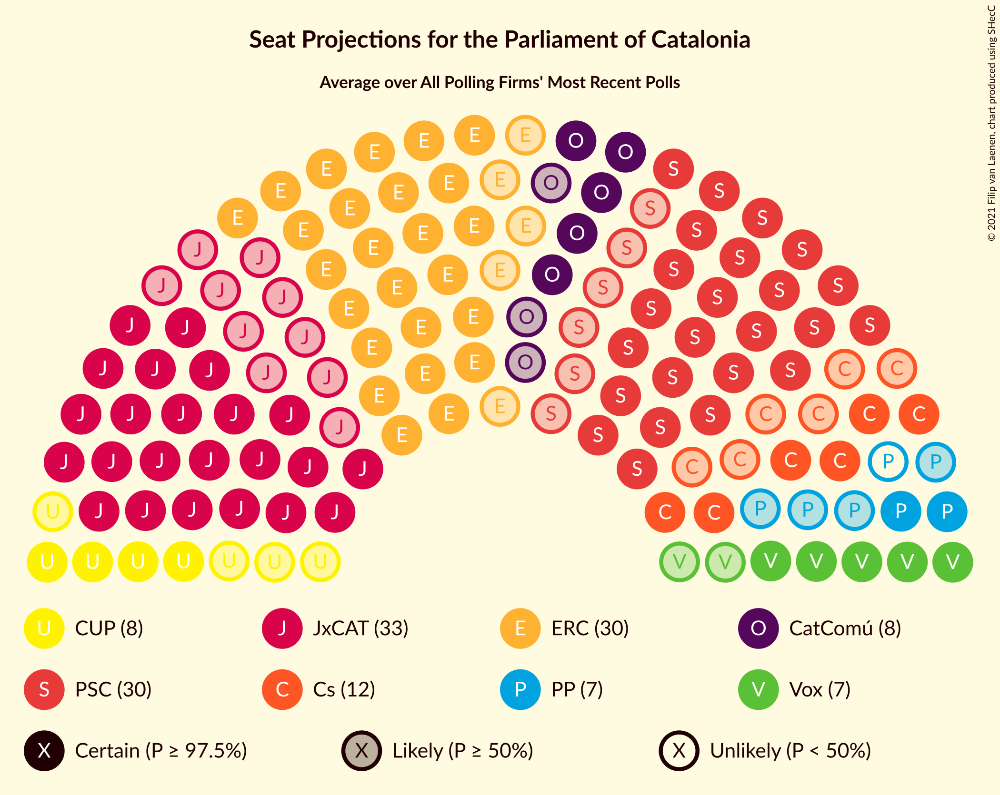

# Poll Average

<a href="#voting-intentions">Voting Intentions</a> | <a href="#seats">Seats</a> | <a href="#coalitions">Coalitions</a> | <a href="#technical-information">Technical Information</a>

## Summary

The table below lists the polls on which the average is based. They are the most recent polls (less than 90 days old) registered and analyzed so far.

| Period     | Polling firm/Commissioner(s) | Cs | JxCAT | ERC | PSC | CatComú | CUP | PP | Vox | PDeCAT |
|:----------:|:----------------------------:|:--:|:--:|:--:|:--:|:--:|:--:|:--:|:--:|:--:|
| 21 December 2017 | General Election | 25.4%   36 | 21.7%   34 | 21.4%   32 | 13.9%   17 | 7.5%   8 | 4.5%   4 | 4.2%   4 | 0.0%   0 | 0.0%   0 |
| N/A | Poll Average | 8–15%   12–20 | 17–23%   26–37 | 20–27%   30–42 | 14–21%   18–28 | 6–10%   5–12 | 3–8%   3–10 | 5–9%   5–12 | 3–7%   2–9 | 1–3%   0–1 |
| [25 November–7 December 2020](2020-12-07-GESOP.html) | GESOP   CEO | 10–14%   13–18 | 17–22%   26–35 | 21–26%   30–39 | 16–21%   22–29 | 5–9%   5–10 | 5–8%   6–11 | 5–8%   5–10 | 3–6%   3–7 | 1–3%   0–1 |
| [30 November 2020](2020-11-30-electoPanel.html) | electoPanel   electomania.es | 8–12%   10–16 | 18–23%   28–37 | 20–26%   31–40 | 16–21%   21–28 | 6–10%   6–12 | 4–7%   4–9 | 5–9%   6–12 | 4–7%   3–9 | 1–3%   0–1 |
| [17 October 2020](2020-10-17-KeyData.html) | Key Data   Público | 9–16%   12–22 | 16–24%   25–38 | 20–29%   30–44 | 13–21%   17–29 | 5–11%   5–14 | 3–7%   0–9 | 4–9%   5–12 | 3–7%   0–9 | N/A   N/A |
| [28 September–2 October 2020](2020-10-02-NCReport.html) | NC Report   La Razón | 10–15%   13–19 | 17–23%   26–37 | 20–26%   30–40 | 15–21%   19–28 | 6–10%   6–12 | 3–6%   2–8 | 6–10%   7–13 | 4–7%   3–8 | N/A   N/A |
| 21 December 2017 | General Election | 25.4%   36 | 21.7%   34 | 21.4%   32 | 13.9%   17 | 7.5%   8 | 4.5%   4 | 4.2%   4 | 0.0%   0 | 0.0%   0 |

Only polls for which at least the sample size has been published are included in the table above.

**Legend:**
+ **Top half of each row:** Voting intentions (95% confidence interval)
+ **Bottom half of each row:** Seat projections for the Parliament of Catalonia (95% confidence interval)
+ **Cs:** Ciutadans–Partido de la Ciudadanía
+ **JxCAT:** Junts per Catalunya
+ **ERC:** Esquerra Republicana–Catalunya Sí
+ **PSC:** Partit dels Socialistes de Catalunya (PSC-PSOE)
+ **CatComú:** Catalunya en Comú–Podem
+ **CUP:** Candidatura d’Unitat Popular
+ **PP:** Partit Popular
+ **Vox:** Vox
+ **PDeCAT:** Partit Demòcrata Europeu Català
+ **N/A (single party):** Party not included the published results
+ **N/A (entire row):** Calculation for this opinion poll not started yet

## Voting Intentions

### Confidence Intervals

| Party | Last Result | Median | 80% Confidence Interval | 90% Confidence Interval | 95% Confidence Interval | 99% Confidence Interval |
|:-----:|:-----------:|:------:|:-----------------------:|:-----------------------:|:-----------------------:|:-----------------------:|
| <a href="#ciutadans–partido-de-la-ciudadanía">Ciutadans–Partido de la Ciudadanía</a> | 25.4% | 11.5% | 9.5–13.5% |9.0–14.2% | 8.5–14.9% | 7.8–16.2% |
| <a href="#junts-per-catalunya">Junts per Catalunya</a> | 21.7% | 19.9% | 18.0–22.0% |17.4–22.7% | 16.9–23.3% | 15.7–24.6% |
| <a href="#esquerra-republicana–catalunya-sí">Esquerra Republicana–Catalunya Sí</a> | 21.4% | 23.4% | 21.4–25.7% |20.8–26.6% | 20.4–27.4% | 19.4–29.1% |
| <a href="#partit-dels-socialistes-de-catalunya-(psc-psoe)">Partit dels Socialistes de Catalunya (PSC-PSOE)</a> | 13.9% | 18.0% | 15.9–19.9% |15.2–20.5% | 14.5–21.0% | 13.3–22.0% |
| <a href="#catalunya-en-comú–podem">Catalunya en Comú–Podem</a> | 7.5% | 7.6% | 6.2–9.1% |5.9–9.6% | 5.6–10.0% | 5.0–11.0% |
| <a href="#candidatura-d’unitat-popular">Candidatura d’Unitat Popular</a> | 4.5% | 5.3% | 3.9–6.8% |3.6–7.2% | 3.3–7.6% | 2.8–8.3% |
| <a href="#partit-popular">Partit Popular</a> | 4.2% | 6.7% | 5.4–8.3% |5.1–8.8% | 4.7–9.2% | 4.2–10.1% |
| <a href="#vox">Vox</a> | 0.0% | 4.9% | 3.7–6.1% |3.4–6.4% | 3.1–6.8% | 2.5–7.4% |
| <a href="#partit-demòcrata-europeu-català">Partit Demòcrata Europeu Català</a> | 0.0% | 1.9% | 1.3–2.5% |1.2–2.7% | 1.1–2.9% | 0.9–3.3% |

### Ciutadans–Partido de la Ciudadanía

*For a full overview of the results for this party, see the [Ciutadans–Partido de la Ciudadanía](party-ciutadans–partidodelaciudadanía.html) page.*

| Voting Intentions | Probability | Accumulated | Special Marks |
|:-----------------:|:-----------:|:-----------:|:-------------:|
| 5.5–6.5% | 0% | 100% |  |
| 6.5–7.5% | 0.2% | 100% |  |
| 7.5–8.5% | 2% | 99.8% |  |
| 8.5–9.5% | 9% | 97% |  |
| 9.5–10.5% | 16% | 89% |  |
| 10.5–11.5% | 24% | 72% | Median |
| 11.5–12.5% | 24% | 48% |  |
| 12.5–13.5% | 15% | 25% |  |
| 13.5–14.5% | 6% | 10% |  |
| 14.5–15.5% | 2% | 4% |  |
| 15.5–16.5% | 0.8% | 1.2% |  |
| 16.5–17.5% | 0.2% | 0.3% |  |
| 17.5–18.5% | 0.1% | 0.1% |  |
| 18.5–19.5% | 0% | 0% |  |
| 19.5–20.5% | 0% | 0% |  |
| 20.5–21.5% | 0% | 0% |  |
| 21.5–22.5% | 0% | 0% |  |
| 22.5–23.5% | 0% | 0% |  |
| 23.5–24.5% | 0% | 0% |  |
| 24.5–25.5% | 0% | 0% | Last Result |

### Junts per Catalunya

*For a full overview of the results for this party, see the [Junts per Catalunya](party-juntspercatalunya.html) page.*

| Voting Intentions | Probability | Accumulated | Special Marks |
|:-----------------:|:-----------:|:-----------:|:-------------:|
| 12.5–13.5% | 0% | 100% |  |
| 13.5–14.5% | 0.1% | 100% |  |
| 14.5–15.5% | 0.3% | 99.9% |  |
| 15.5–16.5% | 1.2% | 99.6% |  |
| 16.5–17.5% | 4% | 98% |  |
| 17.5–18.5% | 12% | 94% |  |
| 18.5–19.5% | 22% | 82% |  |
| 19.5–20.5% | 25% | 60% | Median |
| 20.5–21.5% | 19% | 35% |  |
| 21.5–22.5% | 10% | 15% | Last Result |
| 22.5–23.5% | 4% | 6% |  |
| 23.5–24.5% | 1.2% | 2% |  |
| 24.5–25.5% | 0.4% | 0.5% |  |
| 25.5–26.5% | 0.1% | 0.1% |  |
| 26.5–27.5% | 0% | 0% |  |

### Esquerra Republicana–Catalunya Sí

*For a full overview of the results for this party, see the [Esquerra Republicana–Catalunya Sí](party-esquerrarepublicana–catalunyasí.html) page.*

| Voting Intentions | Probability | Accumulated | Special Marks |
|:-----------------:|:-----------:|:-----------:|:-------------:|
| 16.5–17.5% | 0% | 100% |  |
| 17.5–18.5% | 0.1% | 100% |  |
| 18.5–19.5% | 0.6% | 99.9% |  |
| 19.5–20.5% | 3% | 99.3% |  |
| 20.5–21.5% | 9% | 97% | Last Result |
| 21.5–22.5% | 18% | 88% |  |
| 22.5–23.5% | 24% | 70% | Median |
| 23.5–24.5% | 21% | 46% |  |
| 24.5–25.5% | 13% | 25% |  |
| 25.5–26.5% | 7% | 12% |  |
| 26.5–27.5% | 3% | 5% |  |
| 27.5–28.5% | 1.3% | 2% |  |
| 28.5–29.5% | 0.5% | 0.9% |  |
| 29.5–30.5% | 0.2% | 0.3% |  |
| 30.5–31.5% | 0.1% | 0.1% |  |
| 31.5–32.5% | 0% | 0% |  |

### Partit dels Socialistes de Catalunya (PSC-PSOE)

*For a full overview of the results for this party, see the [Partit dels Socialistes de Catalunya (PSC-PSOE)](party-partitdelssocialistesdecatalunyapsc-psoe.html) page.*

| Voting Intentions | Probability | Accumulated | Special Marks |
|:-----------------:|:-----------:|:-----------:|:-------------:|
| 10.5–11.5% | 0% | 100% |  |
| 11.5–12.5% | 0.1% | 100% |  |
| 12.5–13.5% | 0.6% | 99.8% |  |
| 13.5–14.5% | 2% | 99.2% | Last Result |
| 14.5–15.5% | 5% | 97% |  |
| 15.5–16.5% | 11% | 93% |  |
| 16.5–17.5% | 20% | 82% |  |
| 17.5–18.5% | 26% | 62% | Median |
| 18.5–19.5% | 21% | 36% |  |
| 19.5–20.5% | 11% | 15% |  |
| 20.5–21.5% | 4% | 5% |  |
| 21.5–22.5% | 0.8% | 1.0% |  |
| 22.5–23.5% | 0.2% | 0.2% |  |
| 23.5–24.5% | 0% | 0% |  |

### Catalunya en Comú–Podem

*For a full overview of the results for this party, see the [Catalunya en Comú–Podem](party-catalunyaencomú–podem.html) page.*

| Voting Intentions | Probability | Accumulated | Special Marks |
|:-----------------:|:-----------:|:-----------:|:-------------:|
| 2.5–3.5% | 0% | 100% |  |
| 3.5–4.5% | 0.1% | 100% |  |
| 4.5–5.5% | 2% | 99.9% |  |
| 5.5–6.5% | 15% | 98% |  |
| 6.5–7.5% | 33% | 83% | Last Result |
| 7.5–8.5% | 31% | 50% | Median |
| 8.5–9.5% | 14% | 20% |  |
| 9.5–10.5% | 4% | 5% |  |
| 10.5–11.5% | 0.9% | 1.1% |  |
| 11.5–12.5% | 0.2% | 0.2% |  |
| 12.5–13.5% | 0% | 0% |  |

### Candidatura d’Unitat Popular

*For a full overview of the results for this party, see the [Candidatura d’Unitat Popular](party-candidaturad’unitatpopular.html) page.*

| Voting Intentions | Probability | Accumulated | Special Marks |
|:-----------------:|:-----------:|:-----------:|:-------------:|
| 0.5–1.5% | 0% | 100% |  |
| 1.5–2.5% | 0.2% | 100% |  |
| 2.5–3.5% | 4% | 99.8% |  |
| 3.5–4.5% | 22% | 96% | Last Result |
| 4.5–5.5% | 33% | 74% | Median |
| 5.5–6.5% | 26% | 41% |  |
| 6.5–7.5% | 12% | 15% |  |
| 7.5–8.5% | 2% | 3% |  |
| 8.5–9.5% | 0.2% | 0.2% |  |
| 9.5–10.5% | 0% | 0% |  |

### Partit Popular

*For a full overview of the results for this party, see the [Partit Popular](party-partitpopular.html) page.*

| Voting Intentions | Probability | Accumulated | Special Marks |
|:-----------------:|:-----------:|:-----------:|:-------------:|
| 2.5–3.5% | 0.1% | 100% |  |
| 3.5–4.5% | 1.4% | 99.9% | Last Result |
| 4.5–5.5% | 12% | 98% |  |
| 5.5–6.5% | 31% | 87% |  |
| 6.5–7.5% | 31% | 56% | Median |
| 7.5–8.5% | 18% | 25% |  |
| 8.5–9.5% | 6% | 7% |  |
| 9.5–10.5% | 1.2% | 1.4% |  |
| 10.5–11.5% | 0.2% | 0.2% |  |
| 11.5–12.5% | 0% | 0% |  |

### Vox

*For a full overview of the results for this party, see the [Vox](party-vox.html) page.*

| Voting Intentions | Probability | Accumulated | Special Marks |
|:-----------------:|:-----------:|:-----------:|:-------------:|
| 0.0–0.5% | 0% | 100% | Last Result |
| 0.5–1.5% | 0% | 100% |  |
| 1.5–2.5% | 0.6% | 100% |  |
| 2.5–3.5% | 6% | 99.4% |  |
| 3.5–4.5% | 29% | 93% |  |
| 4.5–5.5% | 41% | 64% | Median |
| 5.5–6.5% | 19% | 23% |  |
| 6.5–7.5% | 4% | 4% |  |
| 7.5–8.5% | 0.4% | 0.4% |  |
| 8.5–9.5% | 0% | 0% |  |

### Partit Demòcrata Europeu Català

*For a full overview of the results for this party, see the [Partit Demòcrata Europeu Català](party-partitdemòcrataeuropeucatalà.html) page.*

| Voting Intentions | Probability | Accumulated | Special Marks |
|:-----------------:|:-----------:|:-----------:|:-------------:|
| 0.0–0.5% | 0% | 100% | Last Result |
| 0.5–1.5% | 23% | 100% |  |
| 1.5–2.5% | 68% | 77% | Median |
| 2.5–3.5% | 8% | 8% |  |
| 3.5–4.5% | 0.1% | 0.1% |  |
| 4.5–5.5% | 0% | 0% |  |

## Seats

### Confidence Intervals

| Party | Last Result | Median | 80% Confidence Interval | 90% Confidence Interval | 95% Confidence Interval | 99% Confidence Interval |
|:-----:|:-----------:|:------:|:-----------------------:|:-----------------------:|:-----------------------:|:-----------------------:|
| <a href="#ciutadans–partido-de-la-ciudadanía">Ciutadans–Partido de la Ciudadanía</a> | 36 | 14 | 13–18 |12–19 | 12–20 | 9–22 |
| <a href="#junts-per-catalunya">Junts per Catalunya</a> | 34 | 31 | 28–35 |27–37 | 26–37 | 24–39 |
| <a href="#esquerra-republicana–catalunya-sí">Esquerra Republicana–Catalunya Sí</a> | 32 | 35 | 32–39 |31–40 | 30–42 | 29–45 |
| <a href="#partit-dels-socialistes-de-catalunya-(psc-psoe)">Partit dels Socialistes de Catalunya (PSC-PSOE)</a> | 17 | 24 | 21–26 |20–28 | 18–28 | 17–30 |
| <a href="#catalunya-en-comú–podem">Catalunya en Comú–Podem</a> | 8 | 8 | 7–11 |6–11 | 5–12 | 5–14 |
| <a href="#candidatura-d’unitat-popular">Candidatura d’Unitat Popular</a> | 4 | 7 | 4–9 |3–9 | 3–10 | 0–11 |
| <a href="#partit-popular">Partit Popular</a> | 4 | 9 | 7–11 |6–12 | 5–12 | 4–14 |
| <a href="#vox">Vox</a> | 0 | 5 | 3–7 |3–8 | 2–9 | 0–9 |
| <a href="#partit-demòcrata-europeu-català">Partit Demòcrata Europeu Català</a> | 0 | 0 | 0 |0–1 | 0–1 | 0–1 |

### Ciutadans–Partido de la Ciudadanía

*For a full overview of the results for this party, see the [Ciutadans–Partido de la Ciudadanía](party-ciutadans–partidodelaciudadanía.html) page.*

| Number of Seats | Probability | Accumulated | Special Marks |
|:---------------:|:-----------:|:-----------:|:-------------:|
| 8 | 0.1% | 100% |  |
| 9 | 0.6% | 99.9% |  |
| 10 | 0.5% | 99.3% |  |
| 11 | 0.5% | 98.8% |  |
| 12 | 6% | 98% |  |
| 13 | 23% | 92% |  |
| 14 | 21% | 69% | Median |
| 15 | 7% | 49% |  |
| 16 | 12% | 41% |  |
| 17 | 7% | 30% |  |
| 18 | 14% | 22% |  |
| 19 | 5% | 8% |  |
| 20 | 2% | 3% |  |
| 21 | 0.5% | 1.3% |  |
| 22 | 0.3% | 0.7% |  |
| 23 | 0.2% | 0.4% |  |
| 24 | 0.1% | 0.2% |  |
| 25 | 0.1% | 0.1% |  |
| 26 | 0% | 0% |  |
| 27 | 0% | 0% |  |
| 28 | 0% | 0% |  |
| 29 | 0% | 0% |  |
| 30 | 0% | 0% |  |
| 31 | 0% | 0% |  |
| 32 | 0% | 0% |  |
| 33 | 0% | 0% |  |
| 34 | 0% | 0% |  |
| 35 | 0% | 0% |  |
| 36 | 0% | 0% | Last Result |

### Junts per Catalunya

*For a full overview of the results for this party, see the [Junts per Catalunya](party-juntspercatalunya.html) page.*

| Number of Seats | Probability | Accumulated | Special Marks |
|:---------------:|:-----------:|:-----------:|:-------------:|
| 23 | 0.1% | 100% |  |
| 24 | 0.4% | 99.8% |  |
| 25 | 0.9% | 99.4% |  |
| 26 | 3% | 98.6% |  |
| 27 | 2% | 96% |  |
| 28 | 4% | 94% |  |
| 29 | 7% | 90% |  |
| 30 | 10% | 82% |  |
| 31 | 24% | 73% | Median |
| 32 | 18% | 49% |  |
| 33 | 11% | 31% |  |
| 34 | 7% | 20% | Last Result |
| 35 | 5% | 13% |  |
| 36 | 2% | 8% |  |
| 37 | 4% | 5% |  |
| 38 | 1.0% | 2% |  |
| 39 | 0.4% | 0.7% |  |
| 40 | 0.1% | 0.3% |  |
| 41 | 0.1% | 0.2% |  |
| 42 | 0% | 0.1% |  |
| 43 | 0% | 0% |  |

### Esquerra Republicana–Catalunya Sí

*For a full overview of the results for this party, see the [Esquerra Republicana–Catalunya Sí](party-esquerrarepublicana–catalunyasí.html) page.*

| Number of Seats | Probability | Accumulated | Special Marks |
|:---------------:|:-----------:|:-----------:|:-------------:|
| 27 | 0.1% | 100% |  |
| 28 | 0.4% | 99.9% |  |
| 29 | 0.9% | 99.5% |  |
| 30 | 2% | 98.6% |  |
| 31 | 5% | 97% |  |
| 32 | 7% | 91% | Last Result |
| 33 | 9% | 84% |  |
| 34 | 12% | 76% |  |
| 35 | 21% | 64% | Median |
| 36 | 14% | 42% |  |
| 37 | 10% | 29% |  |
| 38 | 7% | 19% |  |
| 39 | 4% | 12% |  |
| 40 | 3% | 8% |  |
| 41 | 2% | 5% |  |
| 42 | 1.1% | 3% |  |
| 43 | 0.7% | 2% |  |
| 44 | 0.5% | 1.1% |  |
| 45 | 0.3% | 0.6% |  |
| 46 | 0.2% | 0.3% |  |
| 47 | 0% | 0.1% |  |
| 48 | 0% | 0% |  |

### Partit dels Socialistes de Catalunya (PSC-PSOE)

*For a full overview of the results for this party, see the [Partit dels Socialistes de Catalunya (PSC-PSOE)](party-partitdelssocialistesdecatalunyapsc-psoe.html) page.*

| Number of Seats | Probability | Accumulated | Special Marks |
|:---------------:|:-----------:|:-----------:|:-------------:|
| 15 | 0% | 100% |  |
| 16 | 0.3% | 99.9% |  |
| 17 | 1.0% | 99.7% | Last Result |
| 18 | 2% | 98.7% |  |
| 19 | 2% | 97% |  |
| 20 | 3% | 96% |  |
| 21 | 4% | 92% |  |
| 22 | 9% | 89% |  |
| 23 | 11% | 80% |  |
| 24 | 24% | 69% | Median |
| 25 | 22% | 44% |  |
| 26 | 14% | 23% |  |
| 27 | 3% | 8% |  |
| 28 | 3% | 5% |  |
| 29 | 1.1% | 2% |  |
| 30 | 0.8% | 1.2% |  |
| 31 | 0.3% | 0.4% |  |
| 32 | 0.1% | 0.1% |  |
| 33 | 0% | 0% |  |

### Catalunya en Comú–Podem

*For a full overview of the results for this party, see the [Catalunya en Comú–Podem](party-catalunyaencomú–podem.html) page.*

| Number of Seats | Probability | Accumulated | Special Marks |
|:---------------:|:-----------:|:-----------:|:-------------:|
| 4 | 0.3% | 100% |  |
| 5 | 4% | 99.7% |  |
| 6 | 5% | 96% |  |
| 7 | 13% | 91% |  |
| 8 | 35% | 78% | Last Result, Median |
| 9 | 19% | 43% |  |
| 10 | 11% | 24% |  |
| 11 | 10% | 14% |  |
| 12 | 2% | 4% |  |
| 13 | 1.3% | 2% |  |
| 14 | 0.6% | 0.8% |  |
| 15 | 0.1% | 0.2% |  |
| 16 | 0.1% | 0.1% |  |
| 17 | 0% | 0% |  |

### Candidatura d’Unitat Popular

*For a full overview of the results for this party, see the [Candidatura d’Unitat Popular](party-candidaturad’unitatpopular.html) page.*

| Number of Seats | Probability | Accumulated | Special Marks |
|:---------------:|:-----------:|:-----------:|:-------------:|
| 0 | 1.0% | 100% |  |
| 1 | 0% | 99.0% |  |
| 2 | 1.5% | 99.0% |  |
| 3 | 5% | 98% |  |
| 4 | 16% | 93% | Last Result |
| 5 | 9% | 77% |  |
| 6 | 9% | 68% |  |
| 7 | 17% | 59% | Median |
| 8 | 28% | 42% |  |
| 9 | 11% | 13% |  |
| 10 | 1.4% | 3% |  |
| 11 | 1.2% | 1.3% |  |
| 12 | 0.1% | 0.1% |  |
| 13 | 0% | 0% |  |

### Partit Popular

*For a full overview of the results for this party, see the [Partit Popular](party-partitpopular.html) page.*

| Number of Seats | Probability | Accumulated | Special Marks |
|:---------------:|:-----------:|:-----------:|:-------------:|
| 3 | 0.4% | 100% |  |
| 4 | 0.2% | 99.6% | Last Result |
| 5 | 4% | 99.4% |  |
| 6 | 5% | 95% |  |
| 7 | 26% | 91% |  |
| 8 | 12% | 65% |  |
| 9 | 25% | 52% | Median |
| 10 | 16% | 27% |  |
| 11 | 4% | 11% |  |
| 12 | 6% | 7% |  |
| 13 | 0.4% | 1.3% |  |
| 14 | 0.7% | 0.8% |  |
| 15 | 0.1% | 0.1% |  |
| 16 | 0% | 0% |  |

### Vox

*For a full overview of the results for this party, see the [Vox](party-vox.html) page.*

| Number of Seats | Probability | Accumulated | Special Marks |
|:---------------:|:-----------:|:-----------:|:-------------:|
| 0 | 2% | 100% | Last Result |
| 1 | 0% | 98% |  |
| 2 | 2% | 98% |  |
| 3 | 15% | 97% |  |
| 4 | 6% | 81% |  |
| 5 | 33% | 75% | Median |
| 6 | 12% | 43% |  |
| 7 | 25% | 31% |  |
| 8 | 3% | 6% |  |
| 9 | 2% | 3% |  |
| 10 | 0.3% | 0.4% |  |
| 11 | 0.1% | 0.1% |  |
| 12 | 0% | 0% |  |

### Partit Demòcrata Europeu Català

*For a full overview of the results for this party, see the [Partit Demòcrata Europeu Català](party-partitdemòcrataeuropeucatalà.html) page.*

| Number of Seats | Probability | Accumulated | Special Marks |
|:---------------:|:-----------:|:-----------:|:-------------:|
| 0 | 94% | 100% | Last Result, Median |
| 1 | 6% | 6% |  |
| 2 | 0% | 0.2% |  |
| 3 | 0.1% | 0.2% |  |
| 4 | 0% | 0.1% |  |
| 5 | 0% | 0% |  |

## Coalitions

### Confidence Intervals

| Coalition | Last Result | Median | Majority? | 80% Confidence Interval | 90% Confidence Interval | 95% Confidence Interval | 99% Confidence Interval |
|:---------:|:-----------:|:------:|:---------:|:-----------------------:|:-----------------------:|:-----------------------:|:-----------------------:|
| Junts per Catalunya – Esquerra Republicana–Catalunya Sí – Catalunya en Comú–Podem | 74 | 75 | 99.4% | 71–80 | 70–81 | 69–83 | 67–86 |
| Junts per Catalunya – Esquerra Republicana–Catalunya Sí – Candidatura d’Unitat Popular | 70 | 73 | 96% | 69–78 | 68–79 | 67–80 | 65–83 |
| Junts per Catalunya – Esquerra Republicana–Catalunya Sí – Candidatura d’Unitat Popular – Partit Demòcrata Europeu Català | 70 | 74 | 99.5% | 71–78 | 70–78 | 69–79 | 68–81 |
| Esquerra Republicana–Catalunya Sí – Partit dels Socialistes de Catalunya (PSC-PSOE) – Catalunya en Comú–Podem | 57 | 68 | 54% | 64–72 | 63–73 | 62–74 | 59–77 |
| Junts per Catalunya – Esquerra Republicana–Catalunya Sí | 66 | 67 | 40% | 63–71 | 62–73 | 61–74 | 59–77 |
| Junts per Catalunya – Esquerra Republicana–Catalunya Sí – Partit Demòcrata Europeu Català | 66 | 67 | 35% | 63–70 | 63–71 | 61–72 | 60–73 |
| Ciutadans–Partido de la Ciudadanía – Partit dels Socialistes de Catalunya (PSC-PSOE) – Catalunya en Comú–Podem – Partit Popular | 65 | 56 | 0.1% | 52–60 | 51–62 | 50–63 | 48–65 |
| Ciutadans–Partido de la Ciudadanía – Partit dels Socialistes de Catalunya (PSC-PSOE) – Partit Popular – Vox | 57 | 53 | 0% | 49–57 | 48–59 | 46–59 | 44–62 |
| Ciutadans–Partido de la Ciudadanía – Partit dels Socialistes de Catalunya (PSC-PSOE) – Partit Popular | 57 | 48 | 0% | 44–52 | 43–53 | 42–54 | 39–56 |
| Esquerra Republicana–Catalunya Sí – Catalunya en Comú–Podem | 40 | 44 | 0% | 40–48 | 39–49 | 38–51 | 36–54 |

### Junts per Catalunya – Esquerra Republicana–Catalunya Sí – Catalunya en Comú–Podem

| Number of Seats | Probability | Accumulated | Special Marks |
|:---------------:|:-----------:|:-----------:|:-------------:|
| 65 | 0.1% | 100% |  |
| 66 | 0.1% | 99.9% |  |
| 67 | 0.4% | 99.8% |  |
| 68 | 1.1% | 99.4% | Majority |
| 69 | 1.4% | 98% |  |
| 70 | 3% | 97% |  |
| 71 | 4% | 94% |  |
| 72 | 6% | 90% |  |
| 73 | 12% | 83% |  |
| 74 | 12% | 71% | Last Result, Median |
| 75 | 12% | 59% |  |
| 76 | 11% | 47% |  |
| 77 | 12% | 36% |  |
| 78 | 7% | 24% |  |
| 79 | 6% | 17% |  |
| 80 | 4% | 11% |  |
| 81 | 2% | 7% |  |
| 82 | 2% | 5% |  |
| 83 | 1.1% | 3% |  |
| 84 | 0.6% | 2% |  |
| 85 | 0.5% | 1.0% |  |
| 86 | 0.2% | 0.5% |  |
| 87 | 0.2% | 0.3% |  |
| 88 | 0.1% | 0.2% |  |
| 89 | 0.1% | 0.1% |  |
| 90 | 0% | 0% |  |

### Junts per Catalunya – Esquerra Republicana–Catalunya Sí – Candidatura d’Unitat Popular

| Number of Seats | Probability | Accumulated | Special Marks |
|:---------------:|:-----------:|:-----------:|:-------------:|
| 62 | 0.1% | 100% |  |
| 63 | 0.1% | 99.9% |  |
| 64 | 0.3% | 99.8% |  |
| 65 | 0.7% | 99.5% |  |
| 66 | 0.9% | 98.9% |  |
| 67 | 2% | 98% |  |
| 68 | 4% | 96% | Majority |
| 69 | 5% | 93% |  |
| 70 | 6% | 88% | Last Result |
| 71 | 9% | 82% |  |
| 72 | 10% | 73% |  |
| 73 | 13% | 63% | Median |
| 74 | 13% | 50% |  |
| 75 | 12% | 37% |  |
| 76 | 8% | 25% |  |
| 77 | 5% | 17% |  |
| 78 | 6% | 12% |  |
| 79 | 3% | 6% |  |
| 80 | 1.2% | 3% |  |
| 81 | 1.1% | 2% |  |
| 82 | 0.4% | 1.0% |  |
| 83 | 0.3% | 0.5% |  |
| 84 | 0.1% | 0.3% |  |
| 85 | 0.1% | 0.1% |  |
| 86 | 0% | 0.1% |  |
| 87 | 0% | 0% |  |

### Junts per Catalunya – Esquerra Republicana–Catalunya Sí – Candidatura d’Unitat Popular – Partit Demòcrata Europeu Català

| Number of Seats | Probability | Accumulated | Special Marks |
|:---------------:|:-----------:|:-----------:|:-------------:|
| 65 | 0% | 100% |  |
| 66 | 0.1% | 99.9% |  |
| 67 | 0.3% | 99.8% |  |
| 68 | 0.9% | 99.5% | Majority |
| 69 | 2% | 98.6% |  |
| 70 | 4% | 96% | Last Result |
| 71 | 9% | 92% |  |
| 72 | 7% | 84% |  |
| 73 | 17% | 76% | Median |
| 74 | 14% | 59% |  |
| 75 | 17% | 45% |  |
| 76 | 11% | 28% |  |
| 77 | 6% | 18% |  |
| 78 | 8% | 12% |  |
| 79 | 2% | 4% |  |
| 80 | 0.9% | 2% |  |
| 81 | 0.5% | 0.7% |  |
| 82 | 0.1% | 0.2% |  |
| 83 | 0% | 0.1% |  |
| 84 | 0% | 0% |  |

### Esquerra Republicana–Catalunya Sí – Partit dels Socialistes de Catalunya (PSC-PSOE) – Catalunya en Comú–Podem

| Number of Seats | Probability | Accumulated | Special Marks |
|:---------------:|:-----------:|:-----------:|:-------------:|
| 56 | 0% | 100% |  |
| 57 | 0.1% | 99.9% | Last Result |
| 58 | 0.1% | 99.9% |  |
| 59 | 0.3% | 99.8% |  |
| 60 | 0.7% | 99.5% |  |
| 61 | 1.0% | 98.8% |  |
| 62 | 2% | 98% |  |
| 63 | 4% | 95% |  |
| 64 | 5% | 92% |  |
| 65 | 6% | 86% |  |
| 66 | 11% | 80% |  |
| 67 | 16% | 70% | Median |
| 68 | 13% | 54% | Majority |
| 69 | 13% | 41% |  |
| 70 | 10% | 28% |  |
| 71 | 6% | 18% |  |
| 72 | 5% | 12% |  |
| 73 | 3% | 7% |  |
| 74 | 2% | 4% |  |
| 75 | 1.1% | 2% |  |
| 76 | 0.5% | 1.3% |  |
| 77 | 0.3% | 0.8% |  |
| 78 | 0.2% | 0.4% |  |
| 79 | 0.2% | 0.3% |  |
| 80 | 0.1% | 0.1% |  |
| 81 | 0% | 0.1% |  |
| 82 | 0% | 0% |  |

### Junts per Catalunya – Esquerra Republicana–Catalunya Sí

| Number of Seats | Probability | Accumulated | Special Marks |
|:---------------:|:-----------:|:-----------:|:-------------:|
| 56 | 0% | 100% |  |
| 57 | 0.1% | 99.9% |  |
| 58 | 0.2% | 99.9% |  |
| 59 | 0.4% | 99.6% |  |
| 60 | 1.0% | 99.2% |  |
| 61 | 2% | 98% |  |
| 62 | 3% | 96% |  |
| 63 | 6% | 93% |  |
| 64 | 7% | 86% |  |
| 65 | 14% | 79% |  |
| 66 | 13% | 65% | Last Result, Median |
| 67 | 12% | 52% |  |
| 68 | 9% | 40% | Majority |
| 69 | 11% | 31% |  |
| 70 | 6% | 19% |  |
| 71 | 4% | 13% |  |
| 72 | 4% | 9% |  |
| 73 | 2% | 5% |  |
| 74 | 1.3% | 3% |  |
| 75 | 0.6% | 2% |  |
| 76 | 0.4% | 1.1% |  |
| 77 | 0.3% | 0.7% |  |
| 78 | 0.1% | 0.3% |  |
| 79 | 0.1% | 0.2% |  |
| 80 | 0% | 0.1% |  |
| 81 | 0% | 0.1% |  |
| 82 | 0% | 0% |  |

### Junts per Catalunya – Esquerra Republicana–Catalunya Sí – Partit Demòcrata Europeu Català

| Number of Seats | Probability | Accumulated | Special Marks |
|:---------------:|:-----------:|:-----------:|:-------------:|
| 58 | 0.1% | 100% |  |
| 59 | 0.1% | 99.9% |  |
| 60 | 0.7% | 99.8% |  |
| 61 | 2% | 99.1% |  |
| 62 | 2% | 97% |  |
| 63 | 6% | 95% |  |
| 64 | 6% | 89% |  |
| 65 | 17% | 83% |  |
| 66 | 14% | 66% | Last Result, Median |
| 67 | 17% | 53% |  |
| 68 | 10% | 35% | Majority |
| 69 | 14% | 26% |  |
| 70 | 5% | 12% |  |
| 71 | 2% | 7% |  |
| 72 | 3% | 5% |  |
| 73 | 2% | 2% |  |
| 74 | 0.3% | 0.5% |  |
| 75 | 0.1% | 0.2% |  |
| 76 | 0% | 0.1% |  |
| 77 | 0% | 0% |  |

### Ciutadans–Partido de la Ciudadanía – Partit dels Socialistes de Catalunya (PSC-PSOE) – Catalunya en Comú–Podem – Partit Popular

| Number of Seats | Probability | Accumulated | Special Marks |
|:---------------:|:-----------:|:-----------:|:-------------:|
| 45 | 0.1% | 100% |  |
| 46 | 0.1% | 99.9% |  |
| 47 | 0.2% | 99.8% |  |
| 48 | 0.5% | 99.6% |  |
| 49 | 1.1% | 99.2% |  |
| 50 | 1.4% | 98% |  |
| 51 | 3% | 97% |  |
| 52 | 5% | 94% |  |
| 53 | 8% | 88% |  |
| 54 | 10% | 80% |  |
| 55 | 12% | 70% | Median |
| 56 | 12% | 58% |  |
| 57 | 12% | 46% |  |
| 58 | 10% | 33% |  |
| 59 | 8% | 23% |  |
| 60 | 6% | 15% |  |
| 61 | 4% | 9% |  |
| 62 | 2% | 5% |  |
| 63 | 1.4% | 3% |  |
| 64 | 0.7% | 2% |  |
| 65 | 0.5% | 1.0% | Last Result |
| 66 | 0.2% | 0.5% |  |
| 67 | 0.1% | 0.3% |  |
| 68 | 0.1% | 0.1% | Majority |
| 69 | 0% | 0.1% |  |
| 70 | 0% | 0% |  |

### Ciutadans–Partido de la Ciudadanía – Partit dels Socialistes de Catalunya (PSC-PSOE) – Partit Popular – Vox

| Number of Seats | Probability | Accumulated | Special Marks |
|:---------------:|:-----------:|:-----------:|:-------------:|
| 40 | 0% | 100% |  |
| 41 | 0% | 99.9% |  |
| 42 | 0.1% | 99.9% |  |
| 43 | 0.3% | 99.8% |  |
| 44 | 0.3% | 99.5% |  |
| 45 | 0.9% | 99.2% |  |
| 46 | 0.9% | 98% |  |
| 47 | 2% | 97% |  |
| 48 | 3% | 96% |  |
| 49 | 6% | 93% |  |
| 50 | 8% | 87% |  |
| 51 | 9% | 78% |  |
| 52 | 12% | 70% | Median |
| 53 | 14% | 58% |  |
| 54 | 14% | 44% |  |
| 55 | 9% | 30% |  |
| 56 | 7% | 21% |  |
| 57 | 5% | 13% | Last Result |
| 58 | 3% | 8% |  |
| 59 | 3% | 5% |  |
| 60 | 1.1% | 2% |  |
| 61 | 0.6% | 1.1% |  |
| 62 | 0.3% | 0.5% |  |
| 63 | 0.1% | 0.2% |  |
| 64 | 0.1% | 0.1% |  |
| 65 | 0% | 0% |  |

### Ciutadans–Partido de la Ciudadanía – Partit dels Socialistes de Catalunya (PSC-PSOE) – Partit Popular

| Number of Seats | Probability | Accumulated | Special Marks |
|:---------------:|:-----------:|:-----------:|:-------------:|
| 37 | 0.1% | 100% |  |
| 38 | 0.1% | 99.9% |  |
| 39 | 0.3% | 99.7% |  |
| 40 | 0.8% | 99.5% |  |
| 41 | 1.0% | 98.7% |  |
| 42 | 2% | 98% |  |
| 43 | 5% | 96% |  |
| 44 | 7% | 91% |  |
| 45 | 7% | 84% |  |
| 46 | 11% | 77% |  |
| 47 | 14% | 66% | Median |
| 48 | 12% | 51% |  |
| 49 | 12% | 40% |  |
| 50 | 10% | 28% |  |
| 51 | 6% | 18% |  |
| 52 | 5% | 11% |  |
| 53 | 3% | 6% |  |
| 54 | 1.4% | 3% |  |
| 55 | 0.8% | 2% |  |
| 56 | 0.5% | 0.9% |  |
| 57 | 0.2% | 0.4% | Last Result |
| 58 | 0.1% | 0.2% |  |
| 59 | 0% | 0.1% |  |
| 60 | 0% | 0.1% |  |
| 61 | 0% | 0% |  |

### Esquerra Republicana–Catalunya Sí – Catalunya en Comú–Podem

| Number of Seats | Probability | Accumulated | Special Marks |
|:---------------:|:-----------:|:-----------:|:-------------:|
| 35 | 0.1% | 100% |  |
| 36 | 0.4% | 99.8% |  |
| 37 | 1.3% | 99.5% |  |
| 38 | 2% | 98% |  |
| 39 | 3% | 96% |  |
| 40 | 6% | 93% | Last Result |
| 41 | 8% | 88% |  |
| 42 | 14% | 80% |  |
| 43 | 14% | 66% | Median |
| 44 | 15% | 52% |  |
| 45 | 12% | 38% |  |
| 46 | 9% | 25% |  |
| 47 | 4% | 16% |  |
| 48 | 4% | 12% |  |
| 49 | 3% | 8% |  |
| 50 | 2% | 5% |  |
| 51 | 1.1% | 3% |  |
| 52 | 0.5% | 2% |  |
| 53 | 0.5% | 1.2% |  |
| 54 | 0.3% | 0.6% |  |
| 55 | 0.2% | 0.3% |  |
| 56 | 0.1% | 0.2% |  |
| 57 | 0% | 0.1% |  |
| 58 | 0% | 0% |  |

## Technical Information

+ **Number of polls included in this average:** 4
+ **Lowest number of simulations done in a poll included in this average:** 1,048,576
+ **Total number of simulations done in the polls included in this average:** 4,194,304
+ **Error estimate:** 2.65%
