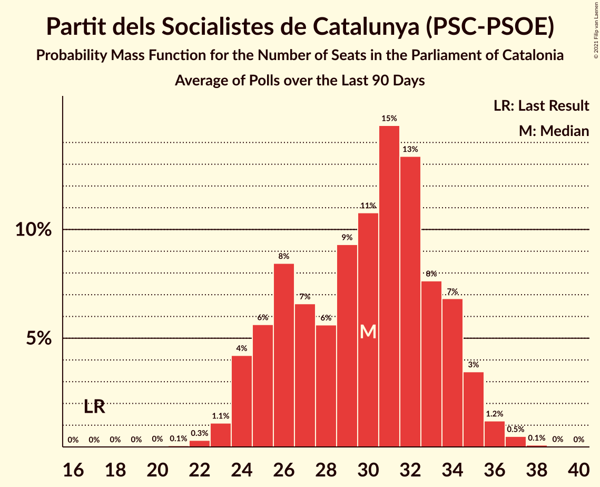

# Poll Average

<a href="#voting-intentions">Voting Intentions</a> | <a href="#seats">Seats</a> | <a href="#coalitions">Coalitions</a> | <a href="#technical-information">Technical Information</a>

## Summary

The table below lists the polls on which the average is based. They are the most recent polls (less than 90 days old) registered and analyzed so far.

| Period     | Polling firm/Commissioner(s) | JxSí | PDeCAT | JuntsxCat | ERC | Cs | PSC | CatComú | PP | CUP |
|:----------:|:----------------------------:|:--:|:--:|:--:|:--:|:--:|:--:|:--:|:--:|:--:|
| 27 September 2015 | General Election | 39.6%   62 | 39.6%   29 | 39.6%   29 | 39.6%   20 | 17.9%   25 | 12.7%   16 | 8.9%   11 | 8.5%   11 | 8.2%   10 |
| N/A | Poll Average | N/A   N/A | 8–12%   11–17 | 12–22%   17–34 | 19–28%   29–44 | 17–26%   24–36 | 13–20%   16–26 | 6–12%   6–14 | 5–10%   5–13 | 4–8%   4–10 |
| [1–9 December 2017](2017-12-09-SocioMétrica.html) | SocioMétrica   El Español | N/A   N/A | N/A   N/A | 19–24%   29–37 | 19–24%   29–37 | 19–24%   25–32 | 12–16%   15–22 | 7–10%   7–12 | 5–8%   5–10 | 5–7%   5–9 |
| [4–8 December 2017](2017-12-08-Feedback.html) | Feedback   El Nacional | N/A   N/A | N/A   N/A | 17–21%   24–32 | 20–25%   30–38 | 19–24%   25–32 | 14–18%   17–24 | 6–9%   5–11 | 5–8%   5–10 | 6–9%   8–11 |
| [4–7 December 2017](2017-12-07-GAD3.html) | GAD3   La Vanguardia | N/A   N/A | N/A   N/A | 16–21%   23–31 | 19–24%   29–37 | 21–26%   27–35 | 14–19%   18–25 | 6–9%   5–11 | 6–9%   6–11 | 4–7%   3–8 |
| [30 November–7 December 2017](2017-12-07-Celeste-Tel.html) | Celeste-Tel   eldiario.es | N/A   N/A | N/A   N/A | 14–19%   20–29 | 20–26%   30–39 | 19–25%   26–34 | 14–19%   17–24 | 6–10%   6–12 | 5–9%   5–10 | 5–9%   5–10 |
| [29 November–2 December 2017](2017-12-02-GESOP.html) | GESOP   El Periódico | N/A   N/A | N/A   N/A | 17–22%   25–33 | 18–23%   27–36 | 16–22%   22–30 | 16–22%   22–30 | 7–11%   7–13 | 4–8%   4–10 | 5–8%   5–10 |
| [23–27 November 2017](2017-11-27-IMOP.html) | IMOP Insights   CIS | N/A   N/A | N/A   N/A | 16–18%   23–29 | 19–22%   30–35 | 21–24%   29–33 | 15–17%   19–23 | 8–10%   8–11 | 5–7%   5–8 | 6–8%   8–9 |
| [13–23 November 2017](2017-11-23-NCReport.html) | NC Report   La Razón | N/A   N/A | N/A   N/A | 11–16%   17–24 | 21–27%   32–43 | 18–24%   25–33 | 12–18%   15–23 | 7–11%   7–13 | 7–12%   9–15 | 4–8%   3–10 |
| [13–23 November 2017](2017-11-23-AdviceStrategicConsultants.html) | Advice Strategic Consultants   El Confidencial | N/A   N/A | N/A   N/A | 11–14%   17–21 | 25–29%   39–46 | 17–20%   24–28 | 13–16%   16–22 | 8–11%   9–13 | 7–9%   8–12 | 5–7%   7–9 |
| [20–22 November 2017](2017-11-22-Metroscopia.html) | Metroscopia   El País | N/A   N/A | N/A   N/A | 12–15%   17–23 | 24–29%   37–44 | 23–28%   31–38 | 13–17%   16–23 | 5–8%   5–9 | 5–7%   5–9 | 5–7%   5–9 |
| [23–26 October 2017](2017-10-26-SigmaDos.html) | Sigma Dos   El Mundo | N/A   N/A | 8–12%   11–17 | N/A   N/A | 24–29%   37–45 | 17–22%   24–31 | 13–17%   16–23 | 9–13%   11–17 | 7–11%   9–13 | 5–8%   5–10 |
| 27 September 2015 | General Election | 39.6%   62 | 39.6%   29 | 39.6%   29 | 39.6%   20 | 17.9%   25 | 12.7%   16 | 8.9%   11 | 8.5%   11 | 8.2%   10 |

Only polls for which at least the sample size has been published are included in the table above.

**Legend:**
+ **Top half of each row:** Voting intentions (95% confidence interval)
+ **Bottom half of each row:** Seat projections for the Parliament of Catalonia (95% confidence interval)
+ **JxSí:** Junts pel Sí
+ **PDeCAT:** Partit Demòcrata Europeu Català
+ **JuntsxCat:** Junts per Catalunya
+ **ERC:** Esquerra Republicana de Catalunya–Catalunya Sí
+ **Cs:** Ciutadans–Partido de la Ciudadanía
+ **PSC:** Partit dels Socialistes de Catalunya (PSC-PSOE)
+ **CatComú:** Catalunya en Comú
+ **PP:** Partit Popular
+ **CUP:** Candidatura d’Unitat Popular
+ **N/A (single party):** Party not included the published results
+ **N/A (entire row):** Calculation for this opinion poll not started yet

## Voting Intentions

### Confidence Intervals

| Party | Last Result | Median | 80% Confidence Interval | 90% Confidence Interval | 95% Confidence Interval | 99% Confidence Interval |
|:-----:|:-----------:|:------:|:-----------------------:|:-----------------------:|:-----------------------:|:-----------------------:|
| <a href="#junts-pel-sí">Junts pel Sí</a> | 39.6% | N/A | N/A |N/A | N/A | N/A |
| <a href="#partit-demòcrata-europeu-català">Partit Demòcrata Europeu Català</a> | 39.6% | 9.9% | 8.7–11.1% |8.4–11.5% | 8.1–11.8% | 7.6–12.5% |
| <a href="#junts-per-catalunya">Junts per Catalunya</a> | 39.6% | 17.0% | 12.5–20.8% |11.9–21.7% | 11.5–22.4% | 10.9–23.5% |
| <a href="#esquerra-republicana-de-catalunya–catalunya-sí">Esquerra Republicana de Catalunya–Catalunya Sí</a> | 39.6% | 22.8% | 20.2–27.1% |19.7–27.7% | 19.2–28.3% | 18.2–29.2% |
| <a href="#ciutadans–partido-de-la-ciudadanía">Ciutadans–Partido de la Ciudadanía</a> | 17.9% | 21.4% | 18.3–24.5% |17.7–25.5% | 17.3–26.1% | 16.5–27.2% |
| <a href="#partit-dels-socialistes-de-catalunya-(psc-psoe)">Partit dels Socialistes de Catalunya (PSC-PSOE)</a> | 12.7% | 15.5% | 13.6–18.1% |13.2–19.2% | 12.8–20.0% | 12.1–21.4% |
| <a href="#catalunya-en-comú">Catalunya en Comú</a> | 8.9% | 8.3% | 6.7–10.3% |6.3–11.1% | 6.1–11.7% | 5.6–12.7% |
| <a href="#partit-popular">Partit Popular</a> | 8.5% | 6.7% | 5.4–9.1% |5.1–9.8% | 4.9–10.3% | 4.4–11.3% |
| <a href="#candidatura-d’unitat-popular">Candidatura d’Unitat Popular</a> | 8.2% | 6.2% | 5.1–7.5% |4.7–7.9% | 4.4–8.3% | 3.9–9.0% |

### Esquerra Republicana de Catalunya–Catalunya Sí

*For a full overview of the results for this party, see the [Esquerra Republicana de Catalunya–Catalunya Sí](party-esquerrarepublicanadecatalunya–catalunyasí.html) page.*

| Voting Intentions | Probability | Accumulated | Special Marks |
|:-----------------:|:-----------:|:-----------:|:-------------:|
| 15.5–16.5% | 0% | 100% |  |
| 16.5–17.5% | 0.1% | 100% |  |
| 17.5–18.5% | 0.8% | 99.8% |  |
| 18.5–19.5% | 3% | 99.0% |  |
| 19.5–20.5% | 10% | 96% |  |
| 20.5–21.5% | 17% | 85% |  |
| 21.5–22.5% | 15% | 69% |  |
| 22.5–23.5% | 11% | 54% | Median |
| 23.5–24.5% | 8% | 43% |  |
| 24.5–25.5% | 8% | 35% |  |
| 25.5–26.5% | 11% | 27% |  |
| 26.5–27.5% | 10% | 16% |  |
| 27.5–28.5% | 5% | 6% |  |
| 28.5–29.5% | 1.3% | 2% |  |
| 29.5–30.5% | 0.2% | 0.2% |  |
| 30.5–31.5% | 0% | 0% |  |
| 31.5–32.5% | 0% | 0% |  |
| 32.5–33.5% | 0% | 0% |  |
| 33.5–34.5% | 0% | 0% |  |
| 34.5–35.5% | 0% | 0% |  |
| 35.5–36.5% | 0% | 0% |  |
| 36.5–37.5% | 0% | 0% |  |
| 37.5–38.5% | 0% | 0% |  |
| 38.5–39.5% | 0% | 0% |  |
| 39.5–40.5% | 0% | 0% | Last Result |

### Junts per Catalunya

*For a full overview of the results for this party, see the [Junts per Catalunya](party-juntspercatalunya.html) page.*

| Voting Intentions | Probability | Accumulated | Special Marks |
|:-----------------:|:-----------:|:-----------:|:-------------:|
| 8.5–9.5% | 0% | 100% |  |
| 9.5–10.5% | 0.2% | 100% |  |
| 10.5–11.5% | 2% | 99.8% |  |
| 11.5–12.5% | 8% | 97% |  |
| 12.5–13.5% | 10% | 89% |  |
| 13.5–14.5% | 9% | 79% |  |
| 14.5–15.5% | 6% | 70% |  |
| 15.5–16.5% | 9% | 64% |  |
| 16.5–17.5% | 13% | 56% | Median |
| 17.5–18.5% | 12% | 43% |  |
| 18.5–19.5% | 11% | 31% |  |
| 19.5–20.5% | 8% | 20% |  |
| 20.5–21.5% | 6% | 12% |  |
| 21.5–22.5% | 4% | 6% |  |
| 22.5–23.5% | 1.5% | 2% |  |
| 23.5–24.5% | 0.4% | 0.4% |  |
| 24.5–25.5% | 0.1% | 0.1% |  |
| 25.5–26.5% | 0% | 0% |  |
| 26.5–27.5% | 0% | 0% |  |
| 27.5–28.5% | 0% | 0% |  |
| 28.5–29.5% | 0% | 0% |  |
| 29.5–30.5% | 0% | 0% |  |
| 30.5–31.5% | 0% | 0% |  |
| 31.5–32.5% | 0% | 0% |  |
| 32.5–33.5% | 0% | 0% |  |
| 33.5–34.5% | 0% | 0% |  |
| 34.5–35.5% | 0% | 0% |  |
| 35.5–36.5% | 0% | 0% |  |
| 36.5–37.5% | 0% | 0% |  |
| 37.5–38.5% | 0% | 0% |  |
| 38.5–39.5% | 0% | 0% |  |
| 39.5–40.5% | 0% | 0% | Last Result |

### Partit Demòcrata Europeu Català

*For a full overview of the results for this party, see the [Partit Demòcrata Europeu Català](party-partitdemòcrataeuropeucatalà.html) page.*

| Voting Intentions | Probability | Accumulated | Special Marks |
|:-----------------:|:-----------:|:-----------:|:-------------:|
| 5.5–6.5% | 0% | 100% |  |
| 6.5–7.5% | 0.4% | 100% |  |
| 7.5–8.5% | 7% | 99.6% |  |
| 8.5–9.5% | 30% | 93% |  |
| 9.5–10.5% | 39% | 62% | Median |
| 10.5–11.5% | 19% | 24% |  |
| 11.5–12.5% | 4% | 4% |  |
| 12.5–13.5% | 0.4% | 0.4% |  |
| 13.5–14.5% | 0% | 0% |  |
| 14.5–15.5% | 0% | 0% |  |
| 15.5–16.5% | 0% | 0% |  |
| 16.5–17.5% | 0% | 0% |  |
| 17.5–18.5% | 0% | 0% |  |
| 18.5–19.5% | 0% | 0% |  |
| 19.5–20.5% | 0% | 0% |  |
| 20.5–21.5% | 0% | 0% |  |
| 21.5–22.5% | 0% | 0% |  |
| 22.5–23.5% | 0% | 0% |  |
| 23.5–24.5% | 0% | 0% |  |
| 24.5–25.5% | 0% | 0% |  |
| 25.5–26.5% | 0% | 0% |  |
| 26.5–27.5% | 0% | 0% |  |
| 27.5–28.5% | 0% | 0% |  |
| 28.5–29.5% | 0% | 0% |  |
| 29.5–30.5% | 0% | 0% |  |
| 30.5–31.5% | 0% | 0% |  |
| 31.5–32.5% | 0% | 0% |  |
| 32.5–33.5% | 0% | 0% |  |
| 33.5–34.5% | 0% | 0% |  |
| 34.5–35.5% | 0% | 0% |  |
| 35.5–36.5% | 0% | 0% |  |
| 36.5–37.5% | 0% | 0% |  |
| 37.5–38.5% | 0% | 0% |  |
| 38.5–39.5% | 0% | 0% |  |
| 39.5–40.5% | 0% | 0% | Last Result |

### Ciutadans–Partido de la Ciudadanía

*For a full overview of the results for this party, see the [Ciutadans–Partido de la Ciudadanía](party-ciutadans–partidodelaciudadanía.html) page.*

| Voting Intentions | Probability | Accumulated | Special Marks |
|:-----------------:|:-----------:|:-----------:|:-------------:|
| 14.5–15.5% | 0% | 100% |  |
| 15.5–16.5% | 0.5% | 100% |  |
| 16.5–17.5% | 3% | 99.4% |  |
| 17.5–18.5% | 8% | 96% | Last Result |
| 18.5–19.5% | 12% | 88% |  |
| 19.5–20.5% | 13% | 76% |  |
| 20.5–21.5% | 15% | 63% | Median |
| 21.5–22.5% | 17% | 48% |  |
| 22.5–23.5% | 13% | 31% |  |
| 23.5–24.5% | 8% | 17% |  |
| 24.5–25.5% | 5% | 10% |  |
| 25.5–26.5% | 3% | 5% |  |
| 26.5–27.5% | 1.2% | 1.5% |  |
| 27.5–28.5% | 0.2% | 0.3% |  |
| 28.5–29.5% | 0% | 0% |  |

### Partit dels Socialistes de Catalunya (PSC-PSOE)

*For a full overview of the results for this party, see the [Partit dels Socialistes de Catalunya (PSC-PSOE)](party-partitdelssocialistesdecatalunyapsc-psoe.html) page.*

| Voting Intentions | Probability | Accumulated | Special Marks |
|:-----------------:|:-----------:|:-----------:|:-------------:|
| 9.5–10.5% | 0% | 100% |  |
| 10.5–11.5% | 0.1% | 100% |  |
| 11.5–12.5% | 1.2% | 99.9% |  |
| 12.5–13.5% | 8% | 98.7% | Last Result |
| 13.5–14.5% | 18% | 91% |  |
| 14.5–15.5% | 24% | 73% |  |
| 15.5–16.5% | 23% | 49% | Median |
| 16.5–17.5% | 13% | 27% |  |
| 17.5–18.5% | 6% | 14% |  |
| 18.5–19.5% | 4% | 8% |  |
| 19.5–20.5% | 2% | 4% |  |
| 20.5–21.5% | 1.1% | 1.5% |  |
| 21.5–22.5% | 0.3% | 0.4% |  |
| 22.5–23.5% | 0.1% | 0.1% |  |
| 23.5–24.5% | 0% | 0% |  |

### Catalunya en Comú

*For a full overview of the results for this party, see the [Catalunya en Comú](party-catalunyaencomú.html) page.*

| Voting Intentions | Probability | Accumulated | Special Marks |
|:-----------------:|:-----------:|:-----------:|:-------------:|
| 3.5–4.5% | 0% | 100% |  |
| 4.5–5.5% | 0.4% | 100% |  |
| 5.5–6.5% | 7% | 99.5% |  |
| 6.5–7.5% | 20% | 92% |  |
| 7.5–8.5% | 29% | 73% | Median |
| 8.5–9.5% | 25% | 43% | Last Result |
| 9.5–10.5% | 10% | 18% |  |
| 10.5–11.5% | 5% | 8% |  |
| 11.5–12.5% | 2% | 3% |  |
| 12.5–13.5% | 0.7% | 0.7% |  |
| 13.5–14.5% | 0.1% | 0.1% |  |
| 14.5–15.5% | 0% | 0% |  |

### Partit Popular

*For a full overview of the results for this party, see the [Partit Popular](party-partitpopular.html) page.*

| Voting Intentions | Probability | Accumulated | Special Marks |
|:-----------------:|:-----------:|:-----------:|:-------------:|
| 2.5–3.5% | 0% | 100% |  |
| 3.5–4.5% | 0.8% | 100% |  |
| 4.5–5.5% | 13% | 99.2% |  |
| 5.5–6.5% | 32% | 86% |  |
| 6.5–7.5% | 21% | 54% | Median |
| 7.5–8.5% | 16% | 33% | Last Result |
| 8.5–9.5% | 10% | 16% |  |
| 9.5–10.5% | 5% | 6% |  |
| 10.5–11.5% | 1.4% | 2% |  |
| 11.5–12.5% | 0.3% | 0.3% |  |
| 12.5–13.5% | 0% | 0% |  |

### Candidatura d’Unitat Popular

*For a full overview of the results for this party, see the [Candidatura d’Unitat Popular](party-candidaturad’unitatpopular.html) page.*

| Voting Intentions | Probability | Accumulated | Special Marks |
|:-----------------:|:-----------:|:-----------:|:-------------:|
| 1.5–2.5% | 0% | 100% |  |
| 2.5–3.5% | 0.1% | 100% |  |
| 3.5–4.5% | 3% | 99.9% |  |
| 4.5–5.5% | 19% | 97% |  |
| 5.5–6.5% | 41% | 77% | Median |
| 6.5–7.5% | 27% | 36% |  |
| 7.5–8.5% | 7% | 9% | Last Result |
| 8.5–9.5% | 1.3% | 1.4% |  |
| 9.5–10.5% | 0.1% | 0.1% |  |
| 10.5–11.5% | 0% | 0% |  |

## Seats

### Confidence Intervals

| Party | Last Result | Median | 80% Confidence Interval | 90% Confidence Interval | 95% Confidence Interval | 99% Confidence Interval |
|:-----:|:-----------:|:------:|:-----------------------:|:-----------------------:|:-----------------------:|:-----------------------:|
| <a href="#junts-pel-sí">Junts pel Sí</a> | 62 | N/A | N/A |N/A | N/A | N/A |
| <a href="#partit-demòcrata-europeu-català">Partit Demòcrata Europeu Català</a> | 29 | 14 | 13–16 |11–17 | 11–17 | 11–18 |
| <a href="#junts-per-catalunya">Junts per Catalunya</a> | 29 | 25 | 18–31 |17–32 | 17–34 | 17–36 |
| <a href="#esquerra-republicana-de-catalunya–catalunya-sí">Esquerra Republicana de Catalunya–Catalunya Sí</a> | 20 | 35 | 31–43 |30–44 | 29–44 | 27–46 |
| <a href="#ciutadans–partido-de-la-ciudadanía">Ciutadans–Partido de la Ciudadanía</a> | 25 | 29 | 25–33 |25–34 | 24–36 | 22–38 |
| <a href="#partit-dels-socialistes-de-catalunya-(psc-psoe)">Partit dels Socialistes de Catalunya (PSC-PSOE)</a> | 16 | 21 | 17–24 |16–25 | 16–26 | 15–29 |
| <a href="#catalunya-en-comú">Catalunya en Comú</a> | 11 | 9 | 7–12 |6–14 | 6–14 | 5–16 |
| <a href="#partit-popular">Partit Popular</a> | 11 | 8 | 6–12 |5–13 | 5–13 | 4–14 |
| <a href="#candidatura-d’unitat-popular">Candidatura d’Unitat Popular</a> | 10 | 8 | 5–9 |5–10 | 4–10 | 3–11 |

### Esquerra Republicana de Catalunya–Catalunya Sí

*For a full overview of the results for this party, see the [Esquerra Republicana de Catalunya–Catalunya Sí](party-esquerrarepublicanadecatalunya–catalunyasí.html) page.*

| Number of Seats | Probability | Accumulated | Special Marks |
|:---------------:|:-----------:|:-----------:|:-------------:|
| 20 | 0% | 100% | Last Result |
| 21 | 0% | 100% |  |
| 22 | 0% | 100% |  |
| 23 | 0% | 100% |  |
| 24 | 0% | 100% |  |
| 25 | 0.1% | 100% |  |
| 26 | 0.2% | 99.9% |  |
| 27 | 0.4% | 99.8% |  |
| 28 | 0.8% | 99.4% |  |
| 29 | 3% | 98.6% |  |
| 30 | 5% | 95% |  |
| 31 | 10% | 90% |  |
| 32 | 15% | 80% |  |
| 33 | 7% | 65% |  |
| 34 | 6% | 58% |  |
| 35 | 6% | 52% | Median |
| 36 | 5% | 45% |  |
| 37 | 5% | 41% |  |
| 38 | 6% | 35% |  |
| 39 | 4% | 29% |  |
| 40 | 4% | 25% |  |
| 41 | 4% | 21% |  |
| 42 | 5% | 17% |  |
| 43 | 6% | 12% |  |
| 44 | 4% | 6% |  |
| 45 | 1.0% | 2% |  |
| 46 | 0.4% | 0.6% |  |
| 47 | 0.1% | 0.2% |  |
| 48 | 0% | 0.1% |  |
| 49 | 0% | 0% |  |

### Junts per Catalunya

*For a full overview of the results for this party, see the [Junts per Catalunya](party-juntspercatalunya.html) page.*

| Number of Seats | Probability | Accumulated | Special Marks |
|:---------------:|:-----------:|:-----------:|:-------------:|
| 15 | 0.2% | 100% |  |
| 16 | 0.3% | 99.8% |  |
| 17 | 5% | 99.6% |  |
| 18 | 9% | 95% |  |
| 19 | 4% | 86% |  |
| 20 | 3% | 82% |  |
| 21 | 8% | 79% |  |
| 22 | 2% | 71% |  |
| 23 | 7% | 68% |  |
| 24 | 7% | 61% |  |
| 25 | 7% | 54% | Median |
| 26 | 9% | 47% |  |
| 27 | 6% | 39% |  |
| 28 | 5% | 33% |  |
| 29 | 8% | 28% | Last Result |
| 30 | 6% | 20% |  |
| 31 | 5% | 14% |  |
| 32 | 5% | 9% |  |
| 33 | 2% | 5% |  |
| 34 | 1.2% | 3% |  |
| 35 | 1.2% | 2% |  |
| 36 | 0.5% | 0.8% |  |
| 37 | 0.2% | 0.3% |  |
| 38 | 0.1% | 0.1% |  |
| 39 | 0% | 0% |  |

### Partit Demòcrata Europeu Català

*For a full overview of the results for this party, see the [Partit Demòcrata Europeu Català](party-partitdemòcrataeuropeucatalà.html) page.*

| Number of Seats | Probability | Accumulated | Special Marks |
|:---------------:|:-----------:|:-----------:|:-------------:|
| 9 | 0.1% | 100% |  |
| 10 | 0.1% | 99.9% |  |
| 11 | 6% | 99.8% |  |
| 12 | 3% | 94% |  |
| 13 | 34% | 90% |  |
| 14 | 14% | 56% | Median |
| 15 | 26% | 42% |  |
| 16 | 6% | 16% |  |
| 17 | 9% | 10% |  |
| 18 | 0.9% | 1.1% |  |
| 19 | 0.2% | 0.2% |  |
| 20 | 0% | 0% |  |
| 21 | 0% | 0% |  |
| 22 | 0% | 0% |  |
| 23 | 0% | 0% |  |
| 24 | 0% | 0% |  |
| 25 | 0% | 0% |  |
| 26 | 0% | 0% |  |
| 27 | 0% | 0% |  |
| 28 | 0% | 0% |  |
| 29 | 0% | 0% | Last Result |

### Ciutadans–Partido de la Ciudadanía

*For a full overview of the results for this party, see the [Ciutadans–Partido de la Ciudadanía](party-ciutadans–partidodelaciudadanía.html) page.*

| Number of Seats | Probability | Accumulated | Special Marks |
|:---------------:|:-----------:|:-----------:|:-------------:|
| 20 | 0.1% | 100% |  |
| 21 | 0.2% | 99.9% |  |
| 22 | 0.5% | 99.8% |  |
| 23 | 0.7% | 99.3% |  |
| 24 | 3% | 98.6% |  |
| 25 | 10% | 95% | Last Result |
| 26 | 14% | 85% |  |
| 27 | 8% | 71% |  |
| 28 | 9% | 63% |  |
| 29 | 8% | 54% | Median |
| 30 | 11% | 46% |  |
| 31 | 14% | 35% |  |
| 32 | 7% | 21% |  |
| 33 | 5% | 15% |  |
| 34 | 5% | 10% |  |
| 35 | 2% | 5% |  |
| 36 | 1.4% | 3% |  |
| 37 | 0.7% | 1.4% |  |
| 38 | 0.4% | 0.6% |  |
| 39 | 0.2% | 0.2% |  |
| 40 | 0% | 0% |  |

### Partit dels Socialistes de Catalunya (PSC-PSOE)

*For a full overview of the results for this party, see the [Partit dels Socialistes de Catalunya (PSC-PSOE)](party-partitdelssocialistesdecatalunyapsc-psoe.html) page.*

| Number of Seats | Probability | Accumulated | Special Marks |
|:---------------:|:-----------:|:-----------:|:-------------:|
| 14 | 0% | 100% |  |
| 15 | 0.8% | 99.9% |  |
| 16 | 5% | 99.2% | Last Result |
| 17 | 9% | 94% |  |
| 18 | 9% | 85% |  |
| 19 | 11% | 76% |  |
| 20 | 12% | 65% |  |
| 21 | 9% | 53% | Median |
| 22 | 20% | 44% |  |
| 23 | 12% | 24% |  |
| 24 | 6% | 12% |  |
| 25 | 3% | 7% |  |
| 26 | 1.1% | 3% |  |
| 27 | 1.0% | 2% |  |
| 28 | 0.4% | 1.3% |  |
| 29 | 0.6% | 0.9% |  |
| 30 | 0.2% | 0.3% |  |
| 31 | 0% | 0.1% |  |
| 32 | 0% | 0% |  |

### Catalunya en Comú

*For a full overview of the results for this party, see the [Catalunya en Comú](party-catalunyaencomú.html) page.*

| Number of Seats | Probability | Accumulated | Special Marks |
|:---------------:|:-----------:|:-----------:|:-------------:|
| 5 | 2% | 100% |  |
| 6 | 6% | 98% |  |
| 7 | 6% | 93% |  |
| 8 | 23% | 86% |  |
| 9 | 26% | 64% | Median |
| 10 | 6% | 37% |  |
| 11 | 15% | 31% | Last Result |
| 12 | 7% | 16% |  |
| 13 | 2% | 9% |  |
| 14 | 4% | 7% |  |
| 15 | 2% | 2% |  |
| 16 | 0.4% | 0.8% |  |
| 17 | 0.4% | 0.5% |  |
| 18 | 0.1% | 0.1% |  |
| 19 | 0% | 0% |  |

### Partit Popular

*For a full overview of the results for this party, see the [Partit Popular](party-partitpopular.html) page.*

| Number of Seats | Probability | Accumulated | Special Marks |
|:---------------:|:-----------:|:-----------:|:-------------:|
| 3 | 0.3% | 100% |  |
| 4 | 0.3% | 99.7% |  |
| 5 | 9% | 99.4% |  |
| 6 | 19% | 91% |  |
| 7 | 15% | 71% |  |
| 8 | 12% | 57% | Median |
| 9 | 10% | 45% |  |
| 10 | 16% | 34% |  |
| 11 | 3% | 18% | Last Result |
| 12 | 8% | 15% |  |
| 13 | 5% | 6% |  |
| 14 | 1.1% | 2% |  |
| 15 | 0.2% | 0.4% |  |
| 16 | 0.2% | 0.2% |  |
| 17 | 0% | 0% |  |

### Candidatura d’Unitat Popular

*For a full overview of the results for this party, see the [Candidatura d’Unitat Popular](party-candidaturad’unitatpopular.html) page.*

| Number of Seats | Probability | Accumulated | Special Marks |
|:---------------:|:-----------:|:-----------:|:-------------:|
| 3 | 2% | 100% |  |
| 4 | 1.3% | 98% |  |
| 5 | 7% | 96% |  |
| 6 | 3% | 89% |  |
| 7 | 8% | 86% |  |
| 8 | 44% | 78% | Median |
| 9 | 29% | 34% |  |
| 10 | 5% | 6% | Last Result |
| 11 | 0.4% | 0.7% |  |
| 12 | 0.3% | 0.3% |  |
| 13 | 0% | 0% |  |

## Coalitions

### Confidence Intervals

| Coalition | Last Result | Median | Majority? | 80% Confidence Interval | 90% Confidence Interval | 95% Confidence Interval | 99% Confidence Interval |
|:---------:|:-----------:|:------:|:---------:|:-----------------------:|:-----------------------:|:-----------------------:|:-----------------------:|
| Esquerra Republicana de Catalunya–Catalunya Sí – Junts per Catalunya – Catalunya en Comú | 60 | 69 | 65% | 65–74 | 64–75 | 63–76 | 61–78 |
| Esquerra Republicana de Catalunya–Catalunya Sí – Junts per Catalunya – Candidatura d’Unitat Popular | 59 | 68 | 55% | 64–72 | 63–74 | 62–75 | 59–77 |
| Ciutadans–Partido de la Ciudadanía – Partit dels Socialistes de Catalunya (PSC-PSOE) – Catalunya en Comú – Partit Popular | 63 | 68 | 50% | 63–72 | 61–73 | 60–74 | 58–76 |
| Esquerra Republicana de Catalunya–Catalunya Sí – Partit Demòcrata Europeu Català – Catalunya en Comú | 60 | 69 | 69% | 65–72 | 64–73 | 64–73 | 63–75 |
| Esquerra Republicana de Catalunya–Catalunya Sí – Partit dels Socialistes de Catalunya (PSC-PSOE) – Catalunya en Comú | 47 | 64 | 14% | 59–68 | 57–69 | 57–70 | 55–72 |
| Esquerra Republicana de Catalunya–Catalunya Sí – Partit Demòcrata Europeu Català – Candidatura d’Unitat Popular | 59 | 64 | 4% | 60–66 | 59–67 | 58–68 | 57–70 |
| Esquerra Republicana de Catalunya–Catalunya Sí – Junts per Catalunya | 49 | 60 | 2% | 56–64 | 55–66 | 54–67 | 52–69 |
| Ciutadans–Partido de la Ciudadanía – Partit dels Socialistes de Catalunya (PSC-PSOE) – Partit Popular | 52 | 58 | 0.2% | 53–63 | 52–64 | 51–65 | 49–67 |
| Esquerra Republicana de Catalunya–Catalunya Sí – Partit Demòcrata Europeu Català | 49 | 55 | 0% | 52–58 | 51–59 | 50–60 | 49–61 |

### Esquerra Republicana de Catalunya–Catalunya Sí – Junts per Catalunya – Catalunya en Comú

| Number of Seats | Probability | Accumulated | Special Marks |
|:---------------:|:-----------:|:-----------:|:-------------:|
| 59 | 0% | 100% |  |
| 60 | 0.1% | 99.9% | Last Result |
| 61 | 0.3% | 99.8% |  |
| 62 | 1.0% | 99.5% |  |
| 63 | 2% | 98% |  |
| 64 | 5% | 97% |  |
| 65 | 7% | 92% |  |
| 66 | 9% | 85% |  |
| 67 | 11% | 76% |  |
| 68 | 11% | 65% | Majority |
| 69 | 11% | 54% | Median |
| 70 | 10% | 43% |  |
| 71 | 9% | 33% |  |
| 72 | 7% | 23% |  |
| 73 | 6% | 16% |  |
| 74 | 4% | 11% |  |
| 75 | 3% | 6% |  |
| 76 | 2% | 4% |  |
| 77 | 0.9% | 2% |  |
| 78 | 0.5% | 0.8% |  |
| 79 | 0.2% | 0.3% |  |
| 80 | 0.1% | 0.1% |  |
| 81 | 0% | 0% |  |

### Esquerra Republicana de Catalunya–Catalunya Sí – Junts per Catalunya – Candidatura d’Unitat Popular

| Number of Seats | Probability | Accumulated | Special Marks |
|:---------------:|:-----------:|:-----------:|:-------------:|
| 57 | 0.1% | 100% |  |
| 58 | 0.1% | 99.9% |  |
| 59 | 0.3% | 99.8% | Last Result |
| 60 | 0.6% | 99.5% |  |
| 61 | 1.2% | 98.8% |  |
| 62 | 2% | 98% |  |
| 63 | 5% | 95% |  |
| 64 | 7% | 90% |  |
| 65 | 9% | 83% |  |
| 66 | 9% | 74% |  |
| 67 | 10% | 65% |  |
| 68 | 11% | 55% | Median, Majority |
| 69 | 12% | 44% |  |
| 70 | 10% | 32% |  |
| 71 | 7% | 22% |  |
| 72 | 5% | 15% |  |
| 73 | 4% | 9% |  |
| 74 | 2% | 6% |  |
| 75 | 2% | 3% |  |
| 76 | 1.0% | 2% |  |
| 77 | 0.4% | 0.6% |  |
| 78 | 0.1% | 0.2% |  |
| 79 | 0% | 0.1% |  |
| 80 | 0% | 0% |  |

### Ciutadans–Partido de la Ciudadanía – Partit dels Socialistes de Catalunya (PSC-PSOE) – Catalunya en Comú – Partit Popular

| Number of Seats | Probability | Accumulated | Special Marks |
|:---------------:|:-----------:|:-----------:|:-------------:|
| 56 | 0% | 100% |  |
| 57 | 0.1% | 99.9% |  |
| 58 | 0.3% | 99.8% |  |
| 59 | 0.9% | 99.5% |  |
| 60 | 2% | 98.6% |  |
| 61 | 2% | 97% |  |
| 62 | 3% | 95% |  |
| 63 | 5% | 92% | Last Result |
| 64 | 7% | 87% |  |
| 65 | 9% | 80% |  |
| 66 | 11% | 71% |  |
| 67 | 10% | 60% | Median |
| 68 | 10% | 50% | Majority |
| 69 | 9% | 41% |  |
| 70 | 10% | 31% |  |
| 71 | 8% | 22% |  |
| 72 | 6% | 14% |  |
| 73 | 3% | 8% |  |
| 74 | 2% | 4% |  |
| 75 | 1.3% | 2% |  |
| 76 | 0.7% | 1.1% |  |
| 77 | 0.3% | 0.5% |  |
| 78 | 0.1% | 0.2% |  |
| 79 | 0% | 0% |  |

### Esquerra Republicana de Catalunya–Catalunya Sí – Partit Demòcrata Europeu Català – Catalunya en Comú

| Number of Seats | Probability | Accumulated | Special Marks |
|:---------------:|:-----------:|:-----------:|:-------------:|
| 60 | 0% | 100% | Last Result |
| 61 | 0.1% | 100% |  |
| 62 | 0.3% | 99.9% |  |
| 63 | 1.1% | 99.5% |  |
| 64 | 4% | 98% |  |
| 65 | 6% | 95% |  |
| 66 | 9% | 89% |  |
| 67 | 11% | 80% |  |
| 68 | 13% | 69% | Majority |
| 69 | 15% | 55% |  |
| 70 | 15% | 40% |  |
| 71 | 13% | 25% |  |
| 72 | 6% | 12% |  |
| 73 | 3% | 6% |  |
| 74 | 1.5% | 2% |  |
| 75 | 0.6% | 0.9% |  |
| 76 | 0.2% | 0.3% |  |
| 77 | 0.1% | 0.1% |  |
| 78 | 0% | 0% |  |

### Esquerra Republicana de Catalunya–Catalunya Sí – Partit dels Socialistes de Catalunya (PSC-PSOE) – Catalunya en Comú

| Number of Seats | Probability | Accumulated | Special Marks |
|:---------------:|:-----------:|:-----------:|:-------------:|
| 47 | 0% | 100% | Last Result |
| 48 | 0% | 100% |  |
| 49 | 0% | 100% |  |
| 50 | 0% | 100% |  |
| 51 | 0% | 100% |  |
| 52 | 0% | 100% |  |
| 53 | 0.1% | 100% |  |
| 54 | 0.2% | 99.9% |  |
| 55 | 0.5% | 99.7% |  |
| 56 | 2% | 99.2% |  |
| 57 | 3% | 98% |  |
| 58 | 4% | 94% |  |
| 59 | 5% | 91% |  |
| 60 | 6% | 86% |  |
| 61 | 8% | 80% |  |
| 62 | 10% | 72% |  |
| 63 | 11% | 62% |  |
| 64 | 11% | 51% |  |
| 65 | 10% | 40% | Median |
| 66 | 8% | 30% |  |
| 67 | 7% | 21% |  |
| 68 | 5% | 14% | Majority |
| 69 | 4% | 9% |  |
| 70 | 2% | 5% |  |
| 71 | 1.2% | 2% |  |
| 72 | 0.6% | 0.9% |  |
| 73 | 0.2% | 0.3% |  |
| 74 | 0.1% | 0.1% |  |
| 75 | 0% | 0% |  |

### Esquerra Republicana de Catalunya–Catalunya Sí – Partit Demòcrata Europeu Català – Candidatura d’Unitat Popular

| Number of Seats | Probability | Accumulated | Special Marks |
|:---------------:|:-----------:|:-----------:|:-------------:|
| 56 | 0.2% | 100% |  |
| 57 | 0.7% | 99.8% | Median |
| 58 | 2% | 99.1% |  |
| 59 | 4% | 97% | Last Result |
| 60 | 7% | 93% |  |
| 61 | 10% | 86% |  |
| 62 | 12% | 77% |  |
| 63 | 14% | 64% |  |
| 64 | 16% | 50% |  |
| 65 | 15% | 34% |  |
| 66 | 9% | 19% |  |
| 67 | 5% | 9% |  |
| 68 | 3% | 4% | Majority |
| 69 | 1.2% | 2% |  |
| 70 | 0.4% | 0.6% |  |
| 71 | 0.2% | 0.2% |  |
| 72 | 0% | 0.1% |  |
| 73 | 0% | 0% |  |

### Esquerra Republicana de Catalunya–Catalunya Sí – Junts per Catalunya

| Number of Seats | Probability | Accumulated | Special Marks |
|:---------------:|:-----------:|:-----------:|:-------------:|
| 49 | 0% | 100% | Last Result |
| 50 | 0.1% | 100% |  |
| 51 | 0.1% | 99.9% |  |
| 52 | 0.4% | 99.8% |  |
| 53 | 0.8% | 99.4% |  |
| 54 | 2% | 98.6% |  |
| 55 | 5% | 97% |  |
| 56 | 7% | 92% |  |
| 57 | 8% | 85% |  |
| 58 | 8% | 77% |  |
| 59 | 11% | 69% |  |
| 60 | 12% | 58% | Median |
| 61 | 14% | 46% |  |
| 62 | 10% | 31% |  |
| 63 | 7% | 21% |  |
| 64 | 5% | 14% |  |
| 65 | 3% | 9% |  |
| 66 | 2% | 6% |  |
| 67 | 2% | 3% |  |
| 68 | 0.9% | 2% | Majority |
| 69 | 0.4% | 0.6% |  |
| 70 | 0.2% | 0.3% |  |
| 71 | 0.1% | 0.1% |  |
| 72 | 0% | 0% |  |

### Ciutadans–Partido de la Ciudadanía – Partit dels Socialistes de Catalunya (PSC-PSOE) – Partit Popular

| Number of Seats | Probability | Accumulated | Special Marks |
|:---------------:|:-----------:|:-----------:|:-------------:|
| 48 | 0.1% | 100% |  |
| 49 | 0.3% | 99.8% |  |
| 50 | 0.8% | 99.5% |  |
| 51 | 2% | 98.7% |  |
| 52 | 3% | 97% | Last Result |
| 53 | 4% | 94% |  |
| 54 | 6% | 90% |  |
| 55 | 7% | 84% |  |
| 56 | 10% | 77% |  |
| 57 | 10% | 67% |  |
| 58 | 11% | 57% | Median |
| 59 | 10% | 46% |  |
| 60 | 10% | 36% |  |
| 61 | 9% | 26% |  |
| 62 | 6% | 17% |  |
| 63 | 5% | 11% |  |
| 64 | 3% | 6% |  |
| 65 | 1.4% | 3% |  |
| 66 | 0.7% | 1.2% |  |
| 67 | 0.3% | 0.5% |  |
| 68 | 0.1% | 0.2% | Majority |
| 69 | 0% | 0.1% |  |
| 70 | 0% | 0% |  |

### Esquerra Republicana de Catalunya–Catalunya Sí – Partit Demòcrata Europeu Català

| Number of Seats | Probability | Accumulated | Special Marks |
|:---------------:|:-----------:|:-----------:|:-------------:|
| 48 | 0.2% | 100% |  |
| 49 | 0.6% | 99.7% | Last Result, Median |
| 50 | 2% | 99.1% |  |
| 51 | 4% | 97% |  |
| 52 | 8% | 92% |  |
| 53 | 10% | 85% |  |
| 54 | 13% | 75% |  |
| 55 | 14% | 62% |  |
| 56 | 18% | 47% |  |
| 57 | 14% | 29% |  |
| 58 | 8% | 15% |  |
| 59 | 4% | 8% |  |
| 60 | 2% | 3% |  |
| 61 | 0.9% | 1.3% |  |
| 62 | 0.3% | 0.5% |  |
| 63 | 0.1% | 0.1% |  |
| 64 | 0% | 0% |  |

## Technical Information

