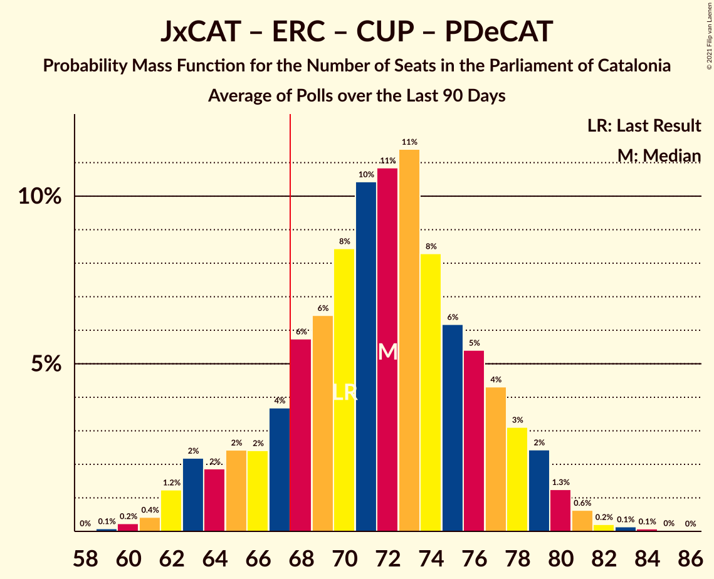

# Poll Average

<a href="#voting-intentions">Voting Intentions</a> | <a href="#seats">Seats</a> | <a href="#coalitions">Coalitions</a> | <a href="#technical-information">Technical Information</a>

## Summary

The table below lists the polls on which the average is based. They are the most recent polls (less than 90 days old) registered and analyzed so far.

| Period     | Polling firm/Commissioner(s) | Cs | JxCAT | ERC | PSC | CatComú | CUP | PP | Vox | PDeCAT |
|:----------:|:----------------------------:|:--:|:--:|:--:|:--:|:--:|:--:|:--:|:--:|:--:|
| 21 December 2017 | General Election | 25.4%   36 | 21.7%   34 | 21.4%   32 | 13.9%   17 | 7.5%   8 | 4.5%   4 | 4.2%   4 | 0.0%   0 | 0.0%   0 |
| N/A | Poll Average | 8–13%   9–18 | 12–23%   19–37 | 18–26%   28–41 | 18–25%   24–36 | 5–10%   5–13 | 4–8%   3–10 | 5–9%   5–12 | 3–7%   3–9 | 1–4%   0–5 |
| [18–31 January 2021](2021-01-31-SocioMétrica.html) | SocioMétrica   El Español | 10–12%   13–17 | 19–22%   31–36 | 18–21%   28–32 | 19–22%   26–31 | 6–8%   7–10 | 5–7%   7–8 | 5–6%   5–9 | 5–7%   6–9 | N/A   N/A |
| [25–30 January 2021](2021-01-30-NCReport.html) | NC Report   La Razón | 9–13%   12–18 | 17–23%   26–37 | 18–24%   28–37 | 17–23%   23–31 | 5–9%   5–11 | 4–8%   4–10 | 5–9%   6–12 | 4–8%   3–9 | N/A   N/A |
| [29 January 2021](2021-01-29-electoPanel.html) | electoPanel   electomania.es | 8–14%   9–19 | 16–24%   25–38 | 18–26%   26–39 | 18–26%   24–36 | 5–10%   4–12 | 3–7%   0–10 | 4–9%   3–12 | 3–8%   3–10 | 1–3%   0–1 |
| [25–28 January 2021](2021-01-28-GESOP.html) | GESOP   El Periódico | 8–11%   9–14 | 17–21%   27–34 | 18–22%   27–34 | 22–26%   31–37 | 5–8%   5–8 | 4–7%   4–8 | 5–8%   6–10 | 4–6%   4–9 | 1–2%   0 |
| [13–21 January 2021](2021-01-21-Opinòmetre.html) | Opinòmetre   CEO | 8–12%   9–16 | 18–24%   28–38 | 19–25%   28–38 | 17–23%   22–31 | 5–9%   4–10 | 5–8%   5–11 | 5–9%   6–12 | 3–7%   3–8 | 1–4%   0–4 |
| [2–15 January 2021](2021-01-15-CIS.html) | CIS | 9–11%   12–14 | 12–14%   18–23 | 19–22%   30–34 | 23–25%   31–36 | 9–11%   11–14 | 5–7%   7–9 | 5–7%   6–9 | 6–7%   7–10 | 0–1%   0 |
| [4–8 January 2021](2021-01-08-GAD3.html) | GAD3   La Vanguardia | 8–12%   9–18 | 16–22%   25–35 | 21–28%   33–43 | 17–24%   24–34 | 4–8%   4–10 | 3–6%   0–8 | 5–9%   5–12 | 3–6%   2–7 | 2–5%   0–6 |
| 21 December 2017 | General Election | 25.4%   36 | 21.7%   34 | 21.4%   32 | 13.9%   17 | 7.5%   8 | 4.5%   4 | 4.2%   4 | 0.0%   0 | 0.0%   0 |

Only polls for which at least the sample size has been published are included in the table above.

**Legend:**
+ **Top half of each row:** Voting intentions (95% confidence interval)
+ **Bottom half of each row:** Seat projections for the Parliament of Catalonia (95% confidence interval)
+ **Cs:** Ciutadans–Partido de la Ciudadanía
+ **JxCAT:** Junts per Catalunya
+ **ERC:** Esquerra Republicana–Catalunya Sí
+ **PSC:** Partit dels Socialistes de Catalunya (PSC-PSOE)
+ **CatComú:** Catalunya en Comú–Podem
+ **CUP:** Candidatura d’Unitat Popular
+ **PP:** Partit Popular
+ **Vox:** Vox
+ **PDeCAT:** Partit Demòcrata Europeu Català
+ **N/A (single party):** Party not included the published results
+ **N/A (entire row):** Calculation for this opinion poll not started yet

## Voting Intentions

### Confidence Intervals

| Party | Last Result | Median | 80% Confidence Interval | 90% Confidence Interval | 95% Confidence Interval | 99% Confidence Interval |
|:-----:|:-----------:|:------:|:-----------------------:|:-----------------------:|:-----------------------:|:-----------------------:|
| <a href="#ciutadans–partido-de-la-ciudadanía">Ciutadans–Partido de la Ciudadanía</a> | 25.4% | 10.0% | 8.6–11.7% |8.2–12.3% | 7.9–12.8% | 7.2–13.9% |
| <a href="#junts-per-catalunya">Junts per Catalunya</a> | 21.7% | 19.4% | 12.8–21.6% |12.3–22.2% | 12.0–22.9% | 11.6–24.2% |
| <a href="#esquerra-republicana–catalunya-sí">Esquerra Republicana–Catalunya Sí</a> | 21.4% | 20.9% | 19.0–24.3% |18.6–25.3% | 18.2–26.1% | 17.4–27.6% |
| <a href="#partit-dels-socialistes-de-catalunya-(psc-psoe)">Partit dels Socialistes de Catalunya (PSC-PSOE)</a> | 13.9% | 21.1% | 18.7–24.4% |18.0–24.9% | 17.5–25.4% | 16.5–26.4% |
| <a href="#catalunya-en-comú–podem">Catalunya en Comú–Podem</a> | 7.5% | 6.9% | 5.6–9.5% |5.2–9.9% | 4.9–10.2% | 4.3–10.6% |
| <a href="#candidatura-d’unitat-popular">Candidatura d’Unitat Popular</a> | 4.5% | 5.6% | 4.2–6.7% |3.8–7.1% | 3.5–7.5% | 2.9–8.3% |
| <a href="#partit-popular">Partit Popular</a> | 4.2% | 6.2% | 5.2–7.7% |5.0–8.2% | 4.7–8.6% | 4.1–9.4% |
| <a href="#vox">Vox</a> | 0.0% | 5.5% | 4.1–6.7% |3.7–7.0% | 3.4–7.3% | 2.9–7.9% |
| <a href="#partit-demòcrata-europeu-català">Partit Demòcrata Europeu Català</a> | 0.0% | 1.6% | 0.7–3.3% |0.6–3.7% | 0.6–4.0% | 0.5–4.7% |

### Ciutadans–Partido de la Ciudadanía

*For a full overview of the results for this party, see the [Ciutadans–Partido de la Ciudadanía](party-ciutadans–partidodelaciudadanía.html) page.*

| Voting Intentions | Probability | Accumulated | Special Marks |
|:-----------------:|:-----------:|:-----------:|:-------------:|
| 5.5–6.5% | 0.1% | 100% |  |
| 6.5–7.5% | 1.1% | 99.9% |  |
| 7.5–8.5% | 8% | 98.8% |  |
| 8.5–9.5% | 26% | 90% |  |
| 9.5–10.5% | 30% | 65% | Median |
| 10.5–11.5% | 22% | 35% |  |
| 11.5–12.5% | 9% | 13% |  |
| 12.5–13.5% | 3% | 3% |  |
| 13.5–14.5% | 0.7% | 0.8% |  |
| 14.5–15.5% | 0.1% | 0.2% |  |
| 15.5–16.5% | 0% | 0% |  |
| 16.5–17.5% | 0% | 0% |  |
| 17.5–18.5% | 0% | 0% |  |
| 18.5–19.5% | 0% | 0% |  |
| 19.5–20.5% | 0% | 0% |  |
| 20.5–21.5% | 0% | 0% |  |
| 21.5–22.5% | 0% | 0% |  |
| 22.5–23.5% | 0% | 0% |  |
| 23.5–24.5% | 0% | 0% |  |
| 24.5–25.5% | 0% | 0% | Last Result |

### Junts per Catalunya

*For a full overview of the results for this party, see the [Junts per Catalunya](party-juntspercatalunya.html) page.*

| Voting Intentions | Probability | Accumulated | Special Marks |
|:-----------------:|:-----------:|:-----------:|:-------------:|
| 9.5–10.5% | 0% | 100% |  |
| 10.5–11.5% | 0.4% | 100% |  |
| 11.5–12.5% | 7% | 99.6% |  |
| 12.5–13.5% | 6% | 92% |  |
| 13.5–14.5% | 0.4% | 86% |  |
| 14.5–15.5% | 0.5% | 86% |  |
| 15.5–16.5% | 2% | 85% |  |
| 16.5–17.5% | 5% | 83% |  |
| 17.5–18.5% | 12% | 78% |  |
| 18.5–19.5% | 19% | 66% | Median |
| 19.5–20.5% | 22% | 48% |  |
| 20.5–21.5% | 16% | 26% |  |
| 21.5–22.5% | 7% | 10% | Last Result |
| 22.5–23.5% | 2% | 4% |  |
| 23.5–24.5% | 0.8% | 1.1% |  |
| 24.5–25.5% | 0.2% | 0.3% |  |
| 25.5–26.5% | 0% | 0.1% |  |
| 26.5–27.5% | 0% | 0% |  |

### Esquerra Republicana–Catalunya Sí

*For a full overview of the results for this party, see the [Esquerra Republicana–Catalunya Sí](party-esquerrarepublicana–catalunyasí.html) page.*

| Voting Intentions | Probability | Accumulated | Special Marks |
|:-----------------:|:-----------:|:-----------:|:-------------:|
| 14.5–15.5% | 0% | 100% |  |
| 15.5–16.5% | 0.1% | 100% |  |
| 16.5–17.5% | 0.5% | 99.9% |  |
| 17.5–18.5% | 4% | 99.4% |  |
| 18.5–19.5% | 15% | 95% |  |
| 19.5–20.5% | 23% | 81% |  |
| 20.5–21.5% | 20% | 58% | Last Result, Median |
| 21.5–22.5% | 13% | 38% |  |
| 22.5–23.5% | 10% | 25% |  |
| 23.5–24.5% | 7% | 15% |  |
| 24.5–25.5% | 4% | 8% |  |
| 25.5–26.5% | 2% | 4% |  |
| 26.5–27.5% | 1.1% | 2% |  |
| 27.5–28.5% | 0.4% | 0.5% |  |
| 28.5–29.5% | 0.1% | 0.1% |  |
| 29.5–30.5% | 0% | 0% |  |

### Partit dels Socialistes de Catalunya (PSC-PSOE)

*For a full overview of the results for this party, see the [Partit dels Socialistes de Catalunya (PSC-PSOE)](party-partitdelssocialistesdecatalunyapsc-psoe.html) page.*

| Voting Intentions | Probability | Accumulated | Special Marks |
|:-----------------:|:-----------:|:-----------:|:-------------:|
| 13.5–14.5% | 0% | 100% | Last Result |
| 14.5–15.5% | 0.1% | 100% |  |
| 15.5–16.5% | 0.5% | 99.9% |  |
| 16.5–17.5% | 2% | 99.4% |  |
| 17.5–18.5% | 6% | 97% |  |
| 18.5–19.5% | 13% | 91% |  |
| 19.5–20.5% | 19% | 78% |  |
| 20.5–21.5% | 16% | 59% | Median |
| 21.5–22.5% | 9% | 44% |  |
| 22.5–23.5% | 11% | 34% |  |
| 23.5–24.5% | 15% | 23% |  |
| 24.5–25.5% | 6% | 8% |  |
| 25.5–26.5% | 2% | 2% |  |
| 26.5–27.5% | 0.3% | 0.4% |  |
| 27.5–28.5% | 0% | 0.1% |  |
| 28.5–29.5% | 0% | 0% |  |

### Catalunya en Comú–Podem

*For a full overview of the results for this party, see the [Catalunya en Comú–Podem](party-catalunyaencomú–podem.html) page.*

| Voting Intentions | Probability | Accumulated | Special Marks |
|:-----------------:|:-----------:|:-----------:|:-------------:|
| 2.5–3.5% | 0% | 100% |  |
| 3.5–4.5% | 1.0% | 100% |  |
| 4.5–5.5% | 9% | 99.0% |  |
| 5.5–6.5% | 27% | 90% |  |
| 6.5–7.5% | 32% | 63% | Last Result, Median |
| 7.5–8.5% | 14% | 31% |  |
| 8.5–9.5% | 8% | 17% |  |
| 9.5–10.5% | 9% | 10% |  |
| 10.5–11.5% | 0.6% | 0.6% |  |
| 11.5–12.5% | 0% | 0% |  |

### Candidatura d’Unitat Popular

*For a full overview of the results for this party, see the [Candidatura d’Unitat Popular](party-candidaturad’unitatpopular.html) page.*

| Voting Intentions | Probability | Accumulated | Special Marks |
|:-----------------:|:-----------:|:-----------:|:-------------:|
| 0.5–1.5% | 0% | 100% |  |
| 1.5–2.5% | 0.1% | 100% |  |
| 2.5–3.5% | 3% | 99.9% |  |
| 3.5–4.5% | 12% | 97% | Last Result |
| 4.5–5.5% | 32% | 85% |  |
| 5.5–6.5% | 41% | 53% | Median |
| 6.5–7.5% | 10% | 12% |  |
| 7.5–8.5% | 2% | 2% |  |
| 8.5–9.5% | 0.2% | 0.3% |  |
| 9.5–10.5% | 0% | 0% |  |

### Partit Popular

*For a full overview of the results for this party, see the [Partit Popular](party-partitpopular.html) page.*

| Voting Intentions | Probability | Accumulated | Special Marks |
|:-----------------:|:-----------:|:-----------:|:-------------:|
| 1.5–2.5% | 0% | 100% |  |
| 2.5–3.5% | 0.1% | 100% |  |
| 3.5–4.5% | 2% | 99.9% | Last Result |
| 4.5–5.5% | 20% | 98% |  |
| 5.5–6.5% | 43% | 79% | Median |
| 6.5–7.5% | 24% | 36% |  |
| 7.5–8.5% | 10% | 12% |  |
| 8.5–9.5% | 2% | 3% |  |
| 9.5–10.5% | 0.3% | 0.4% |  |
| 10.5–11.5% | 0% | 0% |  |

### Vox

*For a full overview of the results for this party, see the [Vox](party-vox.html) page.*

| Voting Intentions | Probability | Accumulated | Special Marks |
|:-----------------:|:-----------:|:-----------:|:-------------:|
| 0.0–0.5% | 0% | 100% | Last Result |
| 0.5–1.5% | 0% | 100% |  |
| 1.5–2.5% | 0.1% | 100% |  |
| 2.5–3.5% | 3% | 99.9% |  |
| 3.5–4.5% | 16% | 96% |  |
| 4.5–5.5% | 31% | 80% |  |
| 5.5–6.5% | 34% | 49% | Median |
| 6.5–7.5% | 14% | 15% |  |
| 7.5–8.5% | 1.0% | 1.2% |  |
| 8.5–9.5% | 0.1% | 0.1% |  |
| 9.5–10.5% | 0% | 0% |  |

### Partit Demòcrata Europeu Català

*For a full overview of the results for this party, see the [Partit Demòcrata Europeu Català](party-partitdemòcrataeuropeucatalà.html) page.*

| Voting Intentions | Probability | Accumulated | Special Marks |
|:-----------------:|:-----------:|:-----------:|:-------------:|
| 0.0–0.5% | 2% | 100% | Last Result |
| 0.5–1.5% | 48% | 98% |  |
| 1.5–2.5% | 25% | 50% | Median |
| 2.5–3.5% | 19% | 25% |  |
| 3.5–4.5% | 5% | 6% |  |
| 4.5–5.5% | 0.7% | 0.7% |  |
| 5.5–6.5% | 0% | 0% |  |
| 6.5–7.5% | 0% | 0% |  |

## Seats

### Confidence Intervals

| Party | Last Result | Median | 80% Confidence Interval | 90% Confidence Interval | 95% Confidence Interval | 99% Confidence Interval |
|:-----:|:-----------:|:------:|:-----------------------:|:-----------------------:|:-----------------------:|:-----------------------:|
| <a href="#ciutadans–partido-de-la-ciudadanía">Ciutadans–Partido de la Ciudadanía</a> | 36 | 13 | 12–16 |11–17 | 9–18 | 8–19 |
| <a href="#junts-per-catalunya">Junts per Catalunya</a> | 34 | 31 | 21–34 |19–36 | 19–37 | 18–39 |
| <a href="#esquerra-republicana–catalunya-sí">Esquerra Republicana–Catalunya Sí</a> | 32 | 32 | 29–37 |28–38 | 28–41 | 26–43 |
| <a href="#partit-dels-socialistes-de-catalunya-(psc-psoe)">Partit dels Socialistes de Catalunya (PSC-PSOE)</a> | 17 | 29 | 25–34 |25–35 | 24–36 | 22–37 |
| <a href="#catalunya-en-comú–podem">Catalunya en Comú–Podem</a> | 8 | 8 | 5–11 |5–13 | 5–13 | 4–14 |
| <a href="#candidatura-d’unitat-popular">Candidatura d’Unitat Popular</a> | 4 | 8 | 4–8 |4–9 | 3–10 | 0–11 |
| <a href="#partit-popular">Partit Popular</a> | 4 | 7 | 6–10 |6–11 | 5–12 | 3–12 |
| <a href="#vox">Vox</a> | 0 | 7 | 3–9 |3–9 | 3–9 | 2–10 |
| <a href="#partit-demòcrata-europeu-català">Partit Demòcrata Europeu Català</a> | 0 | 0 | 0–1 |0–4 | 0–5 | 0–6 |

### Ciutadans–Partido de la Ciudadanía

*For a full overview of the results for this party, see the [Ciutadans–Partido de la Ciudadanía](party-ciutadans–partidodelaciudadanía.html) page.*

| Number of Seats | Probability | Accumulated | Special Marks |
|:---------------:|:-----------:|:-----------:|:-------------:|
| 8 | 0.6% | 100% |  |
| 9 | 2% | 99.4% |  |
| 10 | 2% | 97% |  |
| 11 | 3% | 96% |  |
| 12 | 22% | 93% |  |
| 13 | 33% | 71% | Median |
| 14 | 18% | 37% |  |
| 15 | 6% | 19% |  |
| 16 | 8% | 14% |  |
| 17 | 3% | 6% |  |
| 18 | 2% | 3% |  |
| 19 | 0.5% | 0.7% |  |
| 20 | 0.1% | 0.2% |  |
| 21 | 0.1% | 0.1% |  |
| 22 | 0% | 0% |  |
| 23 | 0% | 0% |  |
| 24 | 0% | 0% |  |
| 25 | 0% | 0% |  |
| 26 | 0% | 0% |  |
| 27 | 0% | 0% |  |
| 28 | 0% | 0% |  |
| 29 | 0% | 0% |  |
| 30 | 0% | 0% |  |
| 31 | 0% | 0% |  |
| 32 | 0% | 0% |  |
| 33 | 0% | 0% |  |
| 34 | 0% | 0% |  |
| 35 | 0% | 0% |  |
| 36 | 0% | 0% | Last Result |

### Junts per Catalunya

*For a full overview of the results for this party, see the [Junts per Catalunya](party-juntspercatalunya.html) page.*

| Number of Seats | Probability | Accumulated | Special Marks |
|:---------------:|:-----------:|:-----------:|:-------------:|
| 17 | 0.1% | 100% |  |
| 18 | 1.2% | 99.9% |  |
| 19 | 4% | 98.7% |  |
| 20 | 1.2% | 95% |  |
| 21 | 7% | 93% |  |
| 22 | 0.5% | 87% |  |
| 23 | 0.6% | 86% |  |
| 24 | 0.3% | 86% |  |
| 25 | 1.0% | 85% |  |
| 26 | 3% | 84% |  |
| 27 | 2% | 81% |  |
| 28 | 2% | 79% |  |
| 29 | 6% | 77% |  |
| 30 | 6% | 72% |  |
| 31 | 22% | 65% | Median |
| 32 | 15% | 43% |  |
| 33 | 12% | 29% |  |
| 34 | 7% | 17% | Last Result |
| 35 | 4% | 10% |  |
| 36 | 2% | 6% |  |
| 37 | 3% | 4% |  |
| 38 | 0.7% | 1.2% |  |
| 39 | 0.3% | 0.5% |  |
| 40 | 0.1% | 0.2% |  |
| 41 | 0% | 0.1% |  |
| 42 | 0% | 0% |  |

### Esquerra Republicana–Catalunya Sí

*For a full overview of the results for this party, see the [Esquerra Republicana–Catalunya Sí](party-esquerrarepublicana–catalunyasí.html) page.*

| Number of Seats | Probability | Accumulated | Special Marks |
|:---------------:|:-----------:|:-----------:|:-------------:|
| 24 | 0.1% | 100% |  |
| 25 | 0.1% | 99.9% |  |
| 26 | 0.4% | 99.8% |  |
| 27 | 1.1% | 99.4% |  |
| 28 | 8% | 98% |  |
| 29 | 12% | 90% |  |
| 30 | 12% | 79% |  |
| 31 | 13% | 67% |  |
| 32 | 10% | 54% | Last Result, Median |
| 33 | 13% | 44% |  |
| 34 | 8% | 31% |  |
| 35 | 7% | 23% |  |
| 36 | 5% | 16% |  |
| 37 | 4% | 11% |  |
| 38 | 2% | 6% |  |
| 39 | 0.7% | 5% |  |
| 40 | 2% | 4% |  |
| 41 | 0.8% | 3% |  |
| 42 | 0.6% | 2% |  |
| 43 | 0.8% | 1.2% |  |
| 44 | 0.3% | 0.3% |  |
| 45 | 0% | 0.1% |  |
| 46 | 0% | 0% |  |

### Partit dels Socialistes de Catalunya (PSC-PSOE)

*For a full overview of the results for this party, see the [Partit dels Socialistes de Catalunya (PSC-PSOE)](party-partitdelssocialistesdecatalunyapsc-psoe.html) page.*

| Number of Seats | Probability | Accumulated | Special Marks |
|:---------------:|:-----------:|:-----------:|:-------------:|
| 17 | 0% | 100% | Last Result |
| 18 | 0% | 100% |  |
| 19 | 0% | 100% |  |
| 20 | 0.1% | 100% |  |
| 21 | 0.1% | 99.9% |  |
| 22 | 0.6% | 99.8% |  |
| 23 | 0.6% | 99.2% |  |
| 24 | 3% | 98.5% |  |
| 25 | 9% | 96% |  |
| 26 | 13% | 87% |  |
| 27 | 11% | 74% |  |
| 28 | 9% | 63% |  |
| 29 | 7% | 54% | Median |
| 30 | 8% | 47% |  |
| 31 | 7% | 40% |  |
| 32 | 9% | 33% |  |
| 33 | 7% | 24% |  |
| 34 | 8% | 16% |  |
| 35 | 4% | 8% |  |
| 36 | 2% | 3% |  |
| 37 | 0.6% | 1.0% |  |
| 38 | 0.3% | 0.4% |  |
| 39 | 0.1% | 0.1% |  |
| 40 | 0% | 0% |  |

### Catalunya en Comú–Podem

*For a full overview of the results for this party, see the [Catalunya en Comú–Podem](party-catalunyaencomú–podem.html) page.*

| Number of Seats | Probability | Accumulated | Special Marks |
|:---------------:|:-----------:|:-----------:|:-------------:|
| 3 | 0.1% | 100% |  |
| 4 | 2% | 99.9% |  |
| 5 | 11% | 98% |  |
| 6 | 9% | 87% |  |
| 7 | 21% | 78% |  |
| 8 | 29% | 57% | Last Result, Median |
| 9 | 6% | 28% |  |
| 10 | 6% | 22% |  |
| 11 | 7% | 16% |  |
| 12 | 3% | 10% |  |
| 13 | 6% | 7% |  |
| 14 | 0.9% | 0.9% |  |
| 15 | 0% | 0% |  |

### Candidatura d’Unitat Popular

*For a full overview of the results for this party, see the [Candidatura d’Unitat Popular](party-candidaturad’unitatpopular.html) page.*

| Number of Seats | Probability | Accumulated | Special Marks |
|:---------------:|:-----------:|:-----------:|:-------------:|
| 0 | 0.7% | 100% |  |
| 1 | 0% | 99.3% |  |
| 2 | 1.0% | 99.3% |  |
| 3 | 2% | 98% |  |
| 4 | 9% | 96% | Last Result |
| 5 | 4% | 87% |  |
| 6 | 5% | 83% |  |
| 7 | 22% | 78% |  |
| 8 | 46% | 55% | Median |
| 9 | 7% | 10% |  |
| 10 | 2% | 3% |  |
| 11 | 1.1% | 1.2% |  |
| 12 | 0.1% | 0.1% |  |
| 13 | 0% | 0% |  |

### Partit Popular

*For a full overview of the results for this party, see the [Partit Popular](party-partitpopular.html) page.*

| Number of Seats | Probability | Accumulated | Special Marks |
|:---------------:|:-----------:|:-----------:|:-------------:|
| 3 | 0.5% | 100% |  |
| 4 | 0.3% | 99.5% | Last Result |
| 5 | 4% | 99.2% |  |
| 6 | 7% | 96% |  |
| 7 | 40% | 88% | Median |
| 8 | 10% | 48% |  |
| 9 | 23% | 38% |  |
| 10 | 9% | 15% |  |
| 11 | 3% | 6% |  |
| 12 | 3% | 3% |  |
| 13 | 0.2% | 0.3% |  |
| 14 | 0.1% | 0.2% |  |
| 15 | 0% | 0% |  |

### Vox

*For a full overview of the results for this party, see the [Vox](party-vox.html) page.*

| Number of Seats | Probability | Accumulated | Special Marks |
|:---------------:|:-----------:|:-----------:|:-------------:|
| 0 | 0.4% | 100% | Last Result |
| 1 | 0% | 99.6% |  |
| 2 | 0.6% | 99.6% |  |
| 3 | 9% | 99.0% |  |
| 4 | 3% | 90% |  |
| 5 | 18% | 86% |  |
| 6 | 11% | 69% |  |
| 7 | 32% | 57% | Median |
| 8 | 7% | 25% |  |
| 9 | 16% | 18% |  |
| 10 | 1.1% | 2% |  |
| 11 | 0.3% | 0.5% |  |
| 12 | 0.1% | 0.2% |  |
| 13 | 0% | 0% |  |

### Partit Demòcrata Europeu Català

*For a full overview of the results for this party, see the [Partit Demòcrata Europeu Català](party-partitdemòcrataeuropeucatalà.html) page.*

| Number of Seats | Probability | Accumulated | Special Marks |
|:---------------:|:-----------:|:-----------:|:-------------:|
| 0 | 78% | 100% | Last Result, Median |
| 1 | 14% | 22% |  |
| 2 | 0% | 8% |  |
| 3 | 2% | 8% |  |
| 4 | 2% | 7% |  |
| 5 | 3% | 4% |  |
| 6 | 1.2% | 1.5% |  |
| 7 | 0.2% | 0.2% |  |
| 8 | 0.1% | 0.1% |  |
| 9 | 0% | 0% |  |

## Coalitions

### Confidence Intervals

| Coalition | Last Result | Median | Majority? | 80% Confidence Interval | 90% Confidence Interval | 95% Confidence Interval | 99% Confidence Interval |
|:---------:|:-----------:|:------:|:---------:|:-----------------------:|:-----------------------:|:-----------------------:|:-----------------------:|
| Esquerra Republicana–Catalunya Sí – Partit dels Socialistes de Catalunya (PSC-PSOE) – Catalunya en Comú–Podem | 57 | 69 | 62% | 64–78 | 63–79 | 62–80 | 60–80 |
| Junts per Catalunya – Esquerra Republicana–Catalunya Sí – Catalunya en Comú–Podem | 74 | 70 | 75% | 65–76 | 64–77 | 63–79 | 62–81 |
| Junts per Catalunya – Esquerra Republicana–Catalunya Sí – Candidatura d’Unitat Popular – Partit Demòcrata Europeu Català | 70 | 70 | 73% | 62–76 | 60–78 | 59–79 | 57–81 |
| Junts per Catalunya – Esquerra Republicana–Catalunya Sí – Candidatura d’Unitat Popular | 70 | 70 | 72% | 62–75 | 60–76 | 59–78 | 57–80 |
| Junts per Catalunya – Esquerra Republicana–Catalunya Sí – Partit Demòcrata Europeu Català | 66 | 63 | 19% | 54–70 | 52–71 | 51–73 | 50–76 |
| Junts per Catalunya – Esquerra Republicana–Catalunya Sí | 66 | 63 | 15% | 54–68 | 52–70 | 51–72 | 50–74 |
| Ciutadans–Partido de la Ciudadanía – Partit dels Socialistes de Catalunya (PSC-PSOE) – Catalunya en Comú–Podem – Partit Popular | 65 | 58 | 2% | 54–65 | 52–67 | 51–67 | 49–69 |
| Ciutadans–Partido de la Ciudadanía – Partit dels Socialistes de Catalunya (PSC-PSOE) – Partit Popular – Vox | 57 | 57 | 0.1% | 52–62 | 50–63 | 49–64 | 47–66 |
| Ciutadans–Partido de la Ciudadanía – Partit dels Socialistes de Catalunya (PSC-PSOE) – Partit Popular | 57 | 51 | 0% | 46–55 | 45–56 | 44–57 | 42–59 |
| Esquerra Republicana–Catalunya Sí – Catalunya en Comú–Podem | 40 | 40 | 0% | 36–45 | 35–47 | 35–48 | 33–51 |

### Esquerra Republicana–Catalunya Sí – Partit dels Socialistes de Catalunya (PSC-PSOE) – Catalunya en Comú–Podem

| Number of Seats | Probability | Accumulated | Special Marks |
|:---------------:|:-----------:|:-----------:|:-------------:|
| 57 | 0% | 100% | Last Result |
| 58 | 0.1% | 100% |  |
| 59 | 0.1% | 99.9% |  |
| 60 | 0.4% | 99.8% |  |
| 61 | 0.9% | 99.4% |  |
| 62 | 2% | 98% |  |
| 63 | 4% | 96% |  |
| 64 | 7% | 93% |  |
| 65 | 7% | 86% |  |
| 66 | 8% | 79% |  |
| 67 | 9% | 71% |  |
| 68 | 8% | 62% | Majority |
| 69 | 7% | 54% | Median |
| 70 | 7% | 47% |  |
| 71 | 7% | 39% |  |
| 72 | 5% | 32% |  |
| 73 | 4% | 27% |  |
| 74 | 4% | 23% |  |
| 75 | 2% | 20% |  |
| 76 | 3% | 18% |  |
| 77 | 4% | 15% |  |
| 78 | 5% | 11% |  |
| 79 | 4% | 7% |  |
| 80 | 2% | 3% |  |
| 81 | 0.4% | 0.5% |  |
| 82 | 0.1% | 0.1% |  |
| 83 | 0% | 0.1% |  |
| 84 | 0% | 0% |  |

### Junts per Catalunya – Esquerra Republicana–Catalunya Sí – Catalunya en Comú–Podem

| Number of Seats | Probability | Accumulated | Special Marks |
|:---------------:|:-----------:|:-----------:|:-------------:|
| 60 | 0.1% | 100% |  |
| 61 | 0.3% | 99.9% |  |
| 62 | 0.8% | 99.6% |  |
| 63 | 2% | 98.8% |  |
| 64 | 4% | 97% |  |
| 65 | 6% | 92% |  |
| 66 | 6% | 87% |  |
| 67 | 6% | 81% |  |
| 68 | 10% | 75% | Majority |
| 69 | 8% | 65% |  |
| 70 | 9% | 57% |  |
| 71 | 9% | 47% | Median |
| 72 | 8% | 39% |  |
| 73 | 8% | 30% |  |
| 74 | 7% | 23% | Last Result |
| 75 | 6% | 16% |  |
| 76 | 4% | 10% |  |
| 77 | 2% | 7% |  |
| 78 | 2% | 4% |  |
| 79 | 0.8% | 3% |  |
| 80 | 0.9% | 2% |  |
| 81 | 0.5% | 0.9% |  |
| 82 | 0.2% | 0.4% |  |
| 83 | 0.1% | 0.2% |  |
| 84 | 0.1% | 0.1% |  |
| 85 | 0% | 0% |  |

### Junts per Catalunya – Esquerra Republicana–Catalunya Sí – Candidatura d’Unitat Popular – Partit Demòcrata Europeu Català

| Number of Seats | Probability | Accumulated | Special Marks |
|:---------------:|:-----------:|:-----------:|:-------------:|
| 56 | 0.1% | 100% |  |
| 57 | 0.5% | 99.9% |  |
| 58 | 1.1% | 99.5% |  |
| 59 | 3% | 98% |  |
| 60 | 3% | 96% |  |
| 61 | 2% | 93% |  |
| 62 | 4% | 90% |  |
| 63 | 2% | 86% |  |
| 64 | 0.9% | 85% |  |
| 65 | 2% | 84% |  |
| 66 | 2% | 82% |  |
| 67 | 7% | 80% |  |
| 68 | 7% | 73% | Majority |
| 69 | 9% | 66% |  |
| 70 | 9% | 56% | Last Result |
| 71 | 10% | 48% | Median |
| 72 | 7% | 38% |  |
| 73 | 6% | 31% |  |
| 74 | 8% | 25% |  |
| 75 | 4% | 17% |  |
| 76 | 5% | 13% |  |
| 77 | 2% | 8% |  |
| 78 | 2% | 5% |  |
| 79 | 2% | 3% |  |
| 80 | 0.9% | 2% |  |
| 81 | 0.3% | 0.7% |  |
| 82 | 0.1% | 0.3% |  |
| 83 | 0.2% | 0.2% |  |
| 84 | 0% | 0.1% |  |
| 85 | 0% | 0% |  |

### Junts per Catalunya – Esquerra Republicana–Catalunya Sí – Candidatura d’Unitat Popular

| Number of Seats | Probability | Accumulated | Special Marks |
|:---------------:|:-----------:|:-----------:|:-------------:|
| 56 | 0.1% | 100% |  |
| 57 | 0.5% | 99.9% |  |
| 58 | 1.1% | 99.5% |  |
| 59 | 3% | 98% |  |
| 60 | 3% | 96% |  |
| 61 | 2% | 93% |  |
| 62 | 4% | 90% |  |
| 63 | 2% | 86% |  |
| 64 | 1.1% | 85% |  |
| 65 | 2% | 84% |  |
| 66 | 3% | 82% |  |
| 67 | 7% | 79% |  |
| 68 | 8% | 72% | Majority |
| 69 | 10% | 64% |  |
| 70 | 9% | 54% | Last Result |
| 71 | 11% | 45% | Median |
| 72 | 7% | 34% |  |
| 73 | 8% | 27% |  |
| 74 | 6% | 19% |  |
| 75 | 4% | 13% |  |
| 76 | 5% | 10% |  |
| 77 | 2% | 5% |  |
| 78 | 2% | 3% |  |
| 79 | 0.9% | 2% |  |
| 80 | 0.4% | 0.7% |  |
| 81 | 0.2% | 0.4% |  |
| 82 | 0.1% | 0.2% |  |
| 83 | 0.1% | 0.1% |  |
| 84 | 0% | 0% |  |

### Junts per Catalunya – Esquerra Republicana–Catalunya Sí – Partit Demòcrata Europeu Català

| Number of Seats | Probability | Accumulated | Special Marks |
|:---------------:|:-----------:|:-----------:|:-------------:|
| 49 | 0.5% | 100% |  |
| 50 | 1.2% | 99.5% |  |
| 51 | 2% | 98% |  |
| 52 | 3% | 96% |  |
| 53 | 2% | 93% |  |
| 54 | 4% | 91% |  |
| 55 | 1.2% | 87% |  |
| 56 | 0.5% | 86% |  |
| 57 | 0.8% | 85% |  |
| 58 | 2% | 84% |  |
| 59 | 3% | 83% |  |
| 60 | 7% | 79% |  |
| 61 | 8% | 72% |  |
| 62 | 9% | 64% |  |
| 63 | 10% | 55% | Median |
| 64 | 8% | 45% |  |
| 65 | 7% | 37% |  |
| 66 | 6% | 30% | Last Result |
| 67 | 5% | 24% |  |
| 68 | 5% | 19% | Majority |
| 69 | 4% | 14% |  |
| 70 | 3% | 10% |  |
| 71 | 2% | 7% |  |
| 72 | 2% | 5% |  |
| 73 | 1.3% | 3% |  |
| 74 | 1.0% | 2% |  |
| 75 | 0.3% | 0.9% |  |
| 76 | 0.3% | 0.6% |  |
| 77 | 0.1% | 0.3% |  |
| 78 | 0.1% | 0.1% |  |
| 79 | 0% | 0.1% |  |
| 80 | 0% | 0% |  |

### Junts per Catalunya – Esquerra Republicana–Catalunya Sí

| Number of Seats | Probability | Accumulated | Special Marks |
|:---------------:|:-----------:|:-----------:|:-------------:|
| 49 | 0.5% | 100% |  |
| 50 | 1.2% | 99.5% |  |
| 51 | 2% | 98% |  |
| 52 | 3% | 96% |  |
| 53 | 2% | 93% |  |
| 54 | 4% | 91% |  |
| 55 | 1.2% | 87% |  |
| 56 | 0.5% | 86% |  |
| 57 | 0.9% | 85% |  |
| 58 | 2% | 84% |  |
| 59 | 3% | 82% |  |
| 60 | 7% | 79% |  |
| 61 | 9% | 72% |  |
| 62 | 10% | 63% |  |
| 63 | 11% | 53% | Median |
| 64 | 9% | 42% |  |
| 65 | 7% | 33% |  |
| 66 | 7% | 26% | Last Result |
| 67 | 4% | 20% |  |
| 68 | 6% | 15% | Majority |
| 69 | 3% | 10% |  |
| 70 | 3% | 7% |  |
| 71 | 1.4% | 4% |  |
| 72 | 1.0% | 3% |  |
| 73 | 0.9% | 2% |  |
| 74 | 0.3% | 0.8% |  |
| 75 | 0.2% | 0.4% |  |
| 76 | 0.2% | 0.2% |  |
| 77 | 0% | 0.1% |  |
| 78 | 0% | 0% |  |

### Ciutadans–Partido de la Ciudadanía – Partit dels Socialistes de Catalunya (PSC-PSOE) – Catalunya en Comú–Podem – Partit Popular

| Number of Seats | Probability | Accumulated | Special Marks |
|:---------------:|:-----------:|:-----------:|:-------------:|
| 47 | 0.1% | 100% |  |
| 48 | 0.2% | 99.9% |  |
| 49 | 0.5% | 99.7% |  |
| 50 | 0.9% | 99.2% |  |
| 51 | 1.5% | 98% |  |
| 52 | 3% | 97% |  |
| 53 | 3% | 94% |  |
| 54 | 6% | 91% |  |
| 55 | 7% | 85% |  |
| 56 | 10% | 79% |  |
| 57 | 11% | 69% | Median |
| 58 | 12% | 58% |  |
| 59 | 9% | 46% |  |
| 60 | 6% | 37% |  |
| 61 | 6% | 31% |  |
| 62 | 4% | 25% |  |
| 63 | 4% | 20% |  |
| 64 | 4% | 17% |  |
| 65 | 4% | 13% | Last Result |
| 66 | 3% | 8% |  |
| 67 | 3% | 5% |  |
| 68 | 1.2% | 2% | Majority |
| 69 | 1.1% | 1.3% |  |
| 70 | 0.2% | 0.2% |  |
| 71 | 0% | 0% |  |

### Ciutadans–Partido de la Ciudadanía – Partit dels Socialistes de Catalunya (PSC-PSOE) – Partit Popular – Vox

| Number of Seats | Probability | Accumulated | Special Marks |
|:---------------:|:-----------:|:-----------:|:-------------:|
| 44 | 0.1% | 100% |  |
| 45 | 0.1% | 99.9% |  |
| 46 | 0.2% | 99.8% |  |
| 47 | 0.4% | 99.7% |  |
| 48 | 0.8% | 99.3% |  |
| 49 | 1.4% | 98% |  |
| 50 | 2% | 97% |  |
| 51 | 3% | 95% |  |
| 52 | 4% | 92% |  |
| 53 | 7% | 88% |  |
| 54 | 8% | 81% |  |
| 55 | 8% | 73% |  |
| 56 | 8% | 65% | Median |
| 57 | 8% | 57% | Last Result |
| 58 | 9% | 48% |  |
| 59 | 10% | 39% |  |
| 60 | 6% | 30% |  |
| 61 | 8% | 23% |  |
| 62 | 6% | 16% |  |
| 63 | 5% | 10% |  |
| 64 | 3% | 4% |  |
| 65 | 1.2% | 2% |  |
| 66 | 0.5% | 0.7% |  |
| 67 | 0.1% | 0.2% |  |
| 68 | 0.1% | 0.1% | Majority |
| 69 | 0% | 0% |  |

### Ciutadans–Partido de la Ciudadanía – Partit dels Socialistes de Catalunya (PSC-PSOE) – Partit Popular

| Number of Seats | Probability | Accumulated | Special Marks |
|:---------------:|:-----------:|:-----------:|:-------------:|
| 40 | 0% | 100% |  |
| 41 | 0.3% | 99.9% |  |
| 42 | 0.4% | 99.7% |  |
| 43 | 0.7% | 99.3% |  |
| 44 | 1.4% | 98.6% |  |
| 45 | 3% | 97% |  |
| 46 | 5% | 94% |  |
| 47 | 6% | 89% |  |
| 48 | 10% | 83% |  |
| 49 | 10% | 73% | Median |
| 50 | 9% | 62% |  |
| 51 | 11% | 54% |  |
| 52 | 10% | 43% |  |
| 53 | 10% | 33% |  |
| 54 | 10% | 22% |  |
| 55 | 6% | 12% |  |
| 56 | 3% | 6% |  |
| 57 | 2% | 3% | Last Result |
| 58 | 0.9% | 2% |  |
| 59 | 0.4% | 0.7% |  |
| 60 | 0.2% | 0.3% |  |
| 61 | 0.1% | 0.1% |  |
| 62 | 0.1% | 0.1% |  |
| 63 | 0% | 0% |  |

### Esquerra Republicana–Catalunya Sí – Catalunya en Comú–Podem

| Number of Seats | Probability | Accumulated | Special Marks |
|:---------------:|:-----------:|:-----------:|:-------------:|
| 31 | 0.2% | 100% |  |
| 32 | 0.1% | 99.8% |  |
| 33 | 0.5% | 99.7% |  |
| 34 | 2% | 99.2% |  |
| 35 | 4% | 98% |  |
| 36 | 10% | 94% |  |
| 37 | 12% | 84% |  |
| 38 | 11% | 72% |  |
| 39 | 8% | 61% |  |
| 40 | 7% | 54% | Last Result, Median |
| 41 | 7% | 47% |  |
| 42 | 8% | 39% |  |
| 43 | 8% | 31% |  |
| 44 | 8% | 23% |  |
| 45 | 7% | 15% |  |
| 46 | 3% | 8% |  |
| 47 | 2% | 5% |  |
| 48 | 1.1% | 3% |  |
| 49 | 0.8% | 2% |  |
| 50 | 0.3% | 1.0% |  |
| 51 | 0.5% | 0.7% |  |
| 52 | 0.2% | 0.2% |  |
| 53 | 0% | 0% |  |

## Technical Information

+ **Number of polls included in this average:** 7
+ **Lowest number of simulations done in a poll included in this average:** 1,048,576
+ **Total number of simulations done in the polls included in this average:** 7,340,032
+ **Error estimate:** 3.80%
