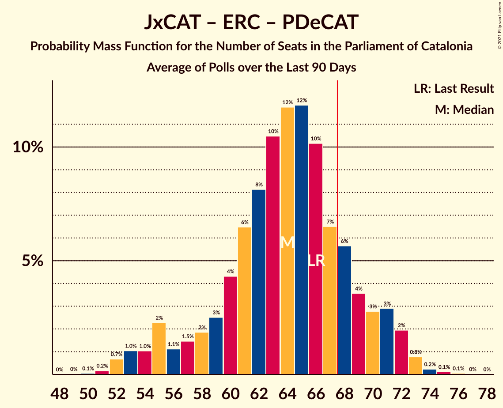

# Poll Average

<a href="#voting-intentions">Voting Intentions</a> | <a href="#seats">Seats</a> | <a href="#coalitions">Coalitions</a> | <a href="#technical-information">Technical Information</a>

## Summary

The table below lists the polls on which the average is based. They are the most recent polls (less than 90 days old) registered and analyzed so far.

| Period     | Polling firm/Commissioner(s) | Cs | JxCAT | ERC | PSC | CatComú | CUP | PP | Vox | PDeCAT |
|:----------:|:----------------------------:|:--:|:--:|:--:|:--:|:--:|:--:|:--:|:--:|:--:|
| 21 December 2017 | General Election | 25.4%   36 | 21.7%   34 | 21.4%   32 | 13.9%   17 | 7.5%   8 | 4.5%   4 | 4.2%   4 | 0.0%   0 | 0.0%   0 |
| N/A | Poll Average | 7–13%   8–18 | 14–24%   23–39 | 17–24%   25–36 | 18–25%   25–35 | 5–10%   5–12 | 4–8%   4–11 | 3–8%   2–10 | 4–8%   4–12 | 1–4%   0–5 |
| [12 February 2021](2021-02-12-electoPanel.html) | electoPanel   electomania.es | 6–12%   8–16 | 17–25%   28–41 | 16–24%   24–36 | 18–26%   24–37 | 5–10%   4–12 | 4–8%   4–11 | 3–7%   2–9 | 5–10%   5–13 | 1–3%   0–1 |
| [10–12 February 2021](2021-02-12-GESOP.html) | GESOP   El Periòdic | 5–10%   6–13 | 16–22%   25–35 | 17–24%   25–35 | 19–27%   27–36 | 5–9%   5–11 | 5–9%   7–13 | 4–8%   3–9 | 4–9%   5–11 | 2–5%   0–6 |
| [5–12 February 2021](2021-02-12-Feedback.html) | Feedback   The National | 7–12%   10–17 | 17–24%   29–39 | 16–22%   24–35 | 17–23%   24–33 | 6–10%   7–13 | 5–9%   6–11 | 3–7%   3–9 | 4–8%   3–11 | 2–4%   0–5 |
| [18 January–8 February 2021](2021-02-08-SocioMétrica.html) | SocioMétrica   El Español | 7–9%   8–12 | 19–22%   31–37 | 18–21%   27–32 | 19–23%   26–32 | 6–9%   7–10 | 6–8%   8–11 | 4–6%   5–7 | 7–9%   9–12 | N/A   N/A |
| [8 February 2021](2021-02-08-Celeste-Tel.html) | Celeste-Tel | 8–13%   10–17 | 17–23%   27–37 | 17–23%   26–35 | 19–25%   26–34 | 6–10%   5–11 | 4–7%   4–9 | 4–7%   4–9 | 5–8%   5–10 | 1–3%   0 |
| [7 February 2021](2021-02-07-KeyData.html) | Key Data   Público | 7–14%   8–18 | 16–24%   24–39 | 17–26%   24–39 | 17–26%   22–36 | 4–10%   4–12 | 4–9%   3–11 | 3–9%   3–12 | 3–9%   3–12 | 1–5%   0–6 |
| [5–7 February 2021](2021-02-07-DemoscopiayServicios.html) | Demoscopia y Servicios | 6–11%   7–14 | 18–25%   29–40 | 18–24%   26–37 | 19–26%   25–36 | 5–10%   5–11 | 4–8%   4–11 | 4–8%   3–10 | 4–8%   3–10 | N/A   N/A |
| [6 February 2021](2021-02-06-SigmaDos.html) | Sigma Dos   El Mundo | 8–11%   9–14 | 19–24%   30–38 | 18–23%   27–35 | 20–26%   27–35 | 6–9%   5–10 | 4–7%   4–9 | 4–7%   4–9 | 4–7%   3–9 | N/A   N/A |
| [3–6 February 2021](2021-02-06-NCReport.html) | NC Report   La Razón | 9–14%   11–18 | 17–23%   26–37 | 17–24%   25–35 | 18–25%   25–34 | 5–10%   5–11 | 4–8%   4–10 | 5–9%   5–11 | 4–8%   3–10 | 1–3%   0 |
| [1–4 February 2021](2021-02-04-Opinòmetre.html) | Opinòmetre   Ara | 7–10%   8–14 | 17–23%   27–37 | 19–25%   29–39 | 18–24%   25–33 | 5–9%   5–11 | 5–9%   7–11 | 4–7%   3–9 | 4–7%   3–9 | 2–4%   0–5 |
| [1–4 February 2021](2021-02-04-HamalgamaMétrica.html) | Hamalgama Métrica   OKDiario | 10–14%   13–19 | 18–23%   29–37 | 18–23%   27–35 | 18–23%   24–31 | 6–9%   6–11 | 4–7%   4–9 | 5–7%   5–9 | 4–7%   5–9 | N/A   N/A |
| [1–3 February 2021](2021-02-03-CIS.html) | CIS | 7–9%   8–12 | 13–16%   21–26 | 18–22%   28–34 | 22–26%   30–36 | 8–10%   9–13 | 6–8%   8–11 | 5–7%   6–9 | 6–8%   7–11 | 1–2%   0 |
| [29 January–2 February 2021](2021-02-02-DYM.html) | DYM   Henneo | 9–12%   12–17 | 20–24%   31–39 | 17–22%   25–33 | 20–25%   27–35 | 6–9%   6–10 | 5–7%   6–10 | 3–5%   0–5 | 5–7%   5–9 | N/A   N/A |
| 21 December 2017 | General Election | 25.4%   36 | 21.7%   34 | 21.4%   32 | 13.9%   17 | 7.5%   8 | 4.5%   4 | 4.2%   4 | 0.0%   0 | 0.0%   0 |

Only polls for which at least the sample size has been published are included in the table above.

**Legend:**
+ **Top half of each row:** Voting intentions (95% confidence interval)
+ **Bottom half of each row:** Seat projections for the Parliament of Catalonia (95% confidence interval)
+ **Cs:** Ciutadans–Partido de la Ciudadanía
+ **JxCAT:** Junts per Catalunya
+ **ERC:** Esquerra Republicana–Catalunya Sí
+ **PSC:** Partit dels Socialistes de Catalunya (PSC-PSOE)
+ **CatComú:** Catalunya en Comú–Podem
+ **CUP:** Candidatura d’Unitat Popular
+ **PP:** Partit Popular
+ **Vox:** Vox
+ **PDeCAT:** Partit Demòcrata Europeu Català
+ **N/A (single party):** Party not included the published results
+ **N/A (entire row):** Calculation for this opinion poll not started yet

## Voting Intentions

### Confidence Intervals

| Party | Last Result | Median | 80% Confidence Interval | 90% Confidence Interval | 95% Confidence Interval | 99% Confidence Interval |
|:-----:|:-----------:|:------:|:-----------------------:|:-----------------------:|:-----------------------:|:-----------------------:|
| <a href="#ciutadans–partido-de-la-ciudadanía">Ciutadans–Partido de la Ciudadanía</a> | 25.4% | 9.2% | 7.3–11.7% |6.9–12.4% | 6.6–12.9% | 5.8–13.9% |
| <a href="#junts-per-catalunya">Junts per Catalunya</a> | 21.7% | 20.4% | 16.9–22.7% |14.9–23.4% | 14.2–24.0% | 13.4–25.3% |
| <a href="#esquerra-republicana–catalunya-sí">Esquerra Republicana–Catalunya Sí</a> | 21.4% | 20.1% | 18.1–22.5% |17.5–23.2% | 17.0–23.9% | 15.9–25.4% |
| <a href="#partit-dels-socialistes-de-catalunya-(psc-psoe)">Partit dels Socialistes de Catalunya (PSC-PSOE)</a> | 13.9% | 21.7% | 19.3–24.2% |18.6–24.9% | 17.9–25.4% | 16.7–26.6% |
| <a href="#catalunya-en-comú–podem">Catalunya en Comú–Podem</a> | 7.5% | 7.4% | 6.1–8.9% |5.7–9.4% | 5.3–9.8% | 4.6–10.6% |
| <a href="#candidatura-d’unitat-popular">Candidatura d’Unitat Popular</a> | 4.5% | 6.1% | 4.8–7.5% |4.5–7.9% | 4.2–8.3% | 3.7–9.3% |
| <a href="#partit-popular">Partit Popular</a> | 4.2% | 5.4% | 3.9–6.8% |3.5–7.2% | 3.2–7.7% | 2.8–8.6% |
| <a href="#vox">Vox</a> | 0.0% | 6.0% | 4.8–7.7% |4.4–8.1% | 4.2–8.5% | 3.6–9.3% |
| <a href="#partit-demòcrata-europeu-català">Partit Demòcrata Europeu Català</a> | 0.0% | 2.1% | 1.2–3.5% |1.0–3.9% | 0.9–4.3% | 0.7–5.1% |

### Ciutadans–Partido de la Ciudadanía

*For a full overview of the results for this party, see the [Ciutadans–Partido de la Ciudadanía](party-ciutadans–partidodelaciudadanía.html) page.*

| Voting Intentions | Probability | Accumulated | Special Marks |
|:-----------------:|:-----------:|:-----------:|:-------------:|
| 3.5–4.5% | 0% | 100% |  |
| 4.5–5.5% | 0.3% | 100% |  |
| 5.5–6.5% | 2% | 99.7% |  |
| 6.5–7.5% | 12% | 98% |  |
| 7.5–8.5% | 22% | 86% |  |
| 8.5–9.5% | 20% | 64% | Median |
| 9.5–10.5% | 18% | 44% |  |
| 10.5–11.5% | 14% | 26% |  |
| 11.5–12.5% | 8% | 12% |  |
| 12.5–13.5% | 3% | 4% |  |
| 13.5–14.5% | 0.8% | 1.0% |  |
| 14.5–15.5% | 0.1% | 0.2% |  |
| 15.5–16.5% | 0% | 0% |  |
| 16.5–17.5% | 0% | 0% |  |
| 17.5–18.5% | 0% | 0% |  |
| 18.5–19.5% | 0% | 0% |  |
| 19.5–20.5% | 0% | 0% |  |
| 20.5–21.5% | 0% | 0% |  |
| 21.5–22.5% | 0% | 0% |  |
| 22.5–23.5% | 0% | 0% |  |
| 23.5–24.5% | 0% | 0% |  |
| 24.5–25.5% | 0% | 0% | Last Result |

### Junts per Catalunya

*For a full overview of the results for this party, see the [Junts per Catalunya](party-juntspercatalunya.html) page.*

| Voting Intentions | Probability | Accumulated | Special Marks |
|:-----------------:|:-----------:|:-----------:|:-------------:|
| 11.5–12.5% | 0% | 100% |  |
| 12.5–13.5% | 0.7% | 100% |  |
| 13.5–14.5% | 3% | 99.3% |  |
| 14.5–15.5% | 3% | 96% |  |
| 15.5–16.5% | 2% | 93% |  |
| 16.5–17.5% | 3% | 91% |  |
| 17.5–18.5% | 7% | 88% |  |
| 18.5–19.5% | 14% | 80% |  |
| 19.5–20.5% | 20% | 66% | Median |
| 20.5–21.5% | 20% | 46% |  |
| 21.5–22.5% | 14% | 26% | Last Result |
| 22.5–23.5% | 7% | 12% |  |
| 23.5–24.5% | 3% | 4% |  |
| 24.5–25.5% | 0.9% | 1.3% |  |
| 25.5–26.5% | 0.3% | 0.4% |  |
| 26.5–27.5% | 0.1% | 0.1% |  |
| 27.5–28.5% | 0% | 0% |  |

### Esquerra Republicana–Catalunya Sí

*For a full overview of the results for this party, see the [Esquerra Republicana–Catalunya Sí](party-esquerrarepublicana–catalunyasí.html) page.*

| Voting Intentions | Probability | Accumulated | Special Marks |
|:-----------------:|:-----------:|:-----------:|:-------------:|
| 13.5–14.5% | 0% | 100% |  |
| 14.5–15.5% | 0.2% | 100% |  |
| 15.5–16.5% | 1.0% | 99.7% |  |
| 16.5–17.5% | 4% | 98.7% |  |
| 17.5–18.5% | 11% | 95% |  |
| 18.5–19.5% | 21% | 84% |  |
| 19.5–20.5% | 24% | 62% | Median |
| 20.5–21.5% | 18% | 39% | Last Result |
| 21.5–22.5% | 11% | 21% |  |
| 22.5–23.5% | 6% | 9% |  |
| 23.5–24.5% | 2% | 4% |  |
| 24.5–25.5% | 0.8% | 1.2% |  |
| 25.5–26.5% | 0.3% | 0.4% |  |
| 26.5–27.5% | 0.1% | 0.1% |  |
| 27.5–28.5% | 0% | 0% |  |

### Partit dels Socialistes de Catalunya (PSC-PSOE)

*For a full overview of the results for this party, see the [Partit dels Socialistes de Catalunya (PSC-PSOE)](party-partitdelssocialistesdecatalunyapsc-psoe.html) page.*

| Voting Intentions | Probability | Accumulated | Special Marks |
|:-----------------:|:-----------:|:-----------:|:-------------:|
| 13.5–14.5% | 0% | 100% | Last Result |
| 14.5–15.5% | 0.1% | 100% |  |
| 15.5–16.5% | 0.3% | 99.9% |  |
| 16.5–17.5% | 1.1% | 99.6% |  |
| 17.5–18.5% | 3% | 98% |  |
| 18.5–19.5% | 8% | 95% |  |
| 19.5–20.5% | 14% | 87% |  |
| 20.5–21.5% | 20% | 73% |  |
| 21.5–22.5% | 19% | 53% | Median |
| 22.5–23.5% | 16% | 34% |  |
| 23.5–24.5% | 11% | 18% |  |
| 24.5–25.5% | 5% | 7% |  |
| 25.5–26.5% | 2% | 2% |  |
| 26.5–27.5% | 0.4% | 0.6% |  |
| 27.5–28.5% | 0.1% | 0.1% |  |
| 28.5–29.5% | 0% | 0% |  |

### Catalunya en Comú–Podem

*For a full overview of the results for this party, see the [Catalunya en Comú–Podem](party-catalunyaencomú–podem.html) page.*

| Voting Intentions | Probability | Accumulated | Special Marks |
|:-----------------:|:-----------:|:-----------:|:-------------:|
| 2.5–3.5% | 0% | 100% |  |
| 3.5–4.5% | 0.4% | 100% |  |
| 4.5–5.5% | 4% | 99.6% |  |
| 5.5–6.5% | 17% | 96% |  |
| 6.5–7.5% | 35% | 79% | Last Result, Median |
| 7.5–8.5% | 27% | 43% |  |
| 8.5–9.5% | 12% | 16% |  |
| 9.5–10.5% | 3% | 4% |  |
| 10.5–11.5% | 0.4% | 0.5% |  |
| 11.5–12.5% | 0.1% | 0.1% |  |
| 12.5–13.5% | 0% | 0% |  |

### Candidatura d’Unitat Popular

*For a full overview of the results for this party, see the [Candidatura d’Unitat Popular](party-candidaturad’unitatpopular.html) page.*

| Voting Intentions | Probability | Accumulated | Special Marks |
|:-----------------:|:-----------:|:-----------:|:-------------:|
| 1.5–2.5% | 0% | 100% |  |
| 2.5–3.5% | 0.3% | 100% |  |
| 3.5–4.5% | 5% | 99.7% | Last Result |
| 4.5–5.5% | 23% | 94% |  |
| 5.5–6.5% | 37% | 72% | Median |
| 6.5–7.5% | 26% | 35% |  |
| 7.5–8.5% | 7% | 9% |  |
| 8.5–9.5% | 1.5% | 2% |  |
| 9.5–10.5% | 0.3% | 0.3% |  |
| 10.5–11.5% | 0% | 0% |  |
| 11.5–12.5% | 0% | 0% |  |

### Partit Popular

*For a full overview of the results for this party, see the [Partit Popular](party-partitpopular.html) page.*

| Voting Intentions | Probability | Accumulated | Special Marks |
|:-----------------:|:-----------:|:-----------:|:-------------:|
| 0.5–1.5% | 0% | 100% |  |
| 1.5–2.5% | 0.2% | 100% |  |
| 2.5–3.5% | 5% | 99.8% |  |
| 3.5–4.5% | 16% | 94% | Last Result |
| 4.5–5.5% | 34% | 79% | Median |
| 5.5–6.5% | 31% | 44% |  |
| 6.5–7.5% | 11% | 14% |  |
| 7.5–8.5% | 2% | 3% |  |
| 8.5–9.5% | 0.5% | 0.5% |  |
| 9.5–10.5% | 0.1% | 0.1% |  |
| 10.5–11.5% | 0% | 0% |  |

### Vox

*For a full overview of the results for this party, see the [Vox](party-vox.html) page.*

| Voting Intentions | Probability | Accumulated | Special Marks |
|:-----------------:|:-----------:|:-----------:|:-------------:|
| 0.0–0.5% | 0% | 100% | Last Result |
| 0.5–1.5% | 0% | 100% |  |
| 1.5–2.5% | 0% | 100% |  |
| 2.5–3.5% | 0.4% | 100% |  |
| 3.5–4.5% | 6% | 99.6% |  |
| 4.5–5.5% | 26% | 93% |  |
| 5.5–6.5% | 33% | 67% | Median |
| 6.5–7.5% | 22% | 34% |  |
| 7.5–8.5% | 10% | 12% |  |
| 8.5–9.5% | 2% | 2% |  |
| 9.5–10.5% | 0.3% | 0.3% |  |
| 10.5–11.5% | 0% | 0.1% |  |
| 11.5–12.5% | 0% | 0% |  |

### Partit Demòcrata Europeu Català

*For a full overview of the results for this party, see the [Partit Demòcrata Europeu Català](party-partitdemòcrataeuropeucatalà.html) page.*

| Voting Intentions | Probability | Accumulated | Special Marks |
|:-----------------:|:-----------:|:-----------:|:-------------:|
| 0.0–0.5% | 0.2% | 100% | Last Result |
| 0.5–1.5% | 26% | 99.8% |  |
| 1.5–2.5% | 40% | 74% | Median |
| 2.5–3.5% | 25% | 34% |  |
| 3.5–4.5% | 8% | 9% |  |
| 4.5–5.5% | 1.3% | 2% |  |
| 5.5–6.5% | 0.2% | 0.2% |  |
| 6.5–7.5% | 0% | 0% |  |

## Seats

### Confidence Intervals

| Party | Last Result | Median | 80% Confidence Interval | 90% Confidence Interval | 95% Confidence Interval | 99% Confidence Interval |
|:-----:|:-----------:|:------:|:-----------------------:|:-----------------------:|:-----------------------:|:-----------------------:|
| <a href="#ciutadans–partido-de-la-ciudadanía">Ciutadans–Partido de la Ciudadanía</a> | 36 | 12 | 9–16 |8–16 | 8–18 | 6–19 |
| <a href="#junts-per-catalunya">Junts per Catalunya</a> | 34 | 32 | 26–37 |24–37 | 23–39 | 22–41 |
| <a href="#esquerra-republicana–catalunya-sí">Esquerra Republicana–Catalunya Sí</a> | 32 | 30 | 27–34 |26–35 | 25–36 | 24–39 |
| <a href="#partit-dels-socialistes-de-catalunya-(psc-psoe)">Partit dels Socialistes de Catalunya (PSC-PSOE)</a> | 17 | 30 | 26–34 |25–34 | 25–35 | 23–37 |
| <a href="#catalunya-en-comú–podem">Catalunya en Comú–Podem</a> | 8 | 8 | 6–11 |5–11 | 5–12 | 4–13 |
| <a href="#candidatura-d’unitat-popular">Candidatura d’Unitat Popular</a> | 4 | 8 | 6–10 |5–11 | 4–11 | 3–13 |
| <a href="#partit-popular">Partit Popular</a> | 4 | 7 | 3–9 |3–9 | 2–10 | 0–11 |
| <a href="#vox">Vox</a> | 0 | 7 | 5–10 |5–11 | 4–12 | 3–12 |
| <a href="#partit-demòcrata-europeu-català">Partit Demòcrata Europeu Català</a> | 0 | 0 | 0–1 |0–4 | 0–5 | 0–6 |

### Ciutadans–Partido de la Ciudadanía

*For a full overview of the results for this party, see the [Ciutadans–Partido de la Ciudadanía](party-ciutadans–partidodelaciudadanía.html) page.*

| Number of Seats | Probability | Accumulated | Special Marks |
|:---------------:|:-----------:|:-----------:|:-------------:|
| 5 | 0.1% | 100% |  |
| 6 | 1.1% | 99.9% |  |
| 7 | 0.5% | 98.8% |  |
| 8 | 8% | 98% |  |
| 9 | 9% | 91% |  |
| 10 | 7% | 81% |  |
| 11 | 7% | 74% |  |
| 12 | 21% | 67% | Median |
| 13 | 20% | 47% |  |
| 14 | 12% | 26% |  |
| 15 | 4% | 14% |  |
| 16 | 6% | 10% |  |
| 17 | 2% | 5% |  |
| 18 | 2% | 3% |  |
| 19 | 0.5% | 0.6% |  |
| 20 | 0.1% | 0.1% |  |
| 21 | 0% | 0% |  |
| 22 | 0% | 0% |  |
| 23 | 0% | 0% |  |
| 24 | 0% | 0% |  |
| 25 | 0% | 0% |  |
| 26 | 0% | 0% |  |
| 27 | 0% | 0% |  |
| 28 | 0% | 0% |  |
| 29 | 0% | 0% |  |
| 30 | 0% | 0% |  |
| 31 | 0% | 0% |  |
| 32 | 0% | 0% |  |
| 33 | 0% | 0% |  |
| 34 | 0% | 0% |  |
| 35 | 0% | 0% |  |
| 36 | 0% | 0% | Last Result |

### Junts per Catalunya

*For a full overview of the results for this party, see the [Junts per Catalunya](party-juntspercatalunya.html) page.*

| Number of Seats | Probability | Accumulated | Special Marks |
|:---------------:|:-----------:|:-----------:|:-------------:|
| 21 | 0.3% | 100% |  |
| 22 | 0.7% | 99.6% |  |
| 23 | 4% | 99.0% |  |
| 24 | 1.2% | 95% |  |
| 25 | 3% | 94% |  |
| 26 | 1.4% | 91% |  |
| 27 | 2% | 90% |  |
| 28 | 1.3% | 88% |  |
| 29 | 4% | 87% |  |
| 30 | 6% | 83% |  |
| 31 | 17% | 77% |  |
| 32 | 13% | 61% | Median |
| 33 | 13% | 48% |  |
| 34 | 9% | 36% | Last Result |
| 35 | 8% | 27% |  |
| 36 | 6% | 18% |  |
| 37 | 7% | 12% |  |
| 38 | 2% | 5% |  |
| 39 | 1.2% | 3% |  |
| 40 | 0.8% | 1.4% |  |
| 41 | 0.5% | 0.7% |  |
| 42 | 0.1% | 0.2% |  |
| 43 | 0.1% | 0.1% |  |
| 44 | 0% | 0.1% |  |
| 45 | 0% | 0% |  |

### Esquerra Republicana–Catalunya Sí

*For a full overview of the results for this party, see the [Esquerra Republicana–Catalunya Sí](party-esquerrarepublicana–catalunyasí.html) page.*

| Number of Seats | Probability | Accumulated | Special Marks |
|:---------------:|:-----------:|:-----------:|:-------------:|
| 21 | 0% | 100% |  |
| 22 | 0.2% | 99.9% |  |
| 23 | 0.3% | 99.8% |  |
| 24 | 1.0% | 99.5% |  |
| 25 | 1.3% | 98.6% |  |
| 26 | 3% | 97% |  |
| 27 | 5% | 94% |  |
| 28 | 15% | 89% |  |
| 29 | 16% | 74% |  |
| 30 | 14% | 58% | Median |
| 31 | 13% | 44% |  |
| 32 | 11% | 31% | Last Result |
| 33 | 7% | 20% |  |
| 34 | 6% | 13% |  |
| 35 | 4% | 8% |  |
| 36 | 2% | 4% |  |
| 37 | 0.9% | 2% |  |
| 38 | 0.4% | 1.0% |  |
| 39 | 0.3% | 0.6% |  |
| 40 | 0.2% | 0.3% |  |
| 41 | 0.1% | 0.2% |  |
| 42 | 0% | 0.1% |  |
| 43 | 0% | 0% |  |

### Partit dels Socialistes de Catalunya (PSC-PSOE)

*For a full overview of the results for this party, see the [Partit dels Socialistes de Catalunya (PSC-PSOE)](party-partitdelssocialistesdecatalunyapsc-psoe.html) page.*

| Number of Seats | Probability | Accumulated | Special Marks |
|:---------------:|:-----------:|:-----------:|:-------------:|
| 17 | 0% | 100% | Last Result |
| 18 | 0% | 100% |  |
| 19 | 0% | 100% |  |
| 20 | 0% | 100% |  |
| 21 | 0.1% | 99.9% |  |
| 22 | 0.3% | 99.9% |  |
| 23 | 0.3% | 99.6% |  |
| 24 | 2% | 99.3% |  |
| 25 | 5% | 98% |  |
| 26 | 9% | 93% |  |
| 27 | 9% | 84% |  |
| 28 | 7% | 75% |  |
| 29 | 11% | 67% |  |
| 30 | 12% | 57% | Median |
| 31 | 16% | 44% |  |
| 32 | 11% | 29% |  |
| 33 | 6% | 18% |  |
| 34 | 7% | 12% |  |
| 35 | 3% | 5% |  |
| 36 | 1.3% | 2% |  |
| 37 | 0.6% | 0.8% |  |
| 38 | 0.2% | 0.3% |  |
| 39 | 0% | 0.1% |  |
| 40 | 0% | 0% |  |

### Catalunya en Comú–Podem

*For a full overview of the results for this party, see the [Catalunya en Comú–Podem](party-catalunyaencomú–podem.html) page.*

| Number of Seats | Probability | Accumulated | Special Marks |
|:---------------:|:-----------:|:-----------:|:-------------:|
| 4 | 0.8% | 100% |  |
| 5 | 5% | 99.1% |  |
| 6 | 5% | 94% |  |
| 7 | 16% | 89% |  |
| 8 | 35% | 73% | Last Result, Median |
| 9 | 13% | 38% |  |
| 10 | 11% | 25% |  |
| 11 | 10% | 14% |  |
| 12 | 2% | 4% |  |
| 13 | 1.4% | 2% |  |
| 14 | 0.4% | 0.4% |  |
| 15 | 0% | 0.1% |  |
| 16 | 0% | 0% |  |

### Candidatura d’Unitat Popular

*For a full overview of the results for this party, see the [Candidatura d’Unitat Popular](party-candidaturad’unitatpopular.html) page.*

| Number of Seats | Probability | Accumulated | Special Marks |
|:---------------:|:-----------:|:-----------:|:-------------:|
| 0 | 0.1% | 100% |  |
| 1 | 0% | 99.9% |  |
| 2 | 0.1% | 99.9% |  |
| 3 | 0.5% | 99.8% |  |
| 4 | 4% | 99.4% | Last Result |
| 5 | 3% | 96% |  |
| 6 | 4% | 92% |  |
| 7 | 20% | 88% |  |
| 8 | 37% | 68% | Median |
| 9 | 20% | 32% |  |
| 10 | 6% | 12% |  |
| 11 | 5% | 6% |  |
| 12 | 0.4% | 0.9% |  |
| 13 | 0.3% | 0.5% |  |
| 14 | 0.1% | 0.3% |  |
| 15 | 0.1% | 0.1% |  |
| 16 | 0% | 0% |  |

### Partit Popular

*For a full overview of the results for this party, see the [Partit Popular](party-partitpopular.html) page.*

| Number of Seats | Probability | Accumulated | Special Marks |
|:---------------:|:-----------:|:-----------:|:-------------:|
| 0 | 1.1% | 100% |  |
| 1 | 0% | 98.9% |  |
| 2 | 2% | 98.9% |  |
| 3 | 9% | 97% |  |
| 4 | 3% | 88% | Last Result |
| 5 | 17% | 85% |  |
| 6 | 14% | 68% |  |
| 7 | 38% | 55% | Median |
| 8 | 5% | 17% |  |
| 9 | 9% | 12% |  |
| 10 | 2% | 3% |  |
| 11 | 0.5% | 0.9% |  |
| 12 | 0.4% | 0.5% |  |
| 13 | 0% | 0.1% |  |
| 14 | 0% | 0% |  |

### Vox

*For a full overview of the results for this party, see the [Vox](party-vox.html) page.*

| Number of Seats | Probability | Accumulated | Special Marks |
|:---------------:|:-----------:|:-----------:|:-------------:|
| 0 | 0% | 100% | Last Result |
| 1 | 0% | 100% |  |
| 2 | 0.1% | 100% |  |
| 3 | 2% | 99.9% |  |
| 4 | 1.1% | 98% |  |
| 5 | 11% | 97% |  |
| 6 | 10% | 86% |  |
| 7 | 35% | 76% | Median |
| 8 | 8% | 41% |  |
| 9 | 19% | 33% |  |
| 10 | 8% | 14% |  |
| 11 | 3% | 6% |  |
| 12 | 2% | 3% |  |
| 13 | 0.1% | 0.4% |  |
| 14 | 0.2% | 0.2% |  |
| 15 | 0.1% | 0.1% |  |
| 16 | 0% | 0% |  |

### Partit Demòcrata Europeu Català

*For a full overview of the results for this party, see the [Partit Demòcrata Europeu Català](party-partitdemòcrataeuropeucatalà.html) page.*

| Number of Seats | Probability | Accumulated | Special Marks |
|:---------------:|:-----------:|:-----------:|:-------------:|
| 0 | 71% | 100% | Last Result, Median |
| 1 | 20% | 29% |  |
| 2 | 0.4% | 9% |  |
| 3 | 2% | 9% |  |
| 4 | 2% | 7% |  |
| 5 | 3% | 5% |  |
| 6 | 1.2% | 2% |  |
| 7 | 0.2% | 0.4% |  |
| 8 | 0.2% | 0.2% |  |
| 9 | 0% | 0% |  |

## Coalitions

### Confidence Intervals

| Coalition | Last Result | Median | Majority? | 80% Confidence Interval | 90% Confidence Interval | 95% Confidence Interval | 99% Confidence Interval |
|:---------:|:-----------:|:------:|:---------:|:-----------------------:|:-----------------------:|:-----------------------:|:-----------------------:|
| Junts per Catalunya – Esquerra Republicana–Catalunya Sí – Candidatura d’Unitat Popular – Partit Demòcrata Europeu Català | 70 | 71 | 81% | 65–76 | 63–77 | 62–79 | 61–81 |
| Junts per Catalunya – Esquerra Republicana–Catalunya Sí – Catalunya en Comú–Podem | 74 | 71 | 81% | 66–75 | 65–77 | 63–78 | 61–80 |
| Junts per Catalunya – Esquerra Republicana–Catalunya Sí – Candidatura d’Unitat Popular | 70 | 71 | 79% | 65–75 | 63–77 | 62–78 | 60–80 |
| Esquerra Republicana–Catalunya Sí – Partit dels Socialistes de Catalunya (PSC-PSOE) – Catalunya en Comú–Podem | 57 | 68 | 60% | 64–74 | 62–75 | 61–77 | 59–79 |
| Junts per Catalunya – Esquerra Republicana–Catalunya Sí – Partit Demòcrata Europeu Català | 66 | 63 | 11% | 57–68 | 55–69 | 54–71 | 52–73 |
| Junts per Catalunya – Esquerra Republicana–Catalunya Sí | 66 | 63 | 9% | 57–67 | 55–68 | 53–70 | 52–72 |
| Ciutadans–Partido de la Ciudadanía – Partit dels Socialistes de Catalunya (PSC-PSOE) – Catalunya en Comú–Podem – Partit Popular | 65 | 56 | 0.1% | 52–62 | 50–63 | 49–64 | 47–66 |
| Ciutadans–Partido de la Ciudadanía – Partit dels Socialistes de Catalunya (PSC-PSOE) – Partit Popular – Vox | 57 | 56 | 0% | 51–61 | 50–62 | 48–63 | 46–65 |
| Ciutadans–Partido de la Ciudadanía – Partit dels Socialistes de Catalunya (PSC-PSOE) – Partit Popular | 57 | 48 | 0% | 44–53 | 42–54 | 41–55 | 39–57 |
| Esquerra Republicana–Catalunya Sí – Catalunya en Comú–Podem | 40 | 38 | 0% | 35–43 | 34–44 | 33–45 | 31–48 |

### Junts per Catalunya – Esquerra Republicana–Catalunya Sí – Candidatura d’Unitat Popular – Partit Demòcrata Europeu Català

| Number of Seats | Probability | Accumulated | Special Marks |
|:---------------:|:-----------:|:-----------:|:-------------:|
| 59 | 0.1% | 100% |  |
| 60 | 0.3% | 99.9% |  |
| 61 | 0.5% | 99.6% |  |
| 62 | 2% | 99.0% |  |
| 63 | 3% | 97% |  |
| 64 | 2% | 95% |  |
| 65 | 3% | 92% |  |
| 66 | 4% | 89% |  |
| 67 | 5% | 86% |  |
| 68 | 8% | 81% | Majority |
| 69 | 9% | 73% |  |
| 70 | 8% | 64% | Last Result, Median |
| 71 | 11% | 56% |  |
| 72 | 10% | 45% |  |
| 73 | 10% | 35% |  |
| 74 | 8% | 26% |  |
| 75 | 6% | 18% |  |
| 76 | 5% | 12% |  |
| 77 | 3% | 7% |  |
| 78 | 2% | 4% |  |
| 79 | 1.0% | 3% |  |
| 80 | 0.7% | 2% |  |
| 81 | 0.5% | 0.8% |  |
| 82 | 0.2% | 0.3% |  |
| 83 | 0.1% | 0.1% |  |
| 84 | 0% | 0.1% |  |
| 85 | 0% | 0% |  |

### Junts per Catalunya – Esquerra Republicana–Catalunya Sí – Catalunya en Comú–Podem

| Number of Seats | Probability | Accumulated | Special Marks |
|:---------------:|:-----------:|:-----------:|:-------------:|
| 58 | 0% | 100% |  |
| 59 | 0.1% | 99.9% |  |
| 60 | 0.2% | 99.9% |  |
| 61 | 0.3% | 99.6% |  |
| 62 | 0.7% | 99.3% |  |
| 63 | 1.3% | 98.6% |  |
| 64 | 2% | 97% |  |
| 65 | 4% | 96% |  |
| 66 | 5% | 92% |  |
| 67 | 6% | 87% |  |
| 68 | 7% | 81% | Majority |
| 69 | 8% | 74% |  |
| 70 | 9% | 66% | Median |
| 71 | 11% | 57% |  |
| 72 | 12% | 45% |  |
| 73 | 9% | 33% |  |
| 74 | 8% | 24% | Last Result |
| 75 | 6% | 16% |  |
| 76 | 5% | 10% |  |
| 77 | 2% | 5% |  |
| 78 | 1.2% | 3% |  |
| 79 | 1.1% | 2% |  |
| 80 | 0.5% | 1.0% |  |
| 81 | 0.2% | 0.5% |  |
| 82 | 0.2% | 0.3% |  |
| 83 | 0.1% | 0.1% |  |
| 84 | 0% | 0% |  |

### Junts per Catalunya – Esquerra Republicana–Catalunya Sí – Candidatura d’Unitat Popular

| Number of Seats | Probability | Accumulated | Special Marks |
|:---------------:|:-----------:|:-----------:|:-------------:|
| 58 | 0% | 100% |  |
| 59 | 0.1% | 99.9% |  |
| 60 | 0.4% | 99.8% |  |
| 61 | 0.6% | 99.4% |  |
| 62 | 2% | 98.8% |  |
| 63 | 3% | 97% |  |
| 64 | 3% | 94% |  |
| 65 | 4% | 91% |  |
| 66 | 4% | 88% |  |
| 67 | 5% | 84% |  |
| 68 | 8% | 79% | Majority |
| 69 | 9% | 71% |  |
| 70 | 10% | 62% | Last Result, Median |
| 71 | 10% | 52% |  |
| 72 | 10% | 42% |  |
| 73 | 9% | 31% |  |
| 74 | 8% | 23% |  |
| 75 | 5% | 15% |  |
| 76 | 5% | 10% |  |
| 77 | 2% | 5% |  |
| 78 | 1.4% | 3% |  |
| 79 | 0.6% | 2% |  |
| 80 | 0.5% | 1.0% |  |
| 81 | 0.3% | 0.5% |  |
| 82 | 0.1% | 0.2% |  |
| 83 | 0% | 0.1% |  |
| 84 | 0% | 0% |  |

### Esquerra Republicana–Catalunya Sí – Partit dels Socialistes de Catalunya (PSC-PSOE) – Catalunya en Comú–Podem

| Number of Seats | Probability | Accumulated | Special Marks |
|:---------------:|:-----------:|:-----------:|:-------------:|
| 56 | 0% | 100% |  |
| 57 | 0.1% | 99.9% | Last Result |
| 58 | 0.2% | 99.8% |  |
| 59 | 0.4% | 99.7% |  |
| 60 | 0.7% | 99.3% |  |
| 61 | 1.3% | 98.5% |  |
| 62 | 2% | 97% |  |
| 63 | 4% | 95% |  |
| 64 | 5% | 91% |  |
| 65 | 7% | 86% |  |
| 66 | 8% | 79% |  |
| 67 | 12% | 71% |  |
| 68 | 12% | 60% | Median, Majority |
| 69 | 10% | 48% |  |
| 70 | 9% | 37% |  |
| 71 | 7% | 29% |  |
| 72 | 5% | 22% |  |
| 73 | 6% | 16% |  |
| 74 | 4% | 11% |  |
| 75 | 2% | 7% |  |
| 76 | 1.3% | 4% |  |
| 77 | 2% | 3% |  |
| 78 | 0.8% | 1.4% |  |
| 79 | 0.3% | 0.5% |  |
| 80 | 0.2% | 0.2% |  |
| 81 | 0% | 0.1% |  |
| 82 | 0% | 0% |  |

### Junts per Catalunya – Esquerra Republicana–Catalunya Sí – Partit Demòcrata Europeu Català

| Number of Seats | Probability | Accumulated | Special Marks |
|:---------------:|:-----------:|:-----------:|:-------------:|
| 50 | 0.1% | 100% |  |
| 51 | 0.2% | 99.9% |  |
| 52 | 0.8% | 99.7% |  |
| 53 | 1.3% | 98.8% |  |
| 54 | 1.3% | 98% |  |
| 55 | 3% | 96% |  |
| 56 | 1.5% | 93% |  |
| 57 | 2% | 92% |  |
| 58 | 3% | 90% |  |
| 59 | 4% | 87% |  |
| 60 | 8% | 83% |  |
| 61 | 8% | 75% |  |
| 62 | 9% | 67% | Median |
| 63 | 11% | 58% |  |
| 64 | 11% | 47% |  |
| 65 | 10% | 36% |  |
| 66 | 8% | 25% | Last Result |
| 67 | 6% | 17% |  |
| 68 | 5% | 11% | Majority |
| 69 | 2% | 6% |  |
| 70 | 1.4% | 4% |  |
| 71 | 1.0% | 3% |  |
| 72 | 0.7% | 2% |  |
| 73 | 0.5% | 0.8% |  |
| 74 | 0.2% | 0.3% |  |
| 75 | 0.1% | 0.1% |  |
| 76 | 0% | 0.1% |  |
| 77 | 0% | 0% |  |

### Junts per Catalunya – Esquerra Republicana–Catalunya Sí

| Number of Seats | Probability | Accumulated | Special Marks |
|:---------------:|:-----------:|:-----------:|:-------------:|
| 50 | 0.1% | 100% |  |
| 51 | 0.2% | 99.9% |  |
| 52 | 0.9% | 99.6% |  |
| 53 | 1.4% | 98.7% |  |
| 54 | 2% | 97% |  |
| 55 | 3% | 96% |  |
| 56 | 2% | 92% |  |
| 57 | 3% | 91% |  |
| 58 | 3% | 88% |  |
| 59 | 5% | 85% |  |
| 60 | 8% | 81% |  |
| 61 | 8% | 73% |  |
| 62 | 11% | 65% | Median |
| 63 | 12% | 54% |  |
| 64 | 10% | 42% |  |
| 65 | 10% | 32% |  |
| 66 | 7% | 22% | Last Result |
| 67 | 6% | 15% |  |
| 68 | 5% | 9% | Majority |
| 69 | 2% | 5% |  |
| 70 | 1.1% | 3% |  |
| 71 | 0.7% | 2% |  |
| 72 | 0.5% | 1.0% |  |
| 73 | 0.2% | 0.5% |  |
| 74 | 0.1% | 0.2% |  |
| 75 | 0.1% | 0.1% |  |
| 76 | 0% | 0% |  |

### Ciutadans–Partido de la Ciudadanía – Partit dels Socialistes de Catalunya (PSC-PSOE) – Catalunya en Comú–Podem – Partit Popular

| Number of Seats | Probability | Accumulated | Special Marks |
|:---------------:|:-----------:|:-----------:|:-------------:|
| 44 | 0.1% | 100% |  |
| 45 | 0.1% | 99.9% |  |
| 46 | 0.1% | 99.8% |  |
| 47 | 0.5% | 99.7% |  |
| 48 | 0.9% | 99.3% |  |
| 49 | 1.3% | 98% |  |
| 50 | 2% | 97% |  |
| 51 | 3% | 95% |  |
| 52 | 6% | 92% |  |
| 53 | 8% | 86% |  |
| 54 | 9% | 79% |  |
| 55 | 10% | 70% |  |
| 56 | 10% | 60% |  |
| 57 | 10% | 49% | Median |
| 58 | 8% | 40% |  |
| 59 | 8% | 32% |  |
| 60 | 7% | 24% |  |
| 61 | 6% | 17% |  |
| 62 | 4% | 11% |  |
| 63 | 4% | 7% |  |
| 64 | 2% | 4% |  |
| 65 | 0.8% | 1.5% | Last Result |
| 66 | 0.4% | 0.7% |  |
| 67 | 0.2% | 0.3% |  |
| 68 | 0.1% | 0.1% | Majority |
| 69 | 0% | 0% |  |

### Ciutadans–Partido de la Ciudadanía – Partit dels Socialistes de Catalunya (PSC-PSOE) – Partit Popular – Vox

| Number of Seats | Probability | Accumulated | Special Marks |
|:---------------:|:-----------:|:-----------:|:-------------:|
| 44 | 0.1% | 100% |  |
| 45 | 0.2% | 99.9% |  |
| 46 | 0.4% | 99.7% |  |
| 47 | 0.8% | 99.3% |  |
| 48 | 1.1% | 98.5% |  |
| 49 | 2% | 97% |  |
| 50 | 3% | 95% |  |
| 51 | 6% | 92% |  |
| 52 | 6% | 87% |  |
| 53 | 7% | 80% |  |
| 54 | 9% | 73% |  |
| 55 | 10% | 64% |  |
| 56 | 12% | 54% | Median |
| 57 | 9% | 42% | Last Result |
| 58 | 7% | 33% |  |
| 59 | 9% | 26% |  |
| 60 | 6% | 17% |  |
| 61 | 5% | 10% |  |
| 62 | 3% | 5% |  |
| 63 | 1.5% | 3% |  |
| 64 | 0.6% | 1.2% |  |
| 65 | 0.3% | 0.6% |  |
| 66 | 0.2% | 0.3% |  |
| 67 | 0.1% | 0.1% |  |
| 68 | 0% | 0% | Majority |

### Ciutadans–Partido de la Ciudadanía – Partit dels Socialistes de Catalunya (PSC-PSOE) – Partit Popular

| Number of Seats | Probability | Accumulated | Special Marks |
|:---------------:|:-----------:|:-----------:|:-------------:|
| 37 | 0.1% | 100% |  |
| 38 | 0.2% | 99.9% |  |
| 39 | 0.4% | 99.7% |  |
| 40 | 0.9% | 99.4% |  |
| 41 | 1.5% | 98% |  |
| 42 | 3% | 97% |  |
| 43 | 4% | 94% |  |
| 44 | 6% | 90% |  |
| 45 | 8% | 84% |  |
| 46 | 10% | 77% |  |
| 47 | 8% | 67% |  |
| 48 | 11% | 59% |  |
| 49 | 9% | 48% | Median |
| 50 | 11% | 39% |  |
| 51 | 8% | 28% |  |
| 52 | 8% | 20% |  |
| 53 | 6% | 11% |  |
| 54 | 3% | 6% |  |
| 55 | 1.3% | 3% |  |
| 56 | 0.7% | 1.5% |  |
| 57 | 0.4% | 0.7% | Last Result |
| 58 | 0.2% | 0.4% |  |
| 59 | 0.1% | 0.2% |  |
| 60 | 0.1% | 0.1% |  |
| 61 | 0% | 0% |  |

### Esquerra Republicana–Catalunya Sí – Catalunya en Comú–Podem

| Number of Seats | Probability | Accumulated | Special Marks |
|:---------------:|:-----------:|:-----------:|:-------------:|
| 28 | 0% | 100% |  |
| 29 | 0.1% | 99.9% |  |
| 30 | 0.2% | 99.8% |  |
| 31 | 0.5% | 99.6% |  |
| 32 | 0.7% | 99.1% |  |
| 33 | 1.5% | 98% |  |
| 34 | 2% | 97% |  |
| 35 | 6% | 95% |  |
| 36 | 13% | 88% |  |
| 37 | 14% | 76% |  |
| 38 | 12% | 62% | Median |
| 39 | 11% | 50% |  |
| 40 | 12% | 39% | Last Result |
| 41 | 7% | 27% |  |
| 42 | 8% | 19% |  |
| 43 | 6% | 12% |  |
| 44 | 2% | 5% |  |
| 45 | 1.4% | 3% |  |
| 46 | 0.6% | 2% |  |
| 47 | 0.4% | 1.0% |  |
| 48 | 0.4% | 0.5% |  |
| 49 | 0.1% | 0.2% |  |
| 50 | 0% | 0.1% |  |
| 51 | 0% | 0% |  |

## Technical Information

+ **Number of polls included in this average:** 13
+ **Lowest number of simulations done in a poll included in this average:** 262,144
+ **Total number of simulations done in the polls included in this average:** 12,845,056
+ **Error estimate:** 3.19%
