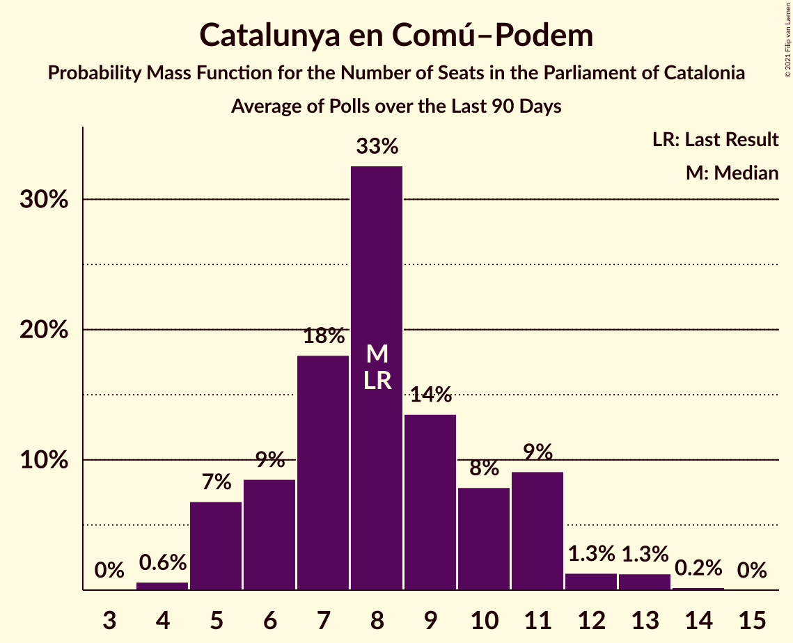
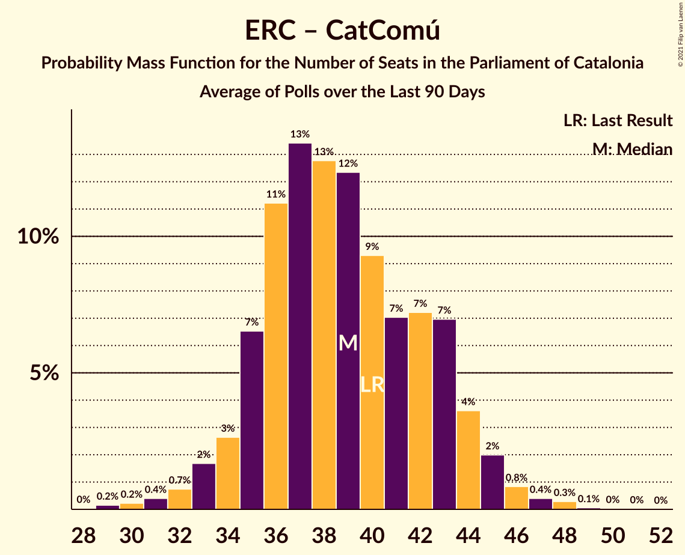

# Poll Average

<a href="#voting-intentions">Voting Intentions</a> | <a href="#seats">Seats</a> | <a href="#coalitions">Coalitions</a> | <a href="#technical-information">Technical Information</a>

## Summary

The table below lists the polls on which the average is based. They are the most recent polls (less than 90 days old) registered and analyzed so far.

| Period     | Polling firm/Commissioner(s) | Cs | JxCAT | ERC | PSC | CatComú | CUP | PP | Vox |
|:----------:|:----------------------------:|:--:|:--:|:--:|:--:|:--:|:--:|:--:|:--:|
| 21 December 2017 | General Election | 25.4%   36 | 21.7%   34 | 21.4%   32 | 13.9%   17 | 7.5%   8 | 4.5%   4 | 4.2%   4 | 0.0%   0 |
| N/A | Poll Average | 9–15%   12–20 | 17–23%   26–37 | 21–30%   31–44 | 15–21%   19–29 | 5–10%   5–12 | 3–7%   0–9 | 5–9%   5–12 | 3–6%   2–8 |
| [19–23 October 2020](2020-10-23-GESOP.html) | GESOP | 11–14%   14–19 | 16–20%   26–32 | 21–25%   31–39 | 16–20%   20–26 | 6–9%   6–11 | 5–7%   5–9 | 5–8%   6–10 | 4–6%   4–8 |
| [17 October 2020](2020-10-17-KeyData.html) | Key Data   Público | 9–16%   12–22 | 16–24%   25–38 | 20–29%   30–44 | 13–21%   17–29 | 5–11%   5–14 | 3–7%   0–9 | 4–9%   5–12 | 3–7%   0–9 |
| [28 September–2 October 2020](2020-10-02-NCReport.html) | NC Report   La Razón | 10–15%   13–19 | 17–23%   26–37 | 20–26%   30–40 | 15–21%   19–28 | 6–10%   6–12 | 3–6%   2–8 | 6–10%   7–13 | 4–7%   3–8 |
| [1–4 September 2020](2020-09-04-GAD3.html) | GAD3   La Vanguardia | 8–13%   9–18 | 17–23%   26–37 | 24–31%   35–47 | 16–23%   21–31 | 5–9%   4–11 | 3–6%   0–8 | 5–9%   5–12 | 3–6%   0–7 |
| [31 August 2020](2020-08-31-electoPanel.html) | electoPanel   electomania.es | 9–11%   13–14 | 21–22%   32–35 | 21–23%   32–35 | 17–19%   24–25 | 8–9%   8–11 | 5–6%   7–8 | 7–8%   8–10 | 4–5%   4–5 |
| 21 December 2017 | General Election | 25.4%   36 | 21.7%   34 | 21.4%   32 | 13.9%   17 | 7.5%   8 | 4.5%   4 | 4.2%   4 | 0.0%   0 |

Only polls for which at least the sample size has been published are included in the table above.

**Legend:**
+ **Top half of each row:** Voting intentions (95% confidence interval)
+ **Bottom half of each row:** Seat projections for the Parliament of Catalonia (95% confidence interval)
+ **Cs:** Ciutadans–Partido de la Ciudadanía
+ **JxCAT:** Junts per Catalunya
+ **ERC:** Esquerra Republicana–Catalunya Sí
+ **PSC:** Partit dels Socialistes de Catalunya (PSC-PSOE)
+ **CatComú:** Catalunya en Comú–Podem
+ **CUP:** Candidatura d’Unitat Popular
+ **PP:** Partit Popular
+ **Vox:** Vox
+ **N/A (single party):** Party not included the published results
+ **N/A (entire row):** Calculation for this opinion poll not started yet

## Voting Intentions

### Confidence Intervals

| Party | Last Result | Median | 80% Confidence Interval | 90% Confidence Interval | 95% Confidence Interval | 99% Confidence Interval |
|:-----:|:-----------:|:------:|:-----------------------:|:-----------------------:|:-----------------------:|:-----------------------:|
| <a href="#ciutadans–partido-de-la-ciudadanía">Ciutadans–Partido de la Ciudadanía</a> | 25.4% | 11.5% | 9.7–13.6% |9.3–14.1% | 8.8–14.7% | 8.0–16.1% |
| <a href="#junts-per-catalunya">Junts per Catalunya</a> | 21.7% | 20.0% | 17.6–21.9% |17.1–22.5% | 16.6–23.1% | 15.7–24.5% |
| <a href="#esquerra-republicana–catalunya-sí">Esquerra Republicana–Catalunya Sí</a> | 21.4% | 23.3% | 21.7–27.6% |21.3–28.7% | 20.8–29.6% | 19.7–31.1% |
| <a href="#partit-dels-socialistes-de-catalunya-(psc-psoe)">Partit dels Socialistes de Catalunya (PSC-PSOE)</a> | 13.9% | 17.9% | 16.1–19.9% |15.4–20.7% | 14.7–21.4% | 13.4–22.7% |
| <a href="#catalunya-en-comú–podem">Catalunya en Comú–Podem</a> | 7.5% | 7.7% | 6.2–8.8% |5.8–9.3% | 5.4–9.8% | 4.7–10.8% |
| <a href="#candidatura-d’unitat-popular">Candidatura d’Unitat Popular</a> | 4.5% | 5.2% | 3.7–6.2% |3.3–6.5% | 3.0–6.9% | 2.6–7.6% |
| <a href="#partit-popular">Partit Popular</a> | 4.2% | 6.9% | 5.6–8.2% |5.2–8.7% | 4.9–9.1% | 4.2–10.0% |
| <a href="#vox">Vox</a> | 0.0% | 4.7% | 3.6–5.8% |3.3–6.1% | 3.0–6.5% | 2.5–7.2% |

### Ciutadans–Partido de la Ciudadanía

*For a full overview of the results for this party, see the [Ciutadans–Partido de la Ciudadanía](party-ciutadans–partidodelaciudadanía.html) page.*

| Voting Intentions | Probability | Accumulated | Special Marks |
|:-----------------:|:-----------:|:-----------:|:-------------:|
| 5.5–6.5% | 0% | 100% |  |
| 6.5–7.5% | 0.2% | 100% |  |
| 7.5–8.5% | 1.4% | 99.8% |  |
| 8.5–9.5% | 6% | 98% |  |
| 9.5–10.5% | 27% | 93% |  |
| 10.5–11.5% | 18% | 66% | Median |
| 11.5–12.5% | 21% | 48% |  |
| 12.5–13.5% | 17% | 27% |  |
| 13.5–14.5% | 7% | 10% |  |
| 14.5–15.5% | 2% | 3% |  |
| 15.5–16.5% | 0.7% | 0.9% |  |
| 16.5–17.5% | 0.2% | 0.3% |  |
| 17.5–18.5% | 0.1% | 0.1% |  |
| 18.5–19.5% | 0% | 0% |  |
| 19.5–20.5% | 0% | 0% |  |
| 20.5–21.5% | 0% | 0% |  |
| 21.5–22.5% | 0% | 0% |  |
| 22.5–23.5% | 0% | 0% |  |
| 23.5–24.5% | 0% | 0% |  |
| 24.5–25.5% | 0% | 0% | Last Result |

### Junts per Catalunya

*For a full overview of the results for this party, see the [Junts per Catalunya](party-juntspercatalunya.html) page.*

| Voting Intentions | Probability | Accumulated | Special Marks |
|:-----------------:|:-----------:|:-----------:|:-------------:|
| 12.5–13.5% | 0% | 100% |  |
| 13.5–14.5% | 0.1% | 100% |  |
| 14.5–15.5% | 0.3% | 99.9% |  |
| 15.5–16.5% | 2% | 99.6% |  |
| 16.5–17.5% | 7% | 98% |  |
| 17.5–18.5% | 15% | 91% |  |
| 18.5–19.5% | 18% | 76% |  |
| 19.5–20.5% | 16% | 57% | Median |
| 20.5–21.5% | 23% | 41% |  |
| 21.5–22.5% | 14% | 18% | Last Result |
| 22.5–23.5% | 3% | 4% |  |
| 23.5–24.5% | 1.0% | 1.5% |  |
| 24.5–25.5% | 0.3% | 0.5% |  |
| 25.5–26.5% | 0.1% | 0.1% |  |
| 26.5–27.5% | 0% | 0% |  |

### Esquerra Republicana–Catalunya Sí

*For a full overview of the results for this party, see the [Esquerra Republicana–Catalunya Sí](party-esquerrarepublicana–catalunyasí.html) page.*

| Voting Intentions | Probability | Accumulated | Special Marks |
|:-----------------:|:-----------:|:-----------:|:-------------:|
| 16.5–17.5% | 0% | 100% |  |
| 17.5–18.5% | 0.1% | 100% |  |
| 18.5–19.5% | 0.3% | 99.9% |  |
| 19.5–20.5% | 1.4% | 99.6% |  |
| 20.5–21.5% | 6% | 98% | Last Result |
| 21.5–22.5% | 23% | 93% |  |
| 22.5–23.5% | 23% | 69% | Median |
| 23.5–24.5% | 13% | 47% |  |
| 24.5–25.5% | 9% | 33% |  |
| 25.5–26.5% | 7% | 24% |  |
| 26.5–27.5% | 6% | 17% |  |
| 27.5–28.5% | 5% | 10% |  |
| 28.5–29.5% | 3% | 6% |  |
| 29.5–30.5% | 2% | 3% |  |
| 30.5–31.5% | 0.7% | 1.0% |  |
| 31.5–32.5% | 0.2% | 0.3% |  |
| 32.5–33.5% | 0.1% | 0.1% |  |
| 33.5–34.5% | 0% | 0% |  |

### Partit dels Socialistes de Catalunya (PSC-PSOE)

*For a full overview of the results for this party, see the [Partit dels Socialistes de Catalunya (PSC-PSOE)](party-partitdelssocialistesdecatalunyapsc-psoe.html) page.*

| Voting Intentions | Probability | Accumulated | Special Marks |
|:-----------------:|:-----------:|:-----------:|:-------------:|
| 10.5–11.5% | 0% | 100% |  |
| 11.5–12.5% | 0.1% | 100% |  |
| 12.5–13.5% | 0.5% | 99.9% |  |
| 13.5–14.5% | 1.5% | 99.4% | Last Result |
| 14.5–15.5% | 4% | 98% |  |
| 15.5–16.5% | 10% | 94% |  |
| 16.5–17.5% | 22% | 84% |  |
| 17.5–18.5% | 34% | 62% | Median |
| 18.5–19.5% | 15% | 28% |  |
| 19.5–20.5% | 7% | 13% |  |
| 20.5–21.5% | 4% | 6% |  |
| 21.5–22.5% | 1.5% | 2% |  |
| 22.5–23.5% | 0.5% | 0.6% |  |
| 23.5–24.5% | 0.1% | 0.2% |  |
| 24.5–25.5% | 0% | 0% |  |

### Catalunya en Comú–Podem

*For a full overview of the results for this party, see the [Catalunya en Comú–Podem](party-catalunyaencomú–podem.html) page.*

| Voting Intentions | Probability | Accumulated | Special Marks |
|:-----------------:|:-----------:|:-----------:|:-------------:|
| 2.5–3.5% | 0% | 100% |  |
| 3.5–4.5% | 0.3% | 100% |  |
| 4.5–5.5% | 3% | 99.7% |  |
| 5.5–6.5% | 13% | 97% |  |
| 6.5–7.5% | 28% | 84% | Last Result |
| 7.5–8.5% | 41% | 56% | Median |
| 8.5–9.5% | 11% | 14% |  |
| 9.5–10.5% | 3% | 3% |  |
| 10.5–11.5% | 0.6% | 0.8% |  |
| 11.5–12.5% | 0.1% | 0.2% |  |
| 12.5–13.5% | 0% | 0% |  |

### Candidatura d’Unitat Popular

*For a full overview of the results for this party, see the [Candidatura d’Unitat Popular](party-candidaturad’unitatpopular.html) page.*

| Voting Intentions | Probability | Accumulated | Special Marks |
|:-----------------:|:-----------:|:-----------:|:-------------:|
| 0.5–1.5% | 0% | 100% |  |
| 1.5–2.5% | 0.5% | 100% |  |
| 2.5–3.5% | 8% | 99.5% |  |
| 3.5–4.5% | 23% | 92% | Last Result |
| 4.5–5.5% | 37% | 69% | Median |
| 5.5–6.5% | 27% | 32% |  |
| 6.5–7.5% | 4% | 5% |  |
| 7.5–8.5% | 0.5% | 0.5% |  |
| 8.5–9.5% | 0.1% | 0.1% |  |
| 9.5–10.5% | 0% | 0% |  |

### Partit Popular

*For a full overview of the results for this party, see the [Partit Popular](party-partitpopular.html) page.*

| Voting Intentions | Probability | Accumulated | Special Marks |
|:-----------------:|:-----------:|:-----------:|:-------------:|
| 2.5–3.5% | 0.1% | 100% |  |
| 3.5–4.5% | 1.1% | 99.9% | Last Result |
| 4.5–5.5% | 9% | 98.8% |  |
| 5.5–6.5% | 26% | 90% |  |
| 6.5–7.5% | 43% | 64% | Median |
| 7.5–8.5% | 15% | 21% |  |
| 8.5–9.5% | 5% | 6% |  |
| 9.5–10.5% | 1.0% | 1.2% |  |
| 10.5–11.5% | 0.2% | 0.2% |  |
| 11.5–12.5% | 0% | 0% |  |

### Vox

*For a full overview of the results for this party, see the [Vox](party-vox.html) page.*

| Voting Intentions | Probability | Accumulated | Special Marks |
|:-----------------:|:-----------:|:-----------:|:-------------:|
| 0.0–0.5% | 0% | 100% | Last Result |
| 0.5–1.5% | 0% | 100% |  |
| 1.5–2.5% | 0.7% | 100% |  |
| 2.5–3.5% | 8% | 99.3% |  |
| 3.5–4.5% | 32% | 91% |  |
| 4.5–5.5% | 44% | 59% | Median |
| 5.5–6.5% | 13% | 15% |  |
| 6.5–7.5% | 2% | 2% |  |
| 7.5–8.5% | 0.2% | 0.2% |  |
| 8.5–9.5% | 0% | 0% |  |

## Seats

### Confidence Intervals

| Party | Last Result | Median | 80% Confidence Interval | 90% Confidence Interval | 95% Confidence Interval | 99% Confidence Interval |
|:-----:|:-----------:|:------:|:-----------------------:|:-----------------------:|:-----------------------:|:-----------------------:|
| <a href="#ciutadans–partido-de-la-ciudadanía">Ciutadans–Partido de la Ciudadanía</a> | 36 | 14 | 13–18 |12–19 | 12–20 | 9–22 |
| <a href="#junts-per-catalunya">Junts per Catalunya</a> | 34 | 32 | 28–34 |26–36 | 26–37 | 24–39 |
| <a href="#esquerra-republicana–catalunya-sí">Esquerra Republicana–Catalunya Sí</a> | 32 | 35 | 33–42 |31–44 | 31–44 | 29–47 |
| <a href="#partit-dels-socialistes-de-catalunya-(psc-psoe)">Partit dels Socialistes de Catalunya (PSC-PSOE)</a> | 17 | 24 | 22–26 |20–28 | 19–29 | 17–31 |
| <a href="#catalunya-en-comú–podem">Catalunya en Comú–Podem</a> | 8 | 8 | 7–10 |5–11 | 5–12 | 4–14 |
| <a href="#candidatura-d’unitat-popular">Candidatura d’Unitat Popular</a> | 4 | 7 | 3–8 |2–8 | 0–9 | 0–10 |
| <a href="#partit-popular">Partit Popular</a> | 4 | 9 | 7–10 |6–12 | 5–12 | 4–14 |
| <a href="#vox">Vox</a> | 0 | 5 | 3–7 |3–7 | 2–8 | 0–9 |

### Ciutadans–Partido de la Ciudadanía

*For a full overview of the results for this party, see the [Ciutadans–Partido de la Ciudadanía](party-ciutadans–partidodelaciudadanía.html) page.*

| Number of Seats | Probability | Accumulated | Special Marks |
|:---------------:|:-----------:|:-----------:|:-------------:|
| 8 | 0.1% | 100% |  |
| 9 | 0.5% | 99.9% |  |
| 10 | 0.3% | 99.4% |  |
| 11 | 0.5% | 99.1% |  |
| 12 | 5% | 98.6% |  |
| 13 | 26% | 93% |  |
| 14 | 17% | 67% | Median |
| 15 | 7% | 50% |  |
| 16 | 13% | 43% |  |
| 17 | 8% | 30% |  |
| 18 | 13% | 22% |  |
| 19 | 6% | 9% |  |
| 20 | 2% | 3% |  |
| 21 | 0.4% | 1.0% |  |
| 22 | 0.3% | 0.6% |  |
| 23 | 0.2% | 0.3% |  |
| 24 | 0.1% | 0.2% |  |
| 25 | 0% | 0.1% |  |
| 26 | 0% | 0% |  |
| 27 | 0% | 0% |  |
| 28 | 0% | 0% |  |
| 29 | 0% | 0% |  |
| 30 | 0% | 0% |  |
| 31 | 0% | 0% |  |
| 32 | 0% | 0% |  |
| 33 | 0% | 0% |  |
| 34 | 0% | 0% |  |
| 35 | 0% | 0% |  |
| 36 | 0% | 0% | Last Result |

### Junts per Catalunya

*For a full overview of the results for this party, see the [Junts per Catalunya](party-juntspercatalunya.html) page.*

| Number of Seats | Probability | Accumulated | Special Marks |
|:---------------:|:-----------:|:-----------:|:-------------:|
| 23 | 0.1% | 100% |  |
| 24 | 0.4% | 99.8% |  |
| 25 | 1.1% | 99.4% |  |
| 26 | 4% | 98% |  |
| 27 | 3% | 94% |  |
| 28 | 5% | 91% |  |
| 29 | 9% | 86% |  |
| 30 | 8% | 77% |  |
| 31 | 18% | 68% |  |
| 32 | 19% | 50% | Median |
| 33 | 12% | 31% |  |
| 34 | 10% | 20% | Last Result |
| 35 | 4% | 10% |  |
| 36 | 2% | 6% |  |
| 37 | 2% | 4% |  |
| 38 | 0.9% | 1.4% |  |
| 39 | 0.3% | 0.5% |  |
| 40 | 0.1% | 0.3% |  |
| 41 | 0.1% | 0.1% |  |
| 42 | 0% | 0.1% |  |
| 43 | 0% | 0% |  |

### Esquerra Republicana–Catalunya Sí

*For a full overview of the results for this party, see the [Esquerra Republicana–Catalunya Sí](party-esquerrarepublicana–catalunyasí.html) page.*

| Number of Seats | Probability | Accumulated | Special Marks |
|:---------------:|:-----------:|:-----------:|:-------------:|
| 27 | 0.1% | 100% |  |
| 28 | 0.2% | 99.9% |  |
| 29 | 0.6% | 99.7% |  |
| 30 | 0.9% | 99.1% |  |
| 31 | 3% | 98% |  |
| 32 | 5% | 95% | Last Result |
| 33 | 12% | 90% |  |
| 34 | 13% | 78% |  |
| 35 | 20% | 65% | Median |
| 36 | 9% | 45% |  |
| 37 | 6% | 36% |  |
| 38 | 6% | 29% |  |
| 39 | 5% | 24% |  |
| 40 | 3% | 19% |  |
| 41 | 4% | 15% |  |
| 42 | 3% | 11% |  |
| 43 | 3% | 8% |  |
| 44 | 3% | 5% |  |
| 45 | 1.1% | 2% |  |
| 46 | 0.5% | 1.3% |  |
| 47 | 0.3% | 0.7% |  |
| 48 | 0.2% | 0.4% |  |
| 49 | 0.1% | 0.2% |  |
| 50 | 0.1% | 0.1% |  |
| 51 | 0% | 0% |  |

### Partit dels Socialistes de Catalunya (PSC-PSOE)

*For a full overview of the results for this party, see the [Partit dels Socialistes de Catalunya (PSC-PSOE)](party-partitdelssocialistesdecatalunyapsc-psoe.html) page.*

| Number of Seats | Probability | Accumulated | Special Marks |
|:---------------:|:-----------:|:-----------:|:-------------:|
| 16 | 0.2% | 100% |  |
| 17 | 0.8% | 99.7% | Last Result |
| 18 | 1.4% | 99.0% |  |
| 19 | 1.2% | 98% |  |
| 20 | 3% | 96% |  |
| 21 | 3% | 94% |  |
| 22 | 6% | 90% |  |
| 23 | 10% | 84% |  |
| 24 | 31% | 74% | Median |
| 25 | 25% | 43% |  |
| 26 | 10% | 18% |  |
| 27 | 3% | 8% |  |
| 28 | 2% | 5% |  |
| 29 | 0.9% | 3% |  |
| 30 | 2% | 2% |  |
| 31 | 0.6% | 0.9% |  |
| 32 | 0.1% | 0.3% |  |
| 33 | 0.1% | 0.1% |  |
| 34 | 0% | 0% |  |

### Catalunya en Comú–Podem

*For a full overview of the results for this party, see the [Catalunya en Comú–Podem](party-catalunyaencomú–podem.html) page.*

| Number of Seats | Probability | Accumulated | Special Marks |
|:---------------:|:-----------:|:-----------:|:-------------:|
| 4 | 0.7% | 100% |  |
| 5 | 5% | 99.3% |  |
| 6 | 4% | 95% |  |
| 7 | 12% | 91% |  |
| 8 | 31% | 78% | Last Result, Median |
| 9 | 28% | 47% |  |
| 10 | 9% | 19% |  |
| 11 | 7% | 10% |  |
| 12 | 1.0% | 3% |  |
| 13 | 1.0% | 2% |  |
| 14 | 0.5% | 0.6% |  |
| 15 | 0.1% | 0.1% |  |
| 16 | 0.1% | 0.1% |  |
| 17 | 0% | 0% |  |

### Candidatura d’Unitat Popular

*For a full overview of the results for this party, see the [Candidatura d’Unitat Popular](party-candidaturad’unitatpopular.html) page.*

| Number of Seats | Probability | Accumulated | Special Marks |
|:---------------:|:-----------:|:-----------:|:-------------:|
| 0 | 3% | 100% |  |
| 1 | 0% | 97% |  |
| 2 | 3% | 97% |  |
| 3 | 7% | 94% |  |
| 4 | 16% | 87% | Last Result |
| 5 | 7% | 71% |  |
| 6 | 7% | 64% |  |
| 7 | 24% | 57% | Median |
| 8 | 29% | 33% |  |
| 9 | 3% | 4% |  |
| 10 | 0.4% | 0.8% |  |
| 11 | 0.3% | 0.3% |  |
| 12 | 0% | 0% |  |

### Partit Popular

*For a full overview of the results for this party, see the [Partit Popular](party-partitpopular.html) page.*

| Number of Seats | Probability | Accumulated | Special Marks |
|:---------------:|:-----------:|:-----------:|:-------------:|
| 3 | 0.3% | 100% |  |
| 4 | 0.2% | 99.7% | Last Result |
| 5 | 3% | 99.4% |  |
| 6 | 3% | 97% |  |
| 7 | 24% | 93% |  |
| 8 | 11% | 69% |  |
| 9 | 35% | 58% | Median |
| 10 | 14% | 23% |  |
| 11 | 4% | 9% |  |
| 12 | 4% | 5% |  |
| 13 | 0.4% | 1.1% |  |
| 14 | 0.6% | 0.7% |  |
| 15 | 0.1% | 0.1% |  |
| 16 | 0% | 0% |  |

### Vox

*For a full overview of the results for this party, see the [Vox](party-vox.html) page.*

| Number of Seats | Probability | Accumulated | Special Marks |
|:---------------:|:-----------:|:-----------:|:-------------:|
| 0 | 2% | 100% | Last Result |
| 1 | 0% | 98% |  |
| 2 | 2% | 98% |  |
| 3 | 16% | 96% |  |
| 4 | 6% | 80% |  |
| 5 | 41% | 73% | Median |
| 6 | 10% | 32% |  |
| 7 | 19% | 22% |  |
| 8 | 1.3% | 3% |  |
| 9 | 1.3% | 1.5% |  |
| 10 | 0.2% | 0.2% |  |
| 11 | 0% | 0.1% |  |
| 12 | 0% | 0% |  |

## Coalitions

### Confidence Intervals

| Coalition | Last Result | Median | Majority? | 80% Confidence Interval | 90% Confidence Interval | 95% Confidence Interval | 99% Confidence Interval |
|:---------:|:-----------:|:------:|:---------:|:-----------------------:|:-----------------------:|:-----------------------:|:-----------------------:|
| Junts per Catalunya – Esquerra Republicana–Catalunya Sí – Catalunya en Comú–Podem | 74 | 76 | 99.6% | 71–81 | 70–83 | 69–84 | 68–87 |
| Junts per Catalunya – Esquerra Republicana–Catalunya Sí – Candidatura d’Unitat Popular | 70 | 74 | 97% | 69–78 | 68–79 | 67–81 | 65–83 |
| Esquerra Republicana–Catalunya Sí – Partit dels Socialistes de Catalunya (PSC-PSOE) – Catalunya en Comú–Podem | 57 | 68 | 59% | 65–75 | 63–77 | 62–78 | 60–81 |
| Junts per Catalunya – Esquerra Republicana–Catalunya Sí | 66 | 67 | 43% | 63–73 | 62–75 | 61–76 | 59–79 |
| Ciutadans–Partido de la Ciudadanía – Partit dels Socialistes de Catalunya (PSC-PSOE) – Catalunya en Comú–Podem – Partit Popular | 65 | 56 | 0.1% | 53–60 | 51–61 | 50–63 | 47–65 |
| Ciutadans–Partido de la Ciudadanía – Partit dels Socialistes de Catalunya (PSC-PSOE) – Partit Popular – Vox | 57 | 53 | 0% | 49–57 | 48–58 | 46–59 | 43–61 |
| Ciutadans–Partido de la Ciudadanía – Partit dels Socialistes de Catalunya (PSC-PSOE) – Partit Popular | 57 | 48 | 0% | 45–52 | 43–53 | 42–54 | 40–56 |
| Esquerra Republicana–Catalunya Sí – Catalunya en Comú–Podem | 40 | 44 | 0% | 41–50 | 40–51 | 39–53 | 37–56 |

### Junts per Catalunya – Esquerra Republicana–Catalunya Sí – Catalunya en Comú–Podem

| Number of Seats | Probability | Accumulated | Special Marks |
|:---------------:|:-----------:|:-----------:|:-------------:|
| 65 | 0% | 100% |  |
| 66 | 0.1% | 99.9% |  |
| 67 | 0.3% | 99.8% |  |
| 68 | 0.8% | 99.6% | Majority |
| 69 | 2% | 98.8% |  |
| 70 | 3% | 97% |  |
| 71 | 4% | 94% |  |
| 72 | 6% | 90% |  |
| 73 | 7% | 84% |  |
| 74 | 9% | 76% | Last Result |
| 75 | 12% | 68% | Median |
| 76 | 17% | 55% |  |
| 77 | 10% | 39% |  |
| 78 | 7% | 29% |  |
| 79 | 5% | 22% |  |
| 80 | 4% | 17% |  |
| 81 | 3% | 13% |  |
| 82 | 3% | 9% |  |
| 83 | 3% | 6% |  |
| 84 | 1.0% | 3% |  |
| 85 | 0.8% | 2% |  |
| 86 | 0.6% | 1.3% |  |
| 87 | 0.4% | 0.7% |  |
| 88 | 0.2% | 0.3% |  |
| 89 | 0.1% | 0.1% |  |
| 90 | 0% | 0.1% |  |
| 91 | 0% | 0% |  |

### Junts per Catalunya – Esquerra Republicana–Catalunya Sí – Candidatura d’Unitat Popular

| Number of Seats | Probability | Accumulated | Special Marks |
|:---------------:|:-----------:|:-----------:|:-------------:|
| 62 | 0% | 100% |  |
| 63 | 0.1% | 99.9% |  |
| 64 | 0.2% | 99.8% |  |
| 65 | 0.5% | 99.6% |  |
| 66 | 0.8% | 99.1% |  |
| 67 | 2% | 98% |  |
| 68 | 4% | 97% | Majority |
| 69 | 4% | 93% |  |
| 70 | 6% | 89% | Last Result |
| 71 | 7% | 83% |  |
| 72 | 10% | 76% |  |
| 73 | 9% | 66% |  |
| 74 | 18% | 56% | Median |
| 75 | 15% | 38% |  |
| 76 | 8% | 23% |  |
| 77 | 5% | 15% |  |
| 78 | 3% | 11% |  |
| 79 | 3% | 7% |  |
| 80 | 1.4% | 5% |  |
| 81 | 1.4% | 3% |  |
| 82 | 1.0% | 2% |  |
| 83 | 0.6% | 1.0% |  |
| 84 | 0.2% | 0.5% |  |
| 85 | 0.1% | 0.2% |  |
| 86 | 0% | 0.1% |  |
| 87 | 0% | 0% |  |

### Esquerra Republicana–Catalunya Sí – Partit dels Socialistes de Catalunya (PSC-PSOE) – Catalunya en Comú–Podem

| Number of Seats | Probability | Accumulated | Special Marks |
|:---------------:|:-----------:|:-----------:|:-------------:|
| 57 | 0.1% | 100% | Last Result |
| 58 | 0.1% | 99.9% |  |
| 59 | 0.2% | 99.8% |  |
| 60 | 0.5% | 99.6% |  |
| 61 | 0.8% | 99.1% |  |
| 62 | 1.3% | 98% |  |
| 63 | 3% | 97% |  |
| 64 | 4% | 94% |  |
| 65 | 6% | 90% |  |
| 66 | 11% | 84% |  |
| 67 | 14% | 73% | Median |
| 68 | 18% | 59% | Majority |
| 69 | 8% | 42% |  |
| 70 | 6% | 33% |  |
| 71 | 5% | 27% |  |
| 72 | 4% | 22% |  |
| 73 | 3% | 18% |  |
| 74 | 3% | 14% |  |
| 75 | 3% | 11% |  |
| 76 | 3% | 8% |  |
| 77 | 2% | 5% |  |
| 78 | 1.2% | 3% |  |
| 79 | 1.0% | 2% |  |
| 80 | 0.6% | 1.1% |  |
| 81 | 0.2% | 0.5% |  |
| 82 | 0.1% | 0.3% |  |
| 83 | 0.1% | 0.2% |  |
| 84 | 0% | 0.1% |  |
| 85 | 0% | 0% |  |

### Junts per Catalunya – Esquerra Republicana–Catalunya Sí

| Number of Seats | Probability | Accumulated | Special Marks |
|:---------------:|:-----------:|:-----------:|:-------------:|
| 57 | 0.1% | 100% |  |
| 58 | 0.2% | 99.9% |  |
| 59 | 0.4% | 99.7% |  |
| 60 | 1.5% | 99.3% |  |
| 61 | 2% | 98% |  |
| 62 | 4% | 96% |  |
| 63 | 5% | 92% |  |
| 64 | 7% | 87% |  |
| 65 | 8% | 80% |  |
| 66 | 14% | 72% | Last Result |
| 67 | 15% | 58% | Median |
| 68 | 10% | 43% | Majority |
| 69 | 6% | 33% |  |
| 70 | 6% | 27% |  |
| 71 | 5% | 22% |  |
| 72 | 4% | 16% |  |
| 73 | 4% | 12% |  |
| 74 | 2% | 9% |  |
| 75 | 2% | 6% |  |
| 76 | 2% | 4% |  |
| 77 | 1.1% | 2% |  |
| 78 | 0.5% | 1.3% |  |
| 79 | 0.4% | 0.8% |  |
| 80 | 0.2% | 0.4% |  |
| 81 | 0.1% | 0.2% |  |
| 82 | 0.1% | 0.1% |  |
| 83 | 0% | 0% |  |

### Ciutadans–Partido de la Ciudadanía – Partit dels Socialistes de Catalunya (PSC-PSOE) – Catalunya en Comú–Podem – Partit Popular

| Number of Seats | Probability | Accumulated | Special Marks |
|:---------------:|:-----------:|:-----------:|:-------------:|
| 45 | 0.1% | 100% |  |
| 46 | 0.1% | 99.9% |  |
| 47 | 0.3% | 99.8% |  |
| 48 | 0.4% | 99.5% |  |
| 49 | 1.0% | 99.1% |  |
| 50 | 2% | 98% |  |
| 51 | 2% | 96% |  |
| 52 | 3% | 94% |  |
| 53 | 5% | 91% |  |
| 54 | 8% | 86% |  |
| 55 | 15% | 78% | Median |
| 56 | 19% | 63% |  |
| 57 | 13% | 44% |  |
| 58 | 9% | 31% |  |
| 59 | 7% | 21% |  |
| 60 | 6% | 14% |  |
| 61 | 4% | 9% |  |
| 62 | 2% | 4% |  |
| 63 | 1.2% | 3% |  |
| 64 | 0.6% | 1.4% |  |
| 65 | 0.4% | 0.8% | Last Result |
| 66 | 0.2% | 0.4% |  |
| 67 | 0.1% | 0.2% |  |
| 68 | 0.1% | 0.1% | Majority |
| 69 | 0% | 0% |  |

### Ciutadans–Partido de la Ciudadanía – Partit dels Socialistes de Catalunya (PSC-PSOE) – Partit Popular – Vox

| Number of Seats | Probability | Accumulated | Special Marks |
|:---------------:|:-----------:|:-----------:|:-------------:|
| 40 | 0% | 100% |  |
| 41 | 0% | 99.9% |  |
| 42 | 0.1% | 99.9% |  |
| 43 | 0.3% | 99.8% |  |
| 44 | 0.3% | 99.5% |  |
| 45 | 0.9% | 99.1% |  |
| 46 | 1.2% | 98% |  |
| 47 | 2% | 97% |  |
| 48 | 3% | 95% |  |
| 49 | 4% | 92% |  |
| 50 | 6% | 89% |  |
| 51 | 13% | 82% |  |
| 52 | 18% | 70% | Median |
| 53 | 12% | 51% |  |
| 54 | 10% | 40% |  |
| 55 | 9% | 29% |  |
| 56 | 7% | 21% |  |
| 57 | 6% | 14% | Last Result |
| 58 | 4% | 8% |  |
| 59 | 2% | 4% |  |
| 60 | 1.1% | 2% |  |
| 61 | 0.5% | 0.9% |  |
| 62 | 0.3% | 0.4% |  |
| 63 | 0.1% | 0.2% |  |
| 64 | 0.1% | 0.1% |  |
| 65 | 0% | 0% |  |

### Ciutadans–Partido de la Ciudadanía – Partit dels Socialistes de Catalunya (PSC-PSOE) – Partit Popular

| Number of Seats | Probability | Accumulated | Special Marks |
|:---------------:|:-----------:|:-----------:|:-------------:|
| 37 | 0.1% | 100% |  |
| 38 | 0.1% | 99.9% |  |
| 39 | 0.2% | 99.8% |  |
| 40 | 0.5% | 99.6% |  |
| 41 | 0.7% | 99.0% |  |
| 42 | 1.5% | 98% |  |
| 43 | 2% | 97% |  |
| 44 | 3% | 95% |  |
| 45 | 6% | 91% |  |
| 46 | 14% | 85% |  |
| 47 | 20% | 71% | Median |
| 48 | 13% | 51% |  |
| 49 | 11% | 38% |  |
| 50 | 10% | 27% |  |
| 51 | 7% | 18% |  |
| 52 | 4% | 10% |  |
| 53 | 3% | 6% |  |
| 54 | 1.3% | 3% |  |
| 55 | 0.7% | 2% |  |
| 56 | 0.4% | 0.8% |  |
| 57 | 0.2% | 0.4% | Last Result |
| 58 | 0.1% | 0.2% |  |
| 59 | 0% | 0.1% |  |
| 60 | 0% | 0.1% |  |
| 61 | 0% | 0% |  |

### Esquerra Republicana–Catalunya Sí – Catalunya en Comú–Podem

| Number of Seats | Probability | Accumulated | Special Marks |
|:---------------:|:-----------:|:-----------:|:-------------:|
| 35 | 0.1% | 100% |  |
| 36 | 0.2% | 99.9% |  |
| 37 | 0.5% | 99.7% |  |
| 38 | 1.1% | 99.2% |  |
| 39 | 2% | 98% |  |
| 40 | 4% | 97% | Last Result |
| 41 | 6% | 93% |  |
| 42 | 12% | 87% |  |
| 43 | 19% | 75% | Median |
| 44 | 16% | 56% |  |
| 45 | 8% | 40% |  |
| 46 | 7% | 32% |  |
| 47 | 5% | 25% |  |
| 48 | 4% | 21% |  |
| 49 | 5% | 16% |  |
| 50 | 4% | 11% |  |
| 51 | 3% | 7% |  |
| 52 | 1.2% | 4% |  |
| 53 | 0.9% | 3% |  |
| 54 | 0.8% | 2% |  |
| 55 | 0.3% | 0.8% |  |
| 56 | 0.3% | 0.5% |  |
| 57 | 0.1% | 0.2% |  |
| 58 | 0% | 0.1% |  |
| 59 | 0% | 0% |  |

## Technical Information

+ **Number of polls included in this average:** 5
+ **Lowest number of simulations done in a poll included in this average:** 1,048,576
+ **Total number of simulations done in the polls included in this average:** 5,242,880
+ **Error estimate:** 2.65%
