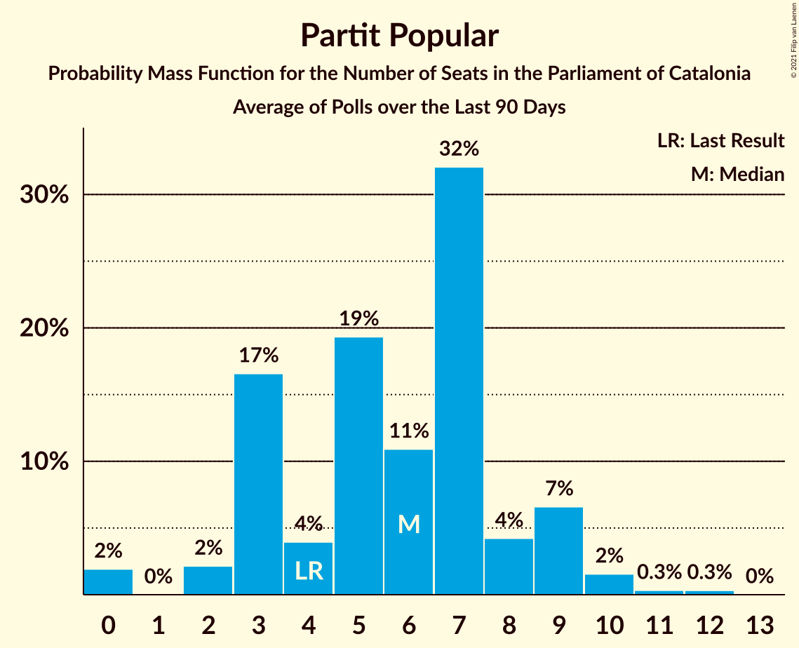

# Poll Average

<a href="#voting-intentions">Voting Intentions</a> | <a href="#seats">Seats</a> | <a href="#coalitions">Coalitions</a> | <a href="#technical-information">Technical Information</a>

## Summary

The table below lists the polls on which the average is based. They are the most recent polls (less than 90 days old) registered and analyzed so far.

| Period     | Polling firm/Commissioner(s) | JxSí | PDeCAT | ERC | Cs | PSC | CatComú | PP | CUP |
|:----------:|:----------------------------:|:--:|:--:|:--:|:--:|:--:|:--:|:--:|:--:|
| 27 September 2015 | General Election | 39.6%   62 | 39.6%   29 | 39.6%   20 | 17.9%   25 | 12.7%   16 | 8.9%   11 | 8.5%   11 | 8.2%   10 |
| N/A | Poll Average | 37–43%   57–66 | 8–15%   12–21 | 22–33%   37–51 | 16–22%   21–30 | 11–17%   14–23 | 9–14%   9–17 | 7–12%   9–14 | 4–8%   4–10 |
| [27–31 October 2017](2017-10-31-SocioMétrica.html) | SocioMétrica   El Español | N/A   N/A | 8–12%   11–18 | 28–34%   43–53 | 16–21%   20–28 | 10–14%   13–20 | 8–12%   9–17 | 7–11%   8–14 | 4–7%   3–9 |
| [16–29 October 2017](2017-10-29-GESOP.html) | GESOP   CEO | 37–43%   57–66 | N/A   N/A | N/A   N/A | 16–21%   21–28 | 12–16%   15–22 | 9–13%   9–15 | 7–10%   8–13 | 5–8%   5–10 |
| [23–26 October 2017](2017-10-26-SigmaDos.html) | Sigma Dos   El Mundo | N/A   N/A | 8–12%   11–17 | 24–29%   37–45 | 17–22%   24–31 | 13–17%   16–23 | 9–13%   11–17 | 7–11%   9–13 | 5–8%   6–10 |
| [16–21 October 2017](2017-10-21-NCReport.html) | NC Report   La Razón | N/A   N/A | 10–14%   17–21 | 22–27%   37–42 | 17–22%   22–28 | 11–15%   15–16 | 10–14%   13–18 | 9–13%   12–14 | 4–7%   5–9 |
| [12–15 September 2017](2017-09-15-Celeste-Tel.html) | Celeste-Tel   eldiario.es | N/A   N/A | 11–16%   18–24 | 22–28%   36–45 | 15–20%   20–25 | 12–17%   16–21 | 10–15%   12–17 | 8–12%   10–13 | 4–8%   3–9 |
| 27 September 2015 | General Election | 39.6%   62 | 39.6%   29 | 39.6%   20 | 17.9%   25 | 12.7%   16 | 8.9%   11 | 8.5%   11 | 8.2%   10 |

Only polls for which at least the sample size has been published are included in the table above.

**Legend:**
+ **Top half of each row:** Voting intentions (95% confidence interval)
+ **Bottom half of each row:** Seat projections for the Parliament of Catalonia (95% confidence interval)
+ **JxSí:** Junts pel Sí
+ **PDeCAT:** Partit Demòcrata Europeu Català
+ **ERC:** Esquerra Republicana de Catalunya–Catalunya Sí
+ **Cs:** Ciutadans–Partido de la Ciudadanía
+ **PSC:** Partit dels Socialistes de Catalunya (PSC-PSOE)
+ **CatComú:** Catalunya en Comú
+ **PP:** Partit Popular
+ **CUP:** Candidatura d’Unitat Popular
+ **N/A (single party):** Party not included the published results
+ **N/A (entire row):** Calculation for this opinion poll not started yet

## Voting Intentions

### Confidence Intervals

| Party | Last Result | Median | 80% Confidence Interval | 90% Confidence Interval | 95% Confidence Interval | 99% Confidence Interval |
|:-----:|:-----------:|:------:|:-----------------------:|:-----------------------:|:-----------------------:|:-----------------------:|
| <a href="#junts-pel-sí">Junts pel Sí</a> | 39.6% | 39.7% | 37.7–41.6% |37.1–42.2% | 36.7–42.7% | 35.7–43.7% |
| <a href="#partit-demòcrata-europeu-català">Partit Demòcrata Europeu Català</a> | 39.6% | 11.3% | 9.2–14.1% |8.8–14.8% | 8.5–15.3% | 7.9–16.3% |
| <a href="#esquerra-republicana-de-catalunya–catalunya-sí">Esquerra Republicana de Catalunya–Catalunya Sí</a> | 39.6% | 26.0% | 23.5–31.6% |22.9–32.5% | 22.4–33.1% | 21.5–34.3% |
| <a href="#ciutadans–partido-de-la-ciudadanía">Ciutadans–Partido de la Ciudadanía</a> | 17.9% | 18.6% | 16.7–20.5% |16.2–21.0% | 15.7–21.5% | 14.8–22.4% |
| <a href="#partit-dels-socialistes-de-catalunya-(psc-psoe)">Partit dels Socialistes de Catalunya (PSC-PSOE)</a> | 12.7% | 13.8% | 11.9–15.9% |11.4–16.4% | 11.0–16.9% | 10.3–17.8% |
| <a href="#catalunya-en-comú">Catalunya en Comú</a> | 8.9% | 11.0% | 9.5–12.8% |9.1–13.3% | 8.8–13.8% | 8.2–14.7% |
| <a href="#partit-popular">Partit Popular</a> | 8.5% | 9.2% | 7.8–10.9% |7.4–11.4% | 7.1–11.8% | 6.6–12.6% |
| <a href="#candidatura-d’unitat-popular">Candidatura d’Unitat Popular</a> | 8.2% | 6.0% | 5.0–7.1% |4.7–7.4% | 4.5–7.7% | 4.1–8.3% |

### Partit Demòcrata Europeu Català

*For a full overview of the results for this party, see the [Partit Demòcrata Europeu Català](party-partitdemcrataeuropeucatal.html) page.*

| Voting Intentions | Probability | Accumulated | Special Marks |
|:-----------------:|:-----------:|:-----------:|:-------------:|
| 5.5–6.5% | 0% | 100% |  |
| 6.5–7.5% | 0.1% | 100% |  |
| 7.5–8.5% | 3% | 99.9% |  |
| 8.5–9.5% | 13% | 97% |  |
| 9.5–10.5% | 21% | 84% |  |
| 10.5–11.5% | 18% | 63% | Median |
| 11.5–12.5% | 15% | 45% |  |
| 12.5–13.5% | 14% | 30% |  |
| 13.5–14.5% | 10% | 16% |  |
| 14.5–15.5% | 5% | 6% |  |
| 15.5–16.5% | 1.5% | 2% |  |
| 16.5–17.5% | 0.3% | 0.3% |  |
| 17.5–18.5% | 0% | 0% |  |
| 18.5–19.5% | 0% | 0% |  |
| 19.5–20.5% | 0% | 0% |  |
| 20.5–21.5% | 0% | 0% |  |
| 21.5–22.5% | 0% | 0% |  |
| 22.5–23.5% | 0% | 0% |  |
| 23.5–24.5% | 0% | 0% |  |
| 24.5–25.5% | 0% | 0% |  |
| 25.5–26.5% | 0% | 0% |  |
| 26.5–27.5% | 0% | 0% |  |
| 27.5–28.5% | 0% | 0% |  |
| 28.5–29.5% | 0% | 0% |  |
| 29.5–30.5% | 0% | 0% |  |
| 30.5–31.5% | 0% | 0% |  |
| 31.5–32.5% | 0% | 0% |  |
| 32.5–33.5% | 0% | 0% |  |
| 33.5–34.5% | 0% | 0% |  |
| 34.5–35.5% | 0% | 0% |  |
| 35.5–36.5% | 0% | 0% |  |
| 36.5–37.5% | 0% | 0% |  |
| 37.5–38.5% | 0% | 0% |  |
| 38.5–39.5% | 0% | 0% |  |
| 39.5–40.5% | 0% | 0% | Last Result |

### Esquerra Republicana de Catalunya–Catalunya Sí

*For a full overview of the results for this party, see the [Esquerra Republicana de Catalunya–Catalunya Sí](party-esquerrarepublicanadecatalunyacatalunyas.html) page.*

| Voting Intentions | Probability | Accumulated | Special Marks |
|:-----------------:|:-----------:|:-----------:|:-------------:|
| 18.5–19.5% | 0% | 100% |  |
| 19.5–20.5% | 0.1% | 100% |  |
| 20.5–21.5% | 0.5% | 99.9% |  |
| 21.5–22.5% | 3% | 99.4% |  |
| 22.5–23.5% | 8% | 97% |  |
| 23.5–24.5% | 14% | 89% |  |
| 24.5–25.5% | 17% | 75% |  |
| 25.5–26.5% | 16% | 58% | Median |
| 26.5–27.5% | 10% | 42% |  |
| 27.5–28.5% | 5% | 32% |  |
| 28.5–29.5% | 4% | 26% |  |
| 29.5–30.5% | 5% | 22% |  |
| 30.5–31.5% | 7% | 17% |  |
| 31.5–32.5% | 6% | 10% |  |
| 32.5–33.5% | 3% | 5% |  |
| 33.5–34.5% | 1.1% | 1.4% |  |
| 34.5–35.5% | 0.3% | 0.3% |  |
| 35.5–36.5% | 0% | 0.1% |  |
| 36.5–37.5% | 0% | 0% |  |
| 37.5–38.5% | 0% | 0% |  |
| 38.5–39.5% | 0% | 0% |  |
| 39.5–40.5% | 0% | 0% | Last Result |

### Junts pel Sí

*For a full overview of the results for this party, see the [Junts pel Sí](party-juntspels.html) page.*

| Voting Intentions | Probability | Accumulated | Special Marks |
|:-----------------:|:-----------:|:-----------:|:-------------:|
| 33.5–34.5% | 0% | 100% |  |
| 34.5–35.5% | 0.3% | 100% |  |
| 35.5–36.5% | 2% | 99.7% |  |
| 36.5–37.5% | 6% | 98% |  |
| 37.5–38.5% | 15% | 91% |  |
| 38.5–39.5% | 24% | 76% |  |
| 39.5–40.5% | 24% | 53% | Last Result, Median |
| 40.5–41.5% | 17% | 28% |  |
| 41.5–42.5% | 8% | 11% |  |
| 42.5–43.5% | 2% | 3% |  |
| 43.5–44.5% | 0.5% | 0.6% |  |
| 44.5–45.5% | 0.1% | 0.1% |  |
| 45.5–46.5% | 0% | 0% |  |

### Ciutadans–Partido de la Ciudadanía

*For a full overview of the results for this party, see the [Ciutadans–Partido de la Ciudadanía](party-ciutadanspartidodelaciudadana.html) page.*

| Voting Intentions | Probability | Accumulated | Special Marks |
|:-----------------:|:-----------:|:-----------:|:-------------:|
| 12.5–13.5% | 0% | 100% |  |
| 13.5–14.5% | 0.2% | 100% |  |
| 14.5–15.5% | 2% | 99.7% |  |
| 15.5–16.5% | 6% | 98% |  |
| 16.5–17.5% | 16% | 92% |  |
| 17.5–18.5% | 25% | 76% | Last Result |
| 18.5–19.5% | 25% | 51% | Median |
| 19.5–20.5% | 16% | 26% |  |
| 20.5–21.5% | 7% | 10% |  |
| 21.5–22.5% | 2% | 2% |  |
| 22.5–23.5% | 0.3% | 0.4% |  |
| 23.5–24.5% | 0% | 0% |  |

### Partit dels Socialistes de Catalunya (PSC-PSOE)

*For a full overview of the results for this party, see the [Partit dels Socialistes de Catalunya (PSC-PSOE)](party-partitdelssocialistesdecatalunyapscpsoe.html) page.*

| Voting Intentions | Probability | Accumulated | Special Marks |
|:-----------------:|:-----------:|:-----------:|:-------------:|
| 8.5–9.5% | 0.1% | 100% |  |
| 9.5–10.5% | 0.9% | 99.9% |  |
| 10.5–11.5% | 6% | 99.0% |  |
| 11.5–12.5% | 14% | 93% |  |
| 12.5–13.5% | 22% | 79% | Last Result |
| 13.5–14.5% | 24% | 57% | Median |
| 14.5–15.5% | 19% | 33% |  |
| 15.5–16.5% | 10% | 15% |  |
| 16.5–17.5% | 3% | 4% |  |
| 17.5–18.5% | 0.7% | 0.8% |  |
| 18.5–19.5% | 0.1% | 0.1% |  |
| 19.5–20.5% | 0% | 0% |  |

### Catalunya en Comú

*For a full overview of the results for this party, see the [Catalunya en Comú](party-catalunyaencom.html) page.*

| Voting Intentions | Probability | Accumulated | Special Marks |
|:-----------------:|:-----------:|:-----------:|:-------------:|
| 6.5–7.5% | 0% | 100% |  |
| 7.5–8.5% | 1.3% | 100% |  |
| 8.5–9.5% | 9% | 98.6% | Last Result |
| 9.5–10.5% | 24% | 89% |  |
| 10.5–11.5% | 30% | 65% | Median |
| 11.5–12.5% | 21% | 35% |  |
| 12.5–13.5% | 10% | 13% |  |
| 13.5–14.5% | 3% | 4% |  |
| 14.5–15.5% | 0.6% | 0.7% |  |
| 15.5–16.5% | 0.1% | 0.1% |  |
| 16.5–17.5% | 0% | 0% |  |

### Partit Popular

*For a full overview of the results for this party, see the [Partit Popular](party-partitpopular.html) page.*

| Voting Intentions | Probability | Accumulated | Special Marks |
|:-----------------:|:-----------:|:-----------:|:-------------:|
| 4.5–5.5% | 0% | 100% |  |
| 5.5–6.5% | 0.4% | 100% |  |
| 6.5–7.5% | 6% | 99.6% |  |
| 7.5–8.5% | 24% | 94% | Last Result |
| 8.5–9.5% | 32% | 70% | Median |
| 9.5–10.5% | 23% | 38% |  |
| 10.5–11.5% | 11% | 15% |  |
| 11.5–12.5% | 3% | 4% |  |
| 12.5–13.5% | 0.5% | 0.6% |  |
| 13.5–14.5% | 0% | 0% |  |
| 14.5–15.5% | 0% | 0% |  |

### Candidatura d’Unitat Popular

*For a full overview of the results for this party, see the [Candidatura d’Unitat Popular](party-candidaturadunitatpopular.html) page.*

| Voting Intentions | Probability | Accumulated | Special Marks |
|:-----------------:|:-----------:|:-----------:|:-------------:|
| 2.5–3.5% | 0% | 100% |  |
| 3.5–4.5% | 3% | 100% |  |
| 4.5–5.5% | 26% | 97% |  |
| 5.5–6.5% | 46% | 71% | Median |
| 6.5–7.5% | 21% | 25% |  |
| 7.5–8.5% | 3% | 4% | Last Result |
| 8.5–9.5% | 0.2% | 0.2% |  |
| 9.5–10.5% | 0% | 0% |  |

## Seats

### Confidence Intervals

| Party | Last Result | Median | 80% Confidence Interval | 90% Confidence Interval | 95% Confidence Interval | 99% Confidence Interval |
|:-----:|:-----------:|:------:|:-----------------------:|:-----------------------:|:-----------------------:|:-----------------------:|
| <a href="#junts-pel-sí">Junts pel Sí</a> | 62 | 62 | 58–64 |57–65 | 57–66 | 56–68 |
| <a href="#partit-demòcrata-europeu-català">Partit Demòcrata Europeu Català</a> | 29 | 17 | 13–19 |13–19 | 12–21 | 11–24 |
| <a href="#esquerra-republicana-de-catalunya–catalunya-sí">Esquerra Republicana de Catalunya–Catalunya Sí</a> | 20 | 43 | 37–48 |37–51 | 37–51 | 36–54 |
| <a href="#ciutadans–partido-de-la-ciudadanía">Ciutadans–Partido de la Ciudadanía</a> | 25 | 25 | 24–28 |22–28 | 21–30 | 20–31 |
| <a href="#partit-dels-socialistes-de-catalunya-(psc-psoe)">Partit dels Socialistes de Catalunya (PSC-PSOE)</a> | 16 | 17 | 15–21 |14–22 | 14–23 | 13–23 |
| <a href="#catalunya-en-comú">Catalunya en Comú</a> | 11 | 14 | 11–15 |10–16 | 9–17 | 9–18 |
| <a href="#partit-popular">Partit Popular</a> | 11 | 12 | 10–13 |9–13 | 9–14 | 8–15 |
| <a href="#candidatura-d’unitat-popular">Candidatura d’Unitat Popular</a> | 10 | 8 | 6–9 |5–9 | 4–10 | 3–10 |

### Partit Demòcrata Europeu Català

*For a full overview of the results for this party, see the [Partit Demòcrata Europeu Català](party-partitdemcrataeuropeucatal.html) page.*

| Number of Seats | Probability | Accumulated | Special Marks |
|:---------------:|:-----------:|:-----------:|:-------------:|
| 10 | 0.1% | 100% |  |
| 11 | 2% | 99.9% |  |
| 12 | 2% | 98% |  |
| 13 | 12% | 96% |  |
| 14 | 6% | 84% |  |
| 15 | 14% | 78% |  |
| 16 | 5% | 64% |  |
| 17 | 9% | 59% | Median |
| 18 | 23% | 50% |  |
| 19 | 23% | 26% |  |
| 20 | 0.5% | 4% |  |
| 21 | 1.2% | 3% |  |
| 22 | 0.1% | 2% |  |
| 23 | 0.7% | 2% |  |
| 24 | 1.3% | 1.3% |  |
| 25 | 0% | 0% |  |
| 26 | 0% | 0% |  |
| 27 | 0% | 0% |  |
| 28 | 0% | 0% |  |
| 29 | 0% | 0% | Last Result |

### Esquerra Republicana de Catalunya–Catalunya Sí

*For a full overview of the results for this party, see the [Esquerra Republicana de Catalunya–Catalunya Sí](party-esquerrarepublicanadecatalunyacatalunyas.html) page.*

| Number of Seats | Probability | Accumulated | Special Marks |
|:---------------:|:-----------:|:-----------:|:-------------:|
| 20 | 0% | 100% | Last Result |
| 21 | 0% | 100% |  |
| 22 | 0% | 100% |  |
| 23 | 0% | 100% |  |
| 24 | 0% | 100% |  |
| 25 | 0% | 100% |  |
| 26 | 0% | 100% |  |
| 27 | 0% | 100% |  |
| 28 | 0% | 100% |  |
| 29 | 0% | 100% |  |
| 30 | 0% | 100% |  |
| 31 | 0% | 100% |  |
| 32 | 0% | 100% |  |
| 33 | 0% | 100% |  |
| 34 | 0% | 100% |  |
| 35 | 0.3% | 100% |  |
| 36 | 1.5% | 99.6% |  |
| 37 | 24% | 98% |  |
| 38 | 4% | 74% |  |
| 39 | 3% | 70% |  |
| 40 | 2% | 67% |  |
| 41 | 4% | 65% |  |
| 42 | 5% | 60% |  |
| 43 | 27% | 56% | Median |
| 44 | 4% | 29% |  |
| 45 | 7% | 25% |  |
| 46 | 2% | 18% |  |
| 47 | 0.8% | 16% |  |
| 48 | 6% | 15% |  |
| 49 | 0.9% | 9% |  |
| 50 | 3% | 8% |  |
| 51 | 4% | 5% |  |
| 52 | 0.6% | 2% |  |
| 53 | 0.6% | 1.1% |  |
| 54 | 0.3% | 0.5% |  |
| 55 | 0% | 0.3% |  |
| 56 | 0.2% | 0.2% |  |
| 57 | 0% | 0% |  |

### Junts pel Sí

*For a full overview of the results for this party, see the [Junts pel Sí](party-juntspels.html) page.*

| Number of Seats | Probability | Accumulated | Special Marks |
|:---------------:|:-----------:|:-----------:|:-------------:|
| 54 | 0.1% | 100% |  |
| 55 | 0.3% | 99.9% |  |
| 56 | 1.4% | 99.6% |  |
| 57 | 3% | 98% |  |
| 58 | 6% | 95% |  |
| 59 | 9% | 89% |  |
| 60 | 11% | 80% |  |
| 61 | 13% | 69% |  |
| 62 | 18% | 56% | Last Result, Median |
| 63 | 19% | 38% |  |
| 64 | 10% | 19% |  |
| 65 | 5% | 9% |  |
| 66 | 2% | 4% |  |
| 67 | 1.0% | 2% |  |
| 68 | 0.5% | 0.9% | Majority |
| 69 | 0.3% | 0.3% |  |
| 70 | 0.1% | 0.1% |  |
| 71 | 0% | 0% |  |

### Ciutadans–Partido de la Ciudadanía

*For a full overview of the results for this party, see the [Ciutadans–Partido de la Ciudadanía](party-ciutadanspartidodelaciudadana.html) page.*

| Number of Seats | Probability | Accumulated | Special Marks |
|:---------------:|:-----------:|:-----------:|:-------------:|
| 18 | 0.1% | 100% |  |
| 19 | 0% | 99.9% |  |
| 20 | 2% | 99.9% |  |
| 21 | 2% | 98% |  |
| 22 | 2% | 96% |  |
| 23 | 2% | 94% |  |
| 24 | 28% | 92% |  |
| 25 | 20% | 64% | Last Result, Median |
| 26 | 14% | 44% |  |
| 27 | 5% | 30% |  |
| 28 | 21% | 26% |  |
| 29 | 2% | 4% |  |
| 30 | 2% | 3% |  |
| 31 | 0.5% | 0.6% |  |
| 32 | 0.1% | 0.1% |  |
| 33 | 0% | 0.1% |  |
| 34 | 0% | 0% |  |

### Partit dels Socialistes de Catalunya (PSC-PSOE)

*For a full overview of the results for this party, see the [Partit dels Socialistes de Catalunya (PSC-PSOE)](party-partitdelssocialistesdecatalunyapscpsoe.html) page.*

| Number of Seats | Probability | Accumulated | Special Marks |
|:---------------:|:-----------:|:-----------:|:-------------:|
| 12 | 0.1% | 100% |  |
| 13 | 0.8% | 99.9% |  |
| 14 | 4% | 99.1% |  |
| 15 | 5% | 95% |  |
| 16 | 35% | 90% | Last Result |
| 17 | 27% | 55% | Median |
| 18 | 5% | 28% |  |
| 19 | 4% | 23% |  |
| 20 | 7% | 19% |  |
| 21 | 4% | 12% |  |
| 22 | 5% | 8% |  |
| 23 | 2% | 3% |  |
| 24 | 0.4% | 0.4% |  |
| 25 | 0% | 0% |  |

### Catalunya en Comú

*For a full overview of the results for this party, see the [Catalunya en Comú](party-catalunyaencom.html) page.*

| Number of Seats | Probability | Accumulated | Special Marks |
|:---------------:|:-----------:|:-----------:|:-------------:|
| 8 | 0.2% | 100% |  |
| 9 | 3% | 99.8% |  |
| 10 | 3% | 97% |  |
| 11 | 8% | 94% | Last Result |
| 12 | 17% | 86% |  |
| 13 | 8% | 69% |  |
| 14 | 31% | 61% | Median |
| 15 | 24% | 30% |  |
| 16 | 1.5% | 6% |  |
| 17 | 4% | 5% |  |
| 18 | 0.8% | 1.0% |  |
| 19 | 0% | 0.1% |  |
| 20 | 0.1% | 0.1% |  |
| 21 | 0% | 0% |  |

### Partit Popular

*For a full overview of the results for this party, see the [Partit Popular](party-partitpopular.html) page.*

| Number of Seats | Probability | Accumulated | Special Marks |
|:---------------:|:-----------:|:-----------:|:-------------:|
| 6 | 0.1% | 100% |  |
| 7 | 0.1% | 99.9% |  |
| 8 | 2% | 99.8% |  |
| 9 | 3% | 98% |  |
| 10 | 22% | 94% |  |
| 11 | 7% | 73% | Last Result |
| 12 | 37% | 66% | Median |
| 13 | 26% | 29% |  |
| 14 | 2% | 3% |  |
| 15 | 0.2% | 0.5% |  |
| 16 | 0% | 0.4% |  |
| 17 | 0% | 0.3% |  |
| 18 | 0% | 0.3% |  |
| 19 | 0.3% | 0.3% |  |
| 20 | 0% | 0% |  |

### Candidatura d’Unitat Popular

*For a full overview of the results for this party, see the [Candidatura d’Unitat Popular](party-candidaturadunitatpopular.html) page.*

| Number of Seats | Probability | Accumulated | Special Marks |
|:---------------:|:-----------:|:-----------:|:-------------:|
| 3 | 1.3% | 100% |  |
| 4 | 2% | 98.7% |  |
| 5 | 2% | 96% |  |
| 6 | 19% | 94% |  |
| 7 | 4% | 75% |  |
| 8 | 46% | 71% | Median |
| 9 | 22% | 25% |  |
| 10 | 3% | 3% | Last Result |
| 11 | 0.1% | 0.1% |  |
| 12 | 0% | 0% |  |

## Coalitions

### Confidence Intervals

| Coalition | Last Result | Median | Majority? | 80% Confidence Interval | 90% Confidence Interval | 95% Confidence Interval | 99% Confidence Interval |
|:---------:|:-----------:|:------:|:---------:|:-----------------------:|:-----------------------:|:-----------------------:|:-----------------------:|
| Esquerra Republicana de Catalunya–Catalunya Sí – Partit Demòcrata Europeu Català – Catalunya en Comú | 60 | 72 | 99.1% | 70–76 | 70–76 | 70–77 | 67–83 |
| Ciutadans–Partido de la Ciudadanía – Partit dels Socialistes de Catalunya (PSC-PSOE) – Catalunya en Comú – Partit Popular | 63 | 68 | 63% | 63–72 | 62–74 | 61–75 | 59–77 |
| Junts pel Sí – Candidatura d’Unitat Popular | 72 | 70 | 80% | 66–72 | 65–73 | 65–74 | 63–76 |
| Esquerra Republicana de Catalunya–Catalunya Sí – Partit Demòcrata Europeu Català – Candidatura d’Unitat Popular | 59 | 67 | 26% | 63–71 | 61–73 | 60–74 | 58–76 |
| Esquerra Republicana de Catalunya–Catalunya Sí – Partit Demòcrata Europeu Català | 49 | 59 | 1.1% | 55–64 | 53–66 | 52–67 | 50–68 |
| Junts pel Sí | 62 | 62 | 0.9% | 58–64 | 57–65 | 57–66 | 56–68 |
| Ciutadans–Partido de la Ciudadanía – Partit dels Socialistes de Catalunya (PSC-PSOE) – Partit Popular | 52 | 53 | 0% | 50–57 | 49–57 | 48–57 | 47–59 |

### Esquerra Republicana de Catalunya–Catalunya Sí – Partit Demòcrata Europeu Català – Catalunya en Comú

| Number of Seats | Probability | Accumulated | Special Marks |
|:---------------:|:-----------:|:-----------:|:-------------:|
| 60 | 0% | 100% | Last Result |
| 61 | 0% | 100% |  |
| 62 | 0% | 100% |  |
| 63 | 0% | 100% |  |
| 64 | 0% | 100% |  |
| 65 | 0% | 100% |  |
| 66 | 0% | 100% |  |
| 67 | 0.9% | 100% |  |
| 68 | 0.4% | 99.1% | Majority |
| 69 | 0.5% | 98.6% |  |
| 70 | 44% | 98% |  |
| 71 | 0.9% | 54% |  |
| 72 | 3% | 53% |  |
| 73 | 0.2% | 50% |  |
| 74 | 2% | 50% | Median |
| 75 | 0.4% | 48% |  |
| 76 | 44% | 47% |  |
| 77 | 1.3% | 4% |  |
| 78 | 1.3% | 2% |  |
| 79 | 0% | 1.1% |  |
| 80 | 0% | 1.1% |  |
| 81 | 0% | 1.1% |  |
| 82 | 0% | 1.1% |  |
| 83 | 1.0% | 1.1% |  |
| 84 | 0% | 0% |  |

### Ciutadans–Partido de la Ciudadanía – Partit dels Socialistes de Catalunya (PSC-PSOE) – Catalunya en Comú – Partit Popular

| Number of Seats | Probability | Accumulated | Special Marks |
|:---------------:|:-----------:|:-----------:|:-------------:|
| 57 | 0% | 100% |  |
| 58 | 0.1% | 99.9% |  |
| 59 | 0.6% | 99.9% |  |
| 60 | 0.5% | 99.3% |  |
| 61 | 2% | 98.9% |  |
| 62 | 3% | 97% |  |
| 63 | 5% | 94% | Last Result |
| 64 | 10% | 88% |  |
| 65 | 7% | 78% |  |
| 66 | 5% | 71% |  |
| 67 | 4% | 67% |  |
| 68 | 21% | 63% | Median, Majority |
| 69 | 5% | 42% |  |
| 70 | 4% | 37% |  |
| 71 | 22% | 33% |  |
| 72 | 3% | 11% |  |
| 73 | 2% | 7% |  |
| 74 | 2% | 5% |  |
| 75 | 1.5% | 3% |  |
| 76 | 1.0% | 2% |  |
| 77 | 0.4% | 0.6% |  |
| 78 | 0.2% | 0.2% |  |
| 79 | 0% | 0.1% |  |
| 80 | 0% | 0% |  |

### Junts pel Sí – Candidatura d’Unitat Popular

| Number of Seats | Probability | Accumulated | Special Marks |
|:---------------:|:-----------:|:-----------:|:-------------:|
| 62 | 0.1% | 100% |  |
| 63 | 0.4% | 99.8% |  |
| 64 | 1.4% | 99.4% |  |
| 65 | 3% | 98% |  |
| 66 | 6% | 95% |  |
| 67 | 9% | 89% |  |
| 68 | 11% | 80% | Majority |
| 69 | 12% | 69% |  |
| 70 | 17% | 56% | Median |
| 71 | 18% | 40% |  |
| 72 | 13% | 22% | Last Result |
| 73 | 5% | 9% |  |
| 74 | 2% | 4% |  |
| 75 | 0.9% | 2% |  |
| 76 | 0.4% | 0.7% |  |
| 77 | 0.2% | 0.3% |  |
| 78 | 0.1% | 0.1% |  |
| 79 | 0% | 0% |  |

### Esquerra Republicana de Catalunya–Catalunya Sí – Partit Demòcrata Europeu Català – Candidatura d’Unitat Popular

| Number of Seats | Probability | Accumulated | Special Marks |
|:---------------:|:-----------:|:-----------:|:-------------:|
| 56 | 0.1% | 100% |  |
| 57 | 0.2% | 99.9% |  |
| 58 | 0.4% | 99.7% |  |
| 59 | 1.2% | 99.3% | Last Result |
| 60 | 2% | 98% |  |
| 61 | 3% | 96% |  |
| 62 | 3% | 94% |  |
| 63 | 4% | 91% |  |
| 64 | 27% | 87% |  |
| 65 | 5% | 60% |  |
| 66 | 4% | 55% |  |
| 67 | 24% | 51% |  |
| 68 | 2% | 26% | Median, Majority |
| 69 | 3% | 25% |  |
| 70 | 4% | 22% |  |
| 71 | 8% | 18% |  |
| 72 | 4% | 9% |  |
| 73 | 2% | 6% |  |
| 74 | 2% | 3% |  |
| 75 | 0.3% | 1.0% |  |
| 76 | 0.6% | 0.7% |  |
| 77 | 0.1% | 0.1% |  |
| 78 | 0% | 0% |  |

### Esquerra Republicana de Catalunya–Catalunya Sí – Partit Demòcrata Europeu Català

| Number of Seats | Probability | Accumulated | Special Marks |
|:---------------:|:-----------:|:-----------:|:-------------:|
| 48 | 0.1% | 100% |  |
| 49 | 0.2% | 99.9% | Last Result |
| 50 | 0.5% | 99.7% |  |
| 51 | 1.1% | 99.2% |  |
| 52 | 2% | 98% |  |
| 53 | 2% | 96% |  |
| 54 | 4% | 94% |  |
| 55 | 4% | 90% |  |
| 56 | 28% | 86% |  |
| 57 | 4% | 58% |  |
| 58 | 3% | 54% |  |
| 59 | 2% | 51% |  |
| 60 | 5% | 50% | Median |
| 61 | 24% | 45% |  |
| 62 | 6% | 21% |  |
| 63 | 5% | 15% |  |
| 64 | 2% | 10% |  |
| 65 | 3% | 8% |  |
| 66 | 2% | 6% |  |
| 67 | 3% | 4% |  |
| 68 | 0.6% | 1.1% | Majority |
| 69 | 0.2% | 0.4% |  |
| 70 | 0.2% | 0.2% |  |
| 71 | 0% | 0% |  |

### Junts pel Sí

| Number of Seats | Probability | Accumulated | Special Marks |
|:---------------:|:-----------:|:-----------:|:-------------:|
| 54 | 0.1% | 100% |  |
| 55 | 0.3% | 99.9% |  |
| 56 | 1.4% | 99.6% |  |
| 57 | 3% | 98% |  |
| 58 | 6% | 95% |  |
| 59 | 9% | 89% |  |
| 60 | 11% | 80% |  |
| 61 | 13% | 69% |  |
| 62 | 18% | 56% | Last Result, Median |
| 63 | 19% | 38% |  |
| 64 | 10% | 19% |  |
| 65 | 5% | 9% |  |
| 66 | 2% | 4% |  |
| 67 | 1.0% | 2% |  |
| 68 | 0.5% | 0.9% | Majority |
| 69 | 0.3% | 0.3% |  |
| 70 | 0.1% | 0.1% |  |
| 71 | 0% | 0% |  |

### Ciutadans–Partido de la Ciudadanía – Partit dels Socialistes de Catalunya (PSC-PSOE) – Partit Popular

| Number of Seats | Probability | Accumulated | Special Marks |
|:---------------:|:-----------:|:-----------:|:-------------:|
| 45 | 0.1% | 100% |  |
| 46 | 0.2% | 99.9% |  |
| 47 | 2% | 99.6% |  |
| 48 | 2% | 98% |  |
| 49 | 3% | 96% |  |
| 50 | 4% | 93% |  |
| 51 | 10% | 89% |  |
| 52 | 2% | 79% | Last Result |
| 53 | 35% | 77% |  |
| 54 | 4% | 42% | Median |
| 55 | 2% | 38% |  |
| 56 | 4% | 36% |  |
| 57 | 30% | 31% |  |
| 58 | 0.4% | 2% |  |
| 59 | 1.2% | 1.5% |  |
| 60 | 0.1% | 0.3% |  |
| 61 | 0.1% | 0.2% |  |
| 62 | 0.1% | 0.2% |  |
| 63 | 0% | 0% |  |

## Technical Information

