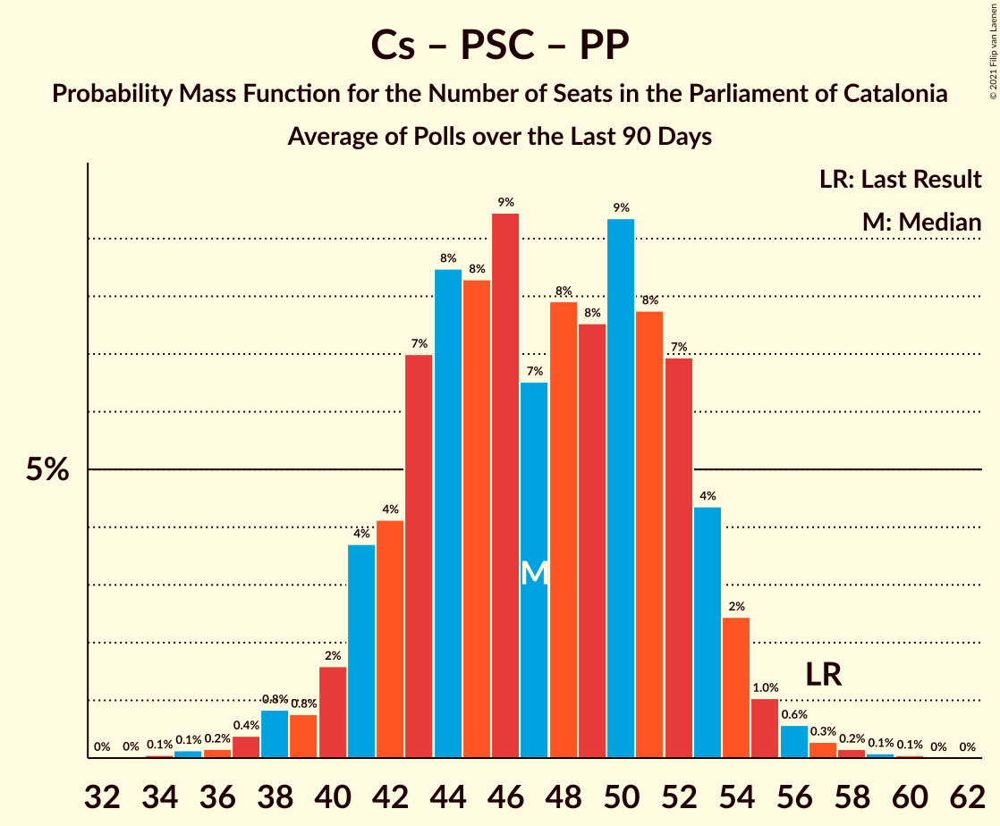

# Poll Average

<a href="#voting-intentions">Voting Intentions</a> | <a href="#seats">Seats</a> | <a href="#coalitions">Coalitions</a> | <a href="#technical-information">Technical Information</a>

## Summary

The table below lists the polls on which the average is based. They are the most recent polls (less than 90 days old) registered and analyzed so far.

| Period     | Polling firm/Commissioner(s) | Cs | JxCAT | ERC | PSC | CatComú | CUP | PP | Vox |
|:----------:|:----------------------------:|:--:|:--:|:--:|:--:|:--:|:--:|:--:|:--:|
| 21 December 2017 | General Election | 25.4%   36 | 21.7%   34 | 21.4%   32 | 13.9%   17 | 7.5%   8 | 4.5%   4 | 4.2%   4 | 0.0%   0 |
| N/A | Poll Average | 8–14%   8–19 | 14–23%   20–31 | 19–30%   36–47 | 17–23%   20–31 | 6–10%   7–12 | 4–8%   4–9 | 5–10%   6–12 | 3–6%   2–7 |
| [1 April–15 May 2020](2020-05-15-electoPanel.html) | electoPanel   electomania.es | 8–12%   N/A | 19–24%   N/A | 19–24%   N/A | 17–22%   N/A | 7–11%   N/A | 5–8%   N/A | 7–11%   N/A | 3–5%   N/A |
| [29 April–8 May 2020](2020-05-08-GESOP.html) | GESOP   El Periódico | 11–15%   14–19 | 15–19%   23–31 | 23–28%   34–42 | 16–20%   20–28 | 6–9%   7–11 | 5–7%   7–10 | 5–8%   6–9 | 3–5%   2–6 |
| [21–26 February 2020](2020-02-26-GAD3.html) | GAD3   ABC | 7–11%   8–14 | 13–18%   20–29 | 25–31%   37–48 | 18–24%   24–32 | 6–10%   7–13 | 4–7%   3–8 | 6–9%   7–12 | 3–6%   2–7 |
| 21 December 2017 | General Election | 25.4%   36 | 21.7%   34 | 21.4%   32 | 13.9%   17 | 7.5%   8 | 4.5%   4 | 4.2%   4 | 0.0%   0 |

Only polls for which at least the sample size has been published are included in the table above.

**Legend:**
+ **Top half of each row:** Voting intentions (95% confidence interval)
+ **Bottom half of each row:** Seat projections for the Parliament of Catalonia (95% confidence interval)
+ **Cs:** Ciutadans–Partido de la Ciudadanía
+ **JxCAT:** Junts pel Catalunya
+ **ERC:** Esquerra Republicana–Catalunya Sí
+ **PSC:** Partit dels Socialistes de Catalunya (PSC-PSOE)
+ **CatComú:** Catalunya en Comú–Podem
+ **CUP:** Candidatura d’Unitat Popular
+ **PP:** Partit Popular
+ **Vox:** Vox
+ **N/A (single party):** Party not included the published results
+ **N/A (entire row):** Calculation for this opinion poll not started yet

## Voting Intentions

### Confidence Intervals

| Party | Last Result | Median | 80% Confidence Interval | 90% Confidence Interval | 95% Confidence Interval | 99% Confidence Interval |
|:-----:|:-----------:|:------:|:-----------------------:|:-----------------------:|:-----------------------:|:-----------------------:|
| <a href="#ciutadans–partido-de-la-ciudadanía">Ciutadans–Partido de la Ciudadanía</a> | 25.4% | 10.0% | 8.3–13.4% |7.9–13.9% | 7.5–14.3% | 6.9–14.9% |
| <a href="#junts-pel-catalunya">Junts pel Catalunya</a> | 21.7% | 17.1% | 14.7–21.9% |14.1–22.6% | 13.6–23.1% | 12.8–24.1% |
| <a href="#esquerra-republicana–catalunya-sí">Esquerra Republicana–Catalunya Sí</a> | 21.4% | 25.2% | 20.5–29.0% |19.8–29.8% | 19.3–30.5% | 18.4–31.7% |
| <a href="#partit-dels-socialistes-de-catalunya-(psc-psoe)">Partit dels Socialistes de Catalunya (PSC-PSOE)</a> | 13.9% | 19.4% | 17.4–21.7% |16.9–22.4% | 16.6–23.0% | 15.9–24.0% |
| <a href="#catalunya-en-comú–podem">Catalunya en Comú–Podem</a> | 7.5% | 8.2% | 7.1–9.5% |6.8–9.9% | 6.5–10.3% | 6.1–11.0% |
| <a href="#candidatura-d’unitat-popular">Candidatura d’Unitat Popular</a> | 4.5% | 6.0% | 4.5–7.2% |4.2–7.5% | 3.9–7.8% | 3.5–8.4% |
| <a href="#partit-popular">Partit Popular</a> | 4.2% | 7.4% | 5.9–9.3% |5.6–9.7% | 5.4–10.1% | 5.0–10.8% |
| <a href="#vox">Vox</a> | 0.0% | 3.9% | 3.1–4.9% |2.9–5.3% | 2.7–5.6% | 2.4–6.2% |

### Ciutadans–Partido de la Ciudadanía

*For a full overview of the results for this party, see the [Ciutadans–Partido de la Ciudadanía](party-ciutadans–partidodelaciudadanía.html) page.*

| Voting Intentions | Probability | Accumulated | Special Marks |
|:-----------------:|:-----------:|:-----------:|:-------------:|
| 4.5–5.5% | 0% | 100% |  |
| 5.5–6.5% | 0.2% | 100% |  |
| 6.5–7.5% | 2% | 99.8% |  |
| 7.5–8.5% | 13% | 97% |  |
| 8.5–9.5% | 24% | 85% |  |
| 9.5–10.5% | 19% | 61% | Median |
| 10.5–11.5% | 8% | 41% |  |
| 11.5–12.5% | 10% | 33% |  |
| 12.5–13.5% | 14% | 23% |  |
| 13.5–14.5% | 7% | 8% |  |
| 14.5–15.5% | 1.2% | 1.3% |  |
| 15.5–16.5% | 0.1% | 0.1% |  |
| 16.5–17.5% | 0% | 0% |  |
| 17.5–18.5% | 0% | 0% |  |
| 18.5–19.5% | 0% | 0% |  |
| 19.5–20.5% | 0% | 0% |  |
| 20.5–21.5% | 0% | 0% |  |
| 21.5–22.5% | 0% | 0% |  |
| 22.5–23.5% | 0% | 0% |  |
| 23.5–24.5% | 0% | 0% |  |
| 24.5–25.5% | 0% | 0% | Last Result |

### Junts pel Catalunya

*For a full overview of the results for this party, see the [Junts pel Catalunya](party-juntspelcatalunya.html) page.*

| Voting Intentions | Probability | Accumulated | Special Marks |
|:-----------------:|:-----------:|:-----------:|:-------------:|
| 10.5–11.5% | 0% | 100% |  |
| 11.5–12.5% | 0.3% | 100% |  |
| 12.5–13.5% | 2% | 99.7% |  |
| 13.5–14.5% | 6% | 98% |  |
| 14.5–15.5% | 13% | 92% |  |
| 15.5–16.5% | 19% | 79% |  |
| 16.5–17.5% | 17% | 60% | Median |
| 17.5–18.5% | 8% | 43% |  |
| 18.5–19.5% | 4% | 35% |  |
| 19.5–20.5% | 7% | 30% |  |
| 20.5–21.5% | 10% | 24% |  |
| 21.5–22.5% | 8% | 13% | Last Result |
| 22.5–23.5% | 4% | 5% |  |
| 23.5–24.5% | 1.1% | 1.4% |  |
| 24.5–25.5% | 0.2% | 0.2% |  |
| 25.5–26.5% | 0% | 0% |  |

### Esquerra Republicana–Catalunya Sí

*For a full overview of the results for this party, see the [Esquerra Republicana–Catalunya Sí](party-esquerrarepublicana–catalunyasí.html) page.*

| Voting Intentions | Probability | Accumulated | Special Marks |
|:-----------------:|:-----------:|:-----------:|:-------------:|
| 16.5–17.5% | 0.1% | 100% |  |
| 17.5–18.5% | 0.6% | 99.9% |  |
| 18.5–19.5% | 3% | 99.4% |  |
| 19.5–20.5% | 7% | 96% |  |
| 20.5–21.5% | 10% | 89% | Last Result |
| 21.5–22.5% | 8% | 79% |  |
| 22.5–23.5% | 5% | 71% |  |
| 23.5–24.5% | 8% | 66% |  |
| 24.5–25.5% | 12% | 58% | Median |
| 25.5–26.5% | 12% | 45% |  |
| 26.5–27.5% | 10% | 33% |  |
| 27.5–28.5% | 9% | 22% |  |
| 28.5–29.5% | 7% | 14% |  |
| 29.5–30.5% | 4% | 6% |  |
| 30.5–31.5% | 2% | 2% |  |
| 31.5–32.5% | 0.5% | 0.6% |  |
| 32.5–33.5% | 0.1% | 0.1% |  |
| 33.5–34.5% | 0% | 0% |  |

### Partit dels Socialistes de Catalunya (PSC-PSOE)

*For a full overview of the results for this party, see the [Partit dels Socialistes de Catalunya (PSC-PSOE)](party-partitdelssocialistesdecatalunyapsc-psoe.html) page.*

| Voting Intentions | Probability | Accumulated | Special Marks |
|:-----------------:|:-----------:|:-----------:|:-------------:|
| 13.5–14.5% | 0% | 100% | Last Result |
| 14.5–15.5% | 0.2% | 100% |  |
| 15.5–16.5% | 2% | 99.8% |  |
| 16.5–17.5% | 10% | 98% |  |
| 17.5–18.5% | 20% | 88% |  |
| 18.5–19.5% | 22% | 68% | Median |
| 19.5–20.5% | 19% | 46% |  |
| 20.5–21.5% | 14% | 26% |  |
| 21.5–22.5% | 8% | 12% |  |
| 22.5–23.5% | 3% | 4% |  |
| 23.5–24.5% | 0.9% | 1.1% |  |
| 24.5–25.5% | 0.2% | 0.2% |  |
| 25.5–26.5% | 0% | 0% |  |

### Catalunya en Comú–Podem

*For a full overview of the results for this party, see the [Catalunya en Comú–Podem](party-catalunyaencomú–podem.html) page.*

| Voting Intentions | Probability | Accumulated | Special Marks |
|:-----------------:|:-----------:|:-----------:|:-------------:|
| 4.5–5.5% | 0% | 100% |  |
| 5.5–6.5% | 3% | 100% |  |
| 6.5–7.5% | 21% | 97% | Last Result |
| 7.5–8.5% | 40% | 76% | Median |
| 8.5–9.5% | 26% | 36% |  |
| 9.5–10.5% | 8% | 10% |  |
| 10.5–11.5% | 1.3% | 1.4% |  |
| 11.5–12.5% | 0.1% | 0.1% |  |
| 12.5–13.5% | 0% | 0% |  |

### Candidatura d’Unitat Popular

*For a full overview of the results for this party, see the [Candidatura d’Unitat Popular](party-candidaturad’unitatpopular.html) page.*

| Voting Intentions | Probability | Accumulated | Special Marks |
|:-----------------:|:-----------:|:-----------:|:-------------:|
| 1.5–2.5% | 0% | 100% |  |
| 2.5–3.5% | 0.7% | 100% |  |
| 3.5–4.5% | 9% | 99.3% | Last Result |
| 4.5–5.5% | 24% | 90% |  |
| 5.5–6.5% | 39% | 66% | Median |
| 6.5–7.5% | 22% | 27% |  |
| 7.5–8.5% | 4% | 4% |  |
| 8.5–9.5% | 0.3% | 0.3% |  |
| 9.5–10.5% | 0% | 0% |  |

### Partit Popular

*For a full overview of the results for this party, see the [Partit Popular](party-partitpopular.html) page.*

| Voting Intentions | Probability | Accumulated | Special Marks |
|:-----------------:|:-----------:|:-----------:|:-------------:|
| 3.5–4.5% | 0% | 100% | Last Result |
| 4.5–5.5% | 4% | 100% |  |
| 5.5–6.5% | 23% | 96% |  |
| 6.5–7.5% | 27% | 73% | Median |
| 7.5–8.5% | 22% | 46% |  |
| 8.5–9.5% | 16% | 23% |  |
| 9.5–10.5% | 6% | 7% |  |
| 10.5–11.5% | 0.9% | 1.0% |  |
| 11.5–12.5% | 0.1% | 0.1% |  |
| 12.5–13.5% | 0% | 0% |  |

### Vox

*For a full overview of the results for this party, see the [Vox](party-vox.html) page.*

| Voting Intentions | Probability | Accumulated | Special Marks |
|:-----------------:|:-----------:|:-----------:|:-------------:|
| 0.0–0.5% | 0% | 100% | Last Result |
| 0.5–1.5% | 0% | 100% |  |
| 1.5–2.5% | 1.0% | 100% |  |
| 2.5–3.5% | 28% | 99.0% |  |
| 3.5–4.5% | 51% | 71% | Median |
| 4.5–5.5% | 17% | 19% |  |
| 5.5–6.5% | 3% | 3% |  |
| 6.5–7.5% | 0.2% | 0.2% |  |
| 7.5–8.5% | 0% | 0% |  |

## Seats

### Confidence Intervals

| Party | Last Result | Median | 80% Confidence Interval | 90% Confidence Interval | 95% Confidence Interval | 99% Confidence Interval |
|:-----:|:-----------:|:------:|:-----------------------:|:-----------------------:|:-----------------------:|:-----------------------:|
| <a href="#ciutadans–partido-de-la-ciudadanía">Ciutadans–Partido de la Ciudadanía</a> | 36 | 14 | 10–18 |9–19 | 8–19 | 8–21 |
| <a href="#junts-pel-catalunya">Junts pel Catalunya</a> | 34 | 25 | 23–31 |21–31 | 20–31 | 19–31 |
| <a href="#esquerra-republicana–catalunya-sí">Esquerra Republicana–Catalunya Sí</a> | 32 | 41 | 37–45 |36–45 | 36–47 | 34–49 |
| <a href="#partit-dels-socialistes-de-catalunya-(psc-psoe)">Partit dels Socialistes de Catalunya (PSC-PSOE)</a> | 17 | 25 | 22–30 |22–31 | 20–31 | 20–33 |
| <a href="#catalunya-en-comú–podem">Catalunya en Comú–Podem</a> | 8 | 8 | 8–11 |7–11 | 7–12 | 6–13 |
| <a href="#candidatura-d’unitat-popular">Candidatura d’Unitat Popular</a> | 4 | 8 | 4–9 |4–9 | 4–9 | 2–10 |
| <a href="#partit-popular">Partit Popular</a> | 4 | 8 | 7–10 |7–11 | 6–12 | 6–13 |
| <a href="#vox">Vox</a> | 0 | 3 | 3–6 |2–7 | 2–7 | 2–7 |

### Ciutadans–Partido de la Ciudadanía

*For a full overview of the results for this party, see the [Ciutadans–Partido de la Ciudadanía](party-ciutadans–partidodelaciudadanía.html) page.*

| Number of Seats | Probability | Accumulated | Special Marks |
|:---------------:|:-----------:|:-----------:|:-------------:|
| 7 | 0.1% | 100% |  |
| 8 | 3% | 99.8% |  |
| 9 | 5% | 97% |  |
| 10 | 4% | 93% |  |
| 11 | 6% | 88% |  |
| 12 | 19% | 83% |  |
| 13 | 11% | 64% |  |
| 14 | 10% | 53% | Median |
| 15 | 0.8% | 43% |  |
| 16 | 6% | 42% |  |
| 17 | 2% | 36% |  |
| 18 | 27% | 34% |  |
| 19 | 7% | 8% |  |
| 20 | 0% | 1.2% |  |
| 21 | 1.2% | 1.2% |  |
| 22 | 0% | 0.1% |  |
| 23 | 0% | 0% |  |
| 24 | 0% | 0% |  |
| 25 | 0% | 0% |  |
| 26 | 0% | 0% |  |
| 27 | 0% | 0% |  |
| 28 | 0% | 0% |  |
| 29 | 0% | 0% |  |
| 30 | 0% | 0% |  |
| 31 | 0% | 0% |  |
| 32 | 0% | 0% |  |
| 33 | 0% | 0% |  |
| 34 | 0% | 0% |  |
| 35 | 0% | 0% |  |
| 36 | 0% | 0% | Last Result |

### Junts pel Catalunya

*For a full overview of the results for this party, see the [Junts pel Catalunya](party-juntspelcatalunya.html) page.*

| Number of Seats | Probability | Accumulated | Special Marks |
|:---------------:|:-----------:|:-----------:|:-------------:|
| 18 | 0.4% | 100% |  |
| 19 | 0.3% | 99.6% |  |
| 20 | 4% | 99.3% |  |
| 21 | 2% | 96% |  |
| 22 | 3% | 93% |  |
| 23 | 16% | 91% |  |
| 24 | 12% | 74% |  |
| 25 | 16% | 62% | Median |
| 26 | 14% | 46% |  |
| 27 | 3% | 32% |  |
| 28 | 4% | 29% |  |
| 29 | 8% | 25% |  |
| 30 | 0.7% | 17% |  |
| 31 | 17% | 17% |  |
| 32 | 0% | 0% |  |
| 33 | 0% | 0% |  |
| 34 | 0% | 0% | Last Result |

### Esquerra Republicana–Catalunya Sí

*For a full overview of the results for this party, see the [Esquerra Republicana–Catalunya Sí](party-esquerrarepublicana–catalunyasí.html) page.*

| Number of Seats | Probability | Accumulated | Special Marks |
|:---------------:|:-----------:|:-----------:|:-------------:|
| 32 | 0% | 100% | Last Result |
| 33 | 0.2% | 100% |  |
| 34 | 1.4% | 99.8% |  |
| 35 | 0.4% | 98% |  |
| 36 | 4% | 98% |  |
| 37 | 5% | 94% |  |
| 38 | 18% | 89% |  |
| 39 | 10% | 71% |  |
| 40 | 5% | 61% |  |
| 41 | 12% | 56% | Median |
| 42 | 18% | 43% |  |
| 43 | 9% | 26% |  |
| 44 | 5% | 17% |  |
| 45 | 7% | 12% |  |
| 46 | 2% | 5% |  |
| 47 | 1.2% | 3% |  |
| 48 | 0.9% | 2% |  |
| 49 | 0.5% | 0.8% |  |
| 50 | 0.3% | 0.3% |  |
| 51 | 0.1% | 0.1% |  |
| 52 | 0% | 0% |  |

### Partit dels Socialistes de Catalunya (PSC-PSOE)

*For a full overview of the results for this party, see the [Partit dels Socialistes de Catalunya (PSC-PSOE)](party-partitdelssocialistesdecatalunyapsc-psoe.html) page.*

| Number of Seats | Probability | Accumulated | Special Marks |
|:---------------:|:-----------:|:-----------:|:-------------:|
| 17 | 0% | 100% | Last Result |
| 18 | 0% | 100% |  |
| 19 | 0% | 100% |  |
| 20 | 3% | 100% |  |
| 21 | 0.1% | 97% |  |
| 22 | 16% | 97% |  |
| 23 | 8% | 80% |  |
| 24 | 11% | 73% |  |
| 25 | 14% | 62% | Median |
| 26 | 14% | 48% |  |
| 27 | 5% | 33% |  |
| 28 | 9% | 28% |  |
| 29 | 5% | 19% |  |
| 30 | 8% | 15% |  |
| 31 | 5% | 7% |  |
| 32 | 1.1% | 2% |  |
| 33 | 0.6% | 1.0% |  |
| 34 | 0.3% | 0.4% |  |
| 35 | 0% | 0.1% |  |
| 36 | 0% | 0% |  |

### Catalunya en Comú–Podem

*For a full overview of the results for this party, see the [Catalunya en Comú–Podem](party-catalunyaencomú–podem.html) page.*

| Number of Seats | Probability | Accumulated | Special Marks |
|:---------------:|:-----------:|:-----------:|:-------------:|
| 5 | 0.4% | 100% |  |
| 6 | 0.8% | 99.6% |  |
| 7 | 9% | 98.8% |  |
| 8 | 41% | 90% | Last Result, Median |
| 9 | 13% | 49% |  |
| 10 | 17% | 36% |  |
| 11 | 16% | 20% |  |
| 12 | 1.2% | 3% |  |
| 13 | 2% | 2% |  |
| 14 | 0.2% | 0.3% |  |
| 15 | 0% | 0% |  |

### Candidatura d’Unitat Popular

*For a full overview of the results for this party, see the [Candidatura d’Unitat Popular](party-candidaturad’unitatpopular.html) page.*

| Number of Seats | Probability | Accumulated | Special Marks |
|:---------------:|:-----------:|:-----------:|:-------------:|
| 0 | 0.1% | 100% |  |
| 1 | 0% | 99.9% |  |
| 2 | 0.4% | 99.9% |  |
| 3 | 0.9% | 99.5% |  |
| 4 | 13% | 98.6% | Last Result |
| 5 | 4% | 85% |  |
| 6 | 9% | 81% |  |
| 7 | 18% | 72% |  |
| 8 | 44% | 54% | Median |
| 9 | 9% | 11% |  |
| 10 | 2% | 2% |  |
| 11 | 0.1% | 0.1% |  |
| 12 | 0% | 0% |  |

### Partit Popular

*For a full overview of the results for this party, see the [Partit Popular](party-partitpopular.html) page.*

| Number of Seats | Probability | Accumulated | Special Marks |
|:---------------:|:-----------:|:-----------:|:-------------:|
| 4 | 0% | 100% | Last Result |
| 5 | 0.3% | 100% |  |
| 6 | 3% | 99.7% |  |
| 7 | 39% | 97% |  |
| 8 | 10% | 58% | Median |
| 9 | 29% | 49% |  |
| 10 | 11% | 20% |  |
| 11 | 5% | 9% |  |
| 12 | 3% | 3% |  |
| 13 | 0.5% | 0.7% |  |
| 14 | 0.2% | 0.2% |  |
| 15 | 0% | 0% |  |

### Vox

*For a full overview of the results for this party, see the [Vox](party-vox.html) page.*

| Number of Seats | Probability | Accumulated | Special Marks |
|:---------------:|:-----------:|:-----------:|:-------------:|
| 0 | 0.5% | 100% | Last Result |
| 1 | 0% | 99.5% |  |
| 2 | 8% | 99.5% |  |
| 3 | 46% | 91% | Median |
| 4 | 5% | 45% |  |
| 5 | 22% | 40% |  |
| 6 | 12% | 18% |  |
| 7 | 6% | 6% |  |
| 8 | 0.1% | 0.4% |  |
| 9 | 0.3% | 0.3% |  |
| 10 | 0% | 0% |  |

## Coalitions

### Confidence Intervals

| Coalition | Last Result | Median | Majority? | 80% Confidence Interval | 90% Confidence Interval | 95% Confidence Interval | 99% Confidence Interval |
|:---------:|:-----------:|:------:|:---------:|:-----------------------:|:-----------------------:|:-----------------------:|:-----------------------:|
| Esquerra Republicana–Catalunya Sí – Partit dels Socialistes de Catalunya (PSC-PSOE) – Catalunya en Comú–Podem | 57 | 76 | 97% | 68–82 | 68–84 | 65–84 | 65–86 |
| Junts pel Catalunya – Esquerra Republicana–Catalunya Sí – Catalunya en Comú–Podem | 74 | 75 | 99.3% | 73–79 | 71–79 | 70–81 | 67–83 |
| Junts pel Catalunya – Esquerra Republicana–Catalunya Sí – Candidatura d’Unitat Popular | 70 | 73 | 98% | 70–77 | 69–77 | 68–78 | 66–79 |
| Junts pel Catalunya – Esquerra Republicana–Catalunya Sí | 66 | 67 | 40% | 63–69 | 62–70 | 61–71 | 59–74 |
| Ciutadans–Partido de la Ciudadanía – Partit dels Socialistes de Catalunya (PSC-PSOE) – Catalunya en Comú–Podem – Partit Popular | 65 | 58 | 0% | 55–61 | 54–62 | 53–63 | 52–65 |
| Ciutadans–Partido de la Ciudadanía – Partit dels Socialistes de Catalunya (PSC-PSOE) – Partit Popular – Vox | 57 | 52 | 0% | 49–56 | 49–57 | 48–59 | 46–60 |
| Esquerra Republicana–Catalunya Sí – Catalunya en Comú–Podem | 40 | 49 | 0% | 46–54 | 45–56 | 45–56 | 43–59 |
| Ciutadans–Partido de la Ciudadanía – Partit dels Socialistes de Catalunya (PSC-PSOE) – Partit Popular | 57 | 48 | 0% | 46–52 | 45–52 | 44–54 | 42–56 |

### Esquerra Republicana–Catalunya Sí – Partit dels Socialistes de Catalunya (PSC-PSOE) – Catalunya en Comú–Podem

| Number of Seats | Probability | Accumulated | Special Marks |
|:---------------:|:-----------:|:-----------:|:-------------:|
| 57 | 0% | 100% | Last Result |
| 58 | 0% | 100% |  |
| 59 | 0% | 100% |  |
| 60 | 0% | 100% |  |
| 61 | 0% | 100% |  |
| 62 | 0% | 100% |  |
| 63 | 0% | 100% |  |
| 64 | 0% | 100% |  |
| 65 | 3% | 100% |  |
| 66 | 0.3% | 97% |  |
| 67 | 0.3% | 97% |  |
| 68 | 20% | 97% | Majority |
| 69 | 0.7% | 77% |  |
| 70 | 0.9% | 76% |  |
| 71 | 0.1% | 75% |  |
| 72 | 8% | 75% |  |
| 73 | 6% | 67% |  |
| 74 | 4% | 61% | Median |
| 75 | 5% | 57% |  |
| 76 | 4% | 52% |  |
| 77 | 3% | 49% |  |
| 78 | 11% | 45% |  |
| 79 | 8% | 35% |  |
| 80 | 7% | 27% |  |
| 81 | 5% | 19% |  |
| 82 | 7% | 14% |  |
| 83 | 2% | 7% |  |
| 84 | 3% | 5% |  |
| 85 | 1.0% | 2% |  |
| 86 | 0.6% | 1.0% |  |
| 87 | 0.3% | 0.4% |  |
| 88 | 0.1% | 0.2% |  |
| 89 | 0% | 0% |  |

### Junts pel Catalunya – Esquerra Republicana–Catalunya Sí – Catalunya en Comú–Podem

| Number of Seats | Probability | Accumulated | Special Marks |
|:---------------:|:-----------:|:-----------:|:-------------:|
| 67 | 0.6% | 100% |  |
| 68 | 0.3% | 99.3% | Majority |
| 69 | 0.8% | 99.0% |  |
| 70 | 1.3% | 98% |  |
| 71 | 3% | 97% |  |
| 72 | 3% | 94% |  |
| 73 | 12% | 91% |  |
| 74 | 13% | 79% | Last Result, Median |
| 75 | 18% | 66% |  |
| 76 | 6% | 48% |  |
| 77 | 22% | 42% |  |
| 78 | 10% | 20% |  |
| 79 | 5% | 10% |  |
| 80 | 2% | 5% |  |
| 81 | 1.3% | 3% |  |
| 82 | 0.7% | 1.4% |  |
| 83 | 0.2% | 0.7% |  |
| 84 | 0.4% | 0.5% |  |
| 85 | 0.1% | 0.1% |  |
| 86 | 0% | 0% |  |

### Junts pel Catalunya – Esquerra Republicana–Catalunya Sí – Candidatura d’Unitat Popular

| Number of Seats | Probability | Accumulated | Special Marks |
|:---------------:|:-----------:|:-----------:|:-------------:|
| 64 | 0.1% | 100% |  |
| 65 | 0.3% | 99.8% |  |
| 66 | 0.4% | 99.5% |  |
| 67 | 1.4% | 99.1% |  |
| 68 | 2% | 98% | Majority |
| 69 | 2% | 96% |  |
| 70 | 7% | 94% | Last Result |
| 71 | 11% | 87% |  |
| 72 | 15% | 76% |  |
| 73 | 12% | 60% |  |
| 74 | 7% | 49% | Median |
| 75 | 10% | 41% |  |
| 76 | 9% | 32% |  |
| 77 | 18% | 22% |  |
| 78 | 3% | 4% |  |
| 79 | 1.4% | 2% |  |
| 80 | 0.2% | 0.3% |  |
| 81 | 0% | 0.1% |  |
| 82 | 0% | 0% |  |

### Junts pel Catalunya – Esquerra Republicana–Catalunya Sí

| Number of Seats | Probability | Accumulated | Special Marks |
|:---------------:|:-----------:|:-----------:|:-------------:|
| 58 | 0.1% | 100% |  |
| 59 | 0.9% | 99.9% |  |
| 60 | 0.5% | 98.9% |  |
| 61 | 2% | 98% |  |
| 62 | 2% | 97% |  |
| 63 | 6% | 94% |  |
| 64 | 9% | 88% |  |
| 65 | 17% | 80% |  |
| 66 | 12% | 63% | Last Result, Median |
| 67 | 11% | 51% |  |
| 68 | 11% | 40% | Majority |
| 69 | 22% | 29% |  |
| 70 | 3% | 7% |  |
| 71 | 2% | 4% |  |
| 72 | 1.1% | 2% |  |
| 73 | 0.6% | 1.2% |  |
| 74 | 0.2% | 0.6% |  |
| 75 | 0.3% | 0.4% |  |
| 76 | 0% | 0% |  |

### Ciutadans–Partido de la Ciudadanía – Partit dels Socialistes de Catalunya (PSC-PSOE) – Catalunya en Comú–Podem – Partit Popular

| Number of Seats | Probability | Accumulated | Special Marks |
|:---------------:|:-----------:|:-----------:|:-------------:|
| 49 | 0% | 100% |  |
| 50 | 0.1% | 99.9% |  |
| 51 | 0.3% | 99.9% |  |
| 52 | 1.1% | 99.5% |  |
| 53 | 2% | 98% |  |
| 54 | 6% | 96% |  |
| 55 | 18% | 91% | Median |
| 56 | 11% | 73% |  |
| 57 | 10% | 62% |  |
| 58 | 20% | 51% |  |
| 59 | 15% | 32% |  |
| 60 | 6% | 17% |  |
| 61 | 5% | 10% |  |
| 62 | 3% | 6% |  |
| 63 | 0.9% | 3% |  |
| 64 | 2% | 2% |  |
| 65 | 0.4% | 0.6% | Last Result |
| 66 | 0.1% | 0.2% |  |
| 67 | 0.1% | 0.1% |  |
| 68 | 0% | 0% | Majority |

### Ciutadans–Partido de la Ciudadanía – Partit dels Socialistes de Catalunya (PSC-PSOE) – Partit Popular – Vox

| Number of Seats | Probability | Accumulated | Special Marks |
|:---------------:|:-----------:|:-----------:|:-------------:|
| 45 | 0.1% | 100% |  |
| 46 | 0.5% | 99.9% |  |
| 47 | 1.3% | 99.4% |  |
| 48 | 2% | 98% |  |
| 49 | 7% | 96% |  |
| 50 | 20% | 89% | Median |
| 51 | 7% | 69% |  |
| 52 | 13% | 61% |  |
| 53 | 14% | 48% |  |
| 54 | 14% | 34% |  |
| 55 | 8% | 20% |  |
| 56 | 4% | 11% |  |
| 57 | 4% | 8% | Last Result |
| 58 | 1.3% | 4% |  |
| 59 | 1.3% | 3% |  |
| 60 | 1.1% | 1.3% |  |
| 61 | 0.1% | 0.2% |  |
| 62 | 0.1% | 0.1% |  |
| 63 | 0% | 0% |  |

### Esquerra Republicana–Catalunya Sí – Catalunya en Comú–Podem

| Number of Seats | Probability | Accumulated | Special Marks |
|:---------------:|:-----------:|:-----------:|:-------------:|
| 40 | 0% | 100% | Last Result |
| 41 | 0.3% | 100% |  |
| 42 | 0.2% | 99.7% |  |
| 43 | 0.2% | 99.5% |  |
| 44 | 1.1% | 99.3% |  |
| 45 | 8% | 98% |  |
| 46 | 18% | 91% |  |
| 47 | 2% | 73% |  |
| 48 | 6% | 71% |  |
| 49 | 18% | 66% | Median |
| 50 | 7% | 48% |  |
| 51 | 10% | 41% |  |
| 52 | 6% | 31% |  |
| 53 | 11% | 25% |  |
| 54 | 4% | 14% |  |
| 55 | 4% | 10% |  |
| 56 | 3% | 6% |  |
| 57 | 1.2% | 2% |  |
| 58 | 0.4% | 0.9% |  |
| 59 | 0.3% | 0.5% |  |
| 60 | 0.1% | 0.2% |  |
| 61 | 0.1% | 0.1% |  |
| 62 | 0% | 0% |  |

### Ciutadans–Partido de la Ciudadanía – Partit dels Socialistes de Catalunya (PSC-PSOE) – Partit Popular

| Number of Seats | Probability | Accumulated | Special Marks |
|:---------------:|:-----------:|:-----------:|:-------------:|
| 41 | 0.2% | 100% |  |
| 42 | 0.6% | 99.7% |  |
| 43 | 0.8% | 99.1% |  |
| 44 | 2% | 98% |  |
| 45 | 3% | 96% |  |
| 46 | 6% | 94% |  |
| 47 | 27% | 88% | Median |
| 48 | 20% | 61% |  |
| 49 | 16% | 41% |  |
| 50 | 6% | 25% |  |
| 51 | 9% | 19% |  |
| 52 | 6% | 10% |  |
| 53 | 2% | 5% |  |
| 54 | 1.3% | 3% |  |
| 55 | 0.5% | 2% |  |
| 56 | 1.1% | 1.2% |  |
| 57 | 0.1% | 0.1% | Last Result |
| 58 | 0% | 0% |  |

## Technical Information

+ **Number of polls included in this average:** 3
+ **Lowest number of simulations done in a poll included in this average:** 0
+ **Total number of simulations done in the polls included in this average:** 532,480
+ **Error estimate:** 2.33%
