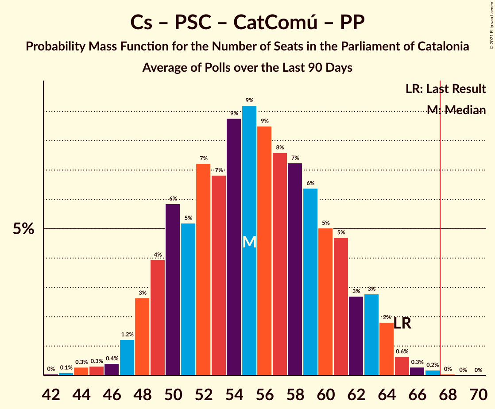

# Poll Average

<a href="#voting-intentions">Voting Intentions</a> | <a href="#seats">Seats</a> | <a href="#coalitions">Coalitions</a> | <a href="#technical-information">Technical Information</a>

## Summary

The table below lists the polls on which the average is based. They are the most recent polls (less than 90 days old) registered and analyzed so far.

| Period     | Polling firm/Commissioner(s) | Cs | JxCAT | ERC | PSC | CatComú | CUP | PP | Vox |
|:----------:|:----------------------------:|:--:|:--:|:--:|:--:|:--:|:--:|:--:|:--:|
| 21 December 2017 | General Election | 25.4%   36 | 21.7%   34 | 21.4%   32 | 13.9%   17 | 7.5%   8 | 4.5%   4 | 4.2%   4 | 0.0%   0 |
| N/A | Poll Average | 8–13%   9–18 | 16–23%   25–37 | 19–30%   28–45 | 16–22%   22–30 | 6–10%   5–12 | 5–8%   5–10 | 5–10%   5–13 | 3–7%   0–8 |
| [6–13 July 2020](2020-07-13-GESOP.html) | GESOP   El Periódico | 10–14%   13–18 | 17–21%   27–34 | 20–25%   30–37 | 16–20%   22–26 | 7–9%   7–11 | 4–7%   4–9 | 5–7%   5–9 | 4–7%   5–9 |
| [29 June–2 July 2020](2020-07-02-Feedback.html) | Feedback   El Nacional | 8–12%   9–16 | 15–21%   24–32 | 24–31%   36–46 | 17–23%   22–31 | 5–9%   5–10 | 5–8%   5–11 | 4–8%   4–9 | 4–7%   3–9 |
| [1 April–15 May 2020](2020-05-15-electoPanel.html) | electoPanel   electomania.es | 8–12%   10–14 | 19–24%   30–37 | 19–24%   27–35 | 17–22%   23–29 | 7–11%   8–12 | 5–8%   7–11 | 7–11%   9–14 | 3–5%   0–5 |
| 21 December 2017 | General Election | 25.4%   36 | 21.7%   34 | 21.4%   32 | 13.9%   17 | 7.5%   8 | 4.5%   4 | 4.2%   4 | 0.0%   0 |

Only polls for which at least the sample size has been published are included in the table above.

**Legend:**
+ **Top half of each row:** Voting intentions (95% confidence interval)
+ **Bottom half of each row:** Seat projections for the Parliament of Catalonia (95% confidence interval)
+ **Cs:** Ciutadans–Partido de la Ciudadanía
+ **JxCAT:** Junts pel Catalunya
+ **ERC:** Esquerra Republicana–Catalunya Sí
+ **PSC:** Partit dels Socialistes de Catalunya (PSC-PSOE)
+ **CatComú:** Catalunya en Comú–Podem
+ **CUP:** Candidatura d’Unitat Popular
+ **PP:** Partit Popular
+ **Vox:** Vox
+ **N/A (single party):** Party not included the published results
+ **N/A (entire row):** Calculation for this opinion poll not started yet

## Voting Intentions

### Confidence Intervals

| Party | Last Result | Median | 80% Confidence Interval | 90% Confidence Interval | 95% Confidence Interval | 99% Confidence Interval |
|:-----:|:-----------:|:------:|:-----------------------:|:-----------------------:|:-----------------------:|:-----------------------:|
| <a href="#ciutadans–partido-de-la-ciudadanía">Ciutadans–Partido de la Ciudadanía</a> | 25.4% | 10.3% | 8.6–12.4% |8.3–12.8% | 7.9–13.2% | 7.4–13.8% |
| <a href="#junts-pel-catalunya">Junts pel Catalunya</a> | 21.7% | 19.4% | 17.0–22.0% |16.4–22.6% | 15.9–23.1% | 15.0–24.1% |
| <a href="#esquerra-republicana–catalunya-sí">Esquerra Republicana–Catalunya Sí</a> | 21.4% | 22.8% | 20.4–28.3% |19.8–29.1% | 19.3–29.7% | 18.4–30.9% |
| <a href="#partit-dels-socialistes-de-catalunya-(psc-psoe)">Partit dels Socialistes de Catalunya (PSC-PSOE)</a> | 13.9% | 19.0% | 17.2–21.1% |16.8–21.7% | 16.5–22.1% | 15.8–23.1% |
| <a href="#catalunya-en-comú–podem">Catalunya en Comú–Podem</a> | 7.5% | 7.9% | 6.2–9.3% |5.8–9.7% | 5.5–10.1% | 4.9–10.8% |
| <a href="#candidatura-d’unitat-popular">Candidatura d’Unitat Popular</a> | 4.5% | 6.1% | 5.0–7.3% |4.8–7.7% | 4.6–8.0% | 4.2–8.6% |
| <a href="#partit-popular">Partit Popular</a> | 4.2% | 6.5% | 5.2–9.2% |4.9–9.7% | 4.7–10.1% | 4.2–10.8% |
| <a href="#vox">Vox</a> | 0.0% | 4.9% | 3.3–6.1% |3.0–6.4% | 2.8–6.6% | 2.4–7.2% |

### Ciutadans–Partido de la Ciudadanía

*For a full overview of the results for this party, see the [Ciutadans–Partido de la Ciudadanía](party-ciutadans–partidodelaciudadanía.html) page.*

| Voting Intentions | Probability | Accumulated | Special Marks |
|:-----------------:|:-----------:|:-----------:|:-------------:|
| 5.5–6.5% | 0% | 100% |  |
| 6.5–7.5% | 0.8% | 100% |  |
| 7.5–8.5% | 8% | 99.1% |  |
| 8.5–9.5% | 23% | 91% |  |
| 9.5–10.5% | 24% | 68% | Median |
| 10.5–11.5% | 19% | 44% |  |
| 11.5–12.5% | 16% | 25% |  |
| 12.5–13.5% | 7% | 8% |  |
| 13.5–14.5% | 1.0% | 1.1% |  |
| 14.5–15.5% | 0.1% | 0.1% |  |
| 15.5–16.5% | 0% | 0% |  |
| 16.5–17.5% | 0% | 0% |  |
| 17.5–18.5% | 0% | 0% |  |
| 18.5–19.5% | 0% | 0% |  |
| 19.5–20.5% | 0% | 0% |  |
| 20.5–21.5% | 0% | 0% |  |
| 21.5–22.5% | 0% | 0% |  |
| 22.5–23.5% | 0% | 0% |  |
| 23.5–24.5% | 0% | 0% |  |
| 24.5–25.5% | 0% | 0% | Last Result |

### Junts pel Catalunya

*For a full overview of the results for this party, see the [Junts pel Catalunya](party-juntspelcatalunya.html) page.*

| Voting Intentions | Probability | Accumulated | Special Marks |
|:-----------------:|:-----------:|:-----------:|:-------------:|
| 12.5–13.5% | 0% | 100% |  |
| 13.5–14.5% | 0.2% | 100% |  |
| 14.5–15.5% | 1.2% | 99.8% |  |
| 15.5–16.5% | 4% | 98.6% |  |
| 16.5–17.5% | 10% | 94% |  |
| 17.5–18.5% | 16% | 85% |  |
| 18.5–19.5% | 21% | 68% | Median |
| 19.5–20.5% | 19% | 47% |  |
| 20.5–21.5% | 14% | 28% |  |
| 21.5–22.5% | 9% | 14% | Last Result |
| 22.5–23.5% | 4% | 5% |  |
| 23.5–24.5% | 1.1% | 1.4% |  |
| 24.5–25.5% | 0.2% | 0.2% |  |
| 25.5–26.5% | 0% | 0% |  |

### Esquerra Republicana–Catalunya Sí

*For a full overview of the results for this party, see the [Esquerra Republicana–Catalunya Sí](party-esquerrarepublicana–catalunyasí.html) page.*

| Voting Intentions | Probability | Accumulated | Special Marks |
|:-----------------:|:-----------:|:-----------:|:-------------:|
| 16.5–17.5% | 0.1% | 100% |  |
| 17.5–18.5% | 0.6% | 99.9% |  |
| 18.5–19.5% | 3% | 99.4% |  |
| 19.5–20.5% | 8% | 96% |  |
| 20.5–21.5% | 15% | 88% | Last Result |
| 21.5–22.5% | 19% | 73% |  |
| 22.5–23.5% | 14% | 54% | Median |
| 23.5–24.5% | 7% | 40% |  |
| 24.5–25.5% | 4% | 34% |  |
| 25.5–26.5% | 6% | 30% |  |
| 26.5–27.5% | 8% | 24% |  |
| 27.5–28.5% | 8% | 15% |  |
| 28.5–29.5% | 5% | 8% |  |
| 29.5–30.5% | 2% | 3% |  |
| 30.5–31.5% | 0.7% | 0.9% |  |
| 31.5–32.5% | 0.2% | 0.2% |  |
| 32.5–33.5% | 0% | 0% |  |

### Partit dels Socialistes de Catalunya (PSC-PSOE)

*For a full overview of the results for this party, see the [Partit dels Socialistes de Catalunya (PSC-PSOE)](party-partitdelssocialistesdecatalunyapsc-psoe.html) page.*

| Voting Intentions | Probability | Accumulated | Special Marks |
|:-----------------:|:-----------:|:-----------:|:-------------:|
| 13.5–14.5% | 0% | 100% | Last Result |
| 14.5–15.5% | 0.2% | 100% |  |
| 15.5–16.5% | 3% | 99.8% |  |
| 16.5–17.5% | 12% | 97% |  |
| 17.5–18.5% | 23% | 85% |  |
| 18.5–19.5% | 25% | 63% | Median |
| 19.5–20.5% | 20% | 37% |  |
| 20.5–21.5% | 12% | 17% |  |
| 21.5–22.5% | 4% | 6% |  |
| 22.5–23.5% | 1.1% | 1.3% |  |
| 23.5–24.5% | 0.2% | 0.2% |  |
| 24.5–25.5% | 0% | 0% |  |

### Catalunya en Comú–Podem

*For a full overview of the results for this party, see the [Catalunya en Comú–Podem](party-catalunyaencomú–podem.html) page.*

| Voting Intentions | Probability | Accumulated | Special Marks |
|:-----------------:|:-----------:|:-----------:|:-------------:|
| 2.5–3.5% | 0% | 100% |  |
| 3.5–4.5% | 0.1% | 100% |  |
| 4.5–5.5% | 3% | 99.9% |  |
| 5.5–6.5% | 12% | 97% |  |
| 6.5–7.5% | 24% | 85% | Last Result |
| 7.5–8.5% | 33% | 61% | Median |
| 8.5–9.5% | 20% | 27% |  |
| 9.5–10.5% | 6% | 7% |  |
| 10.5–11.5% | 0.9% | 1.0% |  |
| 11.5–12.5% | 0.1% | 0.1% |  |
| 12.5–13.5% | 0% | 0% |  |

### Candidatura d’Unitat Popular

*For a full overview of the results for this party, see the [Candidatura d’Unitat Popular](party-candidaturad’unitatpopular.html) page.*

| Voting Intentions | Probability | Accumulated | Special Marks |
|:-----------------:|:-----------:|:-----------:|:-------------:|
| 2.5–3.5% | 0% | 100% |  |
| 3.5–4.5% | 2% | 100% | Last Result |
| 4.5–5.5% | 25% | 98% |  |
| 5.5–6.5% | 41% | 72% | Median |
| 6.5–7.5% | 24% | 31% |  |
| 7.5–8.5% | 6% | 7% |  |
| 8.5–9.5% | 0.6% | 0.6% |  |
| 9.5–10.5% | 0% | 0% |  |

### Partit Popular

*For a full overview of the results for this party, see the [Partit Popular](party-partitpopular.html) page.*

| Voting Intentions | Probability | Accumulated | Special Marks |
|:-----------------:|:-----------:|:-----------:|:-------------:|
| 2.5–3.5% | 0% | 100% |  |
| 3.5–4.5% | 2% | 100% | Last Result |
| 4.5–5.5% | 16% | 98% |  |
| 5.5–6.5% | 34% | 82% | Median |
| 6.5–7.5% | 16% | 48% |  |
| 7.5–8.5% | 12% | 32% |  |
| 8.5–9.5% | 13% | 20% |  |
| 9.5–10.5% | 5% | 6% |  |
| 10.5–11.5% | 0.9% | 1.0% |  |
| 11.5–12.5% | 0.1% | 0.1% |  |
| 12.5–13.5% | 0% | 0% |  |

### Vox

*For a full overview of the results for this party, see the [Vox](party-vox.html) page.*

| Voting Intentions | Probability | Accumulated | Special Marks |
|:-----------------:|:-----------:|:-----------:|:-------------:|
| 0.0–0.5% | 0% | 100% | Last Result |
| 0.5–1.5% | 0% | 100% |  |
| 1.5–2.5% | 0.9% | 100% |  |
| 2.5–3.5% | 16% | 99.1% |  |
| 3.5–4.5% | 23% | 83% |  |
| 4.5–5.5% | 35% | 60% | Median |
| 5.5–6.5% | 22% | 26% |  |
| 6.5–7.5% | 3% | 3% |  |
| 7.5–8.5% | 0.2% | 0.2% |  |
| 8.5–9.5% | 0% | 0% |  |

## Seats

### Confidence Intervals

| Party | Last Result | Median | 80% Confidence Interval | 90% Confidence Interval | 95% Confidence Interval | 99% Confidence Interval |
|:-----:|:-----------:|:------:|:-----------------------:|:-----------------------:|:-----------------------:|:-----------------------:|
| <a href="#ciutadans–partido-de-la-ciudadanía">Ciutadans–Partido de la Ciudadanía</a> | 36 | 13 | 11–16 |10–18 | 9–18 | 8–19 |
| <a href="#junts-pel-catalunya">Junts pel Catalunya</a> | 34 | 31 | 26–35 |25–36 | 25–37 | 23–38 |
| <a href="#esquerra-republicana–catalunya-sí">Esquerra Republicana–Catalunya Sí</a> | 32 | 34 | 30–42 |29–44 | 28–45 | 27–47 |
| <a href="#partit-dels-socialistes-de-catalunya-(psc-psoe)">Partit dels Socialistes de Catalunya (PSC-PSOE)</a> | 17 | 25 | 24–28 |23–29 | 22–30 | 21–31 |
| <a href="#catalunya-en-comú–podem">Catalunya en Comú–Podem</a> | 8 | 9 | 6–11 |5–11 | 5–12 | 4–13 |
| <a href="#candidatura-d’unitat-popular">Candidatura d’Unitat Popular</a> | 4 | 8 | 7–9 |6–10 | 5–10 | 4–11 |
| <a href="#partit-popular">Partit Popular</a> | 4 | 8 | 6–12 |5–12 | 5–13 | 3–15 |
| <a href="#vox">Vox</a> | 0 | 5 | 2–7 |2–7 | 0–8 | 0–9 |

### Ciutadans–Partido de la Ciudadanía

*For a full overview of the results for this party, see the [Ciutadans–Partido de la Ciudadanía](party-ciutadans–partidodelaciudadanía.html) page.*

| Number of Seats | Probability | Accumulated | Special Marks |
|:---------------:|:-----------:|:-----------:|:-------------:|
| 8 | 0.6% | 100% |  |
| 9 | 3% | 99.4% |  |
| 10 | 3% | 96% |  |
| 11 | 5% | 93% |  |
| 12 | 21% | 89% |  |
| 13 | 26% | 68% | Median |
| 14 | 14% | 42% |  |
| 15 | 4% | 28% |  |
| 16 | 14% | 24% |  |
| 17 | 3% | 9% |  |
| 18 | 5% | 6% |  |
| 19 | 0.8% | 0.8% |  |
| 20 | 0% | 0% |  |
| 21 | 0% | 0% |  |
| 22 | 0% | 0% |  |
| 23 | 0% | 0% |  |
| 24 | 0% | 0% |  |
| 25 | 0% | 0% |  |
| 26 | 0% | 0% |  |
| 27 | 0% | 0% |  |
| 28 | 0% | 0% |  |
| 29 | 0% | 0% |  |
| 30 | 0% | 0% |  |
| 31 | 0% | 0% |  |
| 32 | 0% | 0% |  |
| 33 | 0% | 0% |  |
| 34 | 0% | 0% |  |
| 35 | 0% | 0% |  |
| 36 | 0% | 0% | Last Result |

### Junts pel Catalunya

*For a full overview of the results for this party, see the [Junts pel Catalunya](party-juntspelcatalunya.html) page.*

| Number of Seats | Probability | Accumulated | Special Marks |
|:---------------:|:-----------:|:-----------:|:-------------:|
| 21 | 0.1% | 100% |  |
| 22 | 0.2% | 99.9% |  |
| 23 | 0.4% | 99.7% |  |
| 24 | 0.7% | 99.3% |  |
| 25 | 4% | 98.6% |  |
| 26 | 10% | 95% |  |
| 27 | 5% | 85% |  |
| 28 | 6% | 80% |  |
| 29 | 7% | 74% |  |
| 30 | 7% | 67% |  |
| 31 | 25% | 60% | Median |
| 32 | 12% | 35% |  |
| 33 | 8% | 23% |  |
| 34 | 4% | 14% | Last Result |
| 35 | 4% | 10% |  |
| 36 | 2% | 6% |  |
| 37 | 3% | 4% |  |
| 38 | 0.5% | 0.5% |  |
| 39 | 0% | 0.1% |  |
| 40 | 0% | 0% |  |

### Esquerra Republicana–Catalunya Sí

*For a full overview of the results for this party, see the [Esquerra Republicana–Catalunya Sí](party-esquerrarepublicana–catalunyasí.html) page.*

| Number of Seats | Probability | Accumulated | Special Marks |
|:---------------:|:-----------:|:-----------:|:-------------:|
| 26 | 0.2% | 100% |  |
| 27 | 0.7% | 99.7% |  |
| 28 | 2% | 99.0% |  |
| 29 | 5% | 97% |  |
| 30 | 6% | 92% |  |
| 31 | 13% | 86% |  |
| 32 | 6% | 73% | Last Result |
| 33 | 11% | 66% |  |
| 34 | 7% | 55% | Median |
| 35 | 10% | 48% |  |
| 36 | 5% | 38% |  |
| 37 | 3% | 34% |  |
| 38 | 3% | 31% |  |
| 39 | 4% | 28% |  |
| 40 | 6% | 24% |  |
| 41 | 5% | 19% |  |
| 42 | 6% | 14% |  |
| 43 | 2% | 8% |  |
| 44 | 3% | 5% |  |
| 45 | 0.9% | 3% |  |
| 46 | 0.9% | 2% |  |
| 47 | 0.5% | 0.7% |  |
| 48 | 0.2% | 0.2% |  |
| 49 | 0% | 0.1% |  |
| 50 | 0% | 0% |  |

### Partit dels Socialistes de Catalunya (PSC-PSOE)

*For a full overview of the results for this party, see the [Partit dels Socialistes de Catalunya (PSC-PSOE)](party-partitdelssocialistesdecatalunyapsc-psoe.html) page.*

| Number of Seats | Probability | Accumulated | Special Marks |
|:---------------:|:-----------:|:-----------:|:-------------:|
| 17 | 0% | 100% | Last Result |
| 18 | 0% | 100% |  |
| 19 | 0% | 100% |  |
| 20 | 0.4% | 100% |  |
| 21 | 0.7% | 99.6% |  |
| 22 | 3% | 98.9% |  |
| 23 | 6% | 96% |  |
| 24 | 21% | 90% |  |
| 25 | 25% | 69% | Median |
| 26 | 23% | 43% |  |
| 27 | 7% | 20% |  |
| 28 | 6% | 13% |  |
| 29 | 3% | 7% |  |
| 30 | 3% | 5% |  |
| 31 | 1.4% | 2% |  |
| 32 | 0.2% | 0.2% |  |
| 33 | 0% | 0.1% |  |
| 34 | 0% | 0% |  |

### Catalunya en Comú–Podem

*For a full overview of the results for this party, see the [Catalunya en Comú–Podem](party-catalunyaencomú–podem.html) page.*

| Number of Seats | Probability | Accumulated | Special Marks |
|:---------------:|:-----------:|:-----------:|:-------------:|
| 4 | 0.6% | 100% |  |
| 5 | 5% | 99.4% |  |
| 6 | 5% | 94% |  |
| 7 | 11% | 89% |  |
| 8 | 23% | 78% | Last Result |
| 9 | 17% | 55% | Median |
| 10 | 14% | 38% |  |
| 11 | 21% | 24% |  |
| 12 | 2% | 3% |  |
| 13 | 0.5% | 0.8% |  |
| 14 | 0.2% | 0.3% |  |
| 15 | 0% | 0% |  |

### Candidatura d’Unitat Popular

*For a full overview of the results for this party, see the [Candidatura d’Unitat Popular](party-candidaturad’unitatpopular.html) page.*

| Number of Seats | Probability | Accumulated | Special Marks |
|:---------------:|:-----------:|:-----------:|:-------------:|
| 4 | 2% | 100% | Last Result |
| 5 | 1.1% | 98% |  |
| 6 | 5% | 97% |  |
| 7 | 18% | 92% |  |
| 8 | 52% | 74% | Median |
| 9 | 15% | 22% |  |
| 10 | 5% | 7% |  |
| 11 | 2% | 2% |  |
| 12 | 0.1% | 0.1% |  |
| 13 | 0% | 0% |  |

### Partit Popular

*For a full overview of the results for this party, see the [Partit Popular](party-partitpopular.html) page.*

| Number of Seats | Probability | Accumulated | Special Marks |
|:---------------:|:-----------:|:-----------:|:-------------:|
| 3 | 0.7% | 100% |  |
| 4 | 0.2% | 99.3% | Last Result |
| 5 | 8% | 99.1% |  |
| 6 | 5% | 91% |  |
| 7 | 33% | 86% |  |
| 8 | 6% | 53% | Median |
| 9 | 13% | 47% |  |
| 10 | 12% | 34% |  |
| 11 | 4% | 22% |  |
| 12 | 14% | 18% |  |
| 13 | 3% | 5% |  |
| 14 | 0.9% | 1.5% |  |
| 15 | 0.5% | 0.5% |  |
| 16 | 0% | 0% |  |

### Vox

*For a full overview of the results for this party, see the [Vox](party-vox.html) page.*

| Number of Seats | Probability | Accumulated | Special Marks |
|:---------------:|:-----------:|:-----------:|:-------------:|
| 0 | 3% | 100% | Last Result |
| 1 | 0% | 97% |  |
| 2 | 8% | 97% |  |
| 3 | 20% | 89% |  |
| 4 | 3% | 69% |  |
| 5 | 24% | 66% | Median |
| 6 | 9% | 42% |  |
| 7 | 29% | 33% |  |
| 8 | 2% | 4% |  |
| 9 | 2% | 2% |  |
| 10 | 0.2% | 0.2% |  |
| 11 | 0% | 0% |  |

## Coalitions

### Confidence Intervals

| Coalition | Last Result | Median | Majority? | 80% Confidence Interval | 90% Confidence Interval | 95% Confidence Interval | 99% Confidence Interval |
|:---------:|:-----------:|:------:|:---------:|:-----------------------:|:-----------------------:|:-----------------------:|:-----------------------:|
| Junts pel Catalunya – Esquerra Republicana–Catalunya Sí – Candidatura d’Unitat Popular | 70 | 73 | 99.0% | 70–78 | 69–80 | 68–81 | 67–83 |
| Junts pel Catalunya – Esquerra Republicana–Catalunya Sí – Catalunya en Comú–Podem | 74 | 74 | 99.9% | 72–78 | 71–79 | 70–80 | 68–82 |
| Esquerra Republicana–Catalunya Sí – Partit dels Socialistes de Catalunya (PSC-PSOE) – Catalunya en Comú–Podem | 57 | 68 | 59% | 65–76 | 64–77 | 63–79 | 62–80 |
| Junts pel Catalunya – Esquerra Republicana–Catalunya Sí | 66 | 65 | 25% | 62–70 | 62–72 | 61–73 | 59–75 |
| Ciutadans–Partido de la Ciudadanía – Partit dels Socialistes de Catalunya (PSC-PSOE) – Catalunya en Comú–Podem – Partit Popular | 65 | 57 | 0% | 51–61 | 50–62 | 49–63 | 47–64 |
| Ciutadans–Partido de la Ciudadanía – Partit dels Socialistes de Catalunya (PSC-PSOE) – Partit Popular – Vox | 57 | 53 | 0% | 49–56 | 48–57 | 47–58 | 45–59 |
| Ciutadans–Partido de la Ciudadanía – Partit dels Socialistes de Catalunya (PSC-PSOE) – Partit Popular | 57 | 48 | 0% | 44–51 | 43–52 | 41–52 | 40–54 |
| Esquerra Republicana–Catalunya Sí – Catalunya en Comú–Podem | 40 | 43 | 0% | 39–49 | 39–51 | 38–52 | 36–54 |

### Junts pel Catalunya – Esquerra Republicana–Catalunya Sí – Candidatura d’Unitat Popular

| Number of Seats | Probability | Accumulated | Special Marks |
|:---------------:|:-----------:|:-----------:|:-------------:|
| 65 | 0.1% | 100% |  |
| 66 | 0.3% | 99.9% |  |
| 67 | 0.6% | 99.6% |  |
| 68 | 2% | 99.0% | Majority |
| 69 | 4% | 97% |  |
| 70 | 11% | 93% | Last Result |
| 71 | 9% | 82% |  |
| 72 | 12% | 73% |  |
| 73 | 14% | 61% | Median |
| 74 | 12% | 47% |  |
| 75 | 11% | 35% |  |
| 76 | 6% | 24% |  |
| 77 | 4% | 18% |  |
| 78 | 5% | 14% |  |
| 79 | 3% | 9% |  |
| 80 | 2% | 5% |  |
| 81 | 2% | 3% |  |
| 82 | 0.9% | 2% |  |
| 83 | 0.4% | 0.6% |  |
| 84 | 0.2% | 0.3% |  |
| 85 | 0.1% | 0.1% |  |
| 86 | 0% | 0% |  |

### Junts pel Catalunya – Esquerra Republicana–Catalunya Sí – Catalunya en Comú–Podem

| Number of Seats | Probability | Accumulated | Special Marks |
|:---------------:|:-----------:|:-----------:|:-------------:|
| 66 | 0% | 100% |  |
| 67 | 0.1% | 99.9% |  |
| 68 | 0.5% | 99.9% | Majority |
| 69 | 1.5% | 99.4% |  |
| 70 | 3% | 98% |  |
| 71 | 4% | 95% |  |
| 72 | 11% | 92% |  |
| 73 | 16% | 80% |  |
| 74 | 14% | 64% | Last Result, Median |
| 75 | 17% | 50% |  |
| 76 | 13% | 32% |  |
| 77 | 8% | 19% |  |
| 78 | 5% | 11% |  |
| 79 | 3% | 7% |  |
| 80 | 2% | 4% |  |
| 81 | 0.7% | 1.4% |  |
| 82 | 0.3% | 0.7% |  |
| 83 | 0.2% | 0.3% |  |
| 84 | 0.1% | 0.1% |  |
| 85 | 0% | 0% |  |

### Esquerra Republicana–Catalunya Sí – Partit dels Socialistes de Catalunya (PSC-PSOE) – Catalunya en Comú–Podem

| Number of Seats | Probability | Accumulated | Special Marks |
|:---------------:|:-----------:|:-----------:|:-------------:|
| 57 | 0% | 100% | Last Result |
| 58 | 0% | 100% |  |
| 59 | 0% | 100% |  |
| 60 | 0.1% | 100% |  |
| 61 | 0.2% | 99.9% |  |
| 62 | 1.2% | 99.7% |  |
| 63 | 2% | 98.5% |  |
| 64 | 5% | 97% |  |
| 65 | 8% | 92% |  |
| 66 | 12% | 84% |  |
| 67 | 13% | 73% |  |
| 68 | 11% | 59% | Median, Majority |
| 69 | 7% | 49% |  |
| 70 | 5% | 42% |  |
| 71 | 8% | 37% |  |
| 72 | 4% | 29% |  |
| 73 | 5% | 25% |  |
| 74 | 5% | 20% |  |
| 75 | 4% | 14% |  |
| 76 | 4% | 11% |  |
| 77 | 2% | 7% |  |
| 78 | 2% | 5% |  |
| 79 | 1.2% | 3% |  |
| 80 | 0.9% | 1.4% |  |
| 81 | 0.3% | 0.5% |  |
| 82 | 0.1% | 0.1% |  |
| 83 | 0% | 0.1% |  |
| 84 | 0% | 0% |  |

### Junts pel Catalunya – Esquerra Republicana–Catalunya Sí

| Number of Seats | Probability | Accumulated | Special Marks |
|:---------------:|:-----------:|:-----------:|:-------------:|
| 58 | 0.2% | 100% |  |
| 59 | 0.4% | 99.8% |  |
| 60 | 1.4% | 99.4% |  |
| 61 | 2% | 98% |  |
| 62 | 12% | 96% |  |
| 63 | 8% | 84% |  |
| 64 | 15% | 76% |  |
| 65 | 12% | 61% | Median |
| 66 | 13% | 49% | Last Result |
| 67 | 11% | 36% |  |
| 68 | 8% | 25% | Majority |
| 69 | 5% | 17% |  |
| 70 | 4% | 13% |  |
| 71 | 3% | 9% |  |
| 72 | 2% | 5% |  |
| 73 | 2% | 3% |  |
| 74 | 0.6% | 1.3% |  |
| 75 | 0.4% | 0.7% |  |
| 76 | 0.2% | 0.3% |  |
| 77 | 0.1% | 0.1% |  |
| 78 | 0% | 0% |  |

### Ciutadans–Partido de la Ciudadanía – Partit dels Socialistes de Catalunya (PSC-PSOE) – Catalunya en Comú–Podem – Partit Popular

| Number of Seats | Probability | Accumulated | Special Marks |
|:---------------:|:-----------:|:-----------:|:-------------:|
| 44 | 0% | 100% |  |
| 45 | 0.1% | 99.9% |  |
| 46 | 0.3% | 99.9% |  |
| 47 | 0.7% | 99.5% |  |
| 48 | 1.2% | 98.8% |  |
| 49 | 2% | 98% |  |
| 50 | 4% | 95% |  |
| 51 | 3% | 92% |  |
| 52 | 5% | 89% |  |
| 53 | 5% | 83% |  |
| 54 | 9% | 78% |  |
| 55 | 7% | 70% | Median |
| 56 | 11% | 62% |  |
| 57 | 12% | 51% |  |
| 58 | 7% | 39% |  |
| 59 | 6% | 32% |  |
| 60 | 16% | 26% |  |
| 61 | 3% | 10% |  |
| 62 | 5% | 7% |  |
| 63 | 1.3% | 3% |  |
| 64 | 0.8% | 1.3% |  |
| 65 | 0.3% | 0.5% | Last Result |
| 66 | 0.2% | 0.2% |  |
| 67 | 0% | 0.1% |  |
| 68 | 0% | 0% | Majority |

### Ciutadans–Partido de la Ciudadanía – Partit dels Socialistes de Catalunya (PSC-PSOE) – Partit Popular – Vox

| Number of Seats | Probability | Accumulated | Special Marks |
|:---------------:|:-----------:|:-----------:|:-------------:|
| 43 | 0% | 100% |  |
| 44 | 0.2% | 99.9% |  |
| 45 | 0.4% | 99.8% |  |
| 46 | 1.0% | 99.3% |  |
| 47 | 2% | 98% |  |
| 48 | 2% | 96% |  |
| 49 | 6% | 94% |  |
| 50 | 7% | 88% |  |
| 51 | 16% | 82% | Median |
| 52 | 14% | 65% |  |
| 53 | 12% | 51% |  |
| 54 | 16% | 39% |  |
| 55 | 12% | 23% |  |
| 56 | 5% | 11% |  |
| 57 | 3% | 6% | Last Result |
| 58 | 2% | 3% |  |
| 59 | 0.7% | 0.9% |  |
| 60 | 0.2% | 0.2% |  |
| 61 | 0% | 0% |  |

### Ciutadans–Partido de la Ciudadanía – Partit dels Socialistes de Catalunya (PSC-PSOE) – Partit Popular

| Number of Seats | Probability | Accumulated | Special Marks |
|:---------------:|:-----------:|:-----------:|:-------------:|
| 38 | 0.1% | 100% |  |
| 39 | 0.3% | 99.9% |  |
| 40 | 0.7% | 99.6% |  |
| 41 | 1.4% | 98.9% |  |
| 42 | 2% | 97% |  |
| 43 | 4% | 95% |  |
| 44 | 5% | 91% |  |
| 45 | 8% | 86% |  |
| 46 | 11% | 78% | Median |
| 47 | 12% | 68% |  |
| 48 | 17% | 56% |  |
| 49 | 17% | 39% |  |
| 50 | 10% | 23% |  |
| 51 | 7% | 13% |  |
| 52 | 4% | 6% |  |
| 53 | 1.2% | 2% |  |
| 54 | 0.4% | 0.7% |  |
| 55 | 0.2% | 0.3% |  |
| 56 | 0.1% | 0.2% |  |
| 57 | 0% | 0% | Last Result |

### Esquerra Republicana–Catalunya Sí – Catalunya en Comú–Podem

| Number of Seats | Probability | Accumulated | Special Marks |
|:---------------:|:-----------:|:-----------:|:-------------:|
| 35 | 0.2% | 100% |  |
| 36 | 0.3% | 99.8% |  |
| 37 | 1.1% | 99.4% |  |
| 38 | 2% | 98% |  |
| 39 | 7% | 97% |  |
| 40 | 4% | 90% | Last Result |
| 41 | 9% | 86% |  |
| 42 | 17% | 77% |  |
| 43 | 12% | 59% | Median |
| 44 | 9% | 47% |  |
| 45 | 6% | 37% |  |
| 46 | 7% | 32% |  |
| 47 | 5% | 25% |  |
| 48 | 4% | 19% |  |
| 49 | 5% | 15% |  |
| 50 | 5% | 10% |  |
| 51 | 2% | 5% |  |
| 52 | 2% | 3% |  |
| 53 | 0.5% | 2% |  |
| 54 | 0.7% | 1.0% |  |
| 55 | 0.2% | 0.3% |  |
| 56 | 0.1% | 0.1% |  |
| 57 | 0% | 0% |  |

## Technical Information

+ **Number of polls included in this average:** 3
+ **Lowest number of simulations done in a poll included in this average:** 131,072
+ **Total number of simulations done in the polls included in this average:** 2,228,224
+ **Error estimate:** 1.46%
