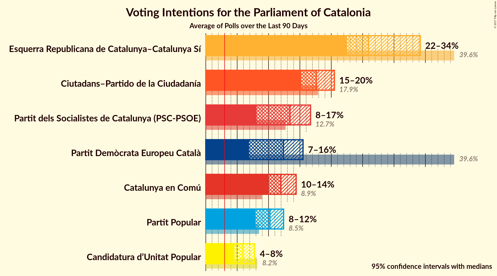
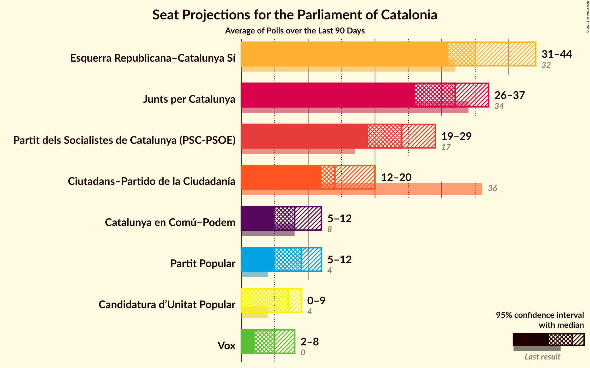
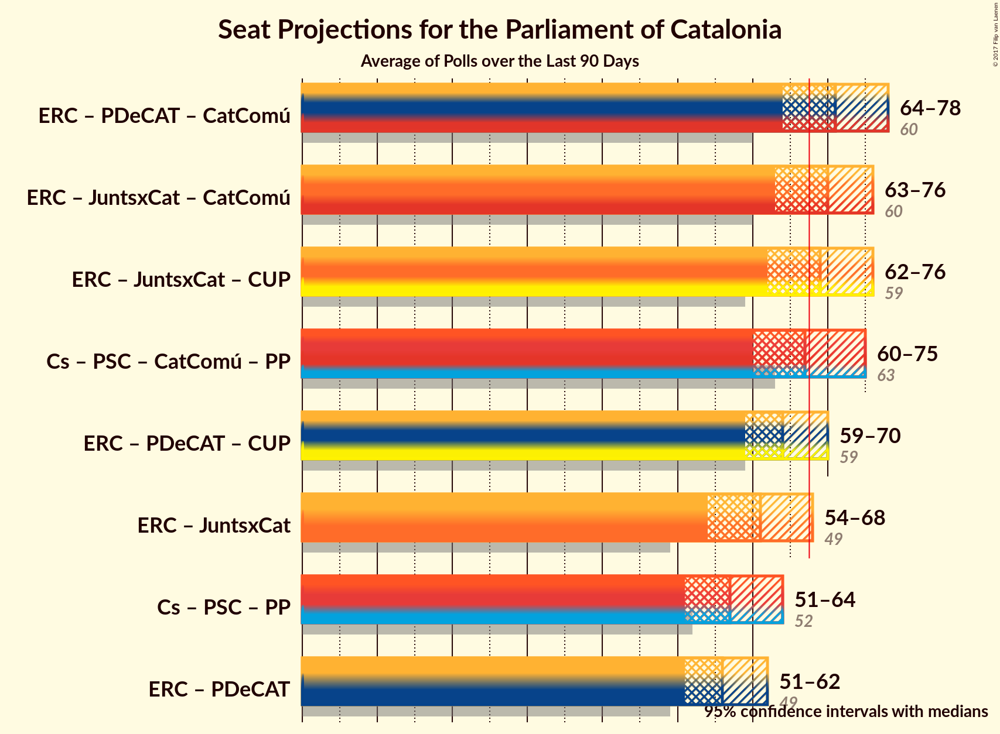

# Overview

The table below lists the most recent polls (less than 90 days old) registered and analyzed so far.

| Period     | Polling firm/Commissioner(s) | JxSí | PDeCAT | ERC | Cs | PSC | CatComú | PP | CUP |
|:----------:|:----------------------------:|:--:|:--:|:--:|:--:|:--:|:--:|:--:|:--:|
| 27 September 2015 | General Election | 39.6%   62 | 39.6%   29 | 39.6%   20 | 17.9%   25 | 12.7%   16 | 8.9%   11 | 8.5%   11 | 8.2%   10 |
| N/A | [Poll Average](average.html) | 37–43%   57–66 | 8–15%   11–23 | 23–33%   35–51 | 16–22%   21–31 | 11–17%   14–23 | 8–14%   8–17 | 7–12%   9–15 | 5–8%   5–10 |
| [30 October–3 November 2017](2017-11-03-NCReport.html) | NC Report   La Razón | N/A   N/A | 9–13%   12–19 | 23–30%   36–46 | 17–23%   23–31 | 11–16%   14–22 | 8–13%   9–16 | 9–13%   11–18 | 5–8%   5–10 |
| [30 October–3 November 2017](2017-11-03-GAD3.html) | GAD3   La Vanguardia | N/A   N/A | 9–12%   12–18 | 27–32%   40–50 | 18–23%   25–32 | 13–17%   16–23 | 7–10%   7–12 | 7–11%   9–13 | 5–8%   5–10 |
| [27–31 October 2017](2017-10-31-SocioMétrica.html) | SocioMétrica   El Español | N/A   N/A | 8–12%   11–18 | 28–34%   44–53 | 16–21%   21–29 | 10–14%   14–19 | 8–12%   9–15 | 7–11%   10–14 | 4–7%   4–9 |
| [16–29 October 2017](2017-10-29-GESOP.html) | GESOP   CEO | 37–43%   57–66 | N/A   N/A | N/A   N/A | 16–21%   21–28 | 12–16%   15–22 | 9–13%   9–15 | 7–10%   8–13 | 5–8%   5–10 |
| [23–26 October 2017](2017-10-26-SigmaDos.html) | Sigma Dos   El Mundo | N/A   N/A | 8–12%   11–17 | 24–29%   37–45 | 17–22%   24–31 | 13–17%   16–23 | 9–13%   11–17 | 7–11%   9–13 | 5–8%   6–10 |
| [12–15 September 2017](2017-09-15-Celeste-Tel.html) | Celeste-Tel   eldiario.es | N/A   N/A | 11–16%   17–24 | 22–28%   33–43 | 15–20%   19–27 | 12–17%   15–23 | 10–15%   12–18 | 8–12%   10–14 | 4–8%   4–9 |
| 27 September 2015 | General Election | 39.6%   62 | 39.6%   29 | 39.6%   20 | 17.9%   25 | 12.7%   16 | 8.9%   11 | 8.5%   11 | 8.2%   10 |

Only polls for which at least the sample size has been published are included in the table above.

**Legend:**
+ **Top half of each row:** Voting intentions (95% confidence interval)
+ **Bottom half of each row:** Seat projections for the Parliament of Catalonia (95% confidence interval)
+ **JxSí:** Junts pel Sí
+ **PDeCAT:** Partit Demòcrata Europeu Català
+ **ERC:** Esquerra Republicana de Catalunya–Catalunya Sí
+ **Cs:** Ciutadans–Partido de la Ciudadanía
+ **PSC:** Partit dels Socialistes de Catalunya (PSC-PSOE)
+ **CatComú:** Catalunya en Comú
+ **PP:** Partit Popular
+ **CUP:** Candidatura d’Unitat Popular
+ **N/A (single party):** Party not included the published results
+ **N/A (entire row):** Calculation for this opinion poll not started yet

