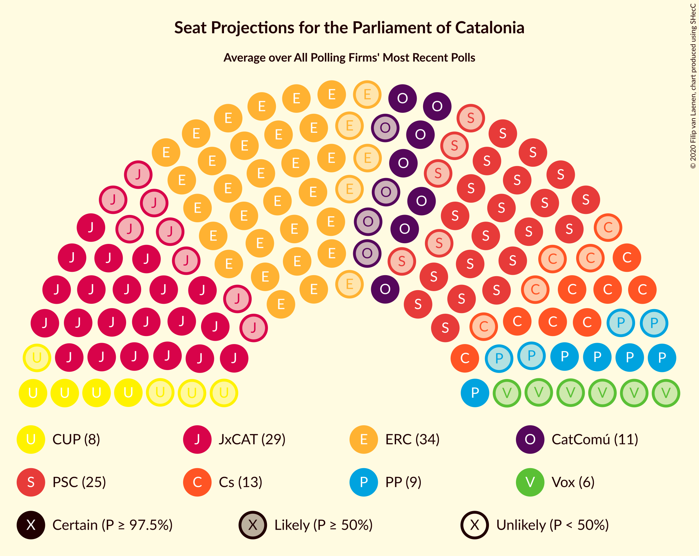

# Overview

The table below lists the most recent polls (less than 90 days old) registered and analyzed so far.

| Period     | Polling firm/Commissioner(s) | Cs | JxCAT | ERC | PSC | CatComú | CUP | PP | Vox |
|:----------:|:----------------------------:|:--:|:--:|:--:|:--:|:--:|:--:|:--:|:--:|
| 21 December 2017 | General Election | 25.4%   36 | 21.7%   34 | 21.4%   32 | 13.9%   17 | 7.5%   8 | 4.5%   4 | 4.2%   4 | 0.0%   0 |
| N/A | [Poll Average](average.html) | 6–14%   8–19 | 14–22%   23–34 | 19–27%   28–42 | 15–20%   20–28 | 6–12%   7–14 | 5–11%   5–16 | 4–10%   3–14 | 2–9%   0–12 |
| [14 November–5 December 2019](2019-12-05-GESOP.html) | GESOP   CEO | 10–14%   13–19 | 17–22%   26–34 | 23–28%   34–43 | 16–20%   21–28 | 9–12%   9–15 | 6–9%   8–12 | 3–6%   3–7 | 1–3%   0–2 |
| [27–30 November 2019](2019-11-30-electoPanel.html) | electoPanel   electomania.es | 6–9%   7–12 | 14–18%   22–29 | 20–24%   30–37 | 16–21%   23–28 | 7–10%   7–11 | 9–12%   11–17 | 7–9%   8–13 | 6–9%   7–12 |
| [18–22 November 2019](2019-11-22-NCReport.html) | NC Report   La Razón | 9–14%   12–19 | 17–22%   26–36 | 18–24%   28–36 | 14–20%   18–26 | 6–10%   6–11 | 4–8%   4–10 | 7–11%   9–15 | 5–8%   5–11 |
| 21 December 2017 | General Election | 25.4%   36 | 21.7%   34 | 21.4%   32 | 13.9%   17 | 7.5%   8 | 4.5%   4 | 4.2%   4 | 0.0%   0 |

Only polls for which at least the sample size has been published are included in the table above.

**Legend:**
+ **Top half of each row:** Voting intentions (95% confidence interval)
+ **Bottom half of each row:** Seat projections for the Parliament of Catalonia (95% confidence interval)
+ **Cs:** Ciutadans–Partido de la Ciudadanía
+ **JxCAT:** Junts pel Catalunya
+ **ERC:** Esquerra Republicana–Catalunya Sí
+ **PSC:** Partit dels Socialistes de Catalunya (PSC-PSOE)
+ **CatComú:** Catalunya en Comú–Podem
+ **CUP:** Candidatura d’Unitat Popular
+ **PP:** Partit Popular
+ **Vox:** Vox
+ **N/A (single party):** Party not included the published results
+ **N/A (entire row):** Calculation for this opinion poll not started yet

