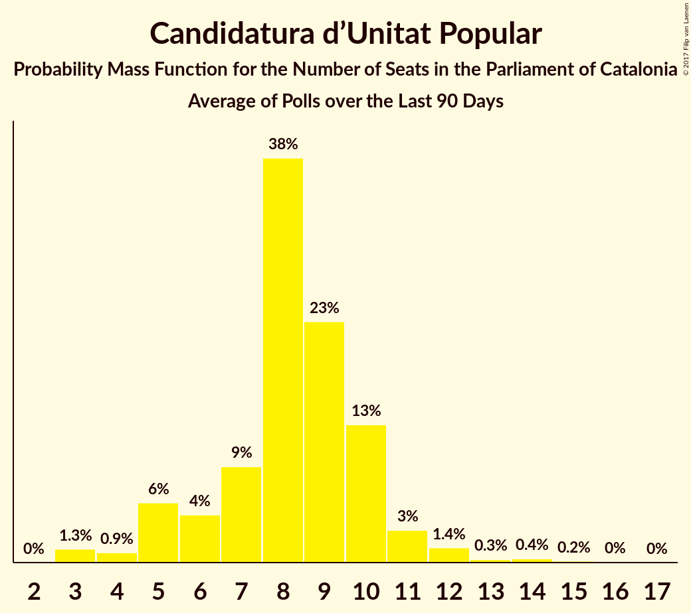

# Candidatura d’Unitat Popular

<a href="#voting-intentions">Voting Intentions</a> | <a href="#seats">Seats</a>

## Voting Intentions

Last result: **8.2%** (General Election of 27 September 2015)

### Confidence Intervals

| Period     | Polling firm/Commissioner(s) | Median | 80% Confidence Interval | 90% Confidence Interval | 95% Confidence Interval | 99% Confidence Interval |
|:----------:|:----------------:|:-----------:|:-----------------------:|:-----------------------:|:-----------------------:|:-----------------------:|
| N/A | [Poll Average](average.html) | 6.2% | 5.2–7.3% | 4.9–7.6% | 4.7–7.9% | 4.2–8.6% |
| [30 October–3 November 2017](2017-11-03-NCReport.html) | NC Report   La Razón | 6.3% | 5.3–7.7% | 5.0–8.0% | 4.8–8.4% | 4.3–9.1% |
| [30 October–3 November 2017](2017-11-03-GAD3.html) | GAD3   La Vanguardia | 6.3% | 5.4–7.4% | 5.2–7.7% | 5.0–8.0% | 4.6–8.6% |
| [27–31 October 2017](2017-10-31-SocioMétrica.html) | SocioMétrica   El Español | 5.7% | 4.9–6.8% | 4.6–7.1% | 4.4–7.3% | 4.1–7.9% |
| [16–29 October 2017](2017-10-29-GESOP.html) | GESOP   CEO | 6.2% | 5.3–7.3% | 5.0–7.6% | 4.8–7.8% | 4.5–8.4% |
| [23–26 October 2017](2017-10-26-SigmaDos.html) | Sigma Dos   El Mundo | 6.3% | 5.4–7.4% | 5.2–7.7% | 5.0–8.0% | 4.6–8.6% |
| [16–21 October 2017](2017-10-21-NCReport.html) | NC Report   La Razón | 5.6% | 4.8–6.6% | 4.5–7.0% | 4.3–7.2% | 4.0–7.7% |
| [16–19 October 2017](2017-10-19-GESOP.html) | GESOP   El Periódico | 7.8% | 6.7–9.1% | 6.3–9.5% | 6.1–9.8% | 5.6–10.5% |
| [4–9 October 2017](2017-10-09-SocioMétrica.html) | SocioMétrica   El Español | 6.2% | 5.3–7.5% | 5.0–7.8% | 4.8–8.2% | 4.3–8.8% |
| [19–22 September 2017](2017-09-22-NCReport.html) | NC Report   La Razón | 5.6% | 4.8–6.5% | 4.6–6.8% | 4.4–7.0% | 4.1–7.5% |
| [12–15 September 2017](2017-09-15-Celeste-Tel.html) | Celeste-Tel   eldiario.es | 5.9% | 4.9–7.1% | 4.7–7.4% | 4.5–7.7% | 4.0–8.4% |
| [28 August–1 September 2017](2017-09-01-SocioMétrica.html) | SocioMétrica   El Español | 6.9% | 5.8–8.2% | 5.5–8.6% | 5.2–9.0% | 4.7–9.7% |

### Probability Mass Function

The following table shows the probability mass function per percentage block of voting intentions for the [poll average](average.html) for Candidatura d’Unitat Popular.

| Voting Intentions | Probability | Accumulated | Special Marks |
|:-----------------:|:-----------:|:-----------:|:-------------:|
| 2.5–3.5% | 0% | 100% |  |
| 3.5–4.5% | 2% | 100% |  |
| 4.5–5.5% | 20% | 98% |  |
| 5.5–6.5% | 45% | 78% | Median |
| 6.5–7.5% | 27% | 33% |  |
| 7.5–8.5% | 6% | 6% | Last Result |
| 8.5–9.5% | 0.5% | 0.5% |  |
| 9.5–10.5% | 0% | 0% |  |

## Seats

Last result: **10** seats (General Election of 27 September 2015)

### Confidence Intervals

| Period     | Polling firm/Commissioner(s) | Median | 80% Confidence Interval | 90% Confidence Interval | 95% Confidence Interval | 99% Confidence Interval |
|:----------:|:----------------:|:------:|:-----------------------:|:-----------------------:|:-----------------------:|:-----------------------:|
| N/A | [Poll Average](average.html) | 8 | 6–9 | 5–9 | 5–10 | 3–10 |
| [30 October–3 November 2017](2017-11-03-NCReport.html) | NC Report   La Razón | 8 | 7–9 | 6–10 | 5–10 | 3–12 |
| [30 October–3 November 2017](2017-11-03-GAD3.html) | GAD3   La Vanguardia | 8 | 7–9 | 6–9 | 5–10 | 4–10 |
| [27–31 October 2017](2017-10-31-SocioMétrica.html) | SocioMétrica   El Español | 8 | 5–9 | 4–9 | 4–9 | 3–10 |
| [16–29 October 2017](2017-10-29-GESOP.html) | GESOP   CEO | 8 | 6–9 | 6–9 | 5–10 | 4–10 |
| [23–26 October 2017](2017-10-26-SigmaDos.html) | Sigma Dos   El Mundo | 8 | 7–9 | 7–10 | 6–10 | 5–10 |
| [16–21 October 2017](2017-10-21-NCReport.html) | NC Report   La Razón | 8 | 5–9 | 5–9 | 4–9 | 3–10 |
| [16–19 October 2017](2017-10-19-GESOP.html) | GESOP   El Periódico | 10 | 9–11 | 8–12 | 8–13 | 8–15 |
| [4–9 October 2017](2017-10-09-SocioMétrica.html) | SocioMétrica   El Español | 8 | 7–9 | 5–10 | 5–10 | 4–11 |
| [19–22 September 2017](2017-09-22-NCReport.html) | NC Report   La Razón | 8 | 5–8 | 5–9 | 4–9 | 3–9 |
| [12–15 September 2017](2017-09-15-Celeste-Tel.html) | Celeste-Tel   eldiario.es | 8 | 5–9 | 5–9 | 4–9 | 3–10 |
| [28 August–1 September 2017](2017-09-01-SocioMétrica.html) | SocioMétrica   El Español | 9 | 8–10 | 7–10 | 6–11 | 5–12 |

### Probability Mass Function

The following table shows the probability mass function per seat for the [poll average](average.html) for Candidatura d’Unitat Popular.

| Number of Seats | Probability | Accumulated | Special Marks |
|:---------------:|:-----------:|:-----------:|:-------------:|
| 3 | 0.9% | 100% |  |
| 4 | 1.3% | 99.1% |  |
| 5 | 5% | 98% |  |
| 6 | 5% | 93% |  |
| 7 | 8% | 88% |  |
| 8 | 49% | 80% | Median |
| 9 | 26% | 30% |  |
| 10 | 4% | 4% | Last Result |
| 11 | 0.1% | 0.3% |  |
| 12 | 0.1% | 0.1% |  |
| 13 | 0% | 0% |  |

