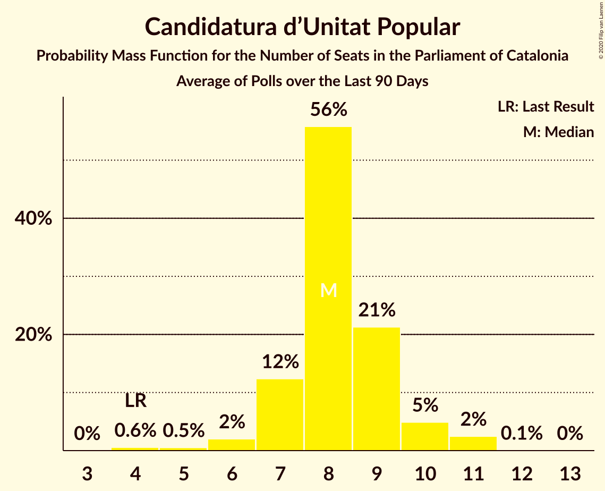

# Candidatura d’Unitat Popular

<a href="#voting-intentions">Voting Intentions</a> | <a href="#seats">Seats</a>

## Voting Intentions

Last result: **8.2%** (General Election of 27 September 2015)

### Confidence Intervals

| Period     | Polling firm/Commissioner(s) | Median | 80% Confidence Interval | 90% Confidence Interval | 95% Confidence Interval | 99% Confidence Interval |
|:----------:|:----------------:|:-----------:|:-----------------------:|:-----------------------:|:-----------------------:|:-----------------------:|
| N/A | [Poll Average](average.html) | 6.1% | 4.9–7.3% | 4.6–7.7% | 4.3–8.0% | 3.8–8.7% |
| [13–20 December 2017](2017-12-20-Feedback.html) | Feedback   The National | 6.5% | 5.6–7.6% | 5.3–7.9% | 5.1–8.2% | 4.7–8.8% |
| [12–19 December 2017](2017-12-19-Feedback.html) | Feedback   The National | 7.5% | 6.5–8.7% | 6.2–9.0% | 6.0–9.3% | 5.6–9.9% |
| [16–18 December 2017](2017-12-18-GESOP.html) | GESOP   El Periòdic | 4.9% | 4.0–6.0% | 3.8–6.3% | 3.6–6.6% | 3.2–7.2% |
| [11–18 December 2017](2017-12-18-Feedback.html) | Feedback   The National | 7.6% | 6.6–8.8% | 6.3–9.1% | 6.1–9.4% | 5.7–10.0% |
| [15–17 December 2017](2017-12-17-GESOP.html) | GESOP   El Periòdic | 5.5% | 4.6–6.7% | 4.3–7.0% | 4.1–7.3% | 3.7–7.9% |
| [10–17 December 2017](2017-12-17-Feedback.html) | Feedback   The National | 8.1% | 7.1–9.3% | 6.8–9.7% | 6.6–10.0% | 6.1–10.6% |
| [12–16 December 2017](2017-12-16-Netquest.html) | Netquest   L’Indépendant | 6.9% | 5.9–8.1% | 5.6–8.4% | 5.4–8.7% | 5.0–9.4% |
| [14–16 December 2017](2017-12-16-GESOP.html) | GESOP   El Periòdic | 6.5% | 5.5–7.8% | 5.2–8.1% | 5.0–8.4% | 4.5–9.1% |
| [9–16 December 2017](2017-12-16-Feedback.html) | Feedback   The National | 8.5% | 7.5–9.7% | 7.2–10.1% | 6.9–10.4% | 6.4–11.0% |
| [13–15 December 2017](2017-12-15-GESOP.html) | GESOP   El Periódico | 6.1% | 5.2–7.4% | 4.9–7.7% | 4.7–8.0% | 4.2–8.6% |
| [11–15 December 2017](2017-12-15-GAD3.html) | GAD3   ABC | 5.5% | 4.8–6.3% | 4.6–6.6% | 4.5–6.8% | 4.1–7.2% |
| [8–15 December 2017](2017-12-15-Feedback.html) | Feedback   El Nacional | 8.3% | 7.3–9.5% | 7.0–9.9% | 6.7–10.2% | 6.3–10.8% |
| [11–14 December 2017](2017-12-14-TopPosition.html) | Top Position | 7.0% | 6.1–8.0% | 5.9–8.3% | 5.7–8.6% | 5.3–9.1% |
| [1–14 December 2017](2017-12-14-SocioMétrica.html) | SocioMétrica   El Español | 5.9% | 5.2–6.8% | 5.0–7.0% | 4.8–7.3% | 4.5–7.7% |
| [12–14 December 2017](2017-12-14-GESOP.html) | GESOP   El Periódico | 5.5% | 4.6–6.7% | 4.3–7.0% | 4.1–7.3% | 3.7–7.9% |
| [12–14 December 2017](2017-12-14-GAD3.html) | GAD3   ABC | 5.6% | 4.8–6.6% | 4.5–7.0% | 4.3–7.2% | 4.0–7.7% |
| [7–14 December 2017](2017-12-14-Feedback.html) | Feedback   El Nacional | 7.6% | 6.6–8.8% | 6.3–9.1% | 6.1–9.4% | 5.7–10.0% |
| [11–13 December 2017](2017-12-13-SigmaDos.html) | Sigma Dos   El Mundo | 6.4% | 5.7–7.3% | 5.4–7.5% | 5.3–7.7% | 4.9–8.2% |
| [4–13 December 2017](2017-12-13-NCReport.html) | NC Report   La Razón | 5.8% | 5.0–6.9% | 4.7–7.2% | 4.5–7.4% | 4.1–8.0% |
| [5–13 December 2017](2017-12-13-MyWord.html) | MyWord   Cadena SER | 5.1% | 4.3–6.1% | 4.1–6.4% | 3.9–6.6% | 3.5–7.1% |
| [4–13 December 2017](2017-12-13-Metroscopia.html) | Metroscopia   El País | 6.4% | 5.9–7.0% | 5.7–7.1% | 5.6–7.3% | 5.4–7.6% |
| [4–13 December 2017](2017-12-13-Infortécnica.html) | Infortécnica   Segre | 5.2% | 4.5–6.1% | 4.2–6.4% | 4.1–6.6% | 3.7–7.0% |
| [11–13 December 2017](2017-12-13-AM.html) | A+M   20minutos | 5.6% | 4.9–6.4% | 4.7–6.7% | 4.5–6.9% | 4.2–7.3% |
| [5–12 December 2017](2017-12-12-Feedback.html) | Feedback   El Nacional | 7.7% | 6.7–8.9% | 6.4–9.2% | 6.2–9.5% | 5.8–10.1% |
| [3–11 December 2017](2017-12-11-SocioMétrica.html) | SocioMétrica   El Español | 5.3% | 4.5–6.2% | 4.3–6.5% | 4.1–6.8% | 3.7–7.3% |
| [1–9 December 2017](2017-12-09-SocioMétrica.html) | SocioMétrica   El Español | 5.9% | 5.1–6.9% | 4.8–7.2% | 4.7–7.5% | 4.3–8.0% |
| [27 November–8 December 2017](2017-12-08-SocioMétrica.html) | SocioMétrica   El Español | 5.5% | 4.8–6.5% | 4.5–6.8% | 4.3–7.1% | 4.0–7.6% |
| [4–8 December 2017](2017-12-08-Feedback.html) | Feedback   El Nacional | 7.4% | 6.4–8.6% | 6.2–8.9% | 5.9–9.2% | 5.5–9.8% |
| [7 December 2017](2017-12-07-Infortécnica.html) | Infortécnica   Segre | 6.3% | 5.5–7.3% | 5.3–7.6% | 5.1–7.8% | 4.7–8.4% |
| [4–7 December 2017](2017-12-07-GAD3.html) | GAD3   La Vanguardia | 5.0% | 4.2–6.0% | 4.0–6.3% | 3.8–6.5% | 3.5–7.1% |
| [3–7 December 2017](2017-12-07-Feedback.html) | Feedback   El Nacional | 7.1% | 6.2–8.3% | 5.9–8.6% | 5.7–8.9% | 5.2–9.4% |
| [30 November–7 December 2017](2017-12-07-Celeste-Tel.html) | Celeste-Tel   eldiario.es | 6.6% | 5.6–7.9% | 5.3–8.3% | 5.1–8.6% | 4.6–9.2% |
| [1–5 December 2017](2017-12-05-Feedback.html) | Feedback   El Nacional | 6.4% | 5.5–7.5% | 5.3–7.8% | 5.0–8.1% | 4.6–8.7% |
| [29 November–2 December 2017](2017-12-02-GESOP.html) | GESOP   El Periódico | 6.0% | 5.0–7.2% | 4.8–7.6% | 4.6–7.9% | 4.1–8.5% |
| [27–30 November 2017](2017-11-30-SocioMétrica.html) | SocioMétrica   El Español | 6.0% | 5.0–7.2% | 4.8–7.6% | 4.6–7.9% | 4.1–8.5% |
| [23–27 November 2017](2017-11-27-IMOP.html) | IMOP Insights   CIS | 6.7% | 6.1–7.3% | 6.0–7.5% | 5.9–7.7% | 5.6–8.0% |
| [13–23 November 2017](2017-11-23-NCReport.html) | NC Report   La Razón | 5.8% | 4.8–7.1% | 4.5–7.4% | 4.3–7.7% | 3.8–8.4% |
| [13–23 November 2017](2017-11-23-AdviceStrategicConsultants.html) | Advice Strategic Consultants   El Confidencial | 6.1% | 5.4–6.9% | 5.3–7.1% | 5.1–7.3% | 4.8–7.6% |
| [20–22 November 2017](2017-11-22-Metroscopia.html) | Metroscopia   El País | 5.9% | 5.2–6.8% | 5.0–7.0% | 4.8–7.3% | 4.5–7.7% |
| [15–18 November 2017](2017-11-18-GESOP.html) | GESOP   El Periódico | 6.2% | 5.3–7.5% | 5.0–7.8% | 4.8–8.2% | 4.3–8.8% |
| [13–16 November 2017](2017-11-16-GAD3.html) | GAD3   ABC | 5.6% | 4.7–6.8% | 4.4–7.1% | 4.2–7.4% | 3.8–8.0% |
| [30 October–3 November 2017](2017-11-03-NCReport.html) | NC Report   La Razón | 6.3% | 5.3–7.7% | 5.0–8.0% | 4.8–8.4% | 4.3–9.1% |
| [30 October–3 November 2017](2017-11-03-GAD3.html) | GAD3   La Vanguardia | 6.3% | 5.4–7.4% | 5.2–7.7% | 5.0–8.0% | 4.6–8.6% |
| [27–31 October 2017](2017-10-31-SocioMétrica.html) | SocioMétrica   El Español | 5.7% | 4.9–6.8% | 4.6–7.1% | 4.4–7.3% | 4.1–7.9% |
| [16–29 October 2017](2017-10-29-GESOP.html) | GESOP   CEO | 6.2% | 5.3–7.3% | 5.0–7.6% | 4.8–7.8% | 4.5–8.4% |
| [23–26 October 2017](2017-10-26-SigmaDos.html) | Sigma Dos   El Mundo | 6.3% | 5.4–7.4% | 5.2–7.7% | 5.0–8.0% | 4.6–8.6% |
| [16–21 October 2017](2017-10-21-NCReport.html) | NC Report   La Razón | 5.6% | 4.8–6.6% | 4.5–7.0% | 4.3–7.2% | 4.0–7.7% |
| [16–19 October 2017](2017-10-19-GESOP.html) | GESOP   El Periódico | 7.8% | 6.7–9.1% | 6.3–9.5% | 6.1–9.8% | 5.6–10.5% |
| [4–9 October 2017](2017-10-09-SocioMétrica.html) | SocioMétrica   El Español | 6.2% | 5.3–7.5% | 5.0–7.8% | 4.8–8.2% | 4.3–8.8% |
| [19–22 September 2017](2017-09-22-NCReport.html) | NC Report   La Razón | 5.6% | 4.8–6.5% | 4.6–6.8% | 4.4–7.0% | 4.1–7.5% |
| [12–15 September 2017](2017-09-15-Celeste-Tel.html) | Celeste-Tel   eldiario.es | 5.9% | 4.9–7.1% | 4.7–7.4% | 4.5–7.7% | 4.0–8.4% |
| [28 August–1 September 2017](2017-09-01-SocioMétrica.html) | SocioMétrica   El Español | 6.9% | 5.8–8.2% | 5.5–8.6% | 5.2–9.0% | 4.7–9.7% |

### Probability Mass Function

The following table shows the probability mass function per percentage block of voting intentions for the [poll average](average.html) for Candidatura d’Unitat Popular.

| Voting Intentions | Probability | Accumulated | Special Marks |
|:-----------------:|:-----------:|:-----------:|:-------------:|
| 1.5–2.5% | 0% | 100% |  |
| 2.5–3.5% | 0.2% | 100% |  |
| 3.5–4.5% | 5% | 99.8% |  |
| 4.5–5.5% | 23% | 95% |  |
| 5.5–6.5% | 41% | 72% | Median |
| 6.5–7.5% | 25% | 31% |  |
| 7.5–8.5% | 5% | 6% | Last Result |
| 8.5–9.5% | 0.6% | 0.7% |  |
| 9.5–10.5% | 0% | 0% |  |

## Seats

Last result: **10** seats (General Election of 27 September 2015)

### Confidence Intervals

| Period     | Polling firm/Commissioner(s) | Median | 80% Confidence Interval | 90% Confidence Interval | 95% Confidence Interval | 99% Confidence Interval |
|:----------:|:----------------:|:------:|:-----------------------:|:-----------------------:|:-----------------------:|:-----------------------:|
| N/A | [Poll Average](average.html) | 8 | 5–9 | 4–10 | 3–10 | 3–11 |
| [13–20 December 2017](2017-12-20-Feedback.html) | Feedback   The National | 8 | 8–9 | 7–10 | 5–10 | 5–10 |
| [12–19 December 2017](2017-12-19-Feedback.html) | Feedback   The National | 9 | 8–10 | 8–11 | 8–12 | 8–12 |
| [16–18 December 2017](2017-12-18-GESOP.html) | GESOP   El Periòdic | 5 | 3–8 | 3–8 | 3–8 | 2–9 |
| [11–18 December 2017](2017-12-18-Feedback.html) | Feedback   The National | 9 | 8–10 | 8–11 | 8–12 | 8–12 |
| [15–17 December 2017](2017-12-17-GESOP.html) | GESOP   El Periòdic | 8 | 4–8 | 3–9 | 3–9 | 3–10 |
| [10–17 December 2017](2017-12-17-Feedback.html) | Feedback   The National | 10 | 9–12 | 9–12 | 8–12 | 8–15 |
| [12–16 December 2017](2017-12-16-Netquest.html) | Netquest   L’Indépendant | 9 | 8–10 | 8–10 | 7–11 | 5–12 |
| [14–16 December 2017](2017-12-16-GESOP.html) | GESOP   El Periòdic | 8 | 7–9 | 6–10 | 5–10 | 4–11 |
| [9–16 December 2017](2017-12-16-Feedback.html) | Feedback   The National | 10 | 9–12 | 9–12 | 9–13 | 8–15 |
| [13–15 December 2017](2017-12-15-GESOP.html) | GESOP   El Periódico | 8 | 6–9 | 5–9 | 5–10 | 3–10 |
| [11–15 December 2017](2017-12-15-GAD3.html) | GAD3   ABC | 7 | 5–8 | 5–8 | 4–9 | 3–9 |
| [8–15 December 2017](2017-12-15-Feedback.html) | Feedback   El Nacional | 10 | 9–12 | 9–12 | 9–13 | 8–15 |
| [11–14 December 2017](2017-12-14-TopPosition.html) | Top Position | 9 | 8–10 | 8–10 | 8–11 | 7–12 |
| [1–14 December 2017](2017-12-14-SocioMétrica.html) | SocioMétrica   El Español | 8 | 7–9 | 5–9 | 5–9 | 4–9 |
| [12–14 December 2017](2017-12-14-GESOP.html) | GESOP   El Periódico | 8 | 5–9 | 3–9 | 3–9 | 3–10 |
| [12–14 December 2017](2017-12-14-GAD3.html) | GAD3   ABC | 8 | 5–8 | 4–9 | 3–9 | 3–9 |
| [7–14 December 2017](2017-12-14-Feedback.html) | Feedback   El Nacional | 9 | 8–10 | 8–11 | 8–12 | 8–12 |
| [11–13 December 2017](2017-12-13-SigmaDos.html) | Sigma Dos   El Mundo | 8 | 8–9 | 7–9 | 7–10 | 5–10 |
| [4–13 December 2017](2017-12-13-NCReport.html) | NC Report   La Razón | 8 | 5–9 | 5–9 | 4–9 | 3–10 |
| [5–13 December 2017](2017-12-13-MyWord.html) | MyWord   Cadena SER | 6 | 3–8 | 3–8 | 3–8 | 3–9 |
| [4–13 December 2017](2017-12-13-Metroscopia.html) | Metroscopia   El País | 8 | 8–9 | 8–9 | 8–9 | 7–9 |
| [4–13 December 2017](2017-12-13-Infortécnica.html) | Infortécnica   Segre | 5 | 3–8 | 3–8 | 3–8 | 3–9 |
| [11–13 December 2017](2017-12-13-AM.html) | A+M   20minutos | 8 | 5–8 | 5–9 | 4–9 | 3–9 |
| [5–12 December 2017](2017-12-12-Feedback.html) | Feedback   El Nacional | 9 | 8–10 | 8–12 | 8–12 | 8–13 |
| [3–11 December 2017](2017-12-11-SocioMétrica.html) | SocioMétrica   El Español | 7 | 4–8 | 3–8 | 3–9 | 3–9 |
| [1–9 December 2017](2017-12-09-SocioMétrica.html) | SocioMétrica   El Español | 8 | 5–9 | 5–9 | 5–9 | 3–10 |
| [27 November–8 December 2017](2017-12-08-SocioMétrica.html) | SocioMétrica   El Español | 8 | 5–9 | 4–9 | 4–9 | 3–9 |
| [4–8 December 2017](2017-12-08-Feedback.html) | Feedback   El Nacional | 9 | 8–10 | 8–11 | 8–11 | 7–12 |
| [7 December 2017](2017-12-07-Infortécnica.html) | Infortécnica   Segre | 8 | 7–9 | 6–9 | 5–9 | 5–10 |
| [4–7 December 2017](2017-12-07-GAD3.html) | GAD3   La Vanguardia | 5 | 3–8 | 3–8 | 3–8 | 3–9 |
| [3–7 December 2017](2017-12-07-Feedback.html) | Feedback   El Nacional | 9 | 8–10 | 8–10 | 8–11 | 6–12 |
| [30 November–7 December 2017](2017-12-07-Celeste-Tel.html) | Celeste-Tel   eldiario.es | 8 | 8–10 | 7–10 | 5–10 | 5–12 |
| [1–5 December 2017](2017-12-05-Feedback.html) | Feedback   El Nacional | 8 | 7–9 | 6–9 | 5–10 | 4–10 |
| [29 November–2 December 2017](2017-12-02-GESOP.html) | GESOP   El Periódico | 8 | 5–9 | 5–9 | 5–10 | 3–10 |
| [27–30 November 2017](2017-11-30-SocioMétrica.html) | SocioMétrica   El Español | 8 | 5–9 | 5–9 | 4–10 | 3–10 |
| [23–27 November 2017](2017-11-27-IMOP.html) | IMOP Insights   CIS | 9 | 8–9 | 8–9 | 8–9 | 8–10 |
| [13–23 November 2017](2017-11-23-NCReport.html) | NC Report   La Razón | 8 | 5–9 | 4–9 | 3–10 | 3–10 |
| [13–23 November 2017](2017-11-23-AdviceStrategicConsultants.html) | Advice Strategic Consultants   El Confidencial | 8 | 8–9 | 7–9 | 7–9 | 5–10 |
| [20–22 November 2017](2017-11-22-Metroscopia.html) | Metroscopia   El País | 8 | 6–9 | 5–9 | 5–9 | 4–9 |
| [15–18 November 2017](2017-11-18-GESOP.html) | GESOP   El Periódico | 8 | 7–9 | 5–10 | 5–10 | 3–11 |
| [13–16 November 2017](2017-11-16-GAD3.html) | GAD3   ABC | 8 | 5–9 | 4–9 | 3–9 | 3–10 |
| [30 October–3 November 2017](2017-11-03-NCReport.html) | NC Report   La Razón | 8 | 7–9 | 6–10 | 5–10 | 3–12 |
| [30 October–3 November 2017](2017-11-03-GAD3.html) | GAD3   La Vanguardia | 8 | 7–9 | 6–9 | 5–10 | 4–10 |
| [27–31 October 2017](2017-10-31-SocioMétrica.html) | SocioMétrica   El Español | 8 | 5–9 | 5–9 | 4–9 | 3–10 |
| [16–29 October 2017](2017-10-29-GESOP.html) | GESOP   CEO | 8 | 6–9 | 6–9 | 5–10 | 4–10 |
| [23–26 October 2017](2017-10-26-SigmaDos.html) | Sigma Dos   El Mundo | 8 | 7–9 | 7–10 | 5–10 | 5–10 |
| [16–21 October 2017](2017-10-21-NCReport.html) | NC Report   La Razón | 8 | 5–9 | 5–9 | 4–9 | 3–10 |
| [16–19 October 2017](2017-10-19-GESOP.html) | GESOP   El Periódico | 10 | 9–11 | 8–12 | 8–13 | 8–15 |
| [4–9 October 2017](2017-10-09-SocioMétrica.html) | SocioMétrica   El Español | 8 | 6–9 | 5–10 | 5–10 | 4–11 |
| [19–22 September 2017](2017-09-22-NCReport.html) | NC Report   La Razón | 8 | 5–8 | 5–9 | 4–9 | 3–9 |
| [12–15 September 2017](2017-09-15-Celeste-Tel.html) | Celeste-Tel   eldiario.es | 8 | 5–9 | 5–9 | 4–9 | 3–10 |
| [28 August–1 September 2017](2017-09-01-SocioMétrica.html) | SocioMétrica   El Español | 9 | 8–10 | 8–10 | 6–11 | 5–12 |

### Probability Mass Function

The following table shows the probability mass function per seat for the [poll average](average.html) for Candidatura d’Unitat Popular.

| Number of Seats | Probability | Accumulated | Special Marks |
|:---------------:|:-----------:|:-----------:|:-------------:|
| 2 | 0.1% | 100% |  |
| 3 | 4% | 99.9% |  |
| 4 | 2% | 96% |  |
| 5 | 9% | 94% |  |
| 6 | 4% | 85% |  |
| 7 | 7% | 80% |  |
| 8 | 43% | 73% | Median |
| 9 | 25% | 30% |  |
| 10 | 5% | 5% | Last Result |
| 11 | 0.3% | 0.5% |  |
| 12 | 0.2% | 0.3% |  |
| 13 | 0% | 0% |  |

