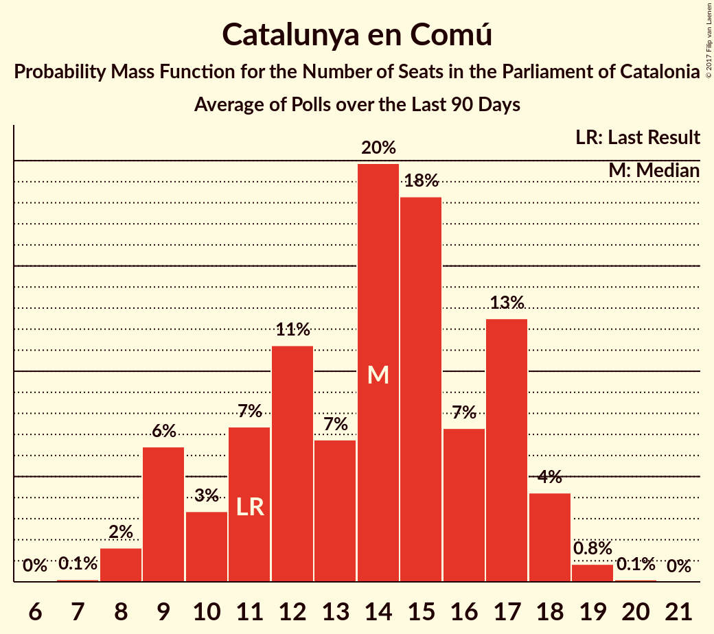

# Catalunya en Comú

<a href="#voting-intentions">Voting Intentions</a> | <a href="#seats">Seats</a>

## Voting Intentions

Last result: **8.9%** (General Election of 27 September 2015)

### Confidence Intervals

| Period     | Polling firm/Commissioner(s) | Median | 80% Confidence Interval | 90% Confidence Interval | 95% Confidence Interval | 99% Confidence Interval |
|:----------:|:----------------:|:-----------:|:-----------------------:|:-----------------------:|:-----------------------:|:-----------------------:|
| N/A | [Poll Average](average.html) | 11.0% | 9.5–12.8% | 9.1–13.3% | 8.8–13.8% | 8.2–14.7% |
| [27–31 October 2017](2017-10-31-SocioMétrica.html) | SocioMétrica   El Español | 10.0% | 8.9–11.3% | 8.6–11.7% | 8.3–12.0% | 7.8–12.7% |
| [16–29 October 2017](2017-10-29-GESOP.html) | GESOP   CEO | 10.5% | 9.3–11.8% | 9.0–12.2% | 8.7–12.5% | 8.2–13.2% |
| [23–26 October 2017](2017-10-26-SigmaDos.html) | Sigma Dos   El Mundo | 11.0% | 9.8–12.4% | 9.5–12.8% | 9.2–13.1% | 8.7–13.8% |
| [16–21 October 2017](2017-10-21-NCReport.html) | NC Report   La Razón | 11.4% | 10.2–12.8% | 9.9–13.2% | 9.6–13.5% | 9.0–14.2% |
| [16–19 October 2017](2017-10-19-GESOP.html) | GESOP   El Periódico | 9.0% | 7.8–10.4% | 7.5–10.8% | 7.2–11.2% | 6.7–11.9% |
| [4–9 October 2017](2017-10-09-SocioMétrica.html) | SocioMétrica   El Español | 12.0% | 10.6–13.6% | 10.2–14.1% | 9.9–14.4% | 9.3–15.2% |
| [19–22 September 2017](2017-09-22-NCReport.html) | NC Report   La Razón | 11.6% | 10.5–12.9% | 10.2–13.2% | 10.0–13.5% | 9.5–14.1% |
| [12–15 September 2017](2017-09-15-Celeste-Tel.html) | Celeste-Tel   eldiario.es | 12.2% | 10.9–13.9% | 10.5–14.3% | 10.2–14.7% | 9.5–15.5% |
| [28 August–1 September 2017](2017-09-01-SocioMétrica.html) | SocioMétrica   El Español | 10.4% | 9.1–12.1% | 8.7–12.5% | 8.4–12.9% | 7.8–13.7% |

### Probability Mass Function

The following table shows the probability mass function per percentage block of voting intentions for the [poll average](average.html) for Catalunya en Comú.

| Voting Intentions | Probability | Accumulated | Special Marks |
|:-----------------:|:-----------:|:-----------:|:-------------:|
| 6.5–7.5% | 0% | 100% |  |
| 7.5–8.5% | 1.3% | 100% |  |
| 8.5–9.5% | 9% | 98.6% | Last Result |
| 9.5–10.5% | 24% | 89% |  |
| 10.5–11.5% | 30% | 65% | Median |
| 11.5–12.5% | 21% | 35% |  |
| 12.5–13.5% | 10% | 13% |  |
| 13.5–14.5% | 3% | 4% |  |
| 14.5–15.5% | 0.6% | 0.7% |  |
| 15.5–16.5% | 0.1% | 0.1% |  |
| 16.5–17.5% | 0% | 0% |  |

## Seats

Last result: **11** seats (General Election of 27 September 2015)

### Confidence Intervals

| Period     | Polling firm/Commissioner(s) | Median | 80% Confidence Interval | 90% Confidence Interval | 95% Confidence Interval | 99% Confidence Interval |
|:----------:|:----------------:|:------:|:-----------------------:|:-----------------------:|:-----------------------:|:-----------------------:|
| N/A | [Poll Average](average.html) | 14 | 11–16 | 10–17 | 9–18 | 9–18 |
| [27–31 October 2017](2017-10-31-SocioMétrica.html) | SocioMétrica   El Español | 12 | 9–15 | 9–17 | 9–17 | 8–17 |
| [16–29 October 2017](2017-10-29-GESOP.html) | GESOP   CEO | 12 | 11–15 | 10–15 | 9–15 | 9–17 |
| [23–26 October 2017](2017-10-26-SigmaDos.html) | Sigma Dos   El Mundo | 14 | 12–15 | 11–16 | 11–17 | 9–18 |
| [16–21 October 2017](2017-10-21-NCReport.html) | NC Report   La Razón | 14 | 14 | 14–16 | 13–18 | 12–18 |
| [16–19 October 2017](2017-10-19-GESOP.html) | GESOP   El Periódico | 11 | 9–12 | 8–14 | 8–14 | 7–15 |
| [4–9 October 2017](2017-10-09-SocioMétrica.html) | SocioMétrica   El Español | 15 | 13–17 | 12–18 | 12–18 | 11–19 |
| [19–22 September 2017](2017-09-22-NCReport.html) | NC Report   La Razón | 14 | 13–17 | 12–17 | 12–17 | 11–18 |
| [12–15 September 2017](2017-09-15-Celeste-Tel.html) | Celeste-Tel   eldiario.es | 15 | 13–18 | 12–18 | 12–18 | 11–19 |
| [28 August–1 September 2017](2017-09-01-SocioMétrica.html) | SocioMétrica   El Español | 12 | 11–15 | 10–16 | 9–17 | 9–18 |

### Probability Mass Function

The following table shows the probability mass function per seat for the [poll average](average.html) for Catalunya en Comú.

| Number of Seats | Probability | Accumulated | Special Marks |
|:---------------:|:-----------:|:-----------:|:-------------:|
| 8 | 0.2% | 100% |  |
| 9 | 3% | 99.8% |  |
| 10 | 3% | 97% |  |
| 11 | 8% | 94% | Last Result |
| 12 | 17% | 86% |  |
| 13 | 9% | 69% |  |
| 14 | 35% | 60% | Median |
| 15 | 12% | 25% |  |
| 16 | 4% | 13% |  |
| 17 | 7% | 9% |  |
| 18 | 3% | 3% |  |
| 19 | 0.3% | 0.4% |  |
| 20 | 0% | 0% |  |

