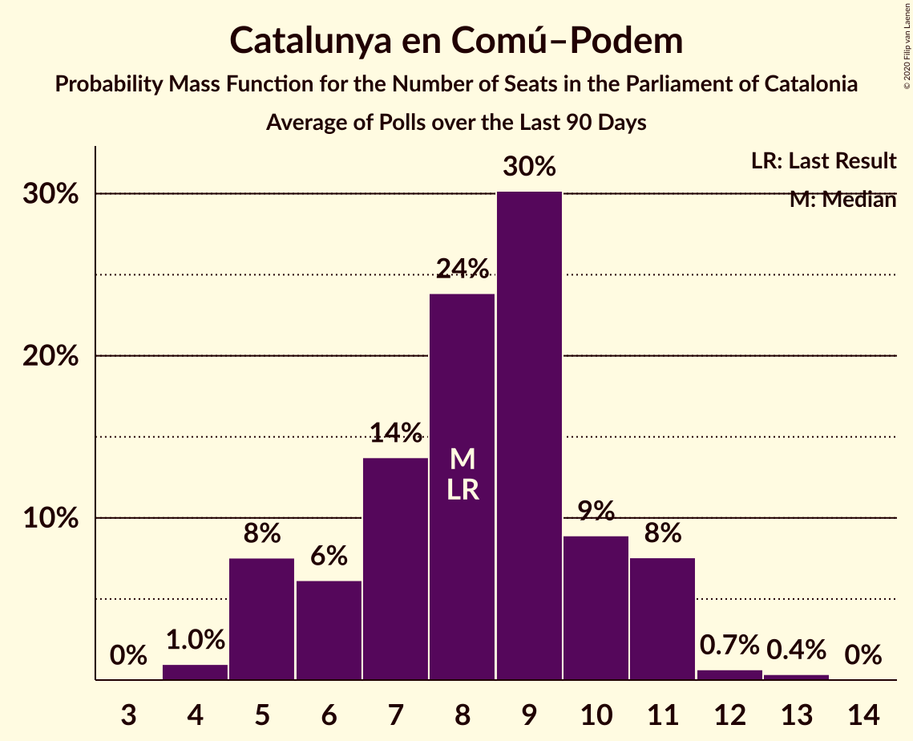

# Catalunya en Comú–Podem

<a href="#voting-intentions">Voting Intentions</a> | <a href="#seats">Seats</a>

## Voting Intentions

Last result: **7.5%** (General Election of 21 December 2017)

### Confidence Intervals

| Period     | Polling firm/Commissioner(s) | Median | 80% Confidence Interval | 90% Confidence Interval | 95% Confidence Interval | 99% Confidence Interval |
|:----------:|:----------------:|:-----------:|:-----------------------:|:-----------------------:|:-----------------------:|:-----------------------:|
| N/A | [Poll Average](average.html) | 7.9% | 6.2–9.3% | 5.8–9.7% | 5.5–10.1% | 4.9–10.8% |
| [6–13 July 2020](2020-07-13-GESOP.html) | GESOP   El Periódico | 7.9% | 7.1–8.9% | 6.8–9.2% | 6.6–9.4% | 6.2–9.9% |
| [29 June–2 July 2020](2020-07-02-Feedback.html) | Feedback   El Nacional | 6.6% | 5.6–7.9% | 5.3–8.3% | 5.1–8.6% | 4.6–9.2% |
| [1 April–15 May 2020](2020-05-15-electoPanel.html) | electoPanel   electomania.es | 8.7% | 7.7–10.0% | 7.3–10.3% | 7.1–10.6% | 6.6–11.2% |
| [29 April–8 May 2020](2020-05-08-GESOP.html) | GESOP   El Periódico | 7.7% | 6.9–8.7% | 6.6–8.9% | 6.4–9.2% | 6.1–9.7% |
| [10 February–9 March 2020](2020-03-09-GESOP.html) | GESOP   CEO | 10.9% | 9.9–12.1% | 9.6–12.4% | 9.4–12.7% | 8.9–13.2% |
| [21–26 February 2020](2020-02-26-GAD3.html) | GAD3   ABC | 8.1% | 7.0–9.5% | 6.7–9.9% | 6.4–10.2% | 5.9–10.9% |
| [3–6 February 2020](2020-02-06-GAD3.html) | GAD3   La Vanguardia | 8.8% | 7.5–10.5% | 7.1–11.0% | 6.8–11.5% | 6.2–12.3% |
| [2 February 2020](2020-02-02-SocioMétrica.html) | SocioMétrica   El Español | 10.0% | 8.5–11.9% | 8.0–12.5% | 7.7–13.0% | 7.0–13.9% |
| [27–31 January 2020](2020-01-31-NCReport.html) | NC Report   La Razón | 8.3% | 7.1–9.7% | 6.8–10.1% | 6.5–10.5% | 6.0–11.2% |
| [27–31 January 2020](2020-01-31-GESOP.html) | GESOP   El Periódico | 9.4% | 8.5–10.5% | 8.2–10.8% | 8.0–11.0% | 7.6–11.6% |
| [27–29 January 2020](2020-01-29-electoPanel.html) | electoPanel   electomania.es | 8.8% | 7.9–9.8% | 7.7–10.1% | 7.5–10.3% | 7.1–10.9% |
| [14 November–5 December 2019](2019-12-05-GESOP.html) | GESOP   CEO | 10.2% | 9.1–11.5% | 8.8–11.9% | 8.5–12.2% | 8.0–12.8% |
| [27–30 November 2019](2019-11-30-electoPanel.html) | electoPanel   electomania.es | 8.1% | 7.2–9.1% | 7.0–9.4% | 6.8–9.6% | 6.4–10.1% |
| [18–22 November 2019](2019-11-22-NCReport.html) | NC Report   La Razón | 7.7% | 6.5–9.1% | 6.2–9.4% | 6.0–9.8% | 5.5–10.5% |
| [16–19 October 2019](2019-10-19-electoPanel.html) | electoPanel   electomania.es | 8.2% | 7.5–9.0% | 7.3–9.3% | 7.1–9.5% | 6.7–9.9% |
| [14–15 October 2019](2019-10-15-electoPanel.html) | electoPanel   electomania.es | 8.0% | 7.0–9.2% | 6.7–9.6% | 6.5–9.9% | 6.0–10.5% |
| [1–5 October 2019](2019-10-05-NCReport.html) | NC Report   La Razón | 5.9% | N/A | N/A | N/A | N/A |
| [11 September 2019](2019-09-11-electoPanel.html) | electoPanel   electomania.es | 7.6% | N/A | N/A | N/A | N/A |
| [3–7 September 2019](2019-09-07-NCReport.html) | NC Report   La Razón | 6.2% | N/A | N/A | N/A | N/A |
| [20 August 2019](2019-08-20-electoPanel.html) | electoPanel   electomania.es | 7.1% | N/A | N/A | N/A | N/A |
| [17 July 2019](2019-07-17-electoPanel.html) | electoPanel   electomania.es | 7.1% | N/A | N/A | N/A | N/A |
| [25–17 July 2019](2019-07-17-GESOP.html) | GESOP   CEO | 9.5% | 8.4–10.8% | 8.1–11.2% | 7.9–11.5% | 7.4–12.1% |
| [1–5 July 2019](2019-07-05-GESOP.html) | GESOP   El Periódico | 7.0% | N/A | N/A | N/A | N/A |
| [4–25 March 2019](2019-03-25-Opinòmetre.html) | Opinòmetre   CEO | 7.0% | N/A | N/A | N/A | N/A |
| [10 February 2019](2019-02-10-GESOP.html) | GESOP   El Periódico | 7.5% | N/A | N/A | N/A | N/A |
| [24 December 2018](2018-12-24-NCReport.html) | NC Report   La Razón | 7.7% | N/A | N/A | N/A | N/A |
| [3–12 December 2018](2018-12-12-Opinòmetre.html) | Opinòmetre   Ara | 7.1% | N/A | N/A | N/A | N/A |
| [22 October–12 November 2018](2018-11-12-Opinòmetre.html) | Opinòmetre   CEO | 10.4% | N/A | N/A | N/A | N/A |
| [22–25 October 2018](2018-10-25-GESOP.html) | GESOP   El Periódico | 7.4% | N/A | N/A | N/A | N/A |
| [24–28 September 2018](2018-09-28-NCReport.html) | NC Report   La Razón | 6.5% | N/A | N/A | N/A | N/A |
| [16–18 September 2018](2018-09-18-electoPanel.html) | electoPanel   electomania.es | 7.0% | N/A | N/A | N/A | N/A |
| [22–30 August 2018](2018-08-30-SocioMétrica.html) | SocioMétrica   El Español | 7.4% | N/A | N/A | N/A | N/A |
| [23 June–14 July 2018](2018-07-14-Opinòmetre.html) | Opinòmetre   CEO | 7.8% | N/A | N/A | N/A | N/A |
| [2–11 July 2018](2018-07-11-GESOP.html) | GESOP   El Periódico | 8.5% | N/A | N/A | N/A | N/A |
| [14–21 June 2018](2018-06-21-GAD3.html) | GAD3   La Vanguardia | 7.0% | N/A | N/A | N/A | N/A |
| [3–7 June 2018](2018-06-07-electoPanel.html) | electoPanel   electomania.es | 7.6% | N/A | N/A | N/A | N/A |
| [7–27 April 2018](2018-04-27-Opinòmetre.html) | Opinòmetre   CEO | 9.5% | N/A | N/A | N/A | N/A |
| [17–20 April 2018](2018-04-20-NCReport.html) | NC Report   La Razón | 5.5% | N/A | N/A | N/A | N/A |
| [22–28 March 2018](2018-03-28-NCReport.html) | NC Report   La Razón | 6.0% | N/A | N/A | N/A | N/A |
| [10–30 January 2018](2018-01-30-Apolda.html) | Apolda   CEO | 7.4% | N/A | N/A | N/A | N/A |
| [15–19 January 2018](2018-01-19-NCReport.html) | NC Report   La Razón | 6.9% | N/A | N/A | N/A | N/A |

### Probability Mass Function

The following table shows the probability mass function per percentage block of voting intentions for the [poll average](average.html) for Catalunya en Comú–Podem.

| Voting Intentions | Probability | Accumulated | Special Marks |
|:-----------------:|:-----------:|:-----------:|:-------------:|
| 2.5–3.5% | 0% | 100% |  |
| 3.5–4.5% | 0.1% | 100% |  |
| 4.5–5.5% | 3% | 99.9% |  |
| 5.5–6.5% | 12% | 97% |  |
| 6.5–7.5% | 24% | 85% | Last Result |
| 7.5–8.5% | 33% | 61% | Median |
| 8.5–9.5% | 20% | 27% |  |
| 9.5–10.5% | 6% | 7% |  |
| 10.5–11.5% | 0.9% | 1.0% |  |
| 11.5–12.5% | 0.1% | 0.1% |  |
| 12.5–13.5% | 0% | 0% |  |

## Seats

Last result: **8** seats (General Election of 21 December 2017)

### Confidence Intervals

| Period     | Polling firm/Commissioner(s) | Median | 80% Confidence Interval | 90% Confidence Interval | 95% Confidence Interval | 99% Confidence Interval |
|:----------:|:----------------:|:------:|:-----------------------:|:-----------------------:|:-----------------------:|:-----------------------:|
| N/A | [Poll Average](average.html) | 9 | 6–11 | 5–11 | 5–12 | 4–13 |
| [6–13 July 2020](2020-07-13-GESOP.html) | GESOP   El Periódico | 9 | 8–11 | 8–11 | 7–11 | 7–12 |
| [29 June–2 July 2020](2020-07-02-Feedback.html) | Feedback   El Nacional | 7 | 5–9 | 5–10 | 5–10 | 4–11 |
| [1 April–15 May 2020](2020-05-15-electoPanel.html) | electoPanel   electomania.es | 11 | 9–11 | 8–12 | 8–12 | 7–14 |
| [29 April–8 May 2020](2020-05-08-GESOP.html) | GESOP   El Periódico | 8 | 8–10 | 7–11 | 7–11 | 6–11 |
| [10 February–9 March 2020](2020-03-09-GESOP.html) | GESOP   CEO | 14 | 12–15 | 11–16 | 11–16 | 11–17 |
| [21–26 February 2020](2020-02-26-GAD3.html) | GAD3   ABC | 9 | 8–11 | 7–12 | 7–13 | 6–14 |
| [3–6 February 2020](2020-02-06-GAD3.html) | GAD3   La Vanguardia | 10 | 8–13 | 8–13 | 7–14 | 6–16 |
| [2 February 2020](2020-02-02-SocioMétrica.html) | SocioMétrica   El Español | 12 | 9–14 | 9–16 | 8–16 | 7–17 |
| [27–31 January 2020](2020-01-31-NCReport.html) | NC Report   La Razón | 9 | 8–11 | 7–12 | 7–13 | 6–14 |
| [27–31 January 2020](2020-01-31-GESOP.html) | GESOP   El Periódico | 11 | 11–13 | 10–13 | 9–14 | 8–14 |
| [27–29 January 2020](2020-01-29-electoPanel.html) | electoPanel   electomania.es | 10 | 8–12 | 8–12 | 8–13 | 8–14 |
| [14 November–5 December 2019](2019-12-05-GESOP.html) | GESOP   CEO | 13 | 11–14 | 10–15 | 9–15 | 9–17 |
| [27–30 November 2019](2019-11-30-electoPanel.html) | electoPanel   electomania.es | 9 | 8–11 | 8–11 | 7–11 | 7–13 |
| [18–22 November 2019](2019-11-22-NCReport.html) | NC Report   La Razón | 8 | 7–11 | 7–11 | 6–12 | 5–13 |
| [16–19 October 2019](2019-10-19-electoPanel.html) | electoPanel   electomania.es | 10 | 10 | 8–10 | 8–11 | 8–12 |
| [14–15 October 2019](2019-10-15-electoPanel.html) | electoPanel   electomania.es | 9 | 8–11 | 7–12 | 7–12 | 6–13 |
| [1–5 October 2019](2019-10-05-NCReport.html) | NC Report   La Razón |  |  |  |  |  |
| [11 September 2019](2019-09-11-electoPanel.html) | electoPanel   electomania.es |  |  |  |  |  |
| [3–7 September 2019](2019-09-07-NCReport.html) | NC Report   La Razón |  |  |  |  |  |
| [20 August 2019](2019-08-20-electoPanel.html) | electoPanel   electomania.es |  |  |  |  |  |
| [17 July 2019](2019-07-17-electoPanel.html) | electoPanel   electomania.es |  |  |  |  |  |
| [25–17 July 2019](2019-07-17-GESOP.html) | GESOP   CEO | 11 | 10–14 | 10–16 | 8–16 | 8–16 |
| [1–5 July 2019](2019-07-05-GESOP.html) | GESOP   El Periódico |  |  |  |  |  |
| [4–25 March 2019](2019-03-25-Opinòmetre.html) | Opinòmetre   CEO |  |  |  |  |  |
| [10 February 2019](2019-02-10-GESOP.html) | GESOP   El Periódico |  |  |  |  |  |
| [24 December 2018](2018-12-24-NCReport.html) | NC Report   La Razón |  |  |  |  |  |
| [3–12 December 2018](2018-12-12-Opinòmetre.html) | Opinòmetre   Ara |  |  |  |  |  |
| [22 October–12 November 2018](2018-11-12-Opinòmetre.html) | Opinòmetre   CEO |  |  |  |  |  |
| [22–25 October 2018](2018-10-25-GESOP.html) | GESOP   El Periódico |  |  |  |  |  |
| [24–28 September 2018](2018-09-28-NCReport.html) | NC Report   La Razón |  |  |  |  |  |
| [16–18 September 2018](2018-09-18-electoPanel.html) | electoPanel   electomania.es |  |  |  |  |  |
| [22–30 August 2018](2018-08-30-SocioMétrica.html) | SocioMétrica   El Español |  |  |  |  |  |
| [23 June–14 July 2018](2018-07-14-Opinòmetre.html) | Opinòmetre   CEO |  |  |  |  |  |
| [2–11 July 2018](2018-07-11-GESOP.html) | GESOP   El Periódico |  |  |  |  |  |
| [14–21 June 2018](2018-06-21-GAD3.html) | GAD3   La Vanguardia |  |  |  |  |  |
| [3–7 June 2018](2018-06-07-electoPanel.html) | electoPanel   electomania.es |  |  |  |  |  |
| [7–27 April 2018](2018-04-27-Opinòmetre.html) | Opinòmetre   CEO |  |  |  |  |  |
| [17–20 April 2018](2018-04-20-NCReport.html) | NC Report   La Razón |  |  |  |  |  |
| [22–28 March 2018](2018-03-28-NCReport.html) | NC Report   La Razón |  |  |  |  |  |
| [10–30 January 2018](2018-01-30-Apolda.html) | Apolda   CEO |  |  |  |  |  |
| [15–19 January 2018](2018-01-19-NCReport.html) | NC Report   La Razón |  |  |  |  |  |

### Probability Mass Function

The following table shows the probability mass function per seat for the [poll average](average.html) for Catalunya en Comú–Podem.

| Number of Seats | Probability | Accumulated | Special Marks |
|:---------------:|:-----------:|:-----------:|:-------------:|
| 4 | 0.6% | 100% |  |
| 5 | 5% | 99.4% |  |
| 6 | 5% | 94% |  |
| 7 | 11% | 89% |  |
| 8 | 23% | 78% | Last Result |
| 9 | 17% | 55% | Median |
| 10 | 14% | 38% |  |
| 11 | 21% | 24% |  |
| 12 | 2% | 3% |  |
| 13 | 0.5% | 0.8% |  |
| 14 | 0.2% | 0.3% |  |
| 15 | 0% | 0% |  |

