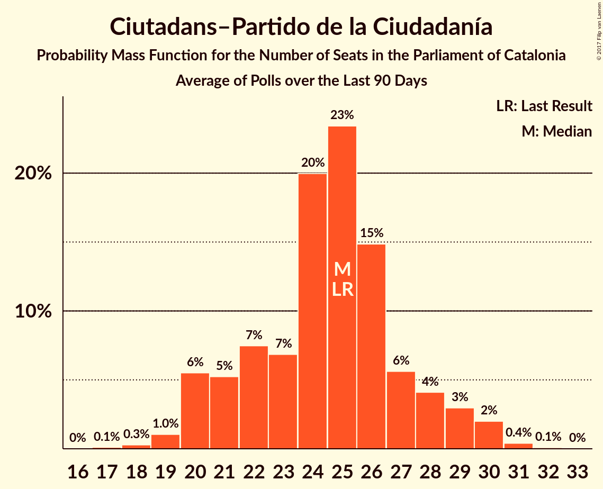

# Ciutadans–Partido de la Ciudadanía

<a href="#voting-intentions">Voting Intentions</a> | <a href="#seats">Seats</a>

## Voting Intentions

Last result: **17.9%** (General Election of 27 September 2015)

### Confidence Intervals

| Period     | Polling firm/Commissioner(s) | Median | 80% Confidence Interval | 90% Confidence Interval | 95% Confidence Interval | 99% Confidence Interval |
|:----------:|:----------------:|:-----------:|:-----------------------:|:-----------------------:|:-----------------------:|:-----------------------:|
| N/A | [Poll Average](average.html) | 18.6% | 16.7–20.5% | 16.2–21.0% | 15.7–21.5% | 14.9–22.4% |
| [27–31 October 2017](2017-10-31-SocioMétrica.html) | SocioMétrica   El Español | 18.3% | 16.8–20.0% | 16.4–20.4% | 16.0–20.8% | 15.3–21.6% |
| [16–29 October 2017](2017-10-29-GESOP.html) | GESOP   CEO | 18.2% | 16.7–19.9% | 16.3–20.3% | 16.0–20.7% | 15.3–21.6% |
| [23–26 October 2017](2017-10-26-SigmaDos.html) | Sigma Dos   El Mundo | 19.6% | 18.1–21.3% | 17.6–21.8% | 17.3–22.2% | 16.5–23.0% |
| [16–21 October 2017](2017-10-21-NCReport.html) | NC Report   La Razón | 19.2% | 17.7–20.9% | 17.2–21.4% | 16.9–21.8% | 16.2–22.6% |
| [16–19 October 2017](2017-10-19-GESOP.html) | GESOP   El Periódico | 16.8% | 15.2–18.5% | 14.7–19.1% | 14.3–19.5% | 13.6–20.4% |
| [4–9 October 2017](2017-10-09-SocioMétrica.html) | SocioMétrica   El Español | 18.2% | 16.6–20.1% | 16.1–20.6% | 15.7–21.1% | 15.0–22.0% |
| [19–22 September 2017](2017-09-22-NCReport.html) | NC Report   La Razón | 17.2% | 15.9–18.6% | 15.5–19.1% | 15.2–19.4% | 14.6–20.1% |
| [12–15 September 2017](2017-09-15-Celeste-Tel.html) | Celeste-Tel   eldiario.es | 17.4% | 15.7–19.2% | 15.3–19.7% | 14.9–20.2% | 14.2–21.1% |
| [28 August–1 September 2017](2017-09-01-SocioMétrica.html) | SocioMétrica   El Español | 17.6% | 15.8–19.5% | 15.3–20.1% | 14.9–20.6% | 14.1–21.5% |

### Probability Mass Function

The following table shows the probability mass function per percentage block of voting intentions for the [poll average](average.html) for Ciutadans–Partido de la Ciudadanía.

| Voting Intentions | Probability | Accumulated | Special Marks |
|:-----------------:|:-----------:|:-----------:|:-------------:|
| 12.5–13.5% | 0% | 100% |  |
| 13.5–14.5% | 0.2% | 100% |  |
| 14.5–15.5% | 2% | 99.7% |  |
| 15.5–16.5% | 6% | 98% |  |
| 16.5–17.5% | 15% | 92% |  |
| 17.5–18.5% | 25% | 76% | Last Result |
| 18.5–19.5% | 25% | 51% | Median |
| 19.5–20.5% | 17% | 26% |  |
| 20.5–21.5% | 7% | 10% |  |
| 21.5–22.5% | 2% | 2% |  |
| 22.5–23.5% | 0.3% | 0.4% |  |
| 23.5–24.5% | 0% | 0% |  |

## Seats

Last result: **25** seats (General Election of 27 September 2015)

### Confidence Intervals

| Period     | Polling firm/Commissioner(s) | Median | 80% Confidence Interval | 90% Confidence Interval | 95% Confidence Interval | 99% Confidence Interval |
|:----------:|:----------------:|:------:|:-----------------------:|:-----------------------:|:-----------------------:|:-----------------------:|
| N/A | [Poll Average](average.html) | 25 | 22–28 | 21–29 | 20–30 | 19–31 |
| [27–31 October 2017](2017-10-31-SocioMétrica.html) | SocioMétrica   El Español | 25 | 23–27 | 22–28 | 21–29 | 20–30 |
| [16–29 October 2017](2017-10-29-GESOP.html) | GESOP   CEO | 25 | 22–26 | 21–27 | 21–28 | 20–30 |
| [23–26 October 2017](2017-10-26-SigmaDos.html) | Sigma Dos   El Mundo | 26 | 25–30 | 24–30 | 24–31 | 22–32 |
| [16–21 October 2017](2017-10-21-NCReport.html) | NC Report   La Razón | 26 | 24–29 | 24–30 | 24–30 | 22–31 |
| [16–19 October 2017](2017-10-19-GESOP.html) | GESOP   El Periódico | 24 | 20–25 | 20–26 | 19–26 | 18–29 |
| [4–9 October 2017](2017-10-09-SocioMétrica.html) | SocioMétrica   El Español | 25 | 22–27 | 21–28 | 21–29 | 20–31 |
| [19–22 September 2017](2017-09-22-NCReport.html) | NC Report   La Razón | 24 | 21–25 | 20–26 | 20–26 | 19–28 |
| [12–15 September 2017](2017-09-15-Celeste-Tel.html) | Celeste-Tel   eldiario.es | 24 | 20–25 | 20–26 | 19–27 | 18–29 |
| [28 August–1 September 2017](2017-09-01-SocioMétrica.html) | SocioMétrica   El Español | 24 | 21–27 | 20–28 | 20–28 | 19–30 |

### Probability Mass Function

The following table shows the probability mass function per seat for the [poll average](average.html) for Ciutadans–Partido de la Ciudadanía.

| Number of Seats | Probability | Accumulated | Special Marks |
|:---------------:|:-----------:|:-----------:|:-------------:|
| 18 | 0.1% | 100% |  |
| 19 | 0.4% | 99.9% |  |
| 20 | 2% | 99.4% |  |
| 21 | 3% | 97% |  |
| 22 | 6% | 94% |  |
| 23 | 5% | 89% |  |
| 24 | 15% | 84% |  |
| 25 | 27% | 69% | Last Result, Median |
| 26 | 21% | 42% |  |
| 27 | 8% | 21% |  |
| 28 | 5% | 13% |  |
| 29 | 4% | 8% |  |
| 30 | 3% | 4% |  |
| 31 | 0.7% | 0.9% |  |
| 32 | 0.2% | 0.2% |  |
| 33 | 0.1% | 0.1% |  |
| 34 | 0% | 0% |  |

