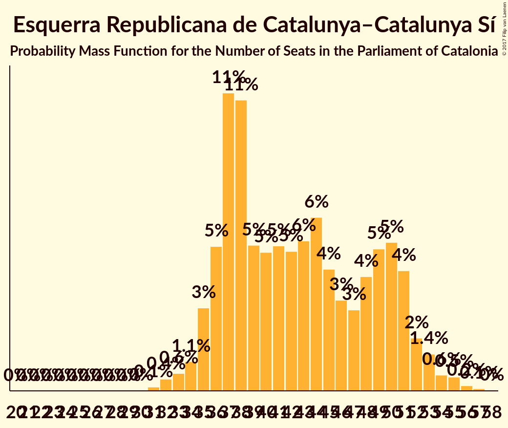

# Esquerra Republicana de Catalunya–Catalunya Sí

<a href="#voting-intentions">Voting Intentions</a> | <a href="#seats">Seats</a>

## Voting Intentions

Last result: **39.6%** (General Election of 27 September 2015)

### Confidence Intervals

| Period     | Polling firm/Commissioner(s) | Median | 80% Confidence Interval | 90% Confidence Interval | 95% Confidence Interval | 99% Confidence Interval |
|:----------:|:----------------:|:-----------:|:-----------------------:|:-----------------------:|:-----------------------:|:-----------------------:|
| N/A | [Poll Average](average.html) | 27.4% | 24.2–31.5% | 23.5–32.3% | 22.9–33.0% | 21.8–34.1% |
| [30 October–3 November 2017](2017-11-03-NCReport.html) | NC Report   La Razón | 26.3% | 24.3–28.5% | 23.7–29.2% | 23.2–29.7% | 22.3–30.8% |
| [30 October–3 November 2017](2017-11-03-GAD3.html) | GAD3   La Vanguardia | 29.3% | 27.5–31.2% | 27.0–31.8% | 26.6–32.2% | 25.7–33.2% |
| [27–31 October 2017](2017-10-31-SocioMétrica.html) | SocioMétrica   El Español | 31.2% | 29.4–33.1% | 28.8–33.7% | 28.4–34.1% | 27.5–35.1% |
| [16–29 October 2017](2017-10-29-GESOP.html) | GESOP   CEO | 0.0% | N/A | N/A | N/A | N/A |
| [23–26 October 2017](2017-10-26-SigmaDos.html) | Sigma Dos   El Mundo | 26.4% | 24.7–28.2% | 24.2–28.8% | 23.8–29.2% | 22.9–30.1% |
| [16–21 October 2017](2017-10-21-NCReport.html) | NC Report   La Razón | 24.6% | 22.9–26.4% | 22.4–26.9% | 22.0–27.4% | 21.2–28.3% |
| [16–19 October 2017](2017-10-19-GESOP.html) | GESOP   El Periódico | 28.1% | 26.2–30.2% | 25.6–30.8% | 25.1–31.4% | 24.2–32.4% |
| [4–9 October 2017](2017-10-09-SocioMétrica.html) | SocioMétrica   El Español | 31.8% | 29.7–33.9% | 29.1–34.5% | 28.6–35.1% | 27.6–36.1% |
| [19–22 September 2017](2017-09-22-NCReport.html) | NC Report   La Razón | 25.1% | 23.6–26.7% | 23.1–27.2% | 22.8–27.6% | 22.1–28.4% |
| [12–15 September 2017](2017-09-15-Celeste-Tel.html) | Celeste-Tel   eldiario.es | 24.8% | 22.9–26.8% | 22.3–27.4% | 21.9–27.9% | 21.0–28.9% |
| [28 August–1 September 2017](2017-09-01-SocioMétrica.html) | SocioMétrica   El Español | 28.0% | N/A | N/A | N/A | N/A |

### Probability Mass Function

The following table shows the probability mass function per percentage block of voting intentions for the [poll average](average.html) for Esquerra Republicana de Catalunya–Catalunya Sí.

| Voting Intentions | Probability | Accumulated | Special Marks |
|:-----------------:|:-----------:|:-----------:|:-------------:|
| 19.5–20.5% | 0% | 100% |  |
| 20.5–21.5% | 0.3% | 100% |  |
| 21.5–22.5% | 1.2% | 99.7% |  |
| 22.5–23.5% | 4% | 98% |  |
| 23.5–24.5% | 8% | 95% |  |
| 24.5–25.5% | 12% | 87% |  |
| 25.5–26.5% | 14% | 75% |  |
| 26.5–27.5% | 13% | 61% | Median |
| 27.5–28.5% | 11% | 48% |  |
| 28.5–29.5% | 10% | 37% |  |
| 29.5–30.5% | 9% | 27% |  |
| 30.5–31.5% | 8% | 18% |  |
| 31.5–32.5% | 6% | 10% |  |
| 32.5–33.5% | 3% | 4% |  |
| 33.5–34.5% | 1.0% | 1.2% |  |
| 34.5–35.5% | 0.2% | 0.3% |  |
| 35.5–36.5% | 0% | 0% |  |
| 36.5–37.5% | 0% | 0% |  |
| 37.5–38.5% | 0% | 0% |  |
| 38.5–39.5% | 0% | 0% |  |
| 39.5–40.5% | 0% | 0% | Last Result |

## Seats

Last result: **20** seats (General Election of 27 September 2015)

### Confidence Intervals

| Period     | Polling firm/Commissioner(s) | Median | 80% Confidence Interval | 90% Confidence Interval | 95% Confidence Interval | 99% Confidence Interval |
|:----------:|:----------------:|:------:|:-----------------------:|:-----------------------:|:-----------------------:|:-----------------------:|
| N/A | [Poll Average](average.html) | 43 | 37–49 | 36–50 | 35–51 | 33–53 |
| [30 October–3 November 2017](2017-11-03-NCReport.html) | NC Report   La Razón | 41 | 37–44 | 37–45 | 36–46 | 35–48 |
| [30 October–3 November 2017](2017-11-03-GAD3.html) | GAD3   La Vanguardia | 45 | 42–48 | 41–49 | 40–50 | 39–51 |
| [27–31 October 2017](2017-10-31-SocioMétrica.html) | SocioMétrica   El Español | 49 | 45–51 | 45–52 | 44–53 | 43–55 |
| [16–29 October 2017](2017-10-29-GESOP.html) | GESOP   CEO |  |  |  |  |  |
| [23–26 October 2017](2017-10-26-SigmaDos.html) | Sigma Dos   El Mundo | 41 | 38–44 | 37–44 | 37–45 | 35–47 |
| [16–21 October 2017](2017-10-21-NCReport.html) | NC Report   La Razón | 38 | 36–42 | 35–43 | 35–43 | 33–44 |
| [16–19 October 2017](2017-10-19-GESOP.html) | GESOP   El Periódico | 44 | 41–48 | 40–49 | 39–50 | 38–51 |
| [4–9 October 2017](2017-10-09-SocioMétrica.html) | SocioMétrica   El Español | 50 | 46–53 | 45–54 | 45–55 | 43–56 |
| [19–22 September 2017](2017-09-22-NCReport.html) | NC Report   La Razón | 39 | 37–42 | 36–43 | 36–43 | 34–44 |
| [12–15 September 2017](2017-09-15-Celeste-Tel.html) | Celeste-Tel   eldiario.es | 38 | 35–41 | 34–42 | 33–43 | 31–44 |
| [28 August–1 September 2017](2017-09-01-SocioMétrica.html) | SocioMétrica   El Español | 44 | 40–47 | 39–48 | 38–49 | 37–51 |

### Probability Mass Function

The following table shows the probability mass function per seat for the [poll average](average.html) for Esquerra Republicana de Catalunya–Catalunya Sí.

| Number of Seats | Probability | Accumulated | Special Marks |
|:---------------:|:-----------:|:-----------:|:-------------:|
| 20 | 0% | 100% | Last Result |
| 21 | 0% | 100% |  |
| 22 | 0% | 100% |  |
| 23 | 0% | 100% |  |
| 24 | 0% | 100% |  |
| 25 | 0% | 100% |  |
| 26 | 0% | 100% |  |
| 27 | 0% | 100% |  |
| 28 | 0% | 100% |  |
| 29 | 0% | 100% |  |
| 30 | 0% | 100% |  |
| 31 | 0.1% | 100% |  |
| 32 | 0.3% | 99.9% |  |
| 33 | 0.4% | 99.5% |  |
| 34 | 0.7% | 99.2% |  |
| 35 | 2% | 98% |  |
| 36 | 3% | 97% |  |
| 37 | 7% | 93% |  |
| 38 | 8% | 86% |  |
| 39 | 6% | 78% |  |
| 40 | 6% | 72% |  |
| 41 | 8% | 66% |  |
| 42 | 7% | 58% |  |
| 43 | 9% | 51% | Median |
| 44 | 8% | 42% |  |
| 45 | 6% | 33% |  |
| 46 | 6% | 27% |  |
| 47 | 4% | 22% |  |
| 48 | 4% | 18% |  |
| 49 | 4% | 13% |  |
| 50 | 5% | 9% |  |
| 51 | 3% | 5% |  |
| 52 | 1.0% | 2% |  |
| 53 | 0.5% | 0.8% |  |
| 54 | 0.2% | 0.3% |  |
| 55 | 0.1% | 0.2% |  |
| 56 | 0% | 0.1% |  |
| 57 | 0% | 0% |  |

