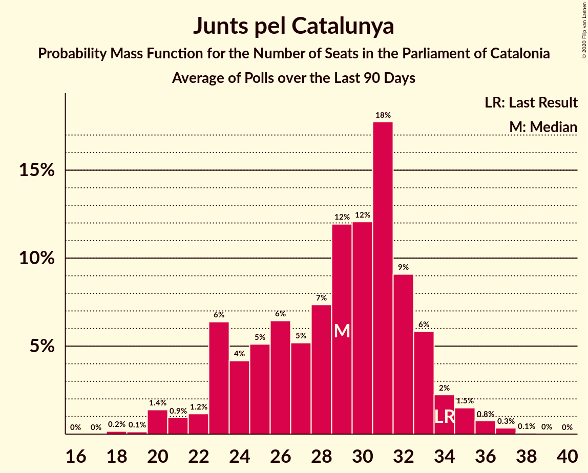

# Junts pel Catalunya

<a href="#voting-intentions">Voting Intentions</a> | <a href="#seats">Seats</a>

## Voting Intentions

Last result: **21.7%** (General Election of 21 December 2017)

### Confidence Intervals

| Period     | Polling firm/Commissioner(s) | Median | 80% Confidence Interval | 90% Confidence Interval | 95% Confidence Interval | 99% Confidence Interval |
|:----------:|:----------------:|:-----------:|:-----------------------:|:-----------------------:|:-----------------------:|:-----------------------:|
| N/A | [Poll Average](average.html) | 19.1% | 17.6–20.7% | 17.2–21.1% | 16.8–21.5% | 16.1–22.3% |
| [14 November–5 December 2019](2019-12-05-GESOP.html) | GESOP   CEO | 19.0% | 17.6–20.7% | 17.1–21.2% | 16.8–21.5% | 16.1–22.4% |
| [27–30 November 2019](2019-11-30-electoPanel.html) | electoPanel   electomania.es | 15.8% | N/A | N/A | N/A | N/A |
| [18–22 November 2019](2019-11-22-NCReport.html) | NC Report   La Razón | 19.2% | N/A | N/A | N/A | N/A |
| [25–17 July 2019](2019-07-17-GESOP.html) | GESOP   CEO | 16.6% | 15.1–18.2% | 14.8–18.6% | 14.4–19.0% | 13.8–19.7% |

### Probability Mass Function

The following table shows the probability mass function per percentage block of voting intentions for the [poll average](average.html) for Junts pel Catalunya.

| Voting Intentions | Probability | Accumulated | Special Marks |
|:-----------------:|:-----------:|:-----------:|:-------------:|
| 13.5–14.5% | 0% | 100% |  |
| 14.5–15.5% | 0.1% | 100% |  |
| 15.5–16.5% | 1.4% | 99.9% |  |
| 16.5–17.5% | 8% | 98% |  |
| 17.5–18.5% | 23% | 90% |  |
| 18.5–19.5% | 32% | 67% | Median |
| 19.5–20.5% | 22% | 35% |  |
| 20.5–21.5% | 10% | 12% |  |
| 21.5–22.5% | 2% | 2% | Last Result |
| 22.5–23.5% | 0.3% | 0.3% |  |
| 23.5–24.5% | 0% | 0% |  |

## Seats

Last result: **34** seats (General Election of 21 December 2017)

### Confidence Intervals

| Period     | Polling firm/Commissioner(s) | Median | 80% Confidence Interval | 90% Confidence Interval | 95% Confidence Interval | 99% Confidence Interval |
|:----------:|:----------------:|:------:|:-----------------------:|:-----------------------:|:-----------------------:|:-----------------------:|
| N/A | [Poll Average](average.html) | 30 | 24–32 | 24–32 | 24–35 | 24–35 |
| [14 November–5 December 2019](2019-12-05-GESOP.html) | GESOP   CEO | 30 | 24–32 | 24–32 | 24–35 | 24–35 |
| [27–30 November 2019](2019-11-30-electoPanel.html) | electoPanel   electomania.es |  |  |  |  |  |
| [18–22 November 2019](2019-11-22-NCReport.html) | NC Report   La Razón |  |  |  |  |  |
| [25–17 July 2019](2019-07-17-GESOP.html) | GESOP   CEO | 27 | 24–29 | 24–29 | 24–30 | 23–30 |

### Probability Mass Function

The following table shows the probability mass function per seat for the [poll average](average.html) for Junts pel Catalunya.

| Number of Seats | Probability | Accumulated | Special Marks |
|:---------------:|:-----------:|:-----------:|:-------------:|
| 24 | 19% | 100% |  |
| 25 | 1.1% | 81% |  |
| 26 | 13% | 80% |  |
| 27 | 0.1% | 67% |  |
| 28 | 8% | 67% |  |
| 29 | 1.4% | 58% |  |
| 30 | 38% | 57% | Median |
| 31 | 6% | 19% |  |
| 32 | 10% | 13% |  |
| 33 | 0% | 3% |  |
| 34 | 0% | 3% | Last Result |
| 35 | 3% | 3% |  |
| 36 | 0% | 0% |  |

