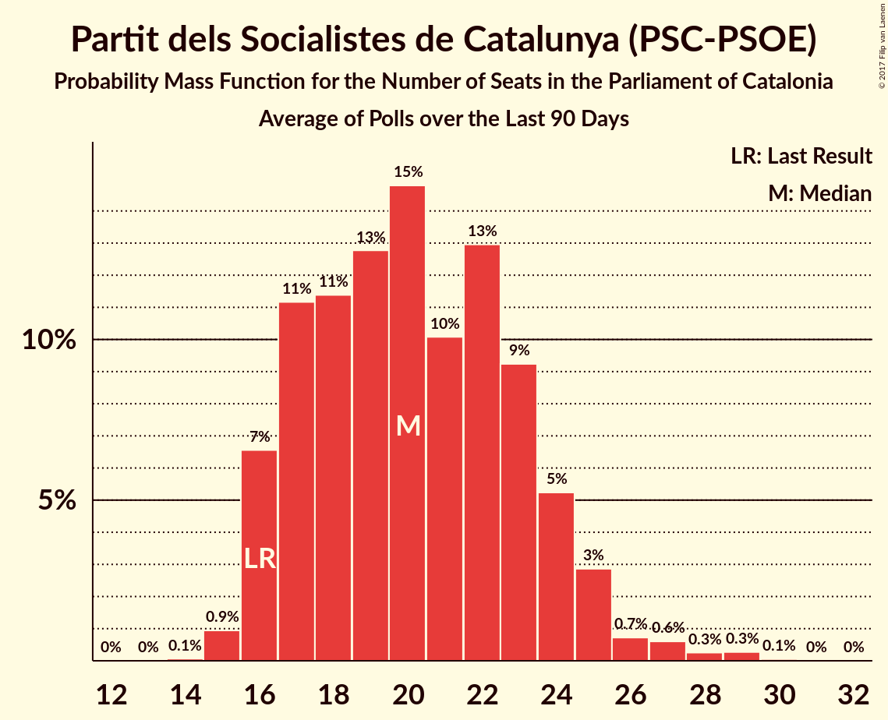

# Partit dels Socialistes de Catalunya (PSC-PSOE)

<a href="#voting-intentions">Voting Intentions</a> | <a href="#seats">Seats</a>

## Voting Intentions

Last result: **13.9%** (General Election of 21 December 2017)

### Confidence Intervals

| Period     | Polling firm/Commissioner(s) | Median | 80% Confidence Interval | 90% Confidence Interval | 95% Confidence Interval | 99% Confidence Interval |
|:----------:|:----------------:|:-----------:|:-----------------------:|:-----------------------:|:-----------------------:|:-----------------------:|
| N/A | [Poll Average](average.html) | 18.8% | 16.3–21.4% | 15.8–22.2% | 15.4–22.8% | 14.6–24.0% |
| [21–26 February 2020](2020-02-26-GAD3.html) | GAD3   ABC | 20.8% | 19.0–22.7% | 18.5–23.2% | 18.1–23.7% | 17.3–24.7% |
| [3–6 February 2020](2020-02-06-GAD3.html) | GAD3   La Vanguardia | 20.3% | 18.3–22.6% | 17.7–23.3% | 17.2–23.8% | 16.3–25.0% |
| [2 February 2020](2020-02-02-SocioMétrica.html) | SocioMétrica   El Español | 19.4% | 17.3–21.8% | 16.7–22.5% | 16.2–23.1% | 15.2–24.3% |
| [27–31 January 2020](2020-01-31-NCReport.html) | NC Report   La Razón | 17.3% | 15.7–19.3% | 15.2–19.8% | 14.8–20.3% | 14.0–21.2% |
| [27–31 January 2020](2020-01-31-GESOP.html) | GESOP   El Periódico | 16.9% | 15.7–18.3% | 15.4–18.6% | 15.1–19.0% | 14.5–19.6% |
| [27–29 January 2020](2020-01-29-electoPanel.html) | electoPanel   electomania.es | 19.4% | 18.1–20.8% | 17.8–21.2% | 17.5–21.5% | 16.9–22.1% |
| [14 November–5 December 2019](2019-12-05-GESOP.html) | GESOP   CEO | 18.0% | 16.6–19.6% | 16.1–20.1% | 15.8–20.5% | 15.1–21.2% |
| [27–30 November 2019](2019-11-30-electoPanel.html) | electoPanel   electomania.es | 18.4% | 17.1–19.8% | 16.8–20.2% | 16.5–20.6% | 15.9–21.2% |
| [18–22 November 2019](2019-11-22-NCReport.html) | NC Report   La Razón | 16.8% | 15.2–18.7% | 14.7–19.2% | 14.3–19.7% | 13.5–20.6% |
| [16–19 October 2019](2019-10-19-electoPanel.html) | electoPanel   electomania.es | 17.6% | N/A | N/A | N/A | N/A |
| [14–15 October 2019](2019-10-15-electoPanel.html) | electoPanel   electomania.es | 20.2% | N/A | N/A | N/A | N/A |
| [1–5 October 2019](2019-10-05-NCReport.html) | NC Report   La Razón | 19.8% | N/A | N/A | N/A | N/A |
| [11 September 2019](2019-09-11-electoPanel.html) | electoPanel   electomania.es | 20.1% | N/A | N/A | N/A | N/A |
| [3–7 September 2019](2019-09-07-NCReport.html) | NC Report   La Razón | 19.1% | N/A | N/A | N/A | N/A |
| [20 August 2019](2019-08-20-electoPanel.html) | electoPanel   electomania.es | 20.3% | N/A | N/A | N/A | N/A |
| [17 July 2019](2019-07-17-electoPanel.html) | electoPanel   electomania.es | 20.1% | N/A | N/A | N/A | N/A |
| [25–17 July 2019](2019-07-17-GESOP.html) | GESOP   CEO | 18.7% | 17.2–20.3% | 16.8–20.8% | 16.4–21.2% | 15.7–21.9% |
| [1–5 July 2019](2019-07-05-GESOP.html) | GESOP   El Periódico | 20.0% | N/A | N/A | N/A | N/A |
| [4–25 March 2019](2019-03-25-Opinòmetre.html) | Opinòmetre   CEO | 16.5% | N/A | N/A | N/A | N/A |
| [10 February 2019](2019-02-10-GESOP.html) | GESOP   El Periódico | 15.5% | N/A | N/A | N/A | N/A |
| [24 December 2018](2018-12-24-NCReport.html) | NC Report   La Razón | 15.0% | N/A | N/A | N/A | N/A |
| [3–12 December 2018](2018-12-12-Opinòmetre.html) | Opinòmetre   Ara | 13.9% | N/A | N/A | N/A | N/A |
| [22 October–12 November 2018](2018-11-12-Opinòmetre.html) | Opinòmetre   CEO | 14.5% | N/A | N/A | N/A | N/A |
| [22–25 October 2018](2018-10-25-GESOP.html) | GESOP   El Periódico | 17.3% | N/A | N/A | N/A | N/A |
| [24–28 September 2018](2018-09-28-NCReport.html) | NC Report   La Razón | 15.8% | N/A | N/A | N/A | N/A |
| [16–18 September 2018](2018-09-18-electoPanel.html) | electoPanel   electomania.es | 16.1% | N/A | N/A | N/A | N/A |
| [22–30 August 2018](2018-08-30-SocioMétrica.html) | SocioMétrica   El Español | 15.0% | N/A | N/A | N/A | N/A |
| [23 June–14 July 2018](2018-07-14-Opinòmetre.html) | Opinòmetre   CEO | 15.5% | N/A | N/A | N/A | N/A |
| [2–11 July 2018](2018-07-11-GESOP.html) | GESOP   El Periódico | 15.5% | N/A | N/A | N/A | N/A |
| [14–21 June 2018](2018-06-21-GAD3.html) | GAD3   La Vanguardia | 14.7% | N/A | N/A | N/A | N/A |
| [3–7 June 2018](2018-06-07-electoPanel.html) | electoPanel   electomania.es | 16.3% | N/A | N/A | N/A | N/A |
| [7–27 April 2018](2018-04-27-Opinòmetre.html) | Opinòmetre   CEO | 11.0% | N/A | N/A | N/A | N/A |
| [17–20 April 2018](2018-04-20-NCReport.html) | NC Report   La Razón | 15.2% | N/A | N/A | N/A | N/A |
| [22–28 March 2018](2018-03-28-NCReport.html) | NC Report   La Razón | 14.8% | N/A | N/A | N/A | N/A |
| [10–30 January 2018](2018-01-30-Apolda.html) | Apolda   CEO | 12.5% | N/A | N/A | N/A | N/A |
| [15–19 January 2018](2018-01-19-NCReport.html) | NC Report   La Razón | 14.4% | N/A | N/A | N/A | N/A |

### Probability Mass Function

The following table shows the probability mass function per percentage block of voting intentions for the [poll average](average.html) for Partit dels Socialistes de Catalunya (PSC-PSOE).

| Voting Intentions | Probability | Accumulated | Special Marks |
|:-----------------:|:-----------:|:-----------:|:-------------:|
| 12.5–13.5% | 0% | 100% |  |
| 13.5–14.5% | 0.4% | 100% | Last Result |
| 14.5–15.5% | 3% | 99.5% |  |
| 15.5–16.5% | 10% | 97% |  |
| 16.5–17.5% | 16% | 87% |  |
| 17.5–18.5% | 17% | 71% |  |
| 18.5–19.5% | 18% | 55% | Median |
| 19.5–20.5% | 16% | 36% |  |
| 20.5–21.5% | 11% | 20% |  |
| 21.5–22.5% | 6% | 9% |  |
| 22.5–23.5% | 2% | 3% |  |
| 23.5–24.5% | 0.7% | 0.9% |  |
| 24.5–25.5% | 0.2% | 0.2% |  |
| 25.5–26.5% | 0% | 0% |  |

## Seats

Last result: **17** seats (General Election of 21 December 2017)

### Confidence Intervals

| Period     | Polling firm/Commissioner(s) | Median | 80% Confidence Interval | 90% Confidence Interval | 95% Confidence Interval | 99% Confidence Interval |
|:----------:|:----------------:|:------:|:-----------------------:|:-----------------------:|:-----------------------:|:-----------------------:|
| N/A | [Poll Average](average.html) | 25 | 22–29 | 21–30 | 20–31 | 18–33 |
| [21–26 February 2020](2020-02-26-GAD3.html) | GAD3   ABC | 28 | 25–31 | 25–31 | 24–33 | 24–34 |
| [3–6 February 2020](2020-02-06-GAD3.html) | GAD3   La Vanguardia | 27 | 25–31 | 24–31 | 23–31 | 22–33 |
| [2 February 2020](2020-02-02-SocioMétrica.html) | SocioMétrica   El Español | 25 | 23–28 | 22–30 | 21–31 | 19–33 |
| [27–31 January 2020](2020-01-31-NCReport.html) | NC Report   La Razón | 23 | 21–26 | 20–26 | 19–26 | 17–29 |
| [27–31 January 2020](2020-01-31-GESOP.html) | GESOP   El Periódico | 23 | 21–25 | 20–26 | 19–26 | 18–26 |
| [27–29 January 2020](2020-01-29-electoPanel.html) | electoPanel   electomania.es | 25 | 24–28 | 24–28 | 24–28 | 23–30 |
| [14 November–5 December 2019](2019-12-05-GESOP.html) | GESOP   CEO | 25 | 23–26 | 22–27 | 21–28 | 19–29 |
| [27–30 November 2019](2019-11-30-electoPanel.html) | electoPanel   electomania.es | 25 | 24–27 | 23–28 | 23–28 | 22–29 |
| [18–22 November 2019](2019-11-22-NCReport.html) | NC Report   La Razón | 23 | 19–25 | 18–25 | 18–26 | 17–27 |
| [16–19 October 2019](2019-10-19-electoPanel.html) | electoPanel   electomania.es |  |  |  |  |  |
| [14–15 October 2019](2019-10-15-electoPanel.html) | electoPanel   electomania.es |  |  |  |  |  |
| [1–5 October 2019](2019-10-05-NCReport.html) | NC Report   La Razón |  |  |  |  |  |
| [11 September 2019](2019-09-11-electoPanel.html) | electoPanel   electomania.es |  |  |  |  |  |
| [3–7 September 2019](2019-09-07-NCReport.html) | NC Report   La Razón |  |  |  |  |  |
| [20 August 2019](2019-08-20-electoPanel.html) | electoPanel   electomania.es |  |  |  |  |  |
| [17 July 2019](2019-07-17-electoPanel.html) | electoPanel   electomania.es |  |  |  |  |  |
| [25–17 July 2019](2019-07-17-GESOP.html) | GESOP   CEO | 25 | 20–28 | 20–28 | 20–28 | 20–28 |
| [1–5 July 2019](2019-07-05-GESOP.html) | GESOP   El Periódico |  |  |  |  |  |
| [4–25 March 2019](2019-03-25-Opinòmetre.html) | Opinòmetre   CEO |  |  |  |  |  |
| [10 February 2019](2019-02-10-GESOP.html) | GESOP   El Periódico |  |  |  |  |  |
| [24 December 2018](2018-12-24-NCReport.html) | NC Report   La Razón |  |  |  |  |  |
| [3–12 December 2018](2018-12-12-Opinòmetre.html) | Opinòmetre   Ara |  |  |  |  |  |
| [22 October–12 November 2018](2018-11-12-Opinòmetre.html) | Opinòmetre   CEO |  |  |  |  |  |
| [22–25 October 2018](2018-10-25-GESOP.html) | GESOP   El Periódico |  |  |  |  |  |
| [24–28 September 2018](2018-09-28-NCReport.html) | NC Report   La Razón |  |  |  |  |  |
| [16–18 September 2018](2018-09-18-electoPanel.html) | electoPanel   electomania.es |  |  |  |  |  |
| [22–30 August 2018](2018-08-30-SocioMétrica.html) | SocioMétrica   El Español |  |  |  |  |  |
| [23 June–14 July 2018](2018-07-14-Opinòmetre.html) | Opinòmetre   CEO |  |  |  |  |  |
| [2–11 July 2018](2018-07-11-GESOP.html) | GESOP   El Periódico |  |  |  |  |  |
| [14–21 June 2018](2018-06-21-GAD3.html) | GAD3   La Vanguardia |  |  |  |  |  |
| [3–7 June 2018](2018-06-07-electoPanel.html) | electoPanel   electomania.es |  |  |  |  |  |
| [7–27 April 2018](2018-04-27-Opinòmetre.html) | Opinòmetre   CEO |  |  |  |  |  |
| [17–20 April 2018](2018-04-20-NCReport.html) | NC Report   La Razón |  |  |  |  |  |
| [22–28 March 2018](2018-03-28-NCReport.html) | NC Report   La Razón |  |  |  |  |  |
| [10–30 January 2018](2018-01-30-Apolda.html) | Apolda   CEO |  |  |  |  |  |
| [15–19 January 2018](2018-01-19-NCReport.html) | NC Report   La Razón |  |  |  |  |  |

### Probability Mass Function

The following table shows the probability mass function per seat for the [poll average](average.html) for Partit dels Socialistes de Catalunya (PSC-PSOE).

| Number of Seats | Probability | Accumulated | Special Marks |
|:---------------:|:-----------:|:-----------:|:-------------:|
| 17 | 0.3% | 100% | Last Result |
| 18 | 0.6% | 99.7% |  |
| 19 | 0.8% | 99.1% |  |
| 20 | 3% | 98% |  |
| 21 | 3% | 96% |  |
| 22 | 6% | 93% |  |
| 23 | 14% | 86% |  |
| 24 | 13% | 73% |  |
| 25 | 20% | 60% | Median |
| 26 | 17% | 39% |  |
| 27 | 7% | 22% |  |
| 28 | 5% | 16% |  |
| 29 | 3% | 11% |  |
| 30 | 5% | 8% |  |
| 31 | 2% | 3% |  |
| 32 | 0.3% | 1.1% |  |
| 33 | 0.5% | 0.8% |  |
| 34 | 0.3% | 0.3% |  |
| 35 | 0% | 0% |  |

