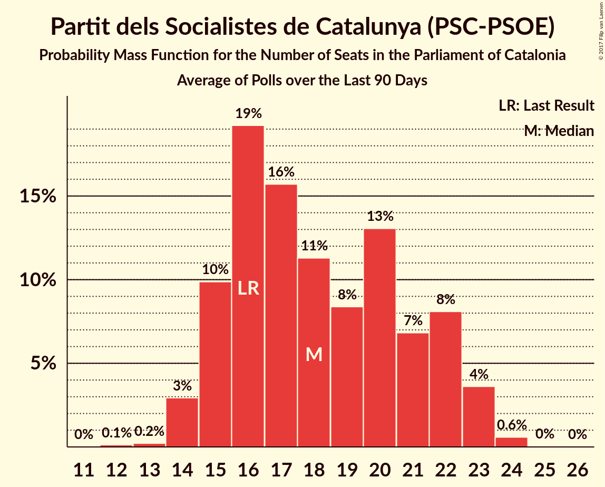

# Partit dels Socialistes de Catalunya (PSC-PSOE)

<a href="#voting-intentions">Voting Intentions</a> | <a href="#seats">Seats</a>

## Voting Intentions

Last result: **12.7%** (General Election of 27 September 2015)

### Confidence Intervals

| Period     | Polling firm/Commissioner(s) | Median | 80% Confidence Interval | 90% Confidence Interval | 95% Confidence Interval | 99% Confidence Interval |
|:----------:|:----------------:|:-----------:|:-----------------------:|:-----------------------:|:-----------------------:|:-----------------------:|
| N/A | [Poll Average](average.html) | 13.8% | 11.9–15.9% | 11.4–16.4% | 11.0–16.9% | 10.3–17.8% |
| [27–31 October 2017](2017-10-31-SocioMétrica.html) | SocioMétrica   El Español | 12.2% | 10.9–13.6% | 10.6–14.0% | 10.3–14.4% | 9.7–15.1% |
| [16–29 October 2017](2017-10-29-GESOP.html) | GESOP   CEO | 13.8% | 12.5–15.3% | 12.2–15.8% | 11.8–16.1% | 11.2–16.9% |
| [23–26 October 2017](2017-10-26-SigmaDos.html) | Sigma Dos   El Mundo | 15.1% | 13.7–16.6% | 13.3–17.1% | 13.0–17.5% | 12.4–18.2% |
| [16–21 October 2017](2017-10-21-NCReport.html) | NC Report   La Razón | 13.1% | 11.8–14.6% | 11.4–15.0% | 11.1–15.3% | 10.6–16.1% |
| [16–19 October 2017](2017-10-19-GESOP.html) | GESOP   El Periódico | 14.5% | 13.0–16.2% | 12.6–16.7% | 12.2–17.1% | 11.5–18.0% |
| [4–9 October 2017](2017-10-09-SocioMétrica.html) | SocioMétrica   El Español | 9.5% | 8.3–11.0% | 7.9–11.4% | 7.7–11.7% | 7.1–12.5% |
| [19–22 September 2017](2017-09-22-NCReport.html) | NC Report   La Razón | 13.7% | 12.5–15.0% | 12.2–15.4% | 11.9–15.7% | 11.4–16.4% |
| [12–15 September 2017](2017-09-15-Celeste-Tel.html) | Celeste-Tel   eldiario.es | 14.8% | 13.2–16.5% | 12.8–17.0% | 12.5–17.4% | 11.8–18.2% |
| [28 August–1 September 2017](2017-09-01-SocioMétrica.html) | SocioMétrica   El Español | 10.1% | 8.8–11.8% | 8.4–12.2% | 8.1–12.6% | 7.5–13.4% |

### Probability Mass Function

The following table shows the probability mass function per percentage block of voting intentions for the [poll average](average.html) for Partit dels Socialistes de Catalunya (PSC-PSOE).

| Voting Intentions | Probability | Accumulated | Special Marks |
|:-----------------:|:-----------:|:-----------:|:-------------:|
| 8.5–9.5% | 0.1% | 100% |  |
| 9.5–10.5% | 0.9% | 99.9% |  |
| 10.5–11.5% | 6% | 99.0% |  |
| 11.5–12.5% | 14% | 93% |  |
| 12.5–13.5% | 22% | 79% | Last Result |
| 13.5–14.5% | 24% | 57% | Median |
| 14.5–15.5% | 19% | 33% |  |
| 15.5–16.5% | 10% | 15% |  |
| 16.5–17.5% | 3% | 4% |  |
| 17.5–18.5% | 0.7% | 0.8% |  |
| 18.5–19.5% | 0.1% | 0.1% |  |
| 19.5–20.5% | 0% | 0% |  |

## Seats

Last result: **16** seats (General Election of 27 September 2015)

### Confidence Intervals

| Period     | Polling firm/Commissioner(s) | Median | 80% Confidence Interval | 90% Confidence Interval | 95% Confidence Interval | 99% Confidence Interval |
|:----------:|:----------------:|:------:|:-----------------------:|:-----------------------:|:-----------------------:|:-----------------------:|
| N/A | [Poll Average](average.html) | 17 | 15–22 | 14–22 | 14–23 | 13–24 |
| [27–31 October 2017](2017-10-31-SocioMétrica.html) | SocioMétrica   El Español | 16 | 14–17 | 14–18 | 13–20 | 13–21 |
| [16–29 October 2017](2017-10-29-GESOP.html) | GESOP   CEO | 17 | 16–20 | 15–21 | 15–22 | 14–23 |
| [23–26 October 2017](2017-10-26-SigmaDos.html) | Sigma Dos   El Mundo | 20 | 17–23 | 16–23 | 16–23 | 16–24 |
| [16–21 October 2017](2017-10-21-NCReport.html) | NC Report   La Razón | 16 | 16 | 15–16 | 15–16 | 14–20 |
| [16–19 October 2017](2017-10-19-GESOP.html) | GESOP   El Periódico | 20 | 16–23 | 16–23 | 16–23 | 15–24 |
| [4–9 October 2017](2017-10-09-SocioMétrica.html) | SocioMétrica   El Español | 12 | 11–14 | 9–15 | 9–15 | 8–16 |
| [19–22 September 2017](2017-09-22-NCReport.html) | NC Report   La Razón | 18 | 16–20 | 15–21 | 15–22 | 15–22 |
| [12–15 September 2017](2017-09-15-Celeste-Tel.html) | Celeste-Tel   eldiario.es | 19 | 16–22 | 16–23 | 15–23 | 15–24 |
| [28 August–1 September 2017](2017-09-01-SocioMétrica.html) | SocioMétrica   El Español | 14 | 11–15 | 11–15 | 10–16 | 9–17 |

### Probability Mass Function

The following table shows the probability mass function per seat for the [poll average](average.html) for Partit dels Socialistes de Catalunya (PSC-PSOE).

| Number of Seats | Probability | Accumulated | Special Marks |
|:---------------:|:-----------:|:-----------:|:-------------:|
| 12 | 0.1% | 100% |  |
| 13 | 0.8% | 99.9% |  |
| 14 | 4% | 99.1% |  |
| 15 | 6% | 95% |  |
| 16 | 37% | 89% | Last Result |
| 17 | 12% | 52% | Median |
| 18 | 9% | 40% |  |
| 19 | 5% | 32% |  |
| 20 | 10% | 27% |  |
| 21 | 6% | 17% |  |
| 22 | 7% | 11% |  |
| 23 | 3% | 4% |  |
| 24 | 0.6% | 0.7% |  |
| 25 | 0% | 0.1% |  |
| 26 | 0% | 0% |  |

