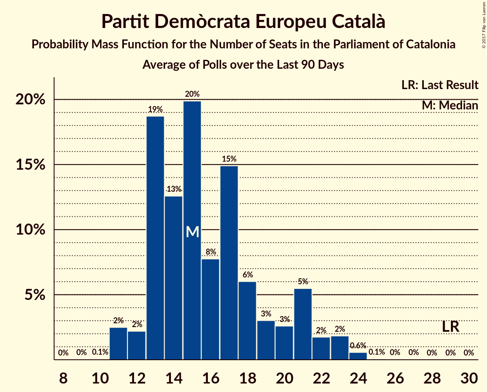

# Partit Demòcrata Europeu Català

<a href="#voting-intentions">Voting Intentions</a> | <a href="#seats">Seats</a>

## Voting Intentions

Last result: **39.6%** (General Election of 27 September 2015)

### Confidence Intervals

| Period     | Polling firm/Commissioner(s) | Median | 80% Confidence Interval | 90% Confidence Interval | 95% Confidence Interval | 99% Confidence Interval |
|:----------:|:----------------:|:-----------:|:-----------------------:|:-----------------------:|:-----------------------:|:-----------------------:|
| N/A | [Poll Average](average.html) | 12.0% | 7.9–14.2% | 7.4–14.8% | 7.0–15.3% | 6.3–16.3% |
| [16–21 October 2017](2017-10-21-NCReport.html) | NC Report   La Razón | 12.1% | 10.9–13.5% | 10.5–13.9% | 10.2–14.3% | 9.6–15.0% |
| [16–19 October 2017](2017-10-19-GESOP.html) | GESOP   El Periódico | 12.0% | 10.6–13.6% | 10.2–14.1% | 9.9–14.4% | 9.3–15.2% |
| [4–9 October 2017](2017-10-09-SocioMétrica.html) | SocioMétrica   El Español | 8.1% | 7.0–9.5% | 6.7–9.9% | 6.4–10.2% | 5.9–10.9% |
| [19–22 September 2017](2017-09-22-NCReport.html) | NC Report   La Razón | 12.7% | 11.5–13.9% | 11.2–14.3% | 10.9–14.6% | 10.4–15.3% |
| [12–15 September 2017](2017-09-15-Celeste-Tel.html) | Celeste-Tel   eldiario.es | 13.6% | 12.2–15.3% | 11.8–15.8% | 11.4–16.2% | 10.8–17.0% |
| [28 August–1 September 2017](2017-09-01-SocioMétrica.html) | SocioMétrica   El Español | 12.7% | 11.2–14.5% | 10.8–15.0% | 10.4–15.4% | 9.8–16.3% |

### Probability Mass Function

The following table shows the probability mass function per percentage block of voting intentions for the [poll average](average.html) for Partit Demòcrata Europeu Català.

| Voting Intentions | Probability | Accumulated | Special Marks |
|:-----------------:|:-----------:|:-----------:|:-------------:|
| 4.5–5.5% | 0% | 100% |  |
| 5.5–6.5% | 0.8% | 100% |  |
| 6.5–7.5% | 5% | 99.1% |  |
| 7.5–8.5% | 10% | 94% |  |
| 8.5–9.5% | 7% | 84% |  |
| 9.5–10.5% | 5% | 77% |  |
| 10.5–11.5% | 13% | 72% |  |
| 11.5–12.5% | 21% | 59% | Median |
| 12.5–13.5% | 20% | 38% |  |
| 13.5–14.5% | 12% | 19% |  |
| 14.5–15.5% | 5% | 7% |  |
| 15.5–16.5% | 2% | 2% |  |
| 16.5–17.5% | 0.3% | 0.3% |  |
| 17.5–18.5% | 0% | 0% |  |
| 18.5–19.5% | 0% | 0% |  |
| 19.5–20.5% | 0% | 0% |  |
| 20.5–21.5% | 0% | 0% |  |
| 21.5–22.5% | 0% | 0% |  |
| 22.5–23.5% | 0% | 0% |  |
| 23.5–24.5% | 0% | 0% |  |
| 24.5–25.5% | 0% | 0% |  |
| 25.5–26.5% | 0% | 0% |  |
| 26.5–27.5% | 0% | 0% |  |
| 27.5–28.5% | 0% | 0% |  |
| 28.5–29.5% | 0% | 0% |  |
| 29.5–30.5% | 0% | 0% |  |
| 30.5–31.5% | 0% | 0% |  |
| 31.5–32.5% | 0% | 0% |  |
| 32.5–33.5% | 0% | 0% |  |
| 33.5–34.5% | 0% | 0% |  |
| 34.5–35.5% | 0% | 0% |  |
| 35.5–36.5% | 0% | 0% |  |
| 36.5–37.5% | 0% | 0% |  |
| 37.5–38.5% | 0% | 0% |  |
| 38.5–39.5% | 0% | 0% |  |
| 39.5–40.5% | 0% | 0% | Last Result |

## Seats

Last result: **29** seats (General Election of 27 September 2015)

### Confidence Intervals

| Period     | Polling firm/Commissioner(s) | Median | 80% Confidence Interval | 90% Confidence Interval | 95% Confidence Interval | 99% Confidence Interval |
|:----------:|:----------------:|:------:|:-----------------------:|:-----------------------:|:-----------------------:|:-----------------------:|
| N/A | [Poll Average](average.html) | 17 | 11–21 | 10–22 | 9–23 | 8–24 |
| [16–21 October 2017](2017-10-21-NCReport.html) | NC Report   La Razón | 18 | 16–21 | 15–21 | 15–21 | 14–23 |
| [16–19 October 2017](2017-10-19-GESOP.html) | GESOP   El Periódico | 18 | 15–21 | 15–21 | 14–22 | 13–23 |
| [4–9 October 2017](2017-10-09-SocioMétrica.html) | SocioMétrica   El Español | 11 | 9–13 | 9–14 | 8–15 | 7–16 |
| [19–22 September 2017](2017-09-22-NCReport.html) | NC Report   La Razón | 19 | 17–21 | 17–21 | 16–22 | 15–23 |
| [12–15 September 2017](2017-09-15-Celeste-Tel.html) | Celeste-Tel   eldiario.es | 21 | 17–23 | 17–23 | 16–24 | 15–25 |
| [28 August–1 September 2017](2017-09-01-SocioMétrica.html) | SocioMétrica   El Español | 18 | 16–22 | 15–22 | 15–23 | 14–24 |

### Probability Mass Function

The following table shows the probability mass function per seat for the [poll average](average.html) for Partit Demòcrata Europeu Català.

| Number of Seats | Probability | Accumulated | Special Marks |
|:---------------:|:-----------:|:-----------:|:-------------:|
| 7 | 0.2% | 100% |  |
| 8 | 0.9% | 99.8% |  |
| 9 | 2% | 98.9% |  |
| 10 | 4% | 97% |  |
| 11 | 7% | 93% |  |
| 12 | 2% | 85% |  |
| 13 | 7% | 83% |  |
| 14 | 2% | 77% |  |
| 15 | 4% | 74% |  |
| 16 | 4% | 70% |  |
| 17 | 18% | 66% | Median |
| 18 | 14% | 48% |  |
| 19 | 9% | 34% |  |
| 20 | 6% | 25% |  |
| 21 | 11% | 19% |  |
| 22 | 4% | 8% |  |
| 23 | 3% | 4% |  |
| 24 | 0.9% | 1.0% |  |
| 25 | 0.1% | 0.2% |  |
| 26 | 0% | 0.1% |  |
| 27 | 0% | 0% |  |
| 28 | 0% | 0% |  |
| 29 | 0% | 0% | Last Result |

