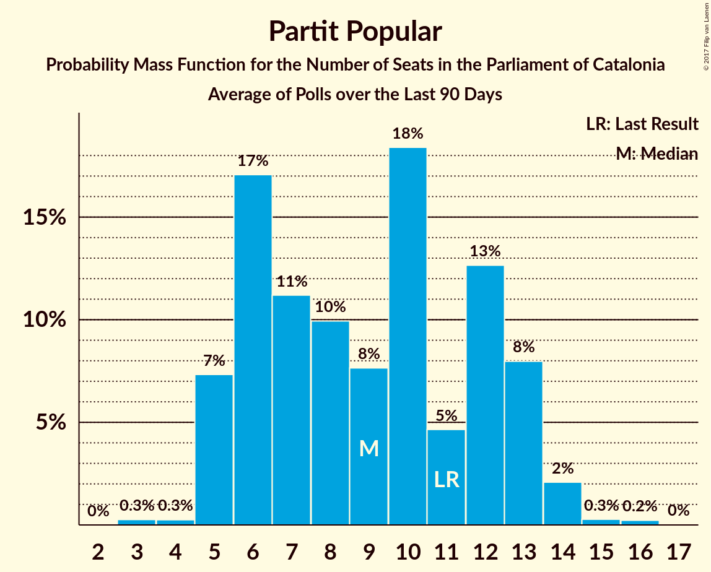

# Partit Popular

<a href="#voting-intentions">Voting Intentions</a> | <a href="#seats">Seats</a>

## Voting Intentions

Last result: **4.2%** (General Election of 21 December 2017)

### Confidence Intervals

| Period     | Polling firm/Commissioner(s) | Median | 80% Confidence Interval | 90% Confidence Interval | 95% Confidence Interval | 99% Confidence Interval |
|:----------:|:----------------:|:-----------:|:-----------------------:|:-----------------------:|:-----------------------:|:-----------------------:|
| N/A | [Poll Average](average.html) | 6.2% | 5.0–7.7% | 4.7–8.2% | 4.4–8.6% | 3.8–9.7% |
| [8 January 2021](2021-01-08-electoPanel.html) | electoPanel   electomania.es | 6.0% | 4.7–7.8% | 4.4–8.3% | 4.1–8.8% | 3.5–9.7% |
| [4–8 January 2021](2021-01-08-GAD3.html) | GAD3   La Vanguardia | 6.2% | 5.1–7.7% | 4.8–8.2% | 4.5–8.5% | 4.1–9.3% |
| [4–7 January 2021](2021-01-07-GESOP.html) | GESOP   El Periódico | 5.9% | 4.9–7.1% | 4.7–7.4% | 4.4–7.7% | 4.0–8.3% |
| [2–5 January 2021](2021-01-05-SocioMétrica.html) | SocioMétrica   El Español | 6.1% | 5.2–7.3% | 4.9–7.6% | 4.7–7.9% | 4.3–8.5% |
| [23–29 December 2020](2020-12-29-SocioMétrica.html) | SocioMétrica   El Español | 6.3% | 5.5–7.3% | 5.3–7.6% | 5.1–7.9% | 4.7–8.4% |
| [20 December 2020](2020-12-20-electoPanel.html) | electoPanel   electomania.es | 6.5% | 5.2–8.4% | 4.8–8.9% | 4.5–9.4% | 3.9–10.3% |
| [25 November–7 December 2020](2020-12-07-GESOP.html) | GESOP   CEO | 6.0% | 5.1–7.0% | 4.9–7.3% | 4.7–7.6% | 4.3–8.2% |
| [30 November–1 December 2020](2020-12-01-GESOP.html) | GESOP   El Periódico | 5.9% | 4.9–7.1% | 4.7–7.4% | 4.4–7.7% | 4.0–8.3% |
| [30 November 2020](2020-11-30-electoPanel.html) | electoPanel   electomania.es | 6.7% | 5.7–8.0% | 5.5–8.4% | 5.2–8.7% | 4.8–9.3% |
| [13 October–7 November 2020](2020-11-07-GESOP.html) | GESOP   CEO | 7.0% | 6.2–8.0% | 5.9–8.3% | 5.7–8.5% | 5.3–9.0% |
| [19–23 October 2020](2020-10-23-GESOP.html) | GESOP | 6.2% | 5.5–7.1% | 5.3–7.4% | 5.1–7.6% | 4.8–8.0% |
| [17 October 2020](2020-10-17-KeyData.html) | Key Data   Público | 6.4% | 5.0–8.4% | 4.6–8.9% | 4.3–9.4% | 3.7–10.4% |
| [29 September–9 October 2020](2020-10-09-GESOP.html) | GESOP   CEO | 6.1% | 5.2–7.1% | 4.9–7.5% | 4.7–7.7% | 4.3–8.3% |
| [28 September–2 October 2020](2020-10-02-NCReport.html) | NC Report   La Razón | 7.6% | 6.4–9.0% | 6.1–9.4% | 5.9–9.7% | 5.3–10.4% |
| [1–4 September 2020](2020-09-04-GAD3.html) | GAD3   La Vanguardia | 6.5% | 5.3–8.0% | 5.0–8.5% | 4.7–8.9% | 4.2–9.6% |
| [31 August 2020](2020-08-31-electoPanel.html) | electoPanel   electomania.es | 7.1% | 6.7–7.5% | 6.6–7.6% | 6.6–7.7% | 6.4–7.9% |
| [25 June–21 July 2020](2020-07-21-GESOP.html) | GESOP   CEO | 5.5% | 4.8–6.4% | 4.6–6.6% | 4.4–6.8% | 4.1–7.3% |
| [6–13 July 2020](2020-07-13-GESOP.html) | GESOP   El Periódico | 6.1% | 5.3–7.0% | 5.2–7.2% | 5.0–7.4% | 4.6–7.9% |
| [29 June–2 July 2020](2020-07-02-Feedback.html) | Feedback   El Nacional | 5.8% | 4.8–7.0% | 4.6–7.3% | 4.3–7.6% | 3.9–8.2% |
| [1 April–15 May 2020](2020-05-15-electoPanel.html) | electoPanel   electomania.es | 8.7% | 7.7–10.0% | 7.3–10.3% | 7.1–10.6% | 6.6–11.2% |
| [29 April–8 May 2020](2020-05-08-GESOP.html) | GESOP   El Periódico | 6.3% | 5.6–7.2% | 5.4–7.5% | 5.2–7.7% | 4.8–8.2% |
| [10 February–9 March 2020](2020-03-09-GESOP.html) | GESOP   CEO | 5.5% | 4.8–6.4% | 4.6–6.6% | 4.4–6.8% | 4.1–7.3% |
| [21–26 February 2020](2020-02-26-GAD3.html) | GAD3   ABC | 7.2% | 6.2–8.6% | 5.9–8.9% | 5.6–9.3% | 5.2–9.9% |
| [6 February 2020](2020-02-06-KeyData.html) | Key Data   Público | 4.7% | 3.6–6.3% | 3.3–6.8% | 3.0–7.2% | 2.6–8.1% |
| [3–6 February 2020](2020-02-06-GAD3.html) | GAD3   La Vanguardia | 6.7% | 5.5–8.3% | 5.2–8.7% | 4.9–9.1% | 4.4–9.9% |
| [2 February 2020](2020-02-02-SocioMétrica.html) | SocioMétrica   El Español | 6.2% | 5.0–7.8% | 4.7–8.3% | 4.4–8.7% | 3.9–9.5% |
| [27–31 January 2020](2020-01-31-NCReport.html) | NC Report   La Razón | 8.9% | 7.7–10.4% | 7.4–10.9% | 7.1–11.2% | 6.5–12.0% |
| [27–31 January 2020](2020-01-31-GESOP.html) | GESOP   El Periódico | 4.8% | 4.1–5.6% | 4.0–5.9% | 3.8–6.1% | 3.5–6.5% |
| [27–29 January 2020](2020-01-29-electoPanel.html) | electoPanel   electomania.es | 8.4% | 7.5–9.4% | 7.3–9.7% | 7.1–9.9% | 6.7–10.4% |
| [14 November–5 December 2019](2019-12-05-GESOP.html) | GESOP   CEO | 4.3% | 3.6–5.2% | 3.4–5.5% | 3.2–5.7% | 2.9–6.2% |
| [27–30 November 2019](2019-11-30-electoPanel.html) | electoPanel   electomania.es | 7.9% | 7.1–8.9% | 6.8–9.2% | 6.6–9.5% | 6.2–10.0% |
| [18–22 November 2019](2019-11-22-NCReport.html) | NC Report   La Razón | 8.7% | 7.5–10.2% | 7.2–10.6% | 6.9–11.0% | 6.4–11.7% |
| [16–19 October 2019](2019-10-19-electoPanel.html) | electoPanel   electomania.es | 6.0% | 5.4–6.7% | 5.2–7.0% | 5.0–7.1% | 4.8–7.5% |
| [14–15 October 2019](2019-10-15-electoPanel.html) | electoPanel   electomania.es | 5.0% | 4.2–6.0% | 4.0–6.3% | 3.8–6.5% | 3.5–7.1% |
| [1–5 October 2019](2019-10-05-NCReport.html) | NC Report   La Razón | 5.5% | 4.5–6.8% | 4.3–7.1% | 4.0–7.4% | 3.6–8.1% |
| [11 September 2019](2019-09-11-electoPanel.html) | electoPanel   electomania.es | 6.3% | 5.4–7.4% | 5.2–7.7% | 5.0–8.0% | 4.6–8.6% |
| [3–7 September 2019](2019-09-07-NCReport.html) | NC Report   La Razón | 4.8% | 3.9–6.0% | 3.6–6.3% | 3.4–6.6% | 3.0–7.2% |
| [20 August 2019](2019-08-20-electoPanel.html) | electoPanel   electomania.es | 6.0% | 5.1–7.1% | 4.9–7.4% | 4.7–7.7% | 4.3–8.2% |
| [17 July 2019](2019-07-17-electoPanel.html) | electoPanel   electomania.es | 6.2% | 5.3–7.3% | 5.1–7.6% | 4.9–7.9% | 4.5–8.4% |
| [25–17 July 2019](2019-07-17-GESOP.html) | GESOP   CEO | 3.5% | 2.9–4.4% | 2.7–4.6% | 2.6–4.8% | 2.3–5.3% |
| [1–5 July 2019](2019-07-05-GESOP.html) | GESOP   El Periódico | 4.0% | 3.4–4.8% | 3.2–5.0% | 3.1–5.2% | 2.8–5.5% |
| [4–25 March 2019](2019-03-25-Opinòmetre.html) | Opinòmetre   CEO | 4.0% | 3.3–4.9% | 3.1–5.2% | 3.0–5.4% | 2.7–5.8% |
| [10 February 2019](2019-02-10-GESOP.html) | GESOP   El Periódico | 4.0% | 3.4–4.8% | 3.3–5.0% | 3.1–5.2% | 2.9–5.5% |
| [24 December 2018](2018-12-24-NCReport.html) | NC Report   La Razón | 4.4% | 3.6–5.6% | 3.4–5.9% | 3.2–6.2% | 2.8–6.8% |
| [3–12 December 2018](2018-12-12-Opinòmetre.html) | Opinòmetre   Ara | 2.5% | 1.9–3.4% | 1.8–3.6% | 1.6–3.8% | 1.4–4.3% |
| [22 October–12 November 2018](2018-11-12-Opinòmetre.html) | Opinòmetre   CEO | 3.3% | 2.7–4.2% | 2.5–4.4% | 2.4–4.6% | 2.1–5.1% |
| [22–25 October 2018](2018-10-25-GESOP.html) | GESOP   El Periódico | 3.5% | 2.8–4.6% | 2.6–4.8% | 2.4–5.1% | 2.1–5.7% |
| [24–28 September 2018](2018-09-28-NCReport.html) | NC Report   La Razón | 5.3% | 4.5–6.3% | 4.3–6.6% | 4.1–6.9% | 3.7–7.4% |
| [16–18 September 2018](2018-09-18-electoPanel.html) | electoPanel   electomania.es | 3.2% | 2.6–4.0% | 2.4–4.3% | 2.3–4.5% | 2.0–4.9% |
| [22–30 August 2018](2018-08-30-SocioMétrica.html) | SocioMétrica   El Español | 5.2% | 4.1–6.7% | 3.8–7.1% | 3.6–7.5% | 3.1–8.3% |
| [23 June–14 July 2018](2018-07-14-Opinòmetre.html) | Opinòmetre   CEO | 3.8% | 3.1–4.7% | 3.0–4.9% | 2.8–5.2% | 2.5–5.6% |
| [2–11 July 2018](2018-07-11-GESOP.html) | GESOP   El Periódico | 4.5% | 3.9–5.3% | 3.7–5.5% | 3.5–5.7% | 3.3–6.1% |
| [14–21 June 2018](2018-06-21-GAD3.html) | GAD3   La Vanguardia | 4.2% | 3.3–5.4% | 3.0–5.8% | 2.8–6.1% | 2.5–6.7% |
| [3–7 June 2018](2018-06-07-electoPanel.html) | electoPanel   electomania.es | 4.9% | 4.1–5.9% | 3.9–6.2% | 3.7–6.4% | 3.4–6.9% |
| [7–27 April 2018](2018-04-27-Opinòmetre.html) | Opinòmetre   CEO | 4.1% | 3.4–5.0% | 3.2–5.3% | 3.1–5.5% | 2.8–6.0% |
| [17–20 April 2018](2018-04-20-NCReport.html) | NC Report   La Razón | 4.6% | 3.7–5.7% | 3.5–6.0% | 3.3–6.3% | 2.9–6.8% |
| [22–28 March 2018](2018-03-28-NCReport.html) | NC Report   La Razón | 4.8% | 4.0–6.0% | 3.7–6.3% | 3.5–6.6% | 3.1–7.2% |
| [10–30 January 2018](2018-01-30-Apolda.html) | Apolda   CEO | 4.7% | 3.8–5.7% | 3.6–6.1% | 3.4–6.3% | 3.0–6.9% |
| [15–19 January 2018](2018-01-19-NCReport.html) | NC Report   La Razón | 5.9% | 4.9–7.1% | 4.6–7.5% | 4.4–7.8% | 4.0–8.4% |

### Probability Mass Function

The following table shows the probability mass function per percentage block of voting intentions for the [poll average](average.html) for Partit Popular.

| Voting Intentions | Probability | Accumulated | Special Marks |
|:-----------------:|:-----------:|:-----------:|:-------------:|
| 1.5–2.5% | 0% | 100% |  |
| 2.5–3.5% | 0.2% | 100% |  |
| 3.5–4.5% | 4% | 99.8% | Last Result |
| 4.5–5.5% | 21% | 96% |  |
| 5.5–6.5% | 38% | 75% | Median |
| 6.5–7.5% | 25% | 37% |  |
| 7.5–8.5% | 9% | 12% |  |
| 8.5–9.5% | 2% | 3% |  |
| 9.5–10.5% | 0.5% | 0.6% |  |
| 10.5–11.5% | 0.1% | 0.1% |  |
| 11.5–12.5% | 0% | 0% |  |

## Seats

Last result: **4** seats (General Election of 21 December 2017)

### Confidence Intervals

| Period     | Polling firm/Commissioner(s) | Median | 80% Confidence Interval | 90% Confidence Interval | 95% Confidence Interval | 99% Confidence Interval |
|:----------:|:----------------:|:------:|:-----------------------:|:-----------------------:|:-----------------------:|:-----------------------:|
| N/A | [Poll Average](average.html) | 7 | 5–10 | 5–11 | 4–12 | 3–13 |
| [8 January 2021](2021-01-08-electoPanel.html) | electoPanel   electomania.es | 7 | 5–9 | 3–10 | 3–11 | 3–13 |
| [4–8 January 2021](2021-01-08-GAD3.html) | GAD3   La Vanguardia | 8 | 6–10 | 5–11 | 5–12 | 4–12 |
| [4–7 January 2021](2021-01-07-GESOP.html) | GESOP   El Periódico | 7 | 5–9 | 5–9 | 5–10 | 3–11 |
| [2–5 January 2021](2021-01-05-SocioMétrica.html) | SocioMétrica   El Español | 7 | 6–9 | 6–10 | 5–10 | 5–11 |
| [23–29 December 2020](2020-12-29-SocioMétrica.html) | SocioMétrica   El Español | 7 | 7–9 | 6–10 | 6–10 | 5–11 |
| [20 December 2020](2020-12-20-electoPanel.html) | electoPanel   electomania.es | 8 | 6–11 | 5–12 | 5–13 | 3–14 |
| [25 November–7 December 2020](2020-12-07-GESOP.html) | GESOP   CEO | 7 | 6–9 | 5–9 | 5–10 | 5–10 |
| [30 November–1 December 2020](2020-12-01-GESOP.html) | GESOP   El Periódico | 7 | 6–9 | 5–10 | 5–10 | 3–12 |
| [30 November 2020](2020-11-30-electoPanel.html) | electoPanel   electomania.es | 9 | 7–10 | 7–11 | 6–12 | 5–12 |
| [13 October–7 November 2020](2020-11-07-GESOP.html) | GESOP   CEO | 9 | 7–10 | 7–11 | 7–12 | 7–12 |
| [19–23 October 2020](2020-10-23-GESOP.html) | GESOP | 7 | 7–9 | 7–9 | 6–10 | 5–10 |
| [17 October 2020](2020-10-17-KeyData.html) | Key Data   Público | 8 | 6–11 | 5–12 | 5–12 | 3–14 |
| [29 September–9 October 2020](2020-10-09-GESOP.html) | GESOP   CEO | 7 | 6–9 | 6–9 | 5–10 | 5–11 |
| [28 September–2 October 2020](2020-10-02-NCReport.html) | NC Report   La Razón | 10 | 7–12 | 7–12 | 7–13 | 6–14 |
| [1–4 September 2020](2020-09-04-GAD3.html) | GAD3   La Vanguardia | 8 | 6–10 | 5–11 | 5–12 | 4–13 |
| [31 August 2020](2020-08-31-electoPanel.html) | electoPanel   electomania.es | 9 | 9–10 | 8–10 | 8–10 | 8–10 |
| [25 June–21 July 2020](2020-07-21-GESOP.html) | GESOP   CEO | 7 | 5–7 | 5–8 | 5–9 | 4–9 |
| [6–13 July 2020](2020-07-13-GESOP.html) | GESOP   El Periódico | 7 | 6–9 | 5–9 | 5–9 | 5–10 |
| [29 June–2 July 2020](2020-07-02-Feedback.html) | Feedback   El Nacional | 7 | 5–9 | 5–9 | 4–9 | 3–10 |
| [1 April–15 May 2020](2020-05-15-electoPanel.html) | electoPanel   electomania.es | 12 | 10–13 | 9–14 | 9–14 | 8–15 |
| [29 April–8 May 2020](2020-05-08-GESOP.html) | GESOP   El Periódico | 8 | 7–9 | 7–9 | 6–10 | 5–10 |
| [10 February–9 March 2020](2020-03-09-GESOP.html) | GESOP   CEO | 7 | 5–7 | 5–8 | 5–8 | 4–9 |
| [21–26 February 2020](2020-02-26-GAD3.html) | GAD3   ABC | 9 | 7–11 | 7–12 | 7–12 | 6–13 |
| [6 February 2020](2020-02-06-KeyData.html) | Key Data   Público | 5 | 3–7 | 3–8 | 2–9 | 0–10 |
| [3–6 February 2020](2020-02-06-GAD3.html) | GAD3   La Vanguardia | 9 | 7–10 | 6–11 | 5–12 | 5–13 |
| [2 February 2020](2020-02-02-SocioMétrica.html) | SocioMétrica   El Español | 7 | 5–10 | 5–10 | 5–11 | 3–12 |
| [27–31 January 2020](2020-01-31-NCReport.html) | NC Report   La Razón | 12 | 10–14 | 9–15 | 9–15 | 8–16 |
| [27–31 January 2020](2020-01-31-GESOP.html) | GESOP   El Periódico | 5 | 4–7 | 3–7 | 3–7 | 3–8 |
| [27–29 January 2020](2020-01-29-electoPanel.html) | electoPanel   electomania.es | 11 | 9–12 | 9–12 | 9–13 | 8–14 |
| [14 November–5 December 2019](2019-12-05-GESOP.html) | GESOP   CEO | 5 | 3–6 | 3–7 | 2–7 | 0–7 |
| [27–30 November 2019](2019-11-30-electoPanel.html) | electoPanel   electomania.es | 11 | 9–12 | 9–12 | 8–12 | 7–14 |
| [18–22 November 2019](2019-11-22-NCReport.html) | NC Report   La Razón | 12 | 10–14 | 9–14 | 9–15 | 7–15 |
| [16–19 October 2019](2019-10-19-electoPanel.html) | electoPanel   electomania.es | 7 | 6–9 | 6–9 | 6–9 | 5–10 |
| [14–15 October 2019](2019-10-15-electoPanel.html) | electoPanel   electomania.es | 6 | 4–7 | 3–7 | 3–8 | 3–9 |
| [1–5 October 2019](2019-10-05-NCReport.html) | NC Report   La Razón | 7 | 5–9 | 5–9 | 3–9 | 3–10 |
| [11 September 2019](2019-09-11-electoPanel.html) | electoPanel   electomania.es | 8 | 7–9 | 6–10 | 6–10 | 5–11 |
| [3–7 September 2019](2019-09-07-NCReport.html) | NC Report   La Razón | 6 | 3–7 | 3–7 | 3–9 | 2–9 |
| [20 August 2019](2019-08-20-electoPanel.html) | electoPanel   electomania.es | 7 | 6–9 | 6–9 | 5–10 | 5–10 |
| [17 July 2019](2019-07-17-electoPanel.html) | electoPanel   electomania.es | 7 | 6–9 | 6–10 | 6–10 | 5–11 |
| [25–17 July 2019](2019-07-17-GESOP.html) | GESOP   CEO | 3 | 0–5 | 0–5 | 0–5 | 0–6 |
| [1–5 July 2019](2019-07-05-GESOP.html) | GESOP   El Periódico | 3 | 3–5 | 3–6 | 2–6 | 0–7 |
| [4–25 March 2019](2019-03-25-Opinòmetre.html) | Opinòmetre   CEO | 3 | 3–5 | 2–6 | 2–6 | 0–7 |
| [10 February 2019](2019-02-10-GESOP.html) | GESOP   El Periódico | 3 | 3–6 | 3–6 | 2–6 | 0–7 |
| [24 December 2018](2018-12-24-NCReport.html) | NC Report   La Razón | 5 | 3–7 | 3–7 | 2–7 | 0–9 |
| [3–12 December 2018](2018-12-12-Opinòmetre.html) | Opinòmetre   Ara | 0 | 0–3 | 0–3 | 0–3 | 0–5 |
| [22 October–12 November 2018](2018-11-12-Opinòmetre.html) | Opinòmetre   CEO | 3 | 0–4 | 0–5 | 0–5 | 0–6 |
| [22–25 October 2018](2018-10-25-GESOP.html) | GESOP   El Periódico | 3 | 0–5 | 0–6 | 0–6 | 0–7 |
| [24–28 September 2018](2018-09-28-NCReport.html) | NC Report   La Razón | 7 | 5–7 | 5–9 | 3–9 | 3–9 |
| [16–18 September 2018](2018-09-18-electoPanel.html) | electoPanel   electomania.es | 2 | 0–3 | 0–4 | 0–5 | 0–6 |
| [22–30 August 2018](2018-08-30-SocioMétrica.html) | SocioMétrica   El Español | 6 | 3–8 | 3–9 | 3–9 | 2–10 |
| [23 June–14 July 2018](2018-07-14-Opinòmetre.html) | Opinòmetre   CEO | 3 | 2–5 | 2–6 | 0–6 | 0–7 |
| [2–11 July 2018](2018-07-11-GESOP.html) | GESOP   El Periódico | 5 | 3–6 | 3–7 | 3–7 | 3–7 |
| [14–21 June 2018](2018-06-21-GAD3.html) | GAD3   La Vanguardia | 3 | 3–6 | 2–7 | 0–7 | 0–8 |
| [3–7 June 2018](2018-06-07-electoPanel.html) | electoPanel   electomania.es | 6 | 3–7 | 3–7 | 3–7 | 3–8 |
| [7–27 April 2018](2018-04-27-Opinòmetre.html) | Opinòmetre   CEO | 3 | 3–6 | 2–6 | 2–7 | 0–7 |
| [17–20 April 2018](2018-04-20-NCReport.html) | NC Report   La Razón | 5 | 3–7 | 3–7 | 3–7 | 2–9 |
| [22–28 March 2018](2018-03-28-NCReport.html) | NC Report   La Razón | 6 | 3–7 | 3–7 | 3–8 | 2–9 |
| [10–30 January 2018](2018-01-30-Apolda.html) | Apolda   CEO | 5 | 3–7 | 3–7 | 3–7 | 2–9 |
| [15–19 January 2018](2018-01-19-NCReport.html) | NC Report   La Razón | 7 | 6–9 | 5–9 | 5–10 | 3–10 |

### Probability Mass Function

The following table shows the probability mass function per seat for the [poll average](average.html) for Partit Popular.

| Number of Seats | Probability | Accumulated | Special Marks |
|:---------------:|:-----------:|:-----------:|:-------------:|
| 2 | 0.1% | 100% |  |
| 3 | 2% | 99.9% |  |
| 4 | 1.1% | 98% | Last Result |
| 5 | 9% | 97% |  |
| 6 | 11% | 88% |  |
| 7 | 38% | 78% | Median |
| 8 | 9% | 40% |  |
| 9 | 18% | 30% |  |
| 10 | 7% | 12% |  |
| 11 | 2% | 5% |  |
| 12 | 2% | 3% |  |
| 13 | 0.2% | 0.6% |  |
| 14 | 0.3% | 0.4% |  |
| 15 | 0.1% | 0.1% |  |
| 16 | 0% | 0% |  |

