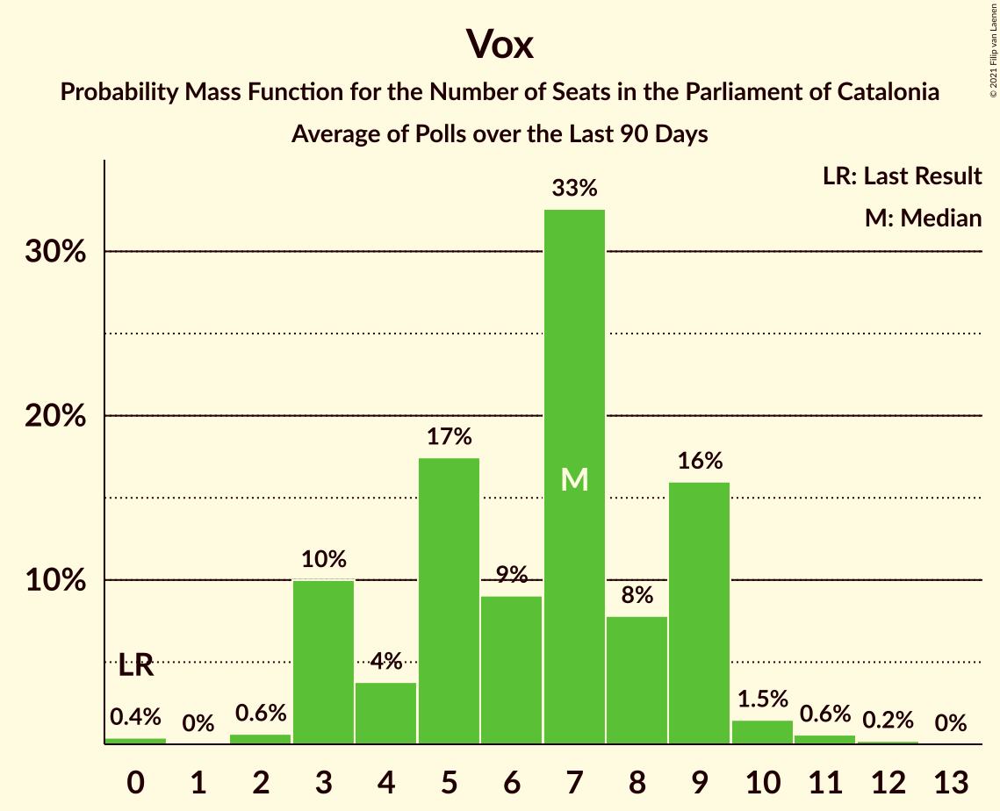

# Vox

<a href="#voting-intentions">Voting Intentions</a> | <a href="#seats">Seats</a>

## Voting Intentions

Last result: **0.0%** (General Election of 21 December 2017)

### Confidence Intervals

| Period     | Polling firm/Commissioner(s) | Median | 80% Confidence Interval | 90% Confidence Interval | 95% Confidence Interval | 99% Confidence Interval |
|:----------:|:----------------:|:-----------:|:-----------------------:|:-----------------------:|:-----------------------:|:-----------------------:|
| N/A | [Poll Average](average.html) | 4.2% | 3.2–5.6% | 3.0–6.1% | 2.8–6.4% | 2.4–7.1% |
| [25 June–21 July 2020](2020-07-21-GESOP.html) | GESOP   CEO | 4.0% | 3.4–4.8% | 3.2–5.0% | 3.1–5.2% | 2.8–5.5% |
| [6–13 July 2020](2020-07-13-GESOP.html) | GESOP   El Periódico | 5.4% | 4.7–6.2% | 4.5–6.5% | 4.4–6.7% | 4.1–7.1% |
| [29 June–2 July 2020](2020-07-02-Feedback.html) | Feedback   El Nacional | 5.1% | 4.3–6.3% | 4.0–6.6% | 3.8–6.9% | 3.4–7.5% |
| [1 April–15 May 2020](2020-05-15-electoPanel.html) | electoPanel   electomania.es | 3.5% | 2.9–4.4% | 2.7–4.6% | 2.5–4.8% | 2.2–5.3% |
| [29 April–8 May 2020](2020-05-08-GESOP.html) | GESOP   El Periódico | 3.8% | 3.2–4.5% | 3.0–4.7% | 2.9–4.9% | 2.7–5.3% |
| [10 February–9 March 2020](2020-03-09-GESOP.html) | GESOP   CEO | 3.0% | 2.5–3.7% | 2.3–3.9% | 2.2–4.0% | 2.0–4.4% |
| [21–26 February 2020](2020-02-26-GAD3.html) | GAD3   ABC | 4.4% | 3.6–5.5% | 3.4–5.8% | 3.2–6.0% | 2.8–6.6% |
| [3–6 February 2020](2020-02-06-GAD3.html) | GAD3   La Vanguardia | 4.4% | 3.5–5.7% | 3.2–6.1% | 3.0–6.4% | 2.6–7.1% |
| [2 February 2020](2020-02-02-SocioMétrica.html) | SocioMétrica   El Español | 4.8% | 3.8–6.3% | 3.5–6.7% | 3.2–7.1% | 2.8–7.8% |
| [27–31 January 2020](2020-01-31-NCReport.html) | NC Report   La Razón | 6.2% | 5.2–7.5% | 4.9–7.9% | 4.7–8.2% | 4.3–8.9% |
| [27–31 January 2020](2020-01-31-GESOP.html) | GESOP   El Periódico | 5.5% | 4.8–6.4% | 4.6–6.6% | 4.4–6.8% | 4.1–7.2% |
| [27–29 January 2020](2020-01-29-electoPanel.html) | electoPanel   electomania.es | 6.2% | 5.5–7.1% | 5.3–7.3% | 5.1–7.5% | 4.8–8.0% |
| [14 November–5 December 2019](2019-12-05-GESOP.html) | GESOP   CEO | 2.0% | 1.5–2.7% | 1.4–2.9% | 1.3–3.0% | 1.1–3.4% |
| [27–30 November 2019](2019-11-30-electoPanel.html) | electoPanel   electomania.es | 7.5% | 6.7–8.5% | 6.4–8.8% | 6.2–9.0% | 5.9–9.5% |
| [18–22 November 2019](2019-11-22-NCReport.html) | NC Report   La Razón | 6.5% | 5.4–7.8% | 5.1–8.1% | 4.9–8.5% | 4.5–9.1% |
| [16–19 October 2019](2019-10-19-electoPanel.html) | electoPanel   electomania.es | 3.3% | 2.8–3.9% | 2.7–4.0% | 2.6–4.2% | 2.4–4.5% |
| [14–15 October 2019](2019-10-15-electoPanel.html) | electoPanel   electomania.es | 4.0% | 3.3–4.9% | 3.1–5.2% | 2.9–5.4% | 2.7–5.9% |
| [1–5 October 2019](2019-10-05-NCReport.html) | NC Report   La Razón | 2.0% | 1.4–2.8% | 1.3–3.1% | 1.2–3.3% | 1.0–3.7% |
| [11 September 2019](2019-09-11-electoPanel.html) | electoPanel   electomania.es | 1.8% | 1.4–2.5% | 1.2–2.7% | 1.1–2.8% | 1.0–3.2% |
| [3–7 September 2019](2019-09-07-NCReport.html) | NC Report   La Razón | 2.2% | 1.7–3.1% | 1.5–3.4% | 1.4–3.6% | 1.2–4.1% |
| [20 August 2019](2019-08-20-electoPanel.html) | electoPanel   electomania.es | 2.0% | N/A | N/A | N/A | N/A |
| [17 July 2019](2019-07-17-electoPanel.html) | electoPanel   electomania.es | 2.1% | N/A | N/A | N/A | N/A |
| [25–17 July 2019](2019-07-17-GESOP.html) | GESOP   CEO | 0.0% | N/A | N/A | N/A | N/A |
| [1–5 July 2019](2019-07-05-GESOP.html) | GESOP   El Periódico | 0.0% | N/A | N/A | N/A | N/A |
| [4–25 March 2019](2019-03-25-Opinòmetre.html) | Opinòmetre   CEO | 0.0% | N/A | N/A | N/A | N/A |
| [10 February 2019](2019-02-10-GESOP.html) | GESOP   El Periódico | 2.5% | N/A | N/A | N/A | N/A |
| [24 December 2018](2018-12-24-NCReport.html) | NC Report   La Razón | 2.0% | N/A | N/A | N/A | N/A |
| [3–12 December 2018](2018-12-12-Opinòmetre.html) | Opinòmetre   Ara | 1.1% | N/A | N/A | N/A | N/A |
| [22 October–12 November 2018](2018-11-12-Opinòmetre.html) | Opinòmetre   CEO | 0.0% | N/A | N/A | N/A | N/A |
| [22–25 October 2018](2018-10-25-GESOP.html) | GESOP   El Periódico | 0.0% | N/A | N/A | N/A | N/A |
| [24–28 September 2018](2018-09-28-NCReport.html) | NC Report   La Razón | 0.0% | N/A | N/A | N/A | N/A |
| [16–18 September 2018](2018-09-18-electoPanel.html) | electoPanel   electomania.es | 0.0% | N/A | N/A | N/A | N/A |
| [22–30 August 2018](2018-08-30-SocioMétrica.html) | SocioMétrica   El Español | 0.0% | N/A | N/A | N/A | N/A |
| [23 June–14 July 2018](2018-07-14-Opinòmetre.html) | Opinòmetre   CEO | 0.0% | N/A | N/A | N/A | N/A |
| [2–11 July 2018](2018-07-11-GESOP.html) | GESOP   El Periódico | 0.0% | N/A | N/A | N/A | N/A |
| [14–21 June 2018](2018-06-21-GAD3.html) | GAD3   La Vanguardia | 0.0% | N/A | N/A | N/A | N/A |
| [3–7 June 2018](2018-06-07-electoPanel.html) | electoPanel   electomania.es | 0.0% | N/A | N/A | N/A | N/A |
| [7–27 April 2018](2018-04-27-Opinòmetre.html) | Opinòmetre   CEO | 0.0% | N/A | N/A | N/A | N/A |
| [17–20 April 2018](2018-04-20-NCReport.html) | NC Report   La Razón | 0.0% | N/A | N/A | N/A | N/A |
| [22–28 March 2018](2018-03-28-NCReport.html) | NC Report   La Razón | 0.0% | N/A | N/A | N/A | N/A |
| [10–30 January 2018](2018-01-30-Apolda.html) | Apolda   CEO | 0.0% | N/A | N/A | N/A | N/A |
| [15–19 January 2018](2018-01-19-NCReport.html) | NC Report   La Razón | 0.0% | N/A | N/A | N/A | N/A |

### Probability Mass Function

The following table shows the probability mass function per percentage block of voting intentions for the [poll average](average.html) for Vox.

| Voting Intentions | Probability | Accumulated | Special Marks |
|:-----------------:|:-----------:|:-----------:|:-------------:|
| 0.0–0.5% | 0% | 100% | Last Result |
| 0.5–1.5% | 0% | 100% |  |
| 1.5–2.5% | 0.9% | 100% |  |
| 2.5–3.5% | 21% | 99.1% |  |
| 3.5–4.5% | 43% | 78% | Median |
| 4.5–5.5% | 23% | 35% |  |
| 5.5–6.5% | 9% | 11% |  |
| 6.5–7.5% | 2% | 2% |  |
| 7.5–8.5% | 0.1% | 0.1% |  |
| 8.5–9.5% | 0% | 0% |  |

## Seats

Last result: **0** seats (General Election of 21 December 2017)

### Confidence Intervals

| Period     | Polling firm/Commissioner(s) | Median | 80% Confidence Interval | 90% Confidence Interval | 95% Confidence Interval | 99% Confidence Interval |
|:----------:|:----------------:|:------:|:-----------------------:|:-----------------------:|:-----------------------:|:-----------------------:|
| N/A | [Poll Average](average.html) | 3 | 2–7 | 0–7 | 0–7 | 0–9 |
| [25 June–21 July 2020](2020-07-21-GESOP.html) | GESOP   CEO | 3 | 3–5 | 3–5 | 2–6 | 0–7 |
| [6–13 July 2020](2020-07-13-GESOP.html) | GESOP   El Periódico | 7 | 5–7 | 5–8 | 5–9 | 3–9 |
| [29 June–2 July 2020](2020-07-02-Feedback.html) | Feedback   El Nacional | 6 | 4–7 | 3–8 | 3–9 | 3–9 |
| [1 April–15 May 2020](2020-05-15-electoPanel.html) | electoPanel   electomania.es | 3 | 0–4 | 0–5 | 0–5 | 0–6 |
| [29 April–8 May 2020](2020-05-08-GESOP.html) | GESOP   El Periódico | 3 | 3–5 | 2–5 | 2–6 | 0–6 |
| [10 February–9 March 2020](2020-03-09-GESOP.html) | GESOP   CEO | 2 | 0–3 | 0–3 | 0–3 | 0–4 |
| [21–26 February 2020](2020-02-26-GAD3.html) | GAD3   ABC | 5 | 3–7 | 3–7 | 2–7 | 0–8 |
| [3–6 February 2020](2020-02-06-GAD3.html) | GAD3   La Vanguardia | 4 | 3–7 | 2–7 | 0–7 | 0–9 |
| [2 February 2020](2020-02-02-SocioMétrica.html) | SocioMétrica   El Español | 5 | 3–7 | 3–8 | 2–9 | 0–10 |
| [27–31 January 2020](2020-01-31-NCReport.html) | NC Report   La Razón | 7 | 6–10 | 5–10 | 5–10 | 4–12 |
| [27–31 January 2020](2020-01-31-GESOP.html) | GESOP   El Periódico | 7 | 5–8 | 5–8 | 5–9 | 3–9 |
| [27–29 January 2020](2020-01-29-electoPanel.html) | electoPanel   electomania.es | 7 | 6–8 | 6–9 | 6–9 | 5–10 |
| [14 November–5 December 2019](2019-12-05-GESOP.html) | GESOP   CEO | 0 | 0 | 0 | 0–2 | 0–3 |
| [27–30 November 2019](2019-11-30-electoPanel.html) | electoPanel   electomania.es | 9 | 8–12 | 7–12 | 7–12 | 7–12 |
| [18–22 November 2019](2019-11-22-NCReport.html) | NC Report   La Razón | 8 | 7–10 | 6–10 | 5–11 | 5–12 |
| [16–19 October 2019](2019-10-19-electoPanel.html) | electoPanel   electomania.es | 3 | 3 | 0–3 | 0–3 | 0–3 |
| [14–15 October 2019](2019-10-15-electoPanel.html) | electoPanel   electomania.es | 3 | 3–6 | 2–6 | 2–6 | 0–7 |
| [1–5 October 2019](2019-10-05-NCReport.html) | NC Report   La Razón | 0 | 0–3 | 0–3 | 0–3 | 0–4 |
| [11 September 2019](2019-09-11-electoPanel.html) | electoPanel   electomania.es | 0 | 0 | 0 | 0 | 0–2 |
| [3–7 September 2019](2019-09-07-NCReport.html) | NC Report   La Razón | 0 | 0–2 | 0–3 | 0–3 | 0–3 |
| [20 August 2019](2019-08-20-electoPanel.html) | electoPanel   electomania.es |  |  |  |  |  |
| [17 July 2019](2019-07-17-electoPanel.html) | electoPanel   electomania.es |  |  |  |  |  |
| [25–17 July 2019](2019-07-17-GESOP.html) | GESOP   CEO |  |  |  |  |  |
| [1–5 July 2019](2019-07-05-GESOP.html) | GESOP   El Periódico |  |  |  |  |  |
| [4–25 March 2019](2019-03-25-Opinòmetre.html) | Opinòmetre   CEO |  |  |  |  |  |
| [10 February 2019](2019-02-10-GESOP.html) | GESOP   El Periódico |  |  |  |  |  |
| [24 December 2018](2018-12-24-NCReport.html) | NC Report   La Razón |  |  |  |  |  |
| [3–12 December 2018](2018-12-12-Opinòmetre.html) | Opinòmetre   Ara |  |  |  |  |  |
| [22 October–12 November 2018](2018-11-12-Opinòmetre.html) | Opinòmetre   CEO |  |  |  |  |  |
| [22–25 October 2018](2018-10-25-GESOP.html) | GESOP   El Periódico |  |  |  |  |  |
| [24–28 September 2018](2018-09-28-NCReport.html) | NC Report   La Razón |  |  |  |  |  |
| [16–18 September 2018](2018-09-18-electoPanel.html) | electoPanel   electomania.es |  |  |  |  |  |
| [22–30 August 2018](2018-08-30-SocioMétrica.html) | SocioMétrica   El Español |  |  |  |  |  |
| [23 June–14 July 2018](2018-07-14-Opinòmetre.html) | Opinòmetre   CEO |  |  |  |  |  |
| [2–11 July 2018](2018-07-11-GESOP.html) | GESOP   El Periódico |  |  |  |  |  |
| [14–21 June 2018](2018-06-21-GAD3.html) | GAD3   La Vanguardia |  |  |  |  |  |
| [3–7 June 2018](2018-06-07-electoPanel.html) | electoPanel   electomania.es |  |  |  |  |  |
| [7–27 April 2018](2018-04-27-Opinòmetre.html) | Opinòmetre   CEO |  |  |  |  |  |
| [17–20 April 2018](2018-04-20-NCReport.html) | NC Report   La Razón |  |  |  |  |  |
| [22–28 March 2018](2018-03-28-NCReport.html) | NC Report   La Razón |  |  |  |  |  |
| [10–30 January 2018](2018-01-30-Apolda.html) | Apolda   CEO |  |  |  |  |  |
| [15–19 January 2018](2018-01-19-NCReport.html) | NC Report   La Razón |  |  |  |  |  |

### Probability Mass Function

The following table shows the probability mass function per seat for the [poll average](average.html) for Vox.

| Number of Seats | Probability | Accumulated | Special Marks |
|:---------------:|:-----------:|:-----------:|:-------------:|
| 0 | 5% | 100% | Last Result |
| 1 | 0% | 95% |  |
| 2 | 6% | 95% |  |
| 3 | 40% | 89% | Median |
| 4 | 6% | 49% |  |
| 5 | 24% | 43% |  |
| 6 | 6% | 20% |  |
| 7 | 12% | 14% |  |
| 8 | 0.7% | 2% |  |
| 9 | 1.3% | 1.5% |  |
| 10 | 0.1% | 0.1% |  |
| 11 | 0% | 0% |  |

